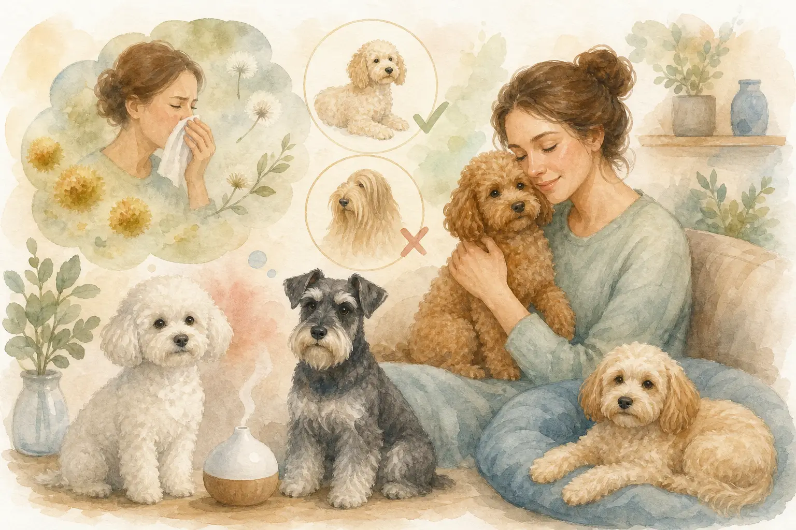
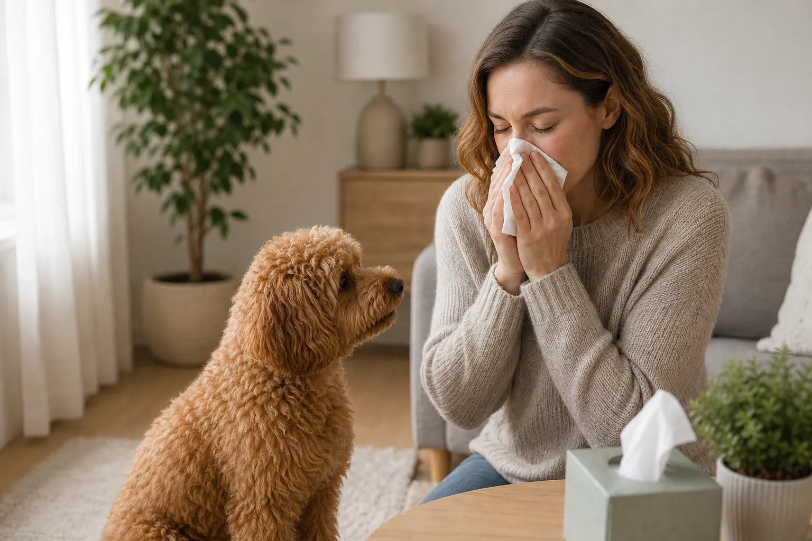
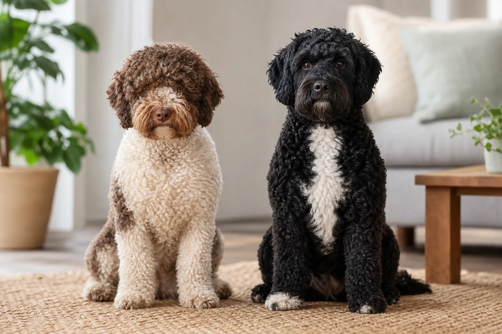
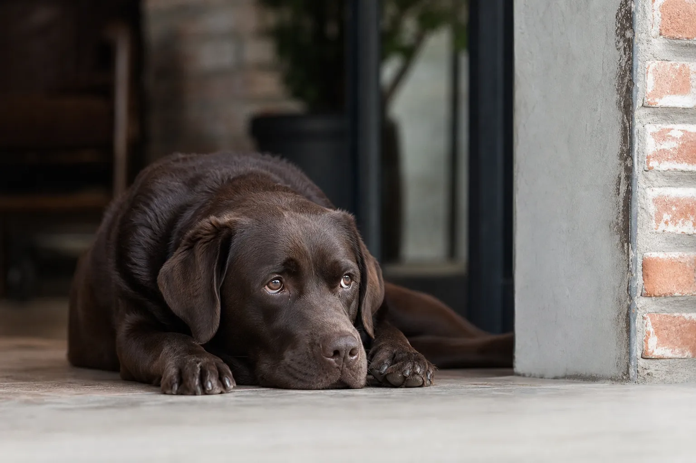

Mit dem richtigen allergiker hund ist ein Leben mit Hund trotz Allergie für viele Menschen möglich. Entscheidend ist nicht, ob ein Hund Fell hat, sondern wie viel des Allergens Can f 1 er in seiner Umgebung verteilt. Wer die biologischen Hintergründe kennt und gezielt nach allergikerfreundlichen Hunderassen sucht, kann die Allergenbelastung im Alltag deutlich senken.

Dieser Artikel erklärt, was hinter dem Begriff "hypoallergen" wirklich steckt, welche Hunderassen für Allergiker geeignet sind, was Mischlinge wie der Labradoodle taugen und wie du den passenden Hund sicher findest. Außerdem bekommst du konkrete Tipps, wie du die Allergenbelastung in deinem Zuhause dauerhaft niedrig hältst.

## Hundeallergie: Was steckt wirklich dahinter?

Zusammenfassung: Hundeallergie verstehen

<ul>
<li><strong>Nicht das Fell ist das Problem</strong> — das Allergen Can f 1 steckt in Speichel, Urin und Hautschuppen des Hundes.</li>
<li><strong>Alle Hunde produzieren Can f 1</strong> — es gibt keine allergenfreie Rasse, nur Rassen mit geringerer Ausschüttung.</li>
<li><strong>Symptome reichen von Niesen bis Asthma</strong> — eine Diagnose durch den Allergologen ist vor der Anschaffung Pflicht.</li>
<li><strong>Individuelle Unterschiede sind groß</strong> — auch innerhalb einer Rasse variiert die Allergenproduktion erheblich.</li>
</ul>

Viele Menschen glauben, sie seien allergisch gegen Hundehaare. Das ist so nicht ganz richtig. Laut dem [Deutschen Allergie- und Asthmabund (DAAB)](https://www.daab.de/) reagieren Betroffene nicht auf das Haar selbst, sondern auf Proteine, die der Hund über Speichel, Urin und abgeschilferte Hautzellen (Dander) abgibt. Das Fell transportiert diese Proteine lediglich in die Umgebung.

Rund 10 % der deutschen Bevölkerung sind nach Angaben des [Umweltbundesamts](https://www.umweltbundesamt.de/) gegen Tierhaare sensibilisiert. Hunde sind nach Katzen der häufigste Auslöser von Tierallergien. Wer also mit dem Gedanken spielt, einen Hund anzuschaffen, sollte zuerst verstehen, was genau die allergische Reaktion auslöst.

### Can f 1: Das eigentliche Allergen beim Hund

Das Hauptallergen beim Hund heißt Can f 1. Es handelt sich um ein Protein, das in Speicheldrüsen, Talgdrüsen der Haut und im Urin des Hundes gebildet wird. Wenn der Hund sich leckt, verteilt er Can f 1 auf seinem Fell. Von dort gelangt es als winzige Partikel in die Raumluft und auf Oberflächen.

Forschungen der [Veterinärmedizinischen Universität Wien](https://www.vetmeduni.ac.at/) zeigen, dass die Menge des produzierten Can f 1 zwischen einzelnen Hunden, aber auch zwischen Rassen, deutlich variiert. Das ist die wissenschaftliche Grundlage dafür, dass manche Rassen als allergikerfreundlicher gelten als andere. Neben Can f 1 gibt es weitere Hundeallergene (Can f 2 bis Can f 7), aber Can f 1 ist für etwa 50 bis 75 % aller Reaktionen verantwortlich.

### Symptome einer Hundehaarallergie erkennen

Eine allergische Reaktion auf Hunde äußert sich typischerweise durch tränende, juckende Augen, Niesen, laufende oder verstopfte Nase und Hautreizungen nach direktem Kontakt. In schwereren Fällen kann es zu Atemnot, Asthmaanfällen oder Nesselsucht kommen.

Entscheidend: Die Symptome treten oft nicht sofort auf, sondern erst nach wiederholtem Kontakt oder wenn die Allergenkonzentration in der Wohnung über Wochen ansteigt. Ein Allergologe kann per Pricktest oder IgE-Bluttest feststellen, ob tatsächlich eine Sensibilisierung gegen Can f 1 vorliegt. Diese Diagnose sollte vor jeder Rassenentscheidung stehen.

## Hypoallergene Hunde: Mythos oder Wahrheit?

Der Begriff "hypoallergen" ist weit verbreitet, aber oft missverstanden. Er verspricht mehr, als er halten kann, und trotzdem steckt ein wahrer Kern dahinter.

### Was 'hypoallergen' wirklich bedeutet

"Hypoallergen" bedeutet wörtlich "weniger allergen", nicht "allergiefrei". Kein Hund auf der Welt produziert null Can f 1. Was sich zwischen Rassen unterscheidet, ist die Menge des Allergens, die in der Umgebung landet. Hunde, die kaum haaren, verbreiten weniger Fell und damit weniger gebundene Allergene in Wohnung und Kleidung. Rassen mit dichtem Unterwolle-Wechsel schleudern dagegen regelmäßig große Mengen Fell, Dander und Speichelrückstände in die Luft.

Anti-allergiker Hunde im eigentlichen Sinne gibt es also nicht. Wohl aber Rassen, die für viele Allergiker deutlich besser verträglich sind, weil sie weniger Allergene in die Umgebung abgeben. Ob ein konkreter Hund für einen bestimmten Allergiker verträglich ist, lässt sich nur durch direkten Probekontakt herausfinden.

### Hunde, die nicht haaren: Weniger Allergene, aber kein Nullrisiko

Hunde, die nicht haaren oder sehr wenig haaren, haben oft ein kontinuierlich wachsendes Fell ohne ausgeprägten Haarwechsel. Typische Vertreter sind Pudel, Bichon Frisé und Yorkshire Terrier. Ihr Fell wächst ähnlich wie menschliches Haar und fällt nicht in Schüben aus.

Das reduziert die Menge an Fell in der Wohnung erheblich. Weil weniger Fell auf Möbeln, Teppichen und in der Luft landet, sinkt auch die Allergenkonzentration. Trotzdem: Speichel und Hautschuppen bleiben als Allergenquellen bestehen. Allergiker hunde, die nicht haaren, sind also deutlich besser verträglich, aber kein Freifahrtschein.

~10 %

der Deutschen sind gegen Tierhaare sensibilisiert

Can f 1

Hauptallergen, verantwortlich für 50–75 % aller Reaktionen

7

bekannte Hundeallergene (Can f 1 bis Can f 7)

0

Rassen mit garantierter Allergenfreiheit

## Die besten Hunderassen für Allergiker – nach Größe sortiert

🐩

Klein

Pudel (Toy/Zwerg), Yorkshire Terrier, Bichon Frisé – kaum Haarausfall, pflegeleicht

🐕

Mittelgroß

Lagotto Romagnolo, Portugiesischer Wasserhund – aktiv, robust, wenig Allergenausstoß

🐾

Groß

Afghanischer Windhund, Riesenschnauzer – für Allergiker mit Platz und Erfahrung

🔬

Wichtig

Immer Probekontakt vor der Anschaffung – individuelle Verträglichkeit variiert stark

Die folgende Übersicht zeigt bewährte allergiker hunderassen nach Größe sortiert. Eine Tabelle gibt dir einen schnellen Überblick über die wichtigsten Eigenschaften.

| Rasse | Größe | Haartyp | Allergenrisiko | Pflegeaufwand |
|---|---|---|---|---|
| Pudel (Toy/Zwerg) | Klein | Lockig, kein Unterwolle-Wechsel | Sehr gering | Hoch (Scheren) |
| Yorkshire Terrier | Klein | Seidig, kaum Haarwechsel | Gering | Mittel |
| Bichon Frisé | Klein | Lockig-wellig, kaum Haarwechsel | Gering | Hoch |
| Lagotto Romagnolo | Mittel | Lockig, dichtes Fell | Gering | Mittel |
| Portugiesischer Wasserhund | Mittel | Lockig oder wellig | Gering | Mittel-hoch |
| Afghanischer Windhund | Groß | Lang, seidig, wenig Unterwolle | Mittel-gering | Hoch |
| Riesenschnauzer | Groß | Hartes Deckhaar, wenig Haarverlust | Gering | Mittel |

### Kleine Allergiker Hunde: Pudel, Yorkshire Terrier & Bichon Frisé

Der Pudel ist unter kleinen allergiker hunden die erste Wahl. Toy-Pudel und Zwergpudel haaren kaum, weil ihr Fell kontinuierlich wächst und nicht in Schüben ausfällt. Das lockige Fell bindet Dander und Speichelrückstände, statt sie in die Luft zu schleudern. Allerdings braucht das Fell regelmäßige Pflege und muss alle sechs bis acht Wochen geschoren werden.

Der Yorkshire Terrier hat ein seidiges, dem menschlichen Haar ähnliches Fell ohne Unterwolle. Er haart kaum und gilt als einer der verträglichsten kleinen Hunde für Allergiker. Sein lebhaftes Temperament und die kompakte Größe machen ihn ideal für Wohnungen. Mehr zu [kleinen Hunderassen](https://hundewissen-mit-kopf.de/hunderassen/kleine-hunderassen/) findest du in unserem Rassenüberblick.

Der Bichon Frisé ist ein weiterer Klassiker unter den kleinen allergiker hunden. Sein dichtes, lockiges Fell wächst kontinuierlich und fällt nicht aus. Er ist freundlich, unkompliziert und eignet sich gut für Familien. Auch beim Bichon Frisé ist regelmäßiges Bürsten und Scheren unerlässlich, um das Fell sauber und allergenarm zu halten.

### Mittelgroße Allergikerhunde: Lagotto Romagnolo & Portugiesischer Wasserhund

Der Lagotto Romagnolo ist ursprünglich ein italienischer Trüffelhund mit dichtem, lockigem Fell. Er haart sehr wenig und gilt als robust und lernfreudig. Seine mittlere Größe von etwa 13 bis 16 Kilogramm macht ihn vielseitig einsetzbar. Für Allergiker ist er eine hervorragende Wahl, sofern das Fell regelmäßig gepflegt wird.

Der Portugiesische Wasserhund wurde weltbekannt, als US-Präsident Obama ihn wegen der Allergie seiner Töchter ins Weiße Haus holte. Sein lockiges oder welliges Fell haart kaum. Er ist aktiv, wasserfest und braucht viel Bewegung. Mit etwa 16 bis 25 Kilogramm ist er ein mittelgroßer, sportlicher Begleiter, der sich für aktive Allergiker bestens eignet.

### Große Allergiker Hunde: Afghanischer Windhund & Co.

Große allergiker hunde sind seltener, aber durchaus vorhanden. Der Afghanische Windhund hat ein langes, seidiges Fell mit wenig Unterwolle. Er haart moderat, und seine Allergenproduktion gilt als vergleichsweise gering. Allerdings ist sein Pflegeaufwand enorm, und er ist kein Hund für Anfänger.

Der Riesenschnauzer ist eine weitere Option für Allergiker, die einen großen Hund bevorzugen. Sein hartes Deckhaar verliert sich kaum, und er haart deutlich weniger als viele andere große Rassen. Auch der Standard-Schnauzer und der Zwergschnauzer gehören zur gleichen Gruppe und bieten ähnliche Vorteile in kleineren Größen.

## Allergiker Hunde Mischlinge: Labradoodle, Cockapoo & Co.

Allergiker hunde mischlinge liegen im Trend. Besonders Kreuzungen mit Pudeln versprechen das Beste aus zwei Welten: das allergikerfreundliche Fell des Pudels kombiniert mit dem Wesen einer anderen Rasse. Die Realität ist jedoch komplizierter.

### Labradoodle als Allergikerhund: Was steckt hinter dem Hype?

Der Labradoodle ist eine Kreuzung aus Labrador Retriever und Pudel. Die Idee dahinter: Der Labrador bringt Führhundqualitäten, der Pudel das allergikerfreundliche Fell. In der Praxis ist das Ergebnis genetisch nicht vorhersehbar. Labradoodle allergiker hunde können ein pudel-ähnliches Fell mit wenig Haarausfall haben, aber genauso gut das dichte, stark haarende Fell des Labradors erben.

Selbst innerhalb eines Wurfs können die Welpen stark unterschiedliche Felltypen zeigen. Wer einen Labradoodle als Allergikerhund anschaffen möchte, sollte unbedingt mehrfach Probekontakt mit dem konkreten Tier haben, bevor er sich entscheidet. Ein Gentest auf Fellstruktur kann zusätzliche Hinweise liefern, ersetzt aber den persönlichen Test nicht.

### Cockapoo und andere Pudel-Mischlinge für Allergiker

Der [Cockapoo](https://hundewissen-mit-kopf.de/hunderassen/cockapoo/) ist eine Kreuzung aus Cocker Spaniel und Pudel. Er ist lebhaft, anhänglich und hat oft ein lockiges Fell mit geringem Haarausfall. Ähnlich wie beim Labradoodle gilt jedoch: Die Fellvererbung ist nicht garantiert. Welpen aus F1-Kreuzungen (erste Generation) zeigen die größte Variabilität.

Weitere beliebte Pudel-Mischlinge für Allergiker sind der Goldendoodle (Golden Retriever x Pudel), der Maltipoo (Malteser x Pudel) und der Schnoodle (Schnauzer x Pudel). Bei allen gilt die gleiche Grundregel: Probekontakt ist Pflicht, und der Züchter sollte seriös arbeiten und Gesundheitstests vorlegen können.

Vorteile von Pudel-Mischlingen

<ul>
<li>Oft lockiges Fell mit geringem Haarausfall</li>
<li>Häufig freundliches, soziales Wesen</li>
<li>Viele Größenvarianten verfügbar</li>
<li>Oft sehr lernfreudig und anpassungsfähig</li>
</ul>

Nachteile von Pudel-Mischlingen

<ul>
<li>Fellvererbung genetisch nicht vorhersehbar</li>
<li>Keine Rassestandards, große Qualitätsunterschiede</li>
<li>Viele unseriöse Züchter auf dem Markt</li>
<li>Kein Nachweis über Allergieverträglichkeit ohne Probekontakt</li>
</ul>

## Weniger geeignete Rassen: Warum Labrador & Co. problematisch sind

⚠️

<strong>Hinweis für Allergiker</strong>

Dieser Abschnitt nennt Rassen, die für die meisten Allergiker ungeeignet sind. Bei bereits bestehender Sensibilisierung gegen Can f 1 sollte der Kontakt mit diesen Hunden nach Möglichkeit gemieden werden, bis eine allergologische Diagnose vorliegt.

Nicht alle Hunderassen sind für Allergiker geeignet. Einige Rassen haaren stark, haben dichte Unterwolle und produzieren nachweislich hohe Mengen an Can f 1. Für Allergiker sind sie in der Regel keine gute Wahl, auch wenn sie in vielen anderen Eigenschaften ideal wären.

### Starke Haarer und hohe Can-f-1-Ausschütter im Überblick

Der Labrador Retriever ist einer der beliebtesten Hunde Deutschlands, aber für Allergiker oft problematisch. Er haart das ganze Jahr über stark und wechselt zweimal jährlich intensiv das Fell. Sein dichtes Doppelfall verteilt Dander und Allergene großflächig in der Wohnung. Ähnliches gilt für den Golden Retriever, der zusätzlich durch sein langes Fell noch mehr Oberfläche für Allergenanlagerung bietet.

Der Deutsche Schäferhund, Husky und Samojede sind weitere Rassen mit starkem Haarwechsel und hoher Allergenproduktion. Der Samojede gilt dabei als besonders intensiver Haarer. Auch Boxer, Deutsche Dogge und viele Terrier-Rassen mit kurzem Fell sollten Allergiker nicht unterschätzen: Kurzes Fell bedeutet nicht automatisch weniger Allergene, da Dander und Speichel unabhängig von der Felllänge verbreitet werden.

| Rasse | Haarwechsel | Allergenrisiko | Empfehlung für Allergiker |
|---|---|---|---|
| Labrador Retriever | Stark, ganzjährig | Hoch | Nicht geeignet |
| Golden Retriever | Stark, saisonal | Hoch | Nicht geeignet |
| Deutscher Schäferhund | Sehr stark | Sehr hoch | Nicht geeignet |
| Husky | Stark, saisonal | Hoch | Nicht geeignet |
| Samojede | Extrem stark | Sehr hoch | Nicht geeignet |
| Boxer | Gering | Mittel-hoch | Bedingt geeignet |

Wer sich für eine [Hunderasse für Anfänger](https://hundewissen-mit-kopf.de/hunderassen/hunderasse-fuer-anfaenger/) interessiert und gleichzeitig Allergiker ist, sollte die Rassenwahl besonders sorgfältig treffen, da viele anfängerfreundliche Rassen wie der Labrador zu den stärkeren Allergenausschüttern gehören.

## Allergiker Hunde kaufen oder adoptieren: So gehst du vor

1

Allergologische Diagnose

Pricktest oder IgE-Bluttest beim Allergologen durchführen lassen, bevor du dich für eine Rasse entscheidest.

2

Rasse eingrenzen

Anhand deiner Diagnose und deines Lebensstils eine Vorauswahl an geeigneten Rassen treffen.

3

Probekontakt

Mehrfach und über mehrere Stunden Kontakt mit dem konkreten Hund aufnehmen, idealerweise in seiner gewohnten Umgebung.

4

Seriösen Züchter wählen

Auf VDH-Mitgliedschaft, Gesundheitstests und transparente Zuchtbedingungen achten.

✓

Entscheidung treffen

Erst nach positivem Probekontakt und gesicherter Diagnose den Hund anschaffen.

Wer hunde für allergiker geeignet sucht, sollte niemals impulsiv handeln. Die Anschaffung eines Hundes ist eine Entscheidung für zehn bis fünfzehn Jahre. Ein allergischer Rückschlag nach wenigen Monaten ist für Mensch und Tier gleichermaßen belastend.

### Probekontakt und Allergietest vor der Anschaffung

Der Probekontakt ist das wichtigste Instrument bei der Wahl eines allergiker hundes. Besuche den Züchter oder das Tierheim mehrfach und halte dich jeweils mindestens zwei bis drei Stunden in der Umgebung des Hundes auf. Allergische Reaktionen auf Can f 1 treten manchmal erst nach längerem Kontakt oder nach mehreren Besuchen auf, wenn sich die Allergenkonzentration in deiner Kleidung aufgebaut hat.

Bitte den Züchter, dir den konkreten Welpen oder Hund auf den Arm zu legen und lass ihn dich ablecken. So testest du nicht nur das Fell, sondern auch den Speichel als Allergenquelle direkt. Wenn du nach dem Besuch Symptome entwickelst, ist das ein klares Signal. Wenn du symptomfrei bleibst, ist das ein gutes Zeichen, aber noch keine Garantie für den dauerhaften Alltag.

### Seriöse Züchter und Tierheime für Allergikerhunde finden

Beim allergiker hunde kaufen ist die Wahl des Züchters entscheidend. Seriöse Züchter sind Mitglied im Verband für das Deutsche Hundewesen (VDH) und legen Gesundheitszertifikate für beide Elterntiere vor. Sie erlauben mehrfache Besuche vor der Abgabe und stehen auch nach dem Kauf als Ansprechpartner zur Verfügung.

Auch Tierheime können eine Option sein. Manche Tierheime haben speziell auf Allergiker ausgerichtete Vermittlungsprogramme. Wichtig ist hier, dass du genügend Zeit für Probekontakte bekommst. Rassehunde-Schutzvereine für Pudel, Bichon Frisé oder Portugiesische Wasserhunde vermitteln zudem regelmäßig Hunde in Not, die auf ein neues Zuhause warten.

## Alltag mit Allergiker Hunden: So reduzierst du Allergene im Haushalt

Selbst mit einer allergikerfreundlichen Rasse ist die Allergenbelastung im Haushalt nicht automatisch null. Wer konsequent auf Hygiene und Raumluft achtet, kann die Beschwerden jedoch auf ein Minimum reduzieren.

### Fellpflege und regelmäßiges Bürsten als Schlüsselmaßnahme

Regelmäßige [Fellpflege beim Hund](https://hundewissen-mit-kopf.de/hundepflege/fellpflege-hund/) ist für Allergiker keine Kür, sondern Pflicht. Durch regelmäßiges [Hund bürsten](https://hundewissen-mit-kopf.de/hundepflege/hund-buersten/) werden loses Fell, Dander und Speichelrückstände entfernt, bevor sie sich in der Wohnung verteilen. Wichtig: Das Bürsten sollte immer im Freien oder zumindest in einem gut belüfteten Raum stattfinden, nicht im Wohnzimmer.

Hunde mit lockigem Fell wie Pudel oder Bichon Frisé sollten alle vier bis sechs Wochen professionell geschoren werden. Das verhindert, dass sich Dander und Schmutz im Fell ansammeln. Regelmäßiges Baden des Hundes alle vier bis sechs Wochen mit einem milden Hundeshampoo reduziert die Allergenbelastung auf dem Fell zusätzlich nachweislich, wie die Bundeszentrale für gesundheitliche Aufklärung in ihren Empfehlungen zu Tierallergien betont.

### Wohnung, Ernährung und Tierarzt: Weitere Tipps für Allergiker

Neben der Fellpflege gibt es weitere Maßnahmen, die den Alltag mit allergikerfreundlichen Hunden deutlich erleichtern. HEPA-Luftfilter in Wohn- und Schlafräumen filtern Allergenpartikel aus der Luft. Das Schlafzimmer sollte konsequent hundefrei bleiben, da der Mensch dort die meiste Zeit verbringt und eine nächtliche Allergenbelastung besonders belastend ist.

Häufiges Staubsaugen mit HEPA-Filter, glatte Böden statt Teppichen und waschbare Hundedecken reduzieren die Allergenreservoire in der Wohnung. Bei anhaltenden Beschwerden ist eine Hyposensibilisierung beim Allergologen eine wirksame Langzeitoption. Laut [Stiftung Warentest](https://www.test.de/) zeigt die spezifische Immuntherapie bei Tierhaarallergien in vielen Fällen gute Erfolge.

✅ Allergen-Checkliste für den Hundehaushalt

✓

Hund regelmäßig bürsten (außerhalb der Wohnung)

✓

Fell alle 4–6 Wochen scheren oder waschen lassen

✓

HEPA-Luftfilter in Wohn- und Schlafräumen aufstellen

✓

Schlafzimmer konsequent hundefrei halten

✓

Täglich staubsaugen mit HEPA-Filter

✓

Teppiche durch glatte Böden ersetzen

Hyposensibilisierung beim Allergologen besprechen

Hundedecken und Liegeplätze wöchentlich waschen

## Fazit: Welcher Allergiker Hund passt zu dir?

Ein Leben mit Hund trotz Allergie ist für viele Menschen möglich, wenn die Rassenentscheidung fundiert und sorgfältig getroffen wird. Pudel, Bichon Frisé, Yorkshire Terrier, Lagotto Romagnolo und der Portugiesische Wasserhund gehören zu den bewährtesten allergiker hunden, weil sie wenig haaren und vergleichsweise geringe Mengen an Can f 1 verbreiten.

Wichtig bleibt: Eine allergologische Diagnose vor der Anschaffung ist unverzichtbar. Probekontakte mit dem konkreten Tier ersetzen keine Rassen-Faustregeln. Und auch mit der besten Rasse braucht es konsequente Fellpflege und Haushaltshygiene, um die Allergenbelastung dauerhaft niedrig zu halten.

Wer diese Schritte geht, hat gute Chancen, einen treuen Begleiter zu finden, der das Leben bereichert, ohne die Gesundheit zu belasten.