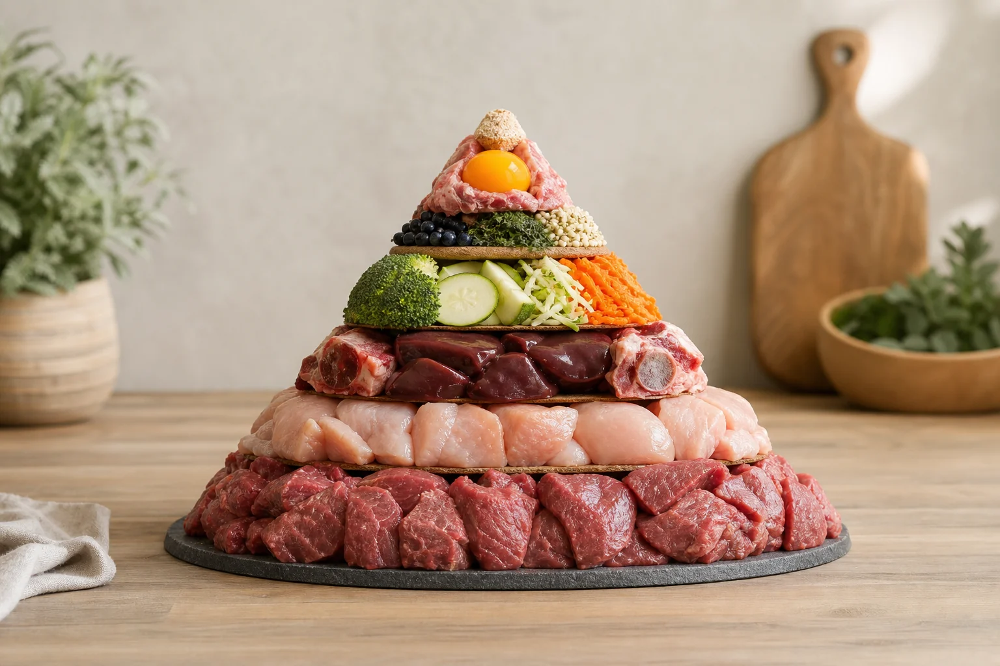

Mit dem richtigen BARF-Rechner für Hunde lässt sich die tägliche Ration präzise planen, statt nach Gefühl zu füttern. BARF steht für „Biologisch Artgerechtes Rohes Futter" und beschreibt eine Ernährungsform, bei der Hunde rohes Fleisch, Knochen, Innereien und pflanzliche Zutaten in definierten Mengenverhältnissen erhalten. Die Berechnung klingt zunächst aufwendig, folgt aber klaren Regeln.

Dieser Artikel erklärt, wie der BARF-Rechner funktioniert, welche Prozentwerte für welche Hunde gelten, wie Sonderfälle wie Welpen, Senioren und kastrierte Hunde berechnet werden und welche Fehler beim Barfen am häufigsten auftreten. Wer lieber kocht statt barft, findet in unserem Ratgeber zum Thema [Hundefutter selber kochen](https://hundewissen-mit-kopf.de/hundeernaehrung/hundefutter-selber-kochen/) eine gute Alternative.

## Was ist BARF – und warum lohnt sich das Barfen?

Zusammenfassung: BARF für Hunde

<ul>
<li><strong>BARF = Rohfütterung</strong> mit Fleisch, Knochen, Innereien und pflanzlichen Zutaten in festen Mengenverhältnissen</li>
<li><strong>Tagesration</strong> beträgt 2–3 % des Körpergewichts für ausgewachsene, normal aktive Hunde</li>
<li><strong>BARF-Rechner</strong> vereinfachen die Berechnung und berücksichtigen Aktivität, Alter und Sonderfälle</li>
<li><strong>Regelmäßige Kontrolle</strong> ist Pflicht – bei Gewichtsveränderung oder Lebensumständen die Ration neu berechnen</li>
</ul>

### Barfen: Rohfütterung nach dem Vorbild der Natur

Barfen orientiert sich an der natürlichen Ernährung von Wölfen und wilden Hunden. Die Grundidee: Ein Hund ist anatomisch und physiologisch auf die Verdauung von rohem Fleisch, Knochen und Organen ausgerichtet. Der kurze Verdauungstrakt, die stark saure Magensäure und die spezifische Darmflora sind evolutionäre Anpassungen an eine fleischbasierte Rohkost-Ernährung.

Beim Barfen werden keine industriell verarbeiteten Zutaten eingesetzt. Stattdessen kombiniert der Hundehalter frische, rohstofflich kontrollierte Komponenten zu einer bedarfsgerechten Tagesration. Die [Veterinärmedizinische Universität Wien (Vetmeduni)](https://www.vetmeduni.ac.at/) hat in mehreren Ernährungsstudien gezeigt, dass Rohfütterung bei korrekter Zusammensetzung ernährungsphysiologisch vollwertig sein kann. Entscheidend ist dabei die exakte Berechnung der Mengenverhältnisse.

### Vorteile einer ausgewogenen BARF-Ernährung für Hunde

Eine ausgewogene Ernährung durch BARF kann sich positiv auf Fell, Zähne, Verdauung und Gewicht auswirken. Viele Hundehalter berichten von einem glänzenderen Fell, festem Kot und einem gesünderen Körpergewicht nach dem Umstieg auf Rohfütterung. Hinzu kommt die volle Kontrolle über alle Zutaten, was besonders bei Hunden mit Futtermittelunverträglichkeiten hilfreich ist.

Gegenüber Fertigfutter bietet BARF außerdem keine versteckten Zusatzstoffe, Konservierungsmittel oder minderwertige Fleischnebenprodukte. Wer sich für die Qualität von Fertigfutter interessiert, findet im Vergleich zum [besten Hundefutter](https://hundewissen-mit-kopf.de/hundeernaehrung/bestes-hundefutter/) eine gute Orientierung. Der entscheidende Nachteil von BARF liegt im höheren Planungsaufwand, der sich mit einem guten BARF-Rechner jedoch deutlich reduzieren lässt.

## Die BARF-Futterpyramide: Zusammensetzung mit konkreten Prozentwerten

### Muskelfleisch, Knochen und Innereien: Die Basis jeder BARF-Ration

Die Grundlage jeder BARF-Ration bildet Muskelfleisch, das etwa 60 bis 70 Prozent der Gesamtration ausmacht. Knochen, genauer gesagt fleischtragende Rohknochen, stellen 15 bis 20 Prozent der Tagesration dar und liefern Kalzium sowie Phosphor in einem natürlichen Verhältnis. Innereien machen 10 bis 15 Prozent aus, wobei Leber maximal 5 Prozent der Gesamtmenge betragen sollte, da sie extrem reich an Vitamin A ist.

Das Kalzium-Phosphor-Verhältnis ist beim Barfen besonders wichtig. Laut den Ernährungsempfehlungen der [Bundestierärztekammer](https://www.bundestieraerztekammer.de/) sollte es bei Hunden zwischen 1,2:1 und 1,8:1 liegen. Rohknochen erfüllen diese Anforderung von Natur aus, solange sie in der richtigen Menge gefüttert werden. Wer auf Knochen verzichtet, muss Kalzium separat supplementieren, zum Beispiel durch Eierschalenpulver.

Das Fleisch sollte möglichst aus verschiedenen Tierarten stammen. Rind, Geflügel, Lamm, Pferdefleisch und Wild liefern unterschiedliche Aminosäurenprofile und Spurenelemente. Ein abwechslungsreicher Wochenplan ist ernährungsphysiologisch besser als die immer gleiche Fleischsorte.

### Gemüse, Obst und Zusätze: Der pflanzliche Anteil beim Barfen

Der pflanzliche Anteil beim Barfen liegt üblicherweise bei 15 bis 20 Prozent der Gesamtration. Hunde können pflanzliche Nährstoffe nur begrenzt verwerten, weshalb Gemüse und Obst püriert oder leicht gedünstet angeboten werden sollten, damit die Zellwände aufgebrochen sind. Geeignet sind unter anderem Zucchini, Karotten, Brokkoli, Spinat und Kürbis.

Obst eignet sich in kleinen Mengen als Ergänzung. Äpfel zum Beispiel sind gut verträglich und liefern Pektine sowie Vitamine. Mehr dazu, welche Früchte für Hunde geeignet sind, erklärt unser Artikel [dürfen Hunde Äpfel essen](https://hundewissen-mit-kopf.de/hundeernaehrung/duerfen-hunde-aepfel-essen/). Zwiebeln, Weintrauben und Avocado sind dagegen giftig und haben in der BARF-Ration nichts zu suchen. Ergänzend kommen je nach individuellem Bedarf Lachsöl, Grünlippmuschelpulver oder Bierhefe hinzu.

60–70 %

Muskelfleisch

15–20 %

Rohknochen

10–15 %

Innereien

15–20 %

Gemüse & Obst

## BARF-Rechner für Hunde: So funktioniert die Berechnung

### Grundformel: Tagesration in Prozent des Körpergewichts (kg)

Die Grundformel für den BARF-Rechner ist simpel: Tagesration (g) = Körpergewicht (kg) × Prozentwert × 10. Ein 25-kg-Hund mit normalem Aktivitätslevel und einem Prozentwert von 2,5 Prozent benötigt also 625 g BARF täglich. Der Prozentwert variiert je nach Aktivitätslevel zwischen 1,5 und 3,5 Prozent.

| Aktivitätslevel | Prozentwert | Beispiel 20 kg | Beispiel 35 kg |
|---|---|---|---|
| Sehr ruhig / übergewichtig | 1,5 % | 300 g | 525 g |
| Wenig aktiv | 2,0 % | 400 g | 700 g |
| Normal aktiv | 2,5 % | 500 g | 875 g |
| Sehr aktiv / Arbeitshund | 3,0–3,5 % | 600–700 g | 1050–1225 g |

Entscheidend ist, dass immer das **Idealgewicht** und nicht das aktuelle Gewicht als Berechnungsgrundlage dient. Ein übergewichtiger Hund, der eigentlich 20 kg wiegen sollte, aber 24 kg auf die Waage bringt, bekommt die Ration für 20 kg berechnet. So wird aktiv Gewicht reduziert, ohne den Hund zu unterversorgen.

### Fettrechner BARF: Warum der Fettgehalt separat berechnet werden sollte

Der Fettgehalt der BARF-Ration beeinflusst maßgeblich die Energiedichte und damit das Körpergewicht des Hundes. Fettarmes Fleisch wie Pferdefleisch oder Hühnerbrustfleisch enthält weniger als 5 Prozent Fett, während Rinderhack oder Lammfleisch 15 bis 25 Prozent Fett enthalten kann. Wer ausschließlich fettreiche Fleischsorten füttert, überversorgt den Hund mit Energie, auch wenn die Grammzahl rechnerisch stimmt.

Ein Fettrechner für BARF berechnet den tatsächlichen Fettgehalt der zusammengestellten Ration und zeigt, ob der Anteil im empfohlenen Bereich von 10 bis 20 Prozent der Trockenmasse liegt. Besonders bei Hunden, die zur Gewichtszunahme neigen, ist diese separate Berechnung sinnvoll. Viele Online-BARF-Rechner integrieren die Fettberechnung bereits automatisch.

### Kostenloser BARF-Rechner online: Barfgold, BARF Check und Co. im Überblick

Wer den BARF-Rechner nicht manuell anwenden möchte, findet online mehrere kostenlose Tools. Barfgold bietet einen umfangreichen BARF-Rechner, der Gewicht, Aktivitätslevel und Lebensphase berücksichtigt und direkt eine Komponentenverteilung ausgibt. BARF Check ist ebenfalls ein verbreitetes Tool und ermöglicht zusätzlich die Analyse einzelner Zutaten auf Nährstoffbasis.

Beide Tools eignen sich als Einstieg, ersetzen aber keine individuelle Beratung durch eine Tierärztin oder einen Tierarzt mit Ernährungsspezialisierung, besonders bei Hunden mit Vorerkrankungen. Für Hunde ohne besondere gesundheitliche Einschränkungen liefern die kostenlosen Rechner eine solide Grundlage für die tägliche Planung. Wer auf [getreidefreies Hundefutter](https://hundewissen-mit-kopf.de/hundeernaehrung/getreidefreies-hundefutter/) umsteigen möchte, kann BARF als natürlich getreidefreie Alternative in Betracht ziehen.

1

Idealgewicht bestimmen

Körpergewicht des Hundes bei normalem Ernährungszustand festlegen – nicht das aktuelle Gewicht bei Übergewicht.

2

Prozentwert wählen

Aktivitätslevel einschätzen und den passenden Prozentwert (1,5–3,5 %) auswählen.

3

Tagesration berechnen

Formel anwenden: kg × Prozentwert × 10 = Tagesration in Gramm.

4

Komponenten aufteilen

Tagesration auf Fleisch, Knochen, Innereien und Gemüse nach den Prozentvorgaben aufteilen.

✓

Wochenplan erstellen

Tagesrationen für die Woche vorausplanen, abwiegen und portioniert einfrieren.

## Manuelle Berechnung der BARF-Ration: Schritt für Schritt ohne Tool

### Schritt 1: Idealgewicht und Aktivitätslevel bestimmen

Bevor die Ration berechnet werden kann, muss das Idealgewicht des Hundes feststehen. Bei einem normalgewichtigen Hund entspricht das dem aktuellen Gewicht. Bei übergewichtigen Hunden gilt das Zielgewicht als Berechnungsgrundlage, bei untergewichtigen Hunden wird hingegen das aktuelle Gewicht verwendet, um den Aufbau zu unterstützen.

Das Aktivitätslevel teilt sich grob in vier Kategorien ein: sehr ruhig (Stubenhocker, Senior), wenig aktiv (tägliche Spaziergänge), normal aktiv (regelmäßige Bewegung, Spiel) und sehr aktiv (Agility, Hütehund, Jagdhund). Für die meisten Familienhunde gilt der Prozentwert von 2 bis 2,5 Prozent als guter Ausgangspunkt.

### Schritt 2: Tagesbedarf und Komponentenverteilung ausrechnen

Mit dem Idealgewicht und dem Prozentwert lässt sich die Tagesration in wenigen Sekunden berechnen. Beispiel: Ein 15-kg-Hund mit normalem Aktivitätslevel und 2,5 Prozent benötigt 375 g täglich. Diese Gesamtmenge wird anschließend auf die Komponenten aufgeteilt.

| Komponente | Anteil | Beispiel 375 g/Tag |
|---|---|---|
| Muskelfleisch | 65 % | ca. 244 g |
| Rohknochen | 15 % | ca. 56 g |
| Innereien gesamt | 10 % | ca. 38 g (davon max. 19 g Leber) |
| Gemüse / Obst | 10 % | ca. 37 g |

Die Werte sind Richtwerte. Knochen können an manchen Tagen ganz, an anderen Tagen gar nicht gefüttert werden, solange der wöchentliche Durchschnitt stimmt. Viele Barfer planen nicht täglich, sondern auf Wochenbasis.

### Schritt 3: Wochenplan erstellen und Rationen abwiegen

Ein Wochenplan erleichtert die Umsetzung erheblich. Die Gesamtmenge für sieben Tage wird einmal berechnet, portioniert und eingefroren. So lassen sich auch verschiedene Fleischsorten und Knochenmahlzeiten sinnvoll über die Woche verteilen.

Für das Abwiegen ist eine Küchenwaage mit Gramm-Genauigkeit unverzichtbar. Schätzungen nach Augenmaß führen schnell zu Unter- oder Überversorgung. Besonders bei Knochen und Innereien, die in kleinen Mengen gefüttert werden, macht ein Gramm Unterschied langfristig einen erheblichen Unterschied in der Nährstoffbilanz.

✅ BARF-Ration berechnen: Checkliste

✓

Idealgewicht des Hundes festgelegt (nicht aktuelles Gewicht bei Über-/Untergewicht)

✓

Aktivitätslevel eingeschätzt und Prozentwert gewählt (1,5–3,5 %)

✓

Tagesration in Gramm berechnet (kg × % × 10)

✓

Komponentenverteilung aufgeteilt (Fleisch, Knochen, Innereien, Gemüse)

Wochenplan erstellt und Rationen portioniert eingefroren

Küchenwaage vorhanden und kalibriert

## BARF-Rechner für Sonderfälle: Welpen, Senioren und kastrierte Hunde

Höherer Bedarf

<ul>
<li>Welpen: 5–10 % des aktuellen Körpergewichts täglich</li>
<li>Sehr aktive Hunde / Arbeitshunde: bis 3,5 %</li>
<li>Tragende oder säugende Hündinnen: bis 4 %</li>
<li>Untergewichtige Hunde: aktuelles Gewicht als Basis</li>
</ul>

Reduzierter Bedarf

<ul>
<li>Senioren: 1,5–2 % des Idealgewichts</li>
<li>Kastrierte Hunde: 10–20 % Reduktion der Standardration</li>
<li>Übergewichtige Hunde: Zielgewicht als Berechnungsbasis</li>
<li>Sehr ruhige, inaktive Hunde: ab 1,5 %</li>
</ul>

### BARF-Rechner Hund Welpe: Höherer Bedarf in der Wachstumsphase

Welpen befinden sich in einer intensiven Wachstumsphase und benötigen deutlich mehr Energie und Nährstoffe als ausgewachsene Hunde. Der BARF-Rechner für Hundewelpen arbeitet mit 5 bis 10 Prozent des aktuellen Körpergewichts täglich, wobei kleine Rassen eher am oberen Ende liegen. Die Ration wird auf drei bis vier Mahlzeiten pro Tag aufgeteilt.

Besonders wichtig ist beim Welpen-BARF das Kalzium-Phosphor-Verhältnis. Zu viel Kalzium kann bei großen Rassen zu Skelettfehlentwicklungen führen, zu wenig beeinträchtigt den Knochenaufbau. Wer einen Welpen barf, sollte die Ration alle zwei bis vier Wochen neu berechnen, da das Gewicht schnell steigt. Mehr zur Entwicklung und Erziehung junger Hunde gibt es im Ratgeber zur [Welpenerziehung](https://hundewissen-mit-kopf.de/erziehung-verhalten/welpenerziehung/).

### BARF-Rechner Senior Hund: Angepasste Ration im Alter

Ab einem Alter von etwa sieben bis acht Jahren, bei großen Rassen früher, gilt ein Hund als Senior. Der BARF-Rechner für Senior Hunde arbeitet mit einem reduzierten Prozentwert von 1,5 bis 2 Prozent, da der Energiebedarf im Alter sinkt. Gleichzeitig sollte der Proteinanteil nicht drastisch gesenkt werden, denn ausreichend Protein erhält die Muskelmasse.

Fettarme, leicht verdauliche Fleischsorten wie Pferdefleisch oder Hühnerfleisch sind für Senioren besonders geeignet. Ergänzungen wie Grünlippmuschelpulver oder Fischöl können Gelenke und Herzfunktion unterstützen. Grundsätzlich gilt: Bei Senior-Hunden empfiehlt sich eine regelmäßige tierärztliche Kontrolle der Blutwerte, um die Ration bei nachlassender Nierenfunktion rechtzeitig anzupassen.

### BARF-Rechner kastrierter Hund: Kalorienreduktion richtig umsetzen

Nach der Kastration verändert sich der Hormonhaushalt des Hundes, was häufig zu einem geringeren Energiebedarf und einer erhöhten Neigung zu Übergewicht führt. Der BARF-Rechner für kastrierte Hunde empfiehlt eine Reduktion der Standardration um 10 bis 20 Prozent. Zusätzlich sollte der Fettanteil der Ration gesenkt werden, indem fettarme Fleischsorten bevorzugt werden.

Die Reduktion sollte schrittweise erfolgen und mit regelmäßigen Gewichtskontrollen begleitet werden. Wer den Fettgehalt der Ration separat berechnet, hat die Energiedichte besser im Griff. Laut Empfehlungen des [Bundesministeriums für Ernährung und Landwirtschaft (BMEL)](https://www.bmel.de/) sollte die Körperkondition von Heimtieren regelmäßig überprüft werden, um ernährungsbedingten Erkrankungen vorzubeugen.

## Wann muss die BARF-Ration neu berechnet werden?

### Gewichtsveränderung, Jahreszeit und Aktivitätslevel als Auslöser

Eine Neuberechnung der BARF-Ration ist immer dann nötig, wenn sich das Körpergewicht des Hundes um mehr als 10 Prozent verändert hat. Aber auch ohne Gewichtsveränderung können sich die Anforderungen verschieben. Im Winter bewegen sich viele Hunde weniger und benötigen weniger Energie, im Sommer dagegen kann erhöhter Flüssigkeitsbedarf und Hitzestress die Ration beeinflussen.

Ein Wechsel des Aktivitätslevels, zum Beispiel nach einer Verletzung oder dem Beginn eines neuen Sports wie Agility, zieht immer eine Anpassung des Prozentwerts nach sich. Als Faustregel gilt: mindestens alle drei Monate die Ration kurz überprüfen und bei Bedarf anpassen. Eine Küchenwaage und ein einfaches Protokoll der Wochenrationen helfen, Veränderungen frühzeitig zu erkennen.

### Krankheit und Unverträglichkeiten: Wann der Tierarzt die Ration anpassen sollte

Bei bestimmten Erkrankungen muss die BARF-Ration grundlegend überarbeitet werden. Nierenerkrankungen erfordern eine Phosphorreduktion, Lebererkrankungen eine Anpassung des Proteingehalts, und bei Pankreatitis ist eine fettarme Ernährung zwingend. In diesen Fällen reicht ein Online-BARF-Rechner nicht aus.

Futtermittelunverträglichkeiten zeigen sich häufig durch Durchfall, Juckreiz oder Hautprobleme. Dann ist eine Eliminationsdiät sinnvoll, bei der einzelne Proteinquellen gezielt ausgetauscht werden. Eine ausgewogene Ernährung trotz Einschränkungen sicherzustellen, ist eine Aufgabe für eine Tierärztin oder einen Tierarzt mit ernährungsmedizinischer Weiterbildung.

💡

<strong>Wann die BARF-Ration neu berechnen?</strong>

Mindestens alle drei Monate die Ration überprüfen. Sofortige Neuberechnung bei Gewichtsveränderung über 10 %, nach Kastration, bei Krankheit oder bei einem deutlichen Wechsel des Aktivitätslevels. Wer seinen Hund regelmäßig wiegt und ein einfaches Fütterungsprotokoll führt, erkennt Anpassungsbedarf frühzeitig.

## Häufige Fehler beim Barfen – und wie der BARF-Rechner hilft, sie zu vermeiden

⚠️

<strong>Häufige BARF-Fehler im Überblick</strong>

Zu viel Knochen führt zu Verstopfung und harten, weißen Kotballen. Zu wenig Innereien bedeutet Nährstoffmangel bei Vitaminen und Spurenelementen. Fehlende Abwechslung bei der Fleischsorte erzeugt ein einseitiges Aminosäurenprofil. Ein BARF-Rechner hilft, diese Fehler durch klare Mengenvorgaben zu vermeiden.

### Zu viel Knochen, zu wenig Innereien: Typische Mengenfehler

Der häufigste Fehler beim Barfen ist ein zu hoher Knochenanteil. Wenn Knochen mehr als 20 Prozent der Tagesration ausmachen, kann es zu Verstopfung kommen, erkennbar an harten, weißen und krümeligen Kotballen. Der umgekehrte Fall, also zu wenig Knochen, führt zu einem Kalziummangel, der sich langfristig auf Knochen und Zähne auswirkt.

Innereien werden oft unterschätzt oder aus Bequemlichkeit weggelassen. Dabei liefern sie unverzichtbare Mikronährstoffe wie Vitamin B12, Zink, Eisen und fettlösliche Vitamine. Der Anteil von 10 bis 15 Prozent sollte konsequent eingehalten werden. Leber darf dabei maximal 5 Prozent der Gesamtration ausmachen, da eine Überdosierung von Vitamin A zu Knochenproblemen und Leberschäden führen kann.

### Qualität der Zutaten: Worauf du beim Barfen achten musst

Die Qualität der Rohstoffe entscheidet über die Sicherheit und den Nährwert der BARF-Ration. Fleisch sollte aus dem Lebensmittelhandel oder von einem auf Heimtierfutter spezialisierten Anbieter stammen und für den menschlichen Verzehr geeignet sein. Sogenanntes „4D-Fleisch" (von toten, sterbenden, erkrankten oder behinderten Tieren) ist für BARF ungeeignet und in Deutschland für Heimtierfutter reguliert, wie das [Deutsche Institut für Lebensmitteltechnik (DIL)](https://www.dil-ev.de/) in seinen Analysen zur Heimtierfuttersicherheit dokumentiert.

Tiefgefrieren bei mindestens minus 20 Grad Celsius für drei Wochen reduziert das Risiko von Parasiten wie Toxoplasmen oder Sarcocystis erheblich. Rohes Geflügel sollte wegen möglicher Salmonellen-Kontamination mit besonderer Hygiene gehandhabt werden. Frisch aufgetautes Fleisch sollte innerhalb von 24 Stunden verfüttert werden und nicht erneut eingefroren werden.

## Fazit: Mit dem BARF-Rechner zur optimalen Ration für deinen Hund

Der BARF-Rechner für Hunde ist das wichtigste Werkzeug für eine bedarfsgerechte Rohfütterung. Die Grundformel ist einfach: Idealgewicht in kg multipliziert mit dem passenden Prozentwert ergibt die tägliche Gesamtration, die anschließend auf Fleisch, Knochen, Innereien und Gemüse aufgeteilt wird. Für Sonderfälle wie Welpen, Senioren und kastrierte Hunde gelten abweichende Prozentwerte, die regelmäßig überprüft werden sollten.

Wer die Ration einmal sorgfältig berechnet, einen Wochenplan erstellt und die Zutaten konsequent abwiegt, legt eine solide Grundlage für eine ausgewogene Ernährung. Online-Tools wie Barfgold oder BARF Check erleichtern den Einstieg. Bei Erkrankungen oder Unsicherheiten gilt: Eine Tierärztin oder ein Tierarzt mit ernährungsmedizinischer Weiterbildung ist die beste Anlaufstelle, um die Ration individuell abzusichern.
