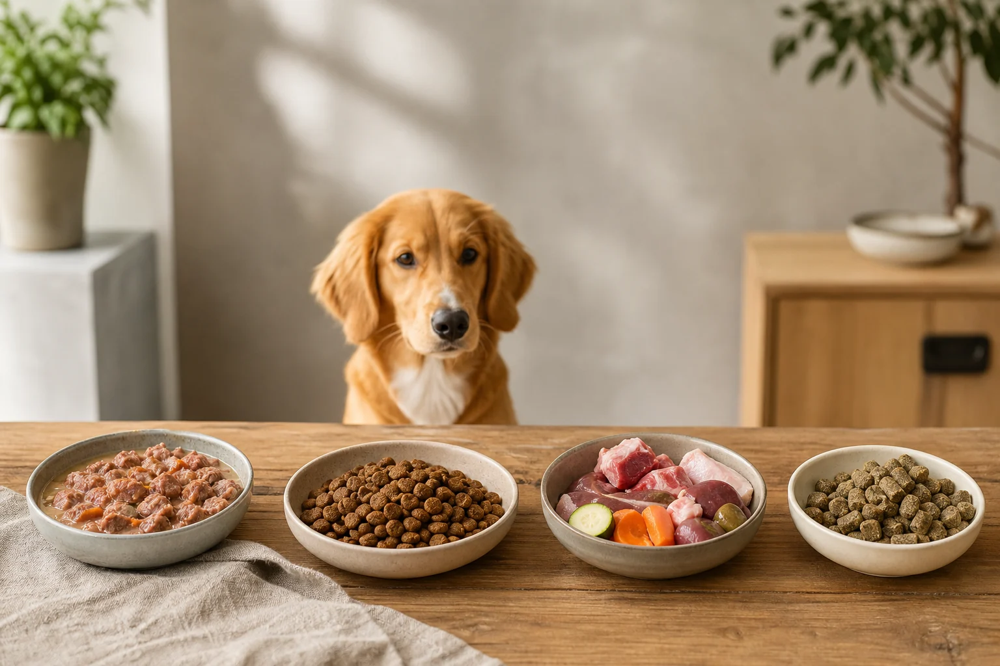

Das beste Hundefutter gibt es nicht als universelle Lösung – wohl aber klare Qualitätskriterien, mit denen du gutes Hundefutter von schlechtem unterscheidest. Ob Welpe, Senior oder Hund mit Erkrankung: Die richtige Wahl hängt immer vom individuellen Tier ab. Fleischanteil, Deklaration und Verträglichkeit sind die drei wichtigsten Stellschrauben.

In diesem Artikel erfährst du, worauf Experten beim Hundefutter Test achten, wie du ein Etikett richtig liest, welche Futterarten sich für welchen Hund eignen und welche Empfehlungen es für Welpen, Senioren und Hunde mit Spezialdiäten gibt. Du bekommst außerdem eine praktische Checkliste für die nächste Kaufentscheidung.

## Was macht gutes Hundefutter aus?

Zusammenfassung: Kriterien für gutes Hundefutter

<ul>
<li><strong>Fleisch als erste Zutat</strong> – Mindestens 50 % deklarierter Fleischanteil ist ein verlässliches Qualitätsmerkmal</li>
<li><strong>Vollständige Deklaration</strong> – Jede Zutat einzeln aufgeführt, keine Sammelbezeichnungen wie "tierische Nebenerzeugnisse"</li>
<li><strong>Keine bedenklichen Zusatzstoffe</strong> – Kein Zucker, keine künstlichen Konservierungsstoffe wie BHA, BHT oder Ethoxyquin</li>
<li><strong>Angepasst an die Lebensphase</strong> – Welpe, Adult und Senior haben unterschiedliche Nährstoffbedürfnisse</li>
</ul>

Gutes Hundefutter erfüllt den Nährstoffbedarf des Hundes vollständig, ohne schädliche Inhaltsstoffe zu enthalten. Die [Bundestierärztekammer](https://www.bundestieraerztekammer.de/) betont, dass eine artgerechte Ernährung auf tierischem Protein basieren sollte, da Hunde als Karnivore einen hohen Proteinbedarf haben.

Entscheidend ist nicht der Preis, sondern die Zusammensetzung. Teure Marken können schlechte Zutaten enthalten, günstige Produkte manchmal überraschend gut abschneiden. Ein Blick auf das Etikett ist deshalb unverzichtbar.

### Fleischanteil, Zutaten und Deklaration verstehen

Die Zutatenliste auf dem Hundefutter-Etikett ist nach dem Gewicht der Zutaten sortiert, von der mengenmäßig größten bis zur kleinsten. Steht "Hühnerfleisch" oder "Rindfleisch" an erster Stelle, ist das ein positives Signal.

Problematisch sind Sammelbezeichnungen wie "Fleisch und tierische Nebenerzeugnisse". Diese erlaubt es Herstellern, die Zusammensetzung von Charge zu Charge zu variieren, ohne das Etikett anpassen zu müssen. Hochwertige Produkte deklarieren jede Zutat einzeln und nennen die Tierart.

Laut den Kennzeichnungspflichten des [Bundesministeriums für Ernährung und Landwirtschaft](https://www.bmel.de/) müssen alle Zutaten vollständig angegeben werden. Hersteller, die freiwillig mehr Transparenz bieten, zum Beispiel durch Angabe des prozentualen Fleischanteils, sind in der Regel vertrauenswürdiger.

Ein guter Richtwert: Mindestens 50 bis 70 Prozent Fleischanteil bei Nassfutter (bezogen auf die Gesamtzutaten), mindestens 30 Prozent bei Trockenfutter.

### Zusatzstoffe, Konservierungsmittel und No-Gos

Künstliche Konservierungsstoffe wie BHA (E320), BHT (E321) und Ethoxyquin (E324) stehen im Verdacht, gesundheitsschädlich zu sein. Hochwertiges Hundefutter wird stattdessen mit natürlichen Antioxidantien wie Vitamin E (Tocopherol) oder Rosmarin-Extrakt haltbar gemacht.

🚫

<strong>Diese Zusatzstoffe gehören nicht ins Hundefutter</strong>

BHA (E320), BHT (E321), Ethoxyquin (E324), Zuckerzusätze (Saccharose, Melasse), künstliche Aromen und Farbstoffe haben in hochwertigem Hundefutter nichts zu suchen. Öko-Test und Stiftung Warentest werten diese Stoffe regelmäßig negativ.

Zucker und Melasse werden manchmal zugesetzt, um die Schmackhaftigkeit zu erhöhen. Sie sind für Hunde nicht nur unnötig, sondern können Übergewicht und Zahnprobleme fördern. Auch Salz sollte nur in sehr geringen Mengen vorhanden sein.

## Hundefutter im Test: Worauf Experten achten

Beim Hundefutter Test prüfen unabhängige Institute wie Stiftung Warentest und Öko-Test vor allem drei Bereiche: die Nährstoffzusammensetzung, die Deklarationsqualität und das Vorkommen bedenklicher Stoffe. Ein Hundefutter Testsieger zeichnet sich dadurch aus, dass er in allen drei Kategorien überzeugt.

Experten der Veterinärmedizinischen Universität Wien empfehlen, beim Kauf auf Futter zu achten, das der FEDIAF-Nährstoffempfehlung (European Pet Food Industry Federation) entspricht. Diese legt Mindest- und Höchstwerte für Proteine, Fette, Vitamine und Mineralstoffe fest.

Ein weiterer Faktor im Hundefutter Test ist die Rohstoffherkunft. Produkte, die Fleisch aus kontrollierter Haltung oder aus Deutschland und Europa beziehen, schneiden bei Öko-Test häufig besser ab als solche mit unklarer Herkunft.

### Hundefutter Testsieger im Überblick

Hundefutter Testsieger aus verschiedenen Testzeiträumen teilen gemeinsame Merkmale: Sie nennen die Fleischquelle präzise, verzichten auf künstliche Zusatzstoffe und weisen eine ausgewogene Nährstoffzusammensetzung auf. Detaillierte aktuelle Testergebnisse findest du direkt bei der [Stiftung Warentest](https://www.test.de/) und bei [Öko-Test](https://www.oekotest.de/).

Für den Hundefutter Test gilt: Ein Produkt, das in einem Jahr Testsieger war, muss es nicht bleiben. Rezepturen ändern sich, Rohstoffquellen wechseln. Regelmäßige Überprüfung lohnt sich.

Praktisch hilfreich ist auch unser ausführlicher [Trockenfutter im Test](https://hundewissen-mit-kopf.de/hundeernaehrung/trockenfutter-hund-test/)-Ratgeber, der aktuelle Testergebnisse für Trockenfutter zusammenfasst.

### So liest du ein Hundefutter-Etikett richtig

Das Etikett eines Hundefutters enthält gesetzlich vorgeschriebene Pflichtangaben: Tierart, Produktname, Nettomenge, Mindesthaltbarkeitsdatum, Hersteller sowie die analytischen Bestandteile (Protein, Fett, Rohfaser, Rohasche, Feuchtigkeit).

Die analytischen Bestandteile erlauben einen direkten Vergleich zwischen Produkten. Wichtig: Bei Nassfutter muss man den Wasseranteil herausrechnen, um die Trockensubstanz zu berechnen. Ein Nassfutter mit 10 Prozent Protein bei 80 Prozent Wassergehalt enthält in der Trockensubstanz 50 Prozent Protein – ein guter Wert.

ℹ️

<strong>Trockensubstanz-Formel für den Vergleich</strong>

Protein in Trockensubstanz (%) = Proteingehalt (%) ÷ (100 % – Feuchtigkeitsgehalt (%)) × 100. So lassen sich Nass- und Trockenfutter direkt miteinander vergleichen.

50–70 %

Fleischanteil (Nassfutter)

≥ 30 %

Fleischanteil (Trockenfutter)

70–85 %

Wassergehalt Nassfutter

18–25 %

Rohprotein Trockensubstanz (DVG-Empfehlung)

## Futterarten im Vergleich: Nass, Trocken, BARF und Kaltgepresst

Die vier gängigen Futterarten unterscheiden sich grundlegend in Zusammensetzung, Haltbarkeit und Eignung. Welche die beste Wahl ist, hängt vom Hund und vom Alltag des Halters ab. Ein Überblick:

| Futterart | Wassergehalt | Haltbarkeit | Besonderheit |
|---|---|---|---|
| Nassfutter | 70–85 % | Kurz nach Öffnen | Bekömmlich, gut für Trinkmuffel |
| Trockenfutter | 8–12 % | Monate | Kalorienreich, praktisch |
| BARF | variabel | Sehr kurz | Rohes Fleisch, hoher Aufwand |
| Kaltgepresst | 8–12 % | Monate | Schonend verarbeitet, gute Verträglichkeit |

Wer sich für die Eigenherstellung interessiert, findet im Ratgeber [Hundefutter selber kochen](https://hundewissen-mit-kopf.de/hundeernaehrung/hundefutter-selber-kochen/) eine ausführliche Anleitung.

### Bestes Hundefutter ohne Getreide: Sinnvoll oder Trend?

Getreidefreies Hundefutter hat in den letzten Jahren stark an Popularität gewonnen. Tatsächlich ist es für Hunde mit nachgewiesener Getreide-Unverträglichkeit eine sinnvolle Wahl. Für gesunde Hunde ohne Unverträglichkeit ist es jedoch nicht automatisch besser als Futter mit Getreide.

Getreide wie Reis oder Hafer kann als Energiequelle und für die Verdauung durchaus nützlich sein. Problematischer sind minderwertige Getreidemengen, die als billiger Füllstoff eingesetzt werden, anstatt den Fleischanteil zu erhöhen. Mehr dazu im Ratgeber zu [getreidefreiem Hundefutter](https://hundewissen-mit-kopf.de/hundeernaehrung/getreidefreies-hundefutter/).

Entscheidend bleibt: Ein getreidefreies Produkt mit niedrigem Fleischanteil ist nicht besser als ein Produkt mit hochwertigem Getreide und hohem Fleischanteil.

### Bestes kaltgepresstes Hundefutter: Schonend und bekömmlich

Kaltgepresstes Hundefutter wird bei maximal 45 Grad Celsius verarbeitet, während extrudiertes Trockenfutter bei 120 bis 180 Grad hergestellt wird. Durch die schonende Verarbeitung bleiben Enzyme, Vitamine und Aminosäuren besser erhalten.

Viele Hunde mit empfindlichem Magen vertragen kaltgepresstes Futter besser als herkömmliches Trockenfutter. Allerdings ist die Haltbarkeit etwas kürzer und der Preis in der Regel höher. Qualitativ hochwertiges kaltgepresstes Hundefutter erkennst du an einem hohen Fleischanteil als erster Zutat und einer überschaubaren Zutatenliste.

Vorteile kaltgepresstes Hundefutter

<ul>
<li>Schonende Verarbeitung erhält Nährstoffe besser</li>
<li>Oft bessere Verträglichkeit bei empfindlichen Hunden</li>
<li>Überschaubare Zutatenliste, weniger Zusatzstoffe</li>
<li>Gute Akzeptanz bei wählerischen Hunden</li>
</ul>

Nachteile kaltgepresstes Hundefutter

<ul>
<li>Deutlich teurer als extrudiertes Trockenfutter</li>
<li>Kürzere Haltbarkeit nach Öffnen der Packung</li>
<li>Geringere Auswahl im stationären Handel</li>
<li>Nicht jeder Hund bevorzugt die Textur</li>
</ul>

## Bestes Trockenfutter für Hunde: Empfehlungen und Testergebnisse

Bestes Trockenfutter für Hunde zeichnet sich durch einen hohen Fleischanteil in der Trockensubstanz, eine vollständige Deklaration und den Verzicht auf Füllstoffe aus. Trockenfutter ist besonders praktisch in der Handhabung, lange haltbar und gut für die Zahnpflege, da das Kauen Zahnstein reduzieren kann.

Beim Kauf von bestem Trockenfutter für Hunde sollte der Rohproteingehalt in der Trockensubstanz mindestens 25 bis 30 Prozent betragen. Laut DVG-Leitlinie (Deutsche Veterinärmedizinische Gesellschaft) sollten ausgewachsene Hunde 18 bis 25 Prozent Rohprotein in der Trockensubstanz erhalten – hochwertige Produkte liegen oft darüber.

Fett sollte zwischen 10 und 20 Prozent liegen, Rohfaser unter 5 Prozent. Hohe Rohfaserwerte deuten auf einen hohen Getreide- oder Gemüseanteil hin, der den Fleischanteil verdrängt.

### Bestes Trockenfutter Hunde – Stiftung Warentest und Öko-Test im Vergleich

Die Stiftung Warentest hat in mehreren Testzeiträumen bestes Trockenfutter für Hunde unter die Lupe genommen. Produkte, die gut abschnitten, hatten gemeinsam: Fleisch als erste und mengenmäßig dominante Zutat, keine bedenklichen Konservierungsstoffe und eine vollständige Nährstoffversorgung gemäß FEDIAF-Standard.

Öko-Test legt zusätzlich Wert auf Schadstoffe wie Mykotoxine, Schwermetalle und Pestizidrückstände. Produkte mit Fleisch aus ökologischer Landwirtschaft oder kontrollierter Herkunft schnitten hier regelmäßig besser ab.

Konkrete aktuelle Testergebnisse und Bewertungen findest du in unserem detaillierten [Trockenfutter im Test](https://hundewissen-mit-kopf.de/hundeernaehrung/trockenfutter-hund-test/)-Ratgeber sowie direkt auf den Testportalen.

🏆

Testsieger-Kriterien

Fleisch als erste Zutat, vollständige Deklaration, keine künstlichen Konservierungsstoffe, ausgewogene Nährstoffwerte

🔬

Stiftung Warentest

Prüft Nährstoffzusammensetzung, Deklarationsqualität und Schadstoffbelastung – aktuelle Ergebnisse auf test.de

🌿

Öko-Test

Bewertet zusätzlich Mykotoxine, Schwermetalle und Herkunft der Rohstoffe – Ergebnisse auf oekotest.de

📋

FEDIAF-Standard

Europäischer Nährstoffstandard für Heimtiernahrung – Produkte, die diesen erfüllen, sind vollwertig zusammengesetzt

## Bestes Nassfutter für Hunde: Qualität erkennen und richtig wählen

💡

<strong>Tipp: Nassfutter für Trinkmuffel</strong>

Hunde, die wenig Wasser trinken, profitieren besonders von Nassfutter. Der hohe Wassergehalt von 70 bis 85 Prozent unterstützt die Nierenfunktion und beugt Harnsteinen vor. Besonders bei älteren Hunden und Hunden mit Nierenerkrankungen ist Nassfutter oft die bessere Wahl.

Bestes Nassfutter für Hunde liefert hochwertiges tierisches Protein in einer leicht verdaulichen Form. Es eignet sich besonders für Hunde mit empfindlichem Magen, ältere Tiere mit Zahnproblemen und Hunde, die Trockenfutter ablehnen.

Die Qualitätsunterschiede beim besten Hundefutter nass sind erheblich. Günstige Produkte enthalten oft nur 4 bis 10 Prozent Fleisch, aufgefüllt mit Wasser, Getreidemehl und Zuckerstoffen. Hochwertige Produkte kommen auf 50 bis 80 Prozent Fleischanteil.

Mehr zu konkreten Produkten und aktuellen Testergebnissen findest du in unserem [Nassfutter im Test](https://hundewissen-mit-kopf.de/hundeernaehrung/nassfutter-hund-test/)-Ratgeber.

### Worauf beim besten Hundefutter nass besonders zu achten ist

Beim besten Hundefutter nass gilt: Je kürzer die Zutatenliste, desto besser. Hochwertige Produkte kommen mit Fleisch, etwas Gemüse, Mineralstoffen und natürlichen Vitaminen aus.

Folgende Punkte solltest du beim Kauf von Nassfutter prüfen:

- **Fleischquelle klar benannt:** "Hühnerfleisch 70 %" ist besser als "Fleisch und tierische Nebenerzeugnisse"
- **Kein Zuckerzusatz:** Weder Saccharose noch Melasse oder Sirup in der Zutatenliste
- **Kein Getreidemehl als Füllstoff:** Wenn Getreide, dann als benannte Zutat in sinnvoller Menge
- **Natürliche Konservierung:** Tocopherole (Vitamin E) statt BHA oder BHT
- **Vollständige Nährstoffangaben:** Protein, Fett, Rohfaser und Rohasche müssen angegeben sein

| Merkmal | Gutes Nassfutter | Schlechtes Nassfutter |
|---|---|---|
| Fleischanteil | 50–80 % | Unter 20 % |
| Erste Zutat | Benanntes Fleisch | "Tierische Nebenerzeugnisse" |
| Konservierung | Tocopherole, natürlich | BHA, BHT, künstliche Stoffe |
| Zuckerzusatz | Keiner | Saccharose, Melasse |
| Deklaration | Einzeln, mit Prozentangabe | Sammelbezeichnungen |

## Bestes Hundefutter nach Lebensphase: Welpe, Adult und Senior

1

Welpe (0–12 Monate)

Erhöhter Protein-, Calcium- und DHA-Bedarf für Wachstum und Gehirnentwicklung. Spezielles Welpenfutter verwenden.

2

Adult (1–7 Jahre)

Ausgewogene Ernährung mit hohem Fleischanteil, angepasst an Aktivitätslevel und Körpergröße.

3

Senior (ab 7 Jahren)

Kalorienreduziert, gelenkschonend mit Glucosamin und Omega-3, leicht verdaulich. Rasseabhängig früher beginnen.

Der Nährstoffbedarf eines Hundes verändert sich erheblich im Laufe seines Lebens. Welpenfutter, Adultfutter und Seniorfutter sind keine Marketingbegriffe, sondern spiegeln echte physiologische Unterschiede wider.

### Bestes Hundefutter für Welpen: Nährstoffe in der Wachstumsphase

Bestes Hundefutter für Welpen muss den hohen Energiebedarf der Wachstumsphase decken und gleichzeitig die richtige Balance aus Calcium und Phosphor für die Knochenentwicklung liefern. Das Verhältnis sollte laut Ernährungsexperten der Veterinärmedizinischen Universität Wien bei etwa 1,2 zu 1 (Calcium zu Phosphor) liegen.

Besonders wichtig ist DHA (Docosahexaensäure), eine Omega-3-Fettsäure, die nachweislich die Gehirn- und Sehentwicklung von Welpen fördert. Hochwertiges Welpenfutter enthält DHA aus Fischöl oder Algenöl.

Große Rassen wie Deutsche Dogge oder Labrador benötigen Welpenfutter mit moderatem Calciumgehalt, da zu viel Calcium das Knochenwachstum stören kann. Für die Welpenerziehung und den optimalen Start ins Hundeleben findest du weitere Tipps im Ratgeber zur [Welpenerziehung](https://hundewissen-mit-kopf.de/erziehung-verhalten/welpenerziehung/).

### Bestes Hundefutter für ältere Hunde: Gelenke, Gewicht und Verdauung

Bestes Hundefutter für ältere Hunde und bestes Senior Hundefutter teilen dieselben Grundanforderungen: weniger Kalorien, mehr gelenkschützende Nährstoffe und eine leicht verdauliche Zusammensetzung. Ab etwa sieben Jahren, bei großen Rassen ab fünf Jahren, sollte die Umstellung auf Senior-Formulas erfolgen.

Glucosamin und Chondroitin unterstützen die Knorpelgesundheit und können Gelenkbeschwerden lindern. Omega-3-Fettsäuren aus Fischöl wirken entzündungshemmend und sind für ältere Hunde besonders wertvoll.

Der Proteingehalt sollte beim besten Hundefutter für ältere Hunde nicht zu stark reduziert werden. Ältere Hunde haben oft einen erhöhten Proteinbedarf, um Muskelmasse zu erhalten. Die Bundestierärztekammer empfiehlt, die Futterumstellung bei älteren Hunden mit dem Tierarzt abzustimmen.

### Bestes Hundefutter für kleine Hunde: Besonderheiten kleiner Rassen

Bestes Hundefutter für kleine Hunde muss deren höheren Energiebedarf pro Kilogramm Körpergewicht berücksichtigen. Kleine Rassen wie Chihuahua, Yorkshire Terrier oder Malteser haben einen schnelleren Stoffwechsel und benötigen kalorienreicheres Futter in kleineren Portionen.

Kleine Hunde neigen außerdem häufiger zu Zahnproblemen. Kleinere Trockenfutter-Kibbles, die speziell für kleine Rassen entwickelt wurden, können die Zahnpflege unterstützen. Auch Futter mit erhöhtem Calcium-Gehalt ist für kleine Rassen sinnvoll, da sie anfälliger für Knochenschwund sind.

## Bestes Hundefutter bei Spezialdiäten und Erkrankungen

⚠️

<strong>Wichtiger Hinweis bei Erkrankungen</strong>

Dieser Artikel ersetzt keinen Tierarztbesuch. Bei Pankreatitis, Allergien, Nierenerkrankungen oder anderen Gesundheitsproblemen muss die Futterumstellung immer in Absprache mit einer Tierärztin oder einem Tierarzt erfolgen. Falsch gewähltes Futter kann den Krankheitsverlauf verschlimmern.

Erkrankte Hunde haben spezifische Ernährungsanforderungen, die sich deutlich von denen gesunder Tiere unterscheiden. Bestes Hundefutter bei Spezialdiäten ist kein Marketingbegriff, sondern medizinische Notwendigkeit.

Diätfutter für kranke Hunde unterliegt in Deutschland strengeren gesetzlichen Anforderungen als Standardfutter. Sie müssen als "Diätfuttermittel" deklariert sein und einen definierten ernährungsphysiologischen Zweck erfüllen.

### Bestes Hundefutter bei Pankreatitis: Fettarm und magenfreundlich

Bestes Hundefutter bei Pankreatitis muss den Fettgehalt drastisch reduzieren, da Fett die Bauchspeicheldrüse stark belastet. Tierärzte empfehlen maximal 8 bis 10 Prozent Fett in der Trockensubstanz, in akuten Phasen noch weniger.

Gleichzeitig muss der Proteingehalt ausreichend hoch sein, um Muskelmasse zu erhalten. Leicht verdauliche Proteinquellen wie Hühnchen, Pute oder Weißfisch sind besser geeignet als fettreiches Fleisch wie Lamm oder Ente.

Wichtige Punkte beim besten Hundefutter bei Pankreatitis:

- Fettgehalt maximal 8–10 % in der Trockensubstanz
- Leicht verdauliche Proteinquellen (Hühnchen, Pute, Weißfisch)
- Keine fetthaltigen Zusätze wie Öle in großen Mengen
- Kleine, häufige Mahlzeiten statt zwei große Portionen
- Ausschließlich nach tierärztlicher Empfehlung

### Bestes hypoallergenes Hundefutter: Allergien gezielt managen

Bestes hypoallergenes Hundefutter enthält idealerweise nur eine einzige Proteinquelle (Monoprotein), die der Hund noch nicht kennt. Häufige Auslöser von Futterallergien bei Hunden sind Rind, Hühnchen, Weizen und Soja.

Für die Diagnose einer Futterallergie ist eine Ausschlussdiät über mindestens acht Wochen notwendig. Dabei wird ausschließlich ein Futter mit einer neuen Proteinquelle gefüttert, zum Beispiel Pferd, Känguru, Hirsch oder Insekten.

📖

<strong>Monoprotein vs. hydrolysiertes Protein</strong>

Monoproteinfutter enthält nur eine Tierart als Proteinquelle. Hydrolysiertes Protein ist chemisch aufgespalten, sodass das Immunsystem die Eiweißmoleküle nicht mehr als fremd erkennt. Beide Ansätze sind wissenschaftlich anerkannte Methoden bei Futterallergien. Welcher für deinen Hund geeignet ist, klärt der Tierarzt.

## Checkliste: So wählst du das beste Hundefutter für deinen Hund

Bevor du ein neues Hundefutter kaufst, solltest du folgende Punkte prüfen. Diese Checkliste hilft dir, gutes Hundefutter von schlechtem zu unterscheiden und die richtige Wahl für deinen Hund zu treffen.

✅ Checkliste: Bestes Hundefutter erkennen

✓

Fleisch oder eine benannte Fleischquelle steht als erste Zutat auf dem Etikett

✓

Alle Zutaten sind einzeln und vollständig deklariert (keine Sammelbezeichnungen)

✓

Keine künstlichen Konservierungsstoffe (BHA, BHT, Ethoxyquin) enthalten

✓

Kein Zuckerzusatz (Saccharose, Melasse, Sirup) in der Zutatenliste

✓

Das Futter ist auf die Lebensphase deines Hundes abgestimmt (Welpe/Adult/Senior)

✓

Der Rohproteingehalt liegt bei mindestens 18–25 % in der Trockensubstanz

Bei Erkrankungen: Rücksprache mit Tierarzt vor der Futterumstellung

Testergebnisse von Stiftung Warentest oder Öko-Test zum Produkt geprüft

Futterumstellung langsam durchgeführt (7–10 Tage, altes und neues Futter mischen)

## Fazit: Das wirklich beste Hundefutter gibt es nicht von der Stange

Das beste Hundefutter ist das, das zu deinem Hund passt. Alter, Rasse, Gesundheitszustand und individuelle Verträglichkeit entscheiden mehr als jeder Testsieger. Verlässliche Qualitätskriterien sind ein hoher Fleischanteil als erste Zutat, eine vollständige Deklaration und der Verzicht auf bedenkliche Zusatzstoffe.

Nutze Testergebnisse von Stiftung Warentest und Öko-Test als Orientierung, aber prüfe stets die aktuellen Ergebnisse, da sich Rezepturen ändern. Bei Erkrankungen oder Unverträglichkeiten führt kein Weg an einer tierärztlichen Beratung vorbei.

Ein gutes Hundefutter muss nicht teuer sein, aber es muss transparent sein. Wer das Etikett lesen kann, trifft die bessere Entscheidung.
