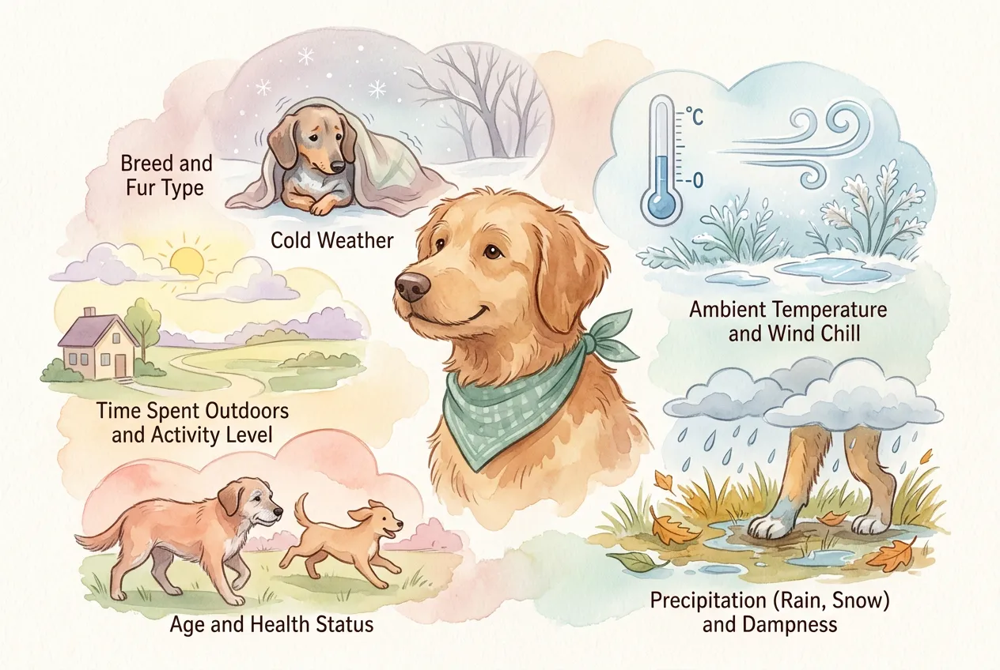
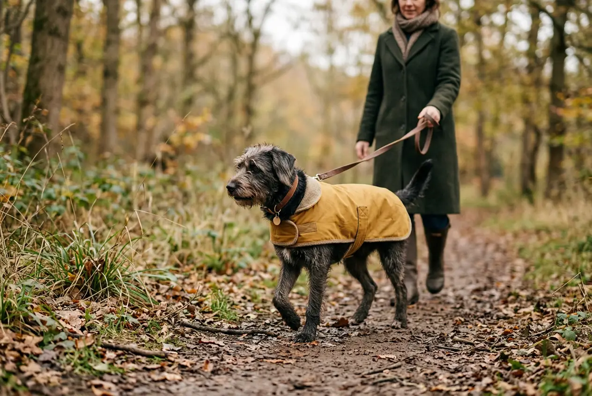
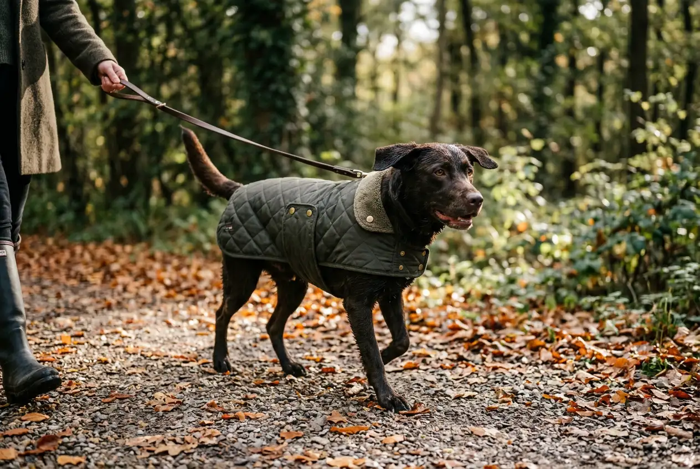

Ob dein Hund einen Mantel braucht, hängt nicht von deiner persönlichen Meinung ab -- sondern von 5 messbaren Faktoren. Kleine Hunde ohne Unterwolle, Senioren und kranke Vierbeiner profitieren laut Bundestierärztekammer nachweislich von einem Hundemantel im Winter. Für Rassen mit dichtem Fell wie Berner Sennenhunde ist ein Mantel dagegen meist überflüssig.

In diesem Ratgeber erfährst du anhand konkreter Kriterien, wann ein Mantel für deinen Hund sinnvoll ist, welche Rassen Kälteschutz brauchen und worauf du bei der Auswahl von Hundemänteln achten solltest. Mit Temperatur-Tabelle, Rassen-Übersicht und praktischer Checkliste.

Zusammenfassung: Braucht mein Hund einen Mantel?

<ul>
<li><strong>5 Entscheidungsfaktoren</strong> -- Felltyp, Körpergröße, Alter, Gesundheit und Wetterbedingungen bestimmen, ob ein Mantel sinnvoll ist</li>
<li><strong>Kleine Hunde unter 10 kg</strong> -- frieren ab etwa 5 °C und brauchen häufig einen Hundemantel</li>
<li><strong>Kein Mantel nötig</strong> -- für gesunde Hunde mit dichter Unterwolle wie Huskys oder Berner Sennenhunde</li>
<li><strong>Hunde Regenmantel bei Nässe</strong> -- nasses Fell isoliert bis zu 70 % schlechter als trockenes</li>
<li><strong>Passform entscheidend</strong> -- der Mantel muss Bewegungsfreiheit lassen und darf nicht scheuern</li>
</ul>

5 °C

Grenzwert für kleine Hunde ohne Unterwolle

70 %

weniger Isolation bei nassem Fell

38–39 °C

normale Körpertemperatur beim Hund

10 kg

Grenze: kleine Hunde frieren schneller

## Hundemantel: Vermenschlichung oder echte Notwendigkeit?

Die Frage "Braucht mein Hund einen Mantel?" sorgt unter Hundehaltern regelmäßig für hitzige Diskussionen. Viele empfinden Hundemäntel als reine Vermenschlichung -- andere sehen darin einen wichtigen Kälteschutz. Die Wahrheit liegt in der Mitte und hängt vom individuellen Hund ab.

Laut Bundestierärztekammer ist ein Mantel für bestimmte Hunde nicht nur sinnvoll, sondern medizinisch empfehlenswert. Hunde ohne Unterwolle, mit sehr kurzem Fell oder gesundheitlichen Einschränkungen können bei Kälte und Nässe ernsthaft auskühlen. Ein Hundemantel schützt in diesen Fällen vor Unterkühlung, Muskelverspannungen und Gelenkproblemen.

Gleichzeitig gilt: Gesunde Hunde mit dichtem Fell und intakter Unterwolle brauchen keinen Mantel. Für einen Berner Sennenhund oder Husky wäre ein Wintermantel sogar kontraproduktiv, weil er die natürliche Thermoregulation stört.

ℹ️

<strong>Wussten du?</strong>

Hunde regulieren ihre Körpertemperatur hauptsächlich über Hecheln und über die Blutgefäße in den Pfoten -- nicht über die Hautoberfläche wie Menschen. Deshalb ist ein Mantel nur dann sinnvoll, wenn das eigene Fell nicht ausreichend isoliert.

## Die 5 Faktoren: Wann ist ein Hundemantel sinnvoll?

Ob dein Hund einen Mantel braucht, lässt sich anhand von 5 konkreten Faktoren bestimmen. Je mehr dieser Faktoren auf deinen Vierbeiner zutreffen, desto wahrscheinlicher ist ein Hundemantel im Winter sinnvoll.

### Faktor 1: Felltyp und Unterwolle

Der wichtigste Faktor ist das Fell deines Hundes. Hunde mit dichter Unterwolle besitzen eine natürliche Isolationsschicht, die sie bei Kälte schützt. Rassen ohne Unterwolle -- etwa Windhunde, Dalmatiner oder Pudel -- fehlt dieser Schutz.

Einschichtiges Fell (sogenanntes "Single Coat") bietet deutlich weniger Wärmeisolierung als doppelschichtiges Fell. Hunde mit kurzem, dünnem Fell verlieren Körperwärme bis zu 3-mal schneller als Hunde mit dichter Unterwolle.

Auch frisch geschorene Hunde oder Vierbeiner, die viel Fell verlieren, können vorübergehend einen Mantel benötigen. Die regelmäßige [Fellpflege](https://hundewissen-mit-kopf.de/hundepflege/fellpflege-hund/) unterstützt die natürliche Isolierfunktion des Fells.

### Faktor 2: Körpergröße und Körperfettanteil

Kleine Hunde unter 10 kg haben ein ungünstiges Verhältnis von Körperoberfläche zu Körpervolumen. Das bedeutet: Sie verlieren proportional mehr Wärme als große Hunde. Chihuahuas, Yorkshire Terrier und Zwergpinscher frieren daher deutlich schneller als ein Labrador oder Schäferhund.

Auch der Körperfettanteil spielt eine Rolle. Windhunde wie Greyhounds und Whippets besitzen nur etwa 5 % Körperfett -- im Vergleich zu 15–20 % bei vielen anderen Rassen. Diese geringe Fettschicht bietet kaum Isolation gegen Kälte.

### Faktor 3: Alter des Hundes

Welpen unter 6 Monaten und Senioren ab 8 Jahren haben eine eingeschränkte Thermoregulation. Welpen können ihre Körpertemperatur noch nicht so effizient regulieren wie erwachsene Hunde. Bei älteren Hunden verlangsamt sich der Stoffwechsel, und die Durchblutung der Extremitäten nimmt ab.

Laut Tierärzten profitieren ältere Hunde mit Arthrose besonders von einem Mantel, weil Kälte die Gelenkschmerzen verstärkt. Ein wärmender Hundemantel kann die Muskulatur entspannen und die Beweglichkeit verbessern.

### Faktor 4: Gesundheitszustand

Kranke Hunde, Hunde nach Operationen und Vierbeiner mit chronischen Erkrankungen brauchen häufiger einen Mantel als gesunde Artgenossen. Besonders betroffen sind Hunde mit:

- **Arthrose oder Gelenkproblemen** -- Kälte verschlimmert Steifheit und Schmerzen
- **Herz-Kreislauf-Erkrankungen** -- eingeschränkte Durchblutung führt zu schnellerem Auskühlen
- **Schilddrüsenunterfunktion (Hypothyreose)** -- verringerte Wärmeproduktion
- **Immunschwäche oder Krebserkrankungen** -- geschwächter Organismus friert schneller

Wenn dein Hund zittert und sich bei Kälte unwohl fühlen sollte, ist ein Tierarztbesuch und ein Mantel gleichermaßen ratsam.

### Faktor 5: Wetterbedingungen

Nicht nur die Temperatur entscheidet, sondern auch Wind und Nässe. Ein trockener Wintertag bei 0 °C ist für viele Hunde unproblematisch. Kombination aus Nässe und Wind bei 5 °C kann dagegen schnell zum Auskühlen führen.

Nasses Fell isoliert bis zu 70 % schlechter als trockenes Fell. Ein Hunde Regenmantel ist deshalb bei anhaltendem Regen auch für mittelgroße Hunde ohne Unterwolle sinnvoll. Im Winter verstärkt Wind den Kälteeffekt zusätzlich -- der sogenannte Windchill-Faktor kann die gefühlte Temperatur um 5–10 °C senken.

🧥

Felltyp

Ohne Unterwolle = Mantel empfohlen. Mit dichter Unterwolle = kein Mantel nötig.

📏

Körpergröße

Kleine Hunde unter 10 kg verlieren Wärme schneller und frieren eher.

🐾

Alter & Gesundheit

Welpen, Senioren und kranke Hunde haben eingeschränkte Thermoregulation.

🌧️

Wetter

Nässe + Wind sind gefährlicher als trockene Kälte. Windchill senkt die gefühlte Temperatur um 5–10 °C.

## Welche Hunde brauchen einen Mantel? Rassen-Übersicht

Die Frage, welche Hunde einen Mantel brauchen, lässt sich anhand der Rasse gut eingrenzen. Entscheidend ist die Kombination aus Fellstruktur, Körpergröße und Körperfettanteil.

### Hunde, die einen Mantel brauchen

Folgende Rassen und Typen benötigen bei Temperaturen unter 5 °C in der Regel einen Hundemantel:

| Rasse / Typ | Grund | Mantel ab |
|---|---|---|
| Chihuahua | Sehr klein, kaum Unterwolle | 5–8 °C |
| Whippet / Greyhound | Extrem wenig Körperfett, dünnes Fell | 5 °C |
| Italienisches Windspiel | Klein, kein Körperfett, kein Unterfell | 8 °C |
| Französische Bulldogge | Kurzes Fell, keine Unterwolle | 5 °C |
| Dalmatiner | Einschichtiges Fell ohne Unterwolle | 0–5 °C |
| Dobermann | Kurzes Fell, wenig Unterfell | 0–5 °C |
| Nackthunde (z. B. Xolo) | Kein Fell | 10–15 °C |
| Yorkshire Terrier | Sehr klein, seidiges Fell ohne Unterwolle | 5 °C |

Auch [kleine Hunderassen](https://hundewissen-mit-kopf.de/hunderassen/kleine-hunderassen/) ohne dichte Unterwolle gehören in diese Kategorie. Ihr geringes Körpergewicht und die Nähe zum kalten Boden verstärken den Wärmeverlust.

### Hunde, die keinen Mantel brauchen

Gesunde Hunde mit dichter Unterwolle und robustem Körperbau kommen im Winter ohne Mantel aus:

| Rasse / Typ | Grund | Kältegrenze ohne Mantel |
|---|---|---|
| Berner Sennenhund | Dichtes Doppelfell, kräftiger Körperbau | bis -10 °C |
| Siberian Husky | Extremes Winterfell, arktische Herkunft | bis -20 °C |
| Alaskan Malamute | Dichtes Doppelfell, große Körpermasse | bis -20 °C |
| Neufundländer | Wasserabweisendes Doppelfell | bis -15 °C |
| Berner Sennenhunde | Dichtes, langes Fell mit Unterwolle | bis -10 °C |
| Golden Retriever | Dichtes Doppelfell, mittlere Größe | bis -5 °C |
| Deutscher Schäferhund | Dichtes Fell mit Unterwolle | bis -10 °C |
| Labrador Retriever | Wasserabweisendes Doppelfell | bis -5 °C |

⚠️

<strong>Wichtig: Individuelle Unterschiede beachten</strong>

Die Tabelle zeigt Richtwerte für gesunde, erwachsene Hunde. Ältere, kranke oder frisch geschorene Hunde derselben Rasse können deutlich kälteempfindlicher sein. Beobachte immer das Verhalten deines individuellen Vierbeiners.

## Woran erkenne ich, dass mein Hund friert?

Hunde zeigen durch klare Körpersignale, wann sie sich bei Kälte unwohl fühlen. Diese Anzeichen solltest du beim Gassigehen im Winter beobachten:

- **Zittern** -- das deutlichste Signal für Kälte beim Hund
- **Eingezogene Rute** -- der Hund versucht, Wärme zu sparen
- **Hochziehen der Pfoten** -- abwechselndes Anheben der Pfoten signalisiert kalten Boden
- **Steifer, langsamer Gang** -- Muskeln verkrampfen bei Kälte
- **Gekrümmte Körperhaltung** -- der Hund macht sich klein, um Wärme zu halten
- **Verweigerung des Spaziergangs** -- der Hund will nicht rausgehen oder dreht schnell um
- **Winseln oder Fiepen** -- lautliche Äußerung von Unbehagen

Wenn dein Hund regelmäßig eines oder mehrere dieser Zeichen zeigt, ist ein Mantel sinnvoll. Dauerhaftes Frieren kann zu Muskelverspannungen, Gelenkproblemen und einem geschwächten Immunsystem führen.

💡

<strong>Praxis-Tipp: Ohren-Test</strong>

Fühle nach dem Spaziergang die Ohrenränder deines Hundes. Sind sie deutlich kalt, hat dein Hund gefroren. Auch kalte Pfotenballen sind ein Hinweis. Bei regelmäßig kalten Ohren nach dem Gassigehen ist ein Hundemantel empfehlenswert.

## Ab welcher Temperatur braucht ein Hund einen Mantel?

Die Grenztemperatur, ab der ein Mantel für deinen Hund sinnvoll ist, hängt von Rasse, Größe und Gesundheitszustand ab. Die folgende Tabelle gibt eine Orientierung für verschiedene Hundetypen:

| Hundetyp | Mantel empfohlen ab | Mantel nötig ab |
|---|---|---|
| Kleine Hunde ohne Unterwolle (z. B. Chihuahua) | 8 °C | 5 °C |
| Kleine Hunde mit Unterwolle (z. B. Sheltie) | 0 °C | -5 °C |
| Mittelgroße Hunde ohne Unterwolle (z. B. Dalmatiner) | 5 °C | 0 °C |
| Mittelgroße Hunde mit Unterwolle (z. B. Border Collie) | -5 °C | -10 °C |
| Große Hunde ohne Unterwolle (z. B. Dobermann) | 0 °C | -5 °C |
| Große Hunde mit Unterwolle (z. B. Berner Sennenhund) | -10 °C | -15 °C |
| Senioren und kranke Hunde (alle Größen) | 5–10 °C höher als gesunde Artgenossen | individuell |
| Welpen unter 6 Monaten | 5–8 °C höher als erwachsene Hunde | individuell |

📖

<strong>Windchill-Faktor beachten</strong>

Bei starkem Wind sinkt die gefühlte Temperatur um 5–10 °C unter den Thermometerwert. An einem windigen Tag mit 0 °C fühlt sich die Kälte für deinen Hund wie -5 bis -10 °C an. Berücksichtige bei der Entscheidung für einen Mantel immer auch Wind und Nässe.

## Welcher Hundemantel ist der richtige? Typen im Überblick

Hundemäntel unterscheiden sich je nach Einsatzzweck erheblich. Die richtige Wahl hängt davon ab, wann und wofür dein Hund den Mantel braucht.

### Wintermantel (gefüttert)

Ein gefütterter Wintermantel eignet sich für Hunde, die bei Kälte frieren. Hochwertige Modelle verwenden Fleece, Softshell oder synthetische Isolierung. Der Mantel sollte den Rücken vom Halsansatz bis zur Schwanzwurzel bedecken und die Brust schützen, ohne die Bewegungsfreiheit einzuschränken.

### Regenmantel (wasserabweisend)

Ein Hunde Regenmantel schützt vor Nässe und verhindert, dass das Fell durchnässt. Besonders für Hunde ohne wasserabweisendes Fell ist er bei Dauerregen sinnvoll. Gute Regenmäntel bestehen aus leichtem, wasserdichtem Material mit versiegelten Nähten.

### Softshell-Mantel (Allrounder)

Softshell-Mäntel kombinieren leichten Kälteschutz mit Wasserabweisung. Sie eignen sich für Übergangszeiten im Herbst und Frühling, wenn es noch nicht richtig kalt, aber feucht und windig ist.

Wintermantel -- Vorteile

<ul>
<li>Beste Wärmeisolierung bei Minusgraden</li>
<li>Schützt Brust und Rücken vor Kälte</li>
<li>Ideal für Senioren mit Gelenkproblemen</li>
<li>Oft mit Reflektoren für dunkle Wintertage</li>
</ul>

Wintermantel -- Nachteile

<ul>
<li>Zu warm bei Temperaturen über 5 °C</li>
<li>Oft nicht wasserdicht bei starkem Regen</li>
<li>Kann bei aktiven Hunden zu Überhitzung führen</li>
<li>Höherer Preis als einfache Regenmäntel</li>
</ul>

## Den richtigen Hundemantel auswählen: Passform und Material

Ein Hundemantel erfüllt seinen Zweck nur, wenn er richtig sitzt. Ein schlecht sitzender Mantel scheuert, schränkt die Bewegung ein und kann deinen Hund sogar mehr stressen als die Kälte selbst.

### So misst du deinen Hund richtig

Für die korrekte Größe benötigst du 3 Maße:

1. **Rückenlänge** -- vom Halsansatz (Widerrist) bis zur Schwanzwurzel
2. **Brustumfang** -- an der breitesten Stelle hinter den Vorderbeinen
3. **Halsumfang** -- an der breitesten Stelle des Halses

Miss immer im Stehen und mit einem flexiblen Maßband. Zwischen Mantel und Körper sollten 2 Finger Platz haben -- eng genug für Wärme, locker genug für Bewegungsfreiheit.

### Worauf du beim Material achten solltest

| Kriterium | Empfehlung |
|---|---|
| Obermaterial | Wasserabweisend oder wasserdicht (Softshell, Nylon) |
| Futter | Fleece oder Thermofutter für Wärme |
| Nähte | Versiegelt oder verschweißt gegen Nässe |
| Verschlüsse | Klettverschluss oder Clips -- leicht an- und auszuziehen |
| Reflektoren | Pflicht für dunkle Jahreszeiten |
| Leinenöffnung | Aussparung am Rücken für [Geschirr oder Halsband](https://hundewissen-mit-kopf.de/hundeausstattung/hundegeschirr-oder-halsband/) |

💡

<strong>Tipp: Mantel im Laden anprobieren</strong>

Lass deinen Hund den Mantel vor dem Kauf anprobieren. Er sollte sich frei bewegen, hinsetzen und hinlegen können, ohne dass der Mantel verrutscht oder einschneidet. Beobachte, ob sich dein Vierbeiner wohlfühlt oder den Mantel abzustreifen versucht.

## Hundemantel anziehen: Schritt für Schritt Anleitung

Viele Hunde akzeptieren einen Mantel nicht sofort. Mit der richtigen Gewöhnung und Technik wird das Anziehen zur entspannten Routine.

1

Mantel vorstellen

Lass deinen Hund den Mantel beschnuppern. Belohne ruhiges Verhalten mit Leckerlis. Wiederhole das 2–3 Tage lang.

2

Mantel auflegen

Lege den Mantel locker auf den Rücken, ohne ihn zu verschließen. Belohne sofort. Erst nach positiver Reaktion weitermachen.

3

Mantel schließen

Verschließe den Mantel und lass deinen Hund 5 Minuten damit in der Wohnung laufen. Lenke ihn mit Spiel oder Futter ab.

✓

Erster Spaziergang

Gehe mit dem Mantel nach draußen. Die meisten Hunde vergessen den Mantel, sobald sie spannende Gerüche entdecken.

Die Gewöhnung dauert bei den meisten Hunden 3–7 Tage. Zwinge deinen Vierbeiner nie in den Mantel -- negative Erfahrungen machen die Akzeptanz deutlich schwieriger.

## Häufige Fehler beim Hundemantel vermeiden

Auch mit guten Absichten machen Hundehalter beim Thema Hundemantel typische Fehler, die den Nutzen zunichtemachen oder sogar schaden können.

### Fehler 1: Mantel bei jedem Wetter anziehen

Ein Hundemantel ist kein Dauerbekleidungsstück. Bei Temperaturen über 10 °C oder bei intensiver Bewegung kann ein Mantel zu Überhitzung führen. Hunde regulieren ihre Körpertemperatur weniger effizient als Menschen -- ein überflüssiger Mantel stört die natürliche Wärmeregulation.

### Fehler 2: Falsche Größe wählen

Ein zu enger Mantel scheuert und schränkt die Bewegung ein. Ein zu weiter Mantel verrutscht und bietet keinen effektiven Kälteschutz. Zwischen Mantel und Hundekörper sollten immer 2 Finger Platz haben.

### Fehler 3: Mantel in der Wohnung anlassen

Ziehe den Mantel sofort aus, wenn du nach Hause kommst. In beheizten Räumen überhitzt dein Hund mit Mantel schnell. Außerdem gewöhnt sich der Körper an die zusätzliche Wärme und friert draußen noch schneller.

### Fehler 4: Hund nicht an den Mantel gewöhnen

Viele Hundehalter ziehen den Mantel einfach an, ohne den Hund vorher daran zu gewöhnen. Das kann Stress und Angst auslösen. Die schrittweise Gewöhnung über mehrere Tage ist entscheidend für die Akzeptanz.

🚫

<strong>Achtung: Überhitzung erkennen</strong>

Starkes Hecheln, Unruhe, gerötete Schleimhäute und Taumeln sind Anzeichen für Überhitzung. Ziehe den Mantel sofort aus und bringe deinen Hund an einen kühlen Ort. Bei anhaltenden Symptomen sofort den Tierarzt aufsuchen.

## Hunde Regenmantel: Wann lohnt er sich?

Ein Hunde Regenmantel ist nicht nur für empfindliche Rassen sinnvoll. Nasses Fell verliert einen Großteil seiner Isolierfähigkeit, und durchnässte Hunde kühlen bei Wind schnell aus.

Besonders profitieren diese Hunde von einem Regenmantel:

- **Hunde ohne wasserabweisendes Fell** -- Pudel, Malteser, Yorkshire Terrier
- **Hunde ohne Unterwolle** -- Whippets, Windhunde, Podencos
- **Ältere Hunde mit Gelenkproblemen** -- Nässe verstärkt Arthrose-Beschwerden
- **Hunde nach Operationen** -- Schutz der Wunde vor Feuchtigkeit

Rassen mit natürlich wasserabweisendem Doppelfell wie Labradore, Golden Retriever oder Neufundländer brauchen in der Regel keinen Regenmantel. Ihr Fell stößt Wasser ab und trocknet schnell. Nach dem Spaziergang im Regen ist gründliches Abtrocknen und regelmäßiges [Baden](https://hundewissen-mit-kopf.de/hundepflege/hund-baden/) bei Bedarf ausreichend.

✅

<strong>Regenmantel-Vorteil: Weniger Schmutz</strong>

Ein Regenmantel hält nicht nur Nässe ab, sondern auch Schlamm und Dreck. Das spart dir nach dem Spaziergang aufwendiges Trocknen und Reinigen -- besonders bei langhaarigen Hunden ein großer Vorteil.

## Checkliste: Braucht mein Hund einen Mantel?

Gehe die folgende Checkliste durch. Je mehr Punkte auf deinen Hund zutreffen, desto sinnvoller ist ein Hundemantel.

✅ Braucht mein Hund einen Mantel?

✓

Mein Hund hat kein oder kaum Unterfell

✓

Mein Hund wiegt weniger als 10 kg

✓

Mein Hund ist älter als 8 Jahre oder jünger als 6 Monate

✓

Mein Hund hat Gelenkprobleme oder eine chronische Erkrankung

✓

Mein Hund zittert oder verweigert den Spaziergang bei Kälte

Mein Hund hat dichtes Doppelfell mit Unterwolle

Mein Hund ist gesund, erwachsen und wiegt über 20 kg

Mein Hund zeigt keinerlei Anzeichen von Frieren

**Ergebnis:** Treffen 3 oder mehr der oberen Punkte (mit Häkchen) zu, ist ein Hundemantel für deinen Vierbeiner im Winter sinnvoll. Treffen überwiegend die unteren Punkte zu, braucht dein Hund keinen Mantel.

## Fazit: Wann braucht mein Hund wirklich einen Mantel?

Ob dein Hund einen Mantel braucht, ist keine Geschmacksfrage -- sondern eine Entscheidung basierend auf 5 messbaren Faktoren: Felltyp, Körpergröße, Alter, Gesundheit und Wetterbedingungen. Kleine Hunde ohne Unterwolle, Senioren und kranke Vierbeiner profitieren nachweislich von einem Hundemantel im Winter.

Gesunde Hunde mit dichtem Doppelfell wie Berner Sennenhunde oder Huskys brauchen dagegen keinen Mantel -- für sie wäre er sogar kontraproduktiv. Beobachte deinen Hund aufmerksam: Zittert er, zieht die Rute ein oder verweigert den Spaziergang, ist ein Mantel die richtige Entscheidung.

Achte auf die korrekte Passform, gewöhne deinen Hund schrittweise an den Mantel und ziehe ihn nur bei Bedarf an. So schützt du deinen Vierbeiner vor Kälte, ohne seine natürliche Thermoregulation zu stören.