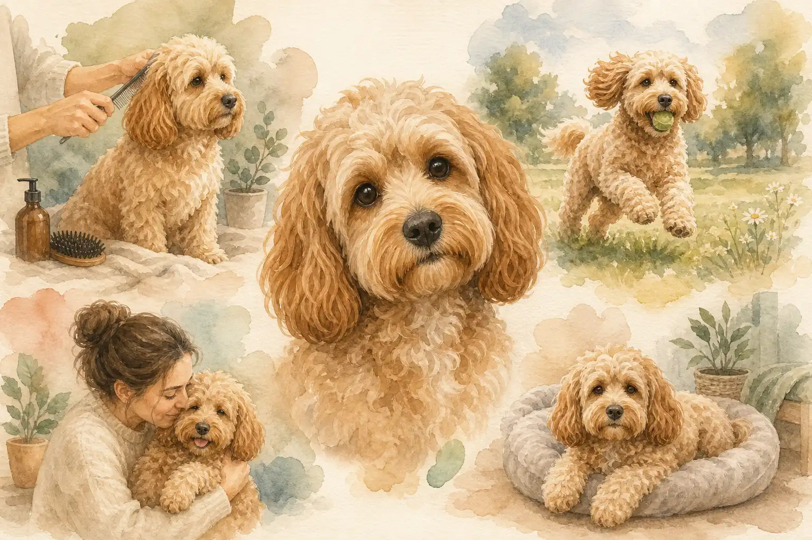
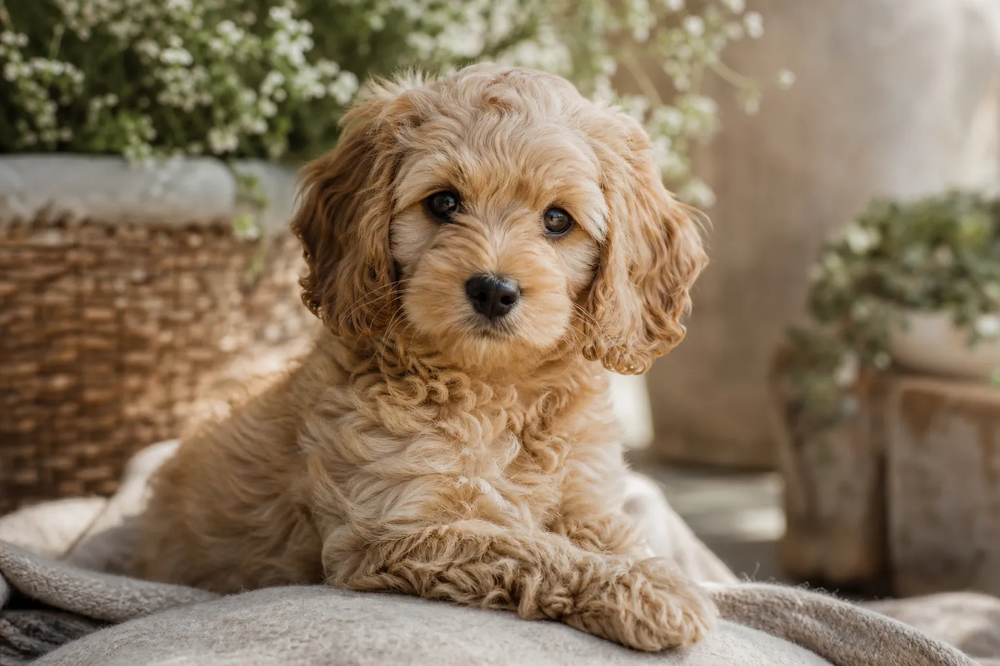
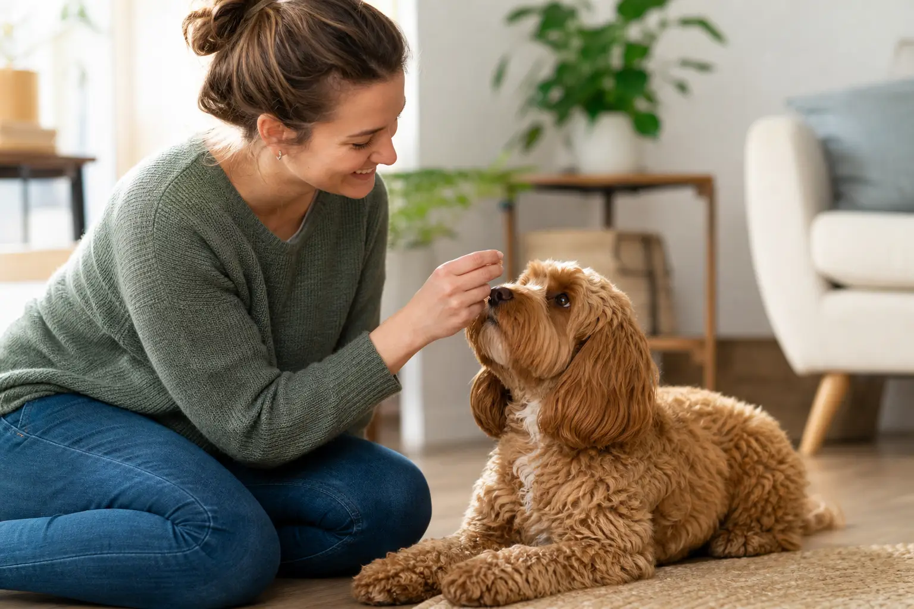
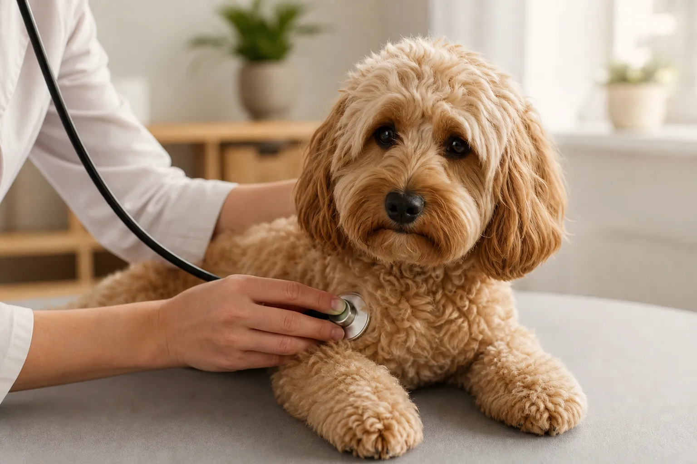

Der Cockapoo ist eine der beliebtesten Hybridrassen in Deutschland: lernfreudig, menschenbezogen, wenig haarend und in mehreren Größen erhältlich. Wer einen Cocker Spaniel mit einem Pudel kreuzt, erhält einen Hund, der sich sowohl für Familien als auch für Einzelpersonen eignet und dabei erstaunlich pflegeleicht im Alltag ist.

Dieser Artikel zeigt dir alles, was du über den Cockapoo wissen musst: Herkunft, Charakter, Fellpflege, typische Krankheiten und worauf du beim Kauf oder der Adoption achten solltest. Auch die Generationsfrage (F1, F1b, F2) und der Vergleich mit ähnlichen Doodle-Hunden kommen nicht zu kurz.

## Was ist ein Cockapoo? Steckbrief und Überblick

Der Cockapoo, manchmal auch Cockerpoo geschrieben, ist ein Hybridhund aus Cocker Spaniel und Pudel. Er gehört zur wachsenden Familie der sogenannten Doodle-Hunde, also Pudel-Kreuzungen, die auf geringes Haaren und hohe Intelligenz gezüchtet werden. Im Gegensatz zu anerkannten Reinrassehunden besitzt der Cockapoo keinen offiziellen FCI-Standard, wird aber von spezialisierten Zuchtverbänden in Großbritannien und den USA betreut.

Was den Cockapoo von anderen Hybridrassen unterscheidet, ist seine lange Geschichte: Erste gezielte Verpaarungen fanden bereits in den 1950er Jahren in den USA statt, lange bevor der Doodle-Hype der 2000er Jahre einsetzte. Damit gilt er als einer der ältesten modernen Hybridhunde überhaupt.

### Cockapoo auf einen Blick: die wichtigsten Fakten

| Merkmal | Details |
|---|---|
| Herkunft | USA (1950er Jahre), heute weltweit |
| Elternrassen | Cocker Spaniel (English oder American) × Pudel |
| Schulterhöhe | 25–38 cm (je nach Größenvariante) |
| Gewicht | 5–11 kg |
| Lebensdauer | 13–15 Jahre |
| Fell | Lockig bis wellig, wenig haarend |
| Charakter | Freundlich, verspielt, intelligent, menschenbezogen |
| Geeignet für | Familien, Senioren, Einsteiger |
| FCI-Anerkennung | Nein (Hybridrasse) |
| Pflegeaufwand | Mittel bis hoch (regelmäßiges Scheren nötig) |

Zusammenfassung: Cockapoo auf einen Blick

<ul>
<li><strong>Hybridrasse aus Cocker Spaniel und Pudel</strong> – seit den 1950er Jahren gezielt gezüchtet, kein FCI-Standard</li>
<li><strong>Drei Größenvarianten</strong> – Toy, Miniatur und Standard, Gewicht 5–11 kg</li>
<li><strong>Wenig haarend</strong> – durch den Pudel-Anteil bedingt, aber nicht garantiert allergiefrei</li>
<li><strong>Anfängertauglich</strong> – lernfreudig und kooperativ, braucht aber tägliche Beschäftigung</li>
</ul>

## Herkunft: Cocker Spaniel trifft Pudel

Die Idee hinter dem Cockapoo war von Anfang an pragmatisch: Ein Hund, der die Freundlichkeit und Jagdfreude des Cocker Spaniels mit der Intelligenz und dem geringen Haaren des Pudels verbindet. Erste dokumentierte Verpaarungen entstanden in den USA in den späten 1950er Jahren, zunächst ohne gezielte Zuchtprogramme. Mit dem Boom der Designerhunde in den 1990er und 2000er Jahren stieg die Nachfrage nach Cockapoos rasant an, besonders in Großbritannien, wo heute der Cockapoo Club of Great Britain Standards für die Zucht pflegt.

In Deutschland ist der Cockapoo seit etwa 2010 populär und zählt inzwischen zu den meistgesuchten Hybridrassen überhaupt. Laut [Bundestieraerztekammer](https://www.bundestieraerztekammer.de/) ist die Nachfrage nach Hybridhunden in den letzten zehn Jahren kontinuierlich gestiegen, was leider auch unseriöse Anbieter auf den Plan gerufen hat.

### English Cocker Spaniel vs. American Cocker Spaniel als Elternrasse

Beim Cockapoo kommen zwei verschiedene Cocker-Spaniel-Varianten als Elternteil infrage, die sich deutlich unterscheiden.

Der **English Cocker Spaniel** ist etwas größer, robuster und jagdlich stärker ausgeprägt. Er bringt einen aktiven, neugierigen Charakter mit und ist in Europa die häufiger verwendete Elternrasse. Sein Fell ist seidig und mittellang, was das Cockapoo-Fell wellig bis leicht lockig beeinflusst.

Der **American Cocker Spaniel** ist kleiner, hat ein üppigeres, längeres Fell und gilt als etwas sanftmütiger im Wesen. Aus dieser Kombination entstehen oft besonders kompakte, plüschige Cockapoos. In Deutschland wird der American Cocker Spaniel seltener als Elterntier eingesetzt als sein englischer Verwandter.

### F1, F1b und F2: Was bedeuten die Generationen beim Cockapoo?

Die Generationsbezeichnungen geben an, wie die Elterntiere eines Cockapoos zusammengesetzt sind. Das hat direkte Auswirkungen auf Fell, Haaren und Vorhersagbarkeit des Wesens.

| Generation | Zusammensetzung | Pudel-Anteil | Besonderheit |
|---|---|---|---|
| F1 | Cocker Spaniel × Pudel | 50 % | Klassische Kreuzung, variable Ergebnisse |
| F1b | F1-Cockapoo × Pudel | ca. 75 % | Weniger Haaren, lockigeres Fell |
| F2 | F1-Cockapoo × F1-Cockapoo | ca. 50 % | Sehr variable Ergebnisse in Fell und Wesen |
| F2b | F1-Cockapoo × F1b-Cockapoo | ca. 62 % | Kompromiss zwischen F1 und F1b |

F1-Cockapoos gelten als besonders vital durch den sogenannten Hybridvigour-Effekt. F1b-Cockapoos sind die erste Wahl für Allergiker, da der höhere Pudel-Anteil das Haaren weiter reduziert.

1950er

Erste gezielte Cockapoo-Zucht in den USA

48.000

Monatliche Suchanfragen in Deutschland

15 Jahre

Durchschnittliche Lebenserwartung

3 Größen

Toy, Miniatur und Standard

## Aussehen und Größe des Cockapoo

Der Cockapoo ist ein kompakter, gut proportionierter Hund mit ausdrucksstarken Augen und hängenden Ohren. Sein auffälligstes Merkmal ist das lockige oder wellige Fell, das je nach Pudel-Anteil und Elterntieren sehr unterschiedlich ausfallen kann. Kein Cockapoo sieht exakt wie ein anderer aus, was seinen besonderen Charme ausmacht, aber auch bedeutet: Wer ein bestimmtes Aussehen erwartet, sollte die Elterntiere persönlich kennenlernen.

### Felltypen, Farben und Größenvarianten

Das Fell des Cockapoos lässt sich in drei Grundtypen einteilen. Das **lockige Fell** ähnelt dem Pudel und haart am wenigsten. Das **wellige Fell** ist der häufigste Typ und eine Mischung beider Elternteile. Das **glatte Fell** tritt selten auf, wenn der Cocker-Spaniel-Anteil dominiert, und haart mehr als die anderen Varianten.

Farblich ist der Cockapoo äußerst vielseitig: einfarbig in Crème, Apricot, Schokolade, Schwarz oder Rot, aber auch zweifarbig oder tricolor mit weißen Abzeichen sind häufig.

Die Größe hängt direkt vom verwendeten Pudel ab:

| Größenvariante | Pudel-Elternteil | Schulterhöhe | Gewicht |
|---|---|---|---|
| Toy-Cockapoo | Toy-Pudel | bis 25 cm | bis 5 kg |
| Miniatur-Cockapoo | Zwergpudel | 28–36 cm | 6–8 kg |
| Standard-Cockapoo | Großpudel | 36–38 cm | 9–11 kg |

🌀

Lockiges Fell

Pudel-dominant, haart kaum, braucht regelmäßiges Scheren alle 6–8 Wochen

〰️

Welliges Fell

Häufigster Typ, Mischung beider Elternteile, pflegeleicht mit regelmäßigem Bürsten

📏

Drei Größen

Toy (bis 5 kg), Miniatur (6–8 kg) und Standard (9–11 kg) – für jeden Haushalt etwas dabei

🎨

Viele Farben

Einfarbig in Crème, Apricot, Schokolade, Schwarz oder Rot – auch zweifarbig möglich

## Charakter und Wesen: Was macht den Cockapoo aus?

Der Cockapoo ist ein ausgesprochen menschenbezogener Hund. Er sucht aktiv die Nähe seiner Familie, ist verspielt und zeigt eine für Hybridrassen typische hohe Anpassungsfähigkeit. Sein Wesen kombiniert die Geselligkeit des Cocker Spaniels mit der Lernfreude und dem Arbeitseifer des Pudels, was ihn zu einem der kooperativsten Begleithunde macht.

Besonders hervorzuheben ist seine Empathie: Cockapoos reagieren sensibel auf die Stimmung ihrer Bezugspersonen und eignen sich deshalb auch als Therapie- und Begleithunde. Gleichzeitig neigen sie zur Trennungsangst, wenn sie zu viel Zeit alleine verbringen.

Stärken des Cockapoos

<ul>
<li>Sehr menschenbezogen und familienfreundlich</li>
<li>Hoch lernfähig, nimmt Kommandos schnell auf</li>
<li>Wenig bis kaum haarend (je nach Felltyp)</li>
<li>Gut geeignet für Wohnungshaltung bei ausreichend Auslauf</li>
<li>Lange Lebenserwartung von 13–15 Jahren</li>
<li>Verträgt sich gut mit Kindern und anderen Tieren</li>
</ul>

Herausforderungen

<ul>
<li>Neigt zu Trennungsangst bei langen Alleinzeiten</li>
<li>Regelmäßige Fellpflege und Schertermine nötig</li>
<li>Kein einheitlicher Rassestandard, Wesen variiert</li>
<li>Ohrentzündungen häufig durch hängende Ohren</li>
<li>Hoher Beschäftigungsbedarf – kein reiner Softhund</li>
</ul>

### Cockapoo im Vergleich: Ähnlichkeiten mit Goldendoodle & Co.

Der Cockapoo wird häufig mit dem Golden Doodle verglichen, einem Pudel-Golden-Retriever-Mix. Beide teilen den Pudel-Anteil und sind deshalb ähnlich lernfreudig und wenig haarend. Der wesentliche Unterschied liegt in der Größe und im Temperament: Goldendoodles werden deutlich größer (20–30 kg) und haben durch den Golden Retriever ein etwas ruhigeres Grundtempo. Der Cockapoo ist kompakter, lebhafter und braucht weniger Platz.

| Merkmal | Cockapoo | Golden Doodle | Labradoodle |
|---|---|---|---|
| Gewicht | 5–11 kg | 15–30 kg | 20–35 kg |
| Auslaufbedarf | Mittel | Hoch | Hoch |
| Haaren | Gering | Gering bis mittel | Gering bis mittel |
| Anfängertauglichkeit | Sehr gut | Gut | Gut |
| Platzbedarf | Gering bis mittel | Hoch | Hoch |

Wer eine [Hunderasse für Anfänger](https://hundewissen-mit-kopf.de/hunderassen/hunderasse-fuer-anfaenger/) sucht und in einer Wohnung lebt, hat mit dem Cockapoo gegenüber größeren Doodle-Varianten einen klaren Vorteil.

## Erziehung und Haltung: So wird der Cockapoo glücklich

1

Frühe Sozialisation

Ab der 8. Lebenswoche verschiedene Menschen, Tiere und Umgebungen kennenlernen lassen – das formt einen ausgeglichenen Erwachsenenhund.

2

Positive Verstärkung

Cockapoos reagieren hervorragend auf Lob und Leckerlis. Harte Korrekturen sind kontraproduktiv und beschädigen das Vertrauen.

3

Konsequente Regeln

Freundlich, aber klar: Cockapoos testen Grenzen aus, wenn sie nicht gesetzt werden. Klare Hausregeln von Anfang an erleichtern das Zusammenleben.

4

Alleine-Bleiben üben

Trennungsangst vorbeugen durch langsames Gewöhnen ans Alleinsein – beginnend mit wenigen Minuten, schrittweise gesteigert.

✓

Welpenschule besuchen

Eine gute Welpenschule gibt Grundlagen für Mensch und Hund und fördert die Sozialisation in der Gruppe.

### Ist der Cockapoo ein Anfängerhund?

Ja, der Cockapoo gilt als eine der anfängertauglichsten Hybridrassen. Er lernt schnell, ist kooperativ und vergibt Fehler in der Erziehung vergleichsweise leicht. Trotzdem sollten Ersthalter nicht unterschätzen, dass auch ein Cockapoo klare Führung, tägliche Beschäftigung und konsequente Erziehung braucht.

Wer sich unsicher ist, findet in der [Welpenerziehung](https://hundewissen-mit-kopf.de/erziehung-verhalten/welpenerziehung/) einen guten Einstieg. Eine Welpenschule ist keine Pflicht, aber eine echte Empfehlung, weil dort Sozialisation und Grundkommandos unter Anleitung geübt werden.

### Auslauf, Beschäftigung und Wohnungshaltung

Ein Cockapoo braucht mindestens zwei Spaziergänge täglich von je 30 bis 45 Minuten. Reine Bewegung reicht diesem intelligenten Hund aber nicht: Nasenarbeit, Apportieren, Suchspiele oder leichtes Agility halten ihn mental ausgelastet und verhindern unerwünschte Verhaltensweisen wie Bellen oder Kauen.

Wohnungshaltung ist möglich, wenn die täglichen Auslaufzeiten eingehalten werden. Ein Garten ist ein Bonus, aber keine Voraussetzung. Wichtig ist, dass der Cockapoo nicht stundenlang allein ist, da er zur Trennungsangst neigt.

## Cockapoo pflegen: Fell, Ohren und Gesundheitsvorsorge

Die Pflege des Cockapoos ist zeitintensiver als bei vielen Reinrassehunden. Das lockige oder wellige Fell verfilzt ohne regelmäßige Pflege schnell, und die hängenden Ohren machen den Hund anfällig für Entzündungen. Wer das im Voraus weiß und einplant, hat mit dem Cockapoo aber einen Hund, der wenig haart und kaum Geruch entwickelt.

### Fellpflege: Bürsten, Scheren und Trimmen

Das Fell eines Cockapoos sollte mindestens drei- bis viermal pro Woche gebürstet werden, bei lockigem Fell täglich. Ohne regelmäßiges [Hund bürsten](https://hundewissen-mit-kopf.de/hundepflege/hund-buersten/) entstehen Verfilzungen, die schmerzhaft sein können und nur noch durch Scheren zu beheben sind.

Alle sechs bis acht Wochen ist ein professioneller Scherntermin beim Hundefriseur empfehlenswert. Wer selbst scheren möchte, findet im Ratgeber [Hund trimmen](https://hundewissen-mit-kopf.de/hundepflege/hund-trimmen/) eine Schritt-für-Schritt-Anleitung. Beim Cockapoo wird meist ein gleichmäßiger Schnitt über den gesamten Körper bevorzugt, der das Fell auf 3 bis 5 cm kürzt und pflegeleicht hält.

Mehr Grundlagen zur täglichen Routine gibt es im Artikel zur [Fellpflege beim Hund](https://hundewissen-mit-kopf.de/hundepflege/fellpflege-hund/).

### Ohren, Augen und Zahnpflege beim Cockapoo

Die hängenden Ohren des Cockapoos stauen Wärme und Feuchtigkeit, was Ohrentzündungen begünstigt. Die Ohren sollten wöchentlich kontrolliert und bei Bedarf mit einem speziellen Ohrreiniger gesäubert werden. Rötungen, unangenehmer Geruch oder häufiges Kratzen am Ohr sind Warnsignale für eine Entzündung und sollten tierärztlich abgeklärt werden.

Die Augen neigen bei manchen Cockapoos zu Tränenflecken, besonders bei hellen Fellfarben. Regelmäßiges Abtupfen mit einem feuchten Tuch reicht meist aus. Die Zähne sollten mehrmals wöchentlich mit einer Hundezahnbürste geputzt werden, um Zahnstein und Parodontitis vorzubeugen.

✅ Cockapoo Pflege-Checkliste

✓

Fell 3–4x pro Woche bürsten (lockiges Fell täglich)

✓

Alle 6–8 Wochen Scherntermin beim Hundefriseur

✓

Ohren wöchentlich kontrollieren und bei Bedarf reinigen

✓

Augen täglich auf Tränenflecken und Rötungen prüfen

✓

Zähne mehrmals wöchentlich putzen

Krallen alle 4–6 Wochen kontrollieren und ggf. kürzen

Jährliche Vorsorgeuntersuchung beim Tierarzt

## Gesundheit: Typische Krankheiten beim Cockapoo

⚠️

<strong>Wichtiger Hinweis zur Gesundheit</strong>

Dieser Artikel ersetzt keinen Tierarztbesuch. Bei auffälligen Symptomen wie Augentrübung, häufigem Kratzen, Lahmheit oder Verhaltensänderungen sollte immer eine Tierärztin oder ein Tierarzt konsultiert werden. Regelmäßige Vorsorgeuntersuchungen sind die beste Früherkennung.

Der Cockapoo profitiert vom sogenannten Hybridvigour: Durch die Kreuzung zweier genetisch unterschiedlicher Rassen sinkt die Wahrscheinlichkeit, dass sich rezessive Erbkrankheiten beider Elternlinien gleichzeitig manifestieren. Das macht ihn im Schnitt robuster als viele Reinrassehunde. Trotzdem können Erkrankungen beider Elternrassen auftreten, weshalb Gesundheitstests der Elterntiere unverzichtbar sind.

### Erbkrankheiten der Elternrassen und Hybridvitalität

Aus der **Cocker-Spaniel-Linie** sind vor allem zwei Erkrankungen relevant. Die **Progressive Retinaatrophie (PRA)** ist eine erbliche Augenerkrankung, die zur Erblindung führen kann. Seriöse Züchter lassen Elterntiere per DNA-Test auf PRA prüfen. Dazu kommen chronische **Ohrentzündungen** (Otitis externa) durch die anatomisch bedingte schlechte Belüftung der Ohren.

Aus der **Pudel-Linie** sind **Hüftdysplasie (HD)** und **Patellaluxation** bekannt. Bei der Patellaluxation springt die Kniescheibe aus ihrer Führungsrinne, was sich durch gelegentliches Hüpfen auf drei Beinen äußert. Laut [Veterinaermedizinischer Universitaet Wien](https://www.vetmeduni.ac.at/) zählt die Patellaluxation zu den häufigsten orthopädischen Erkrankungen bei kleinen Hunderassen.

| Erkrankung | Herkunft | Vorbeugung |
|---|---|---|
| Progressive Retinaatrophie | Cocker Spaniel | DNA-Test der Elterntiere |
| Ohrentzündung | Cocker Spaniel | Regelmäßige Ohrenkontrolle |
| Hüftdysplasie | Pudel | HD-Röntgen der Elterntiere |
| Patellaluxation | Pudel | Untersuchung durch Züchter |
| Epilepsie | Beide Linien | Stammbaum-Analyse |

## Cockapoo kaufen: Züchter, Kosten und Tierheim

💡

<strong>Tipp: Seriöse Züchter erkennen</strong>

Ein seriöser Cockapoo-Züchter zeigt dir die Mutter beim Welpen, stellt Gesundheitszertifikate beider Elterntiere vor und lässt dich den Welpen erst nach der 8. Lebenswoche mitnehmen. Wer Welpen ohne Mutterhund anbietet oder per Vorkasse-Überweisung verkauft, ist ein klares Warnsignal für einen Welpenhandel.

### Cockapoo Welpen kaufen – worauf beim Züchter achten?

Cockapoo Welpen kaufen bedeutet in Deutschland, gut zu recherchieren, da die Rasse keinem anerkannten Zuchtverband wie dem VDH angehört. Es gibt jedoch spezialisierte Verbände wie den Cockapoo Club of Great Britain oder nationale Züchtergemeinschaften, deren Mitglieder sich freiwilligen Gesundheitsstandards verpflichten.

Seriöse Züchter verlangen zwischen 1.200 und 2.500 EUR für einen Welpen. Wer deutlich weniger zahlt, sollte misstrauisch werden. Der [Deutscher Tierschutzbund](https://www.tierschutzbund.de/) warnt ausdrücklich vor Welpen aus dem Internet-Schnellverkauf, bei dem Gesundheitstests fehlen und Welpen zu früh von der Mutter getrennt werden.

Checkliste für den Züchterbesuch:

- Mutterhund vor Ort und sichtbar entspannt
- Gesundheitszertifikate für PRA, HD und Patellaluxation der Elterntiere
- Welpen wurden entwurmt und erstgeimpft
- Socialisierung in häuslicher Umgebung (kein Zwingerbetrieb)
- Züchter stellt Fragen zu deiner Lebenssituation

Wer regional sucht, findet über Suchbegriffe wie „Cockapoo Züchter Bayern" oder „Cockapoo Züchter NRW" erste Treffer. Wichtiger als die Region ist aber die Qualität: Lieber weiter fahren zu einem seriösen Züchter als einen Welpen aus zweifelhafter Quelle kaufen.

### Cockapoo aus dem Tierheim adoptieren

Cockapoo aus dem Tierheim zu adoptieren ist eine sinnvolle Alternative zum Kauf. Zwar sind reinrassige oder klar definierte Hybridwelpen in Tierheimen selten, aber erwachsene Cockapoos oder Cockapoo-Mischlinge tauchen regelmäßig auf. Suchen über „Cockapoo Tierheim NRW" oder ähnliche regionale Begriffe auf Plattformen wie Tasso, Tierheimhelden oder dem Deutschen Tierschutzbund lohnt sich.

Der Vorteil einer Adoption: Das Wesen des Hundes ist bereits sichtbar, Trennungsangst und Sozialverhalten sind einschätzbar. Viele Tierheimhunde sind bereits kastriert, gechipt und grundgeimpft. Die Schutzgebühr liegt meist zwischen 150 und 400 EUR.

## Fazit: Ist der Cockapoo der richtige Hund für dich?

Der Cockapoo ist ein vielseitiger, lernfreudiger und menschenbezogener Begleithund, der sich für Familien, Paare und Einzelpersonen eignet. Sein geringes Haaren macht ihn attraktiv für Menschen mit leichten Allergien, auch wenn er kein garantiert allergifreier Hund ist. Der Pflegeaufwand für das Fell ist real und sollte zeitlich und finanziell eingeplant werden.

Wer täglich Zeit für Bewegung und mentale Beschäftigung mitbringt, einen Hund mit Charakter sucht und bereit ist, regelmäßige Pflegetermine einzuhalten, wird im Cockapoo einen treuen, langlebigen Begleiter finden. Wer dagegen einen pflegeleichten Hund für lange Alleinzeiten sucht, sollte eine andere Rasse in Betracht ziehen.

## Häufige Fragen zum Cockapoo (FAQ)

Die häufigsten Fragen rund um den Cockapoo werden im FAQ-Bereich unterhalb des Artikels beantwortet. Dort findest du kompakte Antworten zu Größe, Haaren, Kosten, Auslauf, Gesundheit und den Generationsbezeichnungen F1, F1b und F2.