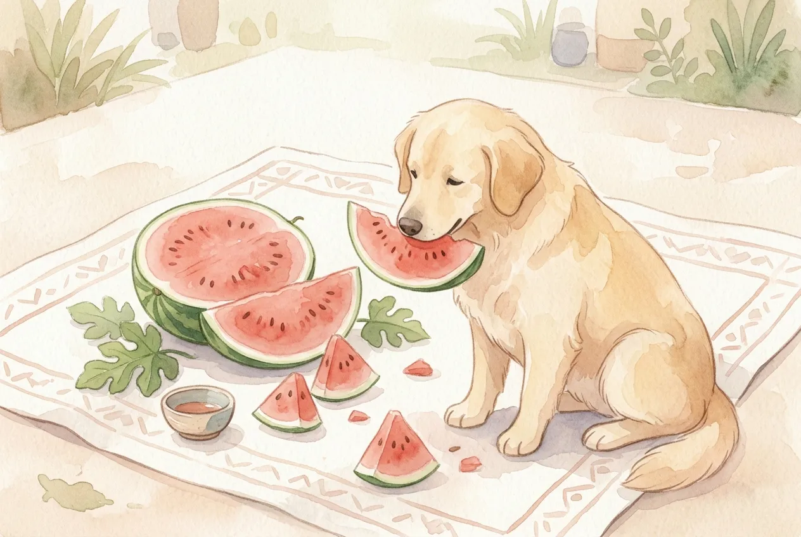
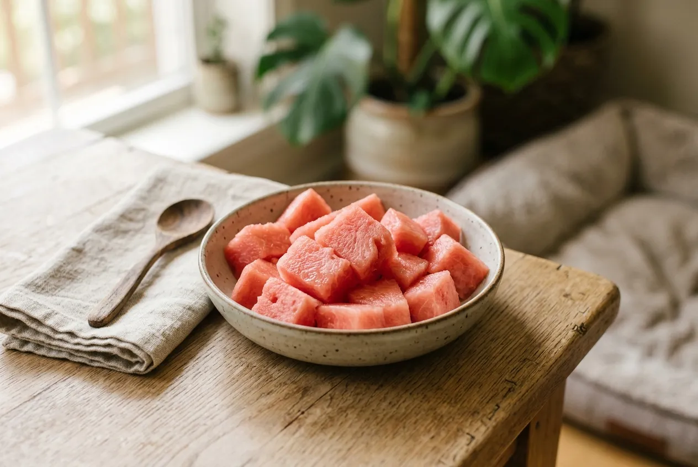
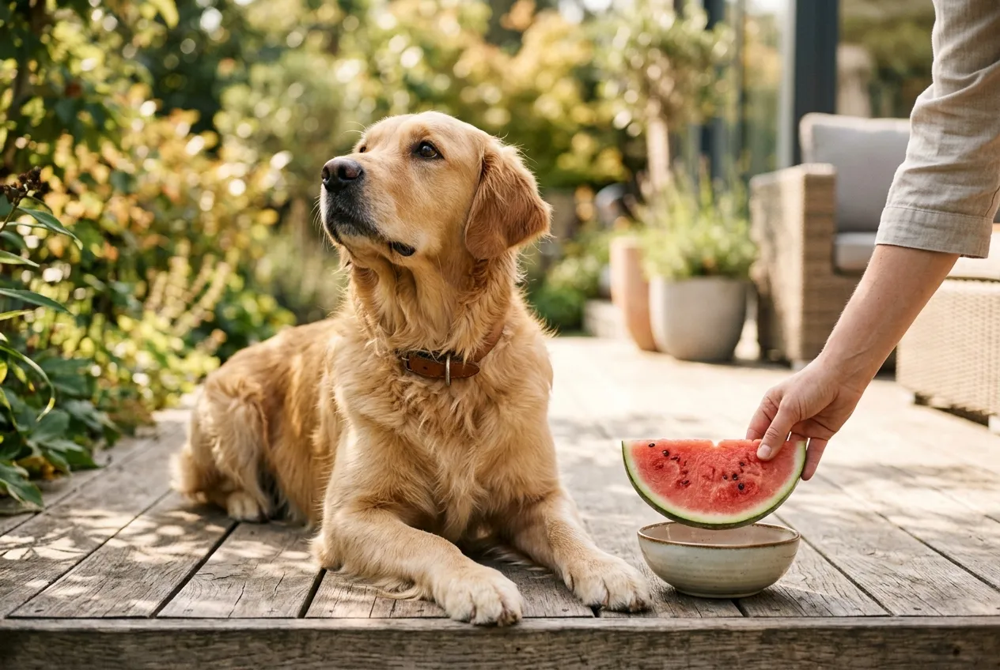

Hunde dürfen Wassermelone essen, solange du Kerne und Schale vorher entfernst. Das saftige Fruchtfleisch besteht zu rund 92 % aus Wasser und ist damit ein idealer Sommer-Snack für deinen Vierbeiner. Gleichzeitig liefert Wassermelone wertvolle Vitamine und Mineralstoffe bei nur etwa 30 kcal pro 100 g.

In diesem Ratgeber erfährst du, wie viel Wassermelone dein Hund je nach Körpergewicht fressen darf, warum Kerne und Schale tabu sind und wie du die Frucht am besten zubereitest. Außerdem bekommst du konkrete Rezeptideen für heiße Sommertage.

Zusammenfassung: Wassermelone für Hunde

<ul>
<li><strong>Grundsätzlich erlaubt</strong> – Das Fruchtfleisch der Wassermelone ist ungiftig und gut verträglich für Hunde</li>
<li><strong>Kerne entfernen</strong> – Wassermelonenkerne können bei kleinen Hunden Verdauungsprobleme oder im Extremfall einen Darmverschluss verursachen</li>
<li><strong>Schale ist tabu</strong> – Die grüne Schale ist schwer verdaulich und kann Erbrechen oder Durchfall auslösen</li>
<li><strong>Menge beachten</strong> – Maximal 5 bis 10 % der täglichen Futterration, bei kleinen Hunden etwa 50 bis 100 g pro Tag</li>
<li><strong>Nährstoffreich und kalorienarm</strong> – Nur 30 kcal pro 100 g, dafür reich an Vitamin A, Vitamin C und Lycopin</li>
</ul>

92 %

Wasseranteil

30 kcal

pro 100 g

5–10 %

max. Futteranteil

0 g

Fett

## Ist Wassermelone für Hunde gesund?

Wassermelone ist für Hunde ein gesunder Snack mit einem günstigen Nährstoffprofil. Der hohe Wasseranteil von 92 % macht die Frucht zu einem natürlichen Durstlöscher an heißen Tagen. Gleichzeitig enthält sie kaum Fett und nur wenig Zucker im Vergleich zu anderen Obstsorten.

Laut dem American Kennel Club (AKC) liefert Wassermelone die Vitamine A, B6 und C sowie Kalium und Magnesium. Besonders hervorzuheben ist der hohe Gehalt an Lycopin, einem Antioxidans, das Zellschäden durch freie Radikale entgegenwirkt. Der Lycopin-Gehalt von Wassermelone übertrifft sogar den von rohen Tomaten.

Für Hunde, die im Sommer wenig trinken, kann Wassermelone eine sinnvolle Ergänzung zur Flüssigkeitsversorgung sein. Ein 100-g-Stück liefert etwa 92 ml Wasser, fast so viel wie ein kleiner Schluck aus dem Napf.

### Nährstoffe der Wassermelone im Überblick

| Nährstoff | Gehalt pro 100 g | Nutzen für den Hund |
|---|---|---|
| Wasser | 92 g | Unterstützt die Flüssigkeitsversorgung |
| Kalorien | 30 kcal | Kalorienarmer Snack, ideal bei Übergewicht |
| Vitamin A | 569 IE | Fördert Sehkraft und Immunsystem |
| Vitamin C | 8,1 mg | Stärkt das Immunsystem |
| Vitamin B6 | 0,05 mg | Unterstützt den Stoffwechsel |
| Kalium | 112 mg | Wichtig für Herzfunktion und Muskeln |
| Lycopin | 4.500 µg | Antioxidans, schützt Zellen |
| Zucker | 6,2 g | Moderater Fruchtzuckergehalt |

✅

<strong>Wassermelone ist für Hunde erlaubt</strong>

Das Fruchtfleisch der Wassermelone ist ungiftig und gut verträglich. Es eignet sich als kalorienarmer Snack, besonders an warmen Sommertagen. Achte darauf, Kerne und Schale vorher zu entfernen.

## Wie viel Wassermelone darf ein Hund essen?

Die richtige Menge Wassermelone hängt vom Körpergewicht deines Hundes ab. Obst sollte generell nicht mehr als 5 bis 10 % der täglichen Futterration ausmachen. Das gilt auch für Wassermelone, obwohl sie kalorienarm ist.

Tierärzte empfehlen, bei der Fütterung von Obst die sogenannte 10-Prozent-Regel anzuwenden. Diese besagt, dass Snacks und Leckerlis zusammen maximal 10 % der täglichen Kalorienzufuhr ausmachen sollten. Bei einem mittelgroßen Hund mit einem Tagesbedarf von 800 kcal entspricht das etwa 80 kcal für Snacks, also rund 250 g Wassermelone.

### Empfohlene Tagesmenge nach Körpergewicht

| Hundegröße | Körpergewicht | Wassermelone pro Tag | Entspricht etwa |
|---|---|---|---|
| Kleine Hunde | bis 10 kg | 50–100 g | 2–3 mundgerechte Würfel |
| Mittelgroße Hunde | 10–25 kg | 100–200 g | 4–6 mundgerechte Würfel |
| Große Hunde | 25–40 kg | 200–300 g | 6–8 mundgerechte Würfel |
| Sehr große Hunde | über 40 kg | bis 400 g | 8–10 mundgerechte Würfel |

Füttere Wassermelone nicht täglich, sondern als gelegentlichen Snack 2 bis 3 Mal pro Woche. Zu häufiger Verzehr kann durch den Fruchtzucker und den hohen Wasseranteil zu weichem Stuhl führen.

💡

<strong>Tipp: Mit kleinen Mengen starten</strong>

Wenn dein Hund zum ersten Mal Wassermelone bekommt, starte mit einem daumennagelgroßen Stück. Beobachte 24 Stunden lang, ob Durchfall, Erbrechen oder Blähungen auftreten. Erst bei guter Verträglichkeit die Menge langsam steigern.

## Warum Kerne und Schale für Hunde gefährlich sind

Die Kerne und die Schale der Wassermelone sind die beiden Bestandteile, die du vor dem Füttern unbedingt entfernen musst. Beide können Verdauungsprobleme verursachen, die je nach Hundegröße unterschiedlich schwer ausfallen.

### Wassermelonenkerne: Risiko für den Darm

Wassermelonenkerne sind nicht giftig für Hunde. Einzelne verschluckte Kerne passieren den Verdauungstrakt in der Regel problemlos. Die Gefahr liegt in der Menge: Mehrere Kerne können sich im Darm ansammeln und bei kleinen Hunden unter 10 kg einen Darmverschluss (Ileus) verursachen.

Laut PetMD besteht das Risiko besonders bei Miniatur- und Toy-Rassen wie Chihuahuas oder Yorkshire Terriern. Bei großen Hunden wie Labradoren oder Schäferhunden ist die Wahrscheinlichkeit eines Darmverschlusses durch Wassermelonenkerne deutlich geringer, aber auch hier solltest du die Kerne entfernen.

### Wassermelonenschale: Schwer verdaulich

Die grüne Schale der Wassermelone enthält harte Pflanzenfasern, die der Hundemagen nicht aufspalten kann. Verschluckte Schalenstücke können Erbrechen, Durchfall und Bauchschmerzen verursachen. Auch der helle, grünlich-weiße Randbereich direkt unter der Schale ist für Hunde nicht geeignet.

🚫

<strong>Achtung: Darmverschluss durch Kerne oder Schale</strong>

Wenn dein Hund größere Mengen Kerne oder Schalenstücke gefressen hat und Symptome wie Erbrechen, Appetitlosigkeit, aufgeblähter Bauch oder Verstopfung zeigt, suche sofort einen Tierarzt auf. Ein Darmverschluss ist ein lebensbedrohlicher Notfall.

Fruchtfleisch: Erlaubt ✅

<ul>
<li>Gut verdaulich und bekömmlich</li>
<li>Reich an Vitaminen und Wasser</li>
<li>Kalorienarm mit nur 30 kcal/100 g</li>
<li>Natürlicher Durstlöscher im Sommer</li>
</ul>

Kerne & Schale: Tabu ❌

<ul>
<li>Kerne können Darmverschluss verursachen</li>
<li>Schale ist schwer verdaulich</li>
<li>Grüner Rand kann Magen-Darm-Probleme auslösen</li>
<li>Besonders gefährlich für kleine Hunderassen</li>
</ul>

## Wassermelone richtig zubereiten für Hunde

Die Zubereitung der Wassermelone für deinen Hund dauert nur wenige Minuten. Mit der richtigen Vorbereitung stellst du sicher, dass dein Vierbeiner den Snack sicher genießen kann.

1

Wassermelone waschen

Wasche die Wassermelone gründlich unter fließendem Wasser ab, um Pestizide und Schmutz von der Oberfläche zu entfernen.

2

Schale entfernen

Schneide das rote Fruchtfleisch großzügig von der Schale ab. Entferne auch den hellen, grünen Randbereich vollständig.

3

Alle Kerne entfernen

Entferne sämtliche schwarzen und weißen Kerne aus dem Fruchtfleisch. Alternativ greife zu kernlosen Wassermelonen-Sorten.

✓

Mundgerecht schneiden

Schneide das Fruchtfleisch in kleine Würfel, angepasst an die Größe deines Hundes. Für kleine Hunde etwa 1 cm, für große Hunde 2–3 cm.

Ein praktischer Tipp: Kaufe kernlose Wassermelonen (Seedless-Sorten), die im Handel mittlerweile weit verbreitet sind. Diese enthalten nur vereinzelt kleine, weiche Kerne, die für Hunde unbedenklich sind.

## Kreative Rezeptideen mit Wassermelone für Hunde

Wassermelone lässt sich auf verschiedene Arten als Hunde-Snack zubereiten. Besonders an heißen Sommertagen sind gefrorene Varianten beliebt, da sie gleichzeitig kühlen und beschäftigen.

🧊

Wassermelonen-Eis

Fruchtfleisch pürieren und in Eiswürfelformen einfrieren. Perfekter Kühl-Snack an heißen Tagen.

🥣

Frucht-Smoothie

Wassermelone mit etwas Naturjoghurt (laktosefrei) pürieren. Liefert Probiotika und Flüssigkeit.

🍉

Frische Würfel

Einfach mundgerecht geschnitten als Belohnung beim Training oder als Snack zwischendurch.

🦴

Gefüllter Kong

Pürierte Wassermelone in einen Kong füllen und einfrieren. Beschäftigt deinen Hund bis zu 30 Minuten.

🍳 Wassermelonen-Eis für Hunde (3 Zutaten)

<ul>
<li>200 g kernloses Wassermelonen-Fruchtfleisch pürieren</li>
<li>2 Esslöffel laktosefreien Naturjoghurt unterrühren</li>
<li>Masse in Eiswürfelformen oder Silikonformen füllen</li>
<li>Mindestens 4 Stunden im Gefrierfach durchfrieren lassen</li>
<li>Pro Snack-Portion: 1–2 Würfel für kleine Hunde, 3–4 für große Hunde</li>
</ul>

## Welche Melonensorten dürfen Hunde essen?

Neben Wassermelone gibt es weitere Melonensorten, die für Hunde grundsätzlich verträglich sind. Die Verträglichkeit und der Nährstoffgehalt unterscheiden sich jedoch deutlich zwischen den Sorten.

| Melonensorte | Für Hunde geeignet? | Kalorien pro 100 g | Besonderheit |
|---|---|---|---|
| Wassermelone | ✅ Ja | 30 kcal | Höchster Wasseranteil (92 %) |
| Honigmelone | ✅ Ja, in kleinen Mengen | 36 kcal | Höherer Zuckergehalt (8,1 g) |
| Cantaloupe-Melone | ✅ Ja | 34 kcal | Reich an Beta-Carotin |
| Galia-Melone | ✅ Ja, in kleinen Mengen | 34 kcal | Moderater Zuckergehalt |
| Bittergurke (Bittermelone) | ❌ Nein | – | Kann Magen-Darm-Reizungen verursachen |

Wassermelone ist unter allen Melonensorten die kalorienärmste und wasserreichste Variante. Honigmelonen enthalten etwa 30 % mehr Zucker als Wassermelonen und sollten daher noch sparsamer gefüttert werden, besonders bei übergewichtigen Hunden oder Hunden mit Diabetes.

ℹ️

<strong>Botanisch gesehen: Wassermelone ist ein Kürbisgewächs</strong>

Die Wassermelone (<em>Citrullus lanatus</em>) gehört zur Familie der Kürbisgewächse (Cucurbitaceae). Sie ist damit näher mit Gurken und Zucchini verwandt als mit den meisten Obstsorten. Auch Gurke und Zucchini sind für Hunde verträgliche Snacks.

## Wassermelone im BARF-Plan für Hunde

Wassermelone lässt sich in einen BARF-Plan als Teil der pflanzlichen Komponente integrieren. Im klassischen BARF-Modell besteht die Ration zu etwa 80 % aus tierischen und zu 20 % aus pflanzlichen Bestandteilen. Der pflanzliche Anteil teilt sich in Gemüse (75 %) und Obst (25 %) auf.

Für einen 20 kg schweren Hund mit einer täglichen BARF-Ration von 400 g bedeutet das: 80 g pflanzlicher Anteil, davon 20 g Obst. Wassermelone kann einen Teil dieser 20 g Obst ausmachen, sollte aber nicht die einzige Obstsorte sein. Eine Mischung aus verschiedenen Obstsorten wie [Äpfeln](https://hundewissen-mit-kopf.de/hundeernaehrung/duerfen-hunde-aepfel-essen/), [Erdbeeren](https://hundewissen-mit-kopf.de/hundeernaehrung/duerfen-hunde-erdbeeren-essen/) und [Bananen](https://hundewissen-mit-kopf.de/hundeernaehrung/duerfen-hunde-bananen-essen/) liefert ein breiteres Nährstoffspektrum.

Beachte, dass Wassermelone aufgrund ihres hohen Wasseranteils nur eine geringe Nährstoffdichte hat. Sie eignet sich eher als erfrischender Snack zwischendurch als als vollwertiger Obst-Bestandteil im BARF-Plan.

## Wann Hunde keine Wassermelone essen sollten

Trotz der grundsätzlichen Verträglichkeit gibt es Situationen, in denen du auf Wassermelone verzichten solltest. Bestimmte gesundheitliche Voraussetzungen machen die Fütterung problematisch.

Hunde mit **Diabetes mellitus** sollten Wassermelone nur nach Rücksprache mit dem Tierarzt bekommen. Obwohl der Zuckergehalt mit 6,2 g pro 100 g moderat ist, hat Wassermelone einen glykämischen Index von 72, was zu schnellen Blutzuckerschwankungen führen kann.

Hunde mit **chronischen Magen-Darm-Erkrankungen** wie IBD (Inflammatory Bowel Disease) oder einem empfindlichen Magen reagieren häufig mit Durchfall auf Wassermelone. Der hohe Wasseranteil und die Fruchtsäure können die Darmschleimhaut zusätzlich reizen.

Bei Hunden mit **Nierenerkrankungen** solltest du den Tierarzt konsultieren. Der hohe Kaliumgehalt der Wassermelone kann bei eingeschränkter Nierenfunktion problematisch sein, da die Nieren überschüssiges Kalium nicht ausreichend ausscheiden können.

⚠️

<strong>Vorsicht bei diesen Hunden</strong>

Hunde mit Diabetes, Nierenerkrankungen, chronischen Magen-Darm-Problemen oder bekannten Futtermittelallergien sollten Wassermelone nur nach tierärztlicher Freigabe bekommen. Im Zweifelsfall gilt: Lieber einmal mehr den Tierarzt fragen.

## Anzeichen einer Unverträglichkeit erkennen

Auch bei gesunden Hunden kann Wassermelone in Einzelfällen Unverträglichkeitsreaktionen auslösen. Die Symptome treten meist innerhalb von 2 bis 12 Stunden nach dem Verzehr auf.

Typische Anzeichen einer Unverträglichkeit sind:

- **Durchfall** (wässrig oder breiig)
- **Erbrechen** innerhalb weniger Stunden
- **Blähungen** und hörbare Darmgeräusche
- **Appetitlosigkeit** am folgenden Tag
- **Vermehrtes Grasfressen** als Zeichen von Übelkeit

Wenn diese Symptome auftreten, streiche Wassermelone vom Speiseplan deines Hundes. Leichte Symptome klingen in der Regel innerhalb von 24 Stunden von selbst ab. Hält der Durchfall länger als 48 Stunden an oder zeigt dein Hund Anzeichen von Dehydrierung (eingefallene Augen, trockene Schleimhäute, Lethargie), suche einen Tierarzt auf.

Manche Hunde, die Wassermelone nicht vertragen, kommen mit anderen Obstsorten wie [Äpfeln](https://hundewissen-mit-kopf.de/hundeernaehrung/duerfen-hunde-aepfel-essen/) oder [Erdbeeren](https://hundewissen-mit-kopf.de/hundeernaehrung/duerfen-hunde-erdbeeren-essen/) besser zurecht. Jeder Hund reagiert individuell.

## Wassermelone im Vergleich zu anderen Obstsorten für Hunde

Wassermelone ist nur eine von vielen Obstsorten, die Hunde fressen dürfen. Im Vergleich zu anderen beliebten Hundeobst-Sorten schneidet sie in einigen Kategorien besonders gut ab.

| Obstsorte | Kalorien/100 g | Wasseranteil | Zuckergehalt | Besonderer Vorteil |
|---|---|---|---|---|
| Wassermelone | 30 kcal | 92 % | 6,2 g | Höchster Wasseranteil |
| Erdbeere | 32 kcal | 91 % | 4,9 g | Weniger Zucker |
| Apfel | 52 kcal | 86 % | 10,4 g | Mehr Ballaststoffe |
| Banane | 89 kcal | 75 % | 12,2 g | Mehr Kalium und Energie |
| Blaubeere | 57 kcal | 84 % | 10 g | Höchster Antioxidantien-Gehalt |

Wassermelone hat den niedrigsten Kaloriengehalt und den höchsten Wasseranteil aller gängigen Hundeobst-Sorten. Für übergewichtige Hunde oder als Snack bei Hitze ist sie damit die beste Wahl. Für Hunde, die mehr Ballaststoffe oder Energie benötigen, sind Äpfel oder [Bananen](https://hundewissen-mit-kopf.de/hundeernaehrung/duerfen-hunde-bananen-essen/) besser geeignet.

Wenn du wissen möchtest, welche Lebensmittel für Hunde gefährlich sind, lies auch den Ratgeber zu [Schokolade für Hunde](https://hundewissen-mit-kopf.de/hundeernaehrung/warum-duerfen-hunde-keine-schokolade/) oder [Tomaten für Hunde](https://hundewissen-mit-kopf.de/hundeernaehrung/duerfen-hunde-tomaten-essen/).

📖

Definition: Lycopin

Lycopin ist ein natürliches Carotinoid und Antioxidans, das Wassermelonen ihre rote Farbe verleiht. Es schützt Zellen vor oxidativem Stress durch freie Radikale. Wassermelone enthält mit 4.500 µg pro 100 g mehr Lycopin als rohe Tomaten (2.573 µg/100 g).

## Checkliste: Wassermelone sicher füttern

✅ Checkliste: Wassermelone für deinen Hund

✓

Wassermelone gründlich waschen

✓

Schale und grünen Rand vollständig entfernen

✓

Alle Kerne herauslösen (oder kernlose Sorte kaufen)

✓

In mundgerechte Stücke schneiden (1–3 cm je nach Hundegröße)

✓

Tagesmenge an Körpergewicht anpassen (max. 5–10 % der Futterration)

Beim ersten Mal: 24 Stunden auf Unverträglichkeit beobachten

Bei Vorerkrankungen: Tierarzt vor der Fütterung fragen

## Fazit: Wassermelone ist ein idealer Sommer-Snack für Hunde

Hunde dürfen Wassermelone essen, und die meisten lieben den süßen, saftigen Geschmack. Mit 92 % Wasseranteil und nur 30 kcal pro 100 g ist das Fruchtfleisch ein kalorienarmer Durstlöscher, der gleichzeitig wertvolle Vitamine und Antioxidantien liefert.

Die wichtigste Regel lautet: Kerne und Schale immer entfernen. Halte dich an die empfohlene Tagesmenge von maximal 5 bis 10 % der Futterration und starte bei der ersten Fütterung mit einem kleinen Stück. Kernlose Wassermelonen-Sorten erleichtern die Zubereitung erheblich.

Ob als frische Würfel, gefrorenes Eis oder im Kong: Wassermelone bietet viele Möglichkeiten, deinem Hund an heißen Tagen eine gesunde Freude zu machen. Bei Hunden mit Vorerkrankungen wie Diabetes oder Nierenproblemen solltest du vorher den Tierarzt konsultieren.