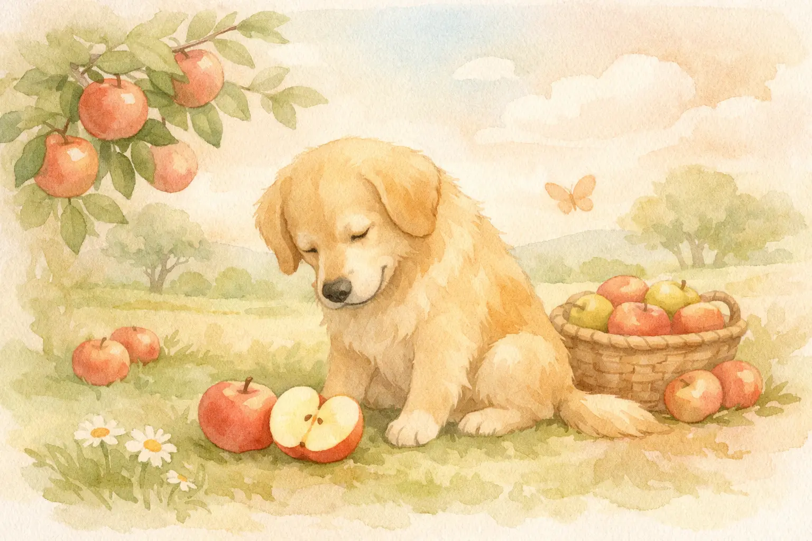
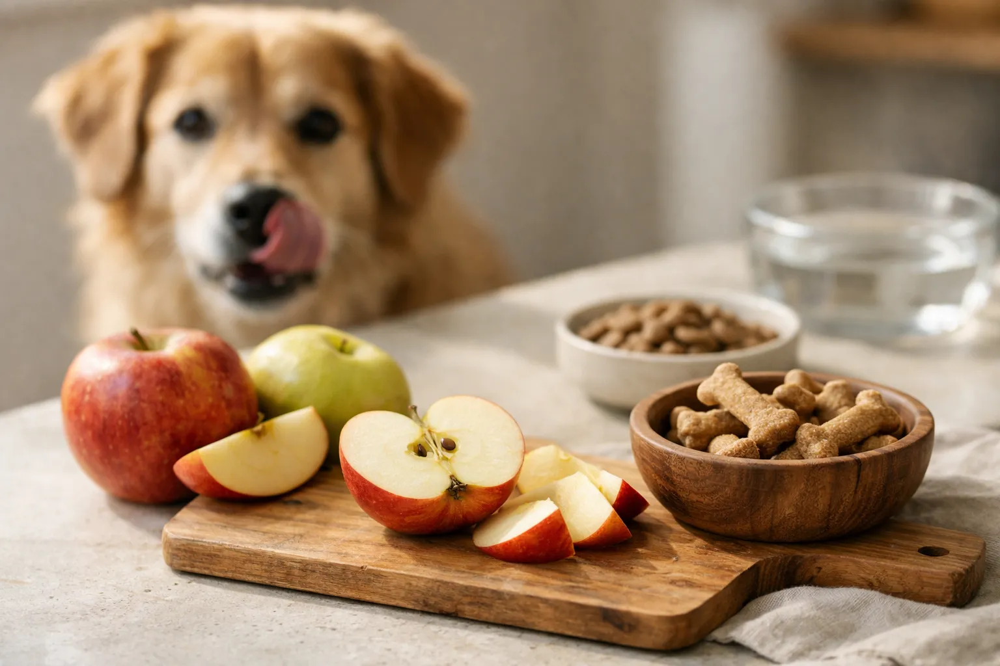
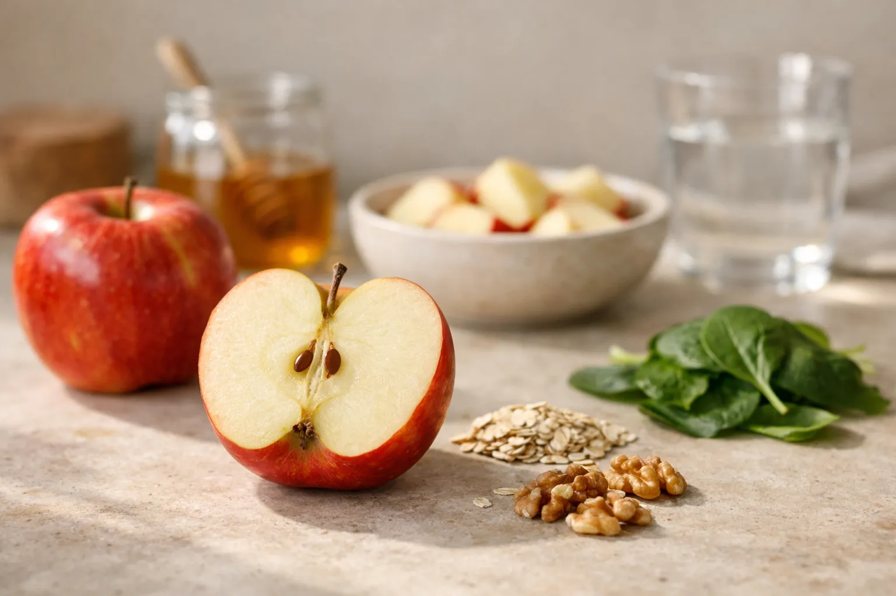

Hunde dürfen Äpfel essen -- und die meisten lieben den süßen, knackigen Snack sogar. Der Apfel gehört zu den gesündesten Obstsorten für Hunde, denn er liefert Vitamine, Ballaststoffe und Antioxidantien bei gleichzeitig niedrigem Kaloriengehalt von nur rund 52 kcal pro 100 g. Wichtig ist allerdings, dass du Kerngehäuse und Kerne vorher entfernst, da diese den Stoff Amygdalin enthalten.

In diesem Ratgeber erfährst du, welche Mengen Apfel für deinen Hund unbedenklich sind, ob die Schale dran bleiben darf und welche Apfelsorten sich besonders gut eignen. Außerdem klären wir, wann Äpfel als Hausmittel bei Verdauungsproblemen helfen und in welchen Fällen du lieber auf Äpfel verzichten solltest.

Zusammenfassung: Äpfel für Hunde

<ul>
<li><strong>Äpfel sind erlaubt</strong> -- Hunde dürfen Äpfel essen, sie gelten als gesunder, kalorienarmer Snack mit nur 52 kcal pro 100 g</li>
<li><strong>Kerngehäuse immer entfernen</strong> -- Apfelkerne enthalten Amygdalin, das im Körper zu Blausäure umgewandelt wird</li>
<li><strong>Richtige Menge beachten</strong> -- Obst sollte maximal 5–10 % der täglichen Futterration ausmachen</li>
<li><strong>Schale darf dran bleiben</strong> -- Gründlich gewaschene Apfelschale liefert zusätzliche Ballaststoffe und Vitamine</li>
<li><strong>Hausmittel bei Durchfall</strong> -- Geriebener Apfel kann dank Pektin bei leichten Verdauungsproblemen helfen</li>
</ul>

52 kcal

pro 100 g Apfel

85 %

Wassergehalt

2 g

Ballaststoffe pro 100 g

5–10 %

max. Obstanteil am Futter

## Warum Äpfel gesund für Hunde sind

Äpfel enthalten eine Kombination aus Vitaminen, Mineralien und sekundären Pflanzenstoffen, die auch für Hunde gesundheitliche Vorteile bieten. Besonders der hohe Gehalt an Vitamin C (12 mg pro 100 g), Vitamin A und Kalium macht den Apfel zu einem wertvollen Ergänzungssnack.

### Vitamine und Mineralstoffe im Apfel

Der Apfel für Hunde ist vor allem wegen seines Nährstoffprofils interessant. Vitamin C unterstützt das Immunsystem, während Vitamin A eine wichtige Rolle für Haut, Fell und Sehkraft spielt. Kalium trägt zur normalen Muskelfunktion und Herzgesundheit bei.

Laut der Tierärztlichen Hochschule Hannover können Hunde Vitamin C zwar selbst synthetisieren, doch bei Stress, Krankheit oder im Alter profitieren sie von einer zusätzlichen Zufuhr über die Nahrung.

### Ballaststoffe und Pektin

Äpfel liefern rund 2 g Ballaststoffe pro 100 g -- davon einen erheblichen Anteil als Pektin. Pektin ist ein löslicher Ballaststoff, der im Darm als Präbiotikum wirkt und die gesunde Darmflora unterstützt. Diese Eigenschaft macht den Apfel besonders wertvoll für Hunde mit empfindlicher Verdauung.

📖

Definition: Pektin

Pektin ist ein pflanzlicher Ballaststoff, der Wasser bindet und im Darm eine gelartige Masse bildet. Es reguliert die Verdauung und kann sowohl bei Durchfall als auch bei Verstopfung helfen.

### Antioxidantien und sekundäre Pflanzenstoffe

Äpfel enthalten Polyphenole und Flavonoide -- sekundäre Pflanzenstoffe mit antioxidativer Wirkung. Diese Stoffe schützen die Zellen vor freien Radikalen und können laut aktueller Forschung entzündungshemmend wirken. Besonders in der Schale sind diese Antioxidantien in hoher Konzentration enthalten.

## Nährstofftabelle: Was im Apfel steckt

Die folgende Tabelle zeigt die wichtigsten Nährstoffe pro 100 g frischem Apfel, die für Hunde relevant sind:

| Nährstoff | Gehalt pro 100 g | Nutzen für den Hund |
|---|---|---|
| Kalorien | 52 kcal | Kalorienarmer Snack |
| Wasser | 85,6 g | Hydration, besonders im Sommer |
| Ballaststoffe | 2,0 g | Verdauungsregulierung |
| Vitamin C | 12 mg | Immunsystem, Zellschutz |
| Vitamin A | 54 µg (als Beta-Carotin) | Haut, Fell, Sehkraft |
| Kalium | 107 mg | Muskelfunktion, Herzgesundheit |
| Kalzium | 6 mg | Knochen und Zähne |
| Fruchtzucker | 10 g | Natürliche Energiequelle |

Im Vergleich zu anderen beliebten Hundesnacks wie Leckerlis (durchschnittlich 350 kcal pro 100 g) ist der Apfel mit 52 kcal eine deutlich kalorienärmere Alternative. Wenn du wissen möchtest, welches Obst dein Hund sonst noch essen darf, findest du hilfreiche Infos in unserem Ratgeber [Dürfen Hunde Erdbeeren essen?](https://hundewissen-mit-kopf.de/hundeernaehrung/duerfen-hunde-erdbeeren-essen/).

## Wie viel Apfel darf ein Hund essen?

Die richtige Menge Apfel hängt von der Körpergröße und dem Gewicht deines Hundes ab. Tierärzte empfehlen, dass Obst und Gemüse insgesamt nicht mehr als 5–10 % der täglichen Futterration ausmachen sollten. Für Äpfel bedeutet das konkret:

| Hundegröße | Körpergewicht | Empfohlene Menge pro Tag |
|---|---|---|
| Kleine Hunde | bis 10 kg | 1–2 Apfelschnitze (ca. 20–40 g) |
| Mittelgroße Hunde | 10–25 kg | 2–4 Apfelschnitze (ca. 40–80 g) |
| Große Hunde | 25–45 kg | Bis zu ½ Apfel (ca. 80–120 g) |
| Sehr große Hunde | über 45 kg | Bis zu ¾ Apfel (ca. 120–150 g) |

💡

<strong>Tipp: Langsam anfangen</strong>

Wenn dein Hund zum ersten Mal Apfel bekommt, starte mit einem kleinen Stück und beobachte ihn 24 Stunden lang. Verträgt er den Snack ohne Blähungen oder Durchfall, kannst du die Menge schrittweise steigern.

### Mengen für Welpen und Senioren

Welpen ab 12 Wochen dürfen kleine Mengen Apfel erhalten -- maximal 1 Apfelschnitz pro Tag, am besten geschält und püriert. Seniorenhunde vertragen geriebenen Apfel besonders gut, da die zerkleinerte Form leichter verdaulich ist. Bei älteren Hunden mit Zahnproblemen ist pürierter Apfel die beste Wahl.

## Dürfen Hunde Äpfel mit Schale essen?

Hunde dürfen Äpfel mit Schale fressen, sofern der Apfel vorher gründlich unter warmem Wasser gewaschen wird. Die Schale enthält bis zu 70 % der im Apfel enthaltenen Antioxidantien und ist daher der nährstoffreichste Teil der Frucht.

Konventionell angebaute Äpfel können Pestizidrückstände auf der Schale tragen. Das Bundesinstitut für Risikobewertung (BfR) empfiehlt, Obst vor dem Verzehr gründlich zu waschen und trocken zu reiben. Bio-Äpfel sind die sicherere Wahl, da sie deutlich weniger Rückstände aufweisen.

Bei Hunden mit empfindlichem Magen kann die Schale zu Blähungen führen. In diesem Fall den Apfel schälen und in kleine Stücke schneiden. Auch für Welpen ist geschälter Apfel die verträglichere Variante.

## Apfelkerne und Kerngehäuse: Darauf solltest du achten

Apfelkerne enthalten den Stoff Amygdalin, der im Verdauungstrakt zu Blausäure (Cyanid) umgewandelt wird. Laut dem Bundesinstitut für Risikobewertung liegt der Amygdalingehalt in Apfelkernen bei etwa 1–4 mg pro Kern.

🚫

<strong>Achtung: Kerngehäuse immer entfernen!</strong>

Entferne vor dem Füttern konsequent das komplette Kerngehäuse inklusive aller Kerne. Auch wenn einzelne verschluckte Kerne meist ungefährlich sind, kann die regelmäßige Aufnahme größerer Mengen zu Vergiftungserscheinungen führen. Symptome einer Blausäurevergiftung sind Speicheln, Erbrechen, Atemnot und Krämpfe.

Ein einzelner versehentlich verschluckter Kern ist in der Regel kein Notfall -- die Blausäuremenge reicht bei einem Kern nicht aus, um toxisch zu wirken. Trotzdem ist es wichtig, das Kerngehäuse konsequent zu entfernen, bevor du deinem Hund Apfel gibst. Bei Verdacht auf eine Vergiftung beim Hund solltest du sofort einen Tierarzt aufsuchen.

## Apfel richtig zubereiten: Schritt-für-Schritt

Die richtige Zubereitung stellt sicher, dass dein Hund den Apfel sicher und gut verträglich genießen kann.

1

Apfel waschen

Den Apfel gründlich unter warmem Wasser abspülen und trocken reiben, um Pestizidrückstände zu entfernen.

2

Kerngehäuse entfernen

Den Apfel vierteln und das komplette Kerngehäuse inklusive aller Kerne herausschneiden.

3

Mundgerecht schneiden

Die Apfelstücke in kleine, dem Hund angepasste Stücke schneiden. Für kleine Hunde: dünne Scheiben. Für große Hunde: Viertel-Schnitze.

✓

Verfüttern

Die Stücke als Snack zwischendurch, als Belohnung beim Training oder als Topping über das Futter geben.

## Welche Apfelsorten eignen sich für Hunde?

Grundsätzlich dürfen Hunde alle gängigen Apfelsorten fressen. Unterschiede bestehen im Fruchtsäure- und Zuckergehalt, was die Verträglichkeit beeinflussen kann.

| Apfelsorte | Geschmack | Verträglichkeit für Hunde |
|---|---|---|
| Gala | Süß, mild | Sehr gut -- niedrige Fruchtsäure |
| Fuji | Süß, aromatisch | Sehr gut -- besonders beliebt |
| Golden Delicious | Süß, weich | Gut -- weiche Konsistenz |
| Braeburn | Süß-säuerlich | Gut -- moderate Fruchtsäure |
| Granny Smith | Sauer, knackig | Mäßig -- hoher Säuregehalt |
| Elstar | Säuerlich-frisch | Mäßig -- kann Magenreizung verursachen |

Süße Sorten wie Gala und Fuji werden von den meisten Hunden besser vertragen als saure Sorten wie Granny Smith. Hunde mit empfindlichem Magen sollten bevorzugt milde Sorten erhalten.

ℹ️

<strong>Grüne Äpfel für Hunde</strong>

Grüne Äpfel wie Granny Smith sind nicht giftig, enthalten aber mehr Fruchtsäure als rote Sorten. Bei empfindlichen Hunden können sie zu leichten Magenbeschwerden oder saurem Aufstoßen führen. Starte mit einer kleinen Menge und beobachte die Reaktion.

## Äpfel als Hausmittel bei Verdauungsproblemen

Geriebener Apfel ist ein bewährtes Hausmittel bei leichtem Durchfall -- nicht nur beim Menschen, sondern auch beim Hund. Das im Apfel enthaltene Pektin bindet im Darm Wasser und Schadstoffe, was den Stuhl festigt und die Darmschleimhaut schützt.

### So wendest du geriebenen Apfel an

Reibe einen geschälten, entkernten Apfel fein und lasse ihn 10–15 Minuten an der Luft stehen, bis er leicht bräunlich wird. Durch die Oxidation wird das Pektin aktiviert und die Wirkung verstärkt. Mische 1–2 Esslöffel unter das reguläre Futter oder biete den geriebenen Apfel pur an.

⚠️

<strong>Nur bei leichtem Durchfall anwenden</strong>

Geriebener Apfel ersetzt keinen Tierarztbesuch. Hält der Durchfall länger als 24 Stunden an, kommt Blut im Stuhl vor oder zeigt dein Hund Anzeichen von Dehydrierung, suche umgehend einen Tierarzt auf.

### Äpfel bei Verstopfung

Rohe Apfelstücke mit Schale können bei leichter Verstopfung helfen, da die unlöslichen Ballaststoffe der Schale die Darmtätigkeit anregen. Kombiniert mit ausreichend Wasser unterstützen die Faserstoffe eine gesunde Verdauung. Auch hier gilt: Bei anhaltenden Beschwerden den Tierarzt konsultieren.

## Apfelmus, Apfelchips und Apfelsaft: Was dürfen Hunde?

Neben dem frischen Apfel gibt es verschiedene Apfelprodukte, die für Hundehalter interessant sein können. Nicht alle sind gleich gut geeignet.

✅

Selbstgemachtes Apfelmus

Ohne Zucker und Gewürze zubereitet ist Apfelmus leicht verdaulich und ideal für Welpen oder Senioren.

⚠️

Getrocknete Äpfel

Ungesüßt erlaubt, aber Vorsicht: 4-mal höherer Zuckergehalt als frischer Apfel. Nur in sehr kleinen Mengen füttern.

🚫

Gekauftes Apfelmus

Enthält oft Zucker, Zimt oder Konservierungsstoffe. Zimt kann in größeren Mengen die Leber belasten. Nicht empfehlenswert.

🚫

Apfelsaft

Zu hoher Zuckergehalt (ca. 10 g pro 100 ml) und keine Ballaststoffe. Kann Durchfall verursachen. Nicht für Hunde geeignet.

### Apfelessig für Hunde

Apfelessig wird in der Hundepflege gelegentlich als Fellspülung oder Nahrungsergänzung eingesetzt. Verdünnt (1 Teelöffel auf 500 ml Wasser) kann er laut Erfahrungsberichten das Fell glänzender machen und als natürliches Zeckenschutzmittel dienen. Wissenschaftliche Belege für die Wirksamkeit bei Hunden sind allerdings begrenzt. Bei empfindlichen Hunden kann Apfelessig die Magenschleimhaut reizen -- daher nur in stark verdünnter Form und nach Rücksprache mit dem Tierarzt anwenden.

## Wann Hunde keine Äpfel essen sollten

Trotz der vielen Vorteile gibt es Situationen, in denen Äpfel für Hunde nicht geeignet sind.

Äpfel erlaubt

<ul>
<li>Gesunde, ausgewachsene Hunde</li>
<li>Welpen ab 12 Wochen (geschält und püriert)</li>
<li>Hunde mit leichten Verdauungsproblemen</li>
<li>Übergewichtige Hunde (kalorienarmer Snack)</li>
<li>Senioren (gerieben oder als Mus)</li>
</ul>

Äpfel vermeiden

<ul>
<li>Hunde mit Diabetes (Fruchtzucker erhöht den Blutzucker)</li>
<li>Hunde mit bekannter Fructoseintoleranz</li>
<li>Bei akutem Erbrechen oder schwerem Durchfall</li>
<li>Hunde mit chronischen Nierenerkrankungen (Kaliumgehalt)</li>
<li>Bei allergischen Reaktionen auf Äpfel</li>
</ul>

Hunde mit Diabetes sollten Äpfel nur in Absprache mit dem Tierarzt erhalten, da 100 g Apfel rund 10 g Fruchtzucker enthalten. Bei Hunden mit Nierenerkrankungen kann der Kaliumgehalt problematisch sein -- hier ist eine tierärztliche Ernährungsberatung wichtig.

### Allergien und Unverträglichkeiten

Apfelallergien bei Hunden sind selten, kommen aber vor. Symptome einer Unverträglichkeit sind Juckreiz, Hautausschlag, Erbrechen oder Durchfall nach dem Verzehr. Tritt eine dieser Reaktionen auf, solltest du Äpfel vom Speiseplan streichen und einen Tierarzt aufsuchen. Auch bei einem Hund, der generell nicht fressen will, können gesundheitliche Ursachen dahinterstecken.

## Äpfel im Vergleich zu anderem Obst für Hunde

Der Apfel ist nicht das einzige Obst, das Hunde fressen dürfen. Die folgende Tabelle zeigt, wie er im Vergleich zu anderen beliebten Obstsorten abschneidet:

| Obst | Kalorien (pro 100 g) | Besonderheit | Für Hunde geeignet? |
|---|---|---|---|
| Apfel | 52 kcal | Reich an Pektin, kalorienarm | ✅ Ja |
| Banane | 89 kcal | Hoher Kaliumgehalt, energiereich | ✅ In Maßen |
| Erdbeere | 32 kcal | Sehr kalorienarm, Vitamin C | ✅ Ja |
| Blaubeere | 57 kcal | Starke Antioxidantien | ✅ Ja |
| Weintraube | 67 kcal | Enthält toxische Substanzen | 🚫 Giftig! |
| Kirsche | 50 kcal | Kerne enthalten Amygdalin | ⚠️ Nur entsteint |

Äpfel gehören neben Blaubeeren und Erdbeeren zu den am besten verträglichen Obstsorten für Hunde. Wenn du mehr über Bananen als Hundesnack erfahren möchtest, lies unseren Artikel [Dürfen Hunde Bananen essen?](https://hundewissen-mit-kopf.de/hundeernaehrung/duerfen-hunde-bananen-essen/).

🚫

<strong>Weintrauben und Rosinen sind für Hunde giftig!</strong>

Im Gegensatz zu Äpfeln sind Weintrauben und Rosinen für Hunde hochgiftig. Bereits kleine Mengen können akutes Nierenversagen auslösen. Halte diese Lebensmittel immer außer Reichweite deines Hundes. Mehr dazu in unserem Artikel über Vergiftungen beim Hund.

## Kreative Apfel-Snack-Ideen für Hunde

Äpfel lassen sich vielseitig in den Speiseplan deines Hundes integrieren. Hier sind drei einfache Rezeptideen:

🍳 Gefrorene Apfel-Leckerlis (Sommer-Snack)

<ul>
<li>1 Apfel schälen, entkernen und in kleine Würfel schneiden</li>
<li>Apfelwürfel mit 150 g Naturjoghurt (laktosefrei) vermischen</li>
<li>Masse in eine Eiswürfelform füllen</li>
<li>Mindestens 4 Stunden einfrieren</li>
<li>Als erfrischenden Snack an heißen Tagen anbieten (1–2 Würfel pro Hund)</li>
</ul>

Weitere Ideen: Apfelstücke als Belohnung beim Training nutzen, geriebenen Apfel unter das BARF-Menü mischen oder dünne Apfelscheiben im Backofen bei 80 °C für 2–3 Stunden zu selbstgemachten Apfelchips trocknen.

## Checkliste: Apfel für Hunde richtig füttern

✅ Checkliste: Äpfel sicher verfüttern

✓

Apfel gründlich unter warmem Wasser waschen

✓

Kerngehäuse und alle Kerne vollständig entfernen

✓

In mundgerechte, der Hundegröße angepasste Stücke schneiden

✓

Menge an Körpergewicht anpassen (max. 5–10 % der Tagesration)

✓

Beim ersten Mal nur ein kleines Stück geben und Reaktion beobachten

Optional: Schale entfernen bei empfindlichen Hunden oder Welpen

Optional: Bio-Äpfel bevorzugen für weniger Pestizidrückstände

## Fazit: Äpfel sind ein gesunder Snack für Hunde

Hunde dürfen Äpfel essen -- und sollten es auch ruhig regelmäßig tun. Der Apfel ist ein kalorienarmer, nährstoffreicher Snack, der Vitamine, Ballaststoffe und Antioxidantien liefert. Mit 52 kcal pro 100 g eignet er sich auch für übergewichtige Hunde als gesunde Belohnungsalternative.

Entscheidend ist die richtige Zubereitung: Kerngehäuse und Kerne immer entfernen, den Apfel gründlich waschen und die Menge an die Größe deines Hundes anpassen. Süße Sorten wie Gala oder Fuji werden von den meisten Hunden gut vertragen.

Ob als knackiger Snack zwischendurch, als geriebenes Hausmittel bei leichtem Durchfall oder als gefrorener Sommer-Leckerli -- der Apfel für Hunde ist vielseitig einsetzbar. Achte auf die empfohlenen Mengen, beobachte deinen Hund bei der Einführung neuer Lebensmittel und frage bei Unsicherheiten immer deinen Tierarzt.