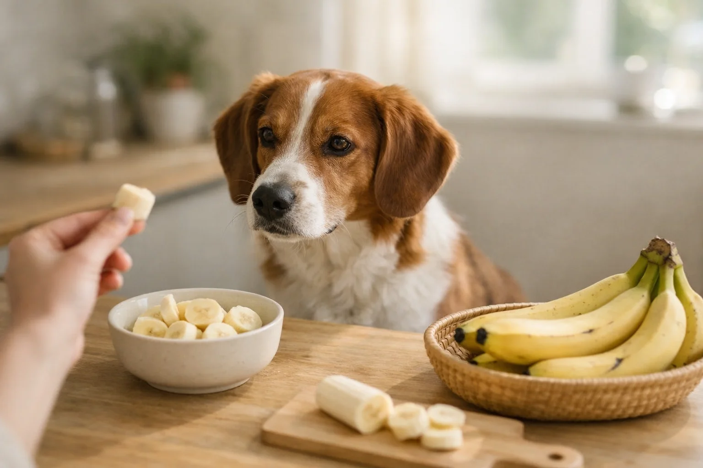
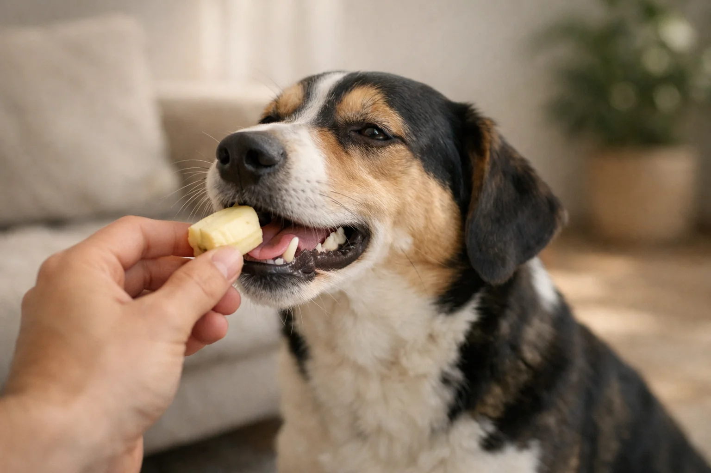

Hunde dürfen Bananen essen – und die meisten Vierbeiner lieben den süßen Geschmack der tropischen Frucht. Bananen sind nicht giftig für Hunde und liefern wertvolle Nährstoffe wie Kalium, Magnesium und Vitamin B6. Entscheidend ist allerdings die richtige Menge: Zu viel Banane kann durch den hohen Zuckergehalt zu Verdauungsproblemen und Übergewicht führen.

In diesem Ratgeber erfährst du genau, wie viel Banane dein Hund je nach Körpergröße fressen darf, welche Nährstoffe die Frucht liefert und wann du besser darauf verzichten solltest. Außerdem klären wir, ob Bananenschale, Bananenchips und getrocknete Bananen für Hunde geeignet sind.

<h4>Zusammenfassung: Bananen für Hunde</h4>
<ul>
<li><strong>Grundsätzlich erlaubt</strong> – Bananen sind nicht giftig und als gelegentlicher Snack für Hunde geeignet</li>
<li><strong>Richtige Menge beachten</strong> – Kleine Hunde max. 2-3 Scheiben, große Hunde max. 1 Banane pro Tag</li>
<li><strong>Wertvolle Nährstoffe</strong> – Kalium, Magnesium, Vitamin B6 und Vitamin C unterstützen Herz, Muskeln und Immunsystem</li>
<li><strong>Bananenschale entfernen</strong> – Die Schale ist schwer verdaulich und kann Pestizide enthalten</li>
<li><strong>10-Prozent-Regel einhalten</strong> – Snacks wie Banane sollten maximal 10 % der täglichen Kalorien ausmachen</li>
</ul>

89 kcal

pro 100 g Banane

358 mg

Kalium pro 100 g

12 g

Zucker pro 100 g

10 %

max. Snack-Anteil am Tagesbedarf

## Warum dürfen Hunde Bananen essen?

Bananen gehören zu den Obstsorten, die für Hunde unbedenklich sind. Sie enthalten keine für Hunde giftigen Substanzen wie etwa Theobromin in [Schokolade](https://hundewissen-mit-kopf.de/hundeernaehrung/warum-duerfen-hunde-keine-schokolade/) oder Persin in Avocados. Laut dem American Kennel Club empfehlen auch viele Tierärzte Banane als gesunde, fettarme Snack-Alternative zu industriellen Leckerlis.

Der Verdauungstrakt von Hunden kann die Nährstoffe aus reifer Banane gut aufnehmen. Das weiche Fruchtfleisch ist leicht verdaulich und wird von den meisten Hunden problemlos vertragen. Besonders bei Hunden mit empfindlichem Magen gilt die Banane als gut verträglicher Snack – vorausgesetzt, die Menge stimmt.

### Nährstoffe der Banane und ihr Nutzen für Hunde

Bananen liefern eine Reihe von Nährstoffen, die sich positiv auf die Gesundheit deines Hundes auswirken können. Die folgende Tabelle zeigt die wichtigsten Inhaltsstoffe pro 100 g reifer Banane (Quelle: USDA FoodData Central):

| Nährstoff | Menge pro 100 g | Nutzen für den Hund |
|---|---|---|
| Kalium | 358 mg | Unterstützt Herzfunktion und Muskelkontraktion |
| Magnesium | 27 mg | Fördert Knochenwachstum und Energiestoffwechsel |
| Vitamin B6 | 0,37 mg | Wichtig für Gehirnfunktion und Aminosäurestoffwechsel |
| Vitamin C | 8,7 mg | Stärkt das Immunsystem und wirkt antioxidativ |
| Ballaststoffe | 2,6 g | Fördern eine gesunde Verdauung |
| Zucker | 12,2 g | Liefert schnelle Energie – in großen Mengen problematisch |

### Wann Banane besonders hilfreich ist

Banane eignet sich besonders als Snack nach dem Sport oder langen Spaziergängen. Das Kalium unterstützt die Regeneration der Muskulatur nach körperlicher Belastung. Tierärzte empfehlen zermatschte Banane außerdem als Bestandteil einer Schonkost bei leichtem Durchfall, da das enthaltene Pektin überschüssiges Wasser im Darm binden kann.

✅

<strong>Banane als Medikamenten-Trick</strong>

Viele Hunde nehmen Tabletten bereitwilliger an, wenn du sie in ein Stück Banane einwickelst. Der süße Geschmack überdeckt den bitteren Medikamentengeschmack zuverlässig.

## Wie viel Banane darf ein Hund essen?

Die richtige Menge Banane hängt vom Körpergewicht deines Hundes ab. Grundsätzlich gilt die 10-Prozent-Regel: Snacks und Leckerlis – einschließlich Obst – sollten nicht mehr als 10 Prozent der täglichen Kalorienzufuhr ausmachen. Bei einer mittelgroßen Banane mit etwa 105 Kalorien kann das bei kleinen Hunden schnell überschritten sein.

### Fütterungsempfehlung nach Körpergröße

Die folgende Tabelle gibt dir eine Orientierung, wie viel Banane dein Hund pro Tag fressen darf:

| Hundegröße | Körpergewicht | Maximale Menge pro Tag | Entspricht ca. |
|---|---|---|---|
| Sehr klein (Chihuahua, Yorkshire Terrier) | Bis 5 kg | 2-3 dünne Scheiben | 20-30 g |
| Klein (Dackel, Malteser) | 5-10 kg | 3-5 Scheiben | 30-50 g |
| Mittelgroß (Beagle, Cocker Spaniel) | 10-25 kg | Halbe Banane | 50-60 g |
| Groß (Labrador, Schäferhund) | 25-40 kg | 1 Banane | 100-120 g |
| Sehr groß (Deutsche Dogge, Bernhardiner) | Über 40 kg | 1 Banane | 100-120 g |

Auch bei großen Hunden ist eine ganze Banane pro Tag die Obergrenze. Der hohe Zuckergehalt von rund 12 g pro 100 g macht die Banane zu einem Snack, der in Maßen gefüttert werden sollte – nicht als Mahlzeitenersatz.

💡

<strong>Tipp: Banane portionieren und einfrieren</strong>

Schneide eine Banane in Scheiben, lege sie auf ein Backblech mit Backpapier und friere sie einzeln ein. So hast du immer portionsgenaue Snacks griffbereit – besonders erfrischend an heißen Sommertagen.

### Wie oft dürfen Hunde Banane fressen?

Banane sollte nicht täglich auf dem Speiseplan stehen. Zwei- bis dreimal pro Woche als Snack ist eine sinnvolle Häufigkeit. Wechsle Banane mit anderen hundesicheren Obstsorten wie [Erdbeeren](https://hundewissen-mit-kopf.de/hundeernaehrung/duerfen-hunde-erdbeeren-essen/) oder Blaubeeren ab, um eine abwechslungsreiche Nährstoffversorgung zu gewährleisten.

## Dürfen Hunde Bananenschale essen?

Hunde sollten keine Bananenschale fressen. Die Schale ist zwar nicht direkt giftig, aber sie ist für den Hundemagen extrem schwer verdaulich. Die faserige Struktur kann im Magen-Darm-Trakt zu Verstopfung oder einem Darmverschluss führen – besonders bei kleinen Hunden.

Zusätzlich können sich auf der Bananenschale Pestizidrückstände befinden. Konventionell angebaute Bananen werden häufig mit Fungiziden behandelt, die bei Verzehr der Schale in den Körper des Hundes gelangen. Schäle die Banane daher immer vollständig, bevor du sie deinem Hund gibst.

⚠️

<strong>Hund hat Bananenschale gefressen?</strong>

Wenn dein Hund eine Bananenschale gefressen hat, beobachte ihn für 12-24 Stunden auf Symptome wie Erbrechen, Durchfall oder Appetitlosigkeit. Bei anhaltendem Würgen oder Anzeichen eines Darmverschlusses (aufgeblähter Bauch, Schmerzäußerungen) suche sofort einen Tierarzt auf.

## Dürfen Hunde Bananenchips essen?

Ob Hunde Bananenchips essen dürfen, hängt von der Zubereitungsart ab. Selbstgemachte Bananenchips ohne Zusätze sind in kleinen Mengen unbedenklich. Industriell hergestellte Bananenchips aus dem Supermarkt sind dagegen oft frittiert und enthalten zugesetzten Zucker, Honig oder Konservierungsstoffe – alles Inhaltsstoffe, die für Hunde nicht geeignet sind.

### Selbstgemachte Bananenchips für Hunde

Wenn du deinem Hund Bananenchips als Leckerli geben möchtest, stelle sie einfach selbst her:

1

<h4>Banane in dünne Scheiben schneiden</h4>

Schneide eine reife Banane in ca. 3-4 mm dünne Scheiben. Gleichmäßige Dicke sorgt für gleichmäßiges Trocknen.

2

<h4>Auf Backblech verteilen</h4>

Lege die Scheiben auf ein mit Backpapier ausgelegtes Blech. Achte darauf, dass sie sich nicht berühren.

3

<h4>Bei niedriger Temperatur trocknen</h4>

Backe die Scheiben bei 80-100 °C Umluft für 2-3 Stunden. Lasse die Ofentür einen Spalt offen, damit Feuchtigkeit entweichen kann.

✓

<h4>Abkühlen und lagern</h4>

Lass die Chips vollständig abkühlen. In einem luftdichten Behälter sind sie bis zu 2 Wochen haltbar.

### Gekaufte Bananenchips: Darauf musst du achten

Falls du doch zu gekauften Bananenchips greifst, prüfe die Zutatenliste sorgfältig. Die einzige Zutat sollte "Banane" sein. Produkte mit folgenden Zusätzen sind für Hunde nicht geeignet:

- Zugesetzter Zucker oder Honig
- Pflanzliche Öle (frittiert)
- Konservierungsstoffe
- Salz oder Gewürze
- Schokoladen- oder Joghurtglasur

## Dürfen Hunde getrocknete Bananen essen?

Getrocknete Bananen ohne Zusätze sind für Hunde grundsätzlich erlaubt. Durch den Trocknungsprozess verlieren Bananen jedoch Wasser, wodurch sich der Zuckergehalt pro Gramm deutlich konzentriert. Während 100 g frische Banane etwa 12 g Zucker enthalten, sind es bei getrockneter Banane rund 35 g Zucker pro 100 g – fast das Dreifache.

Füttere getrocknete Banane daher in deutlich kleineren Mengen als frische Banane. Als Faustregel gilt: Halbiere die empfohlene Menge für frische Banane. Ein mittelgroßer Hund sollte also nicht mehr als 2-3 kleine Stücke getrocknete Banane pro Tag bekommen.

ℹ️

<strong>Zuckergehalt im Vergleich</strong>

100 g frische Banane enthalten ca. 12 g Zucker. 100 g getrocknete Banane enthalten ca. 35 g Zucker. Getrocknete Banane hat also fast die dreifache Zuckerkonzentration – deshalb immer nur winzige Mengen füttern.

## In welcher Form dürfen Hunde Banane fressen?

Banane kann deinem Hund auf verschiedene Arten angeboten werden. Je nach Vorliebe und Situation eignen sich unterschiedliche Zubereitungsformen.

🍌
<h4>Frisch in Scheiben</h4>

Die einfachste Variante: Reife Banane schälen und in mundgerechte Scheiben schneiden. Ideal als schneller Snack zwischendurch.

🥶
<h4>Gefroren als Eis</h4>

Gefrorene Bananenstücke sind ein erfrischender Sommersnack. Alternativ zermatschte Banane in Eiswürfelformen einfrieren.

🥣
<h4>Zermatschtes Bananen-Mus</h4>

Pürierte Banane lässt sich gut unter das Futter mischen oder als Füllmasse für Kongs verwenden. Ideal für Welpen und Senioren.

🍪
<h4>Gebackene Bananen-Leckerlis</h4>

Zermatschte Banane mit Haferflocken mischen und bei 180 °C für 15 Minuten backen. Gesunde, selbstgemachte Leckerlis.

### Einfaches Rezept: Bananen-Leckerlis für Hunde

<h4>🍳 Bananen-Haferflocken-Kekse (ca. 20 Stück)</h4>
<ul>
<li>1 reife Banane mit einer Gabel zerdrückst</li>
<li>150 g zarte Haferflocken unterrühren</li>
<li>Optional: 1 EL Erdnussbutter (ohne Xylit!) hinzufügen</li>
<li>Teig zu kleinen Kugeln formen und auf ein Backblech setzen</li>
<li>Bei 180 °C Umluft für 12-15 Minuten goldbraun backen</li>
<li>Vollständig abkühlen lassen – kühl gelagert 5-7 Tage haltbar</li>
</ul>

## Wann sind Bananen schädlich für Hunde?

Obwohl Bananen grundsätzlich sicher sind, gibt es Situationen, in denen du auf die Fütterung verzichten solltest. Der hohe Zucker- und Kohlenhydratgehalt macht Bananen nicht für jeden Hund geeignet.

### Hunde mit Diabetes oder Übergewicht

Hunde mit diagnostiziertem Diabetes mellitus sollten keine Bananen fressen. Der natürliche Fruchtzucker lässt den Blutzuckerspiegel schnell ansteigen. Bei übergewichtigen Hunden sollte Banane ebenfalls nur sehr selten oder gar nicht gefüttert werden – eine mittelgroße Banane liefert rund 105 Kalorien, was bei einem 5-kg-Hund bereits über 10 Prozent des Tagesbedarfs ausmachen kann.

### Hunde mit Nierenerkrankungen

Der hohe Kaliumgehalt von 358 mg pro 100 g kann für Hunde mit eingeschränkter Nierenfunktion problematisch sein. Gesunde Nieren regulieren den Kaliumspiegel zuverlässig, aber bei Niereninsuffizienz kann sich Kalium im Blut anreichern und zu Herzrhythmusstörungen führen. Besprich die Fütterung von Banane bei nierenkranken Hunden immer mit deinem Tierarzt.

### Allergische Reaktionen

Bananenallergien sind bei Hunden selten, kommen aber vor. Symptome einer allergischen Reaktion können Juckreiz, Schwellungen im Maulbereich, Hautausschlag oder Verdauungsprobleme sein. Wenn du deinem Hund zum ersten Mal Banane gibst, starte mit einer einzelnen kleinen Scheibe und beobachte ihn für 24 Stunden.

🚫

<strong>Achtung bei Xylit-haltigen Bananen-Produkten!</strong>

Manche Bananenprodukte wie Smoothies oder Joghurts enthalten den Süßungsstoff Xylit (Xylitol). Xylit ist für Hunde hochgiftig – bereits 0,1 g pro Kilogramm Körpergewicht kann lebensgefährlich sein. Prüfe bei verarbeiteten Produkten immer die Zutatenliste. Mehr dazu im Ratgeber zu <a href="https://hundewissen-mit-kopf.de/hundegesundheit/vergiftung-hund/">Vergiftungen beim Hund</a>.

## Vorteile und Nachteile von Banane für Hunde

<h4>Vorteile</h4>
<ul>
<li>Reich an Kalium – unterstützt Herzfunktion und Muskeln</li>
<li>Vitamin B6 fördert den Aminosäurestoffwechsel</li>
<li>Ballaststoffe unterstützen eine gesunde Verdauung</li>
<li>Fettarm – nur 0,3 g Fett pro 100 g</li>
<li>Weiche Konsistenz – ideal für Welpen und Senioren</li>
<li>Pektin kann bei leichtem Durchfall helfen</li>
</ul>

<h4>Nachteile</h4>
<ul>
<li>Hoher Zuckergehalt (12 g pro 100 g) – nicht für Diabetiker-Hunde</li>
<li>Hoher Kaliumgehalt problematisch bei Nierenerkrankungen</li>
<li>Kann bei übermäßigem Verzehr Verstopfung verursachen</li>
<li>Bananenschale ist schwer verdaulich</li>
<li>Allergische Reaktionen möglich (selten)</li>
<li>Überreife Bananen haben noch höheren Zuckergehalt</li>
</ul>

## Reife Banane oder unreife Banane für Hunde?

Der Reifegrad der Banane beeinflusst sowohl den Geschmack als auch die Verträglichkeit für deinen Hund. Reife Bananen mit gelber Schale und leichten braunen Punkten sind die beste Wahl. Sie sind weich, leicht verdaulich und haben einen angenehm süßen Geschmack.

Unreife, grüne Bananen enthalten mehr resistente Stärke, die im Hundedarm schwerer abbaubar ist. Das kann zu Blähungen und Bauchschmerzen führen. Überreife Bananen mit stark brauner Schale sind zwar nicht schädlich, enthalten aber deutlich mehr Zucker als mittelreife Früchte.

| Reifegrad | Erkennungsmerkmal | Für Hunde geeignet? | Hinweis |
|---|---|---|---|
| Unreif (grün) | Harte Konsistenz, herber Geschmack | Nicht empfohlen | Hoher Stärkegehalt, schwer verdaulich |
| Reif (gelb) | Weich, süß, leichte braune Punkte | Optimal | Beste Verträglichkeit und Nährstoffgehalt |
| Überreif (braun) | Sehr weich, intensiv süß | In kleinen Mengen | Deutlich höherer Zuckergehalt |

## Banane als Hausmittel bei Magen-Darm-Problemen

Zermatschte Banane ist ein bewährtes Hausmittel bei leichten Magen-Darm-Beschwerden beim Hund. Das in der Banane enthaltene Pektin wirkt als natürlicher Verdickungsstoff im Darm und kann bei Durchfall helfen, den Stuhl zu festigen. Tierärzte empfehlen Banane häufig als Bestandteil einer Schonkost-Diät.

### Schonkost-Rezept mit Banane

Eine bewährte Schonkost-Kombination besteht aus gekochtem Hühnchenfleisch (ohne Haut und Knochen), gekochtem Reis und zermatschter Banane im Verhältnis 1:2:0,5. Füttere diese Mischung in kleinen Portionen über den Tag verteilt. Wenn der Durchfall deines Hundes länger als 24 Stunden anhält oder Blut im Stuhl sichtbar ist, suche umgehend einen Tierarzt auf.

⚠️

<strong>Banane ersetzt keinen Tierarztbesuch</strong>

Banane kann bei leichten Verdauungsbeschwerden unterstützend wirken, ersetzt aber keine tierärztliche Behandlung. Bei anhaltendem Erbrechen, blutigem Durchfall oder Apathie ist ein sofortiger Tierarztbesuch notwendig. Mehr Informationen findest du im Ratgeber <a href="https://hundewissen-mit-kopf.de/hundegesundheit/hund-frisst-nicht/">Hund frisst nicht</a>.

## Welche Obstsorten dürfen Hunde außer Banane noch essen?

Neben Bananen gibt es zahlreiche weitere Obstsorten, die für Hunde sicher sind. Abwechslung ist wichtig, um eine breite Palette an Nährstoffen abzudecken und den Zuckerkonsum durch eine einzelne Obstsorte zu begrenzen.

| Obstsorte | Für Hunde geeignet? | Besonderheit |
|---|---|---|
| Erdbeeren | ✅ Ja | Reich an Vitamin C, kalorienarm |
| Blaubeeren | ✅ Ja | Hoher Antioxidantiengehalt |
| Wassermelone | ✅ Ja (ohne Kerne und Schale) | Sehr wasserreich, erfrischend |
| Äpfel | ✅ Ja (ohne Kerngehäuse) | Ballaststoffreich, reinigt Zähne |
| Weintrauben | 🚫 Nein | Hochgiftig – kann Nierenversagen auslösen |
| Avocado | 🚫 Nein | Enthält Persin – giftig für Hunde |
| Kirschen | ⚠️ Nur Fruchtfleisch | Kerne enthalten Blausäure |

Wenn du wissen möchtest, welche Früchte dein Hund bedenkenlos naschen darf, findest du ausführliche Informationen in unserem Ratgeber [Dürfen Hunde Erdbeeren essen?](https://hundewissen-mit-kopf.de/hundeernaehrung/duerfen-hunde-erdbeeren-essen/).

## Checkliste: Banane sicher an deinen Hund füttern

<h4>✅ Banane richtig füttern – Checkliste</h4>

✓

Banane immer vollständig schälen – keine Bananenschale füttern

✓

Reife, gelbe Banane wählen – keine grünen oder stark braunen

✓

In mundgerechte Stücke schneiden – Erstickungsgefahr vermeiden

✓

Menge an Körpergröße anpassen – 10-Prozent-Regel beachten

✓

Beim ersten Mal nur 1 Scheibe geben und Verträglichkeit beobachten

Bei Diabetes, Nierenerkrankung oder Übergewicht vorher Tierarzt fragen

Keine verarbeiteten Bananenprodukte mit Zucker, Xylit oder Schokolade füttern

## Fazit: Dürfen Hunde Bananen essen – ja, aber in Maßen

Hunde dürfen Bananen essen, und für die meisten Vierbeiner ist die süße Frucht ein willkommener und gesunder Snack. Bananen liefern wertvolles Kalium, Magnesium und Vitamin B6 – Nährstoffe, die Herz, Muskeln und Nervensystem deines Hundes unterstützen. Entscheidend ist die richtige Dosierung: Kleine Hunde bekommen maximal 2-3 Scheiben, große Hunde höchstens eine ganze Banane pro Tag.

Verzichte auf Bananenschale, prüfe bei Bananenchips und getrockneten Bananen die Zutatenliste und meide Produkte mit Xylit oder zugesetztem Zucker. Bei Hunden mit Diabetes, Nierenerkrankungen oder Übergewicht solltest du die Fütterung von Banane vorher mit deinem Tierarzt besprechen.

Wenn du die 10-Prozent-Regel beachtest und Banane als gelegentlichen Snack – nicht als tägliche Routine – einsetzt, steht dem Bananengenuss für deinen Hund nichts im Weg.

