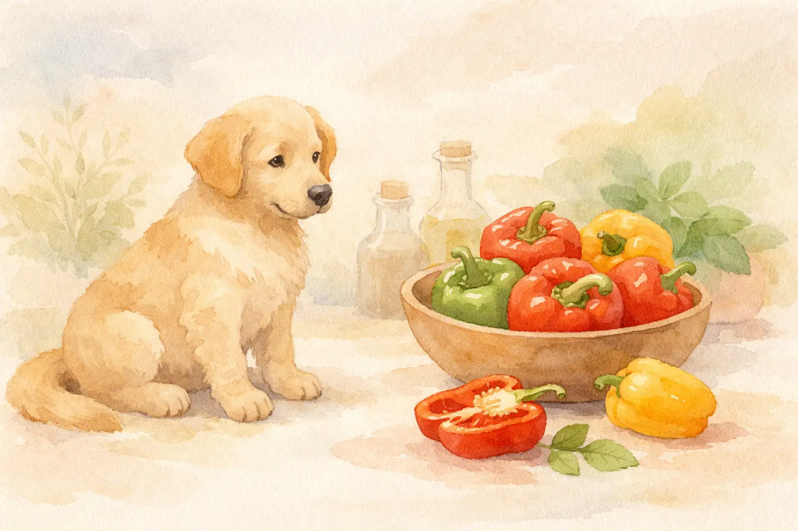
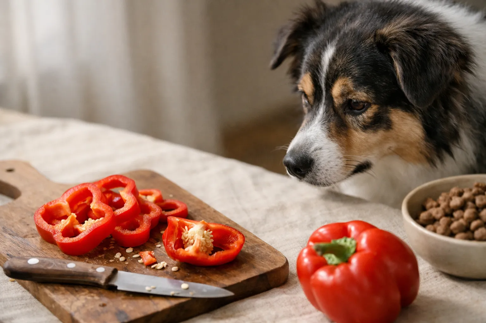
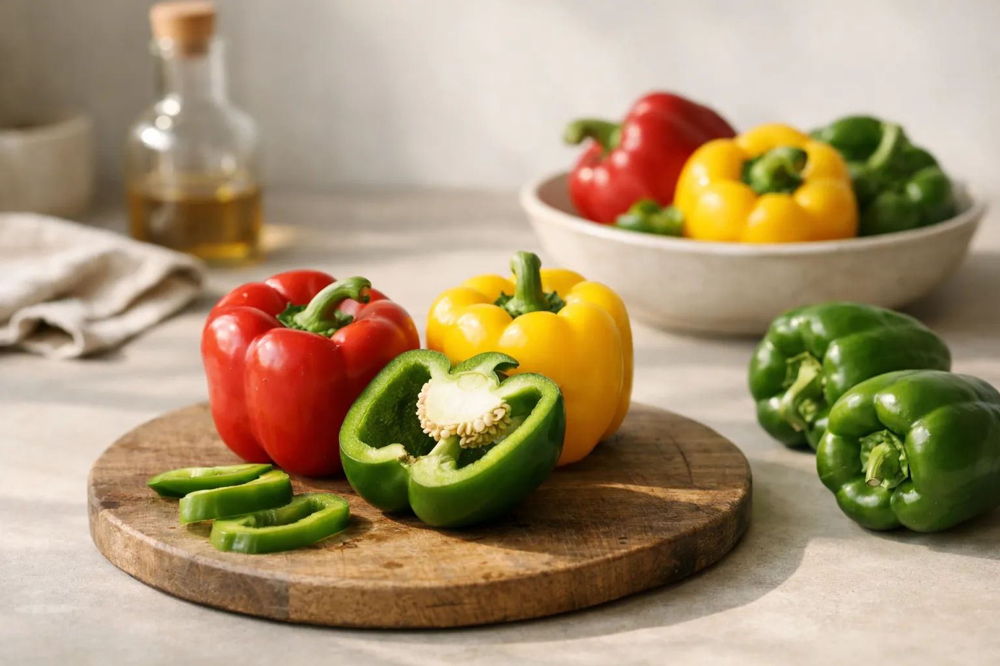

Dürfen Hunde Paprika essen? Die kurze Antwort: Ja -- aber nur reife, rote Paprika in kleinen Mengen und am besten gekocht. Paprika gehört zu den Nachtschattengewächsen und enthält Solanin, eine chemische Verbindung, die in hohen Dosen für Hunde giftig ist. Der Solanin-Gehalt variiert stark je nach Farbe und Reifegrad der Paprika.

Viele Hundehalter sind unsicher, ob sie ihrem Hund ein Stück Paprika vom Schneidebrett geben dürfen. In diesem Ratgeber erfährst du, welche Paprikafarben für Hunde geeignet sind, welche Mengen unbedenklich sind und wann du lieber auf Alternativen zurückgreifen solltest. Außerdem zeigen wir dir, wie du bei einer Solanin-Vergiftung richtig reagierst.

Zusammenfassung: Dürfen Hunde Paprika essen?

<ul>
<li><strong>Rote Paprika erlaubt</strong> -- Reife rote Paprika enthält am wenigsten Solanin und darf in kleinen Mengen verfüttert werden</li>
<li><strong>Grüne Paprika meiden</strong> -- Grüne Paprika hat den höchsten Solanin-Gehalt und ist für Hunde nicht empfehlenswert</li>
<li><strong>Gekocht besser als roh</strong> -- Kochen reduziert den Solanin-Gehalt und verbessert die Nährstoffaufnahme von Beta-Carotin</li>
<li><strong>Kleine Mengen einhalten</strong> -- Maximal 10--20 g pro Tag für mittelgroße Hunde (15--25 kg)</li>
<li><strong>Stiel und Kerne entfernen</strong> -- Die höchste Solanin-Konzentration sitzt in Stiel, Kernen und grünen Stellen</li>
</ul>

Rot

Beste Farbe für Hunde

10–20 g

Tagesmenge (mittlerer Hund)

140 mg

Vitamin C pro 100 g rote Paprika

Gekocht

Verträglichste Zubereitungsart

## Warum Paprika für Hunde problematisch sein kann

Paprika (*Capsicum annuum*) gehört zur Familie der Nachtschattengewächse -- genau wie Tomaten, Kartoffeln und Auberginen. Diese Pflanzenfamilie enthält Solanin, eine natürliche chemische Verbindung, die als Fraßschutz dient.

Solanin ist für Hunde in hohen Mengen giftig. Es greift die Schleimhäute des Magen-Darm-Trakts an und kann bei empfindlichen Hunden bereits in kleinen Mengen Beschwerden auslösen. Der Solanin-Gehalt hängt dabei stark vom Reifegrad und der Farbe der Paprika ab.

📖

Definition: Solanin (Glykoalkaloid)

Solanin ist eine chemische Verbindung aus der Gruppe der Glykoalkaloide. Es kommt natürlich in Nachtschattengewächsen vor und dient der Pflanze als Schutz gegen Fressfeinde. Beim Hund kann Solanin in hohen Dosen Magen-Darm-Beschwerden, neurologische Störungen und Hämolyse (Auflösung roter Blutkörperchen) verursachen.

### Solanin-Gehalt nach Paprikafarbe

Die Farbe einer Paprika zeigt ihren Reifegrad an. Grüne Paprika wird unreif geerntet und enthält daher deutlich mehr Solanin als gelbe oder rote Paprika. Rote Paprika ist voll ausgereift und hat den niedrigsten Solanin-Gehalt aller Paprikasorten.

| Paprikafarbe | Reifegrad | Solanin-Gehalt | Für Hunde geeignet? |
|---|---|---|---|
| **Rot** | Voll ausgereift | Sehr niedrig | Ja -- in kleinen Mengen |
| **Gelb/Orange** | Halbreif | Niedrig bis mittel | Bedingt -- kleine Mengen |
| **Grün** | Unreif | Am höchsten | Nur gekocht, besser meiden |

### Wo sitzt das meiste Solanin?

Die höchste Solanin-Konzentration befindet sich im Stiel, in den Kernen und in den weißen Trennwänden im Inneren der Paprika. Auch grüne Stellen auf der Schale enthalten erhöhte Mengen. Diese Pflanzenteile solltest du vor dem Füttern immer vollständig entfernen.

## Dürfen Hunde rote Paprika essen?

Rote Paprika dürfen Hunde in kleinen Mengen fressen. Sie ist die am besten geeignete Paprikafarbe für Hunde, da der Solanin-Gehalt durch die vollständige Reifung auf ein Minimum gesunken ist. Gleichzeitig enthält rote Paprika die meisten Nährstoffe.

100 g rote Paprika liefern rund 140 mg Vitamin C -- das ist mehr als in Zitronen. Außerdem ist rote Paprika reich an Beta-Carotin, einer Vorstufe von Vitamin A, das für gesunde Augen, Haut und Fell deines Hundes wichtig ist. Beta-Carotin wirkt zudem als Antioxidans und schützt die Zellen vor freien Radikalen.

✅

<strong>Rote Paprika: Erlaubt in kleinen Mengen</strong>

Reife rote Paprika enthält kaum noch Solanin und liefert wertvolles Vitamin C, Beta-Carotin und Kalium. Ein bis zwei kleine Stücke pro Tag sind für die meisten Hunde unbedenklich.

### Nährstoffprofil roter Paprika für Hunde

| Nährstoff | Gehalt pro 100 g | Nutzen für Hunde |
|---|---|---|
| Vitamin C | 140 mg | Immunsystem, Zellschutz |
| Beta-Carotin | 1,6 mg | Augen, Haut, Fell |
| Kalium | 212 mg | Herzfunktion, Muskeln |
| Folsäure | 55 µg | Zellteilung, Blutbildung |
| Ballaststoffe | 2,0 g | Verdauung |
| Kalorien | 37 kcal | Kalorienarmer Snack |

Hunde produzieren Vitamin C zwar selbst in der Leber, doch bei Stress, Krankheit oder im Alter kann eine zusätzliche Zufuhr über die Nahrung sinnvoll sein. Beta-Carotin wird vom Hundekörper bei Bedarf in Vitamin A umgewandelt -- eine Überdosierung ist daher praktisch ausgeschlossen.

## Dürfen Hunde grüne Paprika essen?

Grüne Paprika ist für Hunde nicht empfehlenswert. Der Solanin-Gehalt liegt bei unreifen grünen Paprikaschoten deutlich höher als bei roten oder gelben. Besonders empfindliche Hunde oder Hunde mit vorbestehenden Magen-Darm-Problemen können bereits auf kleine Mengen grüner Paprika mit Beschwerden reagieren.

⚠️

<strong>Grüne Paprika: Nicht empfohlen</strong>

Grüne Paprika enthält aufgrund des unreifen Zustands den höchsten Solanin-Gehalt aller Paprikafarben. Wenn du deinem Hund Paprika füttern möchtest, greife immer zu roter oder gelber Paprika.

Falls dein Hund versehentlich ein Stück grüne Paprika gefressen hat, besteht kein Grund zur Panik. Einzelne kleine Stücke verursachen bei den meisten Hunden keine Symptome. Beobachte deinen Hund jedoch für 12--24 Stunden auf Anzeichen von Magen-Darm-Beschwerden wie Erbrechen oder Durchfall.

## Rohe oder gekochte Paprika: Was ist besser für Hunde?

Gekochte Paprika ist für Hunde besser verträglich als rohe. Durch das Erhitzen wird ein Teil des Solanins abgebaut, und die Zellwände der Paprika werden aufgebrochen. Das erleichtert dem Hund die Verdauung und verbessert die Aufnahme von Beta-Carotin und anderen Nährstoffen erheblich.

Gekochte Paprika

<ul>
<li>Solanin-Gehalt wird durch Hitze reduziert</li>
<li>Bessere Nährstoffaufnahme (Beta-Carotin)</li>
<li>Leichter verdaulich für den Hund</li>
<li>Weichere Konsistenz -- weniger Verschluckungsgefahr</li>
</ul>

Rohe Paprika

<ul>
<li>Höherer Solanin-Gehalt als gekochte</li>
<li>Schwerer verdaulich -- kann Blähungen verursachen</li>
<li>Feste Schale kann zu Würgen führen</li>
<li>Nährstoffe werden schlechter aufgenommen</li>
</ul>

### So bereitest du Paprika für deinen Hund zu

Die richtige Zubereitung ist entscheidend, damit dein Hund die Paprika gut verträgt. Achte darauf, die Paprika ohne Salz, Gewürze oder Öl zu kochen. Gewürze wie Paprikapulver, Pfeffer oder Knoblauch sind für Hunde schädlich.

1

Paprika waschen

Gründlich unter fließendem Wasser abspülen, um Pestizidrückstände zu entfernen. Bio-Paprika ist empfehlenswert.

2

Stiel, Kerne und Trennwände entfernen

Alle grünen Pflanzenteile, Kerne und die weißen Innenwände vollständig herausschneiden.

3

In kleine Stücke schneiden und kochen

Die Paprika in fingernagelgroße Stücke schneiden und 8--10 Minuten in ungesalzenem Wasser weich kochen.

✓

Abkühlen lassen und füttern

Die gekochte Paprika auf Zimmertemperatur abkühlen lassen und in kleinen Mengen unter das Futter mischen oder als Snack anbieten.

## Wie viel Paprika dürfen Hunde fressen?

Die richtige Menge hängt von der Körpergröße deines Hundes ab. Generell gilt: Paprika ist ein Snack und kein Hauptnahrungsmittel. Gemüse sollte insgesamt maximal 5--10 % der täglichen Futterration ausmachen. Innerhalb dieses Gemüseanteils sollte Paprika nur gelegentlich und in kleinen Mengen vorkommen.

| Hundegröße | Körpergewicht | Maximale Paprikamenge pro Tag |
|---|---|---|
| Kleine Hunde | Unter 10 kg | 1 kleines Stück (ca. 5--10 g) |
| Mittelgroße Hunde | 10--25 kg | 1--2 Stücke (ca. 10--20 g) |
| Große Hunde | Über 25 kg | 2--3 Stücke (ca. 20--30 g) |

💡

<strong>Tipp: Langsam einführen</strong>

Wenn dein Hund zum ersten Mal Paprika frisst, starte mit einem einzigen kleinen Stück. Beobachte ihn 24 Stunden auf Magen-Darm-Beschwerden. Verträgt er die Paprika gut, kannst du die Menge langsam steigern.

Füttere Paprika nicht täglich. Zwei- bis dreimal pro Woche als kleine Beigabe zum Futter reicht aus, um deinem Hund die gesunden Nährstoffe zu bieten, ohne den Magen-Darm-Trakt zu belasten.

## Symptome einer Solanin-Vergiftung beim Hund

Eine Solanin-Vergiftung durch Paprika ist selten, da ein Hund sehr große Mengen unreifer Paprika fressen müsste. Laut der Veterinärmedizinischen Universität Wien liegt die toxische Solanin-Dosis beim Hund bei etwa 2--6 mg pro Kilogramm Körpergewicht. Dennoch solltest du die Symptome kennen, um im Ernstfall schnell reagieren zu können.

### Leichte Magen-Darm-Beschwerden

Leichte Symptome treten meist innerhalb von 2--6 Stunden nach dem Verzehr auf. Dazu gehören Übelkeit, vermehrtes Speicheln, Erbrechen, Durchfall und Appetitlosigkeit. Diese Magen-Darm-Beschwerden klingen in der Regel innerhalb von 24 Stunden von selbst ab.

### Schwere Vergiftungssymptome

Bei einer schweren Solanin-Vergiftung -- etwa nach dem Verzehr großer Mengen grüner Paprika -- können zusätzlich Zittern, Apathie, Koordinationsstörungen und in seltenen Fällen Krämpfe auftreten. Solche Symptome erfordern sofortige tierärztliche Behandlung.

🚫

<strong>Sofort zum Tierarzt bei diesen Symptomen</strong>

Blutiger Durchfall, starkes Zittern, Krämpfe, Atemnot oder Bewusstlosigkeit nach dem Verzehr von Paprika sind Notfälle. Bringe deinen Hund umgehend zum Tierarzt oder in die nächste Tierklinik. Nimm Reste der gefressenen Paprika mit.

Weitere Informationen zum Thema Vergiftungen findest du in unserem ausführlichen Ratgeber zur Vergiftung beim Hund.

## Was tun, wenn dein Hund zu viel Paprika gefressen hat?

Hat dein Hund eine größere Menge Paprika gefressen -- etwa eine ganze Schote oder grüne Paprika vom Schneidebrett -- bewahre zunächst Ruhe. Nicht jeder Hund reagiert gleich empfindlich. Das weitere Vorgehen hängt von der gefressenen Menge, der Paprikafarbe und dem Zustand deines Hundes ab.

1

Menge und Farbe einschätzen

Wie viel Paprika hat dein Hund gefressen? War sie rot, gelb oder grün? Waren Stiel und Kerne noch dran?

2

Hund beobachten

Beobachte deinen Hund für 6--12 Stunden auf Erbrechen, Durchfall, Speicheln oder Unruhe.

3

Schonkost anbieten

Bei leichten Magen-Darm-Beschwerden hilft Schonkost aus gekochtem Reis mit magerem Hühnchen für 1--2 Tage.

✓

Tierarzt kontaktieren

Bei anhaltenden oder schweren Symptomen den Tierarzt aufsuchen. Reste der Paprika und Zeitpunkt des Verzehrs notieren.

Löse kein Erbrechen aus, ohne vorher mit einem Tierarzt gesprochen zu haben. Erzwungenes Erbrechen kann bei Hunden zusätzliche Komplikationen verursachen. Wenn dein Hund nicht frisst oder sich ungewöhnlich verhält, ist ein Tierarztbesuch immer die sicherste Entscheidung.

## Paprikapulver und Gewürzpaprika: Tabu für Hunde

Paprikapulver, scharfe Peperoni und Gewürzpaprika sind für Hunde grundsätzlich nicht geeignet. Diese enthalten Capsaicin -- eine chemische Verbindung, die für die Schärfe verantwortlich ist. Capsaicin reizt die Schleimhäute im Maul, in der Speiseröhre und im Magen-Darm-Trakt des Hundes.

🚫

<strong>Kein Paprikapulver, keine scharfen Paprikasorten</strong>

Scharfe Paprika (Chili, Peperoni, Jalapeño) und Paprikagewürze enthalten Capsaicin, das beim Hund starke Magen-Darm-Beschwerden, Schleimhautreizungen und Schmerzen verursachen kann. Auch milde Gewürzpaprika gehört nicht ins Hundefutter.

Achte auch darauf, dass Speisereste mit Paprikagewürz nicht in den Futternapf gelangen. Viele Fertiggerichte, Soßen und Marinaden enthalten Paprikapulver in Kombination mit Zwiebeln und Knoblauch -- beides ist für Hunde giftig.

## Gesunde Alternativen zur Paprika für Hunde

Wenn dein Hund Paprika nicht verträgt oder du auf Nummer sicher gehen möchtest, gibt es zahlreiche Gemüsesorten, die für Hunde unbedenklich und nährstoffreich sind. Diese Alternativen enthalten kein Solanin und sind auch roh gut verträglich.

🥕

Karotten

Reich an Beta-Carotin und Ballaststoffen. Roh als Kausnack oder gekocht als Futterzusatz ideal für Hunde jeder Größe.

🥒

Gurke

Kalorienarm und wasserreich -- perfekt als Snack an heißen Tagen. Enthält Vitamin K und Kalium.

🥦

Brokkoli

Liefert Vitamin C, Eisen und Ballaststoffe. Nur in kleinen Mengen füttern, da er Blähungen verursachen kann.

🎃

Kürbis

Gut verträglich und ballaststoffreich. Gekochter Kürbis unterstützt die Verdauung und hilft bei Durchfall.

Auch Obst kann eine gesunde Ergänzung sein. [Bananen](https://hundewissen-mit-kopf.de/hundeernaehrung/duerfen-hunde-bananen-essen/) liefern Kalium und Magnesium, während [Erdbeeren](https://hundewissen-mit-kopf.de/hundeernaehrung/duerfen-hunde-erdbeeren-essen/) reich an Vitamin C und Antioxidantien sind. Beide eignen sich als gelegentlicher Snack für Hunde.

### Dürfen Hunde gekochte Kartoffeln essen?

Kartoffeln gehören wie Paprika zu den Nachtschattengewächsen und enthalten ebenfalls Solanin. Rohe Kartoffeln sind für Hunde giftig. Gekochte Kartoffeln sind jedoch unbedenklich, da das Solanin durch die Hitze weitgehend abgebaut wird. Geschälte, gekochte Kartoffeln ohne Salz und Butter sind eine gute Kohlenhydratquelle für Hunde und werden häufig als Schonkost eingesetzt.

ℹ️

<strong>Nachtschattengewächse für Hunde: Die Faustregel</strong>

Nachtschattengewächse wie Paprika, Kartoffeln und Tomaten dürfen Hunde nur im reifen, gekochten Zustand fressen. Unreife, grüne Pflanzenteile enthalten zu viel Solanin und sollten immer entfernt werden.

## Checkliste: Paprika sicher an Hunde verfüttern

✅ Paprika-Checkliste für Hundehalter

✓

Rote oder gelbe Paprika wählen (kein grün)

✓

Stiel, Kerne und weiße Trennwände entfernen

✓

Paprika gründlich waschen (Bio bevorzugen)

✓

In kleine Stücke schneiden und kochen (8--10 Min.)

✓

Ohne Salz, Gewürze oder Öl zubereiten

✓

Kleine Mengen füttern (max. 10--20 g für mittlere Hunde)

Hund nach erstem Füttern 24 Stunden beobachten

## Fazit: Dürfen Hunde Paprika essen -- ja, aber mit Vorsicht

Hunde dürfen Paprika essen -- vorausgesetzt, du wählst reife rote Paprika, entfernst Stiel und Kerne und fütterst nur kleine Mengen. Gekochte Paprika ist dabei besser verträglich als rohe, da der Solanin-Gehalt durch Hitze sinkt und die wertvollen Nährstoffe wie Beta-Carotin besser aufgenommen werden.

Grüne Paprika, Paprikapulver und scharfe Paprikasorten gehören nicht in den Futternapf. Bei Unsicherheit oder wenn dein Hund empfindlich auf Magen-Darm-Ebene reagiert, greife lieber auf unbedenkliche Alternativen wie Karotten, Gurke oder Kürbis zurück.

Achte immer darauf, neue Lebensmittel langsam einzuführen und deinen Hund zu beobachten. Bei Symptomen wie Erbrechen, Durchfall oder Apathie nach dem Verzehr von Paprika solltest du sicherheitshalber deinen Tierarzt kontaktieren. So stellst du sicher, dass dein Hund die Paprika genießen kann, ohne gesundheitliche Risiken einzugehen.