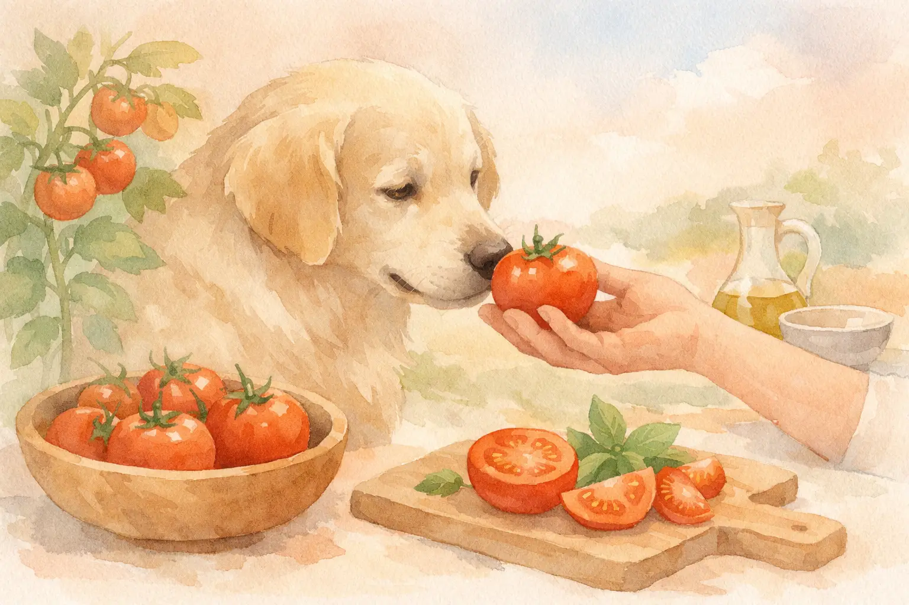
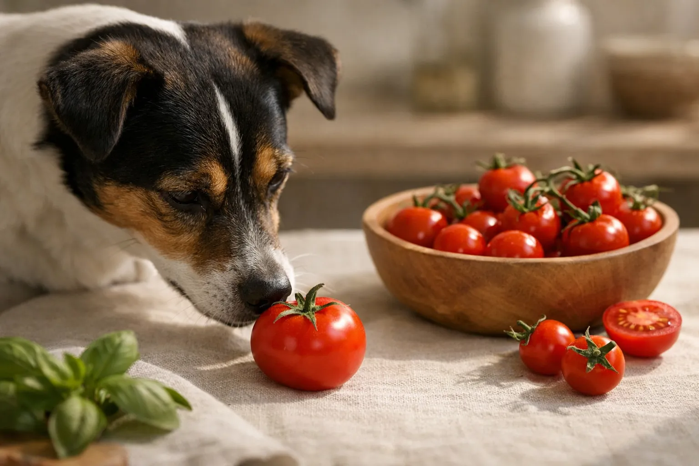
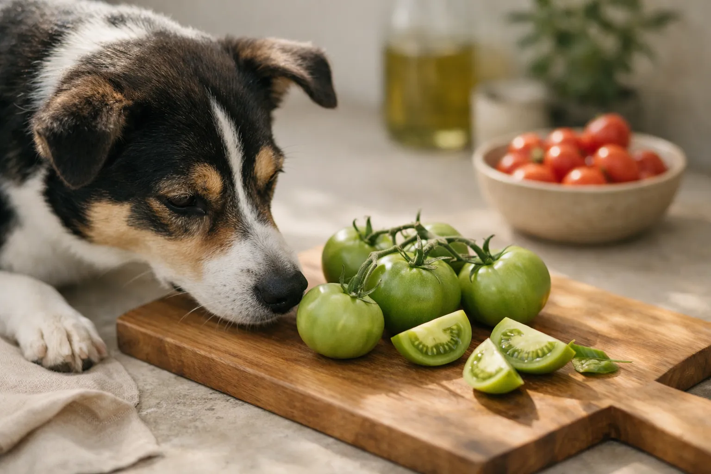

Reife, rote Tomaten dürfen Hunde in kleinen Mengen essen -- grüne Tomaten hingegen sind wegen des Giftstoffs Solanin tabu. Diese Unterscheidung ist entscheidend, denn Tomaten gehören zu den Nachtschattengewächsen und enthalten je nach Reifegrad unterschiedlich hohe Mengen potenziell giftiger Alkaloide.

Viele Hundehalter sind unsicher, ob ihr Hund Tomaten fressen darf. Die kurze Antwort: Ja, aber nur unter bestimmten Bedingungen. In diesem Ratgeber erfährst du alles über Solanin, die richtige Menge, Tomatensoße, gekochte Tomaten und was du bei einer Tomaten-Allergie beim Hund beachten musst.

Zusammenfassung: Dürfen Hunde Tomaten essen?

<ul>
<li><strong>Reife rote Tomaten erlaubt</strong> -- in kleinen Mengen (1-2 Stücke/Tag) als Snack unbedenklich</li>
<li><strong>Grüne Tomaten sind giftig</strong> -- sie enthalten bis zu 32 mg Solanin pro 100 g und sind für Hunde tabu</li>
<li><strong>Gekochte Tomaten sind besser verträglich</strong> -- Solanin wird durch Hitze reduziert, Lycopin besser verfügbar</li>
<li><strong>Fertige Tomatensoße meiden</strong> -- Zwiebeln, Knoblauch und Salz in Fertigprodukten sind für Hunde schädlich</li>
<li><strong>Tomaten-Allergie möglich</strong> -- Symptome wie Juckreiz, Durchfall oder Hautrötungen erfordern einen Tierarztbesuch</li>
</ul>

32 mg

Solanin pro 100 g grüner Tomate

&lt; 1 mg

Solanin pro 100 g reifer Tomate

95 %

Wassergehalt der Tomate

1-2

Tomatenstücke pro Tag (mittelgr. Hund)

## Sind Tomaten giftig für Hunde?

Tomaten gehören zur Familie der Nachtschattengewächse (*Solanaceae*) -- genau wie Kartoffeln, Paprika und Auberginen. Alle Nachtschattengewächse enthalten das Glykoalkaloid Solanin, das in höheren Dosen für Hunde giftig ist.

Der entscheidende Faktor ist der Reifegrad der Tomate. Unreife, grüne Tomaten enthalten laut der Deutschen Gesellschaft für Ernährung bis zu 32 mg Solanin pro 100 g. Während der Reifung baut die Pflanze diesen Giftstoff nahezu vollständig ab. Vollreife, rote Tomaten enthalten weniger als 1 mg Solanin pro 100 g -- eine Menge, die für Hunde unbedenklich ist.

📖

Definition: Solanin

Solanin ist ein natürliches Glykoalkaloid in Nachtschattengewächsen. Es dient der Pflanze als Fraßschutz und kann bei Mensch und Tier Magen-Darm-Beschwerden, neurologische Störungen und Herzrhythmusstörungen verursachen. Die toxische Dosis für Hunde liegt bei etwa 2-6 mg pro Kilogramm Körpergewicht.

Neben Solanin enthalten Tomaten auch das Alkaloid Tomatin. Tomatin kommt vor allem in den grünen Pflanzenteilen wie Stängeln, Blättern und unreifen Früchten vor. Auch Tomatin wird während der Reifung abgebaut und ist in roten Tomaten nur noch in Spuren vorhanden.

## Warum dürfen Hunde keine grünen Tomaten essen?

Grüne Tomaten sind für Hunde aus zwei Gründen gefährlich: Sie enthalten sowohl Solanin als auch Tomatin in hoher Konzentration. Beide Stoffe können bei Hunden bereits in relativ geringen Mengen Vergiftungssymptome auslösen.

### Solanin-Konzentration nach Reifegrad

Die folgende Tabelle zeigt, wie stark sich der Solaningehalt je nach Reifegrad unterscheidet:

| Reifegrad | Solanin pro 100 g | Farbe | Für Hunde geeignet? |
|---|---|---|---|
| Unreif (grün) | bis zu 32 mg | Grün | ❌ Nein -- giftig |
| Halbreif (gelblich) | 5-15 mg | Gelb-orange | ❌ Nein -- noch zu viel Solanin |
| Reif (rot) | unter 1 mg | Rot | ✅ Ja -- in kleinen Mengen |
| Überreif (dunkelrot, weich) | unter 0,5 mg | Dunkelrot | ✅ Ja -- unbedenklich |

### Grüne Stellen an reifen Tomaten

Auch bei ansonsten reifen Tomaten können grüne Stellen rund um den Stielansatz erhöhte Solaninwerte aufweisen. Schneide den Stielansatz und alle grünen Bereiche großzügig ab, bevor du deinem Hund ein Stück Tomate gibst. Die Blätter und Stängel der Tomatenpflanze enthalten ebenfalls hohe Solaninkonzentrationen und dürfen Hunde niemals fressen.

🚫

<strong>Achtung: Tomatenpflanzen im Garten!</strong>

Wenn du Tomaten im Garten anbaust, sichere die Pflanzen vor deinem Hund ab. Blätter, Stängel und unreife Früchte enthalten hohe Solaninmengen. Bereits das Kauen auf Tomatenpflanzenteilen kann Vergiftungssymptome auslösen.

## Dürfen Hunde reife Tomaten essen?

Vollreife, rote Tomaten dürfen Hunde als gelegentlichen Snack essen. Der Solaningehalt liegt bei unter 1 mg pro 100 g und ist damit für Hunde unbedenklich. Reife Tomaten liefern sogar einige wertvolle Nährstoffe.

### Nährstoffe in reifen Tomaten für Hunde

Tomaten bestehen zu etwa 95 % aus Wasser und sind damit ein kalorienarmer Snack. Zusätzlich enthalten sie:

| Nährstoff | Menge pro 100 g | Nutzen für Hunde |
|---|---|---|
| Vitamin C | 13 mg | Unterstützt das Immunsystem |
| Vitamin A (Beta-Carotin) | 0,5 mg | Fördert Sehkraft und Hautgesundheit |
| Kalium | 237 mg | Wichtig für Herzfunktion und Muskeln |
| Lycopin | 3-8 mg | Antioxidans, schützt Zellen |
| Ballaststoffe | 1,2 g | Fördert die Verdauung |
| Kalorien | 18 kcal | Sehr kalorienarm |

Lycopin ist ein besonders wertvolles Antioxidans, das freie Radikale neutralisiert. Laut der Veterinärmedizinischen Universität Wien wird Lycopin durch Erhitzen besser bioverfügbar -- gekochte Tomaten liefern also mehr davon als rohe.

✅

<strong>Erlaubt: Reife rote Tomaten als Snack</strong>

1-2 kleine Tomatenstücke pro Tag sind für einen mittelgroßen Hund unbedenklich. Entferne vorher den Stielansatz und alle grünen Stellen. Tomaten ersetzen keine vollwertige Mahlzeit, sondern ergänzen die Ernährung als gelegentlicher Snack.

## Wie viele Tomaten dürfen Hunde essen?

Die richtige Menge hängt von der Größe und dem Gewicht deines Hundes ab. Grundsätzlich gilt: Obst und Gemüse sollten maximal 5-10 % der täglichen Futterration ausmachen. Tomaten sind dabei nur eine von vielen Optionen -- ähnlich wie [Bananen](https://hundewissen-mit-kopf.de/hundeernaehrung/duerfen-hunde-bananen-essen/) oder [Erdbeeren](https://hundewissen-mit-kopf.de/hundeernaehrung/duerfen-hunde-erdbeeren-essen/).

### Empfohlene Tomatenmengen nach Hundegröße

| Hundegröße | Gewicht | Max. Tomatenmenge pro Tag |
|---|---|---|
| Kleine Rassen (z.B. Chihuahua) | bis 5 kg | 1 kleines Stück (ca. 10 g) |
| Mittlere Rassen (z.B. Beagle) | 10-25 kg | 1-2 Stücke (ca. 20-30 g) |
| Große Rassen (z.B. Labrador) | 25-40 kg | 2-3 Stücke (ca. 30-50 g) |
| Sehr große Rassen (z.B. Dogge) | über 40 kg | 3-4 Stücke (ca. 50-70 g) |

Füttere Tomaten nicht täglich, sondern als gelegentliche Abwechslung. Zu viele Tomaten können wegen des Säuregehalts Magenreizungen verursachen -- auch bei vollreifen Früchten.

💡

<strong>Tipp: Langsam anfüttern</strong>

Gib deinem Hund beim ersten Mal nur ein kleines Stück reife Tomate und beobachte ihn 24 Stunden lang. Verträgt er die Tomate gut, kannst du die Menge langsam steigern. So erkennst du frühzeitig eine mögliche Unverträglichkeit oder Allergie.

### Dürfen Welpen Tomaten essen?

Welpen unter 12 Wochen sollten grundsätzlich keine Tomaten bekommen. Ihr Verdauungssystem ist noch nicht vollständig ausgereift und reagiert empfindlicher auf Fruchtsäure und Solaninreste. Ab einem Alter von 4 Monaten können gesunde Welpen winzige Mengen reifer Tomate probieren -- maximal ein erbsengroßes Stück.

## Dürfen Hunde gekochte Tomaten essen?

Gekochte reife Tomaten sind für Hunde sogar besser geeignet als rohe. Durch das Erhitzen auf über 100 °C wird verbleibendes Solanin weiter abgebaut. Gleichzeitig steigt die Bioverfügbarkeit von Lycopin um das 2- bis 3-Fache.

Wichtig beim Kochen: Verwende ausschließlich reife Tomaten und verzichte komplett auf Gewürze, Salz, Zwiebeln und Knoblauch. Zwiebeln und Knoblauch sind für Hunde giftig und können eine hämolytische Anämie (Zerstörung der roten Blutkörperchen) auslösen -- mehr dazu in unserem Ratgeber zu giftigen Lebensmitteln für Hunde.

Vorteile gekochter Tomaten

<ul>
<li>Solanin wird durch Hitze weiter reduziert</li>
<li>Lycopin wird 2-3x besser aufgenommen</li>
<li>Weichere Konsistenz -- leichter verdaulich</li>
<li>Kann als Geschmackszugabe ins Futter gemischt werden</li>
</ul>

Nachteile gekochter Tomaten

<ul>
<li>Vitamin C wird teilweise durch Hitze zerstört</li>
<li>Fertigprodukte enthalten oft Zwiebeln und Salz</li>
<li>Zubereitungsaufwand bei selbstgekochten Varianten</li>
<li>Tomatensaft kann Flecken auf hellem Fell hinterlassen</li>
</ul>

## Dürfen Hunde Tomatensoße, Tomatenmark und passierte Tomaten essen?

Diese Frage stellen sich viele Hundehalter, wenn beim Kochen Reste übrig bleiben. Die Antwort hängt davon ab, ob es sich um selbstgemachte oder fertige Produkte handelt.

🍅

Tomatenmark

In kleinen Mengen (½ TL) erlaubt, wenn ohne Salz und Gewürze. Stark konzentriert -- sparsam dosieren.

🥫

Passierte Tomaten

Reine passierte Tomaten ohne Zusätze sind unbedenklich. Auf die Zutatenliste achten -- kein Salz, keine Zwiebeln.

🍝

Fertige Tomatensoße

Nicht empfohlen. Enthält fast immer Zwiebeln, Knoblauch, Zucker und Salz -- alles schädlich für Hunde.

🥣

Selbstgekochte Soße

Beste Option: Reife Tomaten ohne Gewürze kochen und pürieren. 1-2 EL als Futterzugabe sind unbedenklich.

Fertige Tomatensoßen aus dem Supermarkt enthalten in der Regel Zwiebeln, Knoblauch, Zucker und hohe Mengen Salz. Zwiebeln und Knoblauch sind für Hunde bereits in kleinen Mengen giftig. Auch Ketchup ist wegen des hohen Zucker- und Essiggehalts keine geeignete Option.

⚠️

<strong>Vorsicht bei Fertigprodukten</strong>

Lies immer die Zutatenliste, bevor du deinem Hund ein Tomatenprodukt gibst. Zwiebeln, Knoblauch, Salz und Zucker stehen bei den meisten Fertigsoßen weit oben auf der Liste. Im Zweifel: Selbst kochen oder ganz darauf verzichten.

## Dürfen Hunde rohe Tomaten essen?

Rohe, vollreife Tomaten dürfen Hunde essen. Der Solaningehalt reifer roher Tomaten liegt unter 1 mg pro 100 g und ist damit unbedenklich. Achte darauf, dass die Tomate gleichmäßig rot gefärbt ist, keine grünen Stellen aufweist und der Stielansatz entfernt wurde.

### Checkliste: Rohe Tomate sicher füttern

✅ Rohe Tomaten für Hunde -- Checkliste

✓

Tomate ist vollständig rot und reif

✓

Stielansatz und grüne Stellen entfernt

✓

In kleine, mundgerechte Stücke geschnitten

✓

Menge an Hundegröße angepasst (max. 1-3 Stücke)

✓

Tomate gewaschen (Pestizidrückstände entfernen)

Optional: Bio-Qualität bevorzugen

Schneide die Tomate in kleine Stücke, damit dein Hund nicht an einem großen Stück erstickt -- besonders bei kleinen Rassen ist das wichtig. Wasche die Tomate vorher gründlich ab, um Pestizidrückstände zu entfernen.

## Symptome einer Solanin-Vergiftung beim Hund

Hat dein Hund grüne Tomaten, Tomatenpflanzenteile oder größere Mengen unreifer Tomaten gefressen, können Vergiftungssymptome auftreten. Die Symptome zeigen sich laut der Stiftung Tierärztliche Hochschule Hannover typischerweise innerhalb von 2-6 Stunden nach der Aufnahme.

### Typische Vergiftungssymptome

Die Symptome einer Solanin-Vergiftung beim Hund reichen von mild bis lebensbedrohlich:

- **Magen-Darm-Beschwerden:** Erbrechen, Durchfall, Bauchschmerzen, übermäßiges Speicheln
- **Neurologische Symptome:** Zittern, Desorientierung, Koordinationsstörungen, Apathie
- **Herz-Kreislauf-Symptome:** Verlangsamter Herzschlag, Herzrhythmusstörungen, Kreislaufschwäche
- **Weitere Anzeichen:** Erweiterte Pupillen, Atembeschwerden, Schwäche in den Hinterläufen

1

Ruhe bewahren

Schätze die gefressene Menge ein. Bei 1-2 kleinen grünen Tomaten reicht oft Beobachtung.

2

Hund beobachten

Überwache deinen Hund 6-12 Stunden auf Erbrechen, Durchfall, Zittern oder Apathie.

3

Tierarzt kontaktieren

Bei Symptomen oder größeren Mengen sofort den Tierarzt oder die Giftzentrale anrufen.

✓

Informationen bereithalten

Notiere Menge, Zeitpunkt und Reifegrad der gefressenen Tomaten für den Tierarzt.

Wenn dein Hund Symptome wie starkes Zittern, Kreislaufprobleme oder Atemnot zeigt, ist das ein Notfall. Bringe ihn sofort zum Tierarzt. Mehr Informationen zu Vergiftungsnotfällen findest du in unserem Ratgeber zur Vergiftung beim Hund.

## Tomaten-Allergie beim Hund erkennen

Einige Hunde reagieren allergisch auf Tomaten -- unabhängig vom Solaningehalt. Eine Tomaten-Allergie beim Hund ist eine Immunreaktion auf bestimmte Proteine in der Frucht. Laut tierärztlichen Schätzungen sind Nahrungsmittelallergien für etwa 10-15 % aller allergischen Reaktionen bei Hunden verantwortlich.

### Symptome einer Tomaten-Allergie bei Hunden

Eine Allergie gegen Tomaten äußert sich beim Hund typischerweise durch:

- **Hautsymptome:** Juckreiz, Rötungen, Ausschlag (besonders an Ohren, Pfoten und Bauch)
- **Verdauungsprobleme:** Durchfall, Erbrechen, Blähungen
- **Atemwegssymptome:** Niesen, tränende Augen (selten)
- **Ohrenentzündungen:** Wiederkehrende Otitis als Allergiezeichen

ℹ️

<strong>Allergie oder Unverträglichkeit?</strong>

Eine Allergie ist eine Immunreaktion, eine Unverträglichkeit eine Verdauungsstörung. Allergien zeigen sich oft an der Haut (Juckreiz, Rötung), Unverträglichkeiten eher im Magen-Darm-Bereich (Durchfall, Blähungen). Eine Ausschlussdiät unter tierärztlicher Aufsicht bringt Klarheit.

Falls du nach dem Füttern von Tomaten wiederholt Symptome bei deinem Hund beobachtest, streiche Tomaten komplett vom Speiseplan. Dein Tierarzt kann eine Ausschlussdiät oder einen Allergietest durchführen, um die Diagnose zu bestätigen. Hunde mit einer bestätigten Tomaten-Allergie sollten auch andere Nachtschattengewächse wie Paprika und Auberginen meiden.

## Welche Alternativen zu Tomaten gibt es für Hunde?

Wenn dein Hund keine Tomaten verträgt oder du auf Nummer sicher gehen möchtest, gibt es viele gesunde Gemüse- und Obstalternativen. Die folgenden Optionen sind für die meisten Hunde gut verträglich:

| Alternative | Vorteile | Zubereitung |
|---|---|---|
| Karotten | Reich an Beta-Carotin, gut für Zähne | Roh oder gekocht, in Stücke schneiden |
| Gurke | Kalorienarm, hoher Wassergehalt | Roh, in Scheiben schneiden |
| Zucchini | Leicht verdaulich, vitaminreich | Roh oder gedünstet |
| Kürbis | Ballaststoffreich, gut für Verdauung | Gekocht, ohne Gewürze |
| [Erdbeeren](https://hundewissen-mit-kopf.de/hundeernaehrung/duerfen-hunde-erdbeeren-essen/) | Vitamin C, Antioxidantien | Roh, halbiert oder geviertelt |
| [Banane](https://hundewissen-mit-kopf.de/hundeernaehrung/duerfen-hunde-bananen-essen/) | Kalium, Energie | Roh, in Scheiben (sparsam wegen Zucker) |

Auch bei Alternativen gilt: Obst und Gemüse sollten maximal 5-10 % der täglichen Futterration ausmachen. Die Basis der Hundeernahrung bildet ein hochwertiges, ausgewogenes Alleinfuttermittel.

## So bereitest du Tomaten sicher für deinen Hund zu

Wenn du deinem Hund Tomaten geben möchtest, ist die richtige Zubereitung entscheidend. Mit diesen einfachen Schritten stellst du sicher, dass dein Hund die Tomate sicher genießen kann.

🍳 Einfaches Tomaten-Topping fürs Hundefutter

<ul>
<li>2-3 vollreife rote Tomaten waschen und Stielansatz entfernen</li>
<li>Tomaten vierteln und grüne Stellen großzügig wegschneiden</li>
<li>In einem kleinen Topf mit wenig Wasser 10 Minuten köcheln lassen</li>
<li>Abkühlen lassen und mit einer Gabel zerdrücken</li>
<li>1-2 Esslöffel als Topping über das normale Futter geben</li>
<li>Rest im Kühlschrank aufbewahren (max. 3 Tage haltbar)</li>
</ul>

Verwende ausschließlich reife Tomaten ohne grüne Stellen. Verzichte komplett auf Salz, Gewürze, Zwiebeln und Knoblauch. Die gekochte Tomatenmasse lässt sich auch portionsweise einfrieren -- so hast du immer eine sichere Tomatenzugabe parat.

## Fazit: Dürfen Hunde Tomaten essen -- ja, aber richtig

Reife, rote Tomaten dürfen Hunde in kleinen Mengen essen und liefern sogar wertvolle Nährstoffe wie Lycopin, Vitamin C und Kalium. Grüne Tomaten, Tomatenpflanzenteile und unreife Früchte sind wegen des hohen Solaningehalts hingegen giftig und für Hunde tabu.

Die wichtigsten Regeln auf einen Blick: Nur vollreife rote Tomaten füttern, den Stielansatz entfernen, kleine Mengen geben und auf Fertigprodukte mit Zwiebeln und Salz verzichten. Gekochte Tomaten sind sogar besser verträglich als rohe. Bei Anzeichen einer Tomaten-Allergie oder nach dem Verzehr grüner Tomaten solltest du deinen Tierarzt kontaktieren.

Wenn du dich generell fragst, welche Lebensmittel für deinen Hund sicher sind, hilft dir unser Ratgeber zu giftigen Lebensmitteln und Vergiftungen beim Hund weiter. So kannst du deinen Vierbeiner sicher und abwechslungsreich ernähren.