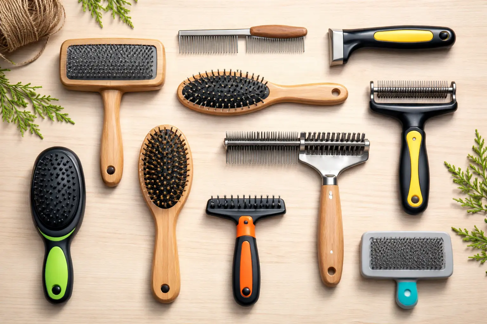
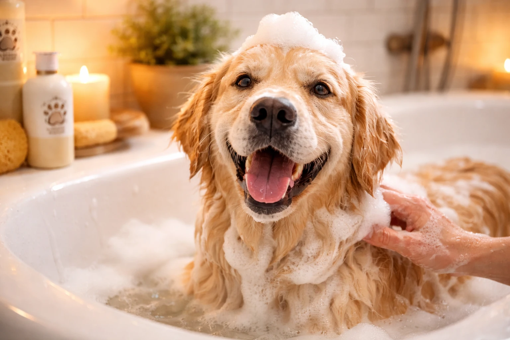
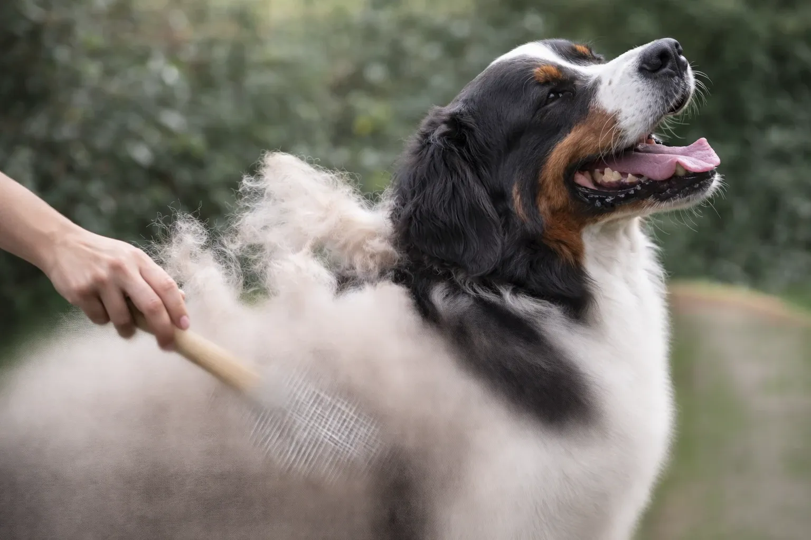

Fellpflege beim Hund ist weit mehr als eine Schönheitsfrage -- sie ist ein wesentlicher Bestandteil der Gesundheitsvorsorge. Ein gepflegtes Fell schützt vor Hautinfektionen, reguliert die Körpertemperatur und stärkt die Bindung zwischen Mensch und Tier. Regelmäßiges Bürsten, bedarfsgerechtes Baden und das fachgerechte Entfernen der Unterwolle bilden dabei die drei Grundpfeiler einer artgerechten Fellpflege. Laut Bundestierärztekammer leiden rund 15 % aller Hunde in Deutschland an Hautproblemen, die durch mangelnde Fellpflege begünstigt oder verschlimmert werden. Dieser Ratgeber erklärt für jeden Felltyp die richtige Pflegeroutine, die passenden Werkzeuge und die häufigsten Fehler, die es zu vermeiden gilt.

Zusammenfassung

<ul>
<li>Fellpflege beim Hund umfasst regelmäßiges Bürsten (1–7× pro Woche je nach Felltyp), seltenes Baden (alle 6–8 Wochen) und gezieltes Entfernen der Unterwolle</li>
<li>Langhaarige Hunde benötigen tägliches Bürsten, kurzhaarige Rassen kommen mit 1–2 Einheiten pro Woche aus</li>
<li>Die richtige Hundebürste richtet sich nach dem Felltyp: Noppenbürste für Kurzhaar, Naturhaarbürste für Langhaar, Trimmmesser für Drahthaar</li>
<li>Unterwolle entfernen ist besonders während des Fellwechsels im Frühjahr und Herbst wichtig -- spezielle Unterwollbürsten schonen dabei das Deckhaar</li>
<li>Hunde nur mit speziellem Hundeshampoo (pH 6,5–7,5) baden -- Menschenshampoo schädigt den natürlichen Säureschutzmantel der Hundehaut</li>
</ul>

7

Felltypen beim Hund

2×

Fellwechsel pro Jahr

4–8

Wochen Fellwechsel

15 %

Hunde mit Hautproblemen

## Warum ist Fellpflege beim Hund so wichtig?

Das Hundefell erfüllt lebenswichtige Schutzfunktionen: Das Deckhaar wehrt Nässe, UV-Strahlung und mechanische Verletzungen ab, während die Unterwolle als Isolationsschicht die Körpertemperatur reguliert. Wird diese Schutzbarriere durch fehlende Pflege beeinträchtigt, steigt das Risiko für Hautinfektionen, Parasitenbefall und allergische Reaktionen erheblich.

Regelmäßiges Bürsten regt die Durchblutung der Haut an und fördert die Talgproduktion, die dem Fell seinen natürlichen Glanz verleiht. Die Haarfollikel werden besser mit Nährstoffen versorgt, was ein kräftiges Haarwachstum unterstützt. Gleichzeitig werden bei jeder Bürsteinheit lose Haare, Hautschuppen, Schmutz und potenziell auch Parasiten wie Zecken oder Flöhe entdeckt und entfernt.

Mangelnde Fellpflege führt bei Hunden mit Unterwolle häufig zu Verfilzungen, die Feuchtigkeit stauen und Bakterienwachstum begünstigen. In schweren Fällen können sich unter den verfilzten Stellen Ekzeme oder sogenannte Hot Spots bilden -- entzündliche, nässende Hautstellen, die eine tierärztliche Behandlung erfordern.

### Fellpflege als Gesundheitscheck

Jede Bürsteinheit bietet die Möglichkeit, die Haut des Hundes auf Veränderungen zu kontrollieren. Rötungen, Schwellungen, kahle Stellen oder ungewöhnliche Knoten lassen sich beim Bürsten frühzeitig erkennen. Laut einer Erhebung der Ludwig-Maximilians-Universität München werden Hauttumoren bei Hunden in 60 % der Fälle durch aufmerksame Halter und nicht durch den Tierarzt entdeckt -- häufig während der Fellpflege.

### Fellpflege stärkt die Bindung

Regelmäßige Fellpflege stärkt die Mensch-Hund-Beziehung durch körperliche Nähe und Vertrauen. Hunde, die von klein auf an das Bürsten gewöhnt werden, empfinden die sanfte Massage als Wellnesseinheit. Der Körperkontakt beim Kämmen und Bürsten setzt bei beiden -- Hund und Halter -- das Bindungshormon Oxytocin frei.

## Fellpflege nach Felltyp: Von Kurzhaar bis Langhaar

Die richtige Fellpflege beim Hund hängt entscheidend vom Felltyp ab. Jeder Felltyp stellt unterschiedliche Anforderungen an Werkzeuge, Pflegefrequenz und Technik. Grundsätzlich unterscheidet man zwischen einschichtigem Fell (nur Deckhaar) und zweischichtigem Fell (Deckhaar plus Unterwolle).

| Felltyp | Beispielrassen | Bürstfrequenz | Empfohlene Werkzeuge |
|---|---|---|---|
| **Kurzhaar (einschichtig)** | Boxer, Dobermann, Whippet | 1× pro Woche | Weiche Noppenbürste, Gummistriegel |
| **Kurzhaar (mit Unterwolle)** | Labrador, Mops, Dalmatiner | 2–3× pro Woche | Unterwollbürste, Striegel, Fellkamm |
| **Stockhaar** | Dt. Schäferhund, Husky, Akita | 3–4× pro Woche | Unterwollbürste, Coat King, Kamm |
| **Langhaar (schlicht)** | Collie, Spitz, Belg. Schäferhund | Täglich | Naturhaarbürste, Kamm, Unterwollbürste |
| **Langhaar (dicht/üppig)** | Neufundländer, Chow-Chow, Briard | Täglich | Entfilzungsharke, Drahtbürste, Kamm |
| **Drahthaar** | Schnauzer, Airedale Terrier, Dackel (Rauhaar) | 1–2× pro Woche + Trimmen | Trimmmesser, kurz gezahnter Kamm |
| **Lockiges/wolliges Fell** | Pudel, Lagotto, Bichon Frisé | Alle 2–3 Tage | Schlickerbürste, breitzinkiger Kamm, Schermaschine |

### Kurzhaarige Hunde richtig bürsten

Kurzhaarige Hunde ohne Unterwolle haben den geringsten Pflegeaufwand. Eine wöchentliche Bürsteinheit mit einer weichen Noppenbürste oder einem Gummistriegel genügt, um lose Haare und Hautschuppen zu entfernen. Bei kurzhaarigen Rassen mit empfindlicher Haut -- wie dem Whippet oder Galgo -- eignen sich besonders Bürsten mit Naturborsten, da Metallkämme die dünne Haut reizen können.

Kurzhaarige Hunde mit Unterwolle -- etwa Labrador, Mops oder Beagle -- haaren trotz kurzem Fell intensiv. Bei diesen Rassen ist eine Unterwollbürste oder ein FURminator-Werkzeug hilfreich, das bis zu 90 % der losen Haare entfernen kann. Die Bürstfrequenz sollte bei 2–3 Einheiten pro Woche liegen, während des Fellwechsels auch täglich.

### Fellpflege bei langhaarigen Hunden

Langhaarige Hunderassen benötigen tägliche Fellpflege, um Verfilzungen zu verhindern. Besonders kritische Stellen sind Achseln, Ohren, Genitalbereich und die Fell-"Hosen" an den Hinterläufen. An diesen Stellen verfilzt das Fell schnell, da die Haare sich bei Bewegung reiben. Ist eine Verfilzung einmal entstanden, lässt sie sich oft nur noch mit einer Effilierschere oder vom Hundefriseur entfernen.

Die optimale Technik bei langhaarigen Hunden besteht aus drei Schritten: Erst mit einem grobzinkigen Kamm Verfilzungen lösen, dann die Unterwolle mit einer speziellen Unterwollbürste bearbeiten und abschließend das Deckhaar mit einer Naturhaarbürste glätten. Alle 2–3 Tage sollte der gesamte Hund gebürstet werden, die kritischen Stellen idealerweise täglich.

### Drahthaarige Hunde trimmen statt scheren

Drahthaarige Rassen wie Schnauzer, Airedale Terrier oder Rauhaardackel benötigen eine spezielle Pflegemethode: das Trimmen. Dabei werden abgestorbene Haare mit einem Trimmmesser vorsichtig herausgezupft -- nicht geschnitten. Das Scheren von Drahthaar verändert die Fellstruktur negativ und kann dazu führen, dass das Fell weich und watteartig nachwächst. Auch der natürliche Hautschutz geht beim Scheren verloren.

Professionelles Trimmen ist bei Drahthaar-Rassen alle 8–12 Wochen empfehlenswert. Zwischen den Trimm-Terminen genügt wöchentliches Bürsten mit kurz gezahnten Kämmen oder Striegel-Handschuhen.

🐕

Noppenbürste

Kurzhaar: Schont empfindliche Haut, entfernt sanft lose Haare

🦮

Naturhaarbürste

Langhaar: Glättet Deckhaar, verleiht natürlichen Glanz

✂️

Unterwollbürste

Unterwolle: Entfernt lose Unterwolle, schont das Deckhaar

🔧

Trimmmesser

Drahthaar: Zupft abgestorbenes Drahthaar, erhält Fellstruktur

## Unterwolle beim Hund entfernen: Technik und Werkzeuge

Das Entfernen der Unterwolle ist ein zentraler Bestandteil der Fellpflege bei Hunden mit doppelschichtigem Fell. Die Unterwolle dient als Isolationsschicht: Im Winter hält sie warm, im Sommer schützt sie vor Überhitzung -- vorausgesetzt, sie wird regelmäßig ausgebürstet. Verbleibt abgestorbene Unterwolle im Fell, blockiert sie die Luftzirkulation und der Hund kann seine Körpertemperatur nicht mehr effektiv regulieren.

Rassen wie Husky, Golden Retriever, Berner Sennenhund oder Deutscher Schäferhund besitzen eine besonders dichte Unterwolle. Bei diesen Hunden fallen während des Fellwechsels täglich große Mengen an loser Unterwolle an. Wird diese nicht entfernt, verfilzt das Fell, die Haut kann nicht mehr atmen und es entstehen feuchte, warme Hohlräume, in denen Bakterien und Pilze ideale Wachstumsbedingungen finden.

### Unterwolle entfernen: Schritt für Schritt

1

Fell vorbereiten

Verfilzungen mit den Fingern lösen und groben Schmutz entfernen

2

Unterwolle bürsten

Mit Unterwollbürste mit dem Strich arbeiten, an dichtesten Stellen beginnen

3

Deckhaar glätten

Abschließend das Deckhaar mit Naturhaarbürste in Wuchsrichtung durchkämmen

4

Haut kontrollieren

Haut auf Rötungen, Parasiten oder Veränderungen prüfen und den Hund belohnen

Bei langhaarigen Hunden mit dichter Unterwolle hat sich die Scheiteltechnik bewährt: Das Fell wird abschnittsweise gescheitelt und von der Haut nach außen gebürstet. So dringt die Bürste bis zur Haut vor und erfasst auch die tiefste Unterwolle. Bei kurzhaarigen Hunden mit Unterwolle -- wie dem Labrador -- genügt gleichmäßiges Bürsten mit einer Hundebürste für Unterwolle in Wuchsrichtung.

### Unterwolle entfernen: Die richtigen Werkzeuge

Unterwollbürsten mit leicht gekrümmten Zinken gelten als effektivstes Werkzeug zum Entfernen loser Unterwolle. Der sogenannte Coat King -- ein Werkzeug mit stumpfen, abgewinkelten Klingen -- entfernt Unterwolle besonders schonend, ohne das Deckhaar zu beschädigen. Für Langhaar-Hunde eignen sich Modelle mit weiterem Zinkenabstand, bei Kurzhaar-Hunden sind engere Zinkenabstände effektiver.

⚠️

<strong>Unterwolle entfernen oder nicht?</strong>

Die Unterwolle sollte bei Hunden mit doppelschichtigem Fell <strong>immer</strong> regelmäßig entfernt werden -- sie dient der Gesundheit, nicht nur der Optik. Nicht entfernte Unterwolle blockiert die Luftzirkulation, führt zu Verfilzungen und kann Hautprobleme verursachen. Die Unterwolle sollte jedoch <strong>nie komplett rasiert</strong> werden: Das Deckhaar und eine gewisse Grundschicht Unterwolle schützen den Hund vor UV-Strahlung und Überhitzung.

## Hund baden: Wie oft, womit und worauf achten?

Hunde sollten nur bei tatsächlicher Verschmutzung oder auf tierärztliche Anordnung gebadet werden -- nicht aus Gewohnheit. Die Hundehaut besitzt einen natürlichen Säureschutzmantel mit einem pH-Wert von 6,5–7,5, der durch zu häufiges Baden zerstört wird. Tierärzte empfehlen maximal alle 6–8 Wochen ein Vollbad, es sei denn, medizinische Gründe erfordern häufigeres Waschen.

Die goldene Regel der Fellpflege lautet: Bürsten geht vor Baden. In den meisten Fällen lässt sich Schmutz bereits durch gründliches Bürsten nach dem Trocknen entfernen. Nach einem Spaziergang im Regen oder einem Bad im See genügt es, den Hund mit klarem Wasser abzuspülen und anschließend gut abzutrocknen.

### Hund baden: Die richtige Technik

Die optimale Wassertemperatur beim Hund baden liegt bei 37–38 °C -- also handwarm. Zu heißes Wasser reizt die Hundehaut, zu kaltes Wasser ist unangenehm und kann bei kleinen oder alten Hunden zu Unterkühlung führen. Das Hundeshampoo sollte pH-neutral, seifen- und parfümfrei sein und eine rückfettende Wirkung besitzen.

Vor dem Baden das Fell gründlich durchbürsten und alle Verfilzungen lösen. Nasses, verfilztes Fell zieht sich zusammen und lässt sich nach dem Bad kaum noch entwirren. Den Hund zunächst am Körper nass machen, den Kopf zuletzt -- so bleibt die empfindliche Kopfpartie nicht unnötig lang nass. Shampoo gründlich einmassieren und vollständig ausspülen, da Shampooreste Juckreiz verursachen können.

✅ Hundeshampoo

<ul>
<li>pH-Wert 6,5–7,5 (passend zur Hundehaut)</li>
<li>Rückfettende Wirkung</li>
<li>Seifen- und parfümfrei</li>
<li>Schont den Säureschutzmantel</li>
</ul>

⚠️ Menschenshampoo

<ul>
<li>pH-Wert 4,5–5,5 (zu sauer für Hunde)</li>
<li>Enthält oft Parfüm und Duftstoffe</li>
<li>Entfettet die Hundehaut übermäßig</li>
<li>Kann Juckreiz und Allergien auslösen</li>
</ul>

### Welpen baden: Ab wann und wie oft?

Welpen können ab einem Alter von 3 Monaten gebadet werden, wenn es notwendig ist. In den ersten Lebensmonaten sollte das Baden auf absolute Ausnahmen beschränkt bleiben, da der natürliche Hautschutz des Welpenfells noch empfindlicher ist als bei erwachsenen Hunden. Stattdessen reicht es, Verschmutzungen mit einem feuchten Tuch zu entfernen. Das erste Bad sollte in einer stressfreien Umgebung mit lauwarmem Wasser (ca. 37 °C) und einer rutschfesten Unterlage stattfinden.

## Fellwechsel beim Hund: Wann die Fellpflege besonders wichtig ist

Der Fellwechsel beim Hund findet zweimal jährlich statt: Im Frühjahr (März bis Mai) wird das dichte Winterfell abgestoßen, im Herbst (September bis November) wächst neues Winterfell nach. Der Fellwechsel wird durch die veränderte Tageslichtlänge ausgelöst und dauert bei den meisten Hunderassen 4–8 Wochen.

Während des Fellwechsels verlieren manche Hunde erstaunliche Mengen an Haaren. Ein mittelgroßer Hund wie ein Golden Retriever kann in der Fellwechselphase täglich mehrere Handvoll Unterwolle verlieren. In dieser Phase ist tägliches Bürsten und gezieltes Entfernen der Unterwolle besonders wichtig. Ohne regelmäßige Pflege verfilzt das abgestorbene Fell mit den nachwachsenden Haaren und es bilden sich plattenartige Verfilzungen, die die Haut darunter schädigen.

ℹ️

<strong>Hund haart extrem? Das können die Ursachen sein</strong>

Extremes Haaren außerhalb des Fellwechsels kann auf gesundheitliche Probleme hindeuten. Häufige Ursachen sind Nährstoffmangel (besonders Omega-3- und Omega-6-Fettsäuren), hormonelle Störungen (z. B. Schilddrüsenunterfunktion), Stress, Parasitenbefall oder Allergien. Hält der übermäßige Haarverlust länger als 8 Wochen an oder treten kahle Stellen auf, ist ein Besuch beim Tierarzt empfehlenswert.

### Fellpflege beim Hund nach dem Fellwechsel unterstützen

Eine hochwertige Ernährung unterstützt den Fellwechsel und fördert ein glänzendes, gesundes Hundefell. Omega-3-Fettsäuren (enthalten in Lachsöl, Leinöl) und Omega-6-Fettsäuren stärken die Hautbarriere und beschleunigen das Nachwachsen gesunder Haare. Tierärzte empfehlen während des Fellwechsels die Zugabe von **1 Teelöffel Lachsöl pro 10 kg Körpergewicht** zum täglichen Futter.

Biotin (Vitamin B7) ist ein weiterer wichtiger Nährstoff für die Fellgesundheit beim Hund. Ein Biotinmangel äußert sich durch stumpfes, brüchiges Fell und vermehrten Haarausfall. Natürliche Biotinquellen für Hunde sind gekochte Eier, Leber und Hefe. Die empfohlene Tagesdosis liegt laut Fachgesellschaft für Tierernährung bei 2–5 Mikrogramm Biotin pro Kilogramm Körpergewicht.

## Häufige Fehler bei der Fellpflege beim Hund

Selbst gut gemeinte Fellpflege kann dem Hund schaden, wenn grundlegende Fehler gemacht werden. Die folgenden Fehler kommen laut Hundefriseur-Verbänden besonders häufig vor und lassen sich mit dem richtigen Wissen leicht vermeiden.

| Fehler | Folge | Richtige Vorgehensweise |
|---|---|---|
| Zu häufiges Baden | Zerstört Säureschutzmantel der Haut | Max. alle 6–8 Wochen, nur bei Bedarf |
| Menschenshampoo verwenden | pH-Wert falsch, Hautirritationen | Nur pH-neutrales Hundeshampoo nutzen |
| Drahthaar scheren statt trimmen | Verändert Fellstruktur dauerhaft | Abgestorbene Haare mit Trimmmesser zupfen |
| Verfilzungen nass machen | Verfilzung zieht sich fester zusammen | Vor dem Baden alle Knoten lösen |
| Gegen den Strich bürsten | Schmerzt den Hund, schädigt Haarfollikel | Immer in Wuchsrichtung arbeiten |
| Unterwolle komplett rasieren | Sonnenbrand, gestörte Thermoregulation | Nur lose Unterwolle ausbürsten, nicht rasieren |

### Fellpflege beim Hund: Falsche Bürste als häufigster Fehler

Die Wahl der falschen Hundebürste ist einer der häufigsten Pflegefehler. Zu scharfe Metallkämme auf empfindlicher Kurzhaar-Haut verursachen Mikroverletzungen. Zu weiche Bürsten bei dichtem Langhaar dringen nicht bis zur Unterwolle vor und hinterlassen ein nur oberflächlich gepflegtes Fell. Die Investition in das passende Bürstenset für den jeweiligen Felltyp lohnt sich langfristig für Haut- und Fellgesundheit.

## Hund an die Fellpflege gewöhnen: Tipps für Welpen und erwachsene Hunde

Die Gewöhnung an die Fellpflege sollte idealerweise bereits im Welpenalter ab der 8. Lebenswoche beginnen. Welpen, die frühzeitig positive Erfahrungen mit dem Bürsten machen, akzeptieren die Fellpflege auch als erwachsene Hunde problemlos. Auch ältere Hunde, die bisher keine Fellpflege erfahren haben, lassen sich mit Geduld und positiver Verstärkung schrittweise desensibilisieren.

💡

<strong>Hund lässt sich nicht bürsten? So gelingt die Gewöhnung</strong>

Mit unkritischen Körperstellen wie Rücken und Flanke beginnen. Empfindliche Bereiche (Bauch, Pfoten, Kopf) erst nach mehreren erfolgreichen Sitzungen einbeziehen. Jede Bürsteinheit mit einem Leckerli oder ruhigem Lob beenden. Kurze Einheiten von 2–3 Minuten sind effektiver als lange, stressige Sitzungen. Niemals den Hund festhalten oder zur Fellpflege zwingen -- das verstärkt die Ablehnung. Entspannte Hunde nach dem Spaziergang sind für die Fellpflege am empfänglichsten.

Bei besonders ängstlichen oder aggressiven Hunden kann ein professioneller Hundefriseur die bessere Wahl sein. Erfahrene Groomer kennen Techniken, um auch schwierige Hunde stressfrei zu pflegen. Alternativ kann ein Tierarzt bei extremer Fellpflege-Verweigerung ein leichtes Beruhigungsmittel verabreichen -- allerdings sollte dies die absolute Ausnahme bleiben und nicht zur Routine werden.

## Fellpflege beim älteren Hund: Besonderheiten im Seniorenalter

Ältere Hunde ab einem Alter von 7–8 Jahren zeigen häufig Veränderungen in Fellstruktur und Hautbeschaffenheit. Das Fell wird dünner, trockener und verliert seinen Glanz. Die Haut wird empfindlicher und anfälliger für Reizungen. Gleichzeitig kann die eingeschränkte Beweglichkeit älterer Hunde dazu führen, dass sie sich selbst weniger putzen, was die Bedeutung der menschlichen Fellpflege erhöht.

Bei Senioren-Hunden empfehlen sich besonders weiche Bürsten mit abgerundeten Borsten. Arthritische Gelenke machen bestimmte Positionen schmerzhaft -- ein Hundegrooming-Tisch in bequemer Höhe oder eine rutschfeste Matte auf dem Boden erleichtern die Pflege. Die Bürsteinheiten sollten kürzer ausfallen (5–10 Minuten), dafür häufiger stattfinden. Laut der Gesellschaft für Tierernährung profitieren Senioren-Hunde besonders von einer Ergänzung mit Omega-3-Fettsäuren und Biotin, um Haut und Fell auch im Alter gesund zu halten.

## Die richtige Hundebürste kaufen: Übersicht aller Werkzeuge

Eine hochwertige Hundebürste ist die wichtigste Investition für die Fellpflege. Die Auswahl des richtigen Werkzeugs richtet sich primär nach dem Felltyp des Hundes. Folgende Werkzeuge gehören zur Grundausstattung der Fellpflege:

| Werkzeug | Einsatzzweck | Geeignet für |
|---|---|---|
| **Fellkamm (breitzinkig)** | Verfilzungen lösen, Vorkämmen | Langhaar, lockiges Fell |
| **Hundekamm (feinzinkig)** | Parasitenkontrolle (Flöhe) | Alle Felltypen |
| **Naturhaarbürste** | Glanz verleihen, Endpflege | Alle Felltypen (Finish) |
| **Unterwollbürste** | Lose Unterwolle entfernen | Hunde mit Unterwolle |
| **Gummistriegel** | Sanfte Massage, Haarentfernung | Kurzhaar, empfindliche Haut |
| **Coat King** | Unterwolle schonend entfernen | Stockhaar, dichte Unterwolle |
| **Entfilzungsharke** | Verfilzungen auftrennen | Starke Verfilzungen bei Langhaar |
| **Fellschere (abgerundet)** | Haare an Ohren, Pfoten, Genitalbereich kürzen | Alle Rassen bei Bedarf |

Beim Kauf von Hundebürsten sollte auf Qualität geachtet werden: Abgerundete Zinken und Borsten schützen die empfindliche Hundehaut vor Verletzungen. Kunststoffborsten erzeugen elektrostatische Aufladung und ziehen zusätzlich Staub an -- Naturborsten oder ummantelte Drahtborsten sind für die Fellpflege beim Hund deutlich besser geeignet.

### Hundefriseur oder Selbstpflege? Wann sich professionelle Hilfe lohnt

Professionelle Hundefriseure (auch "Groomer" genannt) sind besonders bei pflegeintensiven Rassen mit lockigem oder drahtigem Fell eine sinnvolle Ergänzung zur häuslichen Fellpflege. Ein professionelles Trimmen oder Scheren kostet je nach Rasse und Aufwand zwischen 30 und 120 Euro und ist bei Drahthaar-Rassen alle 8–12 Wochen, bei Locken-Rassen wie dem Pudel alle 6–8 Wochen empfehlenswert. Zwischen den Terminen beim Hundefriseur bleibt die tägliche Fellpflege zu Hause jedoch unerlässlich.

## Fazit: Fellpflege beim Hund ist Gesundheitsvorsorge

Regelmäßige Fellpflege beim Hund ist keine Kür, sondern Pflicht für verantwortungsvolle Hundehalter. Bürsten, bedarfsgerechtes Baden und das fachgerechte Entfernen der Unterwolle bilden die drei Säulen einer artgerechten Fellpflege. Die richtige Hundebürste für den jeweiligen Felltyp, die passende Pflegefrequenz und die Vermeidung typischer Fehler -- wie zu häufiges Baden oder die Verwendung von Menschenshampoo -- halten Haut und Fell gesund.

Die wichtigste Empfehlung: Bereits im Welpenalter mit der Fellpflege beginnen, eine regelmäßige Routine etablieren und jede Bürsteinheit als Gesundheitscheck nutzen. Ein gepflegtes Fell glänzt nicht nur -- es signalisiert ein gesundes, wohlgepflegtes Tier. Die Investition von 5–15 Minuten täglicher Fellpflege zahlt sich durch weniger Tierarztkosten, eine stärkere Bindung und einen rundum zufriedenen Hund aus.
