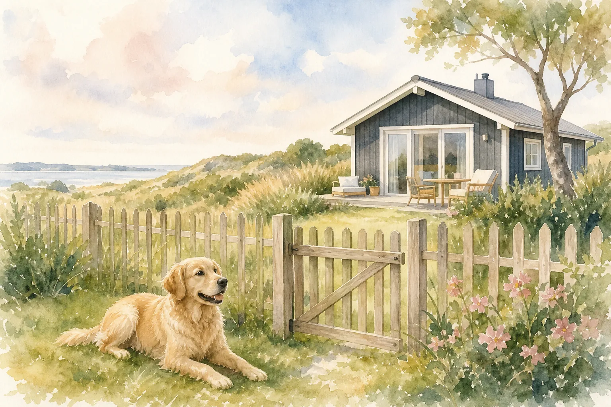
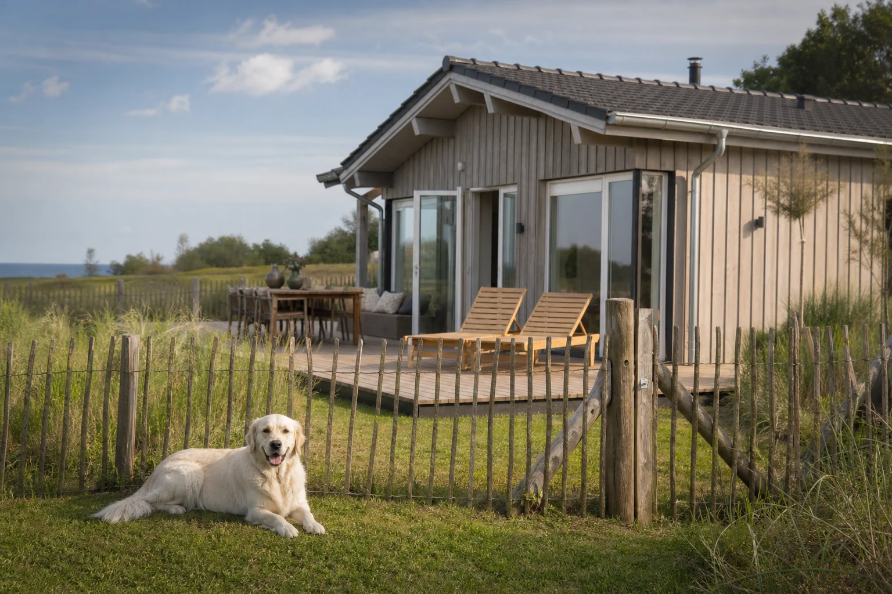
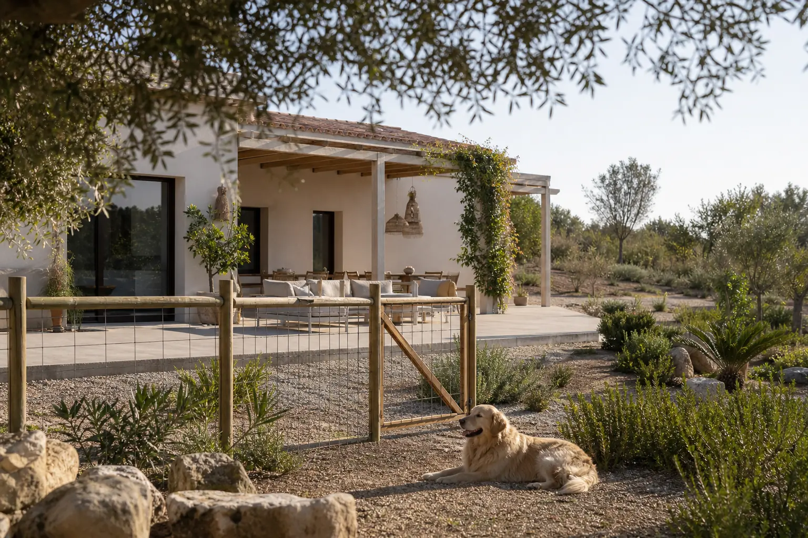

Ein Ferienhaus mit Hund und eingezäuntem Grundstück ist kein Luxus, sondern für viele Hundehalter die Grundvoraussetzung für einen entspannten Urlaub. Wenn der Vierbeiner frei laufen kann, ohne dass du jede Sekunde auf ihn achten musst, entspannt sich nicht nur der Hund, sondern auch du. Der Markt für hundefreundliche Ferienhäuser wächst, doch nicht jedes Objekt, das als "hundefreundlich" beworben wird, bietet tatsächlich einen sicheren Zaun.

Dieser Artikel zeigt dir, worauf du bei der Buchung achten musst, welche Regionen in Deutschland und im Ausland das beste Angebot haben, wie du Buchungsplattformen mit Zaun-Filter nutzt und was ein eingezäuntes Ferienhaus im Vergleich zu einem normalen Objekt kostet.

## Warum ein eingezäuntes Grundstück beim Urlaub mit Hund so wichtig ist

Zusammenfassung: Ferienhaus mit Hund und eingezäuntem Grundstück

<ul>
<li><strong>Freiheit für den Hund</strong> -- Ein sicherer Zaun ermöglicht leinenfreies Toben ohne ständige Aufsicht</li>
<li><strong>Sicherheitscheck vor der Buchung</strong> -- Zaunhöhe, Material, Torsicherung und Bodenschutz immer erfragen und per Foto bestätigen lassen</li>
<li><strong>Beste Regionen</strong> -- Ostsee, Nordsee, Allgäu, Dänemark und Zeeland bieten das dichteste Angebot</li>
<li><strong>Preisaufschlag einplanen</strong> -- Eingezäunte Objekte kosten im Schnitt 10 bis 25 % mehr als vergleichbare Häuser ohne Zaun</li>
</ul>

### Freiheit ohne Leine – was ein Zaun für deinen Hund bedeutet

Für die meisten Hunde ist der Urlaub eine intensive Erfahrung: neue Gerüche, unbekannte Umgebung, veränderte Routinen. Ein eingezäuntes Grundstück gibt dem Hund einen sicheren Rückzugsraum, in dem er diese Eindrücke in seinem eigenen Tempo verarbeiten kann. Er kann schnüffeln, rennen und spielen, ohne dass du ständig an der Leine ziehen oder auf Verkehr achten musst.

Laut [Bundesministerium für Ernährung und Landwirtschaft (BMEL)](https://www.bmel.de/DE/themen/tiere/haustiere/haustiere_node.html) gehört ausreichend Bewegung und die Möglichkeit zur freien Entfaltung zu den Grundbedürfnissen von Hunden. Ein Zaun erfüllt genau das: Er schafft einen definierten Freiraum, der Sicherheit und Selbstbestimmung verbindet. Gerade im Urlaub, wenn der Hund noch nicht weiß, wo er ist und wohin er zurückkehren soll, kann ein eingezäuntes Grundstück im Ernstfall Leben retten.

### Für welche Hunde ist ein eingezäuntes Ferienhaus besonders sinnvoll?

Ein Ferienhaus mit Hund und eingezäuntem Grundstück ist besonders wertvoll für Hunde mit starkem Jagdtrieb, unsicherem Rückruf oder hohem Bewegungsdrang. Rassen wie Husky, Beagle, Weimaraner oder Rhodesian Ridgeback neigen dazu, einer interessanten Fährte zu folgen, ohne auf das Rufen des Halters zu reagieren.

Auch für Hunde in der Rehabilitation nach Verletzungen oder Operationen ist ein eingezäuntes Grundstück ideal: kontrollierte Bewegung ohne Leinenführung. Gleiches gilt für ängstliche oder reaktive Hunde, die in unbekannter Umgebung besonders gestresst reagieren und von der Sicherheit eines abgegrenzten Bereichs profitieren. Und nicht zuletzt: Für Hundehalter mit Kindern ist ein eingezäuntes Ferienhaus schlicht entspannter, weil niemand gleichzeitig Kind und Hund im Blick behalten muss.

## Zaunqualität & Sicherheit: Worauf du vor der Buchung achten musst

### Zaunhöhe, Material und Lücken: Die wichtigsten Sicherheitskriterien

Nicht jeder Zaun ist gleich sicher. Die Zaunhöhe ist das offensichtlichste Kriterium, aber nicht das einzige. Für mittelgroße Hunde gilt eine Mindesthöhe von 1,20 bis 1,50 m. Für Springer-Rassen wie Malinois, Husky oder Vizsla sollte der Zaun mindestens 1,80 m hoch sein.

Das Material entscheidet darüber, ob der Zaun auch unter Druck hält. Stabiler Maschendraht mit kleinen Maschen (maximal 5 x 5 cm für mittelgroße Hunde) ist robuster als Holzlatten mit Lücken. Holzzäune sehen zwar schön aus, haben aber häufig Spalten, durch die kleinere Hunde schlüpfen können. Metallgitterzäune sind in der Regel die sicherste Variante. Achte außerdem auf die Torsicherung: Ein Tor, das sich von innen öffnen lässt oder keinen stabilen Riegel hat, ist ein häufiger Schwachpunkt.

### Graben, springen, schlüpfen – rassetypische Risiken einschätzen

Hunde entkommen aus eingezäunten Grundstücken auf drei klassischen Wegen: Sie springen darüber, graben darunter durch oder schlüpfen durch Lücken. Welches Risiko bei deinem Hund am größten ist, hängt von Rasse, Größe und Temperament ab.

Terrier und Dackel sind geborene Gräber und brauchen eine Bodensicherung, zum Beispiel eine eingemauerte Steinkante oder einen im Boden verankerten Maschendrahtstreifen. Herdenschutzhunde und Jagdhunde springen lieber, weshalb hier die Höhe entscheidend ist. Kleine Hunde wie Chihuahuas oder Yorkshire Terrier schlüpfen durch Lücken, die für größere Hunde kein Problem wären. Beim Urlaub mit Hund an einem eingezäunten Ferienhaus lohnt es sich deshalb, vor der Buchung rassetypische Risiken zu benennen und gezielt nach der Bodensicherung und Maschenweite zu fragen.

✅ Zauncheck vor der Buchung

✓

Zaunhöhe erfragen (mindestens 1,20 m, für Springer-Rassen 1,80 m)

✓

Aktuelle Fotos des gesamten Zauns inklusive Boden und Tor anfordern

✓

Maschenweite und Material klären (Maschendraht, Holz, Metall)

✓

Torsicherung prüfen: Riegel, Selbstschließmechanismus, Höhe

Bodensicherung gegen Grabverhalten klären (Steinkante, Netz, Pflaster)

Hausregeln zur Hundehaltung vor der Buchung lesen

Größe des eingezäunten Bereichs in m² erfragen

## Ferienhaus mit Hund und eingezäuntem Grundstück an der Ostsee

16,7 Mio.

Hunde in deutschen Haushalten (ZZF 2024)

~40 %

der Hundehalter verreisen mindestens einmal jährlich mit ihrem Hund

10–25 %

Preisaufschlag für eingezäunte Ferienhäuser gegenüber Standard-Objekten

Nr. 1

Ostseeküste als beliebtestes Reiseziel für Hundehalter in Deutschland

Die Ostseeküste ist das beliebteste Reiseziel für Hundehalter in Deutschland. Weite Strände, flaches Wasser und ausgedehnte Wälder bieten ideale Bedingungen für aktive Hunde. Das Angebot an Ferienhäusern mit eingezäuntem Grundstück ist hier besonders groß, was die Suche erleichtert, aber auch die Anforderungen an die Filterung erhöht. Mehr Informationen zum Thema [Urlaub mit Hund an der Ostsee](https://hundewissen-mit-kopf.de/reisen/urlaub-hund-ostsee/) findest du in unserem ausführlichen Ratgeber.

### Ferienhaus Rügen mit Hund: Eingezäunte Unterkünfte & Tipps

Rügen ist die größte deutsche Insel und bietet eine außergewöhnliche Dichte an hundefreundlichen Ferienhäusern. Besonders in den Regionen Binz, Sellin und Göhren sowie im ländlichen Hinterland der Insel finden sich viele Objekte mit eingezäuntem Grundstück. Auf Plattformen wie Belvilla und Traum-Ferienwohnungen lässt sich der Filter "eingezäunter Garten" direkt mit dem Suchgebiet Rügen kombinieren. Wichtig: In der Hochsaison (Juli/August) sind die besten Objekte oft Monate im Voraus ausgebucht, also frühzeitig buchen.

### Ferienhaus Usedom mit Hund und eingezäuntem Grundstück

Usedom punktet mit langen Sandstränden, von denen einige Abschnitte ganzjährig für Hunde freigegeben sind. Ferienhäuser mit eingezäuntem Grundstück auf Usedom konzentrieren sich vor allem in den Ortschaften abseits der großen Badeorte wie Heringsdorf und Bansin. Wer ruhige Lagen mit direktem Naturzugang sucht, findet im Binnenland der Insel attraktive Angebote zu günstigeren Preisen als direkt an der Strandpromenade.

### Günstige Optionen: Urlaub mit Hund an der Ostsee im Preisvergleich

Wer beim Urlaub mit Hund an der Ostsee mit eingezäuntem Ferienhaus sparen möchte, sollte die Nebensaison ins Auge fassen. In den Monaten Mai, Juni und September sind die Preise deutlich niedriger als im Hochsommer, und das Wetter ist oft angenehmer für aktive Hunde. Alternativ lohnt sich ein Blick auf Mecklenburg-Vorpommern abseits der Inseln: Die Mecklenburgische Seenplatte bietet ähnliche Naturerlebnisse zu oft günstigeren Konditionen. Laut [ADAC Reisemagazin](https://www.adac.de/reise-freizeit/reisemagazin/) können Hundehalter durch flexible Reisedaten und Frühbucherrabatte bis zu 30 % bei Ferienhaus-Buchungen sparen.

## Ferienhaus Nordsee mit Hund und eingezäuntem Grundstück

### Ferienhaus mit Hund an der Nordsee: Regionen & Inseln im Überblick

Die Nordseeküste bietet eine andere Atmosphäre als die Ostsee: rauere Natur, Wattenmeer, Deichlandschaften und die einzigartigen Inseln. Schleswig-Holstein und Niedersachsen haben das größte Angebot an Ferienhäusern mit Hund und eingezäuntem Grundstück an der Nordsee. Besonders beliebt sind die Regionen Eiderstedt, Dithmarschen und das Nordfriesische Festland. Auf den Inseln Sylt, Föhr und Amrum gibt es ebenfalls hundefreundliche Ferienhäuser mit Zaun, allerdings zu deutlich höheren Preisen und mit begrenzter Verfügbarkeit. Wer die Nordsee mit Hund erkunden möchte, findet in unserem Ratgeber [Urlaub mit Hund an der Nordsee](https://hundewissen-mit-kopf.de/reisen/urlaub-hund-nordsee/) weitere Tipps zu Stränden, Wanderwegen und hundefreundlichen Unterkünften.

### Urlaub mit Hund am Wasser: Eingezäuntes Grundstück direkt am See oder Meer

Ein Ferienhaus mit Hund und eingezäuntem Grundstück direkt am See ist eine besondere Kategorie. Hier verbindet sich die Sicherheit des Zauns mit dem unmittelbaren Zugang zum Wasser. An der Nordsee sind solche Objekte selten, da viele Küstengrundstücke keinen direkten Wasserzugang haben. Besser sieht es an den Binnenseen aus: Die Mecklenburgische Seenplatte, der Chiemsee und der Bodensee bieten Ferienhäuser mit eingezäuntem Garten und direktem Seezugang. Beim [Urlaub mit Hund am Meer](https://hundewissen-mit-kopf.de/reisen/urlaub-hund-meer/) gilt generell: Prüfe, ob der Zaun bis ans Wasser reicht oder ob es eine offene Stelle zum Ufer gibt, durch die der Hund entkommen könnte.

💡

<strong>Tipp: Wasserzugang und Zaun kombinieren</strong>

Bei Ferienhäusern direkt am Wasser solltest du immer klären, ob der Zaun auch am Ufer lückenlos schließt. Viele Objekte haben einen offenen Zugang zum Steg oder Strand, der für schwimmbegeisterte Hunde kein Problem ist, für Hunde mit Fluchttendenz aber zur Sicherheitslücke werden kann. Im Zweifel eine Schleppleine für den Wasserzugang einpacken.

## Ferienhaus mit Hund und eingezäuntem Grundstück in Süddeutschland

🏔️

Allgäu

Bergpanoramen, Wanderwege und viele eingezäunte Bauernhof-Ferienhäuser. Ideal für aktive Hunde und Besitzer, die wandern möchten.

🌊

Chiemsee

Bayerische Seen mit Bergkulisse. Ferienhäuser mit Zaun oft direkt am Wasser, Bootsanleger und Hundestrände inklusive.

🌲

Sauerland

Waldreiche Mittelgebirgslandschaft mit günstigeren Preisen als Küstenregionen. Gutes Angebot an eingezäunten Ferienhäusern ganzjährig.

🍷

Pfälzerwald

UNESCO-Biosphärenreservat mit ausgedehnten Waldwegen. Ferienhäuser mit Zaun oft in ruhigen Ortsrandlagen mit großen Grundstücken.

### Ferienhaus Allgäu mit Hund: Eingezäunte Grundstücke in den Bergen

Das Allgäu gehört zu den beliebtesten Regionen für einen [Urlaub mit Hund in Deutschland](https://hundewissen-mit-kopf.de/reisen/urlaub-hund-deutschland/). Viele Bauernhöfe und Landhäuser bieten eingezäunte Grundstücke, teils mit direktem Zugang zu Wanderwegen. Besonders praktisch: In ländlichen Lagen des Allgäus sind die Grundstücke oft großzügiger als an der Küste, was Hunden mit hohem Bewegungsbedarf deutlich mehr Platz bietet. Achte bei der Buchung darauf, ob der Zaun auch im Hangbereich lückenlos ist, da Berggrundstücke oft unregelmäßige Topografien haben.

### Ferienhaus Chiemsee mit Hund und Zaun: Bayerische Seen als Urlaubsziel

Der Chiemsee und seine Umgebung bieten eine Kombination aus Seelandschaft, Alpenblick und gut ausgebautem Freizeit-Angebot. Ferienhäuser mit Hund und eingezäuntem Grundstück am Chiemsee sind besonders in den Gemeinden Prien, Bernau und Gstadt verfügbar. Das Preisniveau liegt im oberen Mittelfeld. Wer günstiger reisen möchte, findet im Chiemgau abseits des Sees ähnliche Naturerlebnisse zu niedrigeren Preisen.

### Sauerland und Pfälzerwald: Eingezäunte Ferienhäuser im Mittelgebirge

Das Sauerland ist eine der günstigsten Optionen für ein Ferienhaus mit Hund und eingezäuntem Grundstück in Deutschland. Die waldreiche Mittelgebirgslandschaft bietet ausgedehnte Wanderwege, und das Angebot an hundefreundlichen Ferienhäusern ist ganzjährig groß. Der Pfälzerwald, als UNESCO-Biosphärenreservat, punktet mit ruhigen Lagen und großen Grundstücken, oft in Alleinlage mit weitläufigen Zäunen. Beide Regionen sind besonders für Hundehalter attraktiv, die Natur ohne Strandtrubel bevorzugen.

## Ferienhaus mit Hund und eingezäuntem Grundstück im Ausland

### Ferienhaus Dänemark mit Hund: Eingezäunte Grundstücke im Norden

Dänemark ist eines der hundefreundlichsten Reiseländer Europas und hat eine lange Tradition als Ferienhausland. Laut [Stiftung Warentest](https://www.test.de/) gehört Dänemark zu den bestbewerteten Destinationen für Familienurlaub mit Haustieren in Europa. Besonders Jütland bietet eine enorme Dichte an Ferienhäusern mit eingezäuntem Grundstück. Die Häuser sind oft großzügig geschnitten, die Grundstücke weitläufig und die Preise im Vergleich zur deutschen Nordseeküste oft günstiger. Bornholm, die dänische Sonneninsel in der Ostsee, ist eine weitere attraktive Option mit vielen hundefreundlichen Objekten. Buchbar sind diese Häuser über NOVASOL, Belvilla oder spezialisierte Portale wie dk-ferien.de.

### Zeeland & Niederlande: Ferienhaus mit Hund und Zaun am Meer

Die niederländische Provinz Zeeland ist ein Geheimtipp für Hundehalter, die ein Ferienhaus mit eingezäuntem Grundstück am Meer suchen. Die Strände sind weitläufig, viele Abschnitte ganzjährig für Hunde zugänglich, und das Angebot an hundefreundlichen Ferienhäusern mit Zaun ist bemerkenswert groß. Zeeland punktet außerdem mit kurzen Anfahrtswegen aus dem Rhein-Ruhr-Gebiet und Nordrhein-Westfalen. Wer die Niederlande mit Hund bereist, findet in unserem Ratgeber [Urlaub mit Hund in Holland](https://hundewissen-mit-kopf.de/reisen/urlaub-hund-holland/) detaillierte Informationen zu Regionen, Stränden und Einreisebestimmungen.

Dänemark: Stärken

<ul>
<li>Größtes Ferienhausangebot Europas pro Einwohner</li>
<li>Sehr hundefreundliche Kultur und Strände</li>
<li>Viele eingezäunte Grundstücke in Alleinlage</li>
<li>Oft günstiger als vergleichbare deutsche Küstenregionen</li>
<li>Gute Buchbarkeit über NOVASOL und Belvilla</li>
</ul>

Zeeland: Stärken

<ul>
<li>Kurze Anfahrt aus westdeutschen Bundesländern</li>
<li>Ganzjährig hundefreundliche Strände</li>
<li>Kompakte Region, viel auf engem Raum erlebbar</li>
<li>Gutes Preis-Leistungs-Verhältnis</li>
<li>Flache Landschaft ideal für ältere Hunde</li>
</ul>

## Luxus-Ferienhaus mit Hund und eingezäuntem Grundstück: Premium-Tipps

📖

<strong>Markttrend: Luxus-Segment wächst</strong>

Das Premium-Segment für Ferienhäuser mit Hund wächst laut Statista seit 2020 jährlich um rund 12 %. Immer mehr Vermieter investieren gezielt in hochwertige Zäune, Hundeausstattung und exklusive Extras, um zahlungskräftige Hundehalter anzusprechen.

### Was bieten Luxus-Ferienhäuser für Hunde wirklich?

Luxus-Ferienhäuser mit Hund und eingezäuntem Grundstück unterscheiden sich nicht nur durch höhere Preise, sondern durch ein durchdachtes Gesamtpaket. Neben stabilen, hochwertigen Zäunen aus Metall oder Hartholz bieten viele Premium-Objekte zusätzliche Ausstattung: eigene Hundeduschen im Außenbereich, Hundekörbchen und Napfsets, eingezäunte Hundeläufe mit Agility-Elementen oder sogar Hundeschwimmbecken. Einige Anbieter wie "Hunde-Urlaub" oder spezialisierte Luxus-Portale listen Objekte mit Tierarzt-Kontakt vor Ort oder Hundesitter-Service. Das macht solche Häuser besonders für Besitzer von Hunden mit gesundheitlichen Einschränkungen oder hohem Betreuungsbedarf attraktiv.

### Kosten im Vergleich: Eingezäuntes Grundstück vs. normales Ferienhaus

Der Preisaufschlag für ein Ferienhaus mit Hund und eingezäuntem Grundstück liegt im Durchschnitt bei 10 bis 25 Prozent gegenüber vergleichbaren Objekten ohne Zaun. Im Luxus-Segment kann der Aufpreis höher ausfallen, wenn die Zaunanlage Teil eines hochwertigen Gesamtkonzepts ist. Konkret bedeutet das: Ein normales Ferienhaus an der Ostsee für 800 Euro pro Woche kostet mit eingezäuntem Grundstück und Hundeausstattung oft 950 bis 1.000 Euro. An der Nordsee oder in Premium-Lagen wie Sylt kann der Unterschied noch größer sein. Trotzdem ist der Mehrpreis für viele Hundehalter gut investiert, weil er Stressfaktoren wie ständige Leinenführung oder Angst vor Ausbrüchen eliminiert.

## Auf welchen Plattformen findest du ein Ferienhaus mit Hund und eingezäuntem Grundstück?

1

Plattform mit Zaun-Filter wählen

Belvilla, Traum-Ferienwohnungen und Holidu bieten spezifische Filter für eingezäunte Grundstücke. Dort zuerst suchen.

2

Filter kombinieren

"Eingezäunter Garten" + "Hunde erlaubt" + gewünschte Region gleichzeitig setzen, um irrelevante Ergebnisse auszublenden.

3

Fotos und Beschreibung prüfen

Fotos des Zauns im Listing suchen. Wenn keine vorhanden: direkt beim Vermieter anfragen, bevor du buchst.

4

Direkt beim Vermieter nachfragen

Zaunhöhe, Material, Torsicherung und Bodenschutz per Nachricht klären. Seriöse Vermieter antworten prompt mit Details.

✓

Buchen und bestätigen lassen

Wichtige Zusagen (Zaunhöhe, Hundepolitik) schriftlich im Buchungssystem oder per E-Mail bestätigen lassen.

### Buchungsportale mit Zaun-Filter: Belvilla, Traum-Ferienwohnungen & Co.

Die wichtigsten Plattformen für die Suche nach einem Ferienhaus mit Hund und eingezäuntem Grundstück im deutschsprachigen Raum sind:

**Belvilla** bietet einen dedizierten Filter "eingezäunter Garten" und lässt sich mit "Hunde erlaubt" kombinieren. Das Angebot umfasst Deutschland, Dänemark, die Niederlande und weitere europäische Länder.

**Traum-Ferienwohnungen** hat eine spezifische Filteroption für "umzäuntes Grundstück" und ein großes Angebot an deutschen Küstenregionen. Die Bewertungen enthalten oft Hinweise auf die tatsächliche Zaunqualität.

**Holidu** aggregiert Angebote aus mehreren Plattformen und bietet einen Haustier-Filter, der sich mit "eingezäunter Garten" kombinieren lässt.

**NOVASOL** ist besonders für Dänemark und Skandinavien stark und hat viele hundefreundliche Objekte mit Zaun im Angebot.

**Airbnb** und **Booking.com** haben keinen dedizierten Zaun-Filter, lassen sich aber über die Stichwortsuche in der Beschreibung eingrenzen. Hier ist mehr Eigenrecherche nötig.

### Suchfilter richtig nutzen: So findest du schnell das passende Ferienhaus

Der effizienteste Weg zur Suche nach einem Ferienhaus mit Hund und eingezäuntem Grundstück ist die Kombination mehrerer Filter gleichzeitig. Setze immer zuerst "Hunde erlaubt" und "eingezäunter Garten" oder "umzäuntes Grundstück", bevor du Region und Reisedaten eingibst. So verhinderst du, dass du Dutzende ungeeignete Objekte durchsuchst.

Prüfe anschließend die Fotos im Listing gezielt auf Zaunbilder. Viele Vermieter zeigen den Zaun nicht prominent, obwohl er vorhanden ist. Ein kurzer Blick in die Bewertungen anderer Hundehalter liefert oft die realistischste Einschätzung der tatsächlichen Sicherheit. Suchbegriffe wie "Zaun", "eingezäunt" oder "Hund frei" in den Kommentaren sind gute Indikatoren. Wer auf Nummer sicher gehen möchte, schreibt den Vermieter vor der Buchung an und bittet explizit um Fotos des Zauns und Angaben zur Höhe.

## Fazit: So findest du das perfekte Ferienhaus mit Hund und eingezäuntem Grundstück

Ein Ferienhaus mit Hund und eingezäuntem Grundstück ist die beste Grundlage für einen entspannten Hundeurlaub, in dem sowohl Hund als auch Halter wirklich abschalten können. Die wichtigste Lektion: Nicht jeder "eingezäunte Garten" hält, was er verspricht. Frag vor der Buchung konkret nach Zaunhöhe, Material, Torsicherung und Bodenschutz, und lass dir Fotos zeigen.

Die größten Angebote findest du an der Ostsee, der Nordsee, im Allgäu sowie in Dänemark und Zeeland. Nutze Plattformen mit dediziertem Zaun-Filter wie Belvilla oder Traum-Ferienwohnungen, kombiniere die Filter konsequent und buche in der Nebensaison, wenn du Geld sparen möchtest. Mit der richtigen Vorbereitung wird das Ferienhaus mit eingezäuntem Grundstück zum Lieblingsurlaub für dich und deinen Hund.