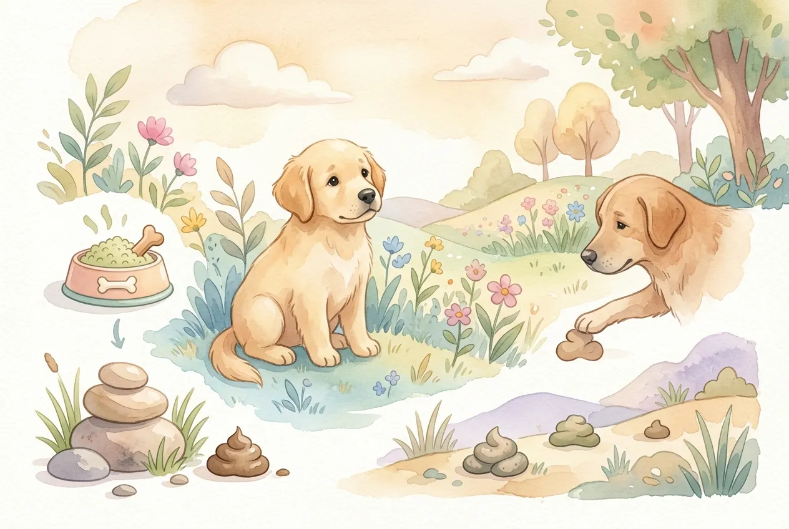
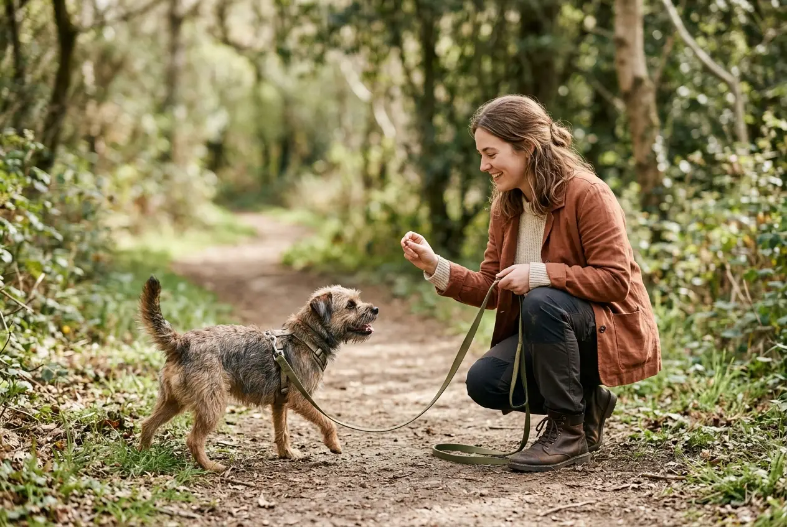
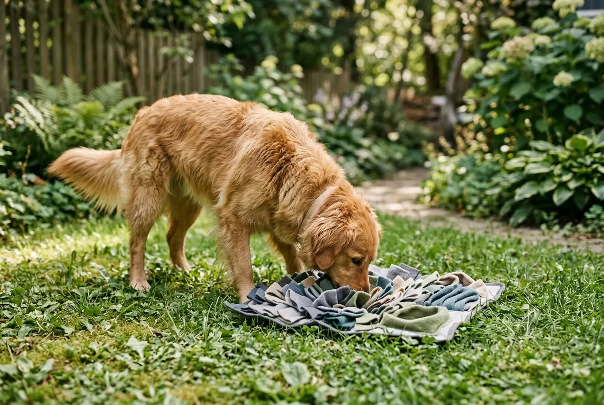

Rund 16 % aller Hunde fressen regelmäßig Kot -- und für die meisten Hundehalter ist das einer der ekligsten Momente im Alltag mit dem Vierbeiner. Warum fressen Hunde Kot? Die Gründe reichen von normalem Instinktverhalten über Magen-Darm-Probleme bis hin zu Langeweile und Stress. Koprophagie -- so der Fachbegriff -- ist zwar unangenehm, aber in vielen Fällen gut behandelbar.

In diesem Ratgeber erfährst du alle wissenschaftlich belegten Ursachen für das Kotfressen bei Hunden, wann das Verhalten gefährlich wird und welche konkreten Maßnahmen wirklich helfen. Außerdem räumen wir mit dem weit verbreiteten Mythos auf, dass ein Nährstoffmangel immer die Ursache ist.

Zusammenfassung: Warum fressen Hunde Kot?

<ul>
<li><strong>Häufiges Verhalten</strong> -- Rund 16 % aller Hunde sind laut einer Studie der University of California (2018) regelmäßige Kotfresser</li>
<li><strong>Vielfältige Ursachen</strong> -- Instinkt, Magen-Darm-Probleme, Enzymmangel, Stress, Langeweile oder erlerntes Verhalten können Koprophagie auslösen</li>
<li><strong>Nährstoffmangel-Mythos</strong> -- Wissenschaftlich ist ein reiner Nährstoffmangel als Ursache nicht belegt; eine gestörte Verdauung kann jedoch eine Rolle spielen</li>
<li><strong>Gesundheitsrisiko durch Parasiten</strong> -- Fremder Kot kann Giardien, Spulwürmer, Salmonellen und andere Erreger übertragen</li>
<li><strong>Training + Ursachenbekämpfung</strong> -- Ein zuverlässiges Abbruchsignal, eine ausgewogene Ernährung und eine tierärztliche Abklärung sind die effektivsten Gegenmaßnahmen</li>
</ul>

16 %

aller Hunde fressen regelmäßig Kot

85 %

fressen nur fremden, nicht eigenen Kot

40+

Parasitenarten über Kot übertragbar

9 Mon.

Alter, bis Welpen-Koprophagie nachlässt

## Was ist Koprophagie? Definition und Einordnung

📖

Definition: Koprophagie

Koprophagie bezeichnet das gezielte Fressen von Kot. Der Begriff stammt aus dem Griechischen: <em>kopros</em> (Kot) und <em>phagein</em> (fressen). Bei Hunden unterscheidet man zwischen Autocoprophagie (Fressen des eigenen Kots) und Allocoprophagie (Fressen von fremdem Kot).

Koprophagie ist bei Hunden deutlich häufiger als viele Halter vermuten. Laut einer umfassenden Studie von Hart et al. an der University of California Davis (2018) mit über 3.000 teilnehmenden Hundehaltern zeigen rund 16 % aller Hunde dieses Verhalten regelmäßig -- also mindestens sechsmal beobachtet. Weitere 7 % wurden mindestens einmal dabei erwischt.

Entscheidend ist die Unterscheidung: Ein Hund, der einmalig am Kot schnüffelt oder probiert, zeigt normales Erkundungsverhalten. Ein Hund, der wiederholt und gezielt Kot frisst, leidet möglicherweise an einem gesundheitlichen oder verhaltensbedingten Problem. Diese Unterscheidung bestimmt, ob du abwarten oder handeln solltest.

### Welche Hunde sind besonders betroffen?

Die Studie von Hart et al. zeigte einige interessante Muster. Bestimmte Faktoren erhöhen die Wahrscheinlichkeit für Koprophagie bei Hunden:

| Faktor | Einfluss auf Kotfressen |
|---|---|
| **Mehrhundehaushalte** | Höheres Risiko als bei Einzelhunden |
| **Terrier und Hütehunde** | Tendenziell häufiger betroffen |
| **Gieriges Fressverhalten** | Starker Zusammenhang mit Koprophagie |
| **Weibliche Hunde** | Leicht erhöhte Neigung (Mutterhündinnen-Instinkt) |
| **Alter** | Kein signifikanter Unterschied zwischen jung und alt |
| **Kastriert vs. intakt** | Kein signifikanter Unterschied |

Hunde, die als "gierige Fresser" beschrieben wurden, zeigten in der Studie eine deutlich höhere Wahrscheinlichkeit für Kotfressen. Das deutet darauf hin, dass das Verhalten weniger mit Ernährungsdefiziten und mehr mit dem individuellen Fressverhalten zusammenhängt.

## Warum fressen Hunde Kot? Die häufigsten Ursachen

Die Gründe, warum Hunde Kot fressen, lassen sich in drei Hauptkategorien einteilen: natürliches Instinktverhalten, gesundheitliche Ursachen und verhaltensbedingte Auslöser. In den meisten Fällen wirken mehrere Faktoren zusammen.

### Natürliches Instinktverhalten

Kotfressen ist bei Hunden teilweise ein evolutionär verankertes Verhalten. Wölfe -- die Vorfahren unserer Hunde -- fressen Kot in der Nähe ihres Lagers, um Parasitenbefall zu reduzieren. Frischer Kot enthält noch keine infektiösen Parasitenlarven, die sich erst nach 2–3 Tagen entwickeln. Dieses "Hygieneverhalten" ist genetisch tief verankert.

Mutterhündinnen fressen in den ersten 3–4 Lebenswochen den Kot ihrer Welpen. Dieses Verhalten dient der Sauberhaltung der Wurfkiste und dem Schutz vor Raubtieren, die durch den Geruch angelockt werden könnten. Es ist völlig normal und kein Grund zur Sorge.

Welpen erkunden ihre Umwelt intensiv über das Maul -- ähnlich wie Menschenkinder alles in den Mund nehmen. Kot fressen gehört bei vielen Welpen zum normalen Erkundungsverhalten und legt sich in der Regel bis zum 9. Lebensmonat von selbst.

### Gesundheitliche Ursachen für Kotfressen

Wenn ein erwachsener Hund plötzlich anfängt, Kot zu fressen, können gesundheitliche Probleme dahinterstecken. Besonders Magen-Darm-Erkrankungen und Verdauungsstörungen spielen eine wichtige Rolle.

🔬

Exokrine Pankreasinsuffizienz (EPI)

Die Bauchspeicheldrüse produziert zu wenig Verdauungsenzyme. Nährstoffe werden nicht vollständig aufgespalten und landen unverdaut im Kot -- der dadurch für den Hund "attraktiv" riecht.

🦠

Parasitenbefall

Würmer und Giardien im Darm entziehen dem Hund Nährstoffe. Der Körper versucht, den Verlust durch zusätzliche Nahrungsaufnahme auszugleichen -- auch durch Kot.

🧬

Gestörte Darmflora

Nach Antibiotikagabe oder bei chronischen Magen-Darm-Problemen kann die Darmflora aus dem Gleichgewicht geraten. Manche Hunde versuchen instinktiv, fehlende Darmbakterien über Kot aufzunehmen.

💊

Malabsorption

Bei bestimmten Darmerkrankungen (z. B. IBD) werden Nährstoffe trotz ausreichender Fütterung nicht richtig aufgenommen. Der Hund fühlt sich permanent hungrig.

Weitere gesundheitliche Ursachen können Schilddrüsenunterfunktion, Diabetes mellitus, Morbus Cushing oder Nebenwirkungen von Medikamenten (z. B. Kortison) sein. All diese Erkrankungen können den Appetit steigern oder die Verdauung beeinträchtigen.

⚠️

<strong>Plötzliches Kotfressen ernst nehmen</strong>

Wenn dein erwachsener Hund plötzlich und wiederholt Kot frisst, obwohl er das vorher nie getan hat, solltest du einen Tierarzt aufsuchen. Plötzliche Verhaltensänderungen beim Fressen können auf ernsthafte Magen-Darm-Erkrankungen oder eine exokrine Pankreasinsuffizienz hinweisen.

### Verhaltensbedingte Ursachen

Nicht immer steckt ein gesundheitliches Problem hinter dem Kotfressen. Häufig sind psychische und verhaltensbedingte Faktoren die Auslöser.

**Langeweile und Unterforderung:** Hunde, die geistig und körperlich nicht ausreichend beschäftigt werden, suchen sich selbst Beschäftigung. Kot fressen kann eine Form der Selbststimulation sein -- besonders bei Hunden, die viel allein im Garten sind.

**Stress und Angst:** Hunde unter chronischem Stress -- etwa durch Trennungsangst, Konflikte im Mehrhundehaushalt oder eine reizarme Umgebung -- zeigen häufiger Koprophagie. Das Verhalten kann eine Übersprungshandlung sein.

**Aufmerksamkeitssuche:** Manche Hunde lernen, dass Kotfressen eine starke Reaktion beim Halter auslöst. Selbst negative Aufmerksamkeit (Schimpfen, Hinterherlaufen) kann das Verhalten unbeabsichtigt verstärken. Der Hund verknüpft: "Wenn ich Kot fresse, beachtet mich mein Mensch."

**Erlerntes Verhalten:** In Mehrhundehaushalten können jüngere Hunde das Kotfressen von älteren Artgenossen übernehmen. Auch Hunde aus schlechter Haltung (Tierheim, Vermehrerzucht), die in beengten Verhältnissen mit eigenem Kot leben mussten, zeigen dieses Verhalten häufiger.

## Der Nährstoffmangel-Mythos: Was die Wissenschaft sagt

Lange galt die Annahme, dass Hunde Kot fressen, weil ihnen bestimmte Nährstoffe fehlen. Diese Theorie ist wissenschaftlich nicht haltbar. Die Studie von Hart et al. (2018) an der University of California Davis untersuchte gezielt den Zusammenhang zwischen Ernährung und Koprophagie -- und fand keinen signifikanten Unterschied zwischen kotfressenden und nicht-kotfressenden Hunden hinsichtlich ihrer Ernährungsweise.

Weder die Art des Futters (Trockenfutter, Nassfutter, BARF) noch die Zugabe von Nahrungsergänzungsmitteln hatte einen messbaren Einfluss auf das Kotfressverhalten. Das bedeutet: Eine Futterumstellung allein löst das Problem in den meisten Fällen nicht.

📖

<strong>Studie: Hart et al. (2018) -- University of California Davis</strong>

In der bislang größten Studie zur Koprophagie bei Hunden (über 3.000 Teilnehmer) konnte kein Zusammenhang zwischen Ernährungsdefiziten und Kotfressen nachgewiesen werden. Die Forscher vermuten stattdessen einen evolutionären Ursprung: Wölfe fressen frischen Kot, um Parasitenlarven zu beseitigen, bevor diese infektiös werden.

Allerdings gibt es eine wichtige Einschränkung: Wenn die Verdauung gestört ist -- etwa durch eine exokrine Pankreasinsuffizienz oder Parasitenbefall -- landen unverdaute Nährstoffe im Kot. Dieser Kot riecht für den Hund dann tatsächlich wie Futter. In diesem Fall liegt das Problem aber nicht an der Ernährung selbst, sondern an der gestörten Nährstoffverwertung im Magen-Darm-Trakt.

## Welchen Kot fressen Hunde am häufigsten?

Nicht jeder Kot ist für Hunde gleich "interessant". Die Art des gefressenen Kots kann Hinweise auf die Ursache geben.

| Kot-Art | Häufigkeit | Mögliche Gründe |
|---|---|---|
| **Eigener Kot** | Weniger häufig (~15 % der Kotfresser) | Verdauungsprobleme, EPI, Welpenverhalten |
| **Kot anderer Hunde** | Sehr häufig (~85 % der Kotfresser) | Instinkt, Neugier, sozialer Kontext |
| **Katzenkot** | Sehr beliebt bei Hunden | Hoher Proteingehalt, intensiver Geruch |
| **Pferde-/Kuhkot** | Häufig beim Spaziergang | Pflanzliche Reste, Gärungsgeruch |
| **Wildtierkot (Fuchs, Hase)** | Gelegentlich | Jagdinstinkt, Neugier |

### Warum fressen Hunde Katzenkot besonders gern?

Katzenkot ist für viele Hunde besonders attraktiv. Der Grund liegt in der Ernährung von Katzen: Als obligate Karnivoren fressen Katzen fast ausschließlich Protein und Fett. Ihr Verdauungstrakt ist kürzer als der von Hunden, weshalb der Katzenkot noch viele unverdaute Nährstoffe enthält. Für die empfindliche Hundenase riecht Katzenkot daher regelrecht nach einer Mahlzeit.

### Hund frisst eigenen Kot -- ein Sonderfall

Wenn dein Hund seinen eigenen Kot frisst, ist das besonders auffällig. Dieses Verhalten tritt seltener auf als das Fressen von Fremdkot und deutet häufiger auf eine gesundheitliche Ursache hin. Mögliche Gründe sind eine exokrine Pankreasinsuffizienz, bei der unverdaute Futterbestandteile im Kot verbleiben, oder eine gestörte Darmflora nach Antibiotikagabe. Auch Hunde, die als Welpen in beengten Verhältnissen gehalten wurden, zeigen dieses Verhalten häufiger.

## Ist Kotfressen gefährlich? Gesundheitsrisiken im Überblick

Kotfressen ist nicht nur unappetitlich -- es kann für Hunde tatsächlich gesundheitliche Folgen haben. Das Risiko hängt stark davon ab, wessen Kot der Hund frisst.

### Parasiten durch Kotfressen

Über Kot können zahlreiche Parasiten übertragen werden. Besonders gefährlich ist der Kot von unbekannten Hunden, Wildtieren und Katzen mit Freigang.

🚫

<strong>Achtung: Parasitenübertragung durch Kot</strong>

Über fremden Kot können Giardien, Spulwürmer, Hakenwürmer, Bandwürmer und Kokzidien übertragen werden. Einige dieser Parasiten sind auch auf Menschen übertragbar (Zoonose). Lass deinen Hund bei regelmäßigem Kotfressen alle 3 Monate auf Parasiten untersuchen.

| Erreger | Übertragungsweg | Symptome beim Hund | Auf Menschen übertragbar? |
|---|---|---|---|
| **Giardien** | Kot von Hunden, Katzen, Wildtieren | Durchfall, Blähungen, Gewichtsverlust | Ja |
| **Spulwürmer** | Kot von Hunden, Katzen, Füchsen | Durchfall, aufgeblähter Bauch, stumpfes Fell | Ja (v. a. Kinder) |
| **Hakenwürmer** | Kot von Hunden | Blutiger Durchfall, Anämie | Ja (Hautlarva migrans) |
| **Kokzidien** | Kot von Hunden, Katzen | Wässriger Durchfall, besonders bei Welpen | Nein (artspezifisch) |
| **Neospora caninum** | Kot von Rindern | Neurologische Störungen, Lähmungen | Nein |

### Bakterielle Infektionen

Neben Parasiten können auch bakterielle Erreger über Kot übertragen werden. Salmonellen, Campylobacter und E. coli sind die häufigsten Verursacher von Magen-Darm-Infektionen durch Kotfressen. Besonders der Kot von Wildvögeln und Reptilien enthält oft hohe Salmonellen-Konzentrationen.

### Risiko für Menschen im Haushalt

Hunde, die regelmäßig Kot fressen, können Erreger über ihr Maul auf Menschen übertragen -- etwa durch Ablecken von Händen oder Gesicht. Besonders für Kleinkinder, ältere Menschen und immungeschwächte Personen besteht ein erhöhtes Infektionsrisiko. Regelmäßige Entwurmung und Hygienemaßnahmen sind daher besonders wichtig, wenn dein Hund zu Koprophagie neigt.

## Wann du zum Tierarzt gehen solltest

Nicht jedes Kotfressen erfordert sofort einen Tierarztbesuch. Einmaliges Schnuppern oder Probieren bei Welpen ist normal. Bei folgenden Anzeichen solltest du jedoch zeitnah einen Tierarzt aufsuchen:

✅ Checkliste: Tierarztbesuch empfohlen bei

✓

Plötzliches Auftreten bei erwachsenen Hunden (vorher nie gezeigt)

✓

Kotfressen über mehr als 4 Wochen trotz Gegenmaßnahmen

✓

Begleitsymptome: Durchfall, Erbrechen, Gewichtsverlust, Appetitlosigkeit

✓

Stumpfes Fell, aufgeblähter Bauch oder vermehrter Durst

✓

Hund frisst ausschließlich eigenen Kot (Hinweis auf EPI)

Welpe unter 9 Monaten probiert gelegentlich Kot (meist normal)

Der Tierarzt wird in der Regel eine Kotuntersuchung auf Parasiten (Flotationsverfahren, Giardien-Schnelltest) und eine Blutuntersuchung durchführen. Bei Verdacht auf eine exokrine Pankreasinsuffizienz wird der TLI-Wert (Trypsin-like Immunoreactivity) im Blut bestimmt. Die Kosten für eine umfassende Diagnostik liegen je nach Umfang zwischen 80 und 250 Euro.

## Kotfressen abgewöhnen: Was wirklich hilft

Die effektivste Strategie gegen Kotfressen kombiniert drei Ansätze: Ursachenbekämpfung, Training und Management. Eine einzelne Maßnahme allein reicht selten aus.

### Schritt 1: Gesundheitliche Ursachen ausschließen

Bevor du mit dem Training beginnst, sollte der Tierarzt mögliche gesundheitliche Ursachen abklären. Eine Kotuntersuchung auf Parasiten und eine Blutuntersuchung sind die wichtigsten ersten Schritte. Wenn eine exokrine Pankreasinsuffizienz diagnostiziert wird, kann die Zugabe von Verdauungsenzymen zum Futter das Kotfressen oft deutlich reduzieren.

### Schritt 2: Ernährung optimieren

Auch wenn ein Nährstoffmangel selten die alleinige Ursache ist, kann eine ausgewogene Ernährung das Kotfressen positiv beeinflussen. Eine hochwertige, gut verdauliche Ernährung reduziert die Menge unverdauter Nährstoffe im Kot -- und macht ihn damit weniger attraktiv für den Hund.

💡

<strong>Ernährungstipps gegen Kotfressen</strong>

Füttere ein hochwertiges Alleinfuttermittel mit mindestens 25 % Rohprotein und guter Verdaulichkeit. Verteile die Tagesration auf 2–3 Mahlzeiten, um den Hunger gleichmäßig zu stillen. Probiotische Zusätze können die Darmflora stabilisieren und die Nährstoffverwertung verbessern.

Wenn dein Hund zu einer [ausgewogenen Ernährung](https://hundewissen-mit-kopf.de/hundeernaehrung/duerfen-hunde-aepfel-essen/) mit abwechslungsreichen, hundegeeigneten Lebensmitteln neigt, kann das die Darmgesundheit zusätzlich unterstützen.

### Schritt 3: Zuverlässiges Abbruchsignal trainieren

Ein gut trainiertes Abbruchsignal ist die wichtigste Verhaltensmaßnahme gegen Kotfressen. Das Signal -- etwa "Nein", "Lass es" oder "Pfui" -- muss zuverlässig sitzen, bevor du es in der Kotsituation einsetzt.

1

Abbruchsignal aufbauen

Trainiere "Lass es" zuerst mit harmlosen Gegenständen (Spielzeug, Leckerli auf dem Boden). Belohne sofortiges Abwenden mit einem hochwertigen Ersatzleckerli.

2

Schwierigkeit steigern

Übe mit zunehmend attraktiven Gegenständen und in verschiedenen Umgebungen. Der Hund muss das Signal in 9 von 10 Fällen zuverlässig befolgen.

3

In der Kotsituation anwenden

Setze das Signal beim Spaziergang ein, sobald dein Hund Interesse an Kot zeigt. Halte ihn an der Leine und belohne sofortiges Abwenden großzügig.

✓

Langfristig festigen

Wiederhole das Training über Wochen konsequent. Reduziere die Leckerli-Belohnung schrittweise und ersetze sie durch verbales Lob.

Ein solides Grundgehorsam-Training ist die Basis für ein zuverlässiges Abbruchsignal. Wenn du noch an den [Grundkommandos für deinen Hund](https://hundewissen-mit-kopf.de/erziehung-verhalten/kommandos-hund/) arbeitest, beginne dort, bevor du das Anti-Kotfress-Training startest.

### Schritt 4: Management im Alltag

Neben dem Training helfen praktische Maßnahmen, die Gelegenheiten zum Kotfressen zu reduzieren:

- **Kot im Garten sofort aufsammeln** -- lasse keinen Hundekot länger als 10 Minuten liegen
- **An der Leine führen** in Bereichen mit viel Hundekot, bis das Abbruchsignal zuverlässig sitzt
- **Katzenklo unzugänglich aufstellen** -- erhöhter Standort, geschlossenes Klo oder Babygitter
- **Ausreichend Beschäftigung bieten** -- mindestens 2 Stunden Bewegung und geistige Auslastung täglich
- **Nicht schimpfen oder bestrafen** -- das verstärkt Stress und kann das Verhalten verschlimmern

## Hausmittel gegen Kotfressen: Was funktioniert?

Im Internet kursieren zahlreiche Hausmittel gegen Koprophagie. Manche haben einen nachvollziehbaren Wirkmechanismus, andere sind reine Mythen.

Möglicherweise hilfreich

<ul>
<li><strong>Harzer Käse</strong> -- Soll den Kotgeruch verändern; 1–2 kleine Stücke täglich; laktosearm und proteinreich</li>
<li><strong>Ananas/Zucchini im Futter</strong> -- Soll den Kot geschmacklich unattraktiver machen; wissenschaftlich nicht belegt, aber unschädlich</li>
<li><strong>Probiotika</strong> -- Können die Darmflora stabilisieren und die Verdauung verbessern; tierärztlich empfohlen</li>
<li><strong>Verdauungsenzyme</strong> -- Sinnvoll bei nachgewiesener EPI; verbessern die Nährstoffaufspaltung</li>
</ul>

Nicht empfehlenswert

<ul>
<li><strong>Tabasco/Chili auf den Kot</strong> -- Kann Schleimhäute reizen und Magen-Darm-Probleme verursachen</li>
<li><strong>Maulkorb als Dauerlösung</strong> -- Behandelt nur das Symptom, nicht die Ursache; schränkt das Hecheln ein</li>
<li><strong>Bestrafen beim Kotfressen</strong> -- Erhöht Stress und kann das Verhalten verstärken oder heimliches Fressen fördern</li>
<li><strong>Homöopathische Globuli</strong> -- Keine wissenschaftliche Evidenz für Wirksamkeit bei Koprophagie</li>
</ul>

### Harzer Käse gegen Kotfressen -- funktioniert das?

Harzer Käse ist das wohl bekannteste Hausmittel gegen Kotfressen bei Hunden. Die Idee dahinter: Der intensive Geruch des Käses soll über die Verdauung den Eigengeruch des Kots verändern und ihn für den Hund unattraktiv machen. Wissenschaftliche Studien, die diese Wirkung belegen, gibt es allerdings nicht.

Harzer Käse ist mit nur 0,5 % Fett und rund 30 % Protein ein kalorienarmer, proteinreicher Snack. Da er aus Sauermilchquark hergestellt wird, enthält er kaum Laktose und wird von den meisten Hunden gut vertragen. Empfohlen werden 1–2 kleine Stücke (je ca. 10 g) täglich, die dem Futter beigemischt oder als Leckerli gegeben werden. Einen Versuch ist es wert -- aber verlasse dich nicht allein auf dieses Hausmittel.

## Grenzen setzen: Konsequentes Verhalten im Alltag

Konsequenz ist der Schlüssel, wenn du deinem Hund das Kotfressen abgewöhnen möchtest. Alle Familienmitglieder müssen die gleichen Regeln anwenden. Inkonsequentes Verhalten -- mal durchgehen lassen, mal schimpfen -- verwirrt den Hund und verzögert den Trainingserfolg.

Grenzen setzen bedeutet nicht, den Hund zu bestrafen. Es bedeutet, klare Regeln aufzustellen und diese ruhig, aber bestimmt durchzusetzen. Das [Abbruchsignal](https://hundewissen-mit-kopf.de/erziehung-verhalten/leinenfuehrigkeit-trainieren/) muss in jeder Situation gleich eingesetzt werden -- egal ob du selbst spazieren gehst oder ein anderes Familienmitglied.

ℹ️

<strong>Geduld ist entscheidend</strong>

Verhaltensänderungen beim Hund brauchen Zeit. Rechne mit 4–8 Wochen konsequentem Training, bevor du eine deutliche Verbesserung siehst. Rückfälle sind normal und kein Grund zur Frustration. Bleibe ruhig und konsequent -- dein Hund lernt durch Wiederholung.

## Koprophagie bei Welpen: Wann ist es normal?

Welpen fressen häufiger Kot als erwachsene Hunde -- und in den meisten Fällen ist das kein Grund zur Sorge. Das Erkundungsverhalten über das Maul ist ein normaler Entwicklungsschritt. Welpen lernen ihre Umwelt kennen, indem sie alles beschnuppern, belecken und probieren -- auch Kot.

Typischerweise lässt dieses Verhalten bis zum 9. Lebensmonat deutlich nach. Während dieser Phase solltest du das Verhalten zwar nicht ignorieren, aber auch nicht überbewerten. Sammle Kot im Garten sofort auf, lenke den Welpen beim Spaziergang ab und belohne das Abwenden von Kot.

✅

<strong>Normales Welpenverhalten</strong>

Gelegentliches Kotfressen bei Welpen unter 9 Monaten ist in der Regel normales Erkundungsverhalten. Solange der Welpe gesund ist, gut frisst und keine Magen-Darm-Symptome zeigt, besteht kein Grund zur Sorge. Trainiere frühzeitig ein Abbruchsignal, um das Verhalten nicht zur Gewohnheit werden zu lassen.

Wenn ein Welpe jedoch exzessiv und täglich Kot frisst, dabei Durchfall zeigt oder an Gewicht verliert, solltest du einen Tierarzt aufsuchen. Parasitenbefall ist bei Welpen besonders häufig und kann das Kotfressen verstärken.

## Kotfressen bei Hunden vorbeugen: Langfristige Strategien

Vorbeugung ist einfacher als Abgewöhnung. Mit diesen langfristigen Maßnahmen reduzierst du das Risiko, dass dein Hund zum Kotfresser wird:

**Ausgewogene Ernährung sicherstellen:** Füttere ein hochwertiges Alleinfuttermittel, das den Nährstoffbedarf deines Hundes vollständig deckt. Die Futtermenge sollte dem Gewicht, Alter und Aktivitätslevel angepasst sein -- [Schokolade und andere giftige Lebensmittel](https://hundewissen-mit-kopf.de/hundeernaehrung/warum-duerfen-hunde-keine-schokolade/) gehören selbstverständlich nicht auf den Speiseplan.

**Regelmäßige Entwurmung:** Entwurme deinen Hund alle 3 Monate oder lasse regelmäßig Kotproben untersuchen. Parasitenbefall kann sowohl Ursache als auch Folge von Kotfressen sein.

**Ausreichend Beschäftigung:** Mindestens 2 Stunden Bewegung und geistige Auslastung pro Tag. Schnüffelspiele, Suchaufgaben und Denkspielzeug halten den Hund beschäftigt und reduzieren Langeweile.

**Stressreduktion:** Identifiziere und reduziere Stressquellen im Alltag deines Hundes. Ein [gut erzogener Hund](https://hundewissen-mit-kopf.de/erziehung-verhalten/hund-stubenrein-bekommen/), der seine Umgebung als sicher empfindet, neigt weniger zu Übersprungshandlungen wie Kotfressen.

**Kot sofort aufsammeln:** Die einfachste Präventionsmaßnahme im eigenen Garten. Kein verfügbarer Kot bedeutet keine Gelegenheit zum Fressen.

## Fazit: Warum fressen Hunde Kot -- und was du tun kannst

Kotfressen bei Hunden ist ein häufiges Verhalten mit vielfältigen Ursachen. In den meisten Fällen steckt kein dramatisches Gesundheitsproblem dahinter -- aber das Verhalten sollte ernst genommen werden, weil über Kot Parasiten und Bakterien übertragen werden können.

Der wichtigste erste Schritt: Lass deinen Hund tierärztlich untersuchen, um gesundheitliche Ursachen wie eine exokrine Pankreasinsuffizienz, Parasitenbefall oder Magen-Darm-Erkrankungen auszuschließen. Parallel dazu trainierst du ein zuverlässiges Abbruchsignal und sorgst für eine ausgewogene Ernährung sowie ausreichend Beschäftigung.

Warum fressen Hunde Kot? Oft ist es eine Kombination aus Instinkt, Gelegenheit und individuellen Faktoren. Mit Geduld, Konsequenz und dem richtigen Ansatz kannst du deinem Hund das Kotfressen in den meisten Fällen erfolgreich abgewöhnen. Rechne mit 4–8 Wochen Training -- und feiere jeden kleinen Fortschritt.