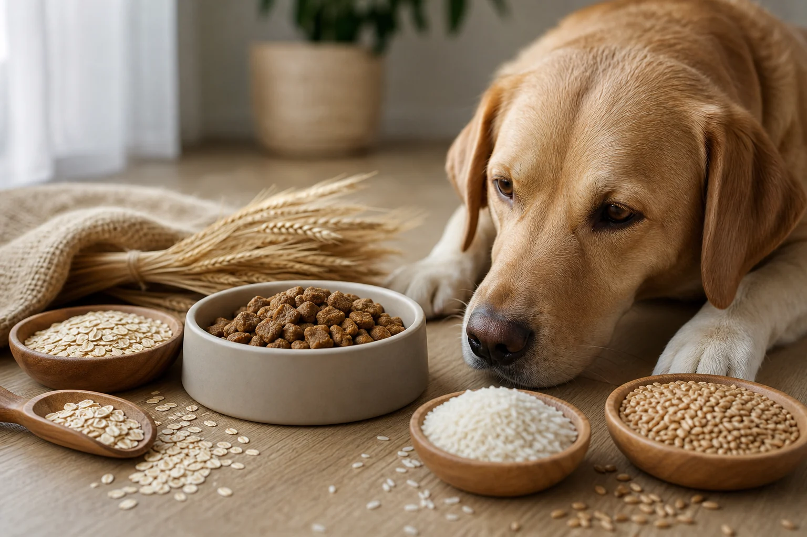
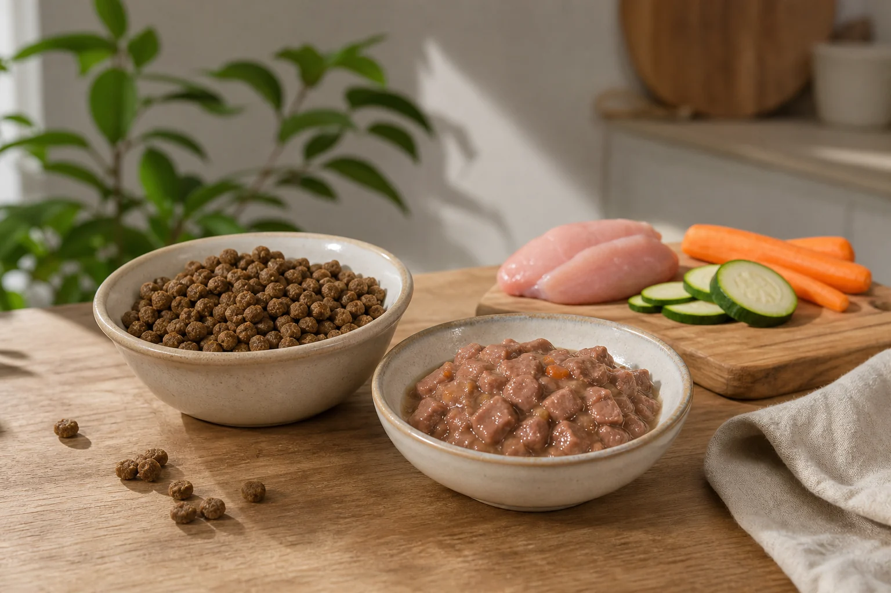

Getreidefreies Hundefutter ist kein Trend mehr, sondern ein fester Bestandteil des Heimtiermarkts. Ob es für deinen Hund tatsächlich sinnvoll ist, hängt von seinem Gesundheitszustand, seinem Verdauungssystem und seinen individuellen Bedürfnissen ab. Hundefutter ohne Getreide ist nicht automatisch besser als herkömmliches Futter, kann aber bei empfindlichen Hunden oder nachgewiesenen Unverträglichkeiten einen echten Unterschied machen.

Dieser Artikel erklärt, was hinter dem Begriff steckt, für wen getreidefrei wirklich sinnvoll ist, wie du gute Qualität an der Zutatenliste erkennst und wie die Umstellung reibungslos klappt.

## Was steckt hinter getreidefrei­em Hundefutter?

### Getreidefreies Hundefutter – was bedeutet das genau?

Getreidefreies Hundefutter enthält keine Zutaten aus Getreidepflanzen wie Weizen, Mais, Gerste, Roggen, Hafer oder Reis. Stattdessen liefern andere Zutaten die Energie und Kohlenhydrate, die der Hund benötigt. Typische Alternativen sind Kartoffeln, Süßkartoffeln, Erbsen, Linsen oder Kichererbsen.

Der Begriff ist gesetzlich nicht einheitlich definiert. Das [Bundesministerium für Ernährung und Landwirtschaft](https://www.bmel.de/) schreibt zwar eine vollständige Zutatendeklaration für Heimtierfutter vor, einen offiziellen Standard für das Label „getreidefrei" gibt es jedoch nicht. Hersteller können den Begriff also weitgehend frei verwenden. Umso wichtiger ist ein kritischer Blick auf die Zutatenliste.

Hundefutter getreidefrei zu gestalten, bedeutet nicht zwangsläufig, dass das Futter hochwertiger ist. Entscheidend ist die Gesamtrezeptur, also das Verhältnis von Fleisch, Kohlenhydratträgern, Fetten, Vitaminen und Mineralstoffen.

### Getreidefrei gleich glutenfrei – und gleich kohlenhydratfrei?

Diese beiden Gleichsetzungen sind weit verbreitet, aber beide falsch. Glutenfrei und getreidefrei sind nicht dasselbe: Gluten ist ein Klebereiweiß, das vor allem in Weizen, Gerste und Roggen vorkommt. Getreidefreies Hundefutter kann aber andere Zutaten enthalten, die Gluten liefern, zum Beispiel bestimmte Hülsenfrüchte oder Zusatzstoffe. Wer ein wirklich glutenfreies Futter sucht, muss die Zutatenliste Zeile für Zeile prüfen.

Kohlenhydratfrei ist getreidefreies Futter ebenfalls selten. Kartoffeln und Hülsenfrüchte liefern erhebliche Mengen an Stärke und damit Kohlenhydrate. Getreidefrei bedeutet nur, dass keine Getreidepflanzen verarbeitet wurden, nicht dass der Hund weniger Kohlenhydrate aufnimmt.

Zusammenfassung: Was getreidefreies Hundefutter ist

<ul>
<li><strong>Kein Getreide</strong> – Weizen, Mais, Reis, Gerste und Co. sind ausgeschlossen</li>
<li><strong>Nicht automatisch glutenfrei</strong> – andere Zutaten können Gluten enthalten</li>
<li><strong>Nicht automatisch kohlenhydratarm</strong> – Kartoffeln und Hülsenfrüchte liefern Stärke</li>
<li><strong>Kein gesetzlicher Standard</strong> – das Label ist nicht einheitlich definiert, Zutatenliste immer prüfen</li>
</ul>

## Getreide im Hundefutter: Fluch oder Füllstoff?

### Warum landet Getreide überhaupt im Hundefutter?

Getreide erfüllt im Hundefutter mehrere Funktionen. Es liefert Energie in Form von Kohlenhydraten, verbessert die Konsistenz von Trockenfutter beim Extrusionsprozess und ist im Vergleich zu Fleisch ein günstiger Rohstoff. Besonders Mais und Weizen werden häufig eingesetzt, weil sie leicht verfügbar, preiswert und gut verarbeitbar sind.

Aus Kostengründen landen in günstigeren Futtersorten teils hohe Getreideanteile, die den Fleischanteil drücken. Kritiker sprechen deshalb von „Füllstoff". Das ist nicht ganz fair, denn Getreide kann durchaus verdauliche Energie liefern, wenn es in einem ausgewogenen Verhältnis eingesetzt wird. Hunde sind im Laufe der Domestizierung in der Lage, Stärke besser zu verdauen als ihre Vorfahren. Laut einer Studie der Universität Uppsala haben Haushunde im Vergleich zu Wölfen deutlich mehr Kopien des Amylase-Gens, was die Stärkeverdauung erleichtert.

### Mögliche Nachteile von Getreide für empfindliche Hunde

Für die meisten gesunden Hunde ist Getreide im Futter kein Problem. Bei empfindlichen Tieren kann es jedoch zu Reaktionen kommen. Manche Hunde zeigen nach dem Verzehr von Weizen oder Mais Symptome wie weichen Kot, übermäßige Gasbildung oder Hautirritationen. In solchen Fällen kann ein Wechsel auf Hundefutter ohne Getreide die Beschwerden lindern.

Echte Getreideallergien sind beim Hund selten. Häufiger steckt eine Unverträglichkeit gegenüber einem bestimmten Futterbestandteil dahinter, die sich erst durch einen Ausschlusstest eingrenzen lässt. Eine ausgewogene Ernährung bleibt das Ziel, egal ob mit oder ohne Getreide. Wer seinen Hund auf eine [Sozialisierung Welpe Checkliste](https://hundewissen-mit-kopf.de/erziehung-verhalten/sozialisierung-welpe-checkliste/) vorbereitet und dabei auch die Ernährung im Blick hat, legt den Grundstein für ein gesundes Erwachsenenleben.

~7 %

Hunde mit Futterunverträglichkeiten

18–25 %

Empfohlener Rohproteingehalt (DVG-Leitlinie, Trockensubstanz)

&lt; 45 °C

Verarbeitungstemperatur bei Kaltpressung

7–10 Tage

Empfohlene Umstellungsdauer auf neues Futter

## Für wen ist getreidefreies Hundefutter sinnvoll?

🤧

Allergiker und empfindliche Hunde

Hunde mit Futtermittelunverträglichkeiten oder Hautproblemen können von einer getreidefreien Rezeptur profitieren.

🐾

Welpen und Junghunde

Mit speziell deklarierten Junior-Sorten ist getreidefreies Futter auch für wachsende Hunde geeignet.

🦴

Aktive und sportliche Hunde

Ein hoher Fleischanteil liefert leicht verfügbares Protein für Muskeln und Ausdauer.

🏥

Hunde nach Erkrankungen

Nach Magen-Darm-Erkrankungen kann leicht verdauliches, getreidefreies Futter die Erholung unterstützen.

### Hunde mit Allergien und Unverträglichkeiten

Bei Hunden mit [Hunderassen für Allergiker](https://hundewissen-mit-kopf.de/hunderassen/allergiker-hunde/) oder nachgewiesenen Futtermittelunverträglichkeiten ist der Wechsel auf Hundefutter ohne Getreide oft der erste sinnvolle Schritt. Typische Symptome einer Futterunverträglichkeit sind anhaltender Juckreiz, gerötete Pfoten, wiederkehrende Ohrentzündungen oder instabiler Stuhlgang.

Wichtig: Bevor du das Futter wechselst, sollte ein Tierarzt andere Ursachen ausschließen. Ein kontrollierter Ausschlusstest mit einer Mono-Protein-Diät über mindestens acht Wochen gilt als Goldstandard, um den auslösenden Stoff zu identifizieren. Die [Veterinärmedizinische Universität Wien](https://www.vetmeduni.ac.at/) empfiehlt bei Verdacht auf Futtermittelallergie eine strukturierte Eliminationsdiät unter tierärztlicher Aufsicht, da Selbstversuche häufig keine eindeutigen Ergebnisse liefern.

### Getreidefreies Hundefutter für Welpen und Junghunde

Getreidefreies Hundefutter für Welpen ist grundsätzlich möglich, aber nur dann sinnvoll, wenn das Futter ausdrücklich als Welpenfutter oder getreidefreies Hundefutter Junior deklariert ist. Welpen haben einen deutlich höheren Bedarf an Kalzium, Phosphor, Energie und bestimmten Aminosäuren als ausgewachsene Hunde. Allgemeines getreidefreies Erwachsenenfutter deckt diese Bedarfe nicht zuverlässig.

Beim Kauf lohnt sich ein Blick auf die Nährwertangaben: Das Kalzium-Phosphor-Verhältnis sollte für Welpen bei etwa 1,2 bis 1,4 zu 1 liegen. Gutes getreidefreies Hundefutter Junior nennt auf der Verpackung die Altersgruppe und idealerweise auch die Rassegröße, da Großrassen einen anderen Nährstoffbedarf haben als kleine Hunde. Wer [Hundefutter selber kochen](https://hundewissen-mit-kopf.de/hundeernaehrung/hundefutter-selber-kochen/) möchte, sollte bei Welpen besonders sorgfältig auf eine ausgewogene Nährstoffzusammensetzung achten.

## Zutaten und Qualität: So erkennen Sie gutes getreidefreies Hundefutter

### Getreidefreies Hundefutter mit hohem Fleischanteil richtig bewerten

Die Zutatenliste ist das wichtigste Qualitätsmerkmal. Bei hochwertigem getreidefreiem Hundefutter mit hohem Fleischanteil steht Fleisch oder eine konkrete Fleischsorte, zum Beispiel „Hühnerfleisch" oder „Lachsfilet", an erster Stelle. Das ist gesetzlich bedeutsam, denn Zutaten müssen in absteigender Reihenfolge nach Gewicht aufgeführt werden.

Vorsicht ist bei Sammelbegriffen wie „Fleisch und tierische Nebenerzeugnisse" geboten. Diese Formulierung erlaubt es Herstellern, die genaue Zusammensetzung von Charge zu Charge zu variieren, was bei Hunden mit Unverträglichkeiten problematisch ist. Hochwertiges Futter deklariert jede Fleischkomponente einzeln.

Gute Zutaten in getreidefreiem Futter sind außerdem: Süßkartoffeln oder Kartoffeln als Kohlenhydratquelle, hochwertige Öle wie Lachsöl oder Rapsöl für Omega-3-Fettsäuren sowie natürliche Konservierungsmittel wie Tocopherole (Vitamin E). Finger weg von Futter mit langen Listen an Zuckerzusätzen, künstlichen Aromen oder Farbstoffen.

Laut den Kennzeichnungspflichten des [BMEL](https://www.bmel.de/) müssen alle Zutaten vollständig deklariert sein. Nutze dieses Recht und vergleiche Zutatenlisten, bevor du kaufst.

### Kaltgepresstes getreidefreies Hundefutter: Eine besondere Herstellungsform

Kaltgepresstes getreidefreies Hundefutter wird bei Temperaturen unter 45 Grad Celsius verarbeitet. Im Gegensatz zur herkömmlichen Extrusion, bei der Temperaturen von über 120 Grad Celsius üblich sind, bleiben bei der Kaltpressung hitzeempfindliche Nährstoffe, Enzyme und Vitamine besser erhalten.

Das Verfahren hat jedoch auch Grenzen: Kaltgepresstes Futter ist weniger haltbar als extrudiertes Trockenfutter und sollte nach dem Öffnen zügig verbraucht werden. Außerdem ist die Stärke in kaltgepresstem Futter schlechter aufgeschlossen, was die Verdaulichkeit für manche Hunde verringern kann. Für Hunde mit empfindlichem Magen-Darm-Trakt oder einem Bedarf an besonders schonend verarbeiteten Zutaten kann kaltgepresstes getreidefreies Hundefutter dennoch eine gute Wahl sein.

💡

<strong>Tipp: So liest du die Zutatenliste richtig</strong>

Achte auf die ersten drei bis fünf Zutaten – sie machen den Großteil des Futters aus. Steht Fleisch an erster Stelle und folgen keine langen Reihen von Füllstoffen, ist das ein gutes Zeichen. Vermeide Futter, bei dem Getreidealternativen wie Erbsenmehl oder Kartoffelflocken in mehreren Varianten aufgeführt werden, da das ein Hinweis auf „Ingredient Splitting" sein kann, also das künstliche Aufsplitten eines Hauptbestandteils auf mehrere Positionen.

## Trockenfutter oder Nassfutter – getreidefreie Varianten im Überblick

Getreidefreies Trockenfutter

<ul>
<li>Lange Haltbarkeit, einfache Lagerung</li>
<li>Gut für Zähne und Zahnfleisch durch mechanische Reinigung</li>
<li>Praktisch für unterwegs und beim Reisen</li>
<li>Energiedicht, ideal für aktive Hunde</li>
</ul>

Getreidefreies Nassfutter

<ul>
<li>Höherer Wassergehalt unterstützt die Flüssigkeitsversorgung</li>
<li>Besser geeignet für Hunde mit geringem Trinktrieb</li>
<li>Oft höherer Fleischanteil in der Frischmasse</li>
<li>Nach dem Öffnen schnell verbrauchen, weniger praktisch unterwegs</li>
</ul>

### Getreidefreies Trockenfutter: Vorteile und worauf Sie achten sollten

Getreidefreies Hundefutter als Trockenfutter ist die am häufigsten gewählte Form. Es ist einfach zu dosieren, lange haltbar und für die meisten Hunde gut verträglich. Beim Kauf von getreidefrei­em Hundefutter Trockenfutter solltest du auf den Rohproteingehalt achten: Laut DVG-Leitlinie (Stand 2024) sollten ausgewachsene Hunde mindestens 18 bis 25 Prozent Rohprotein in der Trockensubstanz erhalten. Viele hochwertige getreidefreie Trockenfutter liegen deutlich darüber.

Ein weiteres Qualitätsmerkmal ist der Feuchtigkeitsgehalt. Trockenfutter enthält typischerweise 8 bis 12 Prozent Wasser. Hunde, die hauptsächlich Trockenfutter fressen, sollten daher immer Zugang zu frischem Wasser haben. Ein ausführlicher Überblick über aktuelle Produkte findet sich im [Trockenfutter für Hunde im Test](https://hundewissen-mit-kopf.de/hundeernaehrung/trockenfutter-hund-test/).

### Getreidefreies Nassfutter als Alternative

Getreidefreies Hundefutter Nass punktet vor allem durch seinen hohen Wassergehalt von 70 bis 85 Prozent. Das kommt Hunden zugute, die von Natur aus wenig trinken, und kann bei Harnwegserkrankungen oder Nierenerkrankungen unterstützend wirken. Der tatsächliche Fleischanteil in der Trockensubstanz ist bei Nassfutter oft vergleichbar mit Trockenfutter, auch wenn die Frischmasse-Angaben höher wirken.

Getreidefreies Nassfutter eignet sich gut als alleinige Fütterung oder als Ergänzung zu Trockenfutter. Wer beides kombiniert, sollte die Kalorienmengen anpassen, damit der Hund nicht über- oder unterversorgt wird.

## Getreidefreies Hundefutter im Test: Was sagen unabhängige Prüfer?

📖

<strong>Wissenschaftlicher Hintergrund</strong>

Eine Untersuchung der Veterinärmedizinischen Universität Wien zeigt, dass Futtermittelallergien beim Hund am häufigsten durch Rindfleisch, Hühnerfleisch und Milchprodukte ausgelöst werden – nicht durch Getreide. Getreide steht erst an vierter bis fünfter Stelle der häufigsten Allergene. Das relativiert den pauschalen Ruf von Getreide als Hauptproblemzutat.

### Stiftung Warentest und wissenschaftliche Einordnung

Stiftung Warentest hat Hundefutter in mehreren Testrunden untersucht und dabei vor allem auf Nährstoffzusammensetzung, Schadstoffe und Deklarationstransparenz geachtet. Bei Stiftung Warentest getreidefreies Hundefutter betreffenden Auswertungen zeigte sich, dass die Getreidefreiheit allein kein verlässlicher Qualitätsindikator ist. Sowohl getreidefreie als auch getreidehaltige Futter können in Tests gut oder schlecht abschneiden, je nach Gesamtrezeptur.

Die [Stiftung Warentest](https://www.test.de/) bewertet Hundefutter unter anderem nach dem Rohproteingehalt, dem Vorhandensein von Schwermetallen, der Kennzeichnungsqualität und dem Verhältnis von Calcium zu Phosphor. Getreidefreie Testsieger zeichnen sich durch hohe Transparenz in der Deklaration und eine ausgewogene Nährstoffzusammensetzung aus, nicht allein durch das Fehlen von Getreide.

Auch die [Bundestierärztekammer](https://www.bundestieraerztekammer.de/) betont, dass eine ausgewogene Ernährung unabhängig von der Frage „mit oder ohne Getreide" das entscheidende Kriterium für die Futterauswahl sein sollte.

### Günstig vs. Premium: Was kostet getreidefreies Hundefutter?

Getreidefreies Hundefutter ist in der Regel teurer als herkömmliches Futter, weil alternative Kohlenhydratquellen und höhere Fleischanteile die Produktionskosten erhöhen. Günstige Einstiegsprodukte sind ab etwa 2 bis 3 Euro pro Kilogramm Trockenfutter erhältlich, wobei die Qualität stark variiert. Premium-Produkte kosten zwischen 6 und 15 Euro pro Kilogramm und bieten häufig höhere Fleischanteile, bessere Deklaration und schonendere Herstellungsverfahren.

Das beste getreidefreie Hundefutter ist nicht zwingend das teuerste. Entscheidend ist das Preis-Leistungs-Verhältnis in Bezug auf Nährstoffdichte und Deklarationsqualität. Hunde, die Gras fressen, können übrigens auf Nährstoffmängel oder Verdauungsprobleme hinweisen – mehr dazu erklärt der Artikel zu [Hunden, die Gras fressen](https://hundewissen-mit-kopf.de/erziehung-verhalten/hunde-fressen-gras/).

## Schritt für Schritt auf getreidefreies Hundefutter umstellen

1

Tierarzt konsultieren

Vor der Umstellung Unverträglichkeiten oder Allergien abklären lassen, damit die richtige Futtersorte gewählt wird.

2

Neues Futter einführen (Tag 1–3)

Etwa 25 Prozent des neuen Futters mit 75 Prozent des alten Futters mischen.

3

Anteil erhöhen (Tag 4–6)

Verhältnis auf 50 zu 50 angleichen und den Hund beobachten.

4

Übergang abschließen (Tag 7–10)

75 Prozent neues Futter, dann vollständiger Wechsel. Bei Problemen Tempo verlangsamen.

✓

Reaktion beobachten

Stuhlkonsistenz, Fell und Energielevel vier bis sechs Wochen lang im Blick behalten.

### Die Umstellungsphase: So vermeiden Sie Verdauungsprobleme

Eine abrupte Futterumstellung ist einer der häufigsten Fehler beim Wechsel auf hundefutter getreidefrei. Das Verdauungssystem des Hundes ist auf die bisherige Mikrobiom-Zusammensetzung ausgerichtet. Ein plötzlicher Wechsel kann zu Durchfall, Erbrechen oder übermäßiger Gasbildung führen.

Die Bundestierärztekammer empfiehlt, neue Futtersorten über mindestens sieben bis zehn Tage schrittweise einzuführen. Beginne mit einem Anteil von 25 Prozent neuem Futter und steigere ihn alle zwei bis drei Tage. Beobachte die Stuhlkonsistenz: Fester, geformter Kot ist ein Zeichen, dass das neue Futter gut vertragen wird. Weicher oder schleimiger Stuhl bedeutet, dass die Umstellung verlangsamt werden sollte.

Für eine wirklich ausgewogene Ernährung ist es außerdem wichtig, die Futtermenge an das neue Produkt anzupassen, da getreidefreie Futter oft energiedichter sind als herkömmliche Sorten. Wiege die empfohlene Tagesmenge anhand des Körpergewichts deines Hundes ab und passe sie nach zwei bis vier Wochen an, wenn du Gewichtsveränderungen bemerkst. Der [BARF-Verband Deutschland e.V.](https://www.barf-verband.de/) bietet für Halter, die über rohes oder naturnahes Füttern nachdenken, ergänzende Informationen zu alternativen Ernährungskonzepten.

## Fazit: Wann getreidefreies Hundefutter wirklich sinnvoll ist

Getreidefreies Hundefutter ist eine sinnvolle Wahl für Hunde mit Futtermittelunverträglichkeiten, empfindlichem Verdauungstrakt oder nachgewiesenen Allergien. Für gesunde Hunde ohne Beschwerden bringt der Wechsel keinen automatischen Vorteil. Entscheidend ist nicht das Label „getreidefrei", sondern die Gesamtqualität des Futters: Fleisch als Hauptzutat, transparente Deklaration, ausgewogene Nährstoffzusammensetzung und keine unnötigen Zusatzstoffe.

Wer umstellen möchte, sollte das schrittweise tun und den Hund dabei genau beobachten. Im Zweifel lohnt sich immer der Gang zur Tierärztin oder zum Tierarzt.

✅ Checkliste: Gutes getreidefreies Hundefutter erkennen

✓

Fleisch oder konkrete Fleischsorte steht an erster Stelle der Zutatenliste

✓

Alle Zutaten sind einzeln und transparent deklariert

✓

Keine künstlichen Aromen, Farbstoffe oder Konservierungsstoffe

✓

Rohproteingehalt mindestens 18–25 % in der Trockensubstanz (DVG-Leitlinie)

Bei Welpen: ausdrückliche Junior-Deklaration mit Alters- und Rasseangabe

Umstellung schrittweise über 7–10 Tage durchgeführt

Tierärztliche Rücksprache bei anhaltenden Beschwerden eingeholt

