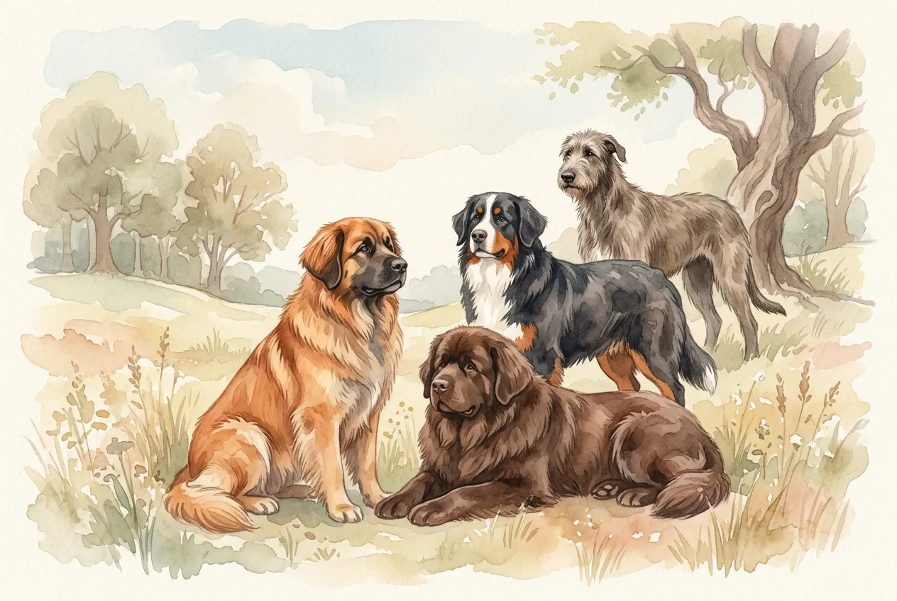
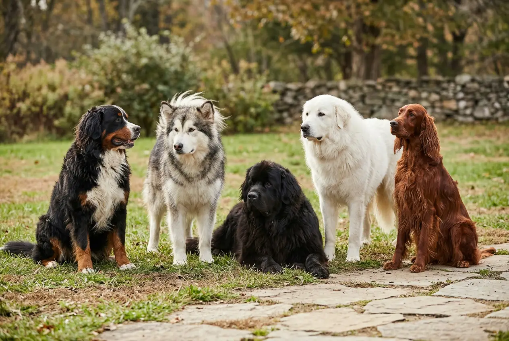
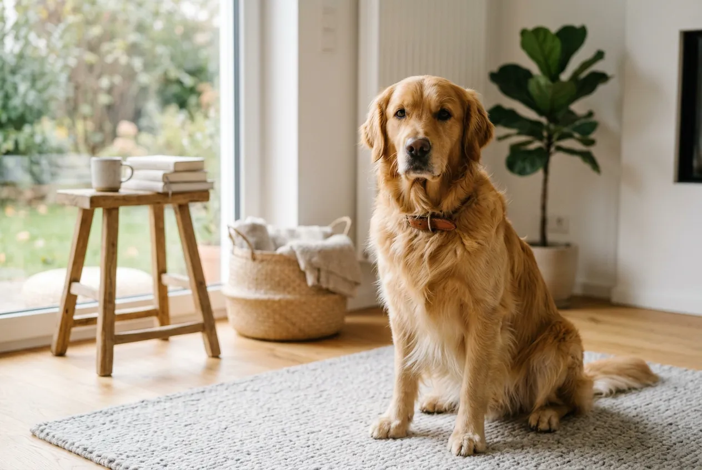
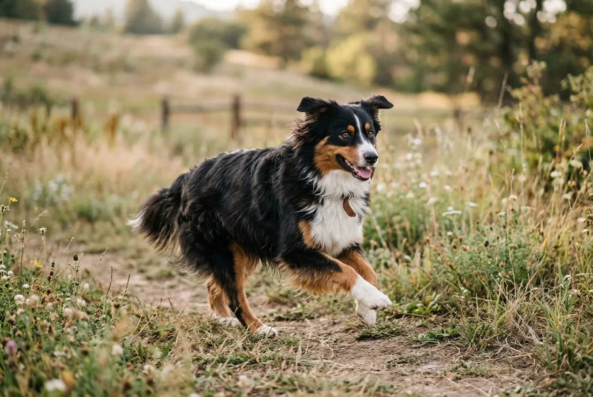
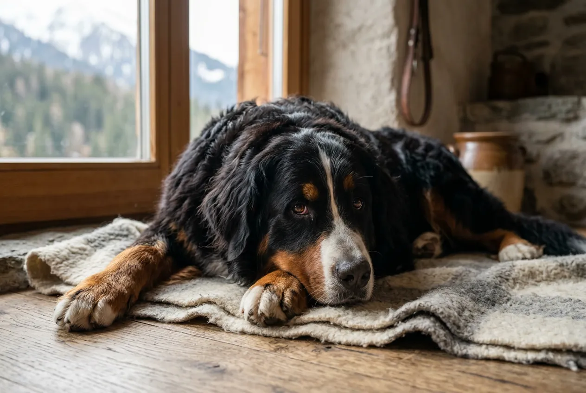

Große Hunderassen mit langem Fell vereinen imposante Erscheinung mit majestätischer Eleganz. Ob der treue Golden Retriever, der sanfte Berner Sennenhund oder der elegante Afghanische Windhund -- diese Hunderassen beeindrucken durch ihre Größe und ihr wallendes Fell gleichermaßen. Große Langhaar-Hunde erreichen eine Schulterhöhe von mindestens 50 cm und bringen je nach Rasse zwischen 25 und 120 kg auf die Waage.

Dieser Ratgeber stellt dir die 12 beliebtesten großen Hunderassen mit Langhaar vor -- mit allen wichtigen Informationen zu Charakter, Fellpflege, Haltungsanforderungen und rassetypischen Besonderheiten. So findest du die perfekte Langhaar-Rasse für dein Zuhause.

Zusammenfassung: Große Hunderassen Langhaar

<ul>
<li><strong>12 beliebte Rassen</strong> -- Von Golden Retriever über Berner Sennenhund bis zum Afghanischen Windhund</li>
<li><strong>Schulterhöhe ab 50 cm</strong> -- Sehr große Langhaar-Rassen wie Leonberger oder Neufundländer erreichen bis zu 90 cm</li>
<li><strong>Fellpflege 3–4× pro Woche</strong> -- Während des Fellwechsels ist tägliches Bürsten nötig</li>
<li><strong>Monatliche Kosten 150–300 €</strong> -- Futter, Pflege und Tierarzt für große Langhaar-Hunde</li>
<li><strong>Anfängerfreundliche Rassen</strong> -- Golden Retriever und Berner Sennenhund eignen sich besonders für Erstbesitzer</li>
</ul>

12

Beliebte Langhaar-Rassen

50–90 cm

Schulterhöhe

3–4×

Bürsten pro Woche

10–15 J.

Lebenserwartung

## Überblick: Alle großen Hunderassen mit Langhaar im Vergleich

Die folgende Tabelle zeigt alle 12 großen Langhaar-Hunderassen auf einen Blick. Die Angaben basieren auf den Rassestandards der FCI (Fédération Cynologique Internationale) und des VDH.

| Rasse | Schulterhöhe | Gewicht | Lebenserwartung | Anfängereignung |
|---|---|---|---|---|
| Golden Retriever | 51–61 cm | 25–34 kg | 10–12 Jahre | ★★★★★ |
| Australian Shepherd | 46–58 cm | 18–29 kg | 12–15 Jahre | ★★★☆☆ |
| Berner Sennenhund | 58–70 cm | 36–50 kg | 7–10 Jahre | ★★★★☆ |
| Afghanischer Windhund | 63–74 cm | 23–27 kg | 12–14 Jahre | ★★☆☆☆ |
| Neufundländer | 63–71 cm | 45–68 kg | 8–10 Jahre | ★★★★☆ |
| Leonberger | 65–80 cm | 41–75 kg | 8–9 Jahre | ★★★☆☆ |
| Collie (Langhaar) | 51–61 cm | 18–30 kg | 12–14 Jahre | ★★★★☆ |
| Chow Chow | 46–56 cm | 20–32 kg | 9–15 Jahre | ★★☆☆☆ |
| Bernhardiner | 65–90 cm | 54–120 kg | 8–10 Jahre | ★★★☆☆ |
| Großer Pyrenäenhund | 65–82 cm | 36–54 kg | 10–12 Jahre | ★★☆☆☆ |
| Flat-Coated Retriever | 56–61 cm | 25–36 kg | 10–12 Jahre | ★★★★☆ |
| Tibet Mastiff | 61–76 cm | 36–73 kg | 10–12 Jahre | ★☆☆☆☆ |

ℹ️

<strong>Hinweis zur Größeneinordnung</strong>

Die FCI definiert keine offizielle Grenze zwischen „mittelgroßen" und „großen" Hunderassen. In diesem Artikel gelten Rassen ab 50 cm Schulterhöhe als groß. Rassen ab 65 cm werden als sehr groß eingestuft.

## Golden Retriever -- der beliebteste Langhaar-Hund Deutschlands

Der Golden Retriever ist die beliebteste große Langhaar-Hunderasse in Deutschland. Laut VDH-Welpenstatistik gehört er seit Jahren zu den Top 5 der meistregistrierten Hunderassen. Seine Kombination aus freundlichem Wesen, Intelligenz und goldenem Langhaarfell macht ihn zum idealen Familienhund.

### Charakter und Wesen des Golden Retrievers

Golden Retriever gelten als besonders menschenbezogen und geduldig. Die Rasse wurde ursprünglich in Schottland als Apportierhund für die Jagd gezüchtet -- daher stammt ihre ausgeprägte Lernbereitschaft. Mit einem Gehorsam-Ranking unter den Top 4 der intelligentesten Hunderassen (nach Stanley Coren) lernen Golden Retriever neue Kommandos oft nach nur 5 Wiederholungen.

Für Familien mit Kindern ist der Golden Retriever eine hervorragende Wahl. Er zeigt eine hohe Reizschwelle und reagiert gelassen auf Alltagsstress. Auch als [Anfängerhund](https://hundewissen-mit-kopf.de/hunderassen/hunderasse-fuer-anfaenger/) eignet er sich dank seiner Kooperationsbereitschaft besonders gut.

### Fell und Pflegeaufwand

Das Fell des Golden Retrievers ist mittellang bis lang, wellig und wasserabweisend. Die dichte Unterwolle schützt vor Kälte und Nässe. Golden Retriever haaren ganzjährig moderat -- während des Fellwechsels im Frühjahr und Herbst deutlich stärker.

| Pflegeaspekt | Empfehlung |
|---|---|
| Bürsten | 3× pro Woche, im Fellwechsel täglich |
| Baden | Alle 2–3 Monate oder bei Bedarf |
| Ohren kontrollieren | Wöchentlich (Schlappohren = Infektionsrisiko) |
| Professionelle Pflege | Nicht zwingend nötig |

## Australian Shepherd -- der sportliche Langhaar-Hund

Der Australian Shepherd ist eine der aktivsten großen Langhaar-Hunderassen. Trotz seines Namens wurde er in den USA als Hütehund gezüchtet. Mit seiner Schulterhöhe von 46 bis 58 cm liegt er an der Grenze zwischen mittelgroß und groß -- viele Rüden erreichen jedoch deutlich über 50 cm.

### Besondere Merkmale des Australian Shepherds

Australian Shepherds fallen durch ihre vielfältige Fellfärbung auf. Die vier anerkannten Grundfarben sind Black, Red, Blue Merle und Red Merle. Ihr halblanges, leicht gewelltes Fell besitzt eine wetterfeste Unterwolle.

Die Rasse benötigt 2 bis 3 Stunden Bewegung und geistige Auslastung täglich. Ohne ausreichende Beschäftigung entwickeln Australian Shepherds häufig Verhaltensprobleme wie [übermäßiges Bellen](https://hundewissen-mit-kopf.de/erziehung-verhalten/hund-bellt-staendig/) oder destruktives Verhalten. Hundesportarten wie Agility, Obedience oder Trickdog sind ideal für diese Rasse.

⚠️

<strong>Merle-Faktor beachten</strong>

Zwei Merle-farbene Australian Shepherds dürfen laut Tierschutzgesetz in Deutschland nicht miteinander verpaart werden. Die sogenannte Merle×Merle-Verpaarung kann zu schweren Seh- und Hörschäden bei den Welpen führen.

## Berner Sennenhund -- der sanfte Riese aus der Schweiz

Der Berner Sennenhund gehört zu den bekanntesten großen Hunderassen mit langem Fell. Sein dreifarbiges Fell in Schwarz, Weiß und Rostbraun ist sein Markenzeichen. Mit einer Schulterhöhe von 58 bis 70 cm und einem Gewicht von 36 bis 50 kg zählt er zu den kräftigen Langhaar-Rassen.

### Charakter und Familientauglichkeit

Berner Sennenhunde sind für ihre Gutmütigkeit und Gelassenheit bekannt. Laut VDH-Rassebeschreibung gelten sie als „selbstsicher, aufmerksam und furchtlos im Alltag". Gleichzeitig zeigen sie eine hohe Sensibilität gegenüber ihren Bezugspersonen.

Die Rasse eignet sich hervorragend als Familienhund. Berner Sennenhunde sind geduldig mit Kindern und vertragen sich in der Regel gut mit anderen Haustieren. Ihr Bewegungsbedarf ist mit 1,5 bis 2 Stunden täglich moderat für einen großen Hund.

### Gesundheitliche Besonderheiten

Die Lebenserwartung des Berner Sennenhunds liegt mit 7 bis 10 Jahren leider unter dem Durchschnitt großer Hunderassen. Laut einer Studie der Tierärztlichen Hochschule Hannover sind Berner Sennenhunde überdurchschnittlich anfällig für Histiozytose (eine Tumorerkrankung) und Hüftgelenksdysplasie (HD).

| Häufige Erkrankungen | Häufigkeit | Vorsorge |
|---|---|---|
| Hüftgelenksdysplasie (HD) | ca. 20–30% | HD-Röntgen der Elterntiere |
| Histiozytose | ca. 15–25% | Regelmäßige Vorsorgeuntersuchungen |
| Ellbogendysplasie (ED) | ca. 10–15% | ED-Röntgen der Elterntiere |
| Kreuzbandriss | erhöht | Gewichtskontrolle |

## Afghanischer Windhund -- die eleganteste Langhaar-Rasse

Der Afghanische Windhund gilt als eine der ältesten Hunderassen der Welt. Archäologische Funde deuten darauf hin, dass seine Vorfahren bereits vor über 4.000 Jahren in den Bergregionen Afghanistans lebten. Sein langes, seidiges Fell und seine schlanke Statur machen ihn zur wohl elegantesten großen Langhaar-Hunderasse.

### Fell und Erscheinung

Das Fell des Afghanischen Windhunds ist extrem lang, fein und seidig. Anders als bei den meisten Langhaar-Rassen besitzt er kaum Unterwolle. Dadurch haart er weniger als vergleichbare große Hunderassen -- benötigt aber intensive Pflege, um Verfilzungen zu vermeiden.

Afghanische Windhunde erreichen eine Schulterhöhe von 63 bis 74 cm bei nur 23 bis 27 kg Körpergewicht. Ihr Fell kommt in nahezu allen Farben vor, darunter Schwarz, Creme, Rot und gestromt.

### Haltung und Erziehung

Afghanische Windhunde gelten als eigenständig und unabhängig. Die Erziehung erfordert viel Geduld und Hundeerfahrung. Im Gegensatz zum Golden Retriever zeigt der Afghane wenig „Will to Please" -- er entscheidet oft selbst, ob er einem Kommando folgen möchte. Ein sicher eingezäunter Garten ist für diese Rasse empfehlenswert, da Afghanische Windhunde einen starken Jagdtrieb besitzen und Geschwindigkeiten von bis zu 60 km/h erreichen.

## Neufundländer -- der sanfte Wasserriese

Der Neufundländer ist eine der größten Langhaar-Hunderassen und wurde ursprünglich als Arbeitshund für Fischer auf der kanadischen Insel Neufundland gezüchtet. Mit bis zu 71 cm Schulterhöhe und einem Gewicht von 45 bis 68 kg gehört er zu den sehr großen Hunderassen mit langem Fell.

Neufundländer besitzen ein dichtes, wasserabweisendes Doppelfell und Schwimmhäute zwischen den Zehen. Diese Eigenschaften machen sie zu hervorragenden Schwimmern -- sie werden bis heute als Wasserrettungshunde eingesetzt. Die Rasse kommt in Schwarz, Braun und Weiß-Schwarz (Landseer-Zeichnung) vor.

💡

<strong>Fellpflege-Tipp für Neufundländer</strong>

Verwende beim Bürsten eines Neufundländers einen grobzinkigen Kamm für die Unterwolle und eine Slicker-Bürste für das Deckhaar. Plane pro Bürsteinheit mindestens 20–30 Minuten ein. Mehr Tipps findest du im <a href="https://hundewissen-mit-kopf.de/hundepflege/fellpflege-hund/">Fellpflege-Ratgeber</a>.

Trotz ihrer imposanten Größe sind Neufundländer außerordentlich sanftmütig. Die Rasse wird häufig als „sanfter Riese" bezeichnet und eignet sich gut für Familien mit Kindern. Ihr Bewegungsbedarf ist mit 1 bis 1,5 Stunden täglich vergleichsweise gering für einen großen Hund -- Schwimmen ist die bevorzugte Aktivität.

## Leonberger -- der löwenähnliche Familienhund

Der Leonberger zählt mit bis zu 80 cm Schulterhöhe und einem Gewicht von 41 bis 75 kg zu den sehr großen Langhaar-Hunderassen. Die Rasse wurde Mitte des 19. Jahrhunderts in der Stadt Leonberg bei Stuttgart gezüchtet -- angeblich als „Löwenhund" für die Stadtwappen-Darstellung.

### Fell und Erscheinung des Leonbergers

Leonberger besitzen ein mittellanges bis langes, anliegendes Fell mit dichter Unterwolle. Typisch ist die löwenartige Mähne an Brust und Hals, die besonders bei Rüden ausgeprägt ist. Die Fellfarben reichen von Löwengelb über Rot bis Rotbraun, immer mit schwarzer Maske.

Der Pflegeaufwand ist hoch: Leonberger sollten mindestens 3- bis 4-mal pro Woche gründlich gebürstet werden. Während des Fellwechsels fallen große Mengen Unterwolle an -- [tägliches Bürsten](https://hundewissen-mit-kopf.de/hundepflege/fellpflege-hund/) ist dann unerlässlich.

### Wesen und Haltung

Leonberger gelten laut FCI-Standard als „selbstbewusst, dabei gelassen und temperamentvoll". Sie sind familienfreundlich, wachsam und vertragen sich gut mit Kindern. Der Bewegungsbedarf liegt bei 1,5 bis 2 Stunden täglich. Aufgrund ihrer Größe benötigen Leonberger ein Haus mit Garten -- eine Wohnungshaltung ist nicht artgerecht.

## Collie (Langhaar) -- der intelligente Filmhund

Der Langhaar-Collie wurde durch die Fernsehserie „Lassie" weltberühmt. Mit einer Schulterhöhe von 51 bis 61 cm und einem Gewicht von 18 bis 30 kg ist er die schlankeste große Langhaar-Hunderasse in dieser Übersicht. Sein üppiges Fell mit der charakteristischen Halskrause macht ihn unverwechselbar.

Collies gehören zu den intelligentesten Hunderassen und lernen schnell. Sie eignen sich hervorragend für Hundesport und als Familienhunde. Die Rasse zeigt eine hohe Sensibilität -- ein ruhiger, konsequenter Erziehungsstil ist wichtig. Grundlegende [Kommandos](https://hundewissen-mit-kopf.de/erziehung-verhalten/kommandos-hund/) lernt der Collie in der Regel sehr schnell.

🦁

Leonberger

Bis 80 cm, löwenartige Mähne, sanftmütig und familientauglich

🐻

Neufundländer

Bis 71 cm, Wasserrettungshund, dichtes wasserabweisendes Fell

🏔️

Bernhardiner

Bis 90 cm, der größte Langhaar-Hund, legendärer Rettungshund

🐑

Gr. Pyrenäenhund

Bis 82 cm, weißes Fell, eigenständiger Herdenschutzhund

## Weitere große Langhaar-Hunderassen im Porträt

### Chow Chow -- der würdevolle Löwenhund

Der Chow Chow stammt aus China und fällt durch sein extrem dichtes, plüschiges Fell und seine blaue Zunge auf. Mit 46 bis 56 cm Schulterhöhe liegt er an der unteren Grenze großer Hunderassen -- sein voluminöses Fell lässt ihn jedoch deutlich größer wirken. Chow Chows gelten als eigensinnig und katzenartig unabhängig. Die Rasse erfordert erfahrene Halter, die mit einem selbstständig denkenden Hund umgehen können.

### Bernhardiner -- der legendäre Rettungshund

Der Bernhardiner ist mit bis zu 90 cm Schulterhöhe und einem Gewicht von 54 bis 120 kg die größte Langhaar-Hunderasse. Ursprünglich im Hospiz auf dem Großen St. Bernhard-Pass in der Schweiz gezüchtet, rettete der berühmte Bernhardiner „Barry" Anfang des 19. Jahrhunderts über 40 Menschen aus Schneelawinen. Trotz seiner enormen Größe ist der Bernhardiner sanft und geduldig.

### Großer Pyrenäenhund -- der weiße Herdenschützer

Der Große Pyrenäenhund erreicht eine Schulterhöhe von 65 bis 82 cm und besitzt ein langes, dichtes, überwiegend weißes Fell. Als Herdenschutzhund ist er eigenständig und territorial. Er benötigt viel Platz und ist für die Stadthaltung nicht geeignet. Sein Fell erfordert wöchentlich 2 bis 3 ausgiebige Bürsteinheiten.

### Flat-Coated Retriever -- der fröhliche Schwarze

Der Flat-Coated Retriever ist der weniger bekannte Verwandte des Golden Retrievers. Sein glattes, mittellanges Fell kommt in Schwarz oder Leberbraun vor. Mit seiner fröhlichen, verspielten Art gilt er als „Peter Pan unter den Hunden" -- er behält sein welpenartiges Temperament bis ins hohe Alter. Große Langhaar-Hunderassen in Schwarz sind bei Hundefreunden besonders beliebt, und der Flat-Coated Retriever ist hier eine hervorragende Wahl.

### Tibet Mastiff -- der imposante Wächter

Der Tibet Mastiff (auch Do Khyi genannt) ist eine der urtümlichsten großen Langhaar-Hunderassen. Mit bis zu 76 cm Schulterhöhe und einem Gewicht von 36 bis 73 kg besitzt er ein extrem dichtes, wetterbeständiges Fell mit ausgeprägter Mähne. Die Rasse ist territorial, wachsam und sehr eigenständig -- sie eignet sich ausschließlich für erfahrene Hundehalter mit viel Platz.

## Fellpflege bei großen Langhaar-Hunden: So geht es richtig

Die richtige [Fellpflege](https://hundewissen-mit-kopf.de/hundepflege/fellpflege-hund/) ist bei großen Langhaar-Hunderassen besonders wichtig. Ohne regelmäßiges Bürsten verfilzt das Fell, was zu Hautproblemen, Ekzemen und Parasitenbefall führen kann. Der Pflegeaufwand variiert je nach Felltyp erheblich.

### Felltypen und passende Pflegeutensilien

Große Langhaar-Hunde haben unterschiedliche Fellstrukturen, die verschiedene Pflegeansätze erfordern:

| Felltyp | Beispielrassen | Empfohlene Bürste | Bürstfrequenz |
|---|---|---|---|
| Seidig, ohne Unterwolle | Afghanischer Windhund | Metallkamm + Slicker-Bürste | Täglich |
| Dicht mit Unterwolle | Golden Retriever, Collie | Unterwoollkamm + Zupfbürste | 3–4× pro Woche |
| Extrem dicht, plüschig | Chow Chow, Neufundländer | Grobzinkiger Kamm + Slicker-Bürste | 3–4× pro Woche |
| Glatt, mittellang | Flat-Coated Retriever | Naturhaarbürste + Metallkamm | 2–3× pro Woche |

1

Grobentknotung

Mit den Fingern oder einem grobzinkigen Kamm vorsichtig Knoten lösen

2

Unterwolle bearbeiten

Mit Unterwollkamm oder Furminator lose Unterwolle entfernen

3

Deckhaar bürsten

Mit Slicker-Bürste in Wuchsrichtung das Deckhaar glätten

✓

Problemzonen prüfen

Hinter den Ohren, an den Achseln und an der Hose auf Verfilzungen kontrollieren

### Fellwechsel bei großen Langhaar-Hunden

Große Langhaar-Hunderassen durchlaufen zweimal jährlich einen intensiven Fellwechsel -- im Frühjahr und im Herbst. Während dieser 4 bis 8 Wochen verlieren sie große Mengen Unterwolle. Tägliches Bürsten ist in dieser Phase unverzichtbar. Wenn dein Hund [außerhalb des Fellwechsels übermäßig viel Fell verliert](https://hundewissen-mit-kopf.de/hundegesundheit/hund-verliert-viel-fell-fellwechsel-krankheit/), kann das auf eine Erkrankung hindeuten.

⚠️

<strong>Langhaar-Hunde niemals scheren</strong>

Das Doppelfell großer Langhaar-Rassen darf nicht geschoren werden. Die Unterwolle schützt vor Hitze und Kälte gleichermaßen. Geschorenes Fell wächst oft nicht mehr korrekt nach und verliert seine isolierende Funktion.

## Haltung großer Langhaar-Hunde: Anforderungen und Tipps

Große Hunderassen mit langem Fell stellen besondere Anforderungen an Wohnraum, Bewegung und Budget. Eine verantwortungsvolle Haltung beginnt mit der ehrlichen Einschätzung der eigenen Möglichkeiten.

### Platz und Wohnraum

Große Langhaar-Hunderassen benötigen deutlich mehr Platz als kleine Hunderassen. Als Faustregel gilt: Je größer der Hund, desto größer sollte die Wohnfläche sein. Für Rassen wie Leonberger, Bernhardiner oder Neufundländer ist ein Haus mit eingezäuntem Garten nahezu unverzichtbar.

Vorteile großer Langhaar-Hunde

<ul>
<li>Imposante, majestätische Erscheinung</li>
<li>Oft ruhiger und gelassener als kleine Rassen</li>
<li>Viele Rassen sind hervorragende Familienhunde</li>
<li>Kuschelpartner mit weichem, warmem Fell</li>
<li>Guter Wach- und Schutzinstinkt</li>
</ul>

Nachteile großer Langhaar-Hunde

<ul>
<li>Hoher Fellpflege-Aufwand (15–30 Min. pro Bürsteinheit)</li>
<li>Starker Haarausfall, besonders im Fellwechsel</li>
<li>Höhere Futter- und Tierarztkosten</li>
<li>Geringere Lebenserwartung als kleine Rassen</li>
<li>Viel Wohnraum und Garten nötig</li>
</ul>

### Monatliche Kosten im Überblick

Die Haltung großer Langhaar-Hunde ist teurer als bei kleinen oder mittelgroßen Rassen. Der Hauptkostentreiber ist das Futter -- ein 40 kg schwerer Hund benötigt etwa 400 bis 600 g Trockenfutter pro Tag.

| Kostenposition | Monatlich | Jährlich |
|---|---|---|
| Futter (hochwertig) | 80–150 € | 960–1.800 € |
| Haftpflichtversicherung | 5–15 € | 60–180 € |
| Krankenversicherung | 30–80 € | 360–960 € |
| Pflegeprodukte | 10–20 € | 120–240 € |
| Tierarzt-Rücklage | 30–50 € | 360–600 € |
| **Gesamt** | **155–315 €** | **1.860–3.780 €** |

## Große Langhaar-Hunde nach Fellfarbe

Viele Hundefreunde suchen gezielt nach großen Langhaar-Hunderassen in einer bestimmten Farbe. Die folgende Übersicht hilft bei der Orientierung.

### Große Langhaar-Hunde in Schwarz

Schwarze Langhaar-Hunde wirken besonders elegant und imposant. Der Neufundländer in Schwarz ist die bekannteste Variante. Weitere Optionen sind der Flat-Coated Retriever, der Gordon Setter und der Tibet Mastiff in Schwarz. Auch Berner Sennenhunde tragen überwiegend schwarzes Fell -- ergänzt durch weiße und rostbraune Abzeichen.

### Große Langhaar-Hunde in Braun

Große Langhaar-Hunderassen in Braun umfassen den Golden Retriever (von Hellgold bis Dunkelgold), den Leonberger (Rotbraun), den Neufundländer in Braun und den Irish Setter mit seinem kastanienroten Fell. Der Flat-Coated Retriever kommt ebenfalls in Leberbraun vor.

### Große Langhaar-Hunde in Weiß

Weiße große Langhaar-Hunde sind selten, aber eindrucksvoll. Der Große Pyrenäenhund ist die bekannteste reinweiße große Langhaar-Rasse. Auch der Samojede (bis 57 cm) und der Kuvasz (bis 76 cm) tragen strahlend weißes Langfell.

📖

<strong>Wusstest du?</strong>

Die Fellfarbe beeinflusst bei einigen Hunderassen die Lebenserwartung. Eine Studie der University of Sydney (2018) zeigte, dass schokoladenbraune Labrador Retriever im Durchschnitt 1,4 Jahre kürzer leben als schwarze oder gelbe Artgenossen.

## Gesundheit großer Langhaar-Hunderassen

Große Hunderassen haben generell eine kürzere Lebenserwartung als kleine Rassen. Laut einer Studie der Universität Göttingen (2013) sinkt die Lebenserwartung pro 2 kg zusätzlichem Körpergewicht um etwa einen Monat. Langhaar-Rassen sind zudem anfälliger für bestimmte Haut- und Fellprobleme.

### Typische Gesundheitsprobleme

Die häufigsten Gesundheitsprobleme großer Langhaar-Hunde umfassen:

- **Hüftgelenksdysplasie (HD)** -- betrifft besonders Berner Sennenhunde, Golden Retriever und Neufundländer
- **Magendrehung** -- Risiko steigt mit der Körpergröße; betrifft vor allem Bernhardiner und Leonberger
- **Hotspots (akute feuchte Dermatitis)** -- häufig bei Rassen mit dichter Unterwolle in warmen Monaten
- **Ohrinfektionen** -- erhöhtes Risiko bei Rassen mit Schlappohren und langem Fell (Golden Retriever, Collie)
- **Gelenkprobleme** -- Arthrose und Kreuzbandrisse treten bei schweren Rassen häufiger auf

🚫

<strong>Notfall: Magendrehung erkennen</strong>

Symptome einer Magendrehung sind aufgeblähter Bauch, Unruhe, erfolgloser Brechreiz und Speicheln. Eine Magendrehung ist ein absoluter Notfall -- der Hund muss innerhalb von 1–2 Stunden operiert werden. Sofort den Tierarzt aufsuchen!

### Vorsorge und Gesundheitscheck

Tierärzte empfehlen für große Hunderassen ab dem 5. Lebensjahr einen jährlichen Gesundheitscheck. Dieser sollte Blutbild, Gelenkbeurteilung und Zahnkontrolle umfassen. Bei Rassen mit bekannter HD-Neigung ist eine Röntgenuntersuchung der Hüftgelenke im Alter von 12 bis 18 Monaten sinnvoll.

## Erziehung großer Langhaar-Hunde

Große Hunderassen mit langem Fell müssen von Anfang an konsequent erzogen werden. Ein 50 kg schwerer Hund, der an der Leine zieht, ist kaum zu halten. [Leinenführigkeit](https://hundewissen-mit-kopf.de/erziehung-verhalten/leinenfuehrigkeit-trainieren/) sollte daher bereits im Welpenalter trainiert werden.

### Erziehungstipps nach Rassetyp

Die Erziehung unterscheidet sich je nach Rassecharakter erheblich:

- **Kooperative Rassen** (Golden Retriever, Collie, Flat-Coated Retriever): Lernen schnell mit positiver Verstärkung, reagieren sensibel auf harte Korrekturen
- **Eigenständige Rassen** (Afghanischer Windhund, Chow Chow, Tibet Mastiff): Brauchen geduldige, aber konsequente Führung ohne Drill
- **Arbeitshunde** (Australian Shepherd, Leonberger): Benötigen neben Grundgehorsam auch geistige Aufgaben und klare Strukturen

✅

<strong>Sozialisierung ist entscheidend</strong>

Große Langhaar-Hunde sollten zwischen der 4. und 16. Lebenswoche möglichst viele positive Erfahrungen mit Menschen, anderen Hunden und Umweltreizen sammeln. Eine gute Sozialisierung in dieser Phase prägt das Verhalten ein Leben lang.

## Welche große Langhaar-Rasse passt zu mir?

Die Wahl der richtigen großen Langhaar-Hunderasse hängt von deinem Lebensstil, deiner Wohnsituation und deiner Hundeerfahrung ab. Die folgende Checkliste hilft dir bei der Entscheidung.

✅ Checkliste: Bin ich bereit für einen großen Langhaar-Hund?

✓

Wohnfläche mit Garten oder großer Wohnung vorhanden

✓

Täglich 1,5–3 Stunden Zeit für Auslauf und Beschäftigung

✓

15–30 Minuten Fellpflege mehrmals pro Woche eingeplant

✓

Monatliches Budget von 150–300 € für Futter und Pflege

Toleranz für Hundehaare auf Kleidung, Möbeln und im Auto

Auto groß genug für den Transport (Kombi oder SUV empfohlen)

### Empfehlung nach Lebensstil

| Lebensstil | Empfohlene Rasse | Begründung |
|---|---|---|
| Familie mit Kindern | Golden Retriever, Berner Sennenhund | Geduldig, sanft, anfängerfreundlich |
| Aktive Sportler | Australian Shepherd, Collie | Hoher Bewegungsdrang, sportlich |
| Ruhiges Landleben | Neufundländer, Bernhardiner | Gemütlich, brauchen Platz, wenig Hektik |
| Erfahrene Hundehalter | Afghanischer Windhund, Tibet Mastiff | Eigenständig, anspruchsvoll in der Erziehung |
| Hundeerfahrene Familie | Leonberger, Großer Pyrenäenhund | Wachsam, familientauglich, brauchen Führung |

Wenn du noch unsicher bist, welche Hunderasse zu dir passt, wirf auch einen Blick auf unseren Ratgeber zu [Hunderassen für Anfänger](https://hundewissen-mit-kopf.de/hunderassen/hunderasse-fuer-anfaenger/) oder die Übersicht der [kleinen Hunderassen](https://hundewissen-mit-kopf.de/hunderassen/kleine-hunderassen/) als Alternative.

## Fazit: Große Hunderassen mit Langhaar sind treue Begleiter mit Pflegeanspruch

Große Hunderassen mit langem Fell begeistern durch ihre majestätische Erscheinung und ihr liebevolles Wesen. Ob der familienfreundliche Golden Retriever, der sanfte Berner Sennenhund oder der elegante Afghanische Windhund -- jede große Langhaar-Hunderasse hat ihren eigenen Charme und ihre besonderen Stärken.

Die wichtigste Voraussetzung für ein glückliches Zusammenleben ist die Bereitschaft zur regelmäßigen Fellpflege. Mit 3 bis 4 Bürsteinheiten pro Woche, ausreichend Bewegung und einem Budget von 150 bis 300 Euro monatlich bist du gut aufgestellt. Informiere dich vor der Anschaffung gründlich über die rassespezifischen Gesundheitsrisiken und wähle einen seriösen Züchter, der auf Gesundheitsuntersuchungen der Elterntiere achtet.

Große Langhaar-Hunde belohnen ihre Halter mit bedingungsloser Treue, imposanter Schönheit und unvergesslichen gemeinsamen Momenten -- das regelmäßige Bürsten wird dabei schnell zur liebgewonnenen Routine.