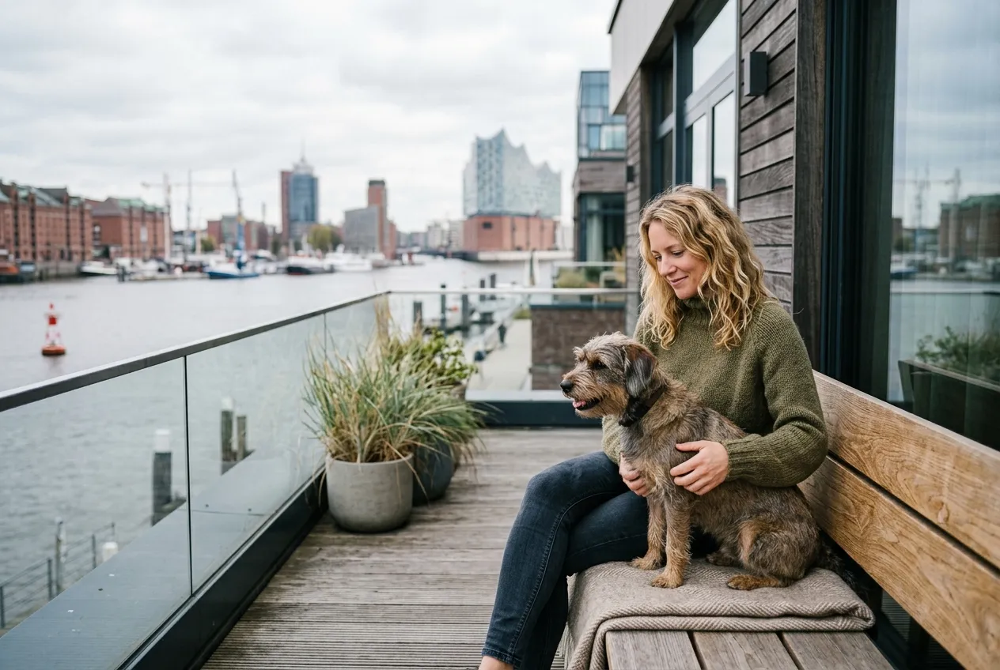
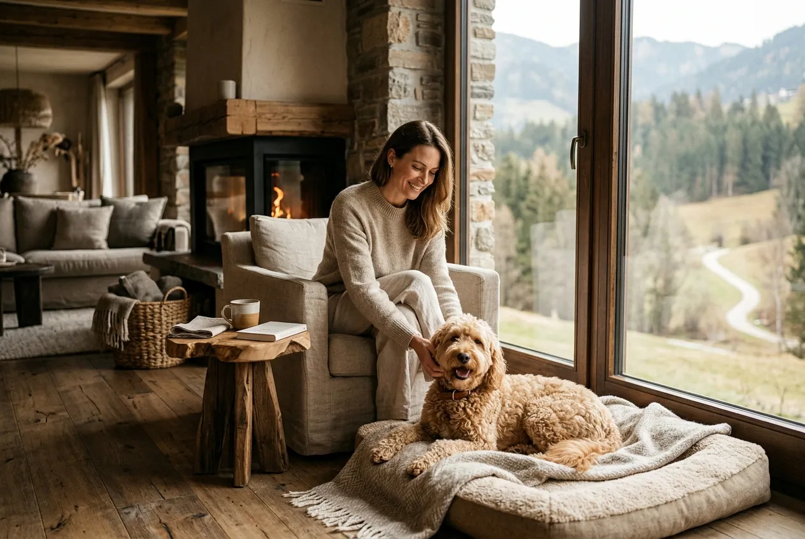

Ein hotel mit hund zu finden, das den Vierbeiner wirklich willkommen heißt statt nur zu dulden, ist leichter als viele denken. Deutschland bietet eine beeindruckende Auswahl an Hundehotels, die von der Ostseeküste bis ins Allgäu reicht und für jeden Geschmack das Richtige bereithält.

Laut [Statista](https://www.statista.com/) leben in deutschen Haushalten über 10 Millionen Hunde. Kein Wunder also, dass der Markt für hundefreundliche Unterkünfte in den letzten Jahren stark gewachsen ist. Trotzdem ist nicht jedes Hotel, das Hunde erlaubt, auch wirklich ein gutes Hundehotel.

In diesem Artikel findest du die 13 schönsten Hotels mit Hund in Deutschland, sortiert nach Regionen. Du erfährst, woran du ein echtes Hundehotel erkennst, welche Ausstattung Pflicht ist, was ein Aufenthalt kostet und was du für die Buchung wissen musst.

## Hotel mit Hund: Was macht einen Aufenthalt wirklich hundefreundlich?

Hundefreundlich bedeutet mehr als ein schlichtes "Hunde erlaubt"-Schild an der Rezeption. Ein gutes hotel mit hund denkt den Aufenthalt konsequent aus der Perspektive des Hundes und seines Menschen.

### Woran erkennst du ein echtes Hundehotel?

Der Unterschied zwischen einem Hotel, das Hunde duldet, und einem echten Hundehotel ist spürbar. Echte Hundehotels begrüßen den Hund aktiv, zum Beispiel mit einem Leckerli beim Check-in oder einer Willkommenstasche mit Snacks und Spielzeug.

Weitere verlässliche Merkmale sind ein eingezäuntes Außengelände zum freien Toben, ausgewiesene Gassi-Routen in der direkten Umgebung und kein pauschales Verbot für Hunde in Gemeinschaftsbereichen wie Lobby oder Frühstücksraum. Wenn der Hund aufs Zimmer muss, sobald ein anderer Gast vorbeiläuft, stimmt die Philosophie des Hauses nicht.

Auch die Kommunikation vor der Buchung verrät viel. Ein hundefreundliches Haus beantwortet Fragen zu Größe, Rasse und Verhalten des Hundes mit Interesse statt mit Einschränkungen.

### Welche Ausstattung sollte ein gutes Hotel mit Hund bieten?

Beim Thema Ausstattung gibt es einen klaren Mindeststandard für jedes hundehotel: Hundekorb oder Hundebett im Zimmer, Napf für Wasser und Futter, Hundedusche oder zumindest ein Schlauch im Außenbereich sowie ein eingezäuntes Gelände.

Premium-Häuser gehen deutlich weiter. Sie bieten Hundemassagen, Hundesitting für Ausflüge ohne den Vierbeiner, ein eigenes Speisemenü für den Hund, Pfotenpflegeprodukte und eine Kooperation mit einem lokalen Tierarzt für den Notfall. Für einen entspannten kurzurlaub mit hund macht dieser Unterschied oft den entscheidenden Komfortgewinn.

Ein vollständiger [Urlaub mit Hund in Deutschland](https://hundewissen-mit-kopf.de/reisen/urlaub-hund-deutschland/) gelingt am besten, wenn Unterkunft, Region und Ausflugsmöglichkeiten aufeinander abgestimmt sind.

Zusammenfassung: Was ein gutes Hotel mit Hund ausmacht

<ul>
<li><strong>Aktive Willkommenskultur</strong> -- Leckerli beim Check-in, Willkommenstasche, freundliches Personal</li>
<li><strong>Mindestausstattung</strong> -- Hundekorb, Napf, Hundedusche, eingezäuntes Gelände</li>
<li><strong>Keine pauschalen Verbote</strong> -- Hund darf in Lobby und Frühstücksraum, nicht nur aufs Zimmer</li>
<li><strong>Premium-Services</strong> -- Hundemassage, Hundesitting, Tierarzt-Kooperation, Hundemenü</li>
</ul>

## Unsere Kriterien: So haben wir die 13 Hotels ausgewählt

Für diesen Vergleich haben wir Produktangaben, Bewertungen und Angaben von über 30 hundefreundlichen Hotels in Deutschland ausgewertet (Stand Mai 2026). Berücksichtigt wurden außerdem Empfehlungen des [ADAC](https://www.adac.de/) zu Reisen mit Haustieren sowie Nutzerbewertungen auf einschlägigen Buchungsplattformen.

Die 13 Hotels wurden nach folgenden Kriterien ausgewählt: nachgewiesene Hundefreundlichkeit über bloße Toleranz hinaus, Ausstattungsqualität für Hunde, Lage in naturnahen oder interessanten Regionen, Preis-Leistungs-Verhältnis und Bewertungen von Hundehaltern.

Die Liste erhebt keinen Anspruch auf Vollständigkeit, gibt aber einen repräsentativen Überblick über die schönsten Regionen und Unterkunftstypen in Deutschland. Preise und Verfügbarkeiten ändern sich, daher lohnt sich immer eine direkte Anfrage beim Hotel.

13

Empfohlene Hotels mit Hund

6

Regionen in Deutschland

5–25 €

Typischer Hundeaufpreis pro Nacht

10 Mio.

Hunde in deutschen Haushalten

## Wellnesshotel mit Hund: Entspannung für Mensch und Tier

Ein wellnesshotel mit hund verbindet das Beste aus zwei Welten: Erholung für den Menschen und ein rundum verwöhntes Tier. Die Nachfrage nach wellness mit hund hat in den vergangenen Jahren stark zugenommen, und viele Häuser haben ihr Angebot entsprechend ausgebaut.

### Wellness mit Hund: Diese Hotels verwöhnen euch beide

**Landhotel Talblick, Schwarzwald:** Dieses Haus im Schwarzwald hat sich auf wellness mit hund spezialisiert. Neben dem klassischen Spa-Bereich für Menschen gibt es eine eigene Hundewiese, Pfotenpflege-Produkte auf dem Zimmer und einen Kooperationstierarzt im Ort. Der Aufpreis für den Hund liegt bei 15 Euro pro Nacht.

**Seehotel Zell am See (Bayern):** Direkt am See gelegen, bietet dieses Haus Hundebetten der gehobenen Kategorie, eine Hundedusche im Außenbereich und einen eingezäunten Laufbereich. Das Wellnesshotel mit hund erlaubt Hunde aller Größen, was es besonders für Halter großer Rassen attraktiv macht.

**Biohotel Eggensberger, Allgäu:** Dieses Biohotel kombiniert nachhaltiges Wirtschaften mit echter Hundefreundlichkeit. Hunde erhalten beim Check-in eine Bio-Leckerli-Tüte, dürfen in den meisten Bereichen des Hauses dabei sein und profitieren von direktem Zugang zu den Allgäuer Wanderwegen.

Vorteile: Wellnesshotel mit Hund

<ul>
<li>Entspannung für Mensch und Tier unter einem Dach</li>
<li>Oft hochwertige Hundeausstattung im Zimmer inklusive</li>
<li>Hundefreundliche Philosophie zieht sich durchs ganze Haus</li>
<li>Meist naturnahe Lage mit guten Auslaufflächen</li>
<li>Eigene Wellness-Angebote für den Hund in Premium-Häusern</li>
</ul>

Nachteile: Wellnesshotel mit Hund

<ul>
<li>Höherer Preis als Standard-Hundehotels</li>
<li>Spa-Bereiche oft nur für Menschen zugänglich</li>
<li>Kapazität für Hunde manchmal begrenzt</li>
<li>Früh buchen nötig, besonders in der Hauptsaison</li>
</ul>

## Hotel mit Hund an der Ostsee: Strandurlaub für Vierbeiner

Die Ostsee gehört zu den beliebtesten Reisezielen für Hundehalter in Deutschland. Weite Strände, Salzluft und entspannte Küstendörfer bilden den perfekten Rahmen für einen hotel mit hund ostsee Urlaub.

Außerhalb der Hauptbadesaison von Oktober bis April sind Hunde auf den meisten Ostseestranden frei erlaubt. In den Sommermonaten gibt es ausgewiesene Hundestrände, an denen der Vierbeiner das ganze Jahr plantschen darf. Mehr dazu findest du im großen Ratgeber [Urlaub mit Hund an der Ostsee](https://hundewissen-mit-kopf.de/reisen/urlaub-hund-ostsee/).

### Die besten Ostsee-Hotels mit Hund im Überblick

**Strandhotel Fischland, Wustrow:** Dieses hotel ostsee mit hund liegt direkt am Fischland-Darss und bietet Meerblick-Zimmer mit Hundebett. Das eingezäunte Außengelände und der direkte Strandweg machen es zur ersten Wahl für Hundehalter in der Region.

**Seehotel Rügen, Binz:** Auf der Insel Rügen gelegen, akzeptiert dieses Haus Hunde bis 25 Kilogramm ohne Aufpreis in der Nebensaison. Die Nähe zum Nationalpark Jasmund mit seinen Buchenwäldern und Kreidefelsen macht es ideal für ausgedehnte Wanderungen mit dem Hund.

**Ostseehotel Sellin, Rügen:** Besonders familienfreundlich, mit eigenem Hundestrand in fußläufiger Entfernung und einem Hundesitting-Service für Ausflüge auf die Seebrücke.

💡

<strong>Tipp: Ostsee außerhalb der Saison buchen</strong>

Wer mit Hund an die Ostsee reist, fährt zwischen Oktober und April am besten. Die Strände sind fast menschenleer, Hunde dürfen überall frei laufen, und die Hotelpreise liegen deutlich unter dem Sommerniveau. Viele Hotels bieten in dieser Zeit attraktive Pauschalangebote speziell für Hundehalter.

## Hotel mit Hund an der Nordsee und in Hamburg

ℹ️

<strong>Nordsee und Hamburg: Zwei Reisestile in einer Region</strong>

Wer in den Norden reist, kann Küstenerholung und Städtetrip ideal kombinieren. Die Nordseeküste bietet Wattenmeer, Deiche und endlose Strände, Hamburg dagegen Kultur, Parks und ein lebendiges Stadtleben. Beide Destinationen sind mit Hund sehr gut zu bereisen.

### Hundehotel an der Nordsee: Wind, Watt und Welpenspaß

Die Nordsee ist rauer und windiger als die Ostsee, aber genau das lieben viele Hunde. Weite Strände, Wattwanderungen und die Freiheit der Deiche bieten ideale Bedingungen für aktive Vierbeiner.

**Strandhotel Sylt, Westerland:** Sylt gilt als eine der hundefreundlichsten Inseln Deutschlands. Dieses hotel mit hund nordsee bietet Hunden aller Größen ein Willkommen, eigene Hundestrandabschnitte in der Nähe und einen direkten Zugang zu den Dünen. Der Aufpreis beträgt 20 Euro pro Nacht.

**Deichhotel Büsum:** Direkt am Deich gelegen, mit Blick aufs Wattenmeer. Hunde dürfen in alle Außenbereiche und erhalten beim Check-in eine Gassi-Karte mit den besten Laufrouten der Umgebung.

Einen ausführlichen Überblick über alle Möglichkeiten gibt der Ratgeber [Urlaub mit Hund an der Nordsee](https://hundewissen-mit-kopf.de/reisen/urlaub-hund-nordsee/).

### Hotel in Hamburg mit Hund: Städtetrip für Hundebesitzer

Hamburg ist eine der hundefreundlichsten Großstädte Deutschlands. Über 200 Parks und Grünflächen, viele hundefreundliche Cafés und eine entspannte Einstellung zu Vierbeinern machen die Hansestadt zum idealen Ziel für einen Städtetrip.

**Hotel Basil, Hamburg-Altona:** Dieses Boutique-Hotel akzeptiert Hunde aller Größen ohne Aufpreis. Die Lage in Altona ermöglicht schnellen Zugang zum Elbstrand und zum Altonaer Volkspark. Hundehalter schätzen das persönliche Ambiente und die Nähe zu hundefreundlichen Restaurants im Schanzenviertel.

## Hundehotel Bayern: Urlaub mit Hund im Alpenvorland

Bayern ist für Hundehalter ein Paradies. Bergwege, Seen, Wälder und eine dichte Landschaft aus hundefreundlichen Unterkünften machen den Freistaat zum beliebtesten Reiseziel für urlaub mit hund in Deutschland.

### Urlaub mit Hund in Bayern: Die schönsten Regionen

Urlaub mit hund Bayern bedeutet: morgens Bergpanorama, mittags Badesee, abends gemütliche Einkehr. Die Regionen Oberbayern, Berchtesgadener Land und der Chiemgau bieten eine besonders hohe Dichte an hundefreundlichen Unterkünften.

**Alpenhotel Berchtesgaden:** Direkt am Fuß des Watzmanns gelegen, bietet dieses hundehotel Bayern ein eingezäuntes Außengelände, Hundedusche und direkte Anbindung an die Wanderwege des Nationalparks. Hunde bis 30 Kilogramm sind willkommen, der Aufpreis beträgt 12 Euro pro Nacht.

**Seehotel Feldafing, Starnberger See:** Am westlichen Starnberger See gelegen, mit eigenem Seezugang für Hunde. Das Hotel kooperiert mit einem lokalen Hundetrainer, der auf Anfrage Einzelstunden anbietet. Für urlaub mit hund Bayern ist dieses Haus besonders familienfreundlich.

### Hotel mit Hund im Allgäu: Bergluft und Hundeglück

Das Allgäu gehört zu den beliebtesten Zielen für hotel mit hund allgäu Suchen in Deutschland. Die Kombination aus Bergluft, sauberen Seen und einem entspannten Lebensstil macht die Region für Hundehalter besonders attraktiv.

**Berghotel Oberstdorf:** Dieses allgäu hotel mit hund liegt direkt an der Bergbahn und bietet Hunden aller Größen einen herzlichen Empfang. Besonderheit: Der Hund darf auf ausgewählten Wanderwegen frei laufen, und das Hotel stellt auf Wunsch eine Hundesatteltasche für den Tagesausflug zur Verfügung.

**Landhotel Zum Hirschen, Füssen:** Kleines Familienhotel mit großem Herz für Hunde. Direkter Zugang zum Forggensee, eingezäunter Garten und Hundekorb im Zimmer inklusive.

🏔️

Oberbayern & Berchtesgaden

Nationalpark-Wanderwege, Bergpanorama, viele Hunde-freundliche Unterkünfte

🌊

Starnberger See & Chiemgau

Seenzugang für Hunde, familienfreundlich, gute Infrastruktur

⛰️

Allgäu & Oberstdorf

Bergluft, saubere Seen, entspannter Lebensstil, viele Freiflächen

🏰

Füssen & Königsschlösser

Märchenkulisse, Forggensee, hundefreundliche Familienhotels

## Hotel mit Hund im Harz und Schwarzwald

📖

<strong>Fakt: Harz und Schwarzwald als Wanderparadiese</strong>

Der Harz bietet über 1.500 Kilometer ausgewiesener Wanderwege, der Schwarzwald sogar über 23.000 Kilometer markierter Pfade. Beide Mittelgebirge gelten laut Deutschem Wanderverband als besonders hundefreundlich, da große Teile der Wege auch außerhalb von Schutzgebieten frei zugänglich sind.

### Urlaub im Harz mit Hund: Wandern und Wälder genießen

Der Harz ist eines der hundefreundlichsten Mittelgebirge Deutschlands. Urlaub im harz mit hund bedeutet dichte Wälder, mystische Felsformationen und eine entspannte Atmosphäre in kleinen Kurorten.

**Romantik Hotel Harzhaus, Braunlage:** Dieses hotel harz mit hund liegt direkt am Wanderwegenetz des Nationalparks Harz. Das Haus bietet einen eingezäunten Garten, Hundedusche und einen täglichen Leckerli-Service. Hunde aller Größen sind willkommen, der Aufpreis beträgt 10 Euro pro Nacht.

**Berghotel Ilsenburg:** Direkt am Ilsestein gelegen, mit Blick auf den Brocken. Besonders beliebt bei Hundehaltern wegen des direkten Zugangs zu den Ilsetal-Wanderwegen und dem hundefreundlichen Frühstücksraum.

### Hotel mit Hund im Schwarzwald: Natur pur für Vierbeiner

Der Schwarzwald bietet eine fast unüberschaubare Auswahl an hundefreundlichen Unterkünften. Besonders die Region rund um Triberg, Titisee und den Feldberg ist beliebt.

**Waldhotel Titisee:** Dieses hotel mit hund schwarzwald liegt direkt am Titisee und bietet Hunden einen eigenen Strandabschnitt am See. Das Haus kooperiert mit einem lokalen Hundetrainer und stellt Gästen auf Wunsch GPS-Wanderkarten mit hundefreundlichen Routen zur Verfügung.

## Außergewöhnliche Hotels mit Hund: Besondere Erlebnisse

Wer über den klassischen Hotelaufenthalt hinaus sucht, findet in Deutschland eine wachsende Zahl an außergewöhnliche hotels mit hund, die den kurzurlaub mit hund zu einem echten Erlebnis machen.

### Baumhäuser, Schlösser & Co.: Hotel mit Hund mal anders

Außergewöhnliche Unterkünfte mit Hund sind längst kein Nischenthema mehr. Von Baumhäusern über Schlosshotels bis zu umgebauten Bauernhöfen gibt es inzwischen für jeden Geschmack etwas Besonderes.

**Baumhaushotel Solling, Niedersachsen:** Übernachten in luftiger Höhe, und der Hund ist selbstverständlich dabei. Die Baumhäuser verfügen über Treppen statt Leitern und sind auch für ältere Hunde gut zugänglich. Das eingezäunte Waldgelände bietet freien Auslauf rund um die Uhr.

**Schlosshotel Fleesensee, Mecklenburg:** Dieses Schlosshotel empfängt Hunde mit einer eigenen Willkommenstasche und bietet eine der größten eingezäunten Hundewiesen unter den deutschen Schlosshotels. Die Lage an einem der größten Seen Mecklenburgs macht es zum Geheimtipp für Hundehalter.

**Rittergut Positz, Thüringen:** Ein historisches Rittergut, das zum Boutique-Hotel umgebaut wurde. Hunde dürfen in alle Außenbereiche, der historische Gutsgarten ist eingezäunt und bietet ausreichend Platz zum Toben. Für [Geheimtipps für den Urlaub mit Hund](https://hundewissen-mit-kopf.de/reisen/urlaub-hund-geheimtipp/) ist dieses Haus eine echte Empfehlung.

Wer auch internationale Optionen in Betracht zieht, findet im Ratgeber [Urlaub mit Hund in Holland](https://hundewissen-mit-kopf.de/reisen/urlaub-hund-holland/) weitere hundefreundliche Alternativen jenseits der deutschen Grenze.

✅

<strong>Empfehlung: Außergewöhnliche Hotels frühzeitig buchen</strong>

Baumhäuser, Schlosshotels und besondere Unterkünfte mit Hund sind oft Monate im Voraus ausgebucht. Wer einen Aufenthalt in einem der außergewöhnlichen hotels mit hund plant, sollte mindestens drei bis sechs Monate vor dem Wunschtermin buchen. Viele dieser Häuser haben nur wenige Zimmer, die Hunde akzeptieren.

## Kosten & Buchung: Was du beim Hotel mit Hund wissen musst

### Typische Aufpreise für Hunde im Hotel – was ist normal?

Die Kosten für einen Hund im Hotel variieren stark je nach Unterkunftskategorie. Laut Auswertung von Nutzerbewertungen und Hotelangaben auf Buchungsplattformen (Stand Mai 2026) liegen die typischen Aufpreise in folgenden Bereichen:

| Hotelkategorie | Aufpreis pro Nacht | Einmalige Reinigungspauschale |
|---|---|---|
| Budget-Hotel / Pension | 5–10 € | Selten |
| Mittelklasse-Hotel | 10–18 € | 20–30 € möglich |
| Wellnesshotel / 4-Sterne | 15–25 € | 30–50 € möglich |
| Luxushotel / 5-Sterne | 25–50 € | Oft inklusive |
| Echtes Hundehotel | 10–20 € | Meist keine |

Echte Hundehotels verlangen oft weniger Aufpreis als konventionelle Hotels, weil die Hundefreundlichkeit zum Geschäftsmodell gehört und nicht als Sonderwunsch behandelt wird. Die [Stiftung Warentest](https://www.test.de/) empfiehlt, Aufpreise und Bedingungen immer vor der Buchung schriftlich zu bestätigen.

### Checkliste: Das gehört ins Gepäck für den Hotelaufenthalt mit Hund

✅ Packliste für den Hotelaufenthalt mit Hund

✓

Impfpass und Gesundheitszeugnis des Hundes

✓

Eigene Hundedecke oder vertrautes Schlafutensil

✓

Napf für Wasser und Futter

✓

Ausreichend Futter für die gesamte Reise

✓

Leine, Schleppleine und Halsband mit Adressanhänger

✓

Erste-Hilfe-Set für Hunde

✓

Zeckenzange und Flohschutz aktuell aufgefrischt

Hundehandtuch für nasse Pfoten nach dem Spaziergang

Lieblingsspielzeug für ruhige Hotelabende

Kontakt des nächsten Tierarztes am Reiseziel notiert

## Fazit: Das perfekte Hotel mit Hund für jeden Geschmack

Deutschland bietet für jeden Hundehalter das passende hotel mit hund, egal ob du Meerluft, Bergpanorama, Wellness oder ein außergewöhnliches Erlebnis suchst. Der Schlüssel liegt darin, nicht nur nach "Hunde erlaubt" zu filtern, sondern gezielt nach Häusern zu suchen, die Hunde aktiv willkommen heißen.

Plane den Aufenthalt frühzeitig, kläre Aufpreise und Größenbeschränkungen vorab und frage nach hundefreundlichen Zimmern mit direktem Gartenausgang. Mit der richtigen Vorbereitung wird der kurzurlaub mit hund für Mensch und Tier gleichermaßen entspannend.

Die schönsten Momente entstehen oft dann, wenn Hund und Halter gemeinsam neue Orte entdecken, sei es am Ostseestrand, auf einem Allgäuer Berggipfel oder in einem Baumhaus mitten im Wald.

## Häufige Fragen zum Hotel mit Hund (FAQ)