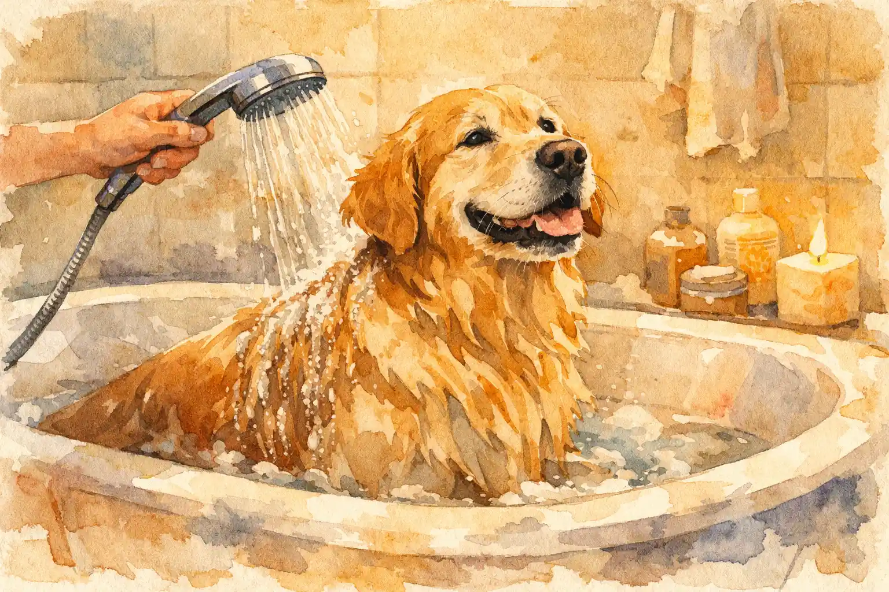

Hund baden gehört zur Fellpflege, ist aber deutlich seltener nötig als viele Hundehalter vermuten. Hunde verfügen über ein selbstreinigendes Fell mit einem natürlichen Schutzfilm aus Talg und Lipiden, der Schmutz abweist und die Haut vor Keimen schützt. Zu häufiges Baden zerstört diese Schutzschicht und kann zu trockener Haut, Juckreiz und Hauterkrankungen führen. Die Faustregel lautet daher: Hunde so selten wie möglich und so oft wie nötig waschen.

Doch wann ist ein Bad tatsächlich notwendig? Welches Shampoo eignet sich für Hunde? Und wie funktioniert das Hund baden stressfrei für Tier und Mensch? Dieser Ratgeber liefert tierärztlich fundierte Antworten zu Häufigkeit, Wassertemperatur, richtigen Pflegeprodukten und einer bewährten Schritt für Schritt Anleitung – von der Vorbereitung bis zum Trocknen.

✅ Zusammenfassung: Hund baden

<ul>
<li>Hunde maximal <strong>1x pro Monat</strong> baden – gesunde Hunde brauchen oft nur 4–6 Bäder pro Jahr</li>
<li><strong>Hundeshampoo</strong> statt Menschenshampoo: Der pH-Wert der Hundehaut (6,5–7,5) unterscheidet sich von menschlicher Haut (5,5)</li>
<li>Ideale <strong>Wassertemperatur: 28–30 °C</strong> (lauwarm) – heißes Wasser zerstört den Hautschutzfilm</li>
<li><strong>Welpen</strong> frühestens ab der 12. Lebenswoche baden – vorher nur mit feuchtem Tuch reinigen</li>
<li>Alternative zum Hunde waschen: Regelmäßiges <strong>Bürsten</strong> entfernt die meisten Verschmutzungen ohne die Haut zu belasten</li>
</ul>

28–30 °C

Ideale Wassertemperatur

6,5–7,5

pH-Wert Hundehaut

4–6×

Bäder pro Jahr

6 Wochen

Hautregeneration nach Shampoo-Bad

## Muss man Hunde baden? Was Tierärzte empfehlen

Hunde müssen in den meisten Fällen nicht regelmäßig gebadet werden. Das Hundefell besitzt einen mehrschichtigen Aufbau aus Unterwolle und Deckhaar sowie einen natürlichen Fettfilm, der als selbstreinigender Schutzschild funktioniert. Laut tierärztlicher Empfehlung reicht es bei gesunden Hunden völlig aus, das Fell regelmäßig zu bürsten und nur bei tatsächlicher Notwendigkeit zu einem Bad zu greifen.

Getrockneter Schmutz wie Erde oder Matsch fällt nach dem Trocknen in der Regel von selbst ab oder lässt sich problemlos ausbürsten. Ein feuchtes, warmes Tuch genügt oft, um verschmutzte Pfoten oder den Afterbereich zu reinigen, ohne den gesamten Hund waschen zu müssen.

### Wann ein Hund baden wirklich notwendig ist

Ein Bad ist dann sinnvoll, wenn sich der Hund in Aas, Kot oder stark riechendem Material gewälzt hat und Bürsten allein nicht ausreicht. Auch bei hartnäckigen Verfilzungen bei langhaarigen Rassen kann ein Bad helfen, das Fell anschließend besser durchkämmen zu können. Medizinische Gründe wie Hautpilz, Parasitenbefall oder Allergien können ebenfalls ein Baden mit speziellem Shampoo erfordern – hier sollte immer Rücksprache mit dem Tierarzt gehalten werden.

Während des Fellwechsels im Frühjahr und Herbst kann ein Bad den natürlichen Haarverlust beschleunigen und lose Unterwolle entfernen. Hunde, die im Bett ihrer Halter schlafen, werden aus hygienischen Gründen ebenfalls häufiger gebadet – wobei auch hier die Faustregel gilt: maximal 1x pro Monat mit Hundeshampoo.

## Wie oft Hund baden? Häufigkeit nach Felltyp

Die Badehäufigkeit hängt vom Felltyp, der Rasse und dem Lebensstil des Hundes ab. Tierärzte empfehlen als Richtwert für gesunde Hunde maximal 1 Bad pro Monat mit Shampoo. Häufigeres Hunde waschen kann die Haut austrocknen, da die Regeneration der natürlichen Hautbarriere nach einem Vollbad mit Shampoo bis zu 6 Wochen dauern kann.

| Felltyp | Beispielrassen | Badehäufigkeit | Hinweis |
|---|---|---|---|
| Kurzhaar | Labrador, Beagle, Boxer | Alle 2–3 Monate | Selbstreinigend, Bürsten reicht meist |
| Langhaar | Golden Retriever, Collie, Shih Tzu | Alle 4–6 Wochen | Verfilzungsgefahr, Bad erleichtert Pflege |
| Drahthaar | Rauhaardackel, Schnauzer, Airedale | Alle 2–3 Monate | Trimmen wichtiger als Baden |
| Lockenfell | Pudel, Lagotto, Bichon Frisé | Alle 3–4 Wochen | Kein Fellwechsel, regelmäßige Pflege nötig |
| Doppelfell | Husky, Samojede, Berner Sennenhund | Alle 2–4 Monate | Dichtes Fell trocknet langsam (bis 24 h) |

Hunde mit Hauterkrankungen wie Dermatitis oder Allergien benötigen möglicherweise häufigere medizinische Bäder. In diesen Fällen verschreiben Tierärzte spezielle medizinische Hundeshampoos mit einer anderen Anwendungshäufigkeit. Wie oft ein Hund mit Hautproblemen gebadet werden darf, sollte immer individuell mit dem Tierarzt abgestimmt werden.

### Was passiert bei zu häufigem Hund baden?

Zu häufiges Hunde waschen mit Shampoo zerstört den natürlichen Talg-Lipid-Film der Hundehaut. Die Folgen reichen von trockener, schuppiger Haut über Juckreiz bis hin zu chronischen Hauterkrankungen. Nach jedem Bad mit Shampoo benötigt die Hundehaut bis zu 6 Wochen, um ihre natürliche Schutzbarriere vollständig zu regenerieren. Während dieser Phase ist die Haut anfälliger für Bakterien, Pilze und Parasiten.

⚠️

<strong>Kein Menschenshampoo für Hunde verwenden!</strong>

Menschenshampoos – auch Babyshampoos – sind für Hunde ungeeignet. Der pH-Wert der menschlichen Haut liegt bei ca. 5,5 (sauer), der der Hundehaut bei 6,5–7,5 (neutral bis leicht alkalisch). Produkte für Menschen zerstören den Säureschutzmantel der Hundehaut und können Rötungen, Juckreiz und Entzündungen verursachen.

## Das richtige Hundeshampoo: Worauf beim Hund baden achten?

Ein spezielles Hundeshampoo ist die einzige geeignete Option, wenn beim Hund baden Shampoo verwendet werden soll. Hundeshampoos sind auf den pH-Wert der Hundehaut abgestimmt und enthalten rückfettende Substanzen, die die natürliche Schutzbarriere schonen. Tierärzte empfehlen rückfettende, duftstofffreie und pH-neutrale Hundeshampoos – idealerweise ohne künstliche Farb- und Konservierungsstoffe.

### Hundeshampoo-Arten im Überblick

Mildes, hypoallergenes Hundeshampoo eignet sich für die meisten Hunde und ist die sicherste Wahl für das erste Bad. Für Hunde mit empfindlicher Haut gibt es spezielle sensitive Varianten ohne Duftstoffe. Medizinische Hundeshampoos gegen Pilze, Milben oder Schuppen sollten nur nach tierärztlicher Verordnung verwendet werden. Natürliche Hundeshampoos mit Inhaltsstoffen wie Aloe Vera oder Haferextrakt bieten eine schonende Alternative.

🧼

Mildes Shampoo

pH-neutral, rückfettend – für gesunde Hunde die Standardpflege

🌿

Naturshampoo

Aloe Vera, Hafer – biologisch abbaubar und besonders schonend

🩺

Medizinisches Shampoo

Gegen Milben, Pilze, Schuppen – nur nach tierärztlicher Verordnung

🐶

Welpen-Shampoo

Extra mild und tränenfrei – für empfindliche Welpenhaut ab 12 Wochen

### Hausmittel als Alternative zum Hundeshampoo

Kokosöl kann als natürliches Hausmittel die Hundehaut pflegen und ist in kleinen Mengen als Fellkur geeignet. Es wirkt rückfettend und hat leicht antibakterielle Eigenschaften. Als alleiniger Ersatz für ein Hundeshampoo reicht Kokosöl allerdings nicht aus, da es Schmutz nicht ausreichend löst. Apfelessig verdünnt mit Wasser (Verhältnis 1:10) kann als natürlicher Conditioner nach dem Waschen das Fell zum Glänzen bringen.

Spülmittel, Seife oder andere Haushaltsreiniger dürfen niemals zum Hunde waschen verwendet werden. Diese Produkte entfetten die Haut extrem stark und können zu schweren Hautreizungen führen. Auch Baby-Feuchttücher mit Duftstoffen sind für die Hundepflege ungeeignet. Bei Unsicherheit bezüglich giftigen Substanzen für Hunde hilft ein Tierarzt weiter.

## Hund baden: Schritt für Schritt Anleitung

Ein Hundebad verläuft am besten mit guter Vorbereitung und einer ruhigen, strukturierten Vorgehensweise. Die folgende Anleitung zeigt, wie das Hund baden in 7 Schritten stressfrei gelingt – für Anfänger und erfahrene Hundehalter gleichermaßen.

1

Fell vorbürsten

Lose Haare, Knoten und groben Schmutz entfernen

2

Bad vorbereiten

Gummimatte, Shampoo, Handtücher bereitlegen

3

Nass machen

Sanfter Strahl, Pfoten zuerst, Kopf aussparen

4

Einshampoonieren

Wenig Shampoo, von Schultern Richtung Hinterteil einmassieren

5

Gründlich ausspülen

Spülen bis das Wasser vollständig klar abläuft

6

Trocknen

Handtuch tupfen, warmer Platz, kein heißer Föhn

✓

Belohnen & Bürsten

Leckerli, Lob – erst nach vollständigem Trocknen bürsten

### Vorbereitung und richtiger Badeort

Vor dem Baden sollte das Fell gründlich durchgebürstet werden. Verknotungen ziehen sich im nassen Zustand noch fester zusammen und sind danach kaum noch lösbar. Bei langhaarigen Rassen kann die Vorbereitung 10–15 Minuten dauern, ist aber entscheidend für ein gutes Ergebnis.

Kleine Hunde lassen sich bequem in der Badewanne oder Duschwanne baden. Für größere Hunde empfiehlt sich eine begehbare Dusche oder im Sommer ein spezieller Hundewaschplatz im Garten. Eine rutschfeste Gummimatte in der Badewanne ist die wichtigste Vorbereitung – Hunde, die auf nassem Untergrund ausrutschen, entwickeln schnell Angst vor dem Hund baden.

### Die richtige Wassertemperatur und Waschtechnik

Die ideale Wassertemperatur beim Hund baden liegt bei **28–30 °C** – also lauwarm. Ein Badethermometer hilft, die Temperatur exakt einzustellen. Das Wasser fühlt sich am Handrücken angenehm an. Zu heißes Wasser reizt die empfindliche Hundehaut, zu kaltes Wasser kann den Kreislauf belasten.

Mit einem sanften Wasserstrahl wird an den Pfoten begonnen und langsam nach oben gearbeitet. Der Kopf bleibt zunächst trocken. Eine kleine Menge Hundeshampoo wird in den Händen aufgeschäumt und von den Schultern Richtung Hinterteil einmassiert – diese Massage fördert gleichzeitig die Durchblutung der Haut. Augen, Ohren und Nase müssen beim Einshampoonieren komplett ausgespart werden.

Der Kopfbereich wird separat und besonders vorsichtig gereinigt: nur mit bereits aufgeschäumtem Shampoo und ohne direkten Wasserstrahl. Ein feuchter Waschlappen ist die sicherste Methode. Anschließend wird das gesamte Fell gründlich ausgespült, bis das Wasser vollständig klar abläuft. Shampoo-Rückstände im Fell können Juckreiz und Hautirritationen verursachen.

### Trocknen nach dem Hunde waschen

Nach dem Bad schütteln sich die meisten Hunde instinktiv – dieses natürliche Verhalten sollte zugelassen werden, da es einen Großteil des Wassers entfernt. Anschließend wird das Fell noch in der Wanne mit einem saugfähigen Handtuch vorsichtig trocken getupft, nicht gerieben. Starkes Rubbeln kann zu Verfilzungen und Haarbruch führen.

Zum vollständigen Trocknen eignet sich ein warmer, zugfreier Platz – im Winter in der Nähe der Heizung, im Sommer in der Sonne. Ein Föhn auf niedriger Stufe kann hilfreich sein, sofern der Hund das Geräusch kennt und akzeptiert. Hunde mit dichter Unterwolle brauchen zum vollständigen Trocknen bis zu 24 Stunden. Das Fell sollte erst gebürstet werden, wenn es komplett trocken ist.

## Welpe baden: Ab wann und wie oft?

Welpen sollten in den ersten 12 Lebenswochen (3 Monaten) nicht gebadet werden. Ihre Haut- und Fellschutzschicht ist in diesem Alter noch nicht vollständig ausgebildet. Ein Bad kann diese empfindliche Barriere zerstören und zu Austrocknung, Schuppenbildung und einem erhöhten Risiko für Pilzinfektionen führen.

Nach der 12. Lebenswoche kann ein Welpe behutsam an das Wasser gewöhnt werden. Für das erste Welpe baden empfiehlt sich ein spezielles, extra mildes Welpenshampoo in geringer Menge. Die Wassertemperatur sollte bei Welpen eher bei 30 °C liegen, da sie schneller auskühlen als ausgewachsene Hunde. Positive Erfahrungen beim ersten Bad sind entscheidend, damit der Hund auch später entspannt gebadet werden kann.

ℹ️

<strong>Welpen bei Verschmutzung reinigen</strong>

Wird ein Welpe unter 12 Wochen schmutzig, reicht ein feuchtes, warmes Tuch zur Reinigung völlig aus. Verschmutzte Pfoten lassen sich damit sanft säubern, ohne die empfindliche Hautbarriere zu belasten. Ein vollständiges Bad ist in diesem Alter nicht notwendig und sollte vermieden werden.

## Hund baden im Winter und Sommer

### Saisonale Besonderheiten im Winter

Im Winter sollte das Hunde waschen auf ein absolutes Minimum reduziert werden. Kurzhaarige Rassen sind nach dem Bad besonders anfällig für Unterkühlung und Erkältungen. Langhaarige Hunde können bei Bedarf abends gebadet werden, damit das Fell über Nacht in der warmen Wohnung trocknet. Der nächste Spaziergang darf erst stattfinden, wenn das Fell vollständig trocken ist.

Besonders wichtig im Winter: Streusalz und Streugut müssen nach jedem Spaziergang von den Pfoten entfernt werden, da sie die empfindliche Ballenhaut reizen und bei Ablecken giftig wirken können. Ein kurzes Pfotenbad mit lauwarmem Wasser reicht dafür aus – ein Vollbad ist nicht nötig. Wer mehr über die grundlegende [Fellpflege beim Hund](/hundepflege/fellpflege-hund/) erfahren möchte, findet weiterführende Informationen im verlinkten Ratgeber.

### Hund baden im Sommer und während des Fellwechsels

Im Sommer trocknet das Fell nach dem Baden schneller und der Hund kann anschließend im Freien trocknen. Ein Gartenschlauch mit feinem Strahl eignet sich für eine schnelle Abkühlung und Reinigung verschmutzter Pfoten – das Wasser sollte jedoch nicht eiskalt sein. Während des Fellwechsels im Frühjahr und Herbst kann ein Bad den natürlichen Haarausfall unterstützen und lose Unterwolle effektiv entfernen.

## Hund an das Baden gewöhnen: Training gegen Badeangst

Viele Hunde zeigen Angst oder Stress beim Baden, oft ausgelöst durch negative Vorerfahrungen wie Ausrutschen in der Wanne, zu heißes Wasser oder einen zu starken Wasserstrahl. Ein systematisches Training mit positiver Verstärkung kann Hunde schrittweise an das Wasser gewöhnen und das Hund baden langfristig stressfrei gestalten.

💡

<strong>5 Tipps gegen Badeangst beim Hund</strong>
<ul>
<li><strong>Leere Wanne als Start:</strong> Den Hund zunächst nur in die trockene Wanne setzen und mit Leckerlis belohnen – ohne Wasser, ohne Stress</li>
<li><strong>Schleckmatte einsetzen:</strong> Eine Schleckmatte mit Erdnussbutter oder Leberwurst am Wannenrand befestigen – lenkt zuverlässig ab</li>
<li><strong>Rutschfeste Unterlage:</strong> Eine Gummimatte gibt sicheren Halt – Ausrutschen ist die häufigste Ursache für Badeangst</li>
<li><strong>Sanfter Wasserstrahl:</strong> Kein harter Strahl direkt auf den Hund – Wasser zunächst neben dem Hund auf den Wannenboden laufen lassen</li>
<li><strong>Positive Verknüpfung:</strong> Nach jedem erfolgreichen Teilschritt mit Leckerli und überschwänglichem Lob belohnen. Training über mehrere Tage verteilen</li>
</ul>

Geduld ist beim Training gegen Badeangst entscheidend. Die Gewöhnung kann je nach Hund mehrere Wochen dauern. Jede Übungseinheit sollte positiv enden – auch wenn nur ein kleiner Fortschritt erzielt wurde. Wer grundsätzlich mehr über den Einsatz von positiver Verstärkung in der [Hundeerziehung](/erziehung-verhalten/) erfahren möchte, findet in der Kategorie Erziehung & Verhalten weitere Tipps.

## Bürsten statt Hunde baden: Die schonende Alternative

Regelmäßiges Bürsten ist die beste Alternative zum häufigen Hund baden und sollte 1–2x pro Woche durchgeführt werden. Bürsten entfernt losen Schmutz, abgestorbene Haare und Unterwolle, fördert die Durchblutung der Haut und verteilt die natürlichen Fettsubstanzen gleichmäßig im Fell. Bei den meisten Verschmutzungen ist Bürsten vollkommen ausreichend – eingetrockneter Matsch lässt sich nach dem Trocknen problemlos ausbürsten.

Ein feuchtes Tuch kann zusätzlich für die schnelle Reinigung zwischendurch eingesetzt werden: verschmutzte Pfoten nach dem Spaziergang, der Afterbereich oder leicht verschmutzte Fellpartien lassen sich damit in Sekunden säubern. Dieses Vorgehen belastet die Hundehaut nicht und reicht für die tägliche Hygiene in den meisten Fällen aus.

## Kosten: Hund selbst baden vs. Hundesalon

Ein Hundebad zu Hause kostet pro Anwendung etwa 0,50–2,00 Euro für Hundeshampoo plus die einmalige Anschaffung einer Gummimatte für ca. 10–15 Euro. Im Hundesalon oder beim Hundefriseur liegen die Kosten je nach Größe und Felltyp zwischen 20 und 60 Euro pro Bad.

🏠 Zu Hause baden

<ul>
<li><strong>0,50–2 Euro</strong> pro Bad (Shampoo-Kosten)</li>
<li>Einmalig: Gummimatte ca. 10–15 Euro</li>
<li>Ersparnis: <strong>bis zu 230 Euro pro Jahr</strong> (bei 4 Bädern)</li>
<li>Flexibel, jederzeit möglich</li>
</ul>

✂️ Hundesalon

<ul>
<li><strong>20–60 Euro</strong> pro Bad (inkl. Trocknen/Bürsten)</li>
<li>Professionelle Waschtische und Trockner</li>
<li>Erfahrung mit allen Felltypen</li>
<li>Sinnvoll bei Pudel, Bichon Frisé etc.</li>
</ul>

Ein professioneller Hundesalon kann für Hunde mit besonders aufwändigem Fell (Pudel, Bichon Frisé) oder für Halter, die sich unsicher fühlen, eine sinnvolle Option sein. Die Fachkräfte dort verfügen über spezielle Waschtische, professionelle Trocknungsgeräte und Erfahrung mit unterschiedlichen Felltypen. Für die meisten Hunderassen ist das Hund baden zu Hause mit etwas Übung problemlos machbar.

## Häufige Fehler beim Hunde waschen

Der häufigste Fehler beim Hund baden ist die Verwendung von Menschenshampoo. Auch als „sensitiv" oder „für Babys" deklarierte Produkte sind für die Hundehaut ungeeignet, da sie den falschen pH-Wert haben. Weitere typische Fehler sind zu heißes Wasser, ein zu harter Wasserstrahl und das fehlende Ausspülen von Shampoo-Rückständen.

| Fehler | Folge | Lösung |
|---|---|---|
| Menschenshampoo verwenden | Zerstörung des Säureschutzmantels | Spezielles Hundeshampoo nutzen |
| Zu heißes Wasser | Hautreizung, Schutzfilm-Zerstörung | 28–30 °C, Badethermometer nutzen |
| Shampoo nicht ausspülen | Juckreiz, Schuppen | Spülen bis Wasser klar abläuft |
| Wasser in die Ohren | Ohrenentzündung (Otitis) | Ohren aussparen, Waschlappen nutzen |
| Keine rutschfeste Unterlage | Angst, Panik, Verletzungsgefahr | Gummimatte in die Wanne legen |
| Nasses Fell bürsten | Verfilzungen, Haarbruch | Erst nach vollständigem Trocknen bürsten |

Ein weiterer verbreiteter Fehler ist das Baden bei niedrigen Außentemperaturen ohne ausreichende Trocknungszeit. Hunde dürfen nach dem Waschen nicht mit nassem Fell nach draußen, da die Gefahr einer Unterkühlung besteht. Bei Rassen mit dichter Unterwolle wie Husky oder Samojede kann das vollständige Trocknen bis zu einem ganzen Tag dauern. Das [Hundegeschirr oder Halsband](/hundeausstattung/hundegeschirr-oder-halsband/) sollte vor dem Baden entfernt werden, um Druckstellen am nassen Fell zu vermeiden.

## Hund baden bei Hautproblemen und Allergien

Hunde mit Hauterkrankungen wie atopischer Dermatitis, Pilzinfektionen oder Parasitenbefall benötigen unter Umständen häufigere medizinische Bäder. Tierärzte verschreiben in solchen Fällen spezielle medizinische Hundeshampoos, die je nach Diagnose antimykotisch (gegen Pilze), antiparasitär oder beruhigend wirken. Die Häufigkeit und das verwendete Produkt sollten immer in Absprache mit dem Tierarzt festgelegt werden.

Hunde mit Allergien profitieren oft von hypoallergenen, parfümfreien Hundeshampoos. Einige Tierärzte empfehlen bei starkem Juckreiz auch Bäder mit kolloidalem Hafermehl, das die Haut beruhigt und Feuchtigkeit spendet. Bei Verdacht auf eine hautbezogene Erkrankung sollte immer zuerst eine tierärztliche Diagnose eingeholt werden, bevor eigenständig Behandlungsmaßnahmen ergriffen werden. Allgemeine Informationen zu häufigen Erkrankungen kann ein Tierarzt geben.

## Fazit: Hund baden – weniger ist mehr

Das Hund baden ist deutlich seltener notwendig als viele Hundehalter annehmen. Gesunde Hunde benötigen maximal 4–6 Vollbäder pro Jahr – regelmäßiges Bürsten und die Reinigung mit einem feuchten Tuch erledigen den Rest. Entscheidend für ein gelungenes Hundebad sind drei Faktoren: die richtige Wassertemperatur von 28–30 °C, ein spezielles Hundeshampoo (kein Menschenprodukt) und eine ruhige, positive Atmosphäre.

Wer seinen Hund schrittweise an das Wasser gewöhnt, eine rutschfeste Unterlage verwendet und die Kopfregion vorsichtig behandelt, wird das Hunde waschen langfristig stressfrei gestalten können. Bei Hautproblemen oder Unsicherheiten ist der Tierarzt der richtige Ansprechpartner – sowohl für die Wahl des Hundeshampoos als auch für die empfohlene Badehäufigkeit.
