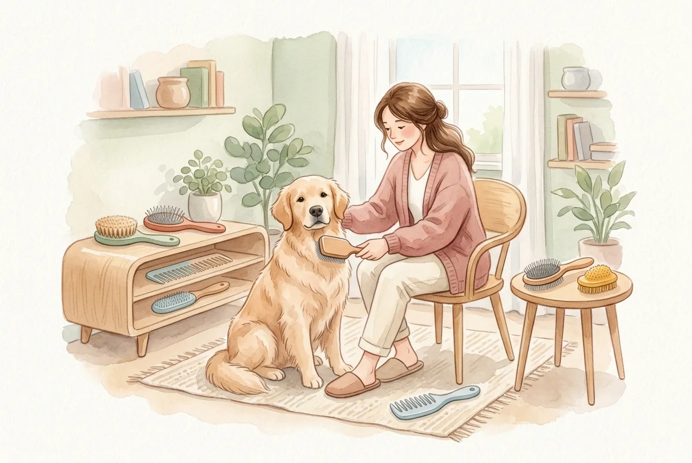
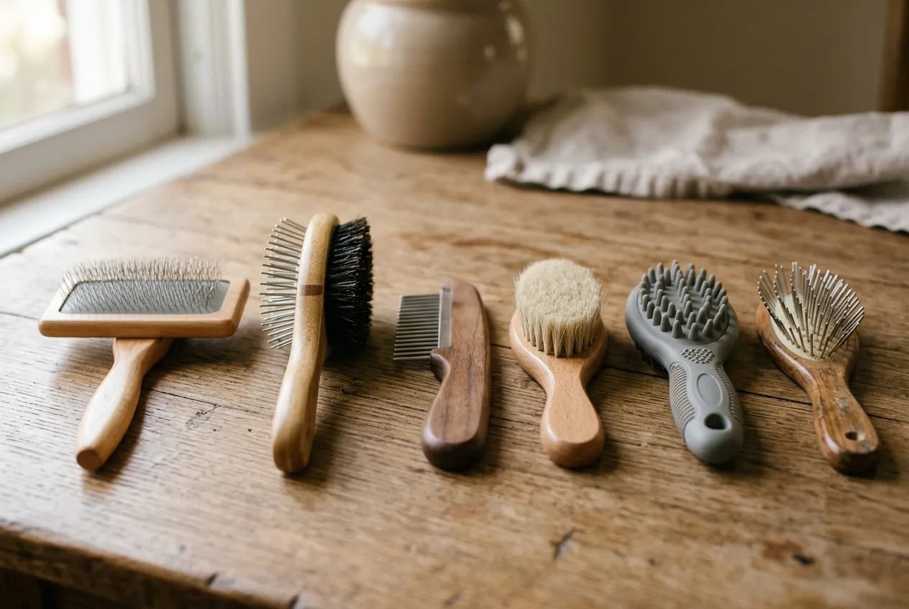
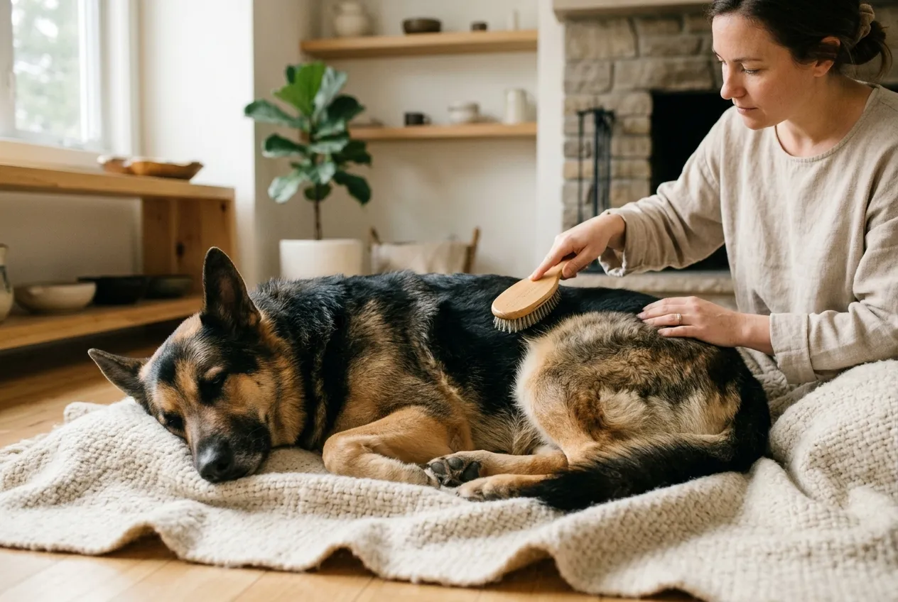

Regelmäßiges Hund bürsten ist die wichtigste Maßnahme für ein gesundes, glänzendes Fell und eine gepflegte Haut. Dabei geht es um weit mehr als nur Optik: Bürsten entfernt lose Haare, verhindert Verfilzungen, fördert die Durchblutung der Haut und gibt dir die Möglichkeit, Parasiten, Hautveränderungen oder kleine Verletzungen frühzeitig zu erkennen.

Doch welche Bürste passt zu welchem Felltyp? Wie oft solltest du deinen Hund bürsten? Und was tun, wenn dein Hund das Bürsten gar nicht mag? In diesem Ratgeber erfährst du alles über die richtige Hundebürste, die optimale Bürstfrequenz für jeden Felltyp und bewährte Techniken -- von Kurzhaar-Hunden bis zu langhaarigen Rassen wie dem Afghanischen Windhund.

Zusammenfassung: Hund bürsten

<ul>
<li><strong>Bürstfrequenz nach Felltyp</strong> -- Kurzhaar-Hunde 1–2x pro Woche, Langhaar-Hunde täglich, Drahthaar-Hunde 2–3x pro Woche</li>
<li><strong>Die richtige Hundebürste</strong> -- Gummistriegel für Kurzhaar, Slicker-Bürste für Langhaar, Unterwollbürste für doppelfelliges Fell</li>
<li><strong>Immer in Wuchsrichtung bürsten</strong> -- Gegen den Strich nur gezielt bei Unterwolle und mit sanftem Druck</li>
<li><strong>Fellwechsel erfordert tägliches Bürsten</strong> -- Im Frühjahr und Herbst verlieren Hunde besonders viel Fell</li>
<li><strong>Früh gewöhnen lohnt sich</strong> -- Welpen ab der 8. Woche spielerisch an die Bürste heranführen</li>
</ul>

5 Min.

Minimum pro Bürsteinheit

1–7x

Bürsten pro Woche je nach Felltyp

6–8 Wo.

Fellwechsel-Dauer pro Saison

4

Haupt-Felltypen bei Hunden

## Warum regelmäßiges Hund bürsten so wichtig ist

Regelmäßiges Bürsten ist kein optionaler Luxus, sondern ein zentraler Bestandteil der [Fellpflege beim Hund](https://hundewissen-mit-kopf.de/hundepflege/fellpflege-hund/). Tierärzte empfehlen konsequentes Bürsten, weil es gleich mehrere gesundheitliche Vorteile bietet.

### Gesundheitliche Vorteile des Bürstens

Beim Bürsten wird die Haut deines Hundes massiert, was die Durchblutung um bis zu 30 % steigern kann. Diese verbesserte Durchblutung fördert die Nährstoffversorgung der Haarfollikel und sorgt für ein kräftigeres, glänzenderes Fell. Gleichzeitig verteilt die Bürste die natürlichen Hautfette (Talg) gleichmäßig über das gesamte Fell, was es geschmeidig hält und vor Umwelteinflüssen schützt.

Lose Haare, abgestorbene Hautschuppen und Schmutzpartikel werden durch das Bürsten effektiv entfernt. Verbleiben diese im Fell, können sie zu Verfilzungen führen, unter denen sich Feuchtigkeit staut. Laut Bundestierärztekammer begünstigen solche Feuchtigkeitsnester Hautpilze und bakterielle Infektionen.

### Früherkennung von Problemen

Das Bürsten gibt dir die Möglichkeit, die Haut deines Hundes systematisch zu untersuchen. Zecken, Flöhe, Hautveränderungen, kleine Wunden oder Knoten fallen beim Bürsten deutlich früher auf als bei bloßem Streicheln. Besonders bei Hunden mit dichtem Fell bleiben Parasiten sonst oft wochenlang unentdeckt.

ℹ️

<strong>Bindung stärken durch Bürsten</strong>

Regelmäßiges, sanftes Bürsten stärkt die Bindung zwischen dir und deinem Hund. Viele Hunde empfinden das Bürsten als angenehme Massage und entspannen sich dabei sichtbar. Studien zeigen, dass ruhige Berührungen den Cortisolspiegel bei Hunden senken können.

## Wie oft sollte man einen Hund bürsten?

Die optimale Bürstfrequenz hängt primär vom Felltyp, der Jahreszeit und der Aktivität deines Hundes ab. Als Grundregel gilt: Je länger und dichter das Fell, desto häufiger muss gebürstet werden.

### Bürstfrequenz nach Felltyp

| Felltyp | Beispielrassen | Bürstfrequenz | Dauer pro Einheit |
|---|---|---|---|
| Kurzhaar | Dalmatiner, Boxer, Dobermann | 1–2x pro Woche | 5–10 Minuten |
| Mittellang | Labrador, Golden Retriever, Schäferhund | 2–3x pro Woche | 10–15 Minuten |
| Langhaar | Afghanischer Windhund, Yorkshire Terrier, Malteser | Täglich | 15–30 Minuten |
| Drahthaar | Fox Terrier, Schnauzer, Airedale | 2–3x pro Woche | 10–15 Minuten |
| Lockig/Wollhaar | Pudel, Bichon Frisé, Lagotto | 3–4x pro Woche | 15–20 Minuten |

### Sonderfälle: Fellwechsel und Outdoor-Hunde

Während des Fellwechsels im Frühjahr und Herbst -- der jeweils 6–8 Wochen dauert -- sollten alle Hunde unabhängig vom Felltyp täglich gebürstet werden. In dieser Phase verlieren Hunde besonders viel Unterwolle, die ohne Bürsten schnell verfilzt.

Hunde, die viel im Freien unterwegs sind, durch Wald und Wiese laufen oder regelmäßig schwimmen, benötigen ebenfalls häufigeres Bürsten. Kletten, Grashalme und kleine Zweige verfangen sich im Fell und bilden ohne Entfernung die Basis für Verfilzungen.

## Welche Hundebürste für welches Fell? Die richtige Bürste finden

Die Wahl der richtigen Hundebürste ist entscheidend für eine effektive und schonende Fellpflege. Eine falsche Bürste kann die Haut reizen, das Fell beschädigen oder schlicht wirkungslos sein.

🧤

Gummistriegel / Noppenhandschuh

Ideal für Kurzhaar-Hunde. Entfernt lose Haare sanft und massiert die Haut. Perfekt für empfindliche Hunde.

🪮

Slicker-Bürste (Zupfbürste)

Feine, gebogene Drahtstifte lösen Verfilzungen bei Langhaar-Hunden. Wichtig: Abgerundete Spitzen wählen.

🦴

Unterwollbürste

Greift gezielt die lose Unterwolle bei doppelfelligen Rassen. Unverzichtbar im Fellwechsel.

✨

Naturborstenbürste

Verteilt Hautfette gleichmäßig und sorgt für Glanz. Ideal als Finish-Bürste nach dem eigentlichen Bürsten.

### Hundebürste für Kurzhaar-Hunde

Kurzhaar-Hunde wie Dalmatiner, Boxer oder Beagle haben ein glattes, eng anliegendes Fell ohne nennenswerte Unterwolle. Trotzdem haaren viele Kurzhaar-Rassen überraschend stark. Für diese Hunde eignen sich Gummistriegel, Noppenhandschuhe oder Bürsten mit kurzen, weichen Borsten am besten.

Die Gumminoppen lösen lose Haare effektiv, ohne die empfindliche Haut zu reizen. Gleichzeitig wirkt das Bürsten wie eine angenehme Massage. Drahtbürsten oder Slicker-Bürsten sind für Kurzhaar-Hunde nicht geeignet, da die Drahtstifte direkt auf die Haut treffen und Mikroverletzungen verursachen können.

### Hundebürste für Langhaar-Hunde

Langhaarige Rassen wie der Afghanische Windhund, Malteser oder Yorkshire Terrier benötigen eine Kombination aus mehreren Bürstentypen. Eine Slicker-Bürste (Zupfbürste) mit feinen, gebogenen Drahtstiften löst Knötchen und leichte Verfilzungen. Ein grobzinkiger Kamm entwirrt längere Fellpartien, bevor die Slicker-Bürste zum Einsatz kommt.

Für das tägliche Bürsten von Langhaar-Hunden empfiehlt sich folgende Reihenfolge: Zuerst mit dem groben Kamm durcharbeiten, dann mit der Slicker-Bürste nacharbeiten und abschließend mit einer Naturborstenbürste für Glanz sorgen. Dieser dreistufige Prozess dauert bei einem Afghanischen Windhund etwa 20–30 Minuten.

### Hundebürste für Unterwolle: Doppelfelliges Fell pflegen

Hunde mit dichter Unterwolle -- wie Husky, Schäferhund, Golden Retriever oder Berner Sennenhund -- benötigen spezielle Unterwollbürsten. Diese Werkzeuge haben eng stehende Metallzinken, die gezielt die lose Unterwolle greifen, ohne das schützende Deckhaar zu beschädigen.

Besonders während des Fellwechsels ist eine Hundebürste für Unterwolle unverzichtbar. Ohne regelmäßiges Entfernen der losen Unterwolle entstehen dichte Filzplatten direkt an der Haut, die Luftzirkulation verhindern und zu Hautproblemen führen können.

⚠️

<strong>Vorsicht bei Unterwollbürsten</strong>

Unterwollbürsten sollten maximal 1–2x pro Woche eingesetzt werden. Zu häufige Nutzung kann das Deckhaar ausdünnen und die natürliche Schutzschicht des Fells beschädigen. Im Fellwechsel ist täglicher Einsatz für maximal 10 Minuten vertretbar.

### Hundebürste für Drahthaar und lockiges Fell

Drahthaarige Rassen wie Schnauzer, Fox Terrier oder Airedale Terrier haben ein raues, drahtiges Deckhaar, das regelmäßig getrimmt werden muss. Zwischen den [Trimm-Terminen](https://hundewissen-mit-kopf.de/hundepflege/hund-trimmen/) eignen sich Metallkämme mit mittlerem Zinkenabstand und weiche Slicker-Bürsten.

Hunde mit lockigem oder wolligem Fell -- etwa Pudel oder Bichon Frisé -- neigen besonders stark zu Verfilzungen. Hier ist eine Kombination aus grobzinkigem Entfilzungskamm und Slicker-Bürste optimal. Lockiges Fell sollte 3–4 Mal pro Woche sorgfältig durchgebürstet werden.

## Übersicht: Bürstentypen und ihre Einsatzgebiete

| Bürstentyp | Geeignet für | Nicht geeignet für | Borsten/Zinken |
|---|---|---|---|
| Gummistriegel | Kurzhaar, empfindliche Hunde | Langhaar, Verfilzungen | Gumminoppen |
| Slicker-Bürste | Langhaar, Lockenfell, Knötchen | Kurzhaar (zu aggressiv) | Feine Drahtstifte, gebogen |
| Unterwollbürste | Doppelfell, Fellwechsel | Einschichtiges Fell, Kurzhaar | Eng stehende Metallzinken |
| Naturborstenbürste | Alle Felltypen (Finish) | Verfilzungen, Unterwolle | Wildschwein- oder Ziegenborsten |
| Metallkamm (grob) | Langhaar, Entwirren | Kurzhaar | Metallzinken, weit stehend |
| Metallkamm (fein) | Flohkontrolle, Gesicht | Dichtes Fell, großflächig | Metallzinken, eng stehend |
| Entfilzungskamm | Verfilzungen, Locken | Kurzhaar, feines Fell | Klingen oder gebogene Zinken |

## Hund richtig bürsten: Schritt für Schritt Anleitung

Die richtige Bürst-Technik ist genauso wichtig wie die Wahl der passenden Bürste. Falsches Bürsten kann Hautreizungen verursachen, Fell ausreißen oder deinen Hund verängstigen.

1

Fell sichten und vorbereiten

Streiche mit den Händen durchs Fell und ertaste Knötchen, Verfilzungen oder Fremdkörper. Entferne Kletten und grobe Verschmutzungen per Hand.

2

Grob entwirren

Bei Langhaar: Mit dem grobzinkigen Kamm vorsichtig Knötchen lösen. Immer an den Spitzen beginnen und langsam zur Haut vorarbeiten.

3

Systematisch bürsten

In Wuchsrichtung des Fells bürsten. Am Rücken beginnen, dann Flanken, Beine und Bauch. Empfindliche Stellen (Ohren, Achseln, Leiste) besonders sanft behandeln.

✓

Finish und Kontrolle

Mit einer Naturborstenbürste für Glanz sorgen. Haut auf Rötungen, Parasiten oder Veränderungen kontrollieren. Deinen Hund mit einem Leckerli belohnen.

### Hund bürsten: In Wuchsrichtung oder gegen den Strich?

Grundsätzlich gilt: Immer in Wuchsrichtung des Fells bürsten. Das ist für den Hund angenehm und schont Haar und Haut. Gegen den Strich bürsten ist nur in bestimmten Situationen sinnvoll -- etwa um bei doppelfelligen Rassen lose Unterwolle gezielt zu lösen.

Wenn du gegen den Strich bürstest, verwende besonders wenig Druck und eine weiche Bürste. Harte Borsten oder Drahtbürsten gegen die Wuchsrichtung können Haarbruch verursachen und die Haut reizen. Bei Kurzhaar-Hunden sollte grundsätzlich nie gegen den Strich gebürstet werden, da die kurzen Haare keinen Schutzpuffer bieten.

### Empfindliche Stellen richtig pflegen

Bestimmte Körperbereiche erfordern besondere Vorsicht beim Bürsten. Hinter den Ohren, in den Achselhöhlen, an der Leiste und am Bauch ist die Haut dünner und empfindlicher. Gleichzeitig entstehen genau an diesen Stellen die häufigsten Verfilzungen, weil sich das Fell durch Bewegung und Reibung leichter verknotet.

Für diese Bereiche eignen sich kleine Slicker-Bürsten oder feinzinkige Kämme. Arbeite langsam und mit minimalem Druck. Halte das Fell mit der freien Hand nah an der Haut fest, damit nicht am Haar gezogen wird. Bei starken Verfilzungen lieber einen professionellen Hundefriseur aufsuchen, statt mit Gewalt zu bürsten.

## Hund lässt sich nicht bürsten: Ursachen und Lösungen

Viele Hundehalter kennen das Problem: Der Hund weicht aus, schnappt nach der Bürste oder zeigt deutliche Stresszeichen beim Bürsten. Laut Tierärzten liegt das in den meisten Fällen an negativen Erfahrungen, falscher Bürstenwahl oder fehlender Gewöhnung.

### Häufige Ursachen für Bürst-Verweigerung

Hunde, die als Welpen nicht an die Bürste gewöhnt wurden, empfinden das Bürsten oft als bedrohlich. Auch schmerzhafte Erfahrungen -- etwa durch zu hartes Bürsten, Ziehen an Verfilzungen oder eine ungeeignete Bürste -- können eine dauerhafte Abneigung auslösen.

Weitere Ursachen können Hautprobleme sein: Allergien, Ekzeme oder Entzündungen machen die Haut empfindlich, sodass selbst sanftes Bürsten schmerzhaft wird. Wenn dein Hund plötzlich das Bürsten verweigert, obwohl er es zuvor toleriert hat, sollte ein Tierarzt die Haut untersuchen.

### Hund schnappt beim Bürsten: So reagierst du richtig

Schnappt dein Hund beim Bürsten, ist das ein deutliches Warnsignal für Schmerz oder Angst. Bestrafe den Hund niemals dafür -- das verschlimmert die Situation. Stattdessen solltest du die Ursache identifizieren.

Das hilft

<ul>
<li>Weichere Bürste wählen (z. B. Gummistriegel statt Drahtbürste)</li>
<li>Kurze Einheiten von 1–2 Minuten, langsam steigern</li>
<li>Leckerlis und Lob während des Bürstens</li>
<li>An weniger empfindlichen Stellen beginnen (Rücken, Flanke)</li>
<li>Entspannte Atmosphäre schaffen (nach dem Spaziergang)</li>
</ul>

Das verschlimmert es

<ul>
<li>Hund festhalten oder zwingen</li>
<li>Schimpfen oder bestrafen bei Abwehr</li>
<li>Zu lange Bürsteinheiten erzwingen</li>
<li>An empfindlichen Stellen beginnen (Pfoten, Bauch)</li>
<li>Harte Bürste bei empfindlicher Haut verwenden</li>
</ul>

### Desensibilisierung: Schritt für Schritt ans Bürsten gewöhnen

Die Desensibilisierung ist die effektivste Methode, um einen ängstlichen Hund langfristig ans Bürsten zu gewöhnen. Tierärzte und Hundetrainer empfehlen einen stufenweisen Aufbau über 2–4 Wochen.

In der ersten Woche legst du die Bürste nur neben den Hund und belohnst ihn, wenn er ruhig bleibt. In der zweiten Woche berührst du den Hund mit der Bürstenrückseite (ohne zu bürsten) und belohnst erneut. Ab der dritten Woche machst du 2–3 sanfte Bürststriche am Rücken, gefolgt von einem Leckerli. Steigere die Dauer schrittweise um 30 Sekunden pro Sitzung.

💡

<strong>Tipp: Leckmatten als Ablenkung</strong>

Eine mit Leberwurst oder Quark bestrichene Leckmatte kann deinen Hund während des Bürstens wirkungsvoll ablenken. Das Lecken setzt Endorphine frei und verknüpft das Bürsten mit einer positiven Erfahrung. Viele Hundetrainer setzen diese Methode erfolgreich ein.

## Fellwechsel: Warum tägliches Bürsten jetzt Pflicht ist

Der Fellwechsel findet bei den meisten Hunden zweimal jährlich statt -- im Frühjahr (Winterfell wird abgestoßen) und im Herbst (Sommerfell wird durch dichteres Winterfell ersetzt). Dieser Prozess dauert jeweils 6–8 Wochen und erfordert intensivere Fellpflege.

### So bewältigst du den Fellwechsel

Während des Fellwechsels kann ein mittelgroßer Hund täglich mehrere Handvoll lose Unterwolle verlieren. Ohne tägliches Bürsten verfilzt diese Unterwolle innerhalb weniger Tage. Besonders betroffen sind Rassen mit dichtem Doppelfell wie Husky, Samojede, Schäferhund und Golden Retriever.

Für den Fellwechsel ist eine Kombination aus Unterwollbürste und Slicker-Bürste optimal. Beginne mit der Unterwollbürste, um die lose Unterwolle großflächig zu entfernen. Arbeite anschließend mit der Slicker-Bürste nach, um verbliebene Haare und kleine Knoten zu lösen. Plane im Fellwechsel 15–20 Minuten tägliches Bürsten ein.

📖

<strong>Wussten du? Fellwechsel und Tageslicht</strong>

Der Fellwechsel wird primär durch die Tageslichtlänge ausgelöst, nicht durch die Temperatur. Hunde, die überwiegend in beheizten Wohnungen leben, können ganzjährig leicht haaren, da das künstliche Licht den natürlichen Rhythmus stört.

### Fellwechsel vs. krankhafter Haarausfall

Nicht jeder starke Haarverlust ist normaler Fellwechsel. Wenn dein Hund außerhalb der typischen Fellwechselzeiten übermäßig Haare verliert, kahle Stellen entwickelt oder die Haut gerötet ist, solltest du einen Tierarzt aufsuchen. Mögliche Ursachen für krankhaften Haarausfall sind Allergien, Schilddrüsenprobleme, Parasitenbefall oder Nährstoffmangel.

## Verfilzungen lösen und vorbeugen

Verfilzungen sind mehr als ein kosmetisches Problem. Dichte Filzplatten ziehen an der Haut, verursachen Schmerzen und können die Luftzirkulation so stark einschränken, dass sich darunter Ekzeme und Pilzinfektionen bilden.

### Leichte Verfilzungen selbst lösen

Kleinere Knötchen und leichte Verfilzungen lassen sich mit einem Entfilzungskamm oder den Fingern vorsichtig lösen. Trage etwas Entfilzungsspray auf die betroffene Stelle auf und lasse es 2–3 Minuten einwirken. Beginne dann an den Haarspitzen und arbeite dich langsam zur Haut vor. Ziehe niemals mit Gewalt an einer Verfilzung.

### Wann zum Hundefriseur?

Bei starken, hautnahen Verfilzungen solltest du einen professionellen Hundefriseur aufsuchen. Versuche nicht, dichte Filzplatten selbst herauszuschneiden -- die Verletzungsgefahr mit der Schere ist hoch, da die Haut unter dem Filz oft direkt anliegt. Ein erfahrener Groomer kann Verfilzungen sicher entfernen und dich zur optimalen Bürstroutine beraten.

🚫

<strong>Verfilzungen niemals mit der Schere entfernen!</strong>

Die Haut unter Filzplatten liegt oft direkt am Knoten an und ist nicht sichtbar. Beim Schneiden mit der Schere kommt es häufig zu tiefen Schnittverletzungen. Verwende ausschließlich einen Entfilzungskamm oder lasse starke Verfilzungen professionell entfernen.

## Bürsten-Pflege: So hält deine Hundebürste lange

Eine Hundebürste muss regelmäßig gereinigt werden, um hygienisch und effektiv zu bleiben. In den Borsten und Zinken sammeln sich Haare, Hautschuppen, Talg und Schmutz -- ein idealer Nährboden für Bakterien.

Entferne nach jeder Bürsteinheit die losen Haare aus der Bürste. Einmal pro Woche solltest du die Bürste mit warmem Wasser und etwas mildem Spülmittel reinigen. Metallkämme und Slicker-Bürsten lassen sich zusätzlich mit einer alten Zahnbürste zwischen den Zinken säubern. Trockne die Bürste anschließend vollständig, um Rostbildung bei Metallteilen zu vermeiden.

✅ Checkliste: Hundebürste reinigen

✓

Nach jeder Nutzung: Haare aus der Bürste entfernen

✓

Wöchentlich: Mit warmem Wasser und Spülmittel waschen

✓

Monatlich: Zinken auf Verformungen oder stumpfe Spitzen prüfen

Bei Bedarf: Bürste ersetzen (bei verbogenen Zinken oder abgenutzten Borsten)

## Welpen ans Bürsten gewöhnen: So gelingt der Start

Die beste Zeit, einen Hund ans Bürsten zu gewöhnen, ist das Welpenalter. Ab der 8. Lebenswoche können Welpen spielerisch an die Bürste herangeführt werden. Diese frühe Gewöhnung zahlt sich ein Hundeleben lang aus.

Verwende für Welpen eine besonders weiche Bürste -- etwa eine Babybürste mit Naturborsten oder einen Gummi-Fingerling. Die ersten Bürsteinheiten sollten nicht länger als 30–60 Sekunden dauern. Bürste sanft über den Rücken und die Flanken, während du den Welpen mit ruhiger Stimme lobst und anschließend mit einem Leckerli belohnst.

Steigere die Dauer schrittweise um 30 Sekunden pro Woche. Führe das Bürsten als festes Ritual ein -- zum Beispiel jeden Abend nach dem letzten Spaziergang. Innerhalb von 4–6 Wochen akzeptieren die meisten Welpen das Bürsten als normale Routine. Grundlegende [Kommandos wie "Bleib"](https://hundewissen-mit-kopf.de/erziehung-verhalten/kommandos-hund/) können die Bürsteinheiten zusätzlich erleichtern.

✅

<strong>Frühe Gewöhnung = lebenslange Akzeptanz</strong>

Welpen, die zwischen der 8. und 16. Lebenswoche regelmäßig positive Erfahrungen mit dem Bürsten machen, akzeptieren die Fellpflege als Erwachsene laut VDH deutlich besser. Diese Sozialisierungsphase ist der Schlüssel für stressfreies Bürsten.

## Bürsten und Baden: Die richtige Reihenfolge

Ein häufiger Fehler ist es, den Hund vor dem Bürsten zu [baden](https://hundewissen-mit-kopf.de/hundepflege/hund-baden/). Wasser und Shampoo können bestehende Verfilzungen stark verdichten und nahezu unlösbar machen. Deshalb gilt die Regel: Immer zuerst bürsten, dann baden.

Bürste deinen Hund vor dem Bad gründlich durch und löse alle Knötchen. Nach dem Bad und dem vollständigen Trocknen des Fells solltest du erneut bürsten, um lose Haare zu entfernen und das Fell in Form zu bringen. Bei Hunden, die nur mit [Hausmitteln gewaschen](https://hundewissen-mit-kopf.de/hundepflege/hund-waschen-hausmittel/) werden, gilt dieselbe Reihenfolge.

| Reihenfolge | Schritt | Warum? |
|---|---|---|
| 1 | Gründlich bürsten | Verfilzungen lösen, lose Haare entfernen |
| 2 | Baden (nur bei Bedarf) | Schmutz und Geruch entfernen |
| 3 | Vollständig trocknen | Feuchtigkeit im Fell vermeiden |
| 4 | Erneut bürsten | Fell entwirren und in Form bringen |

## Spezielle Fellpflege nach Rasse: Tipps für besondere Felltypen

Verschiedene Hunderassen stellen unterschiedliche Anforderungen an das Bürsten. Die Fellstruktur bestimmt nicht nur die Bürstenwahl, sondern auch die Technik und Häufigkeit.

### Kurzhaar-Hunde bürsten

Kurzhaar-Hunde wie Dalmatiner, Boxer oder Labrador haben ein pflegeleichtes Fell, das trotzdem regelmäßige Aufmerksamkeit braucht. 1–2 Bürsteinheiten pro Woche mit einem Gummistriegel reichen aus, um lose Haare zu entfernen und die Haut zu massieren. Im Fellwechsel kann ein Labrador allerdings erstaunliche Mengen Unterwolle verlieren -- dann ist tägliches Bürsten mit einer Unterwollbürste sinnvoll.

### Langhaarige Rassen: Afghanischer Windhund und Co.

Der Afghanische Windhund gilt als eine der pflegeintensivsten Hunderassen überhaupt. Sein seidiges, bis zu 20 cm langes Fell muss täglich 20–30 Minuten gebürstet werden, um Verfilzungen zu vermeiden. Ähnlich aufwendig ist die Fellpflege bei [großen Langhaar-Rassen](https://hundewissen-mit-kopf.de/hunderassen/grosse-hunderassen-langhaar/) wie dem Briard oder Bearded Collie.

### Hunde mit Wintermantel: Fellpflege bei Mantelträgern

Hunde, die im Winter einen [Hundemantel](https://hundewissen-mit-kopf.de/hundeausstattung/braucht-hund-einen-mantel/) tragen, neigen an den Reibungsstellen (Brust, Schultern, Bauch) vermehrt zu Verfilzungen. Bürste diese Bereiche nach jedem Tragen des Mantels besonders sorgfältig durch.

## Fazit: Regelmäßiges Hund bürsten für gesundes Fell

Regelmäßiges Hund bürsten ist die einfachste und wirkungsvollste Maßnahme für ein gesundes, glänzendes Fell und eine gepflegte Haut. Die richtige Hundebürste für den jeweiligen Felltyp, eine angemessene Bürstfrequenz und die korrekte Technik machen den Unterschied zwischen stressfreier Routine und frustrierendem Kampf.

Beginne bei Welpen früh mit der Gewöhnung, wähle die passende Bürste für das Fell deines Hundes und plane feste Bürstzeiten in den Alltag ein. Kurzhaar-Hunde kommen mit 1–2 Einheiten pro Woche aus, während langhaarige Rassen tägliche Pflege benötigen. Im Fellwechsel gilt für alle Hunde: Täglich bürsten, um Verfilzungen und Hautprobleme zu vermeiden. Dein Hund wird es dir mit einem gesunden, strahlenden Fell danken.