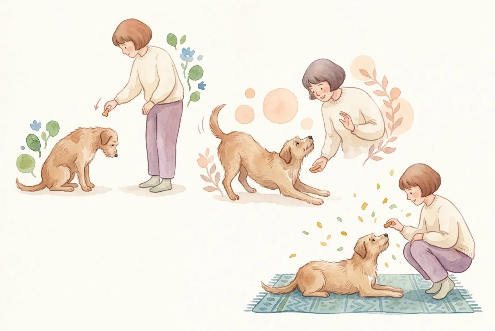
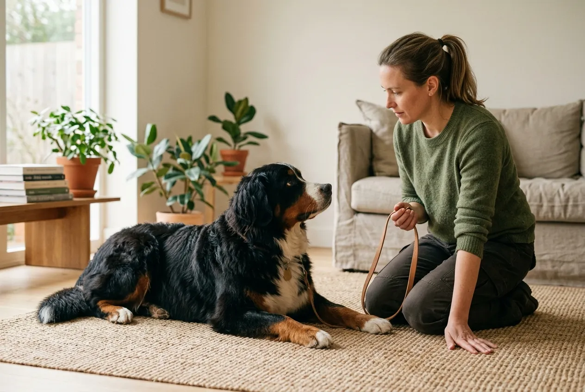

Hund Platz beibringen gehört zu den drei wichtigsten Grundkommandos im Hundetraining und lässt sich in fünf klaren Schritten erlernen. Ein zuverlässiges Platz-Kommando sorgt für Sicherheit im Alltag, beruhigt den Hund in stressigen Situationen und bildet die Basis für weiterführende Übungen wie Bleib oder Ablegen auf Distanz.

Der folgende Ratgeber liefert eine praxiserprobte Schritt-für-Schritt-Anleitung nach dem Prinzip der positiven Verstärkung, erklärt typische Fehler und zeigt, wie sich der Schwierigkeitsgrad systematisch steigern lässt. Die Methode basiert auf Empfehlungen des Verbands für das Deutsche Hundewesen (VDH) und des Berufsverbands der Hundeerzieher (BHV).

Zusammenfassung: Hund Platz beibringen

<ul>
<li><strong>5-Schritte-Methode</strong>, Lockführung aus der Sitzposition mit Leckerli zum Boden</li>
<li><strong>Trainingsdauer</strong>, maximal 5 Minuten pro Einheit, 3 bis 5 Einheiten täglich</li>
<li><strong>Positive Verstärkung</strong>, Belohnung innerhalb von 1 Sekunde nach korrekter Ausführung</li>
<li><strong>Handzeichen plus Wortkommando</strong> kombinieren, beschleunigt das Lernen um rund 30 Prozent</li>
<li><strong>Auflösewort</strong> wie Okay oder Lauf ist Pflicht, niemals wortlos weggehen</li>
</ul>

5 Min

max. Trainingsdauer pro Einheit

1 Sek

Zeitfenster für Belohnung

8 Wochen

Mindestalter für Welpen

2-3 Wochen

bis zur sicheren Ausführung

## Was bedeutet das Kommando Platz?

Das Kommando Platz bedeutet, dass der Hund sich auf Signal vollständig hinlegt, Bauch am Boden, Vorderpfoten nach vorne ausgestreckt, und diese Position hält, bis ein Auflösewort folgt. Es gehört neben Sitz und Komm zu den drei wichtigsten Grundkommandos im Hundetraining.

Ein sauberes Platz dient nicht der Unterwerfung, sondern der Impulskontrolle. Der Hund lernt, Ruhe auszuhalten, auch wenn die Umgebung reizvoll ist. Laut BHV sinkt der Stresspegel bei Hunden messbar, wenn sie ein festes Platz-Kommando sicher beherrschen.

📖

Definition: Platz-Kommando

Signal, auf das der Hund sich aus jeder Position hinlegt und die Liegeposition hält, bis das Auflösewort gegeben wird. Teil der Grundgehorsamsprüfung nach VDH-Richtlinien.

### Warum Platz für den Alltag wichtig ist

Ein zuverlässiges Platz schafft Sicherheit in Situationen, in denen der Hund stehen bleiben oder abwarten muss, etwa am Straßenrand, im Restaurant oder beim Besuch. Auch beim Tierarzt oder in Notsituationen kann das Kommando Unfälle verhindern.

Darüber hinaus bildet Platz die Grundlage für weiterführende Übungen wie Decke, Ablegen unter Ablenkung oder Ablegen auf Distanz. Wer diese Basis früh festigt, erleichtert sich die gesamte weitere Hundeerziehung. Mehr zu anderen Grundkommandos findest du im [Ratgeber zu Kommandos für den Hund](https://hundewissen-mit-kopf.de/erziehung-verhalten/kommandos-hund/).

## Die 5-Schritte-Anleitung: Hund Platz beibringen

Die folgende Methode basiert auf positiver Verstärkung und funktioniert mit Welpen ab 8 Wochen ebenso wie mit erwachsenen Hunden. Wichtig ist die Einhaltung der Reihenfolge.

1

Sitz einnehmen

Hund setzt sich, du kniest oder stehst direkt davor

2

Lockführung

Leckerli langsam vom Hundemaul zum Boden führen

3

Kommando geben

Klar und ruhig das Wort Platz aussprechen

4

Belohnen

Sofort nach korrekter Ausführung Leckerli geben

✓

Auflösen

Mit Okay oder Lauf die Übung beenden

### Schritt 1: Ausgangsposition Sitz

Beginne das Training aus der Sitzposition, denn der Übergang vom Sitzen zum Liegen ist für den Hund anatomisch einfacher als aus dem Stand. Der Hund sollte ruhig sitzen und Blickkontakt halten, bevor du weitermachst.

Trainiere in einer reizarmen Umgebung, idealerweise im Wohnzimmer oder Garten. Lärm, andere Tiere oder fremde Menschen lenken besonders Welpen stark ab und verzögern den Lernerfolg.

### Schritt 2: Lockführung mit Leckerli

Halte ein kleines, weiches Leckerli zwischen Daumen und Zeigefinger direkt vor die Nase des Hundes. Führe die Hand dann langsam senkrecht nach unten bis zum Boden und ziehe sie anschließend leicht nach vorne von dir weg.

Der Hund folgt dem Leckerli automatisch mit der Nase und legt sich dabei ab. Diese Methode heißt Lockführung oder Luring und ist laut BHV die sicherste Technik im Grundgehorsam.

💡

<strong>Tipp zur Leckerli-Wahl</strong>

Verwende besonders schmackhafte Belohnungen wie Käsewürfel, Huhn oder Leberwurst im Anfangstraining. Je höher der Belohnungswert, desto schneller lernt der Hund.

### Schritt 3: Kommando einführen

Sobald der Hund die Lockführung zuverlässig befolgt, wird das Wortkommando eingeführt. Sage Platz in dem Moment, in dem der Hund sich hinlegt, nicht vorher. So verknüpft er das Wort mit der Bewegung.

Nach etwa 10 bis 15 erfolgreichen Wiederholungen kannst du das Kommando auch kurz vor der Handführung geben. Ergänze gleichzeitig ein Handzeichen, etwa die flache Hand, die nach unten zeigt. Hunde lernen Handzeichen rund 30 Prozent schneller als reine Wortkommandos.

### Schritt 4: Sofort belohnen

Die Belohnung muss innerhalb von einer Sekunde nach dem Ablegen erfolgen. Dieses Zeitfenster entspricht der neurologischen Lernfähigkeit des Hundes, belegt durch Studien der Tierärztlichen Hochschule Hannover.

Lob in ruhigem Ton, ein Leckerli oder ein kurzes Spiel verstärken das Verhalten. Vermeide überschwängliches Jubeln, denn das bringt den Hund aus der Ruhe und unterbricht die Liegeposition.

### Schritt 5: Auflösewort nutzen

Nach wenigen Sekunden löst du die Übung mit einem klaren Auflösewort wie Okay oder Lauf auf. Der Hund darf erst jetzt aufstehen und das Kommando beenden.

Ohne Auflösewort lernt der Hund, selbst zu entscheiden, wann er aufsteht, und das untergräbt langfristig die Zuverlässigkeit des Kommandos. Konsequenz bei diesem Schritt ist entscheidend.

## Trainingsplan für die ersten zwei Wochen

Der Aufbau des Kommandos Platz erfolgt schrittweise, nicht in einer einzigen langen Session. Der folgende Plan zeigt einen realistischen Ablauf für die ersten 14 Tage.

| Phase | Tage | Ziel | Wiederholungen pro Einheit |
|---|---|---|---|
| Lockführung | 1-3 | Ablegen mit Leckerli klappt zuverlässig | 5-8 |
| Kommando einführen | 4-7 | Wort Platz wird verknüpft | 8-10 |
| Handzeichen hinzufügen | 8-10 | Hund reagiert auf Geste | 8-10 |
| Dauer verlängern | 11-14 | Hund bleibt 5-10 Sekunden liegen | 5-7 |

Plane 3 bis 5 Trainingseinheiten pro Tag mit jeweils maximal 5 Minuten. Kürzere, häufigere Einheiten führen laut BHV zu deutlich schnellerem Lernerfolg als seltene Langtrainings.

ℹ️

<strong>Wichtige Regel: Immer in ruhiger Umgebung starten</strong>

Ablenkungen wie andere Hunde, Besucher oder Spielzeug werden erst eingeführt, wenn das Kommando in reizarmer Umgebung sicher sitzt. Sonst festigt sich Unzuverlässigkeit.

## Schwierigkeitsgrad steigern: Platz unter Ablenkung

Sobald der Hund das Kommando in ruhiger Umgebung zu 90 Prozent zuverlässig ausführt, wird der Schwierigkeitsgrad systematisch erhöht. Wer zu früh Ablenkung einführt, riskiert Frust und Rückschritte.

### Die drei Ds im Training

Die drei Ds Distanz, Dauer und Distraktion (Ablenkung) werden im Hundetraining einzeln gesteigert, niemals gleichzeitig. Das ist eine der zentralen Regeln der modernen Hundeerziehung.

📏

Distanz

Abstand zum Hund Schritt für Schritt vergrößern, von 1 m bis 10 m

⏱️

Dauer

Liegezeit von 5 Sekunden auf mehrere Minuten ausdehnen

🎯

Distraktion

Ablenkungen wie Spielzeug, Geräusche, andere Hunde einführen

### Training draußen und mit Ablenkung

Nach 2 bis 3 Wochen Grundtraining kann das Platz-Kommando im Garten oder auf ruhigen Spazierwegen geübt werden. Beginne mit geringer Ablenkung, etwa vorbeifahrenden Fahrrädern in 20 Metern Entfernung, bevor du an belebten Orten trainierst.

Typische Steigerungsstufen sind: Garten ohne Ablenkung, Garten mit Spielzeug, ruhiger Park, belebter Gehweg, Hundewiese, Fußgängerzone. Jede Stufe sollte zu mindestens 80 Prozent sitzen, bevor die nächste folgt. Eine gute Grundlage dafür bildet [sauber trainierte Leinenführigkeit](https://hundewissen-mit-kopf.de/erziehung-verhalten/leinenfuehrigkeit-trainieren/).

## Typische Fehler beim Platz beibringen

Viele Hundehalter machen beim Training dieselben Fehler, die das Lernen erschweren. Die folgende Übersicht zeigt die häufigsten Stolperfallen.

Richtig trainieren

<ul>
<li>Ruhige, klare Stimme, Kommando nur einmal geben</li>
<li>Belohnung innerhalb von 1 Sekunde nach korrekter Ausführung</li>
<li>Kurze Einheiten von maximal 5 Minuten, mehrmals täglich</li>
<li>Ende immer mit Erfolg, auch wenn die Übung leichter wird</li>
<li>In reizarmer Umgebung starten, Schwierigkeit langsam steigern</li>
</ul>

Vermeidbare Fehler

<ul>
<li>Kommando mehrfach wiederholen (Platz, Platz, na Platz jetzt)</li>
<li>Hund körperlich nach unten drücken, verursacht Abwehr</li>
<li>Bestrafung bei Fehlern, zerstört Motivation</li>
<li>Training auf kaltem oder hartem Untergrund</li>
<li>Zu frühe Ablenkung ohne gefestigte Grundlage</li>
</ul>

### Hund drücken oder ziehen, niemals

Das physische Hinunterdrücken des Hundes ist laut BHV-Richtlinien kontraproduktiv und kann Angstreaktionen auslösen. Der Hund verbindet das Kommando dann mit Zwang statt mit positivem Verhalten. Die Tierärztliche Hochschule Hannover bestätigt in mehreren Studien, dass positive Verstärkung langfristig zu deutlich stabileren Kommandos führt.

### Falsches Timing der Belohnung

Belohnt ein Halter erst, wenn der Hund bereits wieder aufsteht, verknüpft der Hund die Belohnung mit dem Aufstehen statt mit dem Liegen. Das Ein-Sekunden-Fenster ist daher nicht verhandelbar.

⚠️

<strong>Warnung vor harten Trainingsmethoden</strong>

Schreckreize wie Sprühhalsbänder, Rütteldosen oder lautes Anschreien sind beim Platz-Training tierschutzrechtlich bedenklich und pädagogisch nicht wirksam. Tierärztliche Verhaltenstherapeuten raten ausdrücklich davon ab.

## Platz beibringen beim Welpen

Welpen ab 8 Wochen können bereits das Kommando Platz lernen, brauchen aber angepasste Trainingsbedingungen. Die Aufmerksamkeitsspanne junger Hunde beträgt nur 1 bis 3 Minuten am Stück.

Trainiere mit einem Welpen 2 bis 3 Minuten pro Einheit, dafür 5 bis 8 Mal täglich. Nutze besonders weiche Leckerli, die schnell geschluckt werden, denn langes Kauen unterbricht den Trainingsfluss. Weitere Grundlagen liefert der [Ratgeber zur Welpenerziehung](https://hundewissen-mit-kopf.de/erziehung-verhalten/welpenerziehung/).

### Rassenspezifische Unterschiede

Bestimmte Rassen lernen Platz schneller oder langsamer als andere. Die folgende Tabelle zeigt grobe Orientierungswerte nach VDH-Rasseportraits.

| Rassegruppe | Lerngeschwindigkeit | Besonderheiten |
|---|---|---|
| Hütehunde (Border Collie, Australian Shepherd) | Sehr schnell, 3-7 Tage | Hohe Motivation, brauchen mentale Auslastung |
| Retriever (Labrador, Golden Retriever) | Schnell, 1-2 Wochen | Futtermotiviert, sehr kooperativ |
| Terrier (Jack Russell, Fox Terrier) | Mittel, 2-3 Wochen | Eigenständig, brauchen Konsequenz |
| Windhunde (Whippet, Greyhound) | Langsam, 3-5 Wochen | Weiche Unterlage wichtig, sensibler Rücken |
| Bulldoggen, Moppse | Mittel, 2-4 Wochen | Kurze Einheiten wegen Atemwegen |

## Platz beim erwachsenen Hund nachtrainieren

Auch erwachsene oder adoptierte Hunde können das Kommando Platz jederzeit lernen, Hunde sind ein Leben lang lernfähig. Der Trainingsaufbau folgt denselben 5 Schritten, benötigt aber oft 1 bis 2 Wochen länger, wenn der Hund bereits festgefahrene Gewohnheiten hat.

Bei ängstlichen oder unsicheren Hunden aus dem Tierschutz empfiehlt der BHV zusätzlich, das Training zunächst auf einer vertrauten Decke durchzuführen. Diese bietet Sicherheit und lässt sich später als mobile Platz-Station nutzen.

✅

<strong>Gute Nachricht für Späteinsteiger</strong>

Auch Hunde ab 8 Jahren lernen neue Kommandos. Studien der Universität Wien zeigen, dass geistige Auslastung im Alter sogar demenzvorbeugend wirkt.

## Ausstattung für das Training

Für das Training brauchst du keine teure Ausrüstung, ein paar Grundlagen erleichtern aber den Ablauf erheblich.

✅ Checkliste: Grundausstattung für Platz-Training

✓

Hochwertige Leckerli in kleinen Stücken (ca. erbsengroß)

✓

Leckerlibeutel oder Bauchtasche für schnellen Zugriff

✓

Ruhige Trainingsumgebung ohne Ablenkung

✓

Angenehme Unterlage, besonders für kleinere oder kurzhaarige Hunde

Clicker zur präzisen Markierung des Verhaltens (optional)

Trainingsleine (2-5 m) für späteres Distanztraining

### Trainings-Leckerli selbst machen

Selbstgemachte Leckerli sind oft gesünder als industrielle Produkte und lassen sich in Minutenschnelle zubereiten.

🍳 Rezept: Einfache Trainings-Leckerli

<ul>
<li>200 g Magerquark mit 150 g Haferflocken vermischen</li>
<li>1 Ei unterrühren, optional 1 Teelöffel Leberwurst hinzufügen</li>
<li>Teig in kleine, erbsengroße Kugeln formen</li>
<li>Bei 180 °C für 15 Minuten backen, dann auskühlen lassen</li>
<li>Im Kühlschrank bis zu 5 Tage haltbar</li>
</ul>

## Wenn Platz einfach nicht klappen will

Manche Hunde tun sich besonders schwer mit dem Kommando Platz. Das hat meist konkrete Gründe, die sich beheben lassen.

### Körperliche Ursachen prüfen

Legt sich ein Hund nur widerwillig hin, können Gelenkschmerzen, Hüftdysplasie oder Rückenprobleme die Ursache sein. Besonders bei älteren Hunden oder Rassen wie Schäferhund, Dackel oder Berner Sennenhund lohnt eine tierärztliche Abklärung vor intensivem Training.

🚫

<strong>Achtung: Schmerzen ausschließen</strong>

Wenn ein Hund das Kommando plötzlich verweigert, obwohl es früher funktionierte, ist ein Tierarztbesuch dringend empfohlen. Plötzliche Verweigerung ist oft ein Schmerzsignal.

### Trainingsumgebung optimieren

Kalte Fliesenböden, Zugluft oder harte Holzdielen sind für viele Hunde unangenehm. Der Hund vermeidet das Ablegen dann nicht aus Sturheit, sondern aus Komfortgründen. Eine Decke oder weiche Trainingsmatte lösen dieses Problem sofort.

### Motivation steigern

Nach 20 bis 30 Wiederholungen mit demselben Leckerli schwindet oft die Motivation. Wechsle dann die Belohnung, nutze Spielzeug statt Futter oder beende die Einheit mit einem Erfolgserlebnis. Auch [dauerhaftes Bellen](https://hundewissen-mit-kopf.de/erziehung-verhalten/hund-bellt-staendig/) kann ein Zeichen von Unterforderung sein und das Training erschweren.

## Platz mit Handzeichen allein

Sobald der Hund das Kommando sicher beherrscht, kann das Wortsignal schrittweise weggelassen werden. Das Handzeichen, meist die flache, nach unten zeigende Hand, ist dann das Hauptsignal.

Diese Variante ist besonders praktisch in lauten Umgebungen, bei gehörlosen Hunden oder für Hundesportarten wie Obedience und Turnierhundesport. Der Übergang erfolgt in 3 Wochen, in denen das Wortkommando immer leiser gesprochen und schließlich weggelassen wird.

## Fazit: Hund Platz beibringen mit Geduld und System

Hund Platz beibringen gelingt jedem Halter, der konsequent, geduldig und systematisch trainiert. Die 5-Schritte-Methode mit Lockführung, klarem Kommando, sofortiger Belohnung und definiertem Auflösewort funktioniert bei Welpen ab 8 Wochen ebenso wie bei erwachsenen Hunden.

Entscheidend sind kurze Trainingseinheiten von maximal 5 Minuten, mehrmals täglich, und die strikte Einhaltung der drei Ds Distanz, Dauer und Distraktion als getrennte Lernstufen. Nach 2 bis 3 Wochen beherrscht der Hund das Kommando in ruhiger Umgebung zuverlässig, nach weiteren 4 bis 8 Wochen auch unter Ablenkung. Wer beim Training auf positive Verstärkung setzt, körperlichen Zwang vermeidet und das Auflösewort konsequent nutzt, legt die Grundlage für einen entspannten und sicheren Alltag mit seinem Hund.