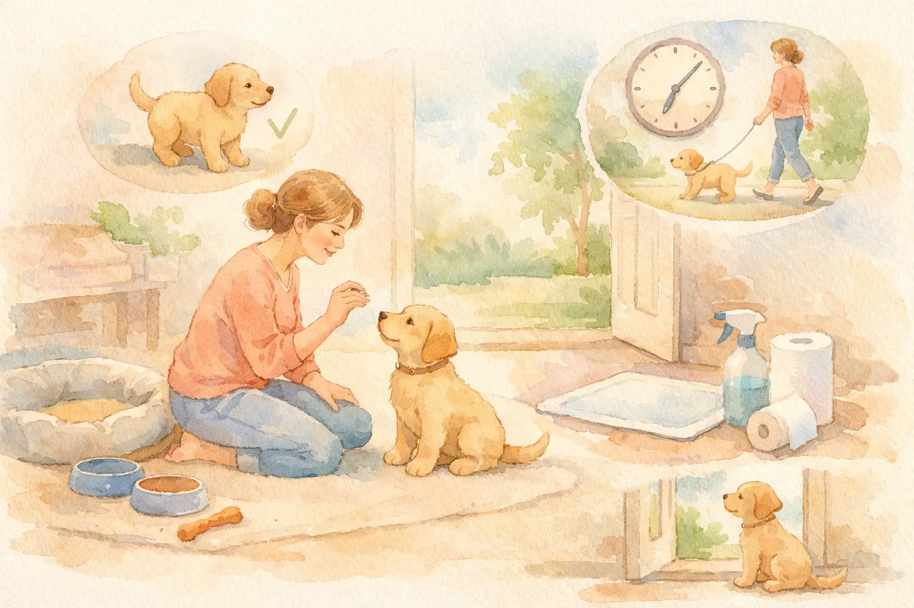
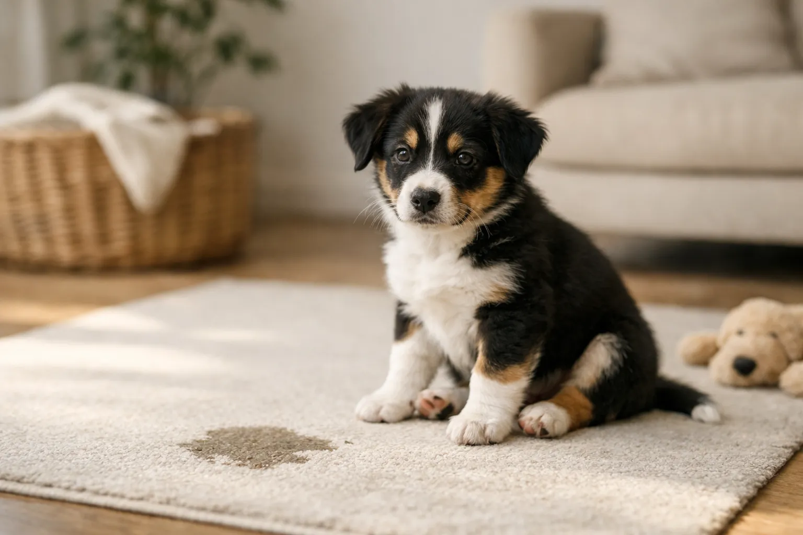
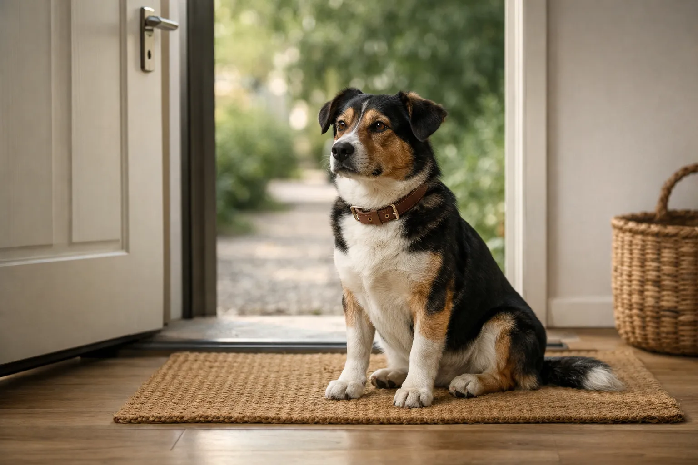

Einen Hund stubenrein bekommen gehört zu den ersten und wichtigsten Aufgaben für jeden Hundehalter. Ob junger Welpe oder erwachsener Hund aus dem Tierschutz -- mit der richtigen Strategie, Geduld und einem klaren Zeitplan gelingt die Stubenreinheit in den meisten Fällen innerhalb weniger Wochen.

In diesem Guide erfährst du Schritt für Schritt, wie du deinen Hund stubenrein bekommst -- mit konkreten Zeitplänen, Lösungen für typische Probleme und bewährten Methoden für jede Altersgruppe. Du lernst, welche Signale dein Hund zeigt, wenn er muss, warum Bestrafung kontraproduktiv ist und was du tun kannst, wenn dein Hund trotz Gassi gehen in die Wohnung macht.

Zusammenfassung: Hund stubenrein bekommen

<ul>
<li><strong>Zeitrahmen Welpen</strong> -- 4 bis 6 Monate bis zur zuverlässigen Stubenreinheit, erste Erfolge nach 1 bis 2 Wochen</li>
<li><strong>Faustregel Blasenkontrolle</strong> -- Lebensalter in Monaten + 1 = maximale Stunden zwischen den Gassi-Gängen</li>
<li><strong>Konsequenz ist entscheidend</strong> -- Feste Gassi-Zeiten, sofortiges Loben draußen und keinerlei Bestrafung bei Missgeschicken</li>
<li><strong>Erwachsene Hunde & Tierschutzhunde</strong> -- Stubenreinheitstraining funktioniert nach dem gleichen Prinzip, oft schneller als bei Welpen</li>
<li><strong>Rückfälle ernst nehmen</strong> -- Plötzliches Pinkeln in der Wohnung bei stubenreinen Hunden deutet häufig auf gesundheitliche Ursachen hin</li>
</ul>

4–6

Monate bis zur Stubenreinheit (Welpen)

alle 2h

Gassi-Intervall für Welpen tagsüber

2–4

Wochen für erwachsene Hunde

12×

Lösen pro Tag bei jungen Welpen

## Warum Stubenreinheit beim Hund so wichtig ist

Stubenreinheit ist weit mehr als eine Frage der Sauberkeit. Sie bildet die Grundlage für ein entspanntes Zusammenleben zwischen Hund und Mensch und stärkt das gegenseitige Vertrauen. Ein Hund, der zuverlässig stubenrein ist, hat gelernt, mit seinem Halter zu kommunizieren und seine Bedürfnisse anzuzeigen.

Für Welpen ist das Erlernen der Stubenreinheit gleichzeitig eine der ersten Lektionen in Impulskontrolle. Sie lernen, ein Bedürfnis kurzfristig zurückzuhalten und auf den richtigen Zeitpunkt zu warten. Laut dem Verband für das Deutsche Hundewesen (VDH) legt dieses Training die Basis für alle weiteren Erziehungsschritte.

### Biologische Voraussetzungen verstehen

Die Blasenkontrolle bei Hunden entwickelt sich erst mit der körperlichen Reife. Welpen unter 8 Wochen haben praktisch keine bewusste Kontrolle über ihre Blase. Erst ab einem Alter von 12 bis 16 Wochen beginnen die Nervenbahnen zwischen Blase und Gehirn zuverlässig zu funktionieren. Die vollständige Blasenkontrolle erreichen die meisten Hunde erst mit 6 Monaten.

### Die Faustregel für Gassi-Intervalle

Eine bewährte Faustregel lautet: Alter in Lebensmonaten plus eins ergibt die maximale Stundenanzahl, die ein Welpe einhalten kann. Ein 2 Monate alter Welpe schafft also maximal 3 Stunden, ein 4 Monate alter Welpe maximal 5 Stunden. Diese Faustregel gilt nur als Richtwert -- viele Welpen müssen deutlich häufiger nach draußen.

| Alter des Welpen | Max. Haltezeit (Blase) | Empfohlene Gassi-Häufigkeit |
|---|---|---|
| 8 Wochen | 2–3 Stunden | Alle 1,5–2 Stunden |
| 12 Wochen | 3–4 Stunden | Alle 2–3 Stunden |
| 16 Wochen | 4–5 Stunden | Alle 3–4 Stunden |
| 6 Monate | 5–6 Stunden | Alle 4–5 Stunden |
| 12 Monate | 6–8 Stunden | 3–4× täglich |

ℹ️

<strong>Kleine Rassen brauchen länger</strong>

Hunde kleiner Rassen haben eine proportional kleinere Blase und einen schnelleren Stoffwechsel. Sie benötigen häufig 1 bis 2 Monate länger, um zuverlässig stubenrein zu werden, als mittelgroße oder große Hunde.

## Welpen stubenrein bekommen: Schritt-für-Schritt-Anleitung

Das Stubenreinheitstraining beginnt idealerweise am ersten Tag im neuen Zuhause. Welpen stubenrein bekommen erfordert Konsequenz, einen festen Zeitplan und vor allem Geduld. Die folgenden Schritte haben sich in der Praxis bewährt und werden auch von Hundetrainern empfohlen.

1

Festen Löseplatz wählen

Bestimme eine konkrete Stelle im Garten oder vor dem Haus, an der dein Welpe sich lösen soll. Bringe ihn immer an denselben Ort.

2

Zeitplan einhalten

Gehe alle 2 Stunden nach draußen -- zusätzlich nach dem Fressen, Schlafen, Spielen und Trinken.

3

Sofort loben

Lobe deinen Welpen überschwänglich und gib ein Leckerli, sobald er sich draußen löst. Das Lob muss innerhalb von 2 Sekunden erfolgen.

✓

Routine festigen

Nach 2 bis 4 Wochen versteht dein Welpe das Prinzip. Verlängere die Intervalle schrittweise.

### Die wichtigsten Gassi-Zeiten für Welpen

Bestimmte Situationen lösen bei Welpen zuverlässig den Harndrang aus. Wenn du diese Schlüsselmomente kennst, kannst du Missgeschicke in der Wohnung gezielt vermeiden. Bringe deinen Welpen in folgenden Situationen sofort nach draußen:

- **Nach dem Aufwachen** -- morgens und nach jedem Nickerchen
- **Nach dem Fressen und Trinken** -- innerhalb von 15 bis 30 Minuten
- **Nach dem Spielen** -- Aufregung stimuliert die Blase
- **Nach dem Training** -- auch kurze Übungseinheiten zählen
- **Vor dem Schlafengehen** -- letzte Runde vor der Nachtruhe
- **Bei Anzeichen von Unruhe** -- Schnüffeln, Kreisen, Winseln

### Signale erkennen: Wann dein Welpe muss

Welpen zeigen durch ihr Verhalten deutlich an, dass sie sich lösen müssen. Je schneller du diese Signale erkennst, desto erfolgreicher wird das Training. Typische Anzeichen sind intensives Schnüffeln am Boden, unruhiges Hin-und-Herlaufen, Kreisdrehen, Winseln oder plötzliches Innehalten beim Spielen.

Viele Welpen laufen auch gezielt zur Haustür, wenn sie den Zusammenhang zwischen draußen und Lösen bereits verstanden haben. Dieses Verhalten solltest du besonders positiv verstärken, da es zeigt, dass dein Hund aktiv mit dir kommuniziert.

💡

<strong>Kommandowort einführen</strong>

Führe von Anfang an ein Kommandowort wie "Mach Pipi" oder "Lösen" ein. Sage es ruhig, während dein Welpe sich draußen löst. Nach einigen Wochen wird er das Wort mit der Handlung verknüpfen und sich auf Signal lösen.

## Der optimale Tagesplan für das Stubenreinheitstraining

Ein strukturierter Tagesablauf ist der Schlüssel, um deinen Hund stubenrein zu bekommen. Feste Futter- und Gassi-Zeiten geben dem Welpen Orientierung und machen den Harndrang vorhersehbar. Der folgende Beispielplan eignet sich für einen 10 bis 12 Wochen alten Welpen.

| Uhrzeit | Aktivität | Hinweis |
|---|---|---|
| 06:30 | Sofort nach draußen | Welpe direkt aus der Box/vom Schlafplatz nach draußen tragen |
| 07:00 | Fütterung | Feste Futterzeiten einhalten |
| 07:20 | Erneut nach draußen | 15–20 Min. nach dem Fressen |
| 09:00 | Gassi-Runde | Nach dem Vormittags-Nickerchen |
| 11:00 | Gassi-Runde | Regelmäßiger 2-Stunden-Rhythmus |
| 12:00 | Fütterung | Zweite Mahlzeit |
| 12:20 | Nach draußen | Nach dem Fressen |
| 14:00 | Gassi-Runde | Nach Mittagsschlaf |
| 16:00 | Gassi-Runde | Nachmittags-Runde |
| 18:00 | Fütterung | Letzte Mahlzeit (nicht zu spät!) |
| 18:20 | Nach draußen | Nach dem Fressen |
| 20:00 | Gassi-Runde | Abendrunde |
| 22:00 | Letzte Runde | Direkt vor dem Schlafengehen |
| 02:00–03:00 | Nachts rausgehen | In den ersten 2–4 Wochen nötig |

### Fütterungszeiten strategisch planen

Die letzte Mahlzeit des Tages sollte spätestens 3 bis 4 Stunden vor dem Schlafengehen stattfinden. Dadurch hat der Welpe genug Zeit, sein Geschäft vor der Nacht zu erledigen. Auch die Wasserschale sollte ab etwa 20 Uhr nicht mehr frei zugänglich sein -- stelle sie aber sofort morgens wieder bereit.

Feste Fütterungszeiten machen den Verdauungsrhythmus deines Welpen vorhersehbar. Die meisten Welpen müssen 15 bis 30 Minuten nach dem Fressen nach draußen. Wenn du die Fütterung immer zur gleichen Zeit durchführst, weißt du genau, wann dein Welpe sich lösen muss.

## Hund stubenrein bekommen nachts: So klappt es

Die Nacht ist für viele Hundehalter die größte Herausforderung beim Stubenreinheitstraining. Ein 8 bis 10 Wochen alter Welpe kann seine Blase nachts maximal 3 bis 4 Stunden kontrollieren. Nächtliches Rausgehen ist in den ersten Wochen deshalb unvermeidbar.

### Die richtige Schlafplatz-Strategie

Eine Hundebox oder ein begrenzter Schlafbereich direkt neben deinem Bett ist die effektivste Methode für das nächtliche Training. Hunde vermeiden es instinktiv, ihren Schlafplatz zu beschmutzen. Eine Box, die gerade groß genug zum Liegen und Drehen ist, nutzt diesen natürlichen Instinkt.

Stelle dir in den ersten 2 bis 4 Wochen einen Wecker auf 3 bis 4 Stunden nach dem Schlafengehen. Trage den Welpen ruhig und ohne große Aufregung nach draußen, lasse ihn sich lösen und bringe ihn direkt zurück in die Box. Kein Spielen, kein langes Kuscheln -- die nächtliche Runde soll langweilig sein.

### Wann schafft der Welpe die Nacht durch?

Die meisten Welpen schaffen ab einem Alter von 14 bis 16 Wochen eine Nacht von 6 bis 7 Stunden ohne Unterbrechung. Ab 6 Monaten sind 8 Stunden Durchschlafen für die meisten Hunde kein Problem. Verlängere die nächtlichen Intervalle schrittweise um jeweils 30 Minuten.

⚠️

<strong>Winseln nachts nicht ignorieren</strong>

Wenn dein Welpe nachts winselt, muss er wahrscheinlich nach draußen. Ignorierst du das Signal, lernt er, dass seine Kommunikation nicht funktioniert -- und löst sich in der Box. Das kann das gesamte Training um Wochen zurückwerfen.

## Erwachsenen Hund stubenrein bekommen

Auch erwachsene Hunde können stubenrein werden -- oft sogar schneller als Welpen, da ihre Blasenkontrolle bereits voll entwickelt ist. Die häufigsten Situationen, in denen erwachsene Hunde nicht stubenrein sind, betreffen Tierschutzhunde, Hunde aus schlechter Haltung oder Hunde mit medizinischen Problemen.

### Tierschutzhund stubenrein bekommen

Hunde aus dem Tierschutz haben häufig nie gelernt, sich ausschließlich draußen zu lösen. Viele kommen aus Zwingerhaltung, von der Straße oder aus Tötungsstationen, wo Stubenreinheit keine Rolle spielte. Das Training folgt den gleichen Prinzipien wie bei Welpen, erfordert jedoch zusätzlich Einfühlungsvermögen.

Laut der Tierärztlichen Vereinigung für Tierschutz (TVT) brauchen Tierschutzhunde eine Eingewöhnungsphase von mindestens 2 bis 3 Wochen, bevor das aktive Training beginnt. In dieser Zeit lernt der Hund seine neue Umgebung kennen und baut erstes Vertrauen auf. Gehe in der Anfangszeit alle 2 bis 3 Stunden nach draußen und lobe jedes Lösen draußen überschwänglich.

### Älteren Hund stubenrein bekommen

Bei älteren Hunden, die plötzlich nicht mehr stubenrein sind, steht die tierärztliche Abklärung an erster Stelle. Häufige medizinische Ursachen sind Harnwegsinfektionen, Blasensteine, Diabetes, Cushing-Syndrom oder altersbedingte Inkontinenz. Erst wenn gesundheitliche Ursachen ausgeschlossen sind, sollte das Verhaltenstraining beginnen.

Ältere Hunde mit altersbedingter Inkontinenz benötigen keine Erziehung, sondern tierärztliche Behandlung. Medikamente wie Phenylpropanolamin können die Blasenkontrolle bei vielen Hunden deutlich verbessern.

🐶

Welpe

4 bis 6 Monate Training, alle 2 Stunden raus, nachts Wecker stellen

🐕

Tierschutzhund

2 bis 4 Wochen nach der Eingewöhnung, extra Geduld und Vertrauensaufbau

🦮

Erwachsener Hund

1 bis 4 Wochen bei konsequentem Training, Blasenkontrolle bereits vorhanden

🐕‍🦺

Senior

Tierärztliche Abklärung zuerst, ggf. medikamentöse Unterstützung nötig

## Hund pinkelt in Wohnung obwohl er draußen war: Ursachen und Lösungen

Ein Hund, der in die Wohnung pinkelt obwohl er draußen war, frustriert viele Hundehalter. Dieses Verhalten hat immer eine Ursache -- und es ist niemals Trotz oder Bosheit. Hunde handeln nicht aus Rache. Die häufigsten Gründe lassen sich in medizinische und verhaltensbedingte Ursachen unterteilen.

### Medizinische Ursachen ausschließen

Bei einem plötzlichen Verlust der Stubenreinheit sollte immer zuerst ein Tierarzt aufgesucht werden. Laut der Bundestierärztekammer sind Harnwegsinfektionen die häufigste medizinische Ursache für unkontrolliertes Urinieren in der Wohnung. Weitere mögliche Ursachen:

- **Blasenentzündung (Zystitis)** -- häufiger Harndrang, kleine Mengen, teilweise Blut im Urin
- **Harnsteine** -- schmerzhaftes Urinieren, tröpfchenweiser Urinverlust
- **Diabetes mellitus** -- vermehrtes Trinken und Urinieren, Gewichtsverlust
- **Cushing-Syndrom** -- übermäßiger Durst, aufgeblähter Bauch, Haarausfall
- **Nierenerkrankungen** -- vermehrtes [Trinken](https://hundewissen-mit-kopf.de/hundegesundheit/hund-trinkt-viel/) und Urinieren
- **Altersbedingte Inkontinenz** -- besonders bei kastrierten Hündinnen

### Verhaltensbedingte Ursachen

Wenn der Tierarzt keine körperliche Ursache findet, liegen verhaltensbedingte Gründe vor. Die häufigsten sind:

**Unvollständiges Training:** Der Hund hat die Stubenreinheit nie vollständig gelernt. Er löst sich draußen, weil er dort sowieso Gassi geht -- aber er hat nicht verstanden, dass drinnen tabu ist. In diesem Fall hilft nur ein kompletter Neustart des Trainings.

**Aufregungspinkeln:** Besonders junge Hunde und unsichere Hunde pinkeln bei Begrüßung oder Aufregung. Dieses Verhalten ist keine mangelnde Stubenreinheit, sondern ein Zeichen von Unterwürfigkeit oder Übererregung. Es verschwindet meist von selbst, wenn du Begrüßungen ruhig und unaufgeregt gestaltest.

**Markierverhalten:** Unkastrierte Rüden und manchmal auch Hündinnen markieren in der Wohnung, besonders wenn ein neues Tier oder ein neuer Mensch eingezogen ist. Markieren unterscheidet sich vom normalen Lösen durch kleine Urinmengen an vertikalen Flächen.

**Trennungsangst:** Hunde, die nur in Abwesenheit ihres Halters in die Wohnung machen, leiden möglicherweise unter Trennungsangst. Weitere Anzeichen sind [Bellen](https://hundewissen-mit-kopf.de/erziehung-verhalten/hund-bellt-staendig/), Zerstörung von Gegenständen und übermäßiges Speicheln.

🚫

<strong>Niemals bestrafen!</strong>

Bestrafe deinen Hund niemals für ein Missgeschick in der Wohnung -- weder mit Schimpfen, Nase-reinstecken noch mit Klaps. Hunde können eine Strafe nicht mit einer Handlung verknüpfen, die Minuten oder Stunden zurückliegt. Bestrafung erzeugt nur Angst und kann dazu führen, dass der Hund sich heimlich löst.

## Hund macht groß in die Wohnung trotz Gassi gehen

Wenn ein Hund trotz regelmäßiger Spaziergänge sein großes Geschäft in der Wohnung verrichtet, liegt das häufig an einer Kombination aus Stress und ungünstigen Gassi-Routinen. Viele Hunde können sich draußen nicht entspannen, weil die Umgebung zu aufregend, zu laut oder zu unruhig ist.

### Warum der Hund draußen nicht kann

Manche Hunde -- besonders Tierschutzhunde und ängstliche Hunde -- brauchen eine ruhige, sichere Umgebung, um sich lösen zu können. Stark befahrene Straßen, viele andere Hunde oder hektische Spaziergänge verhindern die nötige Entspannung. Der Hund hält ein, kommt nach Hause und löst sich dort, weil er sich in der vertrauten Wohnung sicher fühlt.

Die Lösung: Suche einen ruhigen, reizarmen Löseplatz und gib deinem Hund dort ausreichend Zeit. Mindestens 10 bis 15 Minuten ruhiges Stehen oder langsames Gehen an einer Stelle. Lobe sofort und überschwänglich, wenn er sich draußen löst.

### Fütterung und Verdauung beachten

Der Verdauungszyklus bei Hunden dauert je nach Futter 6 bis 12 Stunden. Wenn du die Fütterungszeiten kennst, kannst du den Zeitpunkt des großen Geschäfts vorhersagen. Die meisten Hunde müssen 30 Minuten bis 2 Stunden nach dem Fressen Kot absetzen. Passe deine Gassi-Zeiten entsprechend an.

## Die 5 häufigsten Fehler beim Stubenreinheitstraining

Viele Hundehalter machen beim Stubenreinheitstraining gut gemeinte, aber kontraproduktive Fehler. Diese Fehler können das Training um Wochen oder Monate verzögern. Vermeide die folgenden fünf häufigsten Stolperfallen, um deinen Hund schnell stubenrein zu bekommen.

Richtig machen

<ul>
<li>Sofort loben, wenn der Hund sich draußen löst (innerhalb von 2 Sekunden)</li>
<li>Feste Gassi-Zeiten einhalten -- jeden Tag gleich</li>
<li>Missgeschicke kommentarlos mit Enzymreiniger beseitigen</li>
<li>Welpen nach dem Schlafen, Fressen und Spielen sofort rausbringen</li>
<li>Geduld bewahren -- Rückschritte sind normal</li>
</ul>

Unbedingt vermeiden

<ul>
<li>Nase in die Pfütze drücken -- erzeugt nur Angst</li>
<li>Nachträgliches Schimpfen -- Hund versteht den Zusammenhang nicht</li>
<li>Unregelmäßige Gassi-Zeiten -- verwirrt den Hund</li>
<li>Zu lange warten zwischen den Gassi-Gängen</li>
<li>Welpenunterlagen als Dauerlösung nutzen</li>
</ul>

### Fehler 1: Zu viel Freiheit zu früh

Ein häufiger Fehler ist, dem Welpen sofort Zugang zur gesamten Wohnung zu geben. In den ersten Wochen sollte der Bewegungsradius des Welpen auf 1 bis 2 Räume begrenzt sein -- am besten die Räume, in denen du dich aufhältst. So hast du deinen Welpen immer im Blick und erkennst Signale sofort.

### Fehler 2: Lob kommt zu spät

Lob wirkt nur, wenn es innerhalb von 1 bis 2 Sekunden nach dem gewünschten Verhalten erfolgt. Lobst du deinen Hund erst, wenn er wieder in der Wohnung ist, verknüpft er das Lob mit dem Hereinkommen -- nicht mit dem Lösen draußen. Lobe und belohne deshalb immer direkt am Löseplatz.

### Fehler 3: Falscher Reiniger

Haushaltsreiniger überdecken den Geruch von Urin nur für die menschliche Nase. Hunde riechen bis zu 10.000-mal besser als Menschen und nehmen die Geruchsreste weiterhin wahr. Diese Geruchsmarkierung signalisiert dem Hund: "Hier ist ein Löseplatz." Verwende ausschließlich enzymatische Reiniger, die den Urin biologisch zersetzen.

### Fehler 4: Inkonsequente Familienregeln

Wenn ein Familienmitglied den Welpen bei Missgeschicken schimpft und ein anderes tröstet, erhält der Hund widersprüchliche Signale. Alle Familienmitglieder müssen die gleichen Regeln befolgen: Kein Schimpfen, sofort nach draußen, draußen loben.

### Fehler 5: Aufgeben zu früh

Rückschritte gehören zum normalen Lernprozess. Besonders im Alter von 4 bis 6 Monaten erleben viele Welpen eine Phase, in der sie scheinbar alles Gelernte vergessen. Das ist normal und kein Grund zur Sorge. Bleibe konsequent bei deinem Trainingsplan.

## Welpenunterlagen und Hilfsmittel: Sinnvoll oder nicht?

Welpenunterlagen sind ein umstrittenes Hilfsmittel. Tierärzte und Hundetrainer empfehlen sie nur als kurzfristige Übergangslösung in Ausnahmesituationen -- etwa bei Wohnungen in höheren Stockwerken ohne Aufzug oder bei gesundheitlichen Einschränkungen des Halters.

### Warum Welpenunterlagen problematisch sind

Welpenunterlagen bringen dem Hund bei, dass Lösen in der Wohnung in Ordnung ist. Der Hund muss später umlernen, dass er sich ausschließlich draußen lösen soll. Dieses Umlernen ist aufwendiger als das direkte Training von Anfang an. Viele Hunde verstehen den Unterschied zwischen Unterlage und Teppich nicht und lösen sich auf ähnlich weichen Unterlagen.

### Sinnvolle Hilfsmittel für das Stubenreinheitstraining

Statt Welpenunterlagen gibt es effektivere Hilfsmittel, die das Training unterstützen:

- **Hundebox (Crate)** -- nutzt den natürlichen Instinkt, den Schlafplatz sauber zu halten
- **Enzymreiniger** -- beseitigt Geruchsmarkierungen vollständig
- **Leckerlis** -- für sofortige positive Verstärkung draußen
- **Leine für den Garten** -- verhindert Ablenkung beim Lösen
- **Tagebuch/App** -- Dokumentation der Löse-Zeiten hilft, Muster zu erkennen

💡

<strong>Löse-Tagebuch führen</strong>

Notiere in den ersten 2 Wochen jeden Gassi-Gang, jede Mahlzeit und jedes Lösen (drinnen und draußen) mit Uhrzeit. Nach wenigen Tagen erkennst du den individuellen Rhythmus deines Hundes und kannst Missgeschicke gezielt vermeiden.

## Stubenreinheit bei speziellen Situationen

Nicht jede Lebenssituation passt in das Standard-Trainingsschema. Bestimmte Umstände erfordern angepasste Strategien, um den Hund stubenrein zu bekommen.

### Hund stubenrein bekommen in der Mietwohnung

Hundehalter in Mietwohnungen ohne Garten stehen vor der Herausforderung, den Welpen schnell genug nach draußen zu bringen. Trage den Welpen in den ersten Wochen die Treppen hinunter -- er sollte unterwegs nicht die Gelegenheit haben, sich im Treppenhaus zu lösen. Ab einem Gewicht von etwa 8 bis 10 Kilogramm wird das Tragen unpraktisch. Bis dahin sollte der Welpe das Treppenlaufen gelernt haben.

### Stubenreinheit im Winter

Kalte Temperaturen und Nässe können das Training erschweren, weil weder Hund noch Halter gerne lange draußen stehen. Halte die Gassi-Gänge zum Lösen kurz und zielgerichtet -- 5 bis 10 Minuten am Löseplatz reichen aus. Ziehe deinem Welpen bei Bedarf ein [passendes Geschirr](https://hundewissen-mit-kopf.de/hundeausstattung/hundegeschirr-oder-halsband/) an, das schnell angezogen ist.

### Stubenreinheit bei mehreren Hunden

Wenn bereits ein stubenreiner Hund im Haushalt lebt, lernt der Welpe oft schneller durch Beobachtung. Der ältere Hund dient als Vorbild. Achte dennoch darauf, den Welpen individuell zu loben und nicht davon auszugehen, dass er automatisch vom anderen Hund lernt.

## Wie lange dauert es, einen Hund stubenrein zu bekommen?

Die Dauer des Stubenreinheitstrainings variiert stark je nach Alter, Rasse, Vorgeschichte und Konsequenz des Trainings. Erste Erfolge zeigen sich bei den meisten Welpen bereits nach 1 bis 2 Wochen. Zuverlässige Stubenreinheit ohne Missgeschicke dauert im Durchschnitt 4 bis 6 Monate.

| Hund | Typische Dauer | Einflussfaktoren |
|---|---|---|
| Welpe (8–12 Wochen) | 4–6 Monate | Rasse, Konsequenz, Gesundheit |
| Junghund (6–12 Monate) | 2–8 Wochen | Vortraining, Umgebungswechsel |
| Erwachsener Hund (Tierschutz) | 2–4 Wochen | Vorgeschichte, Vertrauen |
| Älterer Hund (Rückfall) | 1–4 Wochen | Medizinische Abklärung nötig |
| Kleine Rassen | Bis zu 12 Monate | Kleinere Blase, höherer Stoffwechsel |

📖

<strong>Studie zur Stubenreinheit</strong>

Eine Untersuchung des American Kennel Club zeigt, dass Welpen, die mit einer Hundebox trainiert werden, durchschnittlich 30% schneller stubenrein sind als Welpen ohne Box-Training. Die Box nutzt den natürlichen Instinkt des Hundes, seinen Schlafplatz sauber zu halten.

## Rückfälle bei der Stubenreinheit: Was tun?

Rückfälle bei der Stubenreinheit sind normal und kein Grund zur Panik. Besonders in folgenden Situationen kann es zu vorübergehenden Rückschritten kommen: Umzug, neues Familienmitglied, Veränderung im Tagesablauf, Krankheit, Läufigkeit bei Hündinnen oder Pubertät bei Junghunden.

### Die 3-3-3-Regel bei Tierschutzhunden

Für Hunde aus dem Tierschutz gilt die sogenannte 3-3-3-Regel: In den ersten **3 Tagen** ist der Hund überwältigt und zeigt kaum sein wahres Wesen. Nach **3 Wochen** beginnt er, sich einzuleben und Routinen zu verstehen. Nach **3 Monaten** fühlt er sich sicher und zeigt sein echtes Verhalten. Stubenreinheitstraining sollte diesen Zeitrahmen berücksichtigen.

### Wann zum Tierarzt?

Suche einen Tierarzt auf, wenn dein zuvor stubenreiner Hund plötzlich wieder in die Wohnung macht, wenn er auffällig häufig uriniert, wenn Blut im Urin ist, wenn er beim Urinieren Schmerzen zeigt oder wenn er trotz konsequentem Training nach 6 Monaten nicht stubenrein ist.

✅ Checkliste: Wann zum Tierarzt bei Stubenreinheits-Problemen?

✓

Plötzlicher Rückfall bei zuvor stubenreinem Hund

✓

Auffällig häufiges Urinieren (mehr als 1× pro Stunde)

✓

Blut im Urin oder verfärbter Urin

✓

Schmerzen oder Winseln beim Urinieren

✓

Vermehrtes Trinken ohne erkennbaren Grund

Kein Fortschritt nach 6 Monaten konsequentem Training

## Stubenreinheit und Leinenführigkeit: Grundlagen der Hundeerziehung

Stubenreinheit und [Leinenführigkeit](https://hundewissen-mit-kopf.de/erziehung-verhalten/leinenfuehrigkeit-trainieren/) gehören zu den Grundpfeilern der Hundeerziehung. Beide Bereiche basieren auf dem gleichen Prinzip: klare Kommunikation, positive Verstärkung und Konsequenz. Wenn dein Hund gelernt hat, dass sich gutes Verhalten lohnt, wird er auch andere Übungen schneller verstehen.

Das Stubenreinheitstraining bietet eine hervorragende Gelegenheit, die Bindung zu deinem Hund zu stärken. Jedes erfolgreiche Lösen draußen, jedes erkannte Signal und jedes rechtzeitige Rausgehen festigt das Vertrauen zwischen euch. Dein Hund lernt: "Mein Mensch versteht mich und reagiert auf meine Bedürfnisse."

📖

Definition: Positive Verstärkung

Positive Verstärkung bedeutet, erwünschtes Verhalten durch eine angenehme Konsequenz (Leckerli, Lob, Spiel) zu belohnen. Der Hund wiederholt das Verhalten häufiger, weil er es mit etwas Positivem verknüpft. Beim Stubenreinheitstraining wird ausschließlich das Lösen draußen belohnt.

## Hund stubenrein bekommen: Zusammenfassung und Fazit

Einen Hund stubenrein zu bekommen erfordert vor allem drei Dinge: einen klaren Zeitplan, konsequentes Loben und Geduld bei Rückschlägen. Ob Welpe, Tierschutzhund oder erwachsener Hund -- das Grundprinzip bleibt gleich: Regelmäßig nach draußen gehen, jedes Lösen draußen sofort belohnen und Missgeschicke in der Wohnung kommentarlos beseitigen.

Welpen benötigen im Durchschnitt 4 bis 6 Monate, bis sie zuverlässig stubenrein sind. Erwachsene Hunde schaffen es oft in 2 bis 4 Wochen. Bestrafung ist in jedem Fall kontraproduktiv und verzögert das Training. Bei plötzlichen Rückfällen sollte immer zuerst ein Tierarzt aufgesucht werden, um medizinische Ursachen auszuschließen.

Beginne heute mit einem festen Gassi-Zeitplan, rüste dich mit Enzymreiniger und Leckerlis aus -- und feiere jeden kleinen Erfolg deines Hundes. Mit der richtigen Strategie wird dein Hund stubenrein, und ihr legt gleichzeitig den Grundstein für eine vertrauensvolle Beziehung.