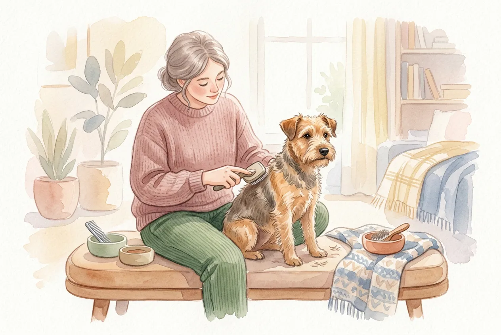
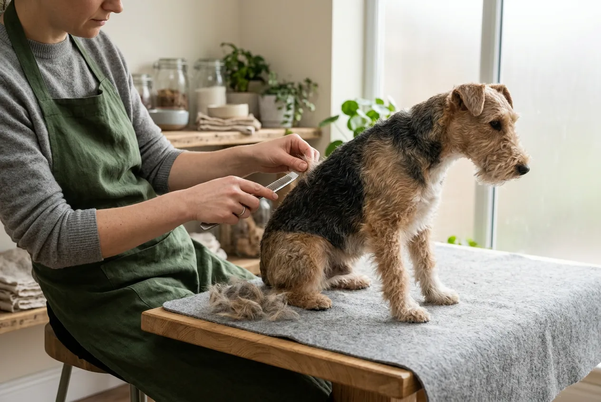
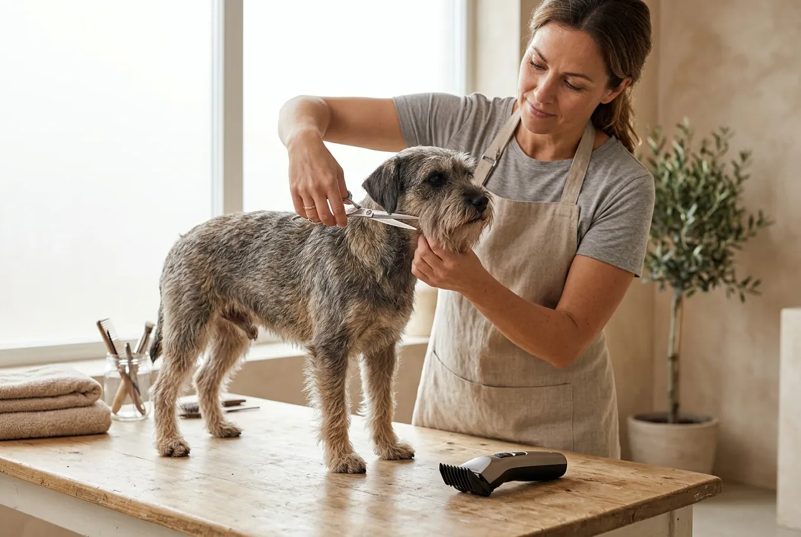
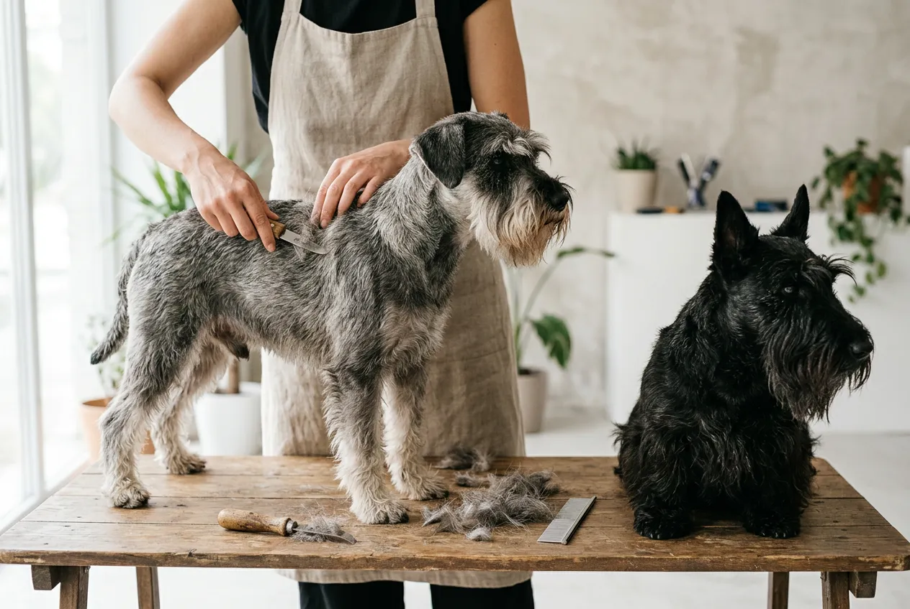
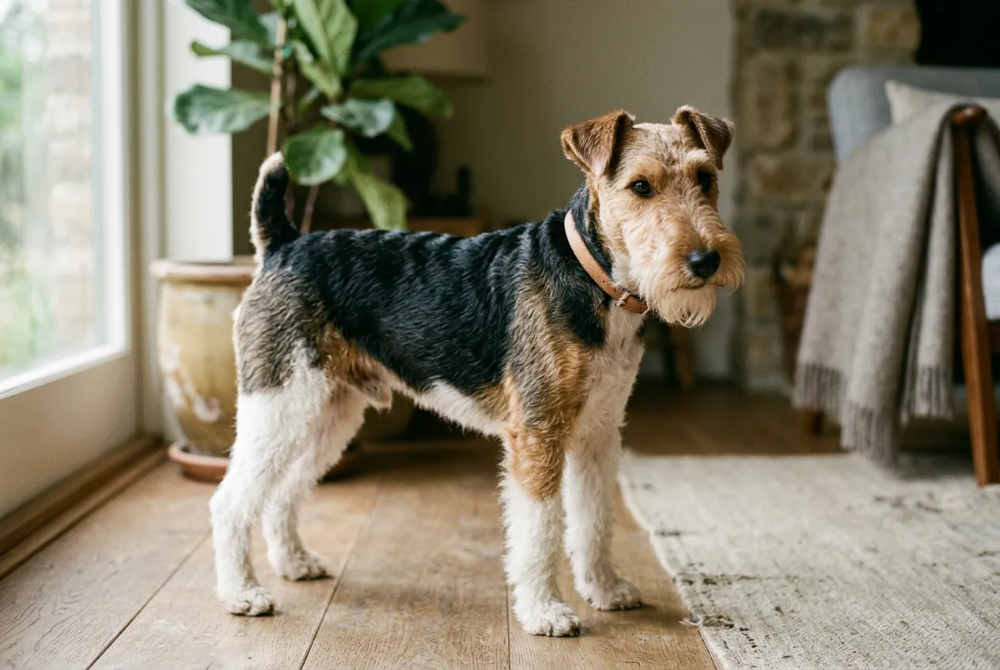

Hund trimmen bedeutet, abgestorbenes Deckhaar fachgerecht von Hand auszuzupfen -- eine Pflegetechnik, die für alle drahthaarigen Rassen unverzichtbar ist. Während weiches Fell durch regelmäßiges Bürsten gepflegt wird, benötigen Terrier, Schnauzer und Rauhaardackel das sogenannte Handstripping, um ihre typische Fellstruktur und natürliche Schutzfunktion zu erhalten.

In diesem Ratgeber erfährst du, welche Hunderassen getrimmt werden müssen, warum Trimmen besser als Scheren ist und wie du deinen Hund Schritt für Schritt selbst trimmen kannst. Dazu bekommst du eine Übersicht über das richtige Werkzeug, typische Fehler und Kosten beim Hundefriseur.

Zusammenfassung: Hund trimmen

<ul>
<li><strong>Was ist Trimmen?</strong> -- Abgestorbenes Deckhaar wird von Hand ausgezupft, nicht geschnitten oder geschoren</li>
<li><strong>Welche Rassen?</strong> -- Alle drahthaarigen Hunde: Terrier (Cairn Terrier, Airedale Terrier, Fox Terrier), Schnauzer, Rauhaardackel</li>
<li><strong>Wie oft?</strong> -- Alle 8–12 Wochen oder wöchentlich als Rolling Coat</li>
<li><strong>Scheren verboten</strong> -- Scheren zerstört die Drahtfell-Struktur dauerhaft und beeinträchtigt die Schutzfunktion</li>
<li><strong>Werkzeug</strong> -- Trimmmesser, Trimmstein und Striegel sind die drei Grundwerkzeuge</li>
</ul>

8–12

Wochen Trimm-Intervall

30+

Rassen mit Drahtfell

50–150 €

Kosten beim Hundefriseur

3

Grundwerkzeuge nötig

## Was bedeutet Trimmen beim Hund?

Trimmen -- auch Handstripping genannt -- ist eine spezielle Fellpflegetechnik, bei der abgestorbenes, raues Deckhaar mit den Fingern oder einem Trimmmesser ausgezupft wird. Das Haar wird dabei mitsamt der Wurzel entfernt, sodass Platz für neues, kräftiges Fell entsteht.

### Unterschied zum normalen Bürsten

Beim Bürsten werden nur lose Haare und Unterwolle aus dem Fell gekämmt. Das Deckhaar bleibt dabei unberührt. Beim Trimmen hingegen wird gezielt das harte Deckhaar bearbeitet, das bei drahthaarigen Rassen nach einer Wachstumsphase von 12–16 Wochen abstirbt und nicht von selbst ausfällt.

### Warum ist Trimmen notwendig?

Drahthaariges Fell hat einen natürlichen Wachstumszyklus: Das Haar wächst, wird hart und stirbt ab -- fällt aber nicht aus. Ohne Trimmen verstopfen die abgestorbenen Haare die Haarfollikel. Die Folge: Das Fell wird stumpf, verfilzt und verliert seine wetterfeste Schutzfunktion. Regelmäßiges Trimmen hält den natürlichen Fellzyklus aufrecht und sorgt für gesundes, glänzendes Fell.

📖

Definition: Handstripping

Handstripping bezeichnet das manuelle Auszupfen abgestorbener Deckhaare bei drahthaarigen Hunden. Die Technik erhält die natürliche Fellstruktur und Farbintensität, da das Haar mitsamt Wurzel entfernt wird und kräftig nachwachsen kann.

## Hund trimmen oder scheren -- was ist der Unterschied?

Trimmen und Scheren sind grundlegend verschiedene Techniken mit unterschiedlichen Auswirkungen auf das Fell. Die Wahl der falschen Methode kann das Fell eines drahthaarigen Hundes dauerhaft schädigen.

Beim Trimmen wird das Haar mitsamt der abgestorbenen Wurzel entfernt. Neues Fell wächst kräftig, drahtig und farbintensiv nach. Beim Scheren wird das Haar lediglich oberflächlich gekürzt -- die tote Haarwurzel bleibt im Follikel stecken und blockiert das gesunde Nachwachsen.

Trimmen ✓

<ul>
<li>Entfernt Haar mitsamt Wurzel</li>
<li>Neues Fell wächst drahtig und farbintensiv nach</li>
<li>Erhält die natürliche Schutzfunktion des Fells</li>
<li>Fördert gesunde Haut und Durchblutung</li>
<li>Fellstruktur bleibt dauerhaft erhalten</li>
</ul>

Scheren ✗

<ul>
<li>Kürzt nur das Haar an der Oberfläche</li>
<li>Fell wird weich, watteartig und verliert Farbe</li>
<li>Schutzfunktion gegen Nässe und Kälte geht verloren</li>
<li>Abgestorbene Wurzeln verstopfen die Follikel</li>
<li>Fellstruktur kann dauerhaft geschädigt werden</li>
</ul>

⚠️

<strong>Drahthaarige Hunde niemals scheren</strong>

Wird ein drahthaariger Hund wiederholt geschoren, verändert sich die Fellstruktur dauerhaft. Das einst raue, wetterfeste Deckhaar wird weich und flauschig. In vielen Fällen lässt sich die ursprüngliche Drahtigkeit auch durch späteres Trimmen nicht mehr vollständig wiederherstellen.

Für Hunde mit weichem Fell -- etwa Pudel, Malteser oder Shih Tzu -- ist Scheren dagegen die richtige Methode. Diese Rassen haben kein drahtiges Deckhaar und profitieren nicht vom Trimmen. Wenn du dir unsicher bist, welchen [Felltyp dein Hund hat](https://hundewissen-mit-kopf.de/hundepflege/fellpflege-hund/), hilft ein Blick auf die Rassestandards oder eine Beratung beim Hundefriseur.

| Merkmal | Trimmen | Scheren |
|---|---|---|
| Technik | Haar wird ausgezupft | Haar wird geschnitten |
| Geeignet für | Drahthaariges Fell | Weiches, seidiges Fell |
| Fellqualität danach | Drahtig, farbintensiv | Weich, heller |
| Schutzfunktion | Bleibt erhalten | Kann verloren gehen |
| Schmerzempfinden | Schmerzfrei bei reifem Fell | Schmerzfrei |
| Zeitaufwand | 60–120 Minuten | 30–60 Minuten |

## Welche Hunderassen müssen getrimmt werden?

Alle Hunderassen mit doppelschichtigem, drahtigem Fell müssen regelmäßig getrimmt werden. Dieses Fell besteht aus einer weichen, dichten Unterwolle und einem harschen, wasserabweisenden Deckhaar. Laut VDH betrifft das über 30 anerkannte Rassen -- vor allem aus der Gruppe der Terrier und Schnauzer.

### Terrier-Rassen

Terrier bilden die größte Gruppe der trimmpflichtigen Rassen. Der Cairn Terrier, einer der ältesten schottischen Terrier, besitzt ein besonders dichtes, wetterfestes Drahtfell, das alle 8–10 Wochen getrimmt werden sollte. Der Airedale Terrier -- mit bis zu 61 cm Schulterhöhe der größte aller Terrier -- benötigt aufgrund seiner Fellmenge einen Trimmaufwand von 90–120 Minuten pro Sitzung.

Weitere trimmpflichtige Terrier sind:

- **West Highland White Terrier** -- dichtes, weißes Drahtfell, alle 8–10 Wochen trimmen
- **Fox Terrier (Drahthaar)** -- klassisches Trimmfell, alle 10–12 Wochen
- **Irish Terrier** -- rotes Drahtfell, alle 8–12 Wochen
- **Scottish Terrier** -- besonders dichtes Fell, alle 8–10 Wochen
- **Border Terrier** -- pflegeleichtes Drahtfell, alle 10–12 Wochen
- **Norfolk und Norwich Terrier** -- kompaktes Drahtfell, alle 10–12 Wochen
- **Welsh Terrier** -- ähnliche Fellstruktur wie der Airedale Terrier

### Schnauzer und andere Rassen

Neben Terriern gibt es weitere Rassen, die regelmäßiges Trimmen benötigen. Schnauzer in allen drei Größenvarianten -- Zwerg-, Mittel- und Riesenschnauzer -- besitzen typisches Drahtfell mit dem charakteristischen Bart und den buschigen Augenbrauen.

- **Rauhaardackel** -- drahtiges Fell am gesamten Körper, alle 10–12 Wochen
- **Deutsch Drahthaar** -- robustes Jagdhundfell, alle 12–16 Wochen
- **Griffon (Brüsseler, Belgischer)** -- feines Drahtfell, alle 8–10 Wochen
- **Spinone Italiano** -- raues, dichtes Fell, alle 12 Wochen

🐕

Terrier

Cairn Terrier, Airedale Terrier, Fox Terrier, West Highland White Terrier, Irish Terrier, Scottish Terrier

🐾

Schnauzer

Zwergschnauzer, Mittelschnauzer, Riesenschnauzer -- alle mit typischem Bart und Drahtfell

🦮

Jagdhunde

Rauhaardackel, Deutsch Drahthaar, Griffon Korthals -- robustes Arbeitsfell

🐶

Weitere Rassen

Brüsseler Griffon, Spinone Italiano, Irischer Wolfshund (teilweise)

## Wie erkenne ich, ob mein Hund getrimmt werden muss?

Ob dein Hund getrimmt werden muss, erkennst du an seiner Fellstruktur. Drahthaariges Fell fühlt sich rau und borstig an -- ähnlich wie ein Topfreiniger. Wenn du eine Haarsträhne zwischen Daumen und Zeigefinger rollst und sie sich hart anfühlt, handelt es sich um Drahtfell.

### Anzeichen für trimmreifes Fell

Reifes, trimmfähiges Fell lässt sich leicht und schmerzfrei auszupfen. Folgende Anzeichen deuten darauf hin, dass dein Hund getrimmt werden sollte:

- **Fell wirkt stumpf und glanzlos** -- das Deckhaar hat seine Lebensdauer erreicht
- **Haare lassen sich leicht auszupfen** -- ein kurzer Zupftest am Rücken zeigt, ob das Fell reif ist
- **Fell fühlt sich weicher an als üblich** -- überreifes Drahtfell verliert seine Härte
- **Vermehrtes Kratzen** -- abgestorbene Haare können die Haut reizen
- **Fell steht ab oder wirkt struppig** -- die Haare haben ihre natürliche Spannung verloren

Wenn dein Hund vermehrt Fell verliert, kann das bei drahthaarigen Rassen ein zusätzliches Zeichen für überfälliges Trimmen sein.

💡

<strong>Der Zupftest</strong>

Greife eine kleine Haarsträhne am Rücken deines Hundes zwischen Daumen und Zeigefinger und ziehe leicht. Lösen sich die Haare fast widerstandslos, ist das Fell trimmreif. Sitzen die Haare noch fest, ist der richtige Zeitpunkt noch nicht gekommen.

## Hund trimmen: Anleitung in 5 Schritten

Mit der richtigen Technik und etwas Übung kannst du deinen Hund zu Hause selbst trimmen. Plane für die erste Sitzung etwa 90–120 Minuten ein -- mit Routine verkürzt sich die Zeit auf 45–60 Minuten.

1

Fell vorbereiten

Bürste das Fell gründlich durch und entferne Verfilzungen. Wasche den Hund <strong>nicht</strong> vor dem Trimmen -- sauberes Fell ist zu glatt zum Greifen.

2

Unterwolle entfernen

Ziehe mit einem Striegel oder Unterwollkamm die lose Unterwolle heraus. So erreichst du das Deckhaar besser und das Trimmergebnis wird gleichmäßiger.

3

Deckhaar trimmen

Klemme kleine Haarsträhnen zwischen Daumen und Trimmmesser. Ziehe die Haare in Wuchsrichtung mit kurzem, gleichmäßigem Ruck heraus. Arbeite systematisch vom Nacken über den Rücken zu den Flanken.

4

Feinarbeit an Kopf und Pfoten

Trimme Kopf, Ohren und Pfoten vorsichtig mit dem Trimmmesser oder den Fingern. An empfindlichen Stellen wie Bauch und Innenschenkeln arbeite besonders behutsam.

✓

Nachbearbeitung

Bürste das Fell abschließend durch und kontrolliere das Ergebnis auf gleichmäßige Länge. Belohne deinen Hund ausgiebig für seine Geduld.

### Wichtige Technik-Tipps

Die korrekte Handhaltung ist entscheidend für schmerzfreies Trimmen. Halte die Haut mit einer Hand straff, während du mit der anderen Hand die Haare auszupfst. Ziehe immer in Wuchsrichtung des Fells -- niemals dagegen. Kleine, kurze Züge sind effektiver und angenehmer für den Hund als lange, kraftvolle Bewegungen.

Beginne immer am Rücken, da hier das Fell am dicksten ist und der Hund die Berührung am besten toleriert. Arbeite dich dann zu den empfindlicheren Bereichen wie Kopf, Bauch und Pfoten vor.

ℹ️

<strong>Pfoten trimmen nicht vergessen</strong>

Auch zwischen den Ballen und an den Pfoten wächst bei drahthaarigen Hunden überschüssiges Fell. Dieses sollte regelmäßig gekürzt werden, damit dein Hund auf glatten Böden nicht rutscht und sich kein Schmutz festsetzt.

## Das richtige Werkzeug zum Hund trimmen

Für das Trimmen zu Hause benötigst du drei Grundwerkzeuge. Hochwertiges Trimmwerkzeug erleichtert die Arbeit erheblich und sorgt für ein besseres Ergebnis.

### Trimmmesser

Das Trimmmesser ist das wichtigste Werkzeug beim Trimmen. Es hat eine stumpfe, gezahnte Klinge, die das Haar zwischen Daumen und Messer festklemmt, ohne es zu schneiden. Trimmmesser gibt es in verschiedenen Zahnungen: grob (für dickes Deckhaar), mittel (Allrounder) und fein (für empfindliche Stellen wie Kopf und Ohren).

### Trimmstein

Der Trimmstein -- auch Bimsstein oder Lavastein genannt -- eignet sich besonders gut für die Feinarbeit und für Einsteiger. Er greift das Haar schonend und ermöglicht ein kontrolliertes Arbeiten. Viele Hundehalter nutzen den Trimmstein zum Hund trimmen an empfindlichen Stellen wie Ohren und Kopf.

### Striegel und Unterwollkamm

Der Striegel entfernt lose Unterwolle vor dem eigentlichen Trimmen. Ein Unterwollkamm -- auch Furminator genannt -- hilft zusätzlich bei Rassen mit besonders dichter Unterwolle wie dem Airedale Terrier.

| Werkzeug | Einsatzbereich | Preisspanne | Für Einsteiger? |
|---|---|---|---|
| Trimmmesser (grob) | Rücken, Flanken, dickes Deckhaar | 15–40 € | Ja |
| Trimmmesser (fein) | Kopf, Ohren, empfindliche Stellen | 15–40 € | Für Fortgeschrittene |
| Trimmstein | Feinarbeit, empfindliche Bereiche | 5–15 € | Sehr gut geeignet |
| Striegel | Unterwolle entfernen, Vorbereitung | 8–20 € | Ja |
| Fingerling (Gummi) | Besserer Grip beim Fingertrimmen | 3–8 € | Ja |

💡

<strong>Trimmkreide für besseren Halt</strong>

Trimmkreide oder Trimmpuder auf den Fingern verbessert den Grip erheblich. Besonders bei feinem oder kurzem Fell hilft das Puder, die Haare sicher zu fassen. Alternativ funktionieren auch Latex-Fingerüberzüge.

## Was ist ein Rolling Coat?

Rolling Coat ist eine fortgeschrittene Trimmtechnik, bei der das Fell wöchentlich in kleinen Portionen bearbeitet wird. Statt alle 8–12 Wochen das gesamte Fell auf einmal zu trimmen, wird beim Rolling Coat jede Woche nur der älteste, reifste Fellanteil entfernt.

### Vorteile des Rolling Coat

Der Rolling Coat sorgt dafür, dass der Hund zu jeder Zeit ein gleichmäßig gepflegtes Fell hat. Es gibt keine Phase, in der das Fell nach dem Trimmen besonders kurz oder dünn wirkt. Für Ausstellungshunde ist diese Technik Standard, da das Fell immer in optimalem Zustand sein muss.

Der wöchentliche Aufwand beträgt nur 15–20 Minuten -- deutlich weniger als eine vollständige Trimmsitzung. Allerdings erfordert die Technik Erfahrung, da du erkennen musst, welche Haare reif sind und welche noch wachsen.

### Rolling Coat vs. Kompletttrimm

| Merkmal | Rolling Coat | Kompletttrimm |
|---|---|---|
| Häufigkeit | Wöchentlich (15–20 Min.) | Alle 8–12 Wochen (60–120 Min.) |
| Felloptik | Immer gleichmäßig | Kurz nach Trimm, dann nachwachsend |
| Schwierigkeitsgrad | Fortgeschritten | Einsteiger-geeignet |
| Für Ausstellungen | Ideal | Weniger geeignet |
| Stresslevel für den Hund | Gering (kurze Sitzungen) | Mittel (lange Sitzung) |

## Hund ans Trimmen gewöhnen

Drahthaarige Hunde sollten bereits im Welpenalter an das Trimmen gewöhnt werden. Ab einem Alter von 12–16 Wochen kannst du mit dem ersten leichten Trimmen beginnen -- zu diesem Zeitpunkt ist das Welpenfell meist noch weich, aber der Hund lernt die Prozedur kennen.

### Training in kleinen Schritten

Beginne mit kurzen Sitzungen von 5–10 Minuten. Lass den Welpen das Trimmmesser beschnuppern und berühre ihn damit sanft, ohne zu trimmen. Belohne ruhiges Verhalten mit Leckerlis. Steigere die Dauer schrittweise über mehrere Wochen.

Ein stabiler, rutschfester Tisch in angenehmer Arbeitshöhe ist wichtig. Der Hund sollte sicher stehen und sich nicht unkontrolliert bewegen können. Viele Hundefriseure verwenden spezielle Trimmtische mit Galgen, an dem der Hund sanft fixiert wird.

✅

<strong>Positive Verknüpfung schaffen</strong>

Verknüpfe das Trimmen von Anfang an mit positiven Erlebnissen. Leckerlis, ruhiges Loben und Pausen sorgen dafür, dass dein Hund das Trimmen als angenehme Routine akzeptiert. Die meisten Hunde entspannen sich nach wenigen Sitzungen deutlich.

Wenn dein Hund beim Trimmen [unruhig wird oder bellt](https://hundewissen-mit-kopf.de/erziehung-verhalten/hund-bellt-staendig/), brich die Sitzung ruhig ab und versuche es am nächsten Tag erneut. Zwang führt dazu, dass der Hund das Trimmen dauerhaft mit Stress verbindet.

## 3 häufige Fehler beim Hund trimmen

Beim Trimmen zu Hause passieren besonders Einsteigern typische Fehler, die das Fell schädigen oder dem Hund unangenehm sind. Diese drei Fehler solltest du unbedingt vermeiden.

### Fehler 1: Zu frühes Trimmen

Wird Fell getrimmt, das noch nicht reif ist, sitzt es fest in der Haut und lässt sich nur mit Kraft entfernen. Das ist für den Hund schmerzhaft und kann die Haarfollikel beschädigen. Mache immer den Zupftest: Nur Fell, das sich leicht und widerstandslos löst, ist trimmreif.

### Fehler 2: Gegen die Wuchsrichtung ziehen

Haare gegen die Wuchsrichtung auszuzupfen ist schmerzhaft und kann die Haut reizen. Trimme immer in der natürlichen Wuchsrichtung des Fells -- das ist in der Regel vom Kopf in Richtung Rute.

### Fehler 3: Zu große Haarmengen auf einmal greifen

Greifst du zu viele Haare gleichzeitig, erhöht sich der Widerstand und das Trimmen wird unangenehm. Arbeite mit kleinen Strähnen von 10–20 Haaren. Das dauert zwar länger, ist aber deutlich schonender für den Hund und liefert ein gleichmäßigeres Ergebnis.

🚫

<strong>Niemals mit der Schere nachhelfen</strong>

Schneide beim Trimmen keine Haare mit der Schere ab -- auch nicht an schwer erreichbaren Stellen. Geschnittenes Drahtfell wächst weich und farblos nach, genau wie beim Scheren. Nutze stattdessen den Trimmstein für Feinarbeit an empfindlichen Bereichen.

## Was kostet Trimmen beim Hundefriseur?

Die Kosten für professionelles Trimmen beim Hundefriseur variieren je nach Rasse, Fellzustand und Region. Als Orientierung: Ein professioneller Hundefriseur berechnet zwischen 50 und 150 Euro pro Trimmsitzung.

| Rasse | Dauer | Kosten (ca.) |
|---|---|---|
| Cairn Terrier | 45–60 Min. | 50–80 € |
| West Highland White Terrier | 45–60 Min. | 50–80 € |
| Border Terrier | 30–45 Min. | 40–65 € |
| Fox Terrier | 60–90 Min. | 60–100 € |
| Zwergschnauzer | 60–75 Min. | 55–85 € |
| Airedale Terrier | 90–120 Min. | 80–150 € |
| Riesenschnauzer | 90–120 Min. | 90–150 € |

Regelmäßiges Trimmen alle 8–12 Wochen reduziert den Aufwand pro Sitzung erheblich. Wird das Fell über Monate nicht getrimmt, ist der Erstaufwand beim Hundefriseur deutlich höher -- sowohl zeitlich als auch finanziell. Manche Hundefriseure bieten Paketpreise an, wenn du regelmäßige Termine buchst.

💡

<strong>Hundefriseur sorgfältig auswählen</strong>

Achte darauf, dass der Hundefriseur tatsächlich trimmt und nicht schert. Frage gezielt nach Handstripping-Erfahrung und bitte um Referenzen. Ein guter Hundefriseur zeigt dir auf Wunsch auch die Grundtechnik, damit du zwischen den Terminen selbst nacharbeiten kannst.

## Trimmen bei verschiedenen Felltypen

Nicht jedes Drahtfell ist gleich. Die Fellstruktur variiert zwischen den Rassen erheblich, was unterschiedliche Trimmtechniken erfordert.

### Hartes, dichtes Drahtfell

Rassen wie der Airedale Terrier und der Riesenschnauzer besitzen besonders hartes, dichtes Deckhaar. Dieses Fell erfordert ein grobgezahntes Trimmmesser und etwas mehr Kraft beim Auszupfen. Dafür ist das Fell sehr robust und verzeiht kleine Technikfehler besser.

### Feines Drahtfell

Der Brüsseler Griffon und der Norfolk Terrier haben feineres Drahtfell, das vorsichtiger bearbeitet werden muss. Hier eignet sich ein feingezahntes Trimmmesser oder der Trimmstein besonders gut. Die Sitzungen sind kürzer, sollten aber häufiger stattfinden -- etwa alle 6–8 Wochen.

### Gemischtes Fell

Einige Rassen wie der Irische Wolfshund haben eine Mischung aus drahtigem und weicherem Fell. Hier wird nur das drahtige Deckhaar getrimmt, während die weicheren Partien gebürstet oder bei Bedarf mit der Schere in Form gebracht werden. Wenn du unsicher bist, ob [dein Hund im Winter zusätzlichen Schutz braucht](https://hundewissen-mit-kopf.de/hundeausstattung/braucht-hund-einen-mantel/), sprich mit deinem Hundefriseur über den Fellzustand.

## Pflege zwischen den Trimm-Terminen

Zwischen den Trimmsitzungen benötigt drahthaariges Fell regelmäßige Pflege, um in gutem Zustand zu bleiben. Eine gründliche [Fellpflege-Routine](https://hundewissen-mit-kopf.de/hundepflege/fellpflege-hund/) hält das Fell gesund und erleichtert das nächste Trimmen.

### Wöchentliche Pflege

Bürste deinen drahthaarigen Hund 2–3 Mal pro Woche mit einem Striegel oder einer Drahtbürste. Das entfernt lose Unterwolle und verhindert Verfilzungen. Kontrolliere dabei regelmäßig Ohren, Pfoten und Barthaare auf Verschmutzungen.

### Baden und Waschen

Drahthaarige Hunde sollten so selten wie möglich [gebadet werden](https://hundewissen-mit-kopf.de/hundepflege/hund-baden/). Wasser und Shampoo weichen das Drahtfell auf und können die natürliche Fettschicht zerstören. Wenn ein Bad unvermeidbar ist, verwende ein mildes Hundeshampoo und trimme frühestens 3–4 Tage danach -- nasses oder frisch gewaschenes Fell lässt sich schlecht greifen.

✅ Pflege-Checkliste zwischen den Trimm-Terminen

✓

2–3x wöchentlich mit Striegel bürsten

✓

Barthaare nach dem Fressen reinigen

✓

Pfoten und Zwischenzehenbereich kontrollieren

✓

Ohrenhaare regelmäßig auszupfen

Zupftest alle 2 Wochen durchführen (Trimmreife prüfen)

Bei Bedarf: Pfoten trimmen und Krallen kürzen

## Hund trimmen: Selbst machen oder zum Hundefriseur?

Die Entscheidung, ob du deinen Hund selbst trimmst oder einen professionellen Hundefriseur aufsuchst, hängt von deiner Erfahrung und der Rasse ab. Beide Optionen haben ihre Berechtigung.

Für Einsteiger empfiehlt sich ein kombinierter Ansatz: Lass die ersten 2–3 Trimmsitzungen von einem erfahrenen Hundefriseur durchführen und bitte um eine Einweisung in die Grundtechnik. Viele Hundefriseure und Züchter bieten auch Trimmkurse an, in denen du die Handgriffe unter Anleitung übst.

Erfahrene Hundehalter, die ihren Hund regelmäßig selbst trimmen, sparen langfristig erhebliche Kosten. Bei einem Trimm-Intervall von 10 Wochen und Kosten von 70 Euro pro Sitzung beim Hundefriseur ergibt das rund 350 Euro pro Jahr. Das Grundwerkzeug für zu Hause kostet einmalig 40–80 Euro.

📖

<strong>Grooming als Bindungszeit</strong>

Laut Verhaltensforschern stärkt regelmäßiges Grooming -- also Fellpflege und Trimmen -- die Bindung zwischen Hund und Halter. Die ruhige, körpernahe Arbeit am Fell entspricht dem natürlichen Sozialverhalten von Hunden und wird von den meisten Tieren als angenehm empfunden.

## Fazit: Hund trimmen erhält gesundes, schönes Fell

Regelmäßiges Trimmen ist für alle drahthaarigen Hunde -- von Terriern über Schnauzer bis zu Rauhaardackeln -- unverzichtbar für gesundes, funktionsfähiges Fell. Die Technik des Handstrippings entfernt abgestorbenes Deckhaar mitsamt der Wurzel und ermöglicht kräftiges, farbintensives Nachwachsen.

Der wichtigste Grundsatz: Drahthaarige Hunde trimmen, niemals scheren. Mit dem richtigen Werkzeug -- Trimmmesser, Trimmstein und Striegel -- und etwas Übung kannst du deinen Hund problemlos zu Hause trimmen. Plane alle 8–12 Wochen eine Trimmsitzung ein oder pflege das Fell im Rolling-Coat-Verfahren wöchentlich.

Wenn du unsicher bist, starte mit einer professionellen Sitzung beim Hundefriseur und lass dir die Technik zeigen. Dein Hund wird es dir mit einem gepflegten, gesunden Fell danken -- und du wirst schnell merken, dass das Trimmen zur entspannten Routine wird.

