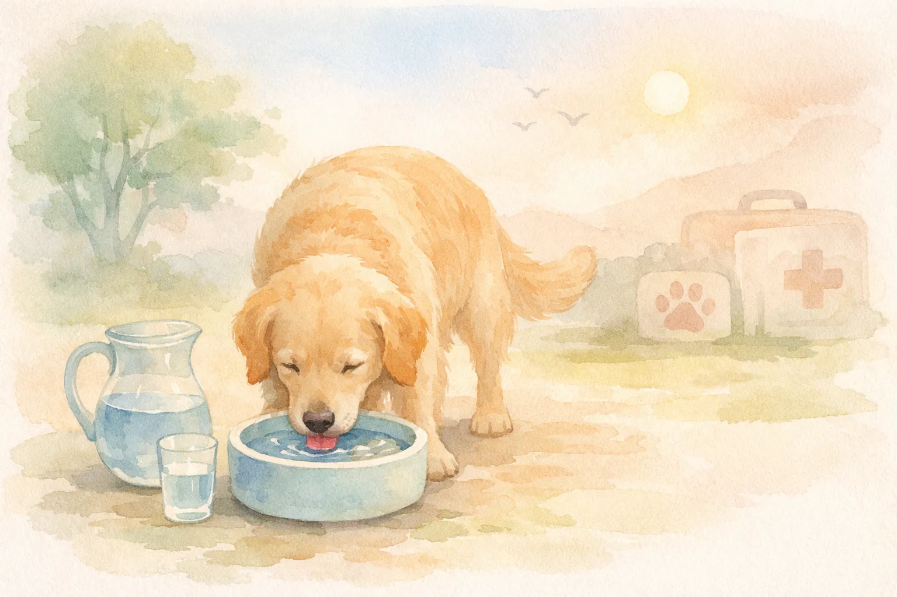

Ein Hund trinkt viel Wasser -- und du fragst dich, ob das noch normal ist oder ein Warnsignal für eine Erkrankung? Die gute Nachricht: Nicht jeder erhöhte Durst deutet auf ein Gesundheitsproblem hin. Hitze, Bewegung oder Trockenfutter sind häufige harmlose Gründe. Wenn dein Hund jedoch plötzlich und dauerhaft deutlich mehr trinkt als gewöhnlich, können ernsthafte Erkrankungen wie Diabetes mellitus, Cushing Syndrom oder Niereninsuffizienz dahinterstecken.

In diesem Ratgeber erfährst du, welche Trinkmenge für Hunde normal ist, wie du den Wasserverbrauch deines Hundes zuverlässig misst und welche Ursachen hinter übermäßigem Durst stecken können. Außerdem zeigen wir dir, ab wann ein Tierarzt aufgesucht werden sollte und was du selbst tun kannst.

<h4>Zusammenfassung: Hund trinkt viel Wasser</h4>
<ul>
<li><strong>Normale Trinkmenge</strong> -- Gesunde Hunde trinken 40 bis 60 ml Wasser pro Kilogramm Körpergewicht am Tag</li>
<li><strong>Ab wann zu viel?</strong> -- Über 100 ml pro Kilogramm gilt als Polydipsie und sollte tierärztlich abgeklärt werden</li>
<li><strong>Harmlose Ursachen</strong> -- Hitze, Trockenfutter, Bewegung, Stress oder Medikamente können den Durst steigern</li>
<li><strong>Krankhafte Ursachen</strong> -- Diabetes mellitus, Cushing Syndrom, Niereninsuffizienz und Gebärmutterentzündung zählen zu den häufigsten Auslösern</li>
<li><strong>Tierarzt aufsuchen</strong> -- Bei plötzlich erhöhtem Durst über mehr als 2 Tage ohne erkennbare Ursache ist ein Tierarztbesuch dringend empfohlen</li>
</ul>

40–60 ml/kg

Normale Trinkmenge pro Tag

> 100 ml/kg

Polydipsie-Grenzwert

8–10 %

Wassergehalt Trockenfutter

70–80 %

Wassergehalt Nassfutter

## Wie viel Wasser sollte ein Hund am Tag trinken?

Die normale Trinkmenge eines Hundes liegt bei 40 bis 60 ml pro Kilogramm Körpergewicht innerhalb von 24 Stunden. Ein 10 kg schwerer Hund benötigt demnach etwa 400 bis 600 ml Wasser täglich, während ein 30 kg schwerer Hund zwischen 1,2 und 1,8 Litern trinken sollte.

Diese Richtwerte variieren je nach Futterart, Aktivitätslevel, Außentemperatur und Alter des Hundes. Welpen und laktierende Hündinnen haben einen höheren Flüssigkeitsbedarf als erwachsene Hunde in Ruhe.

### Trinkmenge nach Körpergewicht berechnen

Die folgende Tabelle gibt dir eine schnelle Orientierung, wie viel Wasser dein Hund täglich trinken sollte:

| Körpergewicht | Normale Trinkmenge (40–60 ml/kg) | Grenzwert Polydipsie (> 100 ml/kg) |
|---|---|---|
| 5 kg (z. B. Chihuahua) | 200–300 ml | ab 500 ml |
| 10 kg (z. B. Dackel) | 400–600 ml | ab 1.000 ml |
| 20 kg (z. B. Beagle) | 800–1.200 ml | ab 2.000 ml |
| 30 kg (z. B. Labrador) | 1.200–1.800 ml | ab 3.000 ml |
| 40 kg (z. B. Schäferhund) | 1.600–2.400 ml | ab 4.000 ml |

### Der Einfluss von Futterart auf die Trinkmenge

Hunde, die ausschließlich Trockenfutter fressen, trinken deutlich mehr Wasser als Hunde mit Nassfutter-Ernährung. Trockenfutter enthält nur etwa 8 bis 10 Prozent Feuchtigkeit. Nassfutter liefert dagegen rund 70 bis 80 Prozent Wasser, sodass ein großer Teil des Flüssigkeitsbedarfs bereits über die Nahrung gedeckt wird.

Bei einer Umstellung von Nassfutter auf Trockenfutter steigt die Trinkmenge deshalb ganz natürlich an. Das ist kein Grund zur Sorge -- solange die Gesamtaufnahme im normalen Bereich bleibt. Auch [frisches Obst wie Äpfel](https://hundewissen-mit-kopf.de/hundeernaehrung/duerfen-hunde-aepfel-essen/) kann als wasserreicher Snack zur Flüssigkeitszufuhr beitragen.

💡

<strong>Tipp: Futterart bei der Beurteilung berücksichtigen</strong>

Bevor du dir Sorgen machst, prüfe zuerst, welches Futter dein Hund bekommt. Ein Hund, der nur Trockenfutter frisst, trinkt oft das Doppelte eines Nassfutter-Hundes -- und das ist völlig normal.

## Hund trinkt viel: So misst du die Trinkmenge richtig

Bevor du beurteilen kannst, ob dein Hund zu viel Wasser trinkt, musst du die tatsächliche Trinkmenge kennen. Schätzungen sind dabei unzuverlässig -- eine einfache Messmethode liefert verlässliche Ergebnisse.

### Schritt-für-Schritt-Anleitung zum Messen

1

<h4>Messbecher bereitstellen</h4>

Fülle morgens eine genau abgemessene Menge Wasser in den Napf deines Hundes. Notiere die Menge in Millilitern.

2

<h4>Nachfüllen dokumentieren</h4>

Jedes Mal, wenn du Wasser nachfüllst, notiere die nachgefüllte Menge. Achte darauf, dass dein Hund keinen Zugang zu anderen Wasserquellen hat.

3

<h4>Restmenge abmessen</h4>

Messe abends die verbleibende Wassermenge im Napf. Ziehe sie von der Gesamtmenge ab, die du eingefüllt hast.

✓

<h4>Trinkmenge berechnen</h4>

Teile die getrunkene Menge durch das Körpergewicht deines Hundes. Ergebnis über 100 ml/kg? Ab zum Tierarzt.

Führe diese Messung an mindestens 3 aufeinanderfolgenden Tagen durch. Einzelne Ausreißer -- etwa nach einem langen Spaziergang bei Hitze -- sind normal. Erst ein dauerhaft erhöhter Wert über mehrere Tage ist aussagekräftig.

ℹ️

<strong>Wichtig: Alle Wasserquellen erfassen</strong>

Vergiss nicht, auch Wasser aus Pfützen, Toiletten oder dem Gartenteich einzukalkulieren. Idealerweise beschränkst du den Zugang während der Messphase auf einen einzigen Napf.

## Harmlose Ursachen: Warum dein Hund viel Wasser trinkt

Nicht jeder erhöhte Durst ist ein Warnsignal. Zahlreiche alltägliche Faktoren können dazu führen, dass ein Hund vorübergehend mehr trinkt als üblich. Tierärzte unterscheiden zwischen situativ erhöhtem Durst und krankhaft gesteigertem Trinkverhalten.

### Hitze und hohe Temperaturen

Hunde regulieren ihre Körpertemperatur hauptsächlich über Hecheln. Dabei verdunstet Wasser über die Zunge und die Atemwege. An heißen Sommertagen mit Temperaturen über 25 °C kann sich die Trinkmenge eines Hundes um das 1,5- bis 2-Fache erhöhen. Das ist ein normaler physiologischer Ausgleich.

### Körperliche Aktivität und Bewegung

Nach intensiver Bewegung -- etwa langen Wanderungen, Agility-Training oder ausgiebigem Toben -- steigt der Flüssigkeitsbedarf deutlich an. Ein Hund, der eine Stunde intensiv gelaufen ist, kann anschließend 200 bis 400 ml Wasser auf einmal trinken. Dieser Mehrbedarf normalisiert sich innerhalb weniger Stunden.

### Futterumstellung und salzreiche Snacks

Eine Umstellung von Nassfutter auf Trockenfutter führt regelmäßig zu einer höheren Wasseraufnahme. Auch salzhaltige Leckerlis oder Kausnacks können den Durst kurzfristig steigern. Achte deshalb auf den Salzgehalt von Hundesnacks und biete immer ausreichend frisches Wasser an.

### Stress, Aufregung und Verhaltensänderungen

Manche Hunde trinken bei Stress, Aufregung oder Langeweile vermehrt. Dieses sogenannte psychogene Trinken ist keine Erkrankung, sollte aber beobachtet werden. Wenn dein [Hund zusätzlich Verhaltensauffälligkeiten zeigt](https://hundewissen-mit-kopf.de/erziehung-verhalten/hund-bellt-staendig/), kann ein ganzheitlicher Blick auf die Situation helfen.

### Medikamente mit Durst als Nebenwirkung

Bestimmte Medikamente steigern den Durst bei Hunden erheblich. Cortison (Glukokortikoide), Diuretika (Entwässerungsmittel) und einige Antiepileptika gehören zu den häufigsten Auslösern. Wenn dein Hund eines dieser Medikamente erhält und plötzlich viel mehr trinkt, ist das eine erwartbare Nebenwirkung -- sprich aber trotzdem mit deiner Tierärztin darüber.

☀️
<h4>Hitze & Wetter</h4>

Ab 25 °C steigt die Trinkmenge um das 1,5- bis 2-Fache. Normal und unbedenklich.

🏃
<h4>Bewegung & Sport</h4>

Nach intensiver Aktivität 200–400 ml Mehrbedarf. Normalisiert sich in Stunden.

🥣
<h4>Futterumstellung</h4>

Wechsel zu Trockenfutter erhöht Trinkmenge. Kein Grund zur Sorge.

💊
<h4>Medikamente</h4>

Cortison und Diuretika steigern den Durst als bekannte Nebenwirkung.

## Hund trinkt viel: Krankhafte Ursachen erkennen

Wenn harmlose Auslöser ausgeschlossen sind und dein Hund dauerhaft mehr als 80 bis 100 ml pro Kilogramm Körpergewicht trinkt, können ernsthafte Erkrankungen die Ursache sein. Tierärzte bezeichnen krankhaft gesteigerten Durst als Polydipsie. Häufig tritt sie gemeinsam mit vermehrtem Urinieren (Polyurie) auf -- Fachleute sprechen dann vom Polyurie-Polydipsie-Komplex (PU/PD).

📖

<h4>Definition: Polydipsie</h4>

Polydipsie bezeichnet eine krankhaft gesteigerte Wasseraufnahme von mehr als 100 ml pro Kilogramm Körpergewicht am Tag. Sie ist häufig ein Symptom einer zugrundeliegenden Erkrankung und sollte immer tierärztlich abgeklärt werden.

### Diabetes mellitus beim Hund

Diabetes mellitus ist eine der häufigsten Ursachen dafür, dass ein Hund sehr viel Wasser trinkt. Bei dieser Stoffwechselerkrankung produziert die Bauchspeicheldrüse zu wenig Insulin oder die Körperzellen reagieren nicht mehr ausreichend darauf. Glucose gelangt nicht in die Zellen und wird stattdessen über den Urin ausgeschieden -- der Hund uriniert häufiger und trinkt zum Ausgleich mehr.

Typische Symptome neben vermehrtem Durst sind Gewichtsverlust trotz normalem oder gesteigertem Appetit, Müdigkeit und stumpfes Fell. Diabetes mellitus tritt bei Hunden häufig im mittleren bis höheren Alter auf. Unkastrierte Hündinnen sind statistisch häufiger betroffen als Rüden.

### Cushing Syndrom (Hyperadrenokortizismus)

Das Cushing Syndrom gehört zu den häufigsten hormonellen Erkrankungen bei Hunden über 6 Jahren. Die Nebennieren produzieren dabei zu viel Cortisol. Laut tierärztlichen Fachquellen zeigen über 80 Prozent der betroffenen Hunde als erstes Symptom eine deutlich erhöhte Wasseraufnahme.

Weitere Anzeichen für ein Cushing Syndrom sind ein aufgeblähter Bauch (Hängebauch), Haarausfall an den Flanken, dünne Haut, Muskelschwäche und Hecheln. Die Diagnose erfolgt über spezielle Bluttests wie den ACTH-Stimulationstest oder den Low-Dose-Dexamethason-Suppressionstest.

### Chronische Niereninsuffizienz

Bei einer chronischen Niereninsuffizienz verlieren die Nieren ihre Fähigkeit, den Urin ausreichend zu konzentrieren. Der Hund scheidet große Mengen verdünnten Urins aus und muss zum Ausgleich entsprechend mehr Wasser trinken. Diese Erkrankung entwickelt sich schleichend und wird oft erst im fortgeschrittenen Stadium bemerkt.

Laut der Tierärztlichen Hochschule Hannover sind bei Diagnosestellung häufig bereits 65 bis 75 Prozent des funktionellen Nierengewebes zerstört. Frühzeitige Erkennung durch regelmäßige Blutuntersuchungen -- insbesondere bei älteren Hunden -- kann den Krankheitsverlauf deutlich verlangsamen.

### Gebärmutterentzündung (Pyometra)

Die Pyometra ist ein lebensbedrohlicher Notfall, der ausschließlich bei unkastrierten Hündinnen auftritt. Typischerweise entwickelt sie sich 4 bis 8 Wochen nach der Läufigkeit. Vermehrtes Trinken und häufiges Urinieren gehören zu den ersten Warnsignalen.

Bei einer offenen Pyometra tritt eitriger Vaginalausfluss auf. Bei einer geschlossenen Pyometra fehlt dieser Ausfluss -- die Erkrankung ist dann schwerer zu erkennen, aber noch gefährlicher. Ohne Behandlung kann eine Pyometra innerhalb weniger Tage tödlich verlaufen.

🚫

<strong>Achtung: Pyometra ist ein Notfall!</strong>

Wenn eine unkastrierte Hündin plötzlich viel trinkt, lethargisch wirkt und möglicherweise eitrigen Ausfluss zeigt, handelt es sich um einen tierärztlichen Notfall. Sofort eine Tierärztin oder Tierklinik aufsuchen -- eine Verzögerung kann lebensbedrohlich sein.

### Herzinsuffizienz und weitere Ursachen

Auch eine Herzinsuffizienz kann dazu führen, dass ein Hund vermehrt trinkt. Bei einer eingeschränkten Herzleistung wird die Durchblutung der Nieren reduziert, was den Flüssigkeitshaushalt beeinflusst. Zusätzliche Symptome sind Husten (besonders nachts), Leistungsschwäche und schnelle Ermüdung.

Weitere mögliche Ursachen für übermäßigen Durst bei Hunden umfassen Lebererkrankungen, Hypercalcämie (erhöhter Kalziumspiegel), Diabetes insipidus und Addison-Krankheit (Nebennierenrindeninsuffizienz).

## Übersicht: Krankhafte Ursachen und ihre Symptome

Die folgende Tabelle hilft dir, die häufigsten Erkrankungen anhand ihrer Begleitsymptome einzuordnen:

| Erkrankung | Begleitsymptome neben vermehrtem Durst | Häufig betroffen |
|---|---|---|
| Diabetes mellitus | Gewichtsverlust, gesteigerter Appetit, Müdigkeit | Hunde ab 7 Jahren, unkastrierte Hündinnen |
| Cushing Syndrom | Hängebauch, Haarausfall, dünne Haut, Hecheln | Hunde ab 6 Jahren, kleine Rassen |
| Niereninsuffizienz | Appetitlosigkeit, Erbrechen, Gewichtsverlust, Mundgeruch | Ältere Hunde ab 8 Jahren |
| Pyometra | Vaginaler Ausfluss, Lethargie, Fieber, aufgeblähter Bauch | Unkastrierte Hündinnen |
| Herzinsuffizienz | Husten, Leistungsschwäche, schnelle Ermüdung | Ältere Hunde, bestimmte Rassen |
| Lebererkrankung | Gelbfärbung der Schleimhäute, Erbrechen, Durchfall | Alle Altersgruppen |

## Alter Hund trinkt viel: Besonderheiten im Seniorenalter

Ein alter Hund, der plötzlich viel Wasser trinkt, sollte immer tierärztlich untersucht werden. Mit zunehmendem Alter steigt das Risiko für Niereninsuffizienz, Cushing Syndrom und Diabetes mellitus deutlich an. Laut der Deutschen Veterinärmedizinischen Gesellschaft entwickeln etwa 10 Prozent aller Hunde über 10 Jahren eine chronische Nierenerkrankung.

### Regelmäßige Vorsorgeuntersuchungen

Tierärzte empfehlen für Hunde ab 7 Jahren eine jährliche Blutuntersuchung inklusive Nieren- und Leberwerte. Ab einem Alter von 10 Jahren ist eine halbjährliche Kontrolle sinnvoll. Durch frühzeitige Erkennung können viele altersbedingte Erkrankungen wirksam behandelt und das Fortschreiten verlangsamt werden.

### Angepasste Ernährung für ältere Hunde

Ältere Hunde mit Nierenerkrankungen profitieren von einer phosphor- und proteinreduzierten Diät. Spezielle Nierendiät-Futtermittel enthalten angepasste Nährstoffprofile, die die verbleibende Nierenfunktion schonen. Die Umstellung sollte immer in Absprache mit dem Tierarzt erfolgen.

⚠️

<strong>Warnung: Wasser niemals rationieren</strong>

Auch wenn dein Hund auffällig viel trinkt, darfst du den Zugang zu frischem Wasser niemals einschränken. Wasserentzug kann bei bestehenden Erkrankungen zu lebensbedrohlicher Dehydrierung führen. Lass stattdessen die Ursache vom Tierarzt abklären.

## Hund trinkt viel und uriniert viel: Der PU/PD-Komplex

Die Kombination aus vermehrtem Trinken (Polydipsie) und häufigem Urinieren (Polyurie) ist eines der häufigsten Symptompaare in der tierärztlichen Praxis. Medizinisch wird dieses Zusammenspiel als PU/PD-Komplex bezeichnet. Dabei ist es wichtig zu verstehen: In den meisten Fällen beginnt die Kette beim vermehrten Urinieren -- der Hund trinkt mehr, um den Flüssigkeitsverlust auszugleichen.

### Wann wird vermehrtes Urinieren bedenklich?

Ein gesunder Hund uriniert 3- bis 5-mal am Tag und produziert dabei etwa 20 bis 40 ml Urin pro Kilogramm Körpergewicht. Werte über 50 ml pro Kilogramm gelten als Polyurie. Wenn dein Hund plötzlich deutlich häufiger raus muss, nachts Urin verliert oder in der Wohnung Pfützen hinterlässt, ist das ein klares Warnsignal.

### Hund verliert Urin und trinkt viel

Unkontrollierter Urinverlust (Inkontinenz) in Kombination mit gesteigertem Durst kann verschiedene Ursachen haben. Bei kastrierten Hündinnen ist eine hormonbedingte Schließmuskelschwäche häufig. Bei Rüden und unkastrierten Hündinnen deuten diese Symptome eher auf eine organische Erkrankung hin.

## Wann zum Tierarzt? Warnsignale richtig deuten

Nicht jeder erhöhte Durst erfordert sofort einen Tierarztbesuch. Die folgende Übersicht hilft dir bei der Einschätzung:

<h4>Abwarten und beobachten</h4>
<ul>
<li>Trinkmenge steigt an heißen Tagen oder nach Bewegung</li>
<li>Futterumstellung von Nass- auf Trockenfutter</li>
<li>Hund bekommt bekanntes Medikament mit Durst als Nebenwirkung</li>
<li>Trinkmenge normalisiert sich innerhalb von 1–2 Tagen</li>
</ul>

<h4>Tierarzt aufsuchen</h4>
<ul>
<li>Erhöhter Durst hält länger als 2–3 Tage an</li>
<li>Hund trinkt plötzlich mehr als 100 ml/kg pro Tag</li>
<li>Zusätzliche Symptome: Erbrechen, Durchfall, Appetitlosigkeit</li>
<li>Gewichtsverlust trotz normalem Fressen</li>
<li>Unkastrierte Hündin mit Ausfluss oder Lethargie</li>
</ul>

### Welche Untersuchungen führt der Tierarzt durch?

Bei einem Hund, der auffällig viel trinkt, beginnt die tierärztliche Diagnostik mit einer gründlichen Anamnese und klinischen Untersuchung. Anschließend folgen in der Regel:

- **Blutuntersuchung** -- Nierenwerte (Harnstoff, Kreatinin, SDMA), Leberwerte, Blutzucker, Elektrolyte
- **Urinanalyse** -- Spezifisches Gewicht, Glucose, Protein, Sediment
- **Ultraschall** -- Beurteilung von Nieren, Nebennieren, Leber und Gebärmutter
- **Hormontests** -- ACTH-Stimulationstest bei Cushing-Verdacht, Fruktosamin bei Diabetes-Verdacht

Die Kosten für eine Basisdiagnostik (Blut + Urin) liegen laut Gebührenordnung für Tierärzte (GOT) zwischen 80 und 150 Euro. Weiterführende Untersuchungen wie Ultraschall oder Hormontests können zusätzlich 100 bis 300 Euro kosten.

## Prävention: So unterstützt du den Flüssigkeitshaushalt deines Hundes

Eine gesunde Flüssigkeitsversorgung beginnt mit einfachen Maßnahmen im Alltag. Auch wenn du Erkrankungen nicht immer verhindern kannst, trägst du durch aufmerksame Beobachtung und gute Grundversorgung zur Gesundheit deines Hundes bei.

<h4>✅ Checkliste: Gesunde Wasserversorgung</h4>

✓

Frisches Wasser immer frei zugänglich bereitstellen

✓

Wassernapf täglich reinigen und Wasser mindestens 1x wechseln

✓

Bei Spaziergängen im Sommer Trinkflasche für den Hund mitnehmen

✓

Trinkmenge regelmäßig beobachten und Veränderungen notieren

✓

Ab 7 Jahren jährliche Blutuntersuchung beim Tierarzt durchführen lassen

Trinkbrunnen für Hunde ausprobieren, die ungern aus stehenden Näpfen trinken

### Wenn dein Hund zu wenig trinkt

Manche Hunde trinken von sich aus wenig Wasser. Das kann besonders bei Nassfutter-Fütterung unauffällig sein, bei Trockenfutter jedoch problematisch werden. Wenn dein [Hund generell wenig frisst](https://hundewissen-mit-kopf.de/hundegesundheit/hund-frisst-nicht/), nimmt er möglicherweise auch zu wenig Flüssigkeit auf.

Tipps zur Steigerung der Wasseraufnahme: Biete lauwarmes Wasser an, stelle mehrere Näpfe an verschiedenen Orten auf oder gib etwas ungesalzene Hühnerbrühe ins Wasser. Manche Hunde bevorzugen fließendes Wasser aus einem Trinkbrunnen.

## Wasservergiftung beim Hund: Wenn zu viel Trinken gefährlich wird

Eine seltene, aber potenziell lebensbedrohliche Situation ist die Wasservergiftung (Hyperhydratation). Sie tritt auf, wenn ein Hund in kurzer Zeit extrem große Mengen Wasser aufnimmt -- typischerweise beim Spielen im Wasser, Apportieren aus Seen oder beim Trinken aus dem Gartenschlauch.

Durch die übermäßige Wasseraufnahme sinkt der Natriumspiegel im Blut (Hyponatriämie). Symptome einer Wasservergiftung sind Erbrechen, Koordinationsstörungen, aufgeblähter Bauch, glasiger Blick, Krämpfe und Bewusstlosigkeit. Bei Verdacht auf Wasservergiftung muss sofort ein Tierarzt oder eine Tierklinik aufgesucht werden.

🚫

<strong>Achtung: Wasservergiftung ist lebensbedrohlich</strong>

Hunde, die lange im Wasser spielen oder apportieren, können unbemerkt große Mengen Wasser schlucken. Begrenze Wasseraktivitäten auf 15 bis 20 Minuten und achte auf Symptome wie Erbrechen, Taumeln oder einen aufgeblähten Bauch. Im Notfall sofort zum Tierarzt.

## Hund trinkt viel: Behandlung je nach Ursache

Die Behandlung richtet sich immer nach der zugrundeliegenden Erkrankung. Eine eigenständige Therapie ohne tierärztliche Diagnose ist nicht empfehlenswert und kann den Zustand verschlimmern.

| Erkrankung | Behandlung | Prognose |
|---|---|---|
| Diabetes mellitus | Tägliche Insulin-Injektionen, Diätfutter, regelmäßige Blutzuckerkontrollen | Gut bei konsequenter Einstellung |
| Cushing Syndrom | Medikamentöse Therapie (z. B. Trilostan), regelmäßige Kontrollen | Gut mit lebenslanger Therapie |
| Niereninsuffizienz | Nierendiät, Infusionstherapie, Phosphatbinder, Blutdruckmedikamente | Abhängig vom Stadium |
| Pyometra | Notfall-Operation (Kastration), Antibiotika | Gut bei rechtzeitiger OP |
| Herzinsuffizienz | Herzmedikamente (ACE-Hemmer, Diuretika), Bewegungsanpassung | Abhängig vom Schweregrad |

Wenn dein Hund neben dem vermehrten Trinken auch [Zittern zeigt](https://hundewissen-mit-kopf.de/hundegesundheit/hund-zittert-ursachen-tun-kannst/), kann das auf Schmerzen, Unterkühlung oder eine akute Erkrankung hindeuten. Auch [Vergiftungen](https://hundewissen-mit-kopf.de/hundegesundheit/vergiftung-hund/) können zu vermehrtem Durst und Zittern führen.

📖

<strong>Fakt: Frühzeitige Diagnose verbessert die Prognose</strong>

Laut der Bundestierärztekammer können die meisten Erkrankungen, die vermehrten Durst verursachen, bei frühzeitiger Diagnose gut behandelt werden. Regelmäßige Vorsorgeuntersuchungen -- besonders bei älteren Hunden -- sind der beste Schutz.

## Fazit: Hund trinkt viel -- aufmerksam beobachten, rechtzeitig handeln

Wenn dein Hund viel Wasser trinkt, ist das nicht automatisch ein Grund zur Panik. Hitze, Bewegung, Trockenfutter und bestimmte Medikamente sind häufige harmlose Ursachen für gesteigerten Durst. Die normale Trinkmenge liegt bei 40 bis 60 ml pro Kilogramm Körpergewicht am Tag.

Hält der erhöhte Durst jedoch länger als 2 bis 3 Tage an, liegt die Trinkmenge über 100 ml pro Kilogramm oder treten Begleitsymptome wie Gewichtsverlust, Erbrechen oder Lethargie auf, solltest du zeitnah einen Tierarzt aufsuchen. Erkrankungen wie Diabetes mellitus, Cushing Syndrom und Niereninsuffizienz sind bei frühzeitiger Diagnose gut behandelbar.

Miss die Trinkmenge deines Hundes über 3 Tage, notiere Begleitsymptome und bringe diese Informationen zum Tierarzttermin mit. Je genauer deine Beobachtungen sind, desto schneller kann die Tierärztin eine Diagnose stellen. Dein Hund verlässt sich darauf, dass du Veränderungen bemerkst -- und genau das macht einen aufmerksamen Hundehalter aus.