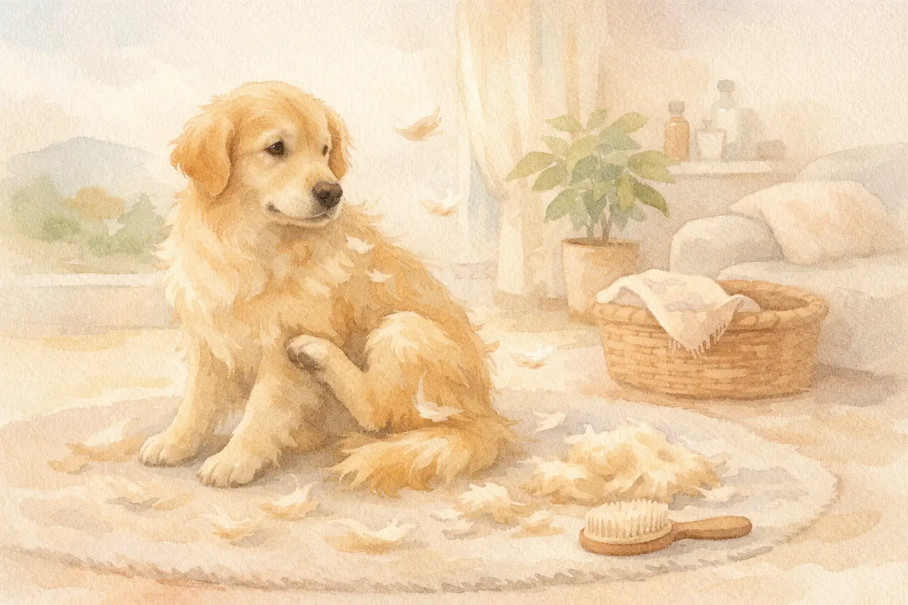
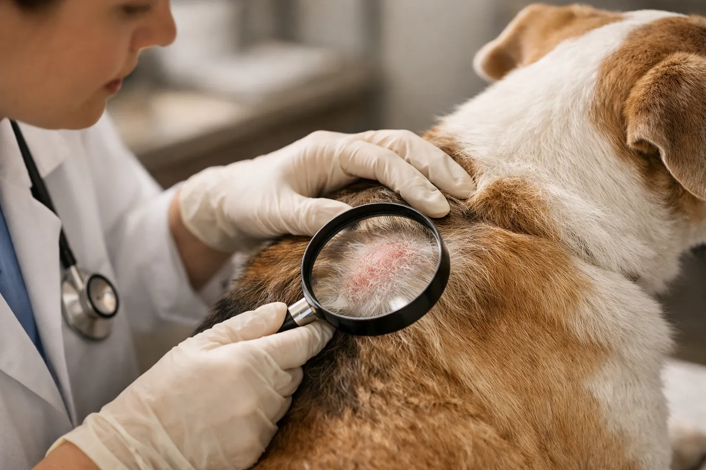
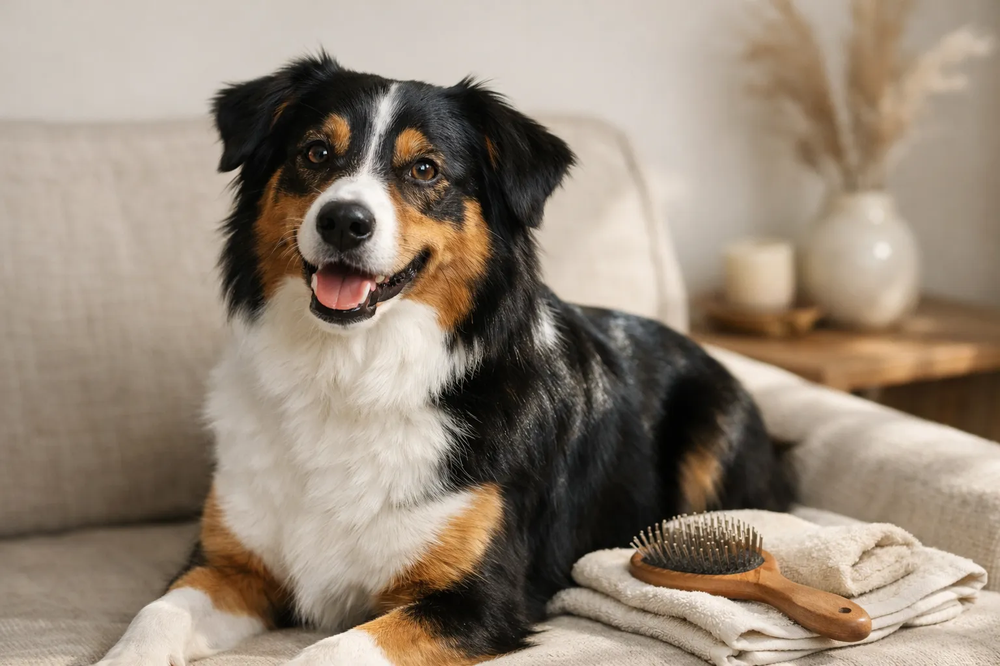

Jeder Hund verliert viel Fell -- zumindest phasenweise. Doch wann ist der Haarverlust ein normaler Fellwechsel und wann steckt eine Krankheit dahinter? Die Unterscheidung ist entscheidend, denn während der saisonale Fellwechsel beim Hund ein natürlicher Prozess ist, können kahle Stellen, Juckreiz oder büschelweiser Haarverlust auf ernsthafte Gesundheitsprobleme hinweisen.

In diesem Ratgeber erfährst du, wie du normalen Fellwechsel von krankhaftem Haarausfall unterscheidest, welche Ursachen hinter starkem Fellverlust stecken und was du konkret tun kannst, damit dein Hund wieder ein gesundes, glänzendes Fell bekommt.

Zusammenfassung: Hund verliert viel Fell

<ul>
<li><strong>Fellwechsel ist normal</strong> -- Hunde wechseln ihr Fell 2x jährlich im Frühjahr und Herbst über einen Zeitraum von 4-8 Wochen</li>
<li><strong>Warnsignale erkennen</strong> -- Kahle Stellen, Rötungen, Schuppen, Juckreiz oder büschelweiser Haarverlust deuten auf Krankheiten hin</li>
<li><strong>Häufigste Ursachen</strong> -- Parasiten (Milben, Haarlinge), Allergien, Nährstoffmangel, hormonelle Störungen und Stress</li>
<li><strong>Ernährung ist entscheidend</strong> -- Omega-3-Fettsäuren, Zink und Biotin unterstützen Haut und Fell nachweislich</li>
<li><strong>Tierarzt bei Auffälligkeiten</strong> -- Bei anhaltendem Haarausfall außerhalb des Fellwechsels immer tierärztlich abklären lassen</li>
</ul>

2x

Fellwechsel pro Jahr

4-8

Wochen Dauer

15.000

Haare pro cm² Haut

30%

der Fälle ernährungsbedingt

## Wie viel Fellverlust beim Hund ist normal?

Hunde verlieren täglich Haare -- das gehört zum natürlichen Haarzyklus. Jedes einzelne Hundehaar durchläuft eine Wachstumsphase (Anagenphase), eine Übergangsphase (Katagenphase) und eine Ruhephase (Telogenphase), bevor es ausfällt und durch ein neues Haar ersetzt wird. Dieser Prozess läuft bei gesunden Hunden kontinuierlich ab.

Die Menge des täglichen Haarverlusts hängt stark von der Rasse, dem Felltyp und der Jahreszeit ab. Ein Labrador Retriever mit dichter Unterwolle verliert deutlich mehr Haare als ein Pudel, dessen Haar kontinuierlich wächst und kaum ausfällt. Grundsätzlich gilt: Solange das Fell gleichmäßig nachwächst und keine kahlen Stellen entstehen, ist der Haarverlust unbedenklich.

### Fell vs. Haare -- ein wichtiger Unterschied

Hunde mit Fell besitzen eine dichte Unterwolle und ein schützendes Deckhaar. Dieses doppelte Haarkleid wird saisonal gewechselt. Hunde mit Haaren -- wie Pudel, Malteser oder Yorkshire Terrier -- haben dagegen nur eine Haarschicht ohne Unterwolle. Diese Rassen durchlaufen keinen klassischen Fellwechsel, verlieren aber dennoch einzelne Haare.

| Merkmal | Hunde mit Fell (Unterwolle) | Hunde mit Haaren (ohne Unterwolle) |
|---|---|---|
| Fellwechsel | 2x jährlich, stark | Kein klassischer Fellwechsel |
| Täglicher Haarverlust | Moderat bis hoch | Gering |
| Beispielrassen | Schäferhund, Husky, Golden Retriever | Pudel, Malteser, Havaneser |
| Pflegebedarf | Regelmäßiges Bürsten der Unterwolle | Regelmäßiges Trimmen/Scheren |
| Allergiker-Eignung | Weniger geeignet | Oft besser verträglich |

## Fellwechsel beim Hund: Wann und wie lange?

Der Fellwechsel beim Hund findet zweimal jährlich statt -- im Frühjahr und im Herbst. Im Frühjahr verliert der Hund sein dichtes Winterfell und legt ein leichteres Sommerfell an. Im Herbst geschieht das Gegenteil: Das dünne Sommerfell wird durch eine dichtere Unterwolle für den Winter ersetzt.

Der Frühjahrs-Fellwechsel ist in der Regel deutlich intensiver als der herbstliche Wechsel. Viele Hundehalter bemerken in dieser Phase, dass ihr Hund extrem viel Fell verliert -- teilweise büschelweise. Dieser Prozess dauert bei den meisten Hunden zwischen 4 und 8 Wochen, kann bei manchen Rassen aber auch bis zu 12 Wochen anhalten.

ℹ️

<strong>Tageslicht steuert den Fellwechsel</strong>

Nicht die Temperatur, sondern die Tageslichtlänge ist der Hauptauslöser für den Fellwechsel. Hunde, die überwiegend in Wohnungen mit Kunstlicht leben, können einen verschobenen oder ganzjährig leichten Fellwechsel zeigen. Laut Tierärzten ist das bei Wohnungshunden ein häufiges Phänomen.

### Fellwechsel bei Welpen und Senioren

Welpen durchlaufen ihren ersten Fellwechsel im Alter von 4-6 Monaten. Dabei wird das weiche Welpenfell durch das festere Erwachsenenfell ersetzt. Dieser Übergang kann bis zu 3 Monate dauern und ist für viele Erstbesitzer überraschend intensiv.

Bei älteren Hunden ab circa 8 Jahren verändert sich der Fellwechsel ebenfalls. Das Fell wird oft dünner, wächst langsamer nach und kann an Glanz verlieren. Senioren-Hunde benötigen häufig eine angepasste Ernährung mit mehr Omega-3-Fettsäuren und Biotin, um die Fellgesundheit zu unterstützen.

### Fellwechsel nach Rasse und Größe

Nicht jede Hunderasse haart gleich stark. Die folgende Übersicht zeigt, welche Rassen besonders viel Fell verlieren und welche weniger.

| Rasse / Typ | Fellwechsel-Intensität | Besonderheit |
|---|---|---|
| Husky, Malamute | Sehr stark | Verlieren bis zu 1 kg Unterwolle |
| Schäferhund, Golden Retriever | Stark | Dichtes Doppelfell, intensiver Frühjahrs-Fellwechsel |
| Labrador Retriever | Stark | Wasserabweisendes Fell mit viel Unterwolle |
| Beagle, Dackel | Moderat | Kurzes Fell, aber dennoch spürbarer Fellwechsel |
| Pudel, Malteser | Sehr gering | Kein klassischer Fellwechsel, dafür Trimmen nötig |
| Portugiesischer Wasserhund | Sehr gering | Kaum Haarverlust, hypoallergen |

## Hund haart extrem: Wann ist es krankhaft?

Normaler Fellwechsel und krankhafter Haarausfall unterscheiden sich in mehreren Punkten. Wenn dein Hund viel Fell verliert, solltest du auf bestimmte Warnsignale achten, die über den natürlichen Fellwechsel hinausgehen.

Normaler Fellwechsel

<ul>
<li>Gleichmäßiger Haarverlust am ganzen Körper</li>
<li>Fell wächst gleichmäßig nach</li>
<li>Keine kahlen Stellen sichtbar</li>
<li>Haut darunter gesund und rosig</li>
<li>Tritt im Frühjahr und Herbst auf</li>
<li>Hund zeigt kein verändertes Verhalten</li>
</ul>

Krankhafter Haarausfall

<ul>
<li>Lokaler Haarverlust an bestimmten Stellen</li>
<li>Kahle Stellen oder lichte Bereiche</li>
<li>Rötungen, Schuppen oder Krusten auf der Haut</li>
<li>Starker Juckreiz, Hund kratzt sich häufig</li>
<li>Haarausfall außerhalb der Fellwechselzeit</li>
<li>Fell wirkt stumpf, brüchig oder fettig</li>
</ul>

### Warnsignale, die du ernst nehmen solltest

Bestimmte Symptome in Kombination mit Fellverlust deuten auf eine zugrunde liegende Erkrankung hin. Tierärzte empfehlen, bei folgenden Anzeichen zeitnah eine Praxis aufzusuchen:

- **Kahle Stellen** (Alopezie), die sich ausbreiten
- **Hund verliert Fell büschelweise** -- ganze Haarbüschel lassen sich leicht herausziehen
- **Hund verliert Fell und kratzt sich** ständig oder beißt ins Fell
- **Hund verliert Fell um die Augen**, an den Ohren oder an den Pfoten
- **Hautveränderungen** wie Rötungen, Pusteln, Schuppen oder dunkle Verfärbungen
- **Verhaltensänderungen** wie Appetitlosigkeit, Müdigkeit oder vermehrtes Trinken

## Ursachen für Haarausfall beim Hund

Die Ursachen für übermäßigen Fellverlust beim Hund sind vielfältig. Tierärzte unterscheiden zwischen infektiösen, allergischen, hormonellen, ernährungsbedingten und psychischen Auslösern. Oft liegt eine Kombination mehrerer Faktoren vor.

🦠

Parasiten & Infektionen

Milben, Haarlinge, Flöhe, Pilzinfektionen und bakterielle Hautinfektionen

🤧

Allergien

Futtermittelallergien, Umweltallergien (Atopie), Kontaktallergien und Flohspeichelallergie

⚖️

Hormonelle Störungen

Schilddrüsenunterfunktion, Cushing-Syndrom, Sexualhormon-Imbalancen

🥣

Nährstoffmangel & Stress

Fehlende Fettsäuren, Zink- oder Biotinmangel, psychischer Stress

### Parasiten als Ursache für Fellverlust

Parasiten gehören zu den häufigsten Auslösern für krankhaften Haarausfall beim Hund. Besonders Milben, Haarlinge und Flöhe verursachen starken Juckreiz, der den Hund zum Kratzen und Beißen verleitet -- was den Fellverlust zusätzlich verstärkt.

**Haarlinge beim Hund** sind flügellose Parasiten mit einer Größe von 1-2 mm, die sich von Hautschuppen und Haaren ernähren. Sie sind mit bloßem Auge als kleine, helle Punkte im Fell erkennbar und bewegen sich langsam. Im Gegensatz zu Flöhen springen Haarlinge nicht, sondern werden durch direkten Kontakt zwischen Hunden übertragen.

**Demodex-Milben** leben in den Haarfollikeln und verursachen die sogenannte Demodikose. Besonders bei Junghunden mit geschwächtem Immunsystem kann diese Milbenart zu flächigem Haarausfall führen. Laut der Deutschen Veterinärmedizinischen Gesellschaft (DVG) ist die Demodikose eine der häufigsten parasitären Hauterkrankungen bei Hunden unter 2 Jahren.

🚫

<strong>Achtung: Räude ist ansteckend!</strong>

Sarcoptes-Milben verursachen die hochansteckende Sarcoptes-Räude, die auch auf Menschen übertragbar ist (Zoonose). Symptome sind extremer Juckreiz, Krustenbildung und Haarausfall besonders an Ohren, Ellbogen und Bauch. Bei Verdacht sofort den Tierarzt aufsuchen und den Kontakt zu anderen Hunden vermeiden.

### Allergien als Auslöser für Haarausfall

Allergien sind nach Parasiten die zweithäufigste Ursache für Haarausfall beim Hund. Laut Tierärzten leiden etwa 10-15% aller Hunde an einer allergisch bedingten Hauterkrankung. Die drei häufigsten Allergieformen beim Hund sind:

**Futtermittelallergie:** Der Hund reagiert auf bestimmte Proteinquellen im Futter -- häufig auf Rind, Huhn, Weizen oder Soja. Symptome sind Juckreiz, Hautrötungen und Fellverlust, oft an Ohren, Pfoten und Bauch. Die Diagnose erfolgt über eine Eliminationsdiät über 8-12 Wochen. Hypoallergenes Hundefutter mit einer einzigen, seltenen Proteinquelle wie Pferd oder Insekten kann helfen.

**Umweltallergie (Atopische Dermatitis):** Pollen, Hausstaubmilben oder Schimmelpilzsporen lösen eine überschießende Immunreaktion aus. Diese Form tritt häufig saisonal auf und betrifft besonders Rassen wie West Highland White Terrier, Französische Bulldogge und Labrador Retriever.

**Flohspeichelallergie:** Bereits ein einziger Flohbiss kann bei empfindlichen Hunden eine massive allergische Reaktion auslösen. Der Hund kratzt und beißt sich intensiv, besonders an der Schwanzbasis und den Hinterbeinen. Konsequenter Flohschutz ist hier die wichtigste Maßnahme.

### Hormonelle Störungen und Haarausfall

Hormonell bedingter Haarausfall beim Hund zeigt ein charakteristisches Muster: Der Fellverlust tritt symmetrisch auf beiden Körperseiten auf, die Haut ist nicht entzündet und der Hund zeigt keinen Juckreiz. Zwei hormonelle Erkrankungen sind besonders häufig:

**Schilddrüsenunterfunktion (Hypothyreose):** Die häufigste hormonelle Erkrankung bei Hunden mittleren Alters. Neben symmetrischem Haarausfall zeigen betroffene Hunde Trägheit, Gewichtszunahme und eine verdickte, dunkle Haut. Die Diagnose erfolgt über einen Bluttest, die Behandlung durch tägliche Gabe von Schilddrüsenhormonen.

**Cushing-Syndrom (Hyperadrenokortizismus):** Bei dieser Erkrankung produziert der Körper zu viel Cortisol. Typische Symptome sind symmetrischer Haarausfall, ein aufgeblähter Bauch, vermehrtes Trinken und häufiges Urinieren. Das Cushing-Syndrom betrifft vor allem Hunde ab 6 Jahren und Rassen wie Pudel, Dackel und Boxer. Wenn dein [Hund auffällig viel trinkt](https://hundewissen-mit-kopf.de/hundegesundheit/hund-trinkt-viel/), kann das ein Hinweis auf diese Erkrankung sein.

📖

Definition: Cushing-Syndrom

Das Cushing-Syndrom (Hyperadrenokortizismus) ist eine hormonelle Erkrankung, bei der die Nebennierenrinde übermäßig viel Cortisol produziert. Es betrifft etwa 1-2 von 1.000 Hunden pro Jahr und wird meist durch einen Tumor der Hirnanhangdrüse oder der Nebenniere verursacht.

### Nährstoffmangel: Der unterschätzte Auslöser

Mangelhafte Ernährung ist eine häufige, aber leicht vermeidbare Ursache für Haarausfall beim Hund. Die Haut ist das größte Organ des Hundes und benötigt etwa 25-30% des täglichen Proteinbedarfs allein für die Haarproduktion. Fehlen wichtige Nährstoffe, zeigt sich das schnell am Fell.

| Nährstoff | Funktion für Haut & Fell | Mangelsymptome | Gute Quellen |
|---|---|---|---|
| Omega-3-Fettsäuren | Entzündungshemmend, Hautbarriere | Stumpfes Fell, Schuppen, Juckreiz | Lachsöl, Leinöl, Fisch |
| Omega-6-Fettsäuren | Fellglanz, Hautelastizität | Trockene Haut, brüchiges Fell | Sonnenblumenöl, Geflügelfett |
| Zink | Zellteilung, Wundheilung | Haarausfall, Krusten, Hautverdickung | Rindfleisch, Innereien |
| Biotin (Vitamin B7) | Keratinbildung | Brüchiges Fell, Haarausfall | Leber, Eigelb, Bierhefe |
| Vitamin A | Hauterneuerung | Schuppige Haut, stumpfes Fell | Leber, Karotten |
| Protein (gesamt) | Haarstruktur (Keratin) | Dünnes, langsam wachsendes Fell | Fleisch, Fisch, Eier |

⚠️

<strong>Vorsicht bei Nahrungsergänzungsmitteln</strong>

Eine Überdosierung von Vitamin A oder Zink kann beim Hund toxisch wirken. Ergänze Nährstoffe nur nach Rücksprache mit dem Tierarzt und verwende keine Präparate für Menschen. Tierärzte empfehlen zunächst eine Futterumstellung auf hochwertiges Alleinfutter, bevor Supplemente eingesetzt werden.

### Psychischer Stress als Ursache

Stress ist eine oft übersehene Ursache für Haarausfall beim Hund. Trennungsangst, Umzüge, neue Familienmitglieder oder der Verlust eines Bezugstieres können bei Hunden zu chronischem Stress führen. Dieser äußert sich nicht nur im Verhalten, sondern auch körperlich -- unter anderem durch vermehrten Fellverlust.

Manche Hunde entwickeln unter Stress ein zwanghaftes Leckverhalten (Acral Lick Dermatitis). Sie belecken bestimmte Körperstellen so intensiv, dass dort kahle Stellen und sogar offene Wunden entstehen. Besonders betroffen sind die Vorderbeine und Pfoten. Wenn dein Hund neben dem Fellverlust auch [Verhaltensauffälligkeiten wie ständiges Bellen](https://hundewissen-mit-kopf.de/erziehung-verhalten/hund-bellt-staendig/) zeigt, kann Stress die gemeinsame Ursache sein.

## Hund verliert Fell: Kahle Stellen richtig deuten

Kahle Stellen beim Hund sind immer ein Grund, genauer hinzuschauen. Die Lokalisation der haarlosen Bereiche gibt Tierärzten wichtige Hinweise auf die zugrunde liegende Ursache.

| Lokalisation der kahlen Stelle | Mögliche Ursache |
|---|---|
| Symmetrisch an beiden Körperseiten | Hormonelle Störung (Schilddrüse, Cushing-Syndrom) |
| Um die Augen herum | Demodex-Milben, Zinkmangel, Allergien |
| An der Schwanzbasis | Flohspeichelallergie |
| An Ohren und Ellbogen | Sarcoptes-Räude |
| Kreisrunde kahle Stellen | Pilzinfektion (Dermatophytose) |
| An den Pfoten und zwischen den Zehen | Umweltallergie, Kontaktallergie |
| Am Bauch | Futtermittelallergie, Kontaktdermatitis |
| An einer einzelnen Stelle (Lecken) | Stressbedingte Leckdermatitis |

🚫

<strong>Pilzinfektionen sind auf Menschen übertragbar!</strong>

Kreisrunde, scharf begrenzte kahle Stellen mit schuppigem Rand können auf eine Pilzinfektion (Dermatophytose) hindeuten. Hautpilze beim Hund sind Zoonosen und können auf Menschen übertragen werden -- besonders Kinder und immungeschwächte Personen sind gefährdet. Bei Verdacht den Tierarzt aufsuchen und Hygienemaßnahmen einhalten.

## Diagnose beim Tierarzt: Was wird untersucht?

Wenn dein Hund krankhaft viel Fell verliert, führt der Tierarzt verschiedene Untersuchungen durch, um die Ursache zu ermitteln. Die Diagnostik erfolgt schrittweise -- von einfachen Tests bis zu spezialisierten Laboruntersuchungen.

1

Klinische Untersuchung

Begutachtung von Haut und Fell, Abtasten der Lymphknoten, Beurteilung des Allgemeinzustands und der Fellverteilung

2

Hautgeschabsel & Trichogramm

Mikroskopische Untersuchung von Hautproben auf Milben, Pilze und Haarstruktur-Veränderungen

3

Blutuntersuchung

Überprüfung von Schilddrüsenwerten, Cortisol, Organfunktionen und Entzündungsmarkern

✓

Diagnose & Therapieplan

Basierend auf den Ergebnissen erstellt der Tierarzt einen individuellen Behandlungsplan

Zusätzliche Untersuchungen wie eine Pilzkultur (Ergebnis nach 2-3 Wochen), Allergie-Tests oder eine Hautbiopsie können bei unklaren Fällen notwendig sein. Die Kosten für eine dermatologische Abklärung liegen je nach Umfang zwischen 80 und 300 Euro.

## Hund verliert viel Fell: Hausmittel und Tipps

Viele Fälle von verstärktem Fellverlust lassen sich durch einfache Maßnahmen in den Griff bekommen -- vorausgesetzt, keine ernsthafte Erkrankung liegt vor. Die folgenden Hausmittel und Pflegetipps unterstützen Haut und Fell deines Hundes nachweislich.

### Regelmäßige Fellpflege

Tägliches Bürsten während des Fellwechsels entfernt lose Haare, verhindert Verfilzungen und regt die Durchblutung der Haut an. Für Hunde mit Unterwolle eignet sich eine spezielle Unterfellbürste (Furminator-Typ), die abgestorbene Unterwolle effektiv entfernt, ohne das Deckhaar zu beschädigen.

Ausführliche Tipps zur richtigen Bürstentechnik und den passenden Pflegewerkzeugen findest du in unserem [Fellpflege-Ratgeber](https://hundewissen-mit-kopf.de/hundepflege/fellpflege-hund/). Auch das [richtige Baden](https://hundewissen-mit-kopf.de/hundepflege/hund-baden/) spielt eine Rolle -- zu häufiges Baden mit ungeeignetem Shampoo kann die Haut austrocknen und den Haarausfall verschlimmern.

💡

<strong>Bürsten-Routine im Fellwechsel</strong>

Bürste deinen Hund während des Fellwechsels täglich 10-15 Minuten. Außerhalb des Fellwechsels reichen 2-3 Mal pro Woche. Bürste immer in Wuchsrichtung und arbeite dich von den Beinen zum Rücken vor. Belohne deinen Hund danach, damit er die Pflege positiv verknüpft.

### Ernährung für gesundes Fell

Die Ernährung hat einen direkten Einfluss auf die Fellgesundheit. Hochwertiges Hundefutter mit einem Proteingehalt von mindestens 25% und ausreichend Fettsäuren bildet die Basis für ein glänzendes, kräftiges Fell.

**Omega-3-Fettsäuren** sind der wichtigste Nährstoff für Haut und Fell. Lachsöl oder Leinöl liefern diese Fettsäuren in konzentrierter Form. Die empfohlene Dosierung liegt bei 1 Teelöffel pro 10 kg Körpergewicht täglich, direkt über das Futter gegeben. Erste Verbesserungen zeigen sich nach etwa 4-6 Wochen regelmäßiger Gabe.

**Bierhefe** enthält B-Vitamine und Biotin, die das Haarwachstum fördern. Viele Tierärzte empfehlen Bierhefe-Tabletten als natürliche Nahrungsergänzung bei stumpfem Fell oder verstärktem Haarverlust. Die Dosierung richtet sich nach dem Körpergewicht -- Herstellerangaben beachten.

Bei Verdacht auf eine Futtermittelallergie kann hypoallergenes Hundefutter mit einer einzigen Proteinquelle (z.B. Pferd, Känguru oder Insekten) und einer einzigen Kohlenhydratquelle (z.B. Süßkartoffel) helfen. Eine Eliminationsdiät sollte mindestens 8 Wochen konsequent durchgeführt werden.

### Weitere Hausmittel gegen Fellverlust

✅ Hausmittel-Checkliste bei Fellverlust

✓

Lachsöl oder Leinöl täglich ins Futter (1 TL pro 10 kg)

✓

Tägliches Bürsten mit passender Bürste für den Felltyp

✓

Hochwertiges Futter mit mind. 25% Proteingehalt

✓

Ausreichend frisches Trinkwasser (50-80 ml pro kg Körpergewicht)

✓

Regelmäßige Bewegung an der frischen Luft (fördert Fellwechsel)

Bierhefe-Tabletten nach Rücksprache mit dem Tierarzt

Kokosöl äußerlich bei trockener Haut (sparsam, erbsengroße Menge)

## Hund verliert viel Fell im Winter: Besondere Ursachen

Wenn dein Hund im Winter vermehrt Fell verliert, obwohl der Fellwechsel eigentlich im Frühjahr und Herbst stattfindet, gibt es dafür spezifische Gründe. Trockene Heizungsluft ist der häufigste Auslöser für winterlichen Fellverlust. Die relative Luftfeuchtigkeit in beheizten Räumen sinkt oft unter 30% -- ideal wären 40-60%.

Die trockene Luft entzieht der Hundehaut Feuchtigkeit, was zu Schuppen, Juckreiz und verstärktem Haarverlust führt. Abhilfe schaffen Luftbefeuchter, regelmäßiges Lüften und die Zugabe von Omega-3-Fettsäuren zum Futter. Auch ein Schlafplatz abseits der Heizung kann helfen.

Ein weiterer Grund für Fellverlust im Winter: Hunde, die überwiegend in der Wohnung leben, sind dem natürlichen Licht-Dunkel-Rhythmus weniger ausgesetzt. Ihr Körper kann die Jahreszeiten weniger gut unterscheiden, was zu einem ganzjährig leichten, aber kontinuierlichen Fellverlust führt.

💡

<strong>Tipp gegen winterlichen Fellverlust</strong>

Stelle einen Luftbefeuchter in dem Raum auf, in dem dein Hund am meisten Zeit verbringt. Ziel ist eine Luftfeuchtigkeit von 40-60%. Alternativ hilft ein feuchtes Handtuch auf der Heizung. Tägliche Spaziergänge bei Tageslicht unterstützen zudem den natürlichen Fellzyklus.

## Rassespezifische Besonderheiten beim Fellverlust

Bestimmte Hunderassen sind genetisch anfälliger für Fellprobleme als andere. Diese Veranlagung zu kennen, hilft bei der Einordnung und Vorbeugung.

**Nordische Rassen** (Husky, Malamute, Samojede) durchlaufen einen besonders intensiven Fellwechsel. Ihr dichtes Doppelfell mit massiver Unterwolle führt dazu, dass sie im Frühjahr regelrecht "ausblasen" -- ganze Fellbüschel lösen sich. Das ist bei diesen Rassen normal und kein Grund zur Sorge, solange das Fell gleichmäßig nachwächst.

**Bulldoggen und Möpse** neigen aufgrund ihrer Hautfalten zu bakteriellen Hautinfektionen und Hefepilzbefall, die Haarausfall verursachen können. Die Falten sollten regelmäßig gereinigt und trocken gehalten werden.

**Dackel und Dobermann** können von einer erblich bedingten Haarausfallstörung betroffen sein -- der sogenannten Farbmutantenalopezie (Color Dilution Alopecia). Bei Hunden mit verdünnter Fellfarbe (blau, isabell) kann das Haar ab dem 6. Lebensmonat ausdünnen und brüchig werden.

Wenn du noch auf der Suche nach der passenden Hunderasse bist und dabei auch das Thema Fellpflege berücksichtigen möchtest, findest du hilfreiche Informationen in unserem Artikel über [Hunderassen für Anfänger](https://hundewissen-mit-kopf.de/hunderassen/hunderasse-fuer-anfaenger/).

## Wann zum Tierarzt? Die wichtigsten Warnsignale

Nicht jeder Fellverlust erfordert einen Tierarztbesuch. Doch bestimmte Anzeichen solltest du ernst nehmen und zeitnah abklären lassen. Als Faustregel gilt: Wenn der Haarausfall länger als 8 Wochen anhält und nicht mit dem saisonalen Fellwechsel zusammenfällt, ist ein Tierarztbesuch ratsam.

⚠️

<strong>Sofort zum Tierarzt bei diesen Symptomen:</strong>

Kahle Stellen, die sich schnell ausbreiten. Offene Wunden oder nässende Hautstellen. Starker Juckreiz mit Blutkratzen. Fellverlust in Kombination mit Fieber, Appetitlosigkeit oder Apathie. Plötzlicher, massiver Haarverlust innerhalb weniger Tage.

| Symptom | Dringlichkeit | Mögliche Ursache |
|---|---|---|
| Leicht vermehrtes Haaren im Frühjahr/Herbst | Kein Tierarztbesuch nötig | Normaler Fellwechsel |
| Stumpfes, glanzloses Fell | Tierarzt bei nächster Gelegenheit | Nährstoffmangel, Wurmbefall |
| Kahle Stellen ohne Juckreiz | Innerhalb 1-2 Wochen zum Tierarzt | Hormonelle Störung |
| Kahle Stellen mit Juckreiz | Zeitnah zum Tierarzt (wenige Tage) | Parasiten, Allergie, Pilz |
| Großflächiger Fellverlust mit Hautrötung | Sofort zum Tierarzt | Schwere Infektion, Autoimmunerkrankung |

## Vorbeugung: So bleibt das Fell deines Hundes gesund

Die beste Strategie gegen übermäßigen Haarausfall beim Hund ist eine konsequente Vorbeugung. Mit den richtigen Maßnahmen kannst du Haut und Fell deines Hundes langfristig gesund halten und krankhaftem Fellverlust vorbeugen.

1

Hochwertiges Futter wählen

Futter mit mind. 25% Protein, Omega-3- und Omega-6-Fettsäuren, Zink und Biotin. Bei Unverträglichkeiten: hypoallergenes Hundefutter testen.

2

Regelmäßige Fellpflege

2-3x wöchentlich bürsten, im Fellwechsel täglich. Passende Bürste für den Felltyp verwenden. Baden nur bei Bedarf mit mildem Hundeshampoo.

3

Parasitenvorsorge

Ganzjähriger Floh- und Zeckenschutz nach tierärztlicher Empfehlung. Regelmäßige Entwurmung alle 3-6 Monate.

✓

Regelmäßige Gesundheitschecks

Jährliche tierärztliche Vorsorgeuntersuchung inklusive Blutbild. Haut und Fell bei jedem Bürsten auf Veränderungen kontrollieren.

## Fazit: Hund verliert viel Fell -- meistens harmlos, manchmal ernst

Wenn dein Hund viel Fell verliert, steckt in den meisten Fällen der natürliche Fellwechsel dahinter. Zweimal jährlich -- im Frühjahr und Herbst -- tauschen Hunde ihr Haarkleid aus, was 4-8 Wochen dauern kann. Regelmäßiges Bürsten, hochwertiges Futter mit Omega-3-Fettsäuren und ausreichend Bewegung an der frischen Luft unterstützen deinen Hund in dieser Phase.

Achte jedoch auf Warnsignale wie kahle Stellen, Hautrötungen, Schuppen oder starken Juckreiz. Diese Symptome deuten auf Parasiten, Allergien, hormonelle Störungen oder Nährstoffmangel hin und sollten tierärztlich abgeklärt werden. Je früher die Ursache erkannt wird, desto einfacher und erfolgreicher ist die Behandlung.

Mit der richtigen Pflege, einer ausgewogenen Ernährung und regelmäßigen Gesundheitschecks kannst du dafür sorgen, dass dein Hund ein gesundes, glänzendes Fell behält -- und du deutlich weniger Hundehaare auf der Couch findest.