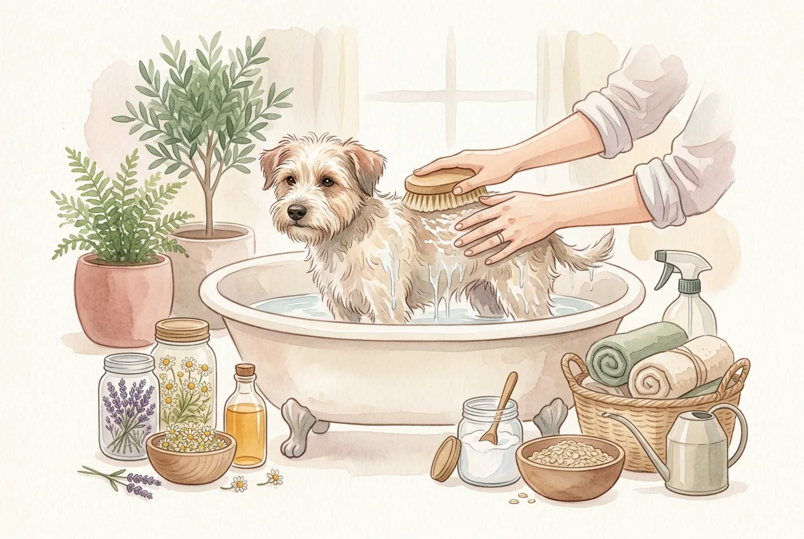
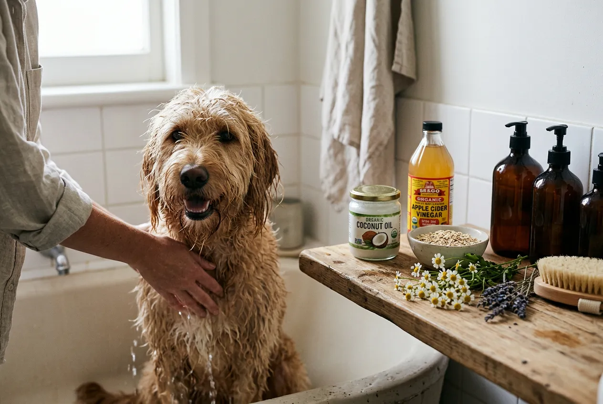
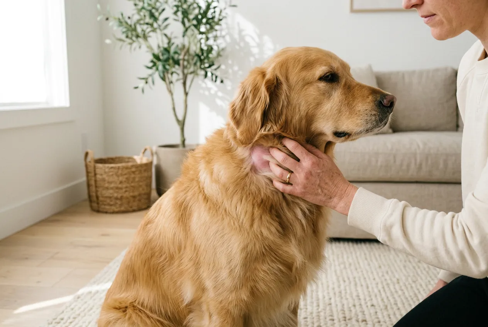
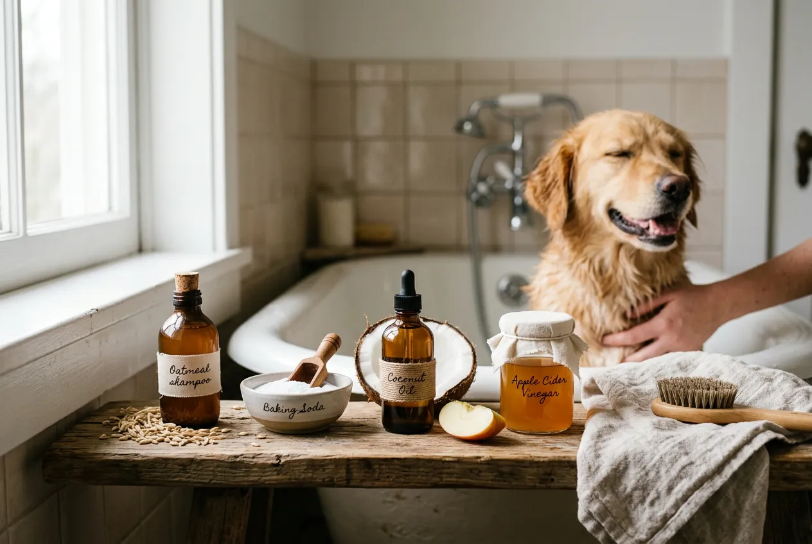
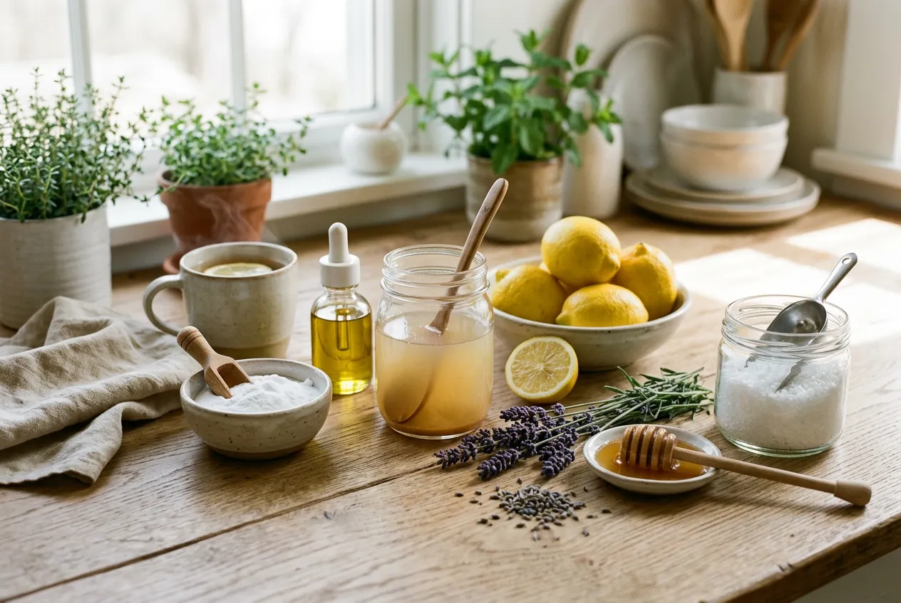

Deinen Hund waschen mit Hausmitteln ist eine schonende, natürliche und kostengünstige Alternative zu herkömmlichem Hundeshampoo. Ob dein Hund stinkt, sich im Matsch gewälzt hat oder empfindliche Haut besitzt -- Hausmittel wie Natron, Aloe Vera, Apfelessig und Haferflocken reinigen das Fell sanft, ohne den natürlichen Schutzfilm der Haut zu zerstören.

In diesem Ratgeber erfährst du, welche 4 Hausmittel sich zum Hund waschen eignen, wie du sie richtig anwendest und warum der pH-Wert der Hundehaut so entscheidend ist. Dazu bekommst du einfache Rezepte zum Selbermachen, eine Schritt-für-Schritt-Anleitung und wichtige Sicherheitshinweise.

Zusammenfassung: Hund waschen mit Hausmitteln

<ul>
<li><strong>4 bewährte Hausmittel</strong> -- Natron, Aloe Vera, Apfelessig und Haferflocken reinigen Hundefell schonend und natürlich</li>
<li><strong>pH-Wert beachten</strong> -- Hundehaut hat einen pH-Wert von 6,5-7,5 und braucht milde, pH-neutrale Reinigung</li>
<li><strong>Maximal alle 4-6 Wochen baden</strong> -- auch mit Hausmitteln nicht häufiger waschen, um die Hautbarriere zu schützen</li>
<li><strong>Kein Menschenshampoo verwenden</strong> -- der pH-Wert von 5,5 ist zu sauer für Hundehaut und schädigt den Säureschutzmantel</li>
<li><strong>Trockenshampoo als Alternative</strong> -- Natron-Pulver eignet sich für die schnelle Reinigung ohne Wasser</li>
</ul>

6,5-7,5

pH-Wert Hundehaut

4-6

Wochen Bade-Abstand

4

Natürliche Alternativen

37°C

Ideale Wassertemperatur

## Warum Hausmittel statt Hundeshampoo?

Herkömmliche Hundeshampoos enthalten häufig Silikone, Parabene, künstliche Duftstoffe und Sulfate. Diese Inhaltsstoffe können bei Hunden mit empfindlicher Haut Reizungen, Juckreiz und allergische Reaktionen auslösen. Besonders Hunde mit Hautproblemen, Allergien oder nach Operationen profitieren von milden, natürlichen Alternativen.

Hausmittel zum Hund waschen bieten drei wesentliche Vorteile: Sie sind frei von synthetischen Chemikalien, deutlich günstiger als Spezialshampoos und in den meisten Haushalten bereits vorhanden. Gerade wenn der Hund stinkt und ein Bad nötig ist, hast du mit Natron, Apfelessig oder Haferflocken sofort eine wirksame Lösung parat.

Laut Tierärzten ist die wichtigste Regel beim Hundebad: So selten wie möglich und so schonend wie nötig. Hausmittel unterstützen diesen Grundsatz, weil sie den natürlichen Fettfilm der Haut weniger stark angreifen als industrielle Produkte. Mehr Grundlagen zum richtigen Hundebad findest du in unserem [ausführlichen Ratgeber zum Hund baden](https://hundewissen-mit-kopf.de/hundepflege/hund-baden/).

## Der pH-Wert der Hundehaut: Warum er so wichtig ist

Der pH-Wert der Hundehaut liegt zwischen 6,5 und 7,5 -- damit ist sie deutlich weniger sauer als menschliche Haut mit einem pH-Wert von etwa 5,5. Dieser Unterschied klingt gering, hat aber erhebliche Auswirkungen auf die Wahl des Reinigungsmittels.

### Was passiert bei falschem pH-Wert?

Produkte mit einem zu niedrigen pH-Wert (wie Menschenshampoo) zerstören den Säureschutzmantel der Hundehaut. Die Folgen zeigen sich oft erst nach mehrfacher Anwendung: trockene, schuppige Haut, vermehrter Juckreiz, stumpfes Fell und eine erhöhte Anfälligkeit für Bakterien und Pilzinfektionen.

📖

Definition: Säureschutzmantel

Der Säureschutzmantel (auch Hydrolipidfilm) ist eine dünne Schicht aus Talg, Schweiß und Milchsäure auf der Hautoberfläche. Er schützt vor Bakterien, Pilzen und Austrocknung. Bei Hunden ist dieser Film weniger sauer als beim Menschen und daher empfindlicher gegenüber aggressiven Reinigungsmitteln.

### pH-Wert-Vergleich: Hund vs. Mensch vs. Hausmittel

| Produkt / Haut | pH-Wert | Geeignet für Hunde? |
|---|---|---|
| Hundehaut | 6,5-7,5 | -- |
| Menschliche Haut | 5,5 | -- |
| Menschenshampoo | 4,5-6,0 | ❌ Zu sauer |
| Babyshampoo | 6,0-7,0 | ⚠️ Nur im Notfall |
| Natron-Lösung | 8,0-8,5 | ✅ Leicht basisch, gut verträglich |
| Apfelessig (verdünnt) | 5,0-6,0 | ✅ Als Spülung geeignet |
| Haferflocken-Sud | 6,5-7,0 | ✅ Ideal für empfindliche Haut |
| Aloe-Vera-Gel | 4,5-5,5 | ✅ Hautpflegend, mild |

⚠️

<strong>Kein Menschenshampoo für Hunde verwenden</strong>

Auch milde Menschenshampoos haben einen pH-Wert von 4,5-6,0 -- deutlich zu sauer für die Hundehaut. Selbst Babyshampoo sollte nur im absoluten Notfall und stark verdünnt eingesetzt werden. Verwende stattdessen Hausmittel mit einem pH-Wert nahe 7,0.

## Die 4 besten Hausmittel zum Hund waschen

Diese vier natürlichen Alternativen haben sich bewährt, um Hunde schonend zu reinigen. Jedes Hausmittel hat spezifische Stärken -- von Geruchsneutralisation bis Hautpflege.

🧂

Kaiser Natron

Neutralisiert Gerüche, reinigt mild und wirkt antibakteriell. Ideal wenn der Hund stinkt.

🌿

Aloe Vera

Spendet Feuchtigkeit, lindert Juckreiz und pflegt gereizte Haut. Perfekt für empfindliche Hunde.

🍎

Apfelessig

Stellt den pH-Wert wieder her, löst Schmutz und sorgt für glänzendes Fell.

🌾

Haferflocken

Enthält natürliche Saponine (Seifenstoffe), beruhigt die Haut und reinigt sanft.

### Hausmittel 1: Kaiser Natron -- der Geruchskiller

Kaiser Natron (Natriumhydrogencarbonat) ist eines der vielseitigsten Hausmittel zum Hund waschen. Es neutralisiert unangenehme Gerüche auf molekularer Ebene, statt sie nur zu überdecken. Natron bindet geruchsverursachende Säuren und hinterlässt ein frisch riechendes Fell.

**Anwendung als Shampoo-Ersatz:** Löse 1 Esslöffel Kaiser Natron in 500 ml lauwarmem Wasser auf. Massiere die Lösung sanft ins nasse Fell ein, spare dabei Augen, Ohren und Nase aus. Lasse die Mischung 2-3 Minuten einwirken und spüle sie gründlich mit klarem Wasser aus.

**Anwendung als Trockenshampoo:** Streue eine kleine Menge feines Natron-Pulver direkt ins trockene Fell. Massiere es mit den Fingern bis zur Haut ein und lasse es 5-10 Minuten einwirken. Bürste das Pulver anschließend gründlich aus. Dieses Trockenshampoo eignet sich hervorragend für Hunde, die Wasser scheuen, oder für die schnelle Reinigung zwischendurch.

💡

<strong>Natron als Trockenshampoo bei Regenwetter</strong>

An kalten oder nassen Tagen ist ein Vollbad oft unpraktisch. Natron als Trockenshampoo entfernt Gerüche und leichten Schmutz in wenigen Minuten -- ganz ohne Wasser und Föhn. Besonders praktisch für ältere Hunde oder Hunde mit Gelenkproblemen.

### Hausmittel 2: Aloe Vera -- die Hautpflege

Aloe Vera enthält über 200 bioaktive Inhaltsstoffe, darunter Vitamine, Enzyme, Mineralstoffe und Aminosäuren. Das Gel spendet intensive Feuchtigkeit, wirkt entzündungshemmend und unterstützt die Regeneration gereizter Haut. Für Hunde mit trockener, juckender oder sensibler Haut ist Aloe Vera die ideale Wahl.

**Anwendung:** Mische 2-3 Esslöffel reines Aloe-Vera-Gel (ohne Zusatzstoffe) mit 500 ml lauwarmem Wasser. Trage die Mischung auf das nasse Fell auf und massiere sie sanft ein. Lasse sie 3-5 Minuten einwirken und spüle gründlich nach.

🚫

<strong>Achtung: Nur das klare Gel verwenden!</strong>

Die gelbliche Schicht direkt unter der Blattrinde der Aloe-Vera-Pflanze enthält Aloin -- ein Stoff, der für Hunde giftig ist und Durchfall, Erbrechen und Krämpfe auslösen kann. Verwende ausschließlich das klare, transparente Gel aus dem Blattinneren oder kaufe zertifiziertes Aloe-Vera-Gel ohne Aloin-Rückstände.

### Hausmittel 3: Apfelessig -- die Glanz-Spülung

Apfelessig ist ein bewährtes Hausmittel, das gleich mehrere Funktionen erfüllt: Er löst Schmutz und Fettrückstände, neutralisiert unangenehme Gerüche und verleiht dem Fell sichtbaren Glanz. Die enthaltene Essigsäure wirkt zudem leicht antibakteriell und kann helfen, den pH-Wert der Hundehaut nach dem Waschen zu stabilisieren.

**Anwendung als Fellspülung:** Mische 1 Teil Apfelessig mit 3 Teilen lauwarmem Wasser. Trage die Spülung nach dem Waschen auf das Fell auf, massiere sie kurz ein und spüle sie nach 1-2 Minuten aus. Der leichte Essiggeruch verfliegt nach dem Trocknen vollständig.

**Anwendung gegen Hundegeruch:** Wenn dein Hund stinkt, aber kein Vollbad nötig ist, kannst du die Apfelessig-Wasser-Mischung in eine Sprühflasche füllen. Sprühe das Fell leicht ein und lasse es an der Luft trocknen. Die Essigsäure neutralisiert Gerüche effektiv.

### Hausmittel 4: Haferflocken -- die Sensitiv-Pflege

Haferflocken enthalten natürliche Saponine -- pflanzliche Seifenstoffe, die sanft reinigen, ohne die Haut auszutrocknen. Zusätzlich wirken die enthaltenen Beta-Glucane beruhigend auf gereizte Haut. Tierärzte empfehlen Haferflocken-Bäder besonders für Hunde mit Allergien, Ekzemen oder nach Insektenstichen.

**Anwendung:** Mahle 100 g feine Haferflocken in einem Mixer zu Pulver. Gib das Pulver in eine alte Socke oder einen Waschlappen und knote ihn zu. Halte den Beutel unter fließendes lauwarmes Wasser, bis das Wasser milchig wird. Bade deinen Hund in diesem Haferflocken-Sud für 5-10 Minuten und spüle anschließend mit klarem Wasser nach.

ℹ️

<strong>Haferflocken bei Hautproblemen</strong>

Kolloidale Haferflocken (fein gemahlenes Hafermehl) werden in der Veterinärdermatologie gezielt bei Juckreiz und Hautirritationen eingesetzt. Die enthaltenen Avenanthramide wirken nachweislich entzündungshemmend und juckreizlindernd.

## Vergleich: Welches Hausmittel für welchen Zweck?

Nicht jedes Hausmittel eignet sich für jede Situation. Die folgende Tabelle hilft dir, die richtige natürliche Alternative zum Shampoo für deinen Hund zu finden.

| Hausmittel | Beste Anwendung | Felltyp | Häufigkeit | Aufwand |
|---|---|---|---|---|
| Kaiser Natron | Geruch neutralisieren, leichter Schmutz | Alle Felltypen | Max. alle 4 Wochen | Gering |
| Aloe Vera | Trockene/gereizte Haut pflegen | Kurz- und Mittelhaar | Max. alle 4 Wochen | Mittel |
| Apfelessig | Glanz, Geruch, pH-Ausgleich | Alle Felltypen | Als Spülung alle 4-6 Wochen | Gering |
| Haferflocken | Allergien, Ekzeme, Juckreiz | Alle Felltypen | Bei Bedarf, max. 2x/Monat | Mittel |
| Natron (trocken) | Schnelle Geruchsentfernung | Langhaar bevorzugt | Bei Bedarf | Sehr gering |

## Rezepte: Hundeshampoo selber machen mit Hausmitteln

Mit den folgenden Rezepten kannst du natürliche Shampoo-Alternativen in wenigen Minuten selbst herstellen. Alle Zutaten sind in Supermärkten oder Drogerien erhältlich.

### Rezept 1: Natron-Shampoo für stinkende Hunde

🍳 Natron-Shampoo gegen Hundegeruch

<ul>
<li>1 EL Kaiser Natron</li>
<li>500 ml lauwarmes Wasser (ca. 37°C)</li>
<li>Optional: 2-3 Tropfen Lavendelöl (nur tierärztlich geprüfte Öle)</li>
<li>Natron im Wasser vollständig auflösen</li>
<li>Ins nasse Fell einmassieren, 2-3 Minuten einwirken lassen</li>
<li>Gründlich mit klarem Wasser ausspülen</li>
</ul>

### Rezept 2: Aloe-Vera-Pflegeshampoo für empfindliche Haut

🍳 Aloe-Vera-Pflegeshampoo

<ul>
<li>3 EL reines Aloe-Vera-Gel (ohne Aloin)</li>
<li>500 ml lauwarmes Wasser</li>
<li>1 TL Kokosöl (optional, für extra Pflege)</li>
<li>Alle Zutaten gut verrühren</li>
<li>Auf nasses Fell auftragen und sanft einmassieren</li>
<li>3-5 Minuten einwirken lassen, dann gründlich ausspülen</li>
</ul>

### Rezept 3: Apfelessig-Glanzspülung

🍳 Apfelessig-Spülung für glänzendes Fell

<ul>
<li>100 ml naturtrüber Apfelessig</li>
<li>300 ml lauwarmes Wasser</li>
<li>In einer Sprühflasche oder Schüssel mischen</li>
<li>Nach dem Waschen als Spülung aufs Fell auftragen</li>
<li>1-2 Minuten einwirken lassen</li>
<li>Mit klarem Wasser nachspülen (oder bei leichter Anwendung eintrocknen lassen)</li>
</ul>

## Schritt-für-Schritt: Hund waschen mit Hausmitteln

Die richtige Vorgehensweise beim Baden entscheidet darüber, ob dein Hund das Waschen als angenehm empfindet. Folge dieser Anleitung für ein stressfreies Hundebad mit Hausmitteln.

1

Vorbereitung

Bürste das Fell gründlich aus, um Knoten und losen Schmutz zu entfernen. Lege Handtücher, die Hausmittel-Mischung und eine rutschfeste Matte bereit.

2

Fell anfeuchten

Befeuchte das Fell mit lauwarmem Wasser (ca. 37°C). Beginne an den Pfoten und arbeite dich langsam nach oben. Spare den Kopf zunächst aus.

3

Hausmittel auftragen

Massiere die gewählte Hausmittel-Mischung sanft ins nasse Fell ein. Arbeite vom Rücken über die Seiten bis zum Bauch. Augen, Ohren und Nase aussparen.

4

Einwirken lassen

Lasse das Hausmittel 2-5 Minuten einwirken (je nach Rezept). Halte deinen Hund dabei ruhig und lobe ihn.

5

Gründlich ausspülen

Spüle alle Rückstände mit klarem, lauwarmem Wasser aus. Reste im Fell können Juckreiz und Hautirritationen verursachen.

✓

Abtrocknen

Trockne deinen Hund mit einem saugfähigen Handtuch ab. Bei Langhaar-Hunden kann ein Föhn auf niedrigster Stufe helfen. Belohne deinen Hund mit einem Leckerli.

Ausführliche Tipps zur [Fellpflege deines Hundes](https://hundewissen-mit-kopf.de/hundepflege/fellpflege-hund/) findest du in unserem separaten Ratgeber -- dort erfährst du auch, welche Bürste für welchen Felltyp geeignet ist.

## Hund nur mit Wasser waschen: Wann reicht das aus?

In vielen Fällen genügt es, den Hund nur mit klarem Wasser zu waschen. Lauwarmes Wasser entfernt losen Schmutz, Staub und Pollen effektiv, ohne die natürlichen Hautfette anzugreifen. Tierärzte empfehlen sogar, Hunde so oft wie möglich nur mit Wasser zu reinigen.

### Wann reicht Wasser allein?

- Leichte Verschmutzung nach dem Spaziergang (Staub, trockener Schmutz)
- Pollen im Fell bei Allergiker-Hunden
- Abkühlung an heißen Sommertagen
- Sandige Pfoten und Beine

### Wann braucht es Hausmittel?

- Der Hund stinkt deutlich (z.B. nach dem Wälzen in Aas oder Kot)
- Hartnäckiger Schmutz oder Matsch, der sich nicht ausspülen lässt
- Fettige, verklebte Fellstellen
- Hautirritationen, die eine pflegende Reinigung erfordern

Nur mit Wasser waschen

<ul>
<li>Schont den Säureschutzmantel maximal</li>
<li>Kein Risiko für Hautreizungen</li>
<li>Kann häufiger durchgeführt werden</li>
<li>Schnell und unkompliziert</li>
</ul>

Hausmittel nötig

<ul>
<li>Starker Geruch lässt sich nur mit Wasser nicht entfernen</li>
<li>Fettiger Schmutz braucht Seifenstoffe</li>
<li>Hautprobleme erfordern pflegende Wirkstoffe</li>
<li>Bakterielle Verunreinigungen brauchen antibakterielle Wirkung</li>
</ul>

## Trockenshampoo für Hunde: Die wasserlose Alternative

Trockenshampoo ist die ideale Lösung, wenn ein Vollbad nicht möglich oder nicht nötig ist. Besonders im Winter, bei kranken Hunden oder bei Vierbeinern, die Wasser fürchten, bietet Trockenshampoo eine praktische Alternative.

### Natron als Trockenshampoo

Kaiser Natron in Pulverform ist das einfachste und effektivste Trockenshampoo für Hunde. Das feine Pulver absorbiert überschüssiges Fett, neutralisiert Gerüche und lässt sich nach dem Einwirken einfach ausbürsten. Verwende etwa 1-2 Esslöffel für einen mittelgroßen Hund.

### Speisestärke als Trockenshampoo

Maisstärke oder Kartoffelstärke funktioniert nach dem gleichen Prinzip wie Natron-Trockenshampoo. Die Stärke bindet Fett und Schmutzpartikel, ohne die Haut zu reizen. Speisestärke ist besonders für Hunde mit sehr empfindlicher Haut geeignet, da sie keinerlei chemische Reaktion auf der Haut auslöst.

### Anwendung Trockenshampoo -- so geht's

1. Bürste das Fell gründlich aus
2. Verteile das Pulver (Natron oder Stärke) gleichmäßig im Fell
3. Massiere es mit den Fingern bis zur Haut ein
4. Lasse es 5-10 Minuten einwirken
5. Bürste das Pulver sorgfältig und vollständig aus

💡

<strong>Trockenshampoo-Schaum als Alternative</strong>

Im Fachhandel gibt es auch fertigen Trockenshampoo-Schaum speziell für Hunde. Dieser wird ins trockene Fell einmassiert und muss nicht ausgespült werden. Achte bei Fertigprodukten auf pH-neutrale Formulierungen ohne Alkohol und Parfüm.

## Welche Hausmittel sind gefährlich für Hunde?

Nicht jedes vermeintlich natürliche Hausmittel ist automatisch sicher für Hunde. Einige häufig empfohlene Mittel können die Haut schädigen oder sogar giftig sein.

🚫

<strong>Diese Hausmittel NICHT zum Hund waschen verwenden</strong>

Teebaumöl ist für Hunde hochgiftig und kann bereits in kleinen Mengen zu Vergiftungserscheinungen führen. Auch unverdünnter Essig, Spülmittel, Kernseife und Backpulver (enthält Säuerungsmittel) sind für die Hundehaut ungeeignet und können schwere Hautreizungen verursachen.

| Hausmittel | Risiko | Warum gefährlich? |
|---|---|---|
| Teebaumöl | ❌ Giftig | Enthält Terpene, die für Hunde toxisch sind -- Vergiftungsgefahr |
| Spülmittel | ❌ Hautschädigend | Aggressive Tenside zerstören den Säureschutzmantel vollständig |
| Kernseife | ⚠️ Problematisch | Stark alkalisch (pH 9-10), trocknet die Haut massiv aus |
| Backpulver | ⚠️ Nicht verwechseln | Enthält Säuerungsmittel -- nur reines Natron (Kaiser Natron) verwenden |
| Unverdünnter Essig | ⚠️ Reizend | Zu hohe Säurekonzentration reizt Haut und Schleimhäute |
| Parfüm / Deo | ❌ Giftig | Alkohol und synthetische Duftstoffe sind für Hunde schädlich |

Falls dein Hund versehentlich mit einem giftigen Stoff in Kontakt gekommen ist, findest du in unserem Artikel über [Vergiftungen beim Hund](https://hundewissen-mit-kopf.de/hundegesundheit/vergiftung-hund/) wichtige Erste-Hilfe-Maßnahmen.

## Hund stinkt: Ursachen und wann Hausmittel nicht ausreichen

Wenn dein Hund trotz regelmäßiger Pflege unangenehm riecht, steckt nicht immer nur Schmutz dahinter. Anhaltender Hundegeruch kann auf gesundheitliche Probleme hinweisen, die ein Tierarzt abklären sollte.

### Häufige Ursachen für Hundegeruch

- **Nasses Fell:** Feuchtigkeit aktiviert Bakterien auf der Haut -- normaler, vorübergehender Geruch
- **Analdrüsen:** Verstopfte oder entzündete Analdrüsen verursachen einen fischigen Geruch
- **Ohreninfektionen:** Hefepilz-Infektionen in den Ohren riechen süßlich-muffig
- **Hautinfektionen:** Bakterielle oder Pilzinfektionen erzeugen einen starken, unangenehmen Geruch
- **Zahnprobleme:** Mundgeruch durch Zahnstein oder Zahnfleischentzündungen
- **Ernährung:** Minderwertiges Futter kann zu verstärktem Körpergeruch führen

⚠️

<strong>Tierarzt aufsuchen bei anhaltendem Geruch</strong>

Wenn dein Hund trotz Baden und Pflege dauerhaft stinkt, solltest du einen Tierarzt aufsuchen. Chronischer Hundegeruch kann auf Hauterkrankungen, hormonelle Störungen oder Organprobleme hinweisen. Besonders bei gleichzeitigem Juckreiz, Haarausfall oder Verhaltensänderungen ist ein Tierarztbesuch dringend empfohlen.

Verliert dein Hund neben dem Geruch auch auffällig viel Fell, könnte eine Erkrankung dahinterstecken. Unser Ratgeber zu [übermäßigem Fellverlust beim Hund](https://hundewissen-mit-kopf.de/hundegesundheit/hund-verliert-viel-fell-fellwechsel-krankheit/) hilft dir, die Ursache einzugrenzen.

## Tipps für ein stressfreies Hundebad mit Hausmitteln

Viele Hunde empfinden das Baden als unangenehm. Mit der richtigen Vorbereitung und positiver Verstärkung wird das Waschen mit Hausmitteln für beide Seiten entspannter.

✅ Checkliste: Vorbereitung Hundebad

✓

Rutschfeste Matte in Badewanne oder Dusche legen

✓

Hausmittel-Mischung vorbereiten (Rezept oben)

✓

2-3 Handtücher bereitlegen

✓

Wassertemperatur prüfen (ca. 37°C -- handwarm)

✓

Fell vorher gründlich ausbürsten

✓

Leckerlis als Belohnung bereithalten

Optional: Watte in die Ohren, um Wassereinlauf zu verhindern

### Positive Verknüpfung schaffen

Gewöhne deinen Hund schrittweise ans Wasser. Beginne mit kurzen Einheiten, bei denen du nur die Pfoten nass machst, und steigere die Dauer langsam. Belohne ruhiges Verhalten sofort mit Leckerlis und Lob. Hunde, die das Baden mit positiven Erfahrungen verknüpfen, lassen sich langfristig deutlich entspannter waschen.

### Die richtige Wassertemperatur

Die ideale Wassertemperatur zum Hund waschen liegt bei etwa 37°C -- handwarm. Zu heißes Wasser kann die Haut reizen und den Hund stressen. Zu kaltes Wasser ist besonders für kleine Hunde, Welpen und ältere Hunde unangenehm und kann zu Unterkühlung führen.

✅

<strong>Nach dem Baden: Fellpflege nicht vergessen</strong>

Bürste das Fell nach dem vollständigen Trocknen nochmals durch. So verhinderst du Verfilzungen und verteilst die natürlichen Hautfette gleichmäßig. Bei langhaarigen Hunden ist das besonders wichtig, da nasses Fell schneller verknotet.

## Hausmittel je nach Felltyp: Was passt zu deinem Hund?

Verschiedene Felltypen reagieren unterschiedlich auf Hausmittel. Die richtige Wahl hängt von der Felllänge, Fellstruktur und Hautempfindlichkeit deines Hundes ab.

| Felltyp | Empfohlenes Hausmittel | Besonderheiten |
|---|---|---|
| Kurzhaar (Labrador, Boxer) | Natron-Lösung, Apfelessig-Spülung | Schnell trocknend, Natron lässt sich leicht ausspülen |
| Langhaar (Golden Retriever, Collie) | Haferflocken-Sud, Aloe Vera | Sanfte Reinigung ohne Verfilzung, extra Pflege |
| Drahthaar (Terrier, Schnauzer) | Natron (trocken oder nass) | Drahtiges Fell verträgt Natron besonders gut |
| Lockig (Pudel, Bichon Frisé) | Aloe Vera, Haferflocken | Feuchtigkeitsspendend, verhindert Austrocknung der Locken |
| Doppeltes Fell (Husky, Schäferhund) | Apfelessig-Spülung, Natron | Gründliches Ausspülen besonders wichtig wegen Unterwolle |
| Empfindliche Haut | Haferflocken-Sud | Allergikerfreundlich, juckreizlindernd |

## Wie oft sollte man einen Hund waschen?

Tierärzte empfehlen, Hunde maximal alle 4-6 Wochen zu baden -- unabhängig davon, ob Shampoo oder Hausmittel verwendet werden. Zu häufiges Waschen entfernt die natürlichen Hautfette (Talg), die das Fell wasserabweisend machen und die Haut vor Austrocknung schützen.

Hunde mit Hauterkrankungen wie Allergien oder Dermatitis benötigen möglicherweise häufigere Bäder mit speziellen Hausmitteln wie Haferflocken. In diesen Fällen sollte die Badefrequenz immer mit dem Tierarzt abgesprochen werden.

Zwischen den Vollbädern kannst du lokale Verschmutzungen gezielt reinigen: Ein feuchtes Tuch für schlammige Pfoten, Trockenshampoo aus Natron für leichten Geruch oder eine Bürste für losen Schmutz im Fell. Diese Maßnahmen schonen die Haut und halten deinen Hund trotzdem sauber.

📖

<strong>Fakt: Natürlicher Selbstreinigungsmechanismus</strong>

Hundehaut produziert Talg, der das Fell auf natürliche Weise schützt und reinigt. Dieser Fettfilm stößt Schmutzpartikel ab und hält die Haut geschmeidig. Zu häufiges Baden stört diesen Mechanismus und kann paradoxerweise dazu führen, dass der Hund schneller wieder stinkt.

## Fazit: Hund waschen mit Hausmitteln -- natürlich und schonend

Deinen Hund mit Hausmitteln zu waschen ist eine sichere, natürliche und effektive Alternative zu herkömmlichem Hundeshampoo. Kaiser Natron neutralisiert Gerüche, Aloe Vera pflegt empfindliche Haut, Apfelessig sorgt für Glanz und Haferflocken beruhigen gereizte Haut -- alle vier Hausmittel respektieren den pH-Wert der Hundehaut von 6,5-7,5.

Entscheidend ist die richtige Anwendung: Verwende immer lauwarmes Wasser, halte die empfohlenen Mischverhältnisse ein und spüle alle Rückstände gründlich aus. Bade deinen Hund maximal alle 4-6 Wochen und nutze für die Zwischenpflege Trockenshampoo aus Natron oder ein feuchtes Tuch.

Verzichte konsequent auf Menschenshampoo, Teebaumöl, Spülmittel und Kernseife -- diese Produkte schaden der Hundehaut nachweislich. Bei anhaltendem Geruch oder Hautproblemen trotz regelmäßiger Pflege solltest du immer einen Tierarzt aufsuchen, um gesundheitliche Ursachen auszuschließen.