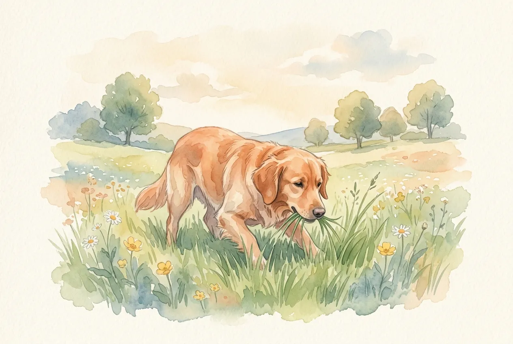

Fast jeder Hundehalter kennt die Situation: Der Hund bleibt beim Spaziergang stehen, senkt den Kopf und beginnt genüsslich Gras zu fressen. Dieses Verhalten ist bei Hunden weit verbreitet -- laut einer Studie der University of California zeigen rund 80 % aller Hunde gelegentliches Grasfressen. Doch warum fressen Hunde Gras? Ist das ein natürlicher Instinkt oder ein Warnsignal für gesundheitliche Probleme?

Die gute Nachricht: In den meisten Fällen ist Grasfressen beim Hund völlig harmlos. Trotzdem gibt es Situationen, in denen das Verhalten auf Magen-Darm-Probleme, Nährstoffmangel oder sogar chronische Schmerzen hindeuten kann. In diesem Ratgeber erfährst du die 7 häufigsten Gründe, wann du einen Tierarzt aufsuchen solltest und wie du deinen Hund bei Magenproblemen unterstützen kannst.

Zusammenfassung: Warum Hunde Gras fressen

<ul>
<li><strong>Normales Verhalten</strong> -- Rund 80 % aller Hunde fressen gelegentlich Gras, ohne dass eine Erkrankung vorliegt</li>
<li><strong>Häufigste Ursachen</strong> -- Instinkt, Geschmack, Langeweile, Ballaststoffbedarf oder Magen-Darm-Beschwerden</li>
<li><strong>Erbrechen nach Grasfressen</strong> -- Nur etwa 10 % der grasfressenden Hunde erbrechen danach tatsächlich</li>
<li><strong>Gefahr durch behandelte Flächen</strong> -- Pestizide, Dünger und Schneckenkorn auf Gras können Vergiftungen auslösen</li>
<li><strong>Tierarzt aufsuchen</strong> -- Bei täglichem, zwanghaftem Grasfressen, Erbrechen mit Blut oder Apathie ist ein Tierarztbesuch Pflicht</li>
</ul>

80 %

aller Hunde fressen Gras

~10 %

erbrechen danach

7

häufigste Ursachen

< 25 %

zeigen Krankheitssymptome

## Warum fressen Hunde Gras? Die 7 häufigsten Gründe

Das Grasfressen bei Hunden hat selten nur eine einzige Ursache. Tierärzte und Verhaltensforscher unterscheiden zwischen instinktiven, ernährungsbedingten und gesundheitlichen Gründen. Die folgende Übersicht zeigt die 7 häufigsten Ursachen, warum dein Hund Gras frisst.

### 1. Natürlicher Instinkt aus der Abstammung vom Wolf

Hunde stammen vom Wolf ab, und Wölfe nehmen über den Mageninhalt ihrer Beutetiere regelmäßig pflanzliche Bestandteile auf. Gräser, Kräuter und Beeren gehören dadurch indirekt zum natürlichen Nahrungsspektrum von Caniden. Dieses instinktive Verhalten ist bei domestizierten Hunden erhalten geblieben -- unabhängig von Rasse, Alter oder Fütterungsart.

### 2. Geschmack und Genuss

Viele Hunde fressen Gras schlicht, weil es ihnen schmeckt. Besonders junge, saftige Grashalme im Frühling und Sommer sind bei Hunden beliebt. Dieses Verhalten zeigt sich oft an entspannter Körperhaltung: Der Hund grast gemütlich, ohne Hektik oder Stress. Wenn dein Hund gezielt bestimmte Grasarten auswählt und dabei entspannt wirkt, handelt es sich mit hoher Wahrscheinlichkeit um reinen Genuss.

### 3. Ballaststoffbedarf und Verdauungsunterstützung

Gras liefert natürliche Ballaststoffe, die die Darmtätigkeit anregen. Hunde, deren Futter wenig Faserstoffe enthält, greifen instinktiv zu Gras als Ergänzung. Die Pflanzenfasern fördern die Darmmotilität und können die Verdauung regulieren. Eine ballaststoffreiche Ernährung -- etwa durch Zugabe von gekochtem Gemüse wie [Äpfeln](https://hundewissen-mit-kopf.de/hundeernaehrung/duerfen-hunde-aepfel-essen/) oder Karotten -- kann das Grasfressen in solchen Fällen reduzieren.

### 4. Langeweile und Stressabbau

Grasfressen kann ein Anzeichen für Unterbeschäftigung sein. Hunde, die zu wenig geistige oder körperliche Auslastung erhalten, entwickeln häufiger Ersatzhandlungen -- Grasfressen gehört dazu. Auch Stress und Anspannung können das Verhalten auslösen. In diesem Fall hat das Grasfressen eine beruhigende Wirkung, ähnlich wie Kauen auf einem Kauknochen.

### 5. Magen-Darm-Beschwerden und Übelkeit

Hunde mit Magenproblemen fressen häufig hektisch und in großen Mengen Gras. Die langen Grashalme reizen die Magenschleimhaut und können einen Brechreiz auslösen. Auf diese Weise versucht der Hund instinktiv, Übelkeit zu lindern oder den Magen zu entleeren. Dieses gezielte Grasfressen unterscheidet sich deutlich vom entspannten Grasen: Es wirkt hastig, der Hund schluckt die Halme nahezu unzerkaut herunter.

### 6. Nährstoffmangel und Folsäurebedarf

Ein Mangel an bestimmten Mikronährstoffen -- insbesondere Folsäure -- wird als mögliche Ursache für vermehrtes Grasfressen diskutiert. Gras enthält Folsäure (Vitamin B9), die eine wichtige Rolle bei der Zellteilung und Blutbildung spielt. Wissenschaftlich eindeutig belegt ist dieser Zusammenhang bisher nicht, doch Tierärzte beobachten, dass eine Futterumstellung auf nährstoffreicheres Futter das Grasfressen bei manchen Hunden reduziert.

### 7. Chronische Schmerzen im Magen-Darm-Trakt

In seltenen Fällen kann zwanghaftes Grasfressen auf chronische Schmerzen im Magen-Darm-Trakt hindeuten. Erkrankungen wie chronische Gastritis, entzündliche Darmerkrankungen (IBD) oder Sodbrennen führen zu anhaltendem Unwohlsein. Betroffene Hunde fressen oft täglich große Mengen Gras und zeigen zusätzlich Symptome wie Schmatzen, häufiges Schlucken oder Aufstoßen.

🌿

Instinkt & Genuss

Natürliches Verhalten aus der Abstammung vom Wolf -- der Hund grast entspannt und selektiv.

🥗

Ballaststoffe & Nährstoffe

Gras liefert Faserstoffe und Folsäure, die im regulären Futter fehlen können.

😟

Langeweile & Stress

Unterbeschäftigte Hunde nutzen Grasfressen als beruhigende Ersatzhandlung.

🩺

Magen-Darm-Probleme

Hektisches Grasfressen kann auf Übelkeit, Gastritis oder chronische Schmerzen hindeuten.

## Hund frisst Gras: Harmlos oder Warnsignal?

Die Unterscheidung zwischen harmlosem und bedenklichem Grasfressen ist für Hundehalter entscheidend. Nicht jedes Grasfressen erfordert einen Tierarztbesuch -- doch bestimmte Begleitsymptome solltest du ernst nehmen.

### Harmloses Grasfressen erkennen

Gelegentliches, entspanntes Grasfressen ist bei Hunden normal und kein Grund zur Sorge. Typische Merkmale für harmloses Verhalten sind: Der Hund wählt gezielt einzelne Grashalme aus, kaut sie gründlich und wirkt dabei entspannt. Es tritt kein Erbrechen auf, und der Hund zeigt ansonsten normales Fress- und Spielverhalten. Dieses Verhalten tritt bei den meisten Hunden saisonal verstärkt im Frühling auf, wenn frisches Gras besonders saftig ist.

### Warnsignale beim Grasfressen

Bedenklich wird das Grasfressen, wenn es hektisch, zwanghaft und in großen Mengen auftritt. Folgende Warnsignale solltest du beachten:

| Warnsignal | Mögliche Ursache | Handlung |
|---|---|---|
| Hektisches Verschlingen ohne Kauen | Übelkeit, Magenreizung | Tierarzt innerhalb von 24 Stunden |
| Tägliches Grasfressen in großen Mengen | Chronische Magen-Darm-Erkrankung | Tierarzt zeitnah aufsuchen |
| Erbrechen mit Blut nach Grasfressen | Magenschleimhautverletzung, Vergiftung | Sofort zum Tierarzt |
| Grasfressen + Durchfall + Appetitlosigkeit | Magen-Darm-Infektion, Parasiten | Tierarzt innerhalb von 24 Stunden |
| Grasfressen + Schmatzen + häufiges Schlucken | Magenübersäuerung, Sodbrennen | Tierarzt aufsuchen |
| Grasfressen + Gewichtsverlust + Apathie | Chronische Schmerzen, ernste Erkrankung | Dringend zum Tierarzt |

## Warum fressen Hunde Gras und übergeben sich?

Rund 10 % der Hunde, die Gras fressen, erbrechen sich anschließend. Dieses Verhalten hat eine biologische Erklärung: Lange, unzerkaute Grashalme kitzeln die Rachenschleimhaut und die Magenwand, was einen Brechreiz auslöst. Manche Hunde setzen diesen Mechanismus gezielt ein, um ihren Magen zu entlasten.

### Gezieltes Erbrechen als Selbstmedikation

Hunde mit Übelkeit oder einem Fremdkörper im Magen fressen oft instinktiv lange Grashalme, um das Erbrechen auszulösen. Dieses Verhalten ist eine Art natürliche Selbstmedikation. Nach dem Erbrechen wirken die betroffenen Hunde häufig sichtbar erleichtert und fressen anschließend normal. Tritt dieses gezielte Erbrechen nur gelegentlich auf -- etwa einmal im Monat -- ist es in der Regel unbedenklich.

### Magenübersäuerung als häufige Ursache

Eine Magenübersäuerung ist eine der häufigsten Ursachen für das Zusammenspiel aus Grasfressen und Erbrechen. Typische Anzeichen einer Magenübersäuerung beim Hund sind:

- Grasfressen besonders morgens auf nüchternen Magen
- Schmatzen und häufiges Lippenlecken
- Aufstoßen und gelbliches Erbrechen (Gallenflüssigkeit)
- Unruhe in den frühen Morgenstunden

💡

<strong>Tipp bei Magenübersäuerung</strong>

Füttere deinen Hund abends eine kleine Spätmahlzeit (z. B. eine Handvoll Trockenfutter oder ein Löffel Hüttenkäse), damit der Magen über Nacht nicht vollständig leer ist. Ulmenrinde (Slippery Elm Bark) kann als natürliches Hausmittel die Magenschleimhaut schützen -- sprich die Dosierung mit deinem Tierarzt ab.

### Wann Erbrechen nach Grasfressen gefährlich wird

Gelegentliches Erbrechen nach dem Grasfressen ist meist harmlos. Ein Tierarzt sollte jedoch eingeschaltet werden, wenn das Erbrechen häufiger als 2-mal pro Woche auftritt, Blut im Erbrochenen sichtbar ist, der Hund zusätzlich Durchfall oder Fieber zeigt oder das Erbrechen länger als 24 Stunden anhält. In diesen Fällen kann eine ernsthafte Erkrankung des Magen-Darm-Trakts vorliegen.

## Ist Grasfressen für Hunde gefährlich?

Das Grasfressen selbst ist für Hunde nicht gefährlich. Die Risiken liegen vielmehr in den Substanzen, die sich auf dem Gras befinden können. Hundehalter sollten daher weniger das Verhalten als den Ort des Grasfressens im Blick behalten.

### Gefahren durch Pestizide und Düngemittel

Gras in Parks, an Straßenrändern und auf landwirtschaftlichen Flächen kann mit Pestiziden, Herbiziden oder Düngemitteln behandelt sein. Diese Chemikalien können bei Hunden Vergiftungssymptome auslösen -- von leichtem Speicheln bis hin zu schweren Magen-Darm-Beschwerden. Besonders im Frühjahr und Herbst werden öffentliche Grünflächen häufig behandelt.

🚫

<strong>Achtung: Schneckenkorn ist hochgiftig für Hunde!</strong>

Schneckenkorn (Metaldehyd) wird häufig in Gärten und Parks ausgestreut und ist für Hunde lebensbedrohlich. Bereits 0,5 g pro kg Körpergewicht können tödlich sein. Symptome treten innerhalb von 1-3 Stunden auf: Zittern, Krämpfe, erhöhte Körpertemperatur. Bei Verdacht sofort den Tierarzt oder die Giftzentrale kontaktieren. Erfahre mehr über [giftige Lebensmittel wie Schokolade](https://hundewissen-mit-kopf.de/hundeernaehrung/warum-duerfen-hunde-keine-schokolade/).

### Lungenwürmer durch Schnecken auf Gras

Eine oft unterschätzte Gefahr beim Grasfressen sind Lungenwürmer (*Angiostrongylus vasorum*). Die Larven dieser Parasiten werden von Schnecken und Nacktschnecken übertragen, die auf Grashalmen kriechen. Frisst ein Hund befallenes Gras, können die Larven in den Körper gelangen und sich in der Lunge ansiedeln. Symptome einer Lungenwurminfektion sind chronischer Husten, Atemnot und Blutgerinnungsstörungen. Regelmäßige Entwurmung schützt deinen Hund -- sprich mit deinem Tierarzt über ein passendes Entwurmungsschema.

### Welche Grasarten dürfen Hunde fressen?

Nicht jedes Grün ist für Hunde unbedenklich. Normale Wiesengräser sind in der Regel ungefährlich. Vorsicht ist geboten bei Ziergräsern in Gärten, die scharfkantige Blätter haben und die Magen- oder Speiseröhrenschleimhaut verletzen können.

| Grasart | Unbedenklich? | Hinweis |
|---|---|---|
| Wiesengras (unbehandelt) | ✅ Ja | Auf unbehandelte Flächen achten |
| Weidelgras | ✅ Ja | Häufig auf Wiesen und in Gärten |
| Katzengras | ✅ Ja | Sichere Alternative für zu Hause |
| Ziergräser (Pampasgras etc.) | ⚠️ Bedingt | Scharfe Blätter können verletzen |
| Gras an Straßenrändern | ❌ Nein | Abgase, Streusalz, Hundeurin |
| Gras in Landwirtschaftsnähe | ⚠️ Bedingt | Pestizid- und Düngergefahr |

## Hund frisst Gras: Was tun? Praktische Tipps

Wenn dein Hund regelmäßig Gras frisst, kannst du mit einfachen Maßnahmen herausfinden, ob eine harmlose Gewohnheit oder ein gesundheitliches Problem dahintersteckt. Die folgenden Schritte helfen dir, das Verhalten richtig einzuordnen.

1

Verhalten beobachten

Dokumentiere, wann und wie oft dein Hund Gras frisst. Notiere Tageszeit, Menge und ob der Hund entspannt oder hektisch wirkt.

2

Futter überprüfen

Kontrolliere den Ballaststoff- und Nährstoffgehalt des Futters. Ergänze bei Bedarf Gemüse wie Karotten, Gurke oder gekochte Zucchini.

3

Auslastung erhöhen

Biete mehr geistige und körperliche Beschäftigung an. Suchspiele, Kauartikel und abwechslungsreiche Spaziergänge reduzieren Langeweile.

✓

Tierarzt konsultieren

Zeigt dein Hund Begleitsymptome wie Erbrechen, Durchfall oder Apathie, lass die Ursache tierärztlich abklären.

### Ernährung anpassen und Ballaststoffe ergänzen

Eine ballaststoffreiche Ernährung kann übermäßiges Grasfressen deutlich reduzieren. Tierärzte empfehlen, dem Futter natürliche Faserquellen beizumischen. Geeignete Ballaststoffquellen für Hunde sind:

- **Gekochte Karotten** -- reich an Faserstoffen und Beta-Carotin
- **Gekochte Zucchini** -- gut verdaulich und kalorienarm
- **Kürbis (püriert)** -- beruhigt den Magen-Darm-Trakt
- **Flohsamenschalen** -- quellen im Darm und fördern die Verdauung (1/2 Teelöffel pro 10 kg Körpergewicht)
- **Leinsamen (geschrotet)** -- liefern Omega-3-Fettsäuren und Ballaststoffe

Auch [Bananen](https://hundewissen-mit-kopf.de/hundeernaehrung/duerfen-hunde-bananen-essen/) und [Erdbeeren](https://hundewissen-mit-kopf.de/hundeernaehrung/duerfen-hunde-erdbeeren-essen/) eignen sich als ballaststoffreiche Snacks in kleinen Mengen.

### Katzengras als sichere Alternative

Katzengras ist eine unbedenkliche Alternative für Hunde, die gerne Gras fressen. Du kannst es in einer Schale auf dem Balkon oder in der Wohnung anbieten. Der Vorteil: Du kontrollierst die Qualität und stellst sicher, dass das Gras frei von Schadstoffen ist. Katzengras ist in Tierhandlungen und Gartencentern für 2-5 Euro erhältlich.

## Ab wann zum Tierarzt? Klare Warnsignale

Gelegentliches Grasfressen erfordert keinen Tierarztbesuch. Bestimmte Begleitsymptome sind jedoch klare Warnsignale, die eine tierärztliche Untersuchung notwendig machen.

Kein Tierarzt nötig

<ul>
<li>Gelegentliches, entspanntes Grasen (1-3x pro Woche)</li>
<li>Hund wählt gezielt einzelne Halme aus</li>
<li>Kein Erbrechen oder Durchfall danach</li>
<li>Normaler Appetit und normales Verhalten</li>
<li>Saisonale Häufung im Frühling/Sommer</li>
</ul>

Tierarzt aufsuchen

<ul>
<li>Tägliches, hektisches Grasfressen in großen Mengen</li>
<li>Regelmäßiges Erbrechen nach dem Grasfressen (mehr als 2x/Woche)</li>
<li>Blut im Erbrochenen oder im Stuhl</li>
<li>Gewichtsverlust, Appetitlosigkeit oder Apathie</li>
<li>Zusätzliches Schmatzen, Aufstoßen und Unruhe</li>
</ul>

### Welche Untersuchungen führt der Tierarzt durch?

Bei Verdacht auf eine Magen-Darm-Erkrankung wird der Tierarzt in der Regel folgende Untersuchungen durchführen:

1. **Allgemeine klinische Untersuchung** -- Abtasten des Bauchraums, Temperaturmessung
2. **Blutbild** -- Entzündungswerte, Organfunktion, Nährstoffstatus
3. **Kotuntersuchung** -- Parasiten, Bakterien, Blut im Stuhl
4. **Ultraschall** -- Darstellung von Magen, Darm und Leber
5. **Gastroskopie** -- Bei Verdacht auf chronische Gastritis oder Fremdkörper (unter Narkose)

Die Kosten für eine Basisuntersuchung mit Blutbild liegen laut Gebührenordnung für Tierärzte (GOT) bei 80-200 Euro. Eine Gastroskopie kann 300-600 Euro kosten.

⚠️

<strong>Vergiftungsverdacht: Sofort handeln!</strong>

Hat dein Hund Gras auf einer möglicherweise behandelten Fläche gefressen und zeigt Symptome wie Speicheln, Zittern, Erbrechen oder Krämpfe, kontaktiere sofort deinen Tierarzt oder die Giftzentrale (Telefon: 030 19240). Bringe möglichst eine Probe des Grases mit.

## Dürfen Hunde Gras fressen? Die Wissenschaft

Die wissenschaftliche Forschung zum Grasfressen bei Hunden liefert klare Erkenntnisse. Eine vielzitierte Studie der University of California aus dem Jahr 2008 untersuchte das Grasfressen bei über 1.500 Hunden und kam zu folgenden Ergebnissen.

### Studienergebnisse zum Grasfressen

| Ergebnis | Prozentsatz |
|---|---|
| Hunde, die regelmäßig Pflanzen fressen | 79 % |
| Gras als bevorzugte Pflanze | 68 % |
| Hunde, die nach dem Grasfressen erbrechen | < 10 % |
| Hunde, die vor dem Grasfressen krank wirkten | < 10 % |
| Junge Hunde fressen häufiger Gras als ältere | Signifikant häufiger |

Diese Daten zeigen deutlich: Grasfressen ist ein normales Verhalten bei Hunden und in den meisten Fällen kein Anzeichen für eine Erkrankung. Die weit verbreitete Annahme, dass Hunde Gras fressen, um sich zu übergeben, trifft nur auf eine kleine Minderheit zu.

ℹ️

<strong>Evolutionsbiologischer Hintergrund</strong>

Auch Wölfe und wildlebende Caniden fressen regelmäßig Pflanzenmaterial. Untersuchungen von Wolfskot zeigen, dass bis zu 11 % des Mageninhalts aus Gräsern und Kräutern bestehen. Das Grasfressen ist damit ein evolutionär verankertes Verhalten, das über Jahrtausende erhalten geblieben ist.

## Kann ich meinem Hund das Grasfressen abtrainieren?

Das Grasfressen vollständig abzutrainieren ist weder nötig noch sinnvoll, solange es sich um harmloses Verhalten handelt. Ein natürlicher Instinkt lässt sich nicht einfach "abschalten". Stattdessen solltest du die Ursache für übermäßiges Grasfressen identifizieren und gezielt angehen.

### Grasfressen durch Beschäftigung reduzieren

Hunde, die aus Langeweile Gras fressen, profitieren von mehr geistiger Auslastung. [Grundkommandos trainieren](https://hundewissen-mit-kopf.de/erziehung-verhalten/kommandos-hund/), Suchspiele auf dem Spaziergang und interaktive Futterspielzeuge lenken den Hund ab und befriedigen sein Bedürfnis nach Beschäftigung. Auch ein abwechslungsreicher Spaziergang mit neuen Routen und Schnüffelmöglichkeiten kann helfen.

### Wann du das Grasfressen unterbinden solltest

In bestimmten Situationen solltest du deinen Hund aktiv vom Grasfressen abhalten:

- **An Straßenrändern** -- Belastung durch Abgase, Streusalz und Hundeurin
- **In der Nähe landwirtschaftlicher Flächen** -- Pestizid- und Düngergefahr
- **In Parks mit Schneckenkorn-Warnschildern** -- Vergiftungsgefahr
- **Bei frisch gedüngten Rasenflächen** -- Erkennbar an Düngergeruch oder Warnschildern
- **Bei hektischem, zwanghaftem Grasfressen** -- Hinweis auf gesundheitliche Probleme

Ein zuverlässiges [Abrufkommando](https://hundewissen-mit-kopf.de/erziehung-verhalten/leinenfuehrigkeit-trainieren/) ist in solchen Situationen besonders wertvoll. Trainiere ein klares "Lass es"-Signal, das du im Alltag einsetzen kannst.

✅ Checkliste: Sicheres Grasfressen für deinen Hund

✓

Nur auf unbehandelten, bekannten Wiesen grasen lassen

✓

Regelmäßige Entwurmung gegen Lungenwürmer

✓

Ballaststoffreiches Futter mit Gemüseanteil

✓

Ausreichend geistige und körperliche Beschäftigung

✓

Katzengras als sichere Alternative zu Hause

Bei Warnsignalen zeitnah den Tierarzt aufsuchen

## Grasfressen und andere ungewöhnliche Fressgewohnheiten

Grasfressen ist nicht die einzige ungewöhnliche Fressgewohnheit bei Hunden. Manche Hunde fressen auch Erde, Stöcke oder sogar Kot. Während Grasfressen in den meisten Fällen harmlos ist, können andere Verhaltensweisen auf ernsthaftere Probleme hindeuten.

📖

Definition: Pica-Syndrom

Das Pica-Syndrom bezeichnet das zwanghafte Fressen von nicht-nahrhaften Substanzen wie Erde, Steinen, Stoff oder Plastik. Es kann auf Nährstoffmangel, Magen-Darm-Erkrankungen oder Verhaltensstörungen hindeuten und erfordert immer eine tierärztliche Abklärung.

Grasfressen allein ist kein Pica-Syndrom, da Gras ein natürlicher Bestandteil der Caniden-Ernährung ist. Frisst dein Hund jedoch zusätzlich zum Gras auch Erde, Steine oder [Kot anderer Tiere](https://hundewissen-mit-kopf.de/erziehung-verhalten/fressen-hunde-kot/), solltest du das Verhalten von einem Tierarzt oder Verhaltenstherapeuten beurteilen lassen.

## Fazit: Hunde fressen Gras -- meist ganz normal

Grasfressen ist bei Hunden ein weit verbreitetes, natürliches Verhalten. Rund 80 % aller Hunde fressen gelegentlich Gras, und in der überwiegenden Mehrheit der Fälle steckt keine Erkrankung dahinter. Die häufigsten Gründe sind Instinkt, Geschmack, Ballaststoffbedarf und Langeweile.

Achte darauf, dass dein Hund nur auf unbehandelten Wiesen grast, und beobachte sein Verhalten genau. Hektisches, tägliches Grasfressen mit Erbrechen, Durchfall oder Appetitlosigkeit ist ein klares Signal für einen Tierarztbesuch. Mit einer ausgewogenen, ballaststoffreichen Ernährung und ausreichend Beschäftigung kannst du übermäßiges Grasfressen wirksam reduzieren.

✅

<strong>Merke dir</strong>

Gelegentliches, entspanntes Grasfressen ist für Hunde völlig normal und unbedenklich. Solange dein Hund dabei entspannt wirkt, nicht erbricht und keine weiteren Symptome zeigt, darfst du ihn ruhig grasen lassen -- am besten auf unbehandelten Wiesen abseits von Straßen und landwirtschaftlichen Flächen.

