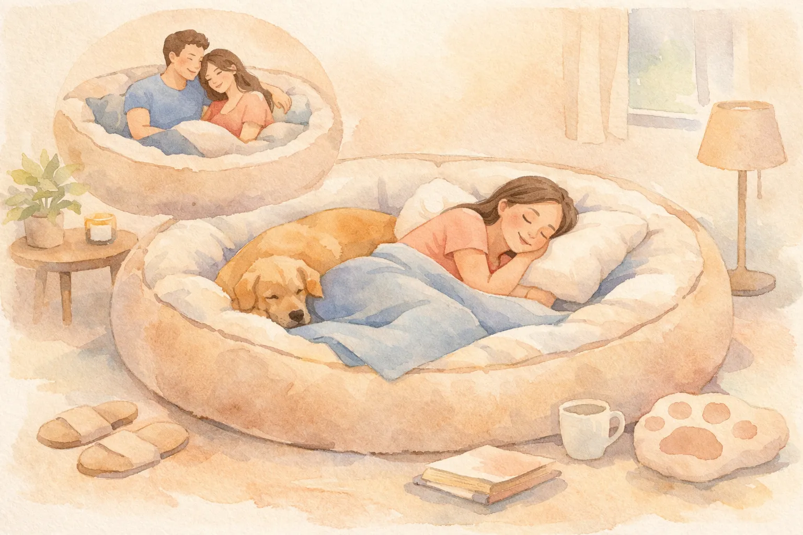
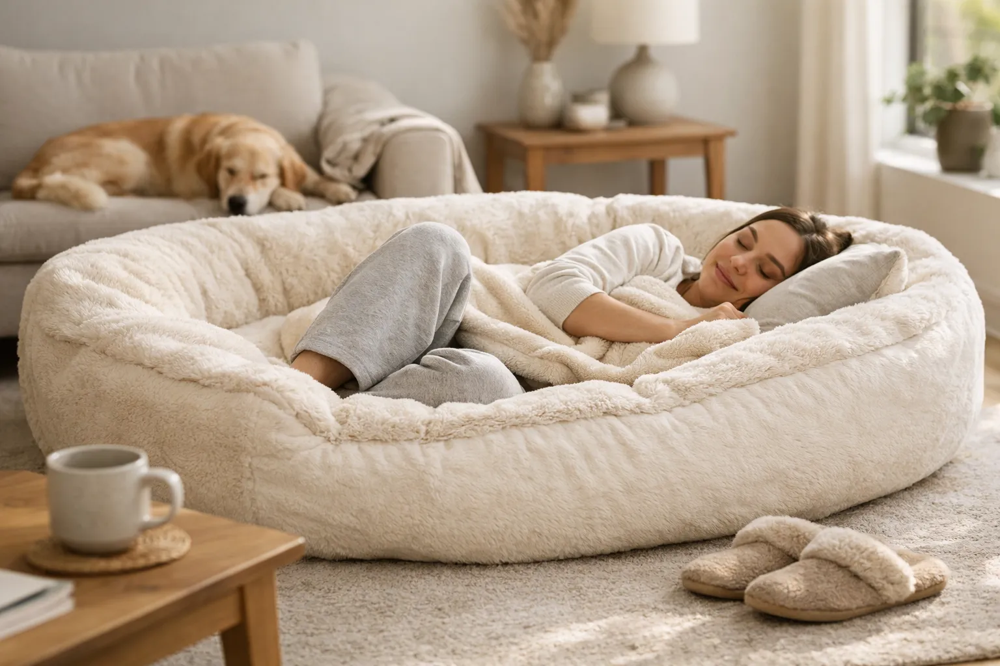
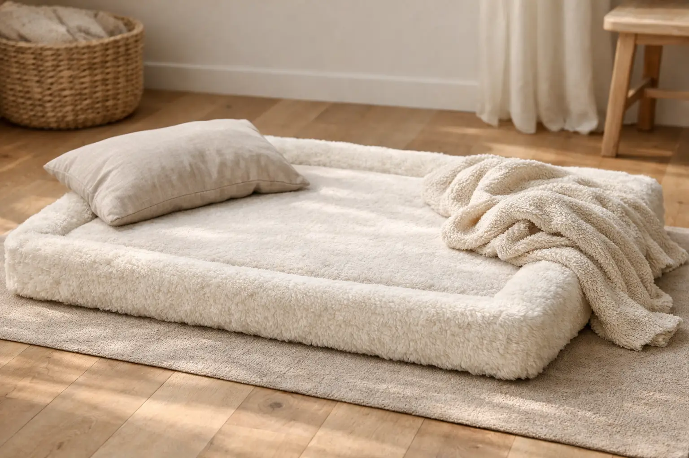

Ein Hundebett für Menschen ist weit mehr als ein Internet-Gag -- es ist ein wachsender Einrichtungstrend, der Gemütlichkeit und Nähe zum Hund auf ein neues Level hebt. Die übergroßen Betten im typischen Hundebett-Design bieten Platz für Erwachsene und ihre Vierbeiner und bestehen häufig aus Memory Foam mit kuscheligem Plüschbezug.

Doch lohnt sich die Anschaffung wirklich? In diesem Faktencheck erfährst du alles über Größen, Materialien, Vor- und Nachteile sowie konkrete Kaufempfehlungen für das sogenannte Human Dog Bed. Ob als Sitzsack Bett, Kuschelecke oder Entspannungsort -- wir klären, was hinter dem Hype steckt.

Zusammenfassung: Hundebett für Menschen

<ul>
<li><strong>Größen von 150 bis 200 cm</strong> -- gängige Maße liegen zwischen 170 x 100 cm und 200 x 130 cm für Erwachsene mit Hund</li>
<li><strong>Memory Foam als Kernmaterial</strong> -- 5 bis 25 cm dicker Memory Schaum sorgt für Druckentlastung und Komfort</li>
<li><strong>Preisspanne 50–400 Euro</strong> -- je nach Größe, Material und Marke (z. B. Plufl, Knuffelwuff Plufi, VEVOR)</li>
<li><strong>Kein Bett-Ersatz</strong> -- ideal als Entspannungsort, Leseecke oder gemeinsamer Kuschelplatz mit dem Hund</li>
<li><strong>Waschbarer Bezug ist Pflicht</strong> -- abnehmbare, maschinenwaschbare Bezüge erleichtern die Hygiene bei Tierhaaren</li>
</ul>

200 cm

Maximale Länge (XXL)

50–400 €

Preisspanne

25 cm

Max. Schaumdicke

72 %

Hundehalter teilen ihr Bett

## Was genau ist ein Hundebett für Menschen?

Ein Hundebett für Menschen -- im Englischen als Human Dog Bed bekannt -- ist ein übergroßes Liegekissen im klassischen Hundebett-Design. Die ovale oder runde Form mit erhöhtem Rand erinnert bewusst an ein herkömmliches Hundebett, bietet aber Platz für eine oder sogar zwei erwachsene Personen.

Das Konzept stammt ursprünglich aus den USA. Das Start-up Plufl brachte 2022 das erste Human Dog Bed über eine Kickstarter-Kampagne auf den Markt und sammelte innerhalb weniger Wochen über 1 Million US-Dollar ein. Seitdem haben zahlreiche Hersteller nachgezogen -- darunter deutsche Marken wie Knuffelwuff mit dem Modell Plufi sowie internationale Anbieter wie VEVOR und BingoPaw.

### Typische Merkmale eines Human Dog Beds

Das Hundebett für Menschen unterscheidet sich von einem normalen Sitzsack oder einer Bodenmatratze durch mehrere Merkmale. Der erhöhte Rand dient als Kopf- und Armstütze und vermittelt ein geborgenes, nestartiges Liegegefühl. Die Füllung besteht in der Regel aus Memory Foam oder einer Kombination aus Schaumstoffkern und Polyesterfaser.

Die meisten Modelle verfügen über einen abnehmbaren Bezug aus Plüsch, Kunstfell oder Mikrofaser. Dieser Bezug lässt sich per Reißverschluss lösen und in der Waschmaschine reinigen -- ein entscheidender Vorteil, wenn Hunde das Bett mitbenutzen.

### Für wen ist ein Hundebett für Menschen gedacht?

Das Hundebett für Erwachsene richtet sich an Hundehalter, die einen gemütlichen Kuschelplatz mit ihrem Vierbeiner suchen. Laut American Kennel Club teilen rund 72 % aller Hundebesitzer ihren Schlafplatz mit dem Hund. Ein Human Dog Bed bietet eine Alternative zum gemeinsamen Schlafen im regulären Bett und schont dabei die Matratze.

Darüber hinaus nutzen viele Menschen das Bett als Entspannungsecke im Wohnzimmer, als Leseecke oder als Ort für kurze Nickerchen. Auch für Kinder ist es ein beliebter Spielplatz -- die weiche, geschützte Liegefläche lädt zum Toben und Kuscheln ein.

## Hundebett für Menschen: Größen und Maße im Überblick

Die richtige Größe ist der wichtigste Faktor beim Kauf eines Hundebetts für Menschen. Zu kleine Modelle bieten keinen Komfort, zu große passen nicht in die Wohnung. Die folgende Tabelle zeigt die gängigsten Größen im Vergleich.

| Größe | Maße (ca.) | Geeignet für | Gewicht |
|---|---|---|---|
| L | 150 x 90 x 15 cm | 1 Person + kleiner Hund | 8–12 kg |
| XL | 170 x 100 x 20 cm | 1 Person + mittelgroßer Hund | 12–18 kg |
| XXL | 180 x 120 x 24 cm | 1–2 Personen + großer Hund | 18–22 kg |
| XXXL | 200 x 130 x 25 cm | 2 Personen + großer Hund | 22–28 kg |

### Riesen Hundebett für Menschen: Ab wann lohnt sich XXL?

Ein riesen Hundebett für Menschen ab 180 cm Länge lohnt sich, wenn du gemeinsam mit deinem Hund darauf liegen möchtest. Bei einer Körpergröße ab 175 cm solltest du mindestens ein XXL-Modell mit 180 x 120 cm wählen, um bequem ausgestreckt liegen zu können.

Für große Hunderassen wie Deutsche Schäferhunde, Golden Retriever oder Labradore empfiehlt sich ein XXXL-Hundebett mit mindestens 200 x 130 cm. Diese Maße bieten ausreichend Platz, damit weder Mensch noch Hund eingeengt wird. Bedenke allerdings, dass ein XXL Hundebett für Menschen mit über 20 kg Gewicht schwer zu transportieren ist.

💡

<strong>Tipp: Vor dem Kauf ausmessen</strong>

Miss den geplanten Stellplatz genau aus und rechne 20 cm Puffer pro Seite ein. Der erhöhte Rand vergrößert die Außenmaße um 15–25 cm gegenüber der reinen Liegefläche.

### Klappbare Modelle für kleine Wohnungen

Wer wenig Platz hat, findet auch klappbare Hundebetten für Menschen. Diese Modelle lassen sich auf etwa ein Drittel ihrer Größe zusammenfalten und im Schrank verstauen. Der Nachteil: Klappbare Varianten verwenden dünneren Schaumstoff (meist 8–12 cm statt 20–25 cm) und bieten weniger Stützwirkung als starre Modelle.

## Material und Füllung: Memory Foam vs. Alternativen

Das Material bestimmt maßgeblich den Komfort und die Langlebigkeit eines Hundebetts für Menschen. Memory Foam hat sich als beliebtestes Füllmaterial durchgesetzt -- doch es gibt Alternativen.

### Memory Foam: Der Goldstandard

Memory Foam -- auch als viskoelastischer Schaum oder Memory Schaum bezeichnet -- wurde ursprünglich von der NASA für Flugzeugsitze entwickelt. Das Material reagiert auf Körperwärme und Druck, passt sich der individuellen Körperform an und kehrt nach der Belastung in seine Ursprungsform zurück.

Im Hundebett für Menschen sorgt Memory Foam für eine gleichmäßige Druckverteilung. Gelenke, Wirbelsäule und Hüfte werden entlastet -- ein Vorteil, den auch orthopädische Hundebetten nutzen. Die Schaumdicke variiert zwischen 5 und 25 cm, wobei Modelle ab 15 cm deutlich besseren Komfort bieten.

📖

Definition: Memory Foam (viskoelastischer Schaum)

Ein temperaturempfindlicher Schaumstoff, der sich unter Druck und Wärme an die Körperform anpasst. Nach Entlastung kehrt er langsam in seine Ausgangsform zurück. Im Hundebett für Menschen sorgt er für Druckentlastung und ein geborgenes Liegegefühl.

### Alternativen zu Memory Foam

Nicht jedes Hundebett für Menschen enthält Memory Foam. Die folgende Tabelle vergleicht die gängigsten Füllmaterialien.

| Material | Komfort | Haltbarkeit | Preis | Besonderheiten |
|---|---|---|---|---|
| Memory Foam | Sehr hoch | 3–5 Jahre | Mittel–Hoch | Druckentlastend, temperaturempfindlich |
| Polyesterfaser | Mittel | 1–2 Jahre | Niedrig | Leicht, waschbar, verliert schnell Form |
| EPS-Perlen (Sitzsack) | Mittel | 2–3 Jahre | Niedrig–Mittel | Anpassbar, raschelt leicht |
| Kaltschaum | Hoch | 3–5 Jahre | Mittel | Gute Stützwirkung, weniger Anpassung |
| Latex | Sehr hoch | 5–7 Jahre | Hoch | Natürlich, hypoallergen, schwer |

ℹ️

<strong>Sitzsack Bett vs. Memory-Foam-Bett</strong>

Ein Sitzsack Bett mit EPS-Perlen-Füllung ist leichter und günstiger, bietet aber deutlich weniger Stützwirkung als ein Memory-Foam-Modell. Für gelegentliches Entspannen reicht ein Sitzsack -- für regelmäßige Nutzung als Kuschelplatz ist Memory Foam die bessere Wahl.

## Vor- und Nachteile eines Hundebetts für Menschen

Bevor du ein Hundebett für Menschen kaufst, solltest du die Vor- und Nachteile kennen. Das Human Dog Bed ist kein Alleskönner -- aber für den richtigen Einsatzzweck eine echte Bereicherung.

Vorteile

<ul>
<li>Gemeinsamer Kuschelplatz für Mensch und Hund stärkt die Bindung</li>
<li>Memory Foam entlastet Gelenke und Wirbelsäule</li>
<li>Schont das reguläre Bett vor Tierhaaren und Schmutz</li>
<li>Gemütliche Lese- und Entspannungsecke im Wohnzimmer</li>
<li>Waschbare Bezüge erleichtern die Hygiene</li>
<li>Auch für Kinder als Spielfläche geeignet</li>
</ul>

Nachteile

<ul>
<li>Großer Platzbedarf (mind. 150 x 90 cm Stellfläche)</li>
<li>Hohes Gewicht bei XXL-Modellen (bis 28 kg)</li>
<li>Kein Ersatz für ein orthopädisches Bett mit Lattenrost</li>
<li>Schaumkern nicht waschbar -- nur Bezug</li>
<li>Qualitätsunterschiede bei günstigen Modellen sehr groß</li>
<li>Kann bei Hunden mit Dominanzverhalten problematisch sein</li>
</ul>

### Bindung stärken durch gemeinsames Liegen

Laut einer Studie des American Kennel Club kann das gemeinsame Ruhen von Mensch und Hund die Bindung stärken und Stresshormone bei beiden Seiten senken. Ein Hundebett für Menschen bietet dafür einen definierten Platz -- getrennt vom Schlafzimmer, was besonders für Hunde sinnvoll ist, die nachts unruhig schlafen.

Allerdings solltest du bei Hunden mit Ressourcenverteidigung oder Dominanzverhalten vorsichtig sein. Wenn dein [Hund Verhaltensauffälligkeiten zeigt](https://hundewissen-mit-kopf.de/erziehung-verhalten/hund-bellt-staendig/), kläre zunächst mit einem Hundetrainer, ob das gemeinsame Liegen auf einem Bett sinnvoll ist.

## Hundebett für Menschen kaufen: Worauf achten?

Beim Kauf eines Hundebetts für Menschen entscheiden fünf Faktoren über Zufriedenheit oder Enttäuschung. Die folgende Checkliste hilft dir bei der Auswahl.

✅ Kaufcheckliste: Hundebett für Menschen

✓

Größe passend zu Körpergröße + Hundegröße gewählt

✓

Memory Foam mindestens 15 cm dick

✓

Bezug abnehmbar und maschinenwaschbar (30–40 °C)

✓

Antirutsch-Unterseite vorhanden

✓

Schadstoffprüfung (Oeko-Tex oder vergleichbar)

Optional: Seitentaschen für Handy und Fernbedienung

Optional: Tragegriffe für Transport

### Bezug und Hygiene

Für Hundehalter ist ein waschbarer Bezug unverzichtbar. Hundebetten für Menschen sammeln Tierhaare, Speichel und Schmutz -- besonders wenn der Hund nach dem Spaziergang direkt auf das Bett springt. Hochwertige Modelle bieten Bezüge aus Mikrofaser oder Kunstfell, die bei 30–40 °C in der Waschmaschine gereinigt werden können.

Achte auf einen stabilen Reißverschluss, der sich komplett öffnen lässt. Bei Modellen mit Bett Decke als Zubehör sollte auch die Decke separat waschbar sein. Zwischen den Wäschen empfiehlt sich regelmäßiges Absaugen mit einem Tierhaar-Staubsauger.

### Antirutsch-Boden und Stabilität

Ein Hundebett für Menschen liegt direkt auf dem Boden -- und rutscht ohne Antirutsch-Beschichtung auf glatten Oberflächen wie Laminat oder Fliesen. Gute Modelle haben eine gummierte Unterseite oder Noppen, die das Verrutschen verhindern. Dieses Detail ist besonders wichtig, wenn ein großer Hund schwungvoll auf das Bett springt.

## Beliebte Hundebetten für Menschen im Vergleich

Der Markt für Human Dog Beds wächst rasant. Drei Marken haben sich im deutschsprachigen Raum besonders etabliert: Plufl als Pionier, Knuffelwuff als deutsche Alternative und VEVOR als preisgünstige Option.

🏆

Plufl (Original)

Das erste Human Dog Bed. Premium-Qualität, Memory Foam, ab ca. 350 €. Versand aus den USA.

🇩🇪

Knuffelwuff Plufi

Deutsche Marke, ähnliches Konzept. Gute Qualität, ab ca. 200 €. Versand aus Deutschland.

💰

VEVOR

Preis-Leistungs-Sieger. Memory Schaum, mehrere Größen, ab ca. 80 €. Verschiedene Bezugvarianten.

📦

BingoPaw

Budget-Option mit faltbarem Design. Orthopädisch, ab ca. 60 €. Ideal für gelegentliche Nutzung.

| Marke | Größe (cm) | Schaumdicke | Bezug waschbar | Preis (ca.) |
|---|---|---|---|---|
| Plufl Original | 170 x 110 x 20 | 15 cm Memory Foam | Ja, 30 °C | 350–400 € |
| Knuffelwuff Plufi | 180 x 120 x 22 | 18 cm Memory Foam | Ja, 30 °C | 200–280 € |
| VEVOR (Hochflor) | 178 x 120 x 24 | 20 cm Memory Foam | Ja, 40 °C | 80–150 € |
| BingoPaw (faltbar) | 180 x 96 x 10 | 10 cm Kaltschaum | Ja, 30 °C | 60–90 € |
| Activity Board | 170 x 100 x 18 | 12 cm Polyester/Schaum | Ja, 30 °C | 70–120 € |

⚠️

<strong>Vorsicht bei No-Name-Produkten</strong>

Günstige Hundebetten für Menschen unter 50 Euro verwenden häufig minderwertigen Schaumstoff, der bereits nach wenigen Wochen durchliegt. Achte auf Kundenbewertungen zur Langlebigkeit und prüfe, ob eine Schadstoffzertifizierung vorliegt.

## Hundebett für Menschen richtig einrichten

Ein Hundebett für Menschen entfaltet seinen vollen Komfort erst am richtigen Platz und mit dem passenden Zubehör. Die Positionierung im Raum beeinflusst, wie oft du und dein Hund das Bett tatsächlich nutzen.

### Der ideale Standort

Wähle einen ruhigen, zugfreien Platz im Wohnzimmer oder einem separaten Entspannungsraum. Direkt neben der Heizung ist ungünstig -- Memory Foam reagiert auf Wärme und wird dort zu weich. Ein Abstand von mindestens 50 cm zur Wand erleichtert das Beziehen und Reinigen.

Viele Hundehalter platzieren das Hundebett für Menschen bewusst neben dem regulären Hundebett. So hat der Hund die Wahl zwischen seinem eigenen Platz und dem gemeinsamen Kuschelplatz. Diese Wahlmöglichkeit ist besonders für Hunde wichtig, die [gerade erst stubenrein geworden sind](https://hundewissen-mit-kopf.de/erziehung-verhalten/hund-stubenrein-bekommen/) und feste Ruhezonen kennenlernen.

### Sinnvolles Zubehör

Eine zusätzliche Bett Decke schützt die Oberfläche vor Verschmutzung und lässt sich schneller waschen als der gesamte Bezug. Wasserdichte Matratzenschoner unter dem Bezug schützen den Schaumkern vor Feuchtigkeit -- besonders sinnvoll bei Welpen oder älteren Hunden mit Blasenschwäche.

## Hygiene und Pflege: So bleibt das Human Dog Bed frisch

Regelmäßige Pflege ist entscheidend, wenn Hunde das Bett mitbenutzen. Tierhaare, Hautschuppen und Feuchtigkeit bieten einen Nährboden für Milben und Bakterien. Mit der richtigen Routine bleibt dein Hundebett für Menschen hygienisch sauber.

1

Täglich: Haare entfernen

Tierhaare mit einer Fusselrolle oder einem Tierhaar-Handschuh von der Oberfläche entfernen.

2

Wöchentlich: Absaugen

Das gesamte Bett mit der Polsterdüse des Staubsaugers gründlich absaugen -- auch den Rand.

3

Alle 2–4 Wochen: Bezug waschen

Bezug per Reißverschluss abnehmen und bei 30–40 °C in der Waschmaschine waschen. An der Luft trocknen lassen.

✓

Alle 3 Monate: Schaumkern lüften

Memory-Foam-Kern an der frischen Luft auslüften (nicht in direkter Sonne). Bei Flecken feucht abwischen.

Hunde, die regelmäßig gepflegt werden, hinterlassen weniger Schmutz auf dem gemeinsamen Bett. Eine konsequente [Fellpflege-Routine](https://hundewissen-mit-kopf.de/hundepflege/fellpflege-hund/) reduziert den Haarverlust deutlich. Nach dem [Baden deines Hundes](https://hundewissen-mit-kopf.de/hundepflege/hund-baden/) sollte das Fell vollständig trocken sein, bevor er auf das Hundebett für Menschen darf.

## Hundebett neben dem Menschenbett: Eine Alternative?

Nicht jeder möchte ein riesiges Hundebett für Menschen im Wohnzimmer platzieren. Eine beliebte Alternative ist das Hundebett neben dem Menschenbett -- also ein klassisches Hundebett, das direkt neben dem Schlafplatz des Halters steht.

### Hundebett an Menschenbett befestigen

Spezielle Hundebetten lassen sich auf Betthöhe an das Menschenbett ankoppeln. Diese Modelle -- auch als Bettranderhöhungen oder Dog Bed Extensions bekannt -- schaffen eine durchgehende Liegefläche. Der Hund schläft auf seinem eigenen Bett, aber auf gleicher Höhe wie der Mensch.

Diese Lösung eignet sich besonders für Hunde, die nachts Nähe brauchen, aber im eigenen Bett schlafen sollen. Die Trennung der Liegeflächen erleichtert die Hygiene und verhindert, dass der Hund das gesamte Bett beansprucht.

| Lösung | Platzbedarf | Kosten | Hygiene | Nähe zum Hund |
|---|---|---|---|---|
| Hundebett für Menschen (Wohnzimmer) | Hoch | 80–400 € | Mittel | Sehr hoch |
| Hundebett neben Menschenbett | Niedrig | 30–150 € | Hoch | Hoch |
| Hundebett an Menschenbett (Anbau) | Mittel | 50–200 € | Hoch | Sehr hoch |
| Hund im Menschenbett | Keiner | 0 € | Niedrig | Maximal |

📖

<strong>Studie: Schlafqualität mit Hund im Bett</strong>

Eine Studie der Mayo Clinic (2017) zeigte, dass Hunde im Schlafzimmer -- aber nicht im Bett -- die Schlafqualität des Menschen kaum beeinträchtigen. Hunde direkt im Bett führten dagegen zu häufigeren Wachphasen.

## Für welche Hunde eignet sich das gemeinsame Bett?

Grundsätzlich können Hunde jeder Größe ein Hundebett für Menschen mitbenutzen. Allerdings gibt es einige Faktoren, die du berücksichtigen solltest -- von der Größe über das Alter bis zum Verhalten deines Hundes.

### Kleine und mittelgroße Hunde

Kleine Hunderassen bis 10 kg und mittelgroße Hunde bis 25 kg passen problemlos auf jedes Hundebett für Menschen ab Größe L. Sie nehmen wenig Platz ein und hinterlassen weniger Haare als große Rassen. Für [kleine Hunderassen](https://hundewissen-mit-kopf.de/hunderassen/kleine-hunderassen/) ist bereits ein Modell mit 150 x 90 cm ausreichend.

### Große Hunderassen

Große Hunde ab 30 kg benötigen ein XXL Hundebett für Menschen mit mindestens 180 x 120 cm. Achte bei schweren Hunden auf einen Schaumkern mit hoher Dichte (mindestens 50 kg/m³), damit das Memory Foam nicht zu schnell durchliegt. Orthopädische Modelle mit 20–25 cm Schaumdicke sind für große Rassen besonders empfehlenswert.

### Ältere und kranke Hunde

Für Hunde mit Gelenkproblemen, Arthrose oder nach Operationen bietet ein Memory-Foam-Hundebett für Menschen echte gesundheitliche Vorteile. Die Druckentlastung schont schmerzende Gelenke, und der niedrige Einstieg (direkt am Boden) erleichtert das Hinlegen. Wenn dein [Hund zittert](https://hundewissen-mit-kopf.de/hundegesundheit/hund-zittert-ursachen-tun-kannst/) oder Anzeichen von Schmerzen zeigt, kann ein orthopädisches Hundebett für Menschen eine sinnvolle Ergänzung zur tierärztlichen Behandlung sein.

✅

<strong>Ideal für Senioren-Hunde</strong>

Memory Foam verteilt das Körpergewicht gleichmäßig und reduziert Druckpunkte an Hüfte, Schultern und Ellenbogen. Tierärzte empfehlen orthopädische Liegeflächen für Hunde ab dem 7. Lebensjahr oder bei bestehenden Gelenkerkrankungen.

## Hundebett für Menschen selber machen: DIY-Anleitung

Wer handwerklich geschickt ist, kann ein Hundebett für Menschen auch selbst bauen. Die Materialkosten liegen bei 80–150 Euro -- deutlich günstiger als Premium-Modelle.

1

Material besorgen

Memory-Foam-Platte (180 x 120 x 15 cm, ca. 50–80 €), Schaumstoffstreifen für den Rand (10 x 20 cm, 6 Meter), Bezugstoff (Plüsch oder Mikrofaser, 4 m²).

2

Rand formen

Schaumstoffstreifen um die Memory-Foam-Platte legen und mit Textilkleber fixieren. Ecken rund zuschneiden für die typische ovale Form.

3

Bezug nähen

Bezug passgenau zuschneiden und nähen. Einen Reißverschluss an der Unterseite einarbeiten, damit der Bezug abnehmbar bleibt.

✓

Fertig: Antirutsch-Folie anbringen

Antirutsch-Pads oder -Folie auf die Unterseite kleben. Bezug überziehen und das DIY-Hundebett für Menschen ist einsatzbereit.

## Hundebett für Menschen: Erfahrungen und häufige Kritikpunkte

In Online-Bewertungen und Foren tauchen einige wiederkehrende Kritikpunkte auf, die du vor dem Kauf kennen solltest. Die häufigsten Beschwerden betreffen die Schaumqualität, den Geruch und die tatsächliche Größe.

### Geruch nach dem Auspacken

Neue Memory-Foam-Produkte gasen nach dem Auspacken flüchtige organische Verbindungen (VOC) aus. Dieser chemische Geruch ist bei den meisten Modellen nach 24–72 Stunden Lüften verschwunden. Laut Stiftung Warentest sind die Mengen gesundheitlich unbedenklich, können aber für empfindliche Hundenasen unangenehm sein. Lasse das Hundebett für Menschen daher mindestens 48 Stunden in einem gut belüfteten Raum auslüften, bevor du es mit deinem Hund nutzt.

### Schaumkern liegt durch

Bei günstigen Modellen unter 80 Euro berichten viele Käufer, dass der Schaumkern nach 3–6 Monaten deutlich an Höhe verliert. Hochwertiger Memory Foam mit einer Dichte ab 50 kg/m³ behält seine Form deutlich länger. Achte beim Kauf auf Angaben zur Schaumdichte -- fehlen diese, ist das ein Warnsignal.

### Größenangaben weichen ab

Einige Hersteller geben die Außenmaße inklusive Rand an, andere nur die Liegefläche. Die tatsächliche Liegefläche kann 20–30 cm kleiner sein als die Produktbezeichnung vermuten lässt. Prüfe vor dem Kauf, ob sich die Maßangaben auf die Gesamt- oder Liegefläche beziehen.

⚠️

<strong>Maßangaben genau prüfen</strong>

Ein als "180 x 120 cm" beworbenes Hundebett für Menschen hat oft nur eine Liegefläche von 150 x 90 cm. Der erhöhte Rand nimmt auf jeder Seite 10–15 cm weg. Frage im Zweifel beim Hersteller nach den exakten Innenmaßen.

## Fazit: Für wen lohnt sich ein Hundebett für Menschen?

Ein Hundebett für Menschen ist kein Ersatz für ein reguläres Bett, aber ein wertvoller Kuschelplatz für Mensch und Hund. Besonders Hundehalter, die ihren Vierbeiner nicht im Schlafzimmer haben möchten, profitieren von einem gemeinsamen Entspannungsort im Wohnzimmer.

Beim Kauf zählen drei Faktoren: Die richtige Größe (mindestens 180 x 120 cm für Erwachsene mit Hund), hochwertiger Memory Foam ab 15 cm Dicke und ein abnehmbarer, waschbarer Bezug. Modelle zwischen 100 und 200 Euro bieten das beste Preis-Leistungs-Verhältnis -- wer Wert auf Premium-Qualität legt, greift zum Plufl oder Knuffelwuff Plufi.

Ob als Leseecke, Mittagsschlaf-Oase oder Kuschelplatz nach dem Spaziergang -- das Hundebett für Menschen hat seine Berechtigung. Der Trend zeigt, was viele Hundehalter längst wissen: Die schönsten Momente mit dem Hund sind die gemeinsamen ruhigen Minuten. Ein [gut ausgestatteter Ruheplatz](https://hundewissen-mit-kopf.de/hundeausstattung/hundegeschirr-oder-halsband/) gehört zu einem glücklichen Hundeleben dazu.