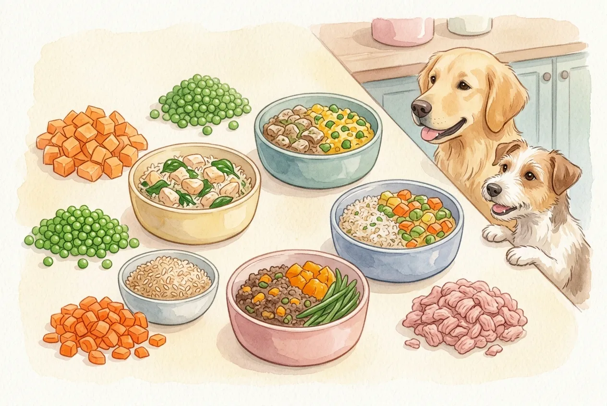
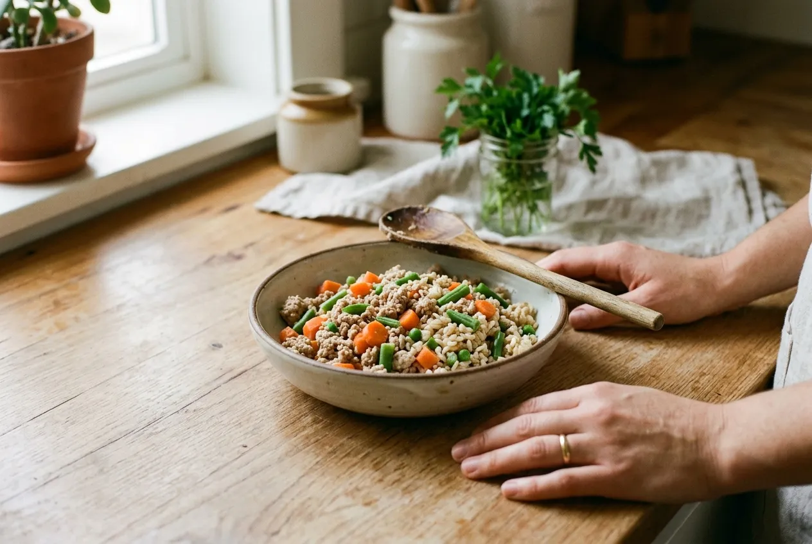
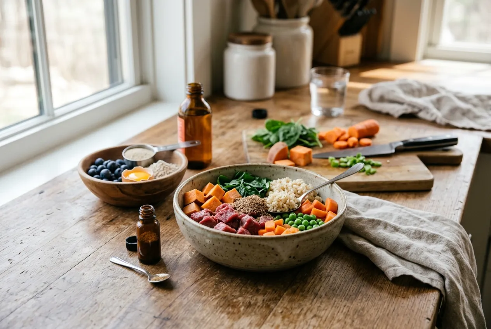
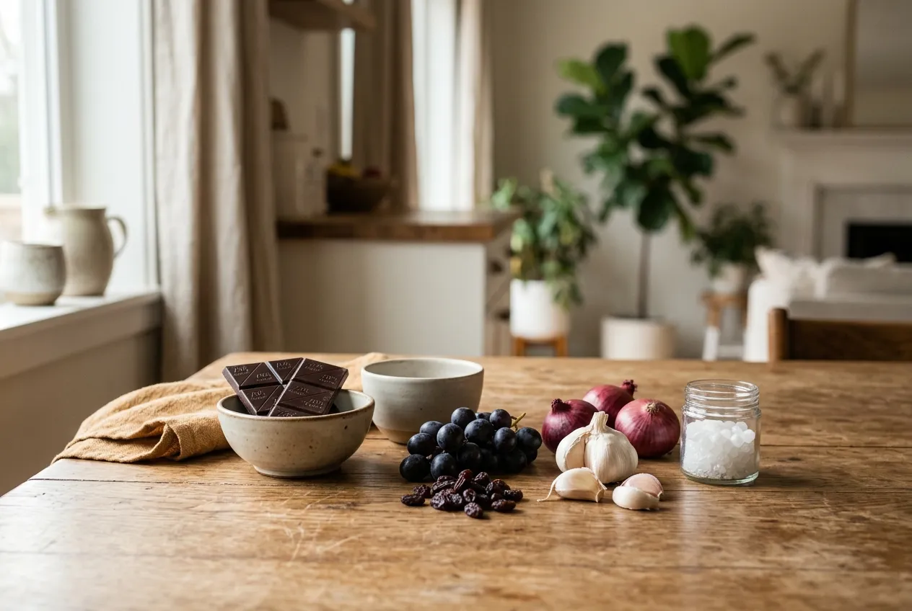

Hundefutter selber kochen ist eine echte Alternative zu Fertigfutter, wenn du weißt, worauf es ankommt. Mit den richtigen Zutaten, einer durchdachten Rationsplanung und ein bisschen Routine kannst du deinem Hund ausgewogene, frische Mahlzeiten zubereiten, die genau auf seinen Bedarf abgestimmt sind.

In diesem Artikel findest du alles, was du brauchst: eine ehrliche Einschätzung, ob kochen für Hunde das Richtige für euch ist, die wichtigsten Grundregeln zu Zutaten und Mengen, fünf erprobte Rezepte und eine klare Übersicht, welche Lebensmittel tabu sind.

## Hundefutter selber kochen: Was bedeutet das genau?

Zusammenfassung: Hundefutter selber kochen

<ul>
<li><strong>Volle Kontrolle</strong> über Zutaten, Qualität und Zusammensetzung des Futters</li>
<li><strong>Kein Ersatz ohne Plan</strong> – selbstgekochtes Hundefutter muss bedarfsgerecht zusammengestellt sein</li>
<li><strong>Ergänzungspräparate nötig</strong> – reines Fleisch-Gemüse-Futter deckt den Bedarf oft nicht vollständig</li>
<li><strong>Geeignet für viele Hunde</strong> – besonders bei Allergien, Unverträglichkeiten oder wählerischen Essern</li>
</ul>

Hundefutter selber kochen bedeutet, die Mahlzeiten deines Hundes aus frischen Einzelzutaten selbst herzustellen, statt auf industriell gefertigtes Nass- oder Trockenfutter zurückzugreifen. Du bestimmst, welches Fleisch, welches Gemüse und welche Kohlenhydrate in den Napf kommen.

Das klingt simpel, ist aber mehr als das Aufwärmen von Resten. Eine ausgewogene Ration für Hunde unterscheidet sich deutlich von menschlicher Ernährung. Hunde brauchen andere Nährstoffverhältnisse, bestimmte Mineralstoffe und keine Gewürze oder Zusatzstoffe aus der Menschenküche.

### Für wen sich kochen für Hunde lohnt

Kochen für Hunde lohnt sich besonders dann, wenn dein Hund auf bestimmte Inhaltsstoffe im Fertigfutter reagiert, zum Beispiel mit Juckreiz, Verdauungsproblemen oder Futterverweigerung. Auch bei Hunden mit Nierenerkrankungen, Übergewicht oder anderen chronischen Erkrankungen kann eine individuell abgestimmte Ration sinnvoll sein.

Außerdem ist kochen für den Hund eine gute Wahl, wenn du mehr Transparenz über die Futterqualität möchtest. Laut [Öko-Test](https://www.oekotest.de/) enthalten viele Fertigfutter Zutaten minderer Qualität oder Schadstoffe, die sich durch selbst ausgewählte Rohstoffe vermeiden lassen. Wer Zeit und Motivation mitbringt, kann seinem Hund damit echten Mehrwert bieten.

### Hundefutter selber kochen oder Fertigfutter?

Fertigfutter ist praktisch, oft ausgewogen und für viele Hunde völlig ausreichend. Selbstgekochtes Hundefutter bietet dagegen mehr Flexibilität und Kontrolle, erfordert aber auch mehr Planung. Wer sporadisch kocht, ohne die Nährstoffzusammensetzung im Blick zu haben, riskiert Mangelernährung.

Eine Kombination aus beidem ist für viele Hundehalter ein guter Kompromiss: Fertigfutter als Basis, selbstgekochte Mahlzeiten als Ergänzung. Wer dauerhaft auf Eigenkochen umstellen möchte, sollte sich vorher fachkundig beraten lassen.

## Die richtigen Zutaten für selbstgekochtes Hundefutter

Gutes selbstgekochtes Hundefutter besteht aus drei Grundkomponenten: Fleisch als Proteinquelle, Kohlenhydrate als Energielieferant und Gemüse für Ballaststoffe, Vitamine und sekundäre Pflanzenstoffe. Das richtige Verhältnis ist entscheidend.

Die [Ludwig-Maximilians-Universität München](https://www.tierernaehrung.vetmed.uni-muenchen.de/) empfiehlt für eine ausgewogene Ration bei ausgewachsenen Hunden grob folgende Aufteilung in der Frischmasse: etwa 50 bis 60 Prozent Fleisch und Innereien, 20 bis 30 Prozent Kohlenhydrate und 15 bis 20 Prozent Gemüse. Diese Werte variieren je nach Hund, Alter und Gesundheitszustand.

### Fleisch, Kohlenhydrate und Gemüse sinnvoll kombinieren

Als Fleischquellen eignen sich Huhn, Pute, Rind, Lamm und magerer Schweinefleisch. Innereien wie Leber oder Herz sind wertvoll, sollten aber nicht mehr als 10 bis 15 Prozent der Gesamtration ausmachen, da sie bei Überdosierung zu Vitaminüberschüssen führen können.

Bei Kohlenhydraten sind gekochter Reis, Hirse, Kartoffeln und Haferflocken gute Optionen. Sie liefern Energie und sind gut verträglich. Als Gemüse eignen sich Möhren, Zucchini, Kürbis, Brokkoli und Paprika besonders gut. [Paprika für Hunde](https://hundewissen-mit-kopf.de/hundeernaehrung/duerfen-hunde-paprika-essen/) ist in kleinen Mengen eine wertvolle Vitamin-C-Quelle, während [Dürfen Hunde Äpfel essen?](https://hundewissen-mit-kopf.de/hundeernaehrung/duerfen-hunde-aepfel-essen/) mit einem klaren Ja beantwortet werden kann, solange Kerngehäuse und Kerne entfernt werden.

50–60 %

Fleisch & Innereien

20–30 %

Kohlenhydrate

15–20 %

Gemüse

max. 15 %

Innereien-Anteil

### Rohes Fleisch oder gekocht: Was passt besser?

Rohes Fleisch ist die Grundlage des sogenannten BARF-Konzepts (Biologisch Artgerechtes Rohes Futter). Es enthält alle natürlichen Enzyme und Nährstoffe in unveränderter Form, erfordert aber hohe Qualitätsstandards und sorgfältige Lagerung. Keimbelastung durch Salmonellen oder andere Erreger ist ein reales Risiko, das besonders bei immungeschwächten Hunden oder Haushalten mit Kleinkindern bedacht werden muss.

Gekochtes Fleisch ist bekömmlicher, hygienisch unkomplizierter und für die meisten Hunde sehr gut verträglich. Beim Kochen gehen einige hitzeempfindliche Nährstoffe verloren, die sich aber durch gezielte Ergänzungspräparate ausgleichen lassen. Für Einsteiger ins Thema hundefutter selber kochen ist gekochtes Fleisch der einfachere und sicherere Einstieg.

## Hundefutter selber kochen: Menge, Bedarf und Zusätze

Die richtige Menge selbstgekochtes Hundefutter zu treffen, ist einer der häufigsten Stolpersteine. Zu wenig führt zu Unterversorgung, zu viel zu Übergewicht. Beides schadet der Gesundheit deines Hundes langfristig.

### So berechnest du die passende Tagesration

Als Faustregel gilt: Ausgewachsene, normalaktive Hunde benötigen täglich etwa 2 bis 3 Prozent ihres Körpergewichts an frischem Futter. Ein 20-kg-Hund braucht demnach rund 400 bis 600 g pro Tag. Sehr aktive Hunde oder Arbeitshunde können bis zu 4 Prozent benötigen, ältere oder wenig aktive Hunde eher 1,5 bis 2 Prozent.

Welpen haben einen deutlich höheren Energiebedarf und wachsen schnell, weshalb die Rationsberechnung hier komplexer ist. Welpenfutter selber machen sollte deshalb immer mit einer individuellen Berechnung oder tierärztlicher Begleitung einhergehen. Die Mengenangaben in den Rezepten in diesem Artikel dienen als Orientierung für einen mittelgroßen Hund von etwa 20 kg.

### Welche Zusätze bei selbstgekochtem Hundefutter wichtig sind

Reines Fleisch-Gemüse-Futter ohne Ergänzungen ist selten bedarfsgerecht. Besonders Calcium fehlt häufig, wenn keine Knochen verfüttert werden. Auch Jod, Zink, Vitamin D und Omega-3-Fettsäuren können bei einseitiger Zusammensetzung mangeln.

Geeignete Ergänzungspräparate für selbstgekochtes Hundefutter sind im Fachhandel erhältlich und auf die jeweilige Ration abzustimmen. Produkte wie Calciumcarbonat, Lachsöl oder speziell formulierte Mineralstoffmischungen für Hunde helfen, die Lücken zu schließen. Die Stiftung Warentest hat in [Hundefutter-Tests](https://www.test.de/) wiederholt gezeigt, dass selbst hochpreisige Fertigfutter nicht immer alle Nährstoffe optimal abdecken, was die Bedeutung einer bewussten Ergänzung unterstreicht.

💡

<strong>Tipp: Rationsberechnung nicht überspringen</strong>

Eine einmalige Berechnung durch einen zertifizierten Tierernährungsberater lohnt sich besonders beim Einstieg. Viele Tierarztpraxen bieten diese Leistung an oder können geeignete Fachleute empfehlen.

## Gesundes Hundefutter selber machen: 5 Rezepte

Die folgenden fünf Rezepte für gesundes hundefutter selber machen decken unterschiedliche Bedürfnisse ab: vom klassischen Alltagsrezept über magenschonende Varianten bis zum leichten Sommermenü. Alle Mengenangaben gelten als Orientierung für einen Hund mit etwa 20 kg Körpergewicht.

### Hundefutter selber kochen Rezepte mit Huhn

Das Huhn-Reis-Rezept ist ein Klassiker beim hundefutter selber kochen und eignet sich hervorragend als Einstieg.

🍖 Rezept: Huhn mit Reis und Möhren

⏱️ 30 Minuten
📦 2 Portionen à 300 g (für 20-kg-Hund)

<strong>Zutaten:</strong>
<ul>
<li>300 g Hühnerbrust oder Hühnerschenkel (ohne Knochen und Haut)</li>
<li>150 g Vollkornreis (ungekocht)</li>
<li>100 g Möhren</li>
<li>50 g Zucchini</li>
<li>1 TL Lachsöl (Omega-3-Quelle)</li>
<li>Mineralstoffergänzung nach Herstellerangabe</li>
</ul>

<strong>Zubereitung:</strong>
<ol>
<li>Hühnerfleisch in Wasser ohne Salz und Gewürze gar kochen, dann in kleine Stücke zerteilen.</li>
<li>Reis nach Packungsanweisung kochen.</li>
<li>Möhren und Zucchini in kleine Würfel schneiden und weich dünsten.</li>
<li>Alle Zutaten vermengen, auf Handwärme abkühlen lassen.</li>
<li>Lachsöl und Mineralstoffergänzung erst kurz vor dem Servieren untermischen.</li>
</ol>

### Hundefutter selber kochen Rezepte mit Rind

Rind ist eine proteinreiche Alternative und eignet sich gut für Hunde ohne Rindfleischunverträglichkeit.

🍖 Rezept: Rind mit Kartoffeln und Brokkoli

⏱️ 35 Minuten
📦 2 Portionen à 300 g (für 20-kg-Hund)

<strong>Zutaten:</strong>
<ul>
<li>300 g mageres Rindfleisch (z. B. Rindergulasch oder Rinderhack)</li>
<li>200 g Kartoffeln (geschält, gewürfelt)</li>
<li>100 g Brokkoli</li>
<li>1 TL Rapsöl</li>
<li>Mineralstoffergänzung nach Herstellerangabe</li>
</ul>

<strong>Zubereitung:</strong>
<ol>
<li>Rindfleisch ohne Fett und ohne Gewürze in der Pfanne oder im Topf garen.</li>
<li>Kartoffeln weich kochen und grob zerdrücken.</li>
<li>Brokkoli in kleine Röschen teilen und bissfest dünsten.</li>
<li>Alle Komponenten vermengen und auf Handwärme abkühlen lassen.</li>
<li>Rapsöl und Mineralstoffergänzung vor dem Servieren untermischen.</li>
</ol>

### Magenschonendes Hundefutter selber kochen

Magenschonendes hundefutter selber kochen ist besonders bei Durchfall, nach Operationen oder bei empfindlichen Hunden gefragt. Wenige, gut verträgliche Zutaten sind hier das Schlüsselprinzip.

🍖 Rezept: Schonkost mit Huhn, Reis und Kürbis

⏱️ 25 Minuten
📦 2 kleine Portionen (reduzierte Menge bei Schonkost)

<strong>Zutaten:</strong>
<ul>
<li>200 g Hühnerbrust (ohne Haut, ohne Knochen)</li>
<li>150 g weißer Reis (leichter verdaulich als Vollkorn)</li>
<li>80 g Kürbis (gedünstet oder aus dem Glas, ungewürzt)</li>
</ul>

<strong>Zubereitung:</strong>
<ol>
<li>Hühnerbrust in Wasser ohne Salz gar kochen und in kleine Stücke zupfen.</li>
<li>Reis sehr weich kochen.</li>
<li>Kürbis pürieren oder fein würfeln und untermischen.</li>
<li>Alles vermengen und lauwarm servieren.</li>
<li>Ergänzungspräparate bei Schonkost-Phasen nach Rücksprache mit dem Tierarzt dosieren.</li>
</ol>

Bei anhaltenden Verdauungsproblemen sollte immer ein Tierarzt aufgesucht werden, bevor auf Schonkost umgestellt wird.

### Schnelles Rezept mit Hackfleisch und Gemüse

Hundefutter selber kochen mit Hackfleisch ist besonders zeitsparend, da Hackfleisch schnell gart und gut dosierbar ist.

🍖 Rezept: Hackfleisch mit Möhren und Hirse

⏱️ 20 Minuten
📦 2 Portionen à 280 g (für 20-kg-Hund)

<strong>Zutaten:</strong>
<ul>
<li>250 g gemischtes Hackfleisch (Rind/Schwein) oder reines Rinderhack</li>
<li>120 g Hirse (ungekocht)</li>
<li>100 g Möhren</li>
<li>1 TL Lachsöl</li>
<li>Mineralstoffergänzung nach Herstellerangabe</li>
</ul>

<strong>Zubereitung:</strong>
<ol>
<li>Hackfleisch ohne Öl und Gewürze in der Pfanne krümelig braten.</li>
<li>Hirse nach Packungsanweisung kochen.</li>
<li>Möhren fein raspeln oder weich dünsten.</li>
<li>Alles vermengen, abkühlen lassen und mit Lachsöl sowie Mineralstoffergänzung verfeinern.</li>
</ol>

### Leichtes Sommer-Rezept mit magerem Fleisch

Für heiße Tage eignet sich ein leichtes, gut verdauliches Rezept mit magerem Fleisch und wasserreichem Gemüse.

🍖 Rezept: Pute mit Zucchini und Hirse

⏱️ 20 Minuten
📦 2 Portionen à 260 g (für 20-kg-Hund)

<strong>Zutaten:</strong>
<ul>
<li>250 g Putenbrust</li>
<li>100 g Hirse (ungekocht)</li>
<li>120 g Zucchini</li>
<li>1 TL Rapsöl</li>
<li>Mineralstoffergänzung nach Herstellerangabe</li>
</ul>

<strong>Zubereitung:</strong>
<ol>
<li>Putenbrust in Wasser ohne Salz gar kochen und zerkleinern.</li>
<li>Hirse weich kochen.</li>
<li>Zucchini in kleine Würfel schneiden und kurz dünsten.</li>
<li>Alles vermengen, auf Zimmertemperatur abkühlen lassen und mit Öl sowie Ergänzung servieren.</li>
</ol>

## Was dein Hund nicht fressen darf

Beim hundefutter selber kochen ist es genauso wichtig zu wissen, was tabu ist, wie zu wissen, was erlaubt ist. Einige Lebensmittel aus der Menschenküche sind für Hunde giftig und können auch in kleinen Mengen ernsthafte Schäden anrichten.

### Diese Lebensmittel sind tabu

🚫

<strong>Giftige Lebensmittel für Hunde</strong>

Schokolade und Kakao (Theobromin), Weintrauben und Rosinen (Nierenversagen), Zwiebeln und Knoblauch (Zerstörung roter Blutkörperchen), Xylitol/Xylit (in Süßungsmitteln, Kaugummi), Avocado (Persin), Macadamia-Nüsse, rohe Hülsenfrüchte, Alkohol und koffeinhaltige Getränke sind für Hunde gefährlich. Mehr zu <a href="https://hundewissen-mit-kopf.de/hundeernaehrung/warum-duerfen-hunde-keine-schokolade/">giftige Lebensmittel wie Schokolade</a> findest du in unserem Ratgeber.

Auch stark gewürzte Speisen, Salz in größeren Mengen, rohe Kartoffeln und rohe Hülsenfrüchte gehören nicht in den Hundenapf. Viele dieser Lebensmittel wirken nicht sofort, sondern schleichend und kumulativ, was sie besonders tückisch macht.

### Bei Gemüse und Obst genau hinschauen

Nicht jedes Gemüse ist automatisch geeignet. Tomaten in unreifer Form oder in großen Mengen können problematisch sein, da sie Solanin enthalten. Informiere dich über [Tomaten im Hundefutter](https://hundewissen-mit-kopf.de/hundeernaehrung/duerfen-hunde-tomaten-essen/) bevor du sie ins Rezept integrierst. Reife, rote Tomaten in kleinen Mengen gelten dagegen als unbedenklich.

Auch Zwiebeln, Lauch und Schnittlauch aus der Zwiebelgewächs-Familie sind generell tabu. Frühlingszwiebeln in der Sommerküche klingen harmlos, können aber bei regelmäßiger Aufnahme zu Blutarmut führen. Als erfrischenden Snack an heißen Tagen kannst du stattdessen [Wassermelone als Snack](https://hundewissen-mit-kopf.de/hundeernaehrung/darf-hund-wassermelone-essen/) anbieten, die gut verträglich und wasserreich ist.

## Kosten, Vorbereitung und Aufbewahrung beim Kochen für Hunde

Kochen für Hunde ist nicht automatisch günstiger als Fertigfutter. Die Kosten hängen stark von den verwendeten Zutaten, der Fleischqualität und dem Ergänzungspräparat ab.

### Selbst kochen vs. Fertigfutter: die Kosten im Vergleich

Vorteile selbstgekochtes Hundefutter

<ul>
<li>Volle Kontrolle über Zutaten und Qualität</li>
<li>Individuell anpassbar bei Allergien oder Erkrankungen</li>
<li>Keine versteckten Zusatzstoffe oder Füllstoffe</li>
<li>Frische Zutaten, die du selbst kennst</li>
<li>Meal-Prep spart Zeit im Alltag</li>
</ul>

Nachteile selbstgekochtes Hundefutter

<ul>
<li>Höherer Zeitaufwand für Planung und Zubereitung</li>
<li>Kosten oft vergleichbar oder höher als gutes Fertigfutter</li>
<li>Ergänzungspräparate als Zusatzkosten nötig</li>
<li>Fehler in der Rationsberechnung möglich</li>
<li>Kühlschrankplatz und Vorratshaltung nötig</li>
</ul>

Bei günstigen Zutaten und einfachen Rezepten lässt sich selbstgekochtes Hundefutter für etwa 1,50 bis 3,00 Euro pro Tag für einen mittelgroßen Hund herstellen. Hochwertiges Fertigfutter liegt im gleichen Bereich. Der Vorteil liegt also weniger im Preis als in der Qualitätskontrolle.

### Portionieren, einfrieren und hygienisch lagern

Selbstgekochtes Hundefutter hält sich im Kühlschrank etwa zwei bis drei Tage. Für längere Haltbarkeit empfiehlt sich das Einfrieren in Portionsbehältern. So lässt sich ein Wochensatz vorbereiten und täglich eine Portion auftauen.

Wichtig: Futter niemals in der Mikrowelle auf hoher Stufe erhitzen, da sich Nährstoffe abbauen und Hotspots entstehen können. Besser langsam im Kühlschrank auftauen lassen und kurz vor dem Servieren auf Handwärme bringen. Behälter und Schüsseln nach jedem Einsatz gründlich reinigen, um Keimbildung zu vermeiden.

## Fazit: Hundefutter selber kochen mit Plan

Hundefutter selber kochen funktioniert, wenn du es strukturiert angehst. Die Grundregel lautet: ausgewogene Zutaten, passende Mengen und gezielte Ergänzungen. Wer diese drei Punkte im Griff hat, kann seinem Hund frische, individuelle Mahlzeiten bieten, die echten Mehrwert gegenüber manchem Fertigfutter haben.

Starte mit einem einfachen Rezept, beobachte deinen Hund genau und passe die Ration bei Bedarf an. Eine einmalige Beratung durch einen Tierernährungsberater ist besonders am Anfang eine sinnvolle Investition.

✅ Checkliste: Hundefutter selber kochen

✓

Tagesration berechnet (2–3 % des Körpergewichts als Ausgangswert)

✓

Fleisch, Kohlenhydrate und Gemüse im richtigen Verhältnis kombiniert

✓

Ergänzungspräparat (Calcium, Mineralien, Omega-3) eingeplant

✓

Giftige Lebensmittel aus der Küche verbannt

Rezepte auf Verträglichkeit getestet und Reaktion des Hundes beobachtet

Bei Welpen, kranken oder älteren Hunden: Tierarzt oder Ernährungsberater konsultiert

