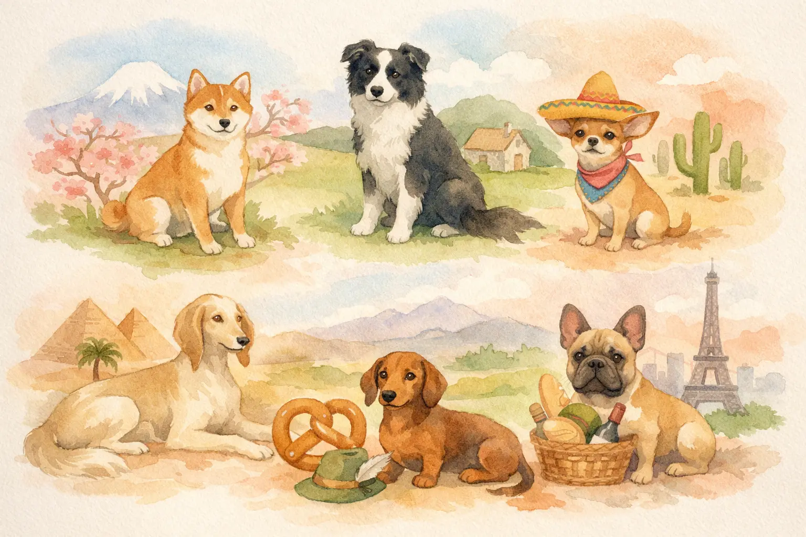

Den richtigen Hundenamen zu finden, ist eine der ersten großen Entscheidungen als frischgebackener Hundehalter. Schließlich begleitet der Name deinen Vierbeiner ein ganzes Hundeleben lang -- ob beim Rückruf im Park, beim Tierarzt oder auf der Hundewiese. Die Auswahl ist riesig: Von klassischen beliebten Hundenamen wie Luna, Buddy oder Bella über seltene Hundenamen aus fernen Kulturen bis hin zu ausgefallenen Namen mit besonderer Bedeutung ist für jeden Geschmack etwas dabei.

In diesem Ratgeber findest du über 200 Hundenamen für Rüden und Hündinnen -- jeweils sortiert nach Herkunft, mit Bedeutung und Aussprache-Tipps. Du erfährst außerdem, worauf du bei der Namenswahl achten solltest, welche Hundenamen aktuell im Trend liegen und welche berühmten Hundenamen aus Filmen und Serien sich auch im Alltag bewähren.

Zusammenfassung: Die besten Hundenamen finden

<ul>
<li><strong>Ideale Namenslänge</strong> -- 1–2 Silben mit harten Konsonanten (K, T, D) werden von Hunden am schnellsten erkannt</li>
<li><strong>Über 200 Hundenamen</strong> -- für Rüden und Hündinnen aus Japan, Skandinavien, Spanien, Italien, Afrika und vielen weiteren Regionen</li>
<li><strong>Hundenamen mit Bedeutung</strong> -- Viele Namen tragen tiefgründige Bedeutungen wie "Treue", "Stärke" oder "Freude"</li>
<li><strong>Passend zur Rasse wählen</strong> -- Japanische Hundenamen für Akita, nordische für Husky, spanische für Galgo – die Herkunft des Namens kann die Rasse unterstreichen</li>
<li><strong>Beliebte und seltene Hundenamen</strong> -- Von Klassikern wie Luna und Buddy bis zu ausgefallenen Namen wie Zephyr oder Tala</li>
</ul>

200+

Hundenamen mit Bedeutung

15+

Länder & Kulturen

1–2

Ideale Silbenanzahl

Luna

Beliebtester Hundename weltweit

## Hundenamen richtig wählen: Darauf kommt es an

Der richtige Hundename ist mehr als nur ein Etikett -- er ist das wichtigste Signalwort zwischen dir und deinem Hund. Im Durchschnitt lebt ein Hund 10–15 Jahre, und in dieser Zeit wirst du seinen Namen tausende Male rufen. Umso wichtiger ist es, bei der Wahl von Anfang an auf ein paar entscheidende Kriterien zu achten.

### Klang und Aussprache: Was Hunde wirklich hören

Hunde nehmen Laute anders wahr als Menschen. Tierverhaltensforscher empfehlen kurze Hundenamen mit harten Konsonanten wie **K**, **T**, **D** oder **B**, weil Hunde diese Laute besonders schnell und deutlich wahrnehmen. Weiche Laute wie **S** oder **F** gehen im Alltag leichter unter.

| Kriterium | Empfehlung | Beispiel |
|---|---|---|
| Silbenanzahl | 1–2 Silben optimal | Koda, Suki, Rex |
| Konsonanten | Harte Laute bevorzugen | **K**ira, **T**aro, **B**olly |
| Endvokal | Helle Vokale (a, i) | Aki**ra**, Lun**a** |
| Verwechslung | Kein Gleichklang mit Kommandos | Nicht "Sitz" ähnlich |

### Verwechslungsgefahr mit Kommandos

Vermeide Hundenamen, die wie gängige Kommandos klingen. Ein Hund namens "Nils" könnte "Nein" mit seinem Namen verwechseln. "Fritz" klingt ähnlich wie "Sitz". Solche Verwechslungen erschweren das Training erheblich und sorgen für Verwirrung beim Hund.

💡

<strong>Praxis-Tipp: Name vorher testen</strong>

Rufe den Wunschnamen 10-mal laut in verschiedenen Tonlagen. Fühlt er sich natürlich an? Klingt er auch gerufen über den Hundeplatz noch gut? Dann ist er alltagstauglich.

### Hundenamen mit Bedeutung: Warum die Herkunft zählt

Viele schöne Hundenamen tragen eine tiefere Bedeutung, die eine zusätzliche emotionale Verbindung schafft. Ein Name wie "Hachiko" (japanisch) steht weltweit für Treue, "Blitz" (deutsch) für Schnelligkeit und "Amara" (afrikanisch) für Anmut. Wenn du die Bedeutung hinter dem Namen kennst, wird die Namensgebung zu etwas ganz Besonderem.

## Japanische Hundenamen -- Eleganz trifft Bedeutung

Japanische Hundenamen gehören zu den beliebtesten internationalen Hundenamen überhaupt. Sie sind klangvoll, meist zweisilbig und tragen fast immer eine poetische Bedeutung. Besonders gut passen sie zu japanischen Rassen wie Shiba Inu, Akita Inu oder Kishu Ken -- aber auch für andere Rassen sind sie eine wunderbare Wahl.

### Japanische Hundenamen für Rüden

| Name | Bedeutung | Aussprache |
|---|---|---|
| Akira | Strahlend, hell | A-ki-ra |
| Hiro | Großzügig | Hi-ro |
| Kenzo | Stark und gesund | Ken-zo |
| Taro | Erstgeborener Sohn | Ta-ro |
| Yuki | Schnee | Yu-ki |
| Riku | Land, Erde | Ri-ku |
| Sora | Himmel | So-ra |
| Kaito | Ozean, Flieger | Kai-to |
| Hachi | Acht (Glückszahl) | Ha-tschi |
| Daichi | Große Erde | Dai-tschi |

### Japanische Hundenamen für Hündinnen

| Name | Bedeutung | Aussprache |
|---|---|---|
| Suki | Geliebt | Su-ki |
| Hana | Blume | Ha-na |
| Yumi | Schönheit, Bogen | Yu-mi |
| Aiko | Kind der Liebe | Ai-ko |
| Sakura | Kirschblüte | Sa-ku-ra |
| Miko | Schönes Kind | Mi-ko |
| Nami | Welle | Na-mi |
| Kiku | Chrysantheme | Ki-ku |
| Rei | Anmutig | Re-i |
| Mochi | Reiskuchen (Kosename) | Mo-tschi |

ℹ️

<strong>Wusstest du?</strong>

Der berühmteste japanische Hundename ist Hachiko. Der Akita Inu wartete nach dem Tod seines Besitzers 9 Jahre lang täglich am Bahnhof Shibuya in Tokio. Ihm wurde dort eine Bronzestatue gewidmet.

## Nordische Hundenamen -- Kraftvoll und geheimnisvoll

Nordische und skandinavische Hundenamen klingen kraftvoll, mystisch und naturverbunden. Sie stammen aus der altnordischen Mythologie, der Wikingerzeit und den skandinavischen Sprachen. Besonders stimmig wirken sie bei Rassen wie Siberian Husky, Alaskan Malamute, Norwegischem Elchhund oder Samojede -- aber auch bei jedem Hund mit starkem, eigenständigem Charakter sind nordische Hundenamen eine hervorragende Wahl.

### Nordische Hundenamen für Rüden

| Name | Herkunft | Bedeutung |
|---|---|---|
| Odin | Altnordisch | Oberster Gott, Weisheit |
| Thor | Altnordisch | Donnergott |
| Loki | Altnordisch | Trickster-Gott |
| Fenrir | Altnordisch | Mythischer Riesenwolf |
| Bjørn | Norwegisch | Bär |
| Ragnar | Altnordisch | Krieger des Rates |
| Ulf | Schwedisch | Wolf |
| Sven | Schwedisch | Junger Mann |
| Leif | Norwegisch | Erbe, Nachkomme |
| Storm | Skandinavisch | Sturm |

### Nordische Hundenamen für Hündinnen

| Name | Herkunft | Bedeutung |
|---|---|---|
| Freya | Altnordisch | Göttin der Liebe |
| Astrid | Schwedisch | Göttliche Schönheit |
| Skadi | Altnordisch | Göttin der Jagd |
| Sigrid | Altnordisch | Schöner Sieg |
| Eira | Walisisch/Nordisch | Schnee |
| Helga | Altnordisch | Heilig |
| Nora | Skandinavisch | Ehre |
| Ronja | Schwedisch | Gottes Freude |
| Idun | Altnordisch | Göttin der Jugend |
| Saga | Schwedisch | Erzählung, Legende |

🐺

Mythologie-Namen

Odin, Thor, Freya -- kraftvolle Namen aus der Welt der Wikinger-Götter

🏔️

Natur-Namen

Storm, Eira, Bjørn -- inspiriert von der rauen skandinavischen Natur

⚔️

Krieger-Namen

Ragnar, Sigrid, Leif -- für Hunde mit mutigem, starkem Charakter

📖

Literatur-Namen

Ronja, Saga -- bekannt aus skandinavischen Büchern und Geschichten

## Spanische Hundenamen -- Temperament und Wärme

Spanische Hundenamen klingen temperamentvoll, warm und melodisch. Sie passen hervorragend zu lebhaften, energiegeladenen Hunden -- und natürlich zu spanischen Rassen wie dem Galgo Español, Podenco oder der Dogo Argentino. Auch für Hunde aus dem Tierschutz, die aus Spanien oder Südamerika kommen, wählen viele Halter bewusst einen spanischen Hundenamen.

### Spanische Hundenamen für Rüden

| Name | Bedeutung |
|---|---|
| Chico | Kleiner Junge |
| Diego | Der Lehrende |
| Pablo | Der Kleine |
| Rico | Der Reiche, Mächtige |
| Sol | Sonne |
| Lobo | Wolf |
| Amigo | Freund |
| Carlos | Der Freie |
| Pepe | Gott möge hinzufügen |
| Nacho | Kurzform von Ignacio |

### Spanische Hundenamen für Hündinnen

| Name | Bedeutung |
|---|---|
| Luna | Mond |
| Bonita | Die Hübsche |
| Paloma | Taube |
| Estrella | Stern |
| Dulce | Süß |
| Mariposa | Schmetterling |
| Alma | Seele |
| Luz | Licht |
| Alegría | Freude |
| Esperanza | Hoffnung |

💡

<strong>Tipp für Tierschutzhunde aus Spanien</strong>

Viele Hunde aus spanischen Tötungsstationen haben bereits einen Namen. Wenn du ihn beibehalten möchtest, kannst du ihn als Rufnamen nutzen. Das erleichtert die Eingewöhnung und gibt dem Hund ein Stück Vertrautheit in der neuen Umgebung.

## Italienische Hundenamen -- Klangvoll und charmant

Italienische Hundenamen klingen melodisch und elegant. Sie passen besonders gut zu italienischen Rassen wie dem Cane Corso, Lagotto Romagnolo oder dem Italienischen Windspiel. Aber auch für jeden anderen Hund mit charmantem Wesen sind sie eine stilvolle Wahl.

| Rüden | Bedeutung | Hündinnen | Bedeutung |
|---|---|---|---|
| Bruno | Braun | Bella | Die Schöne |
| Dante | Ausdauernd | Gina | Königin |
| Enzo | Herrscher | Stella | Stern |
| Rocco | Ruhe | Cara | Die Liebe |
| Vito | Leben | Bianca | Die Weiße |
| Marco | Krieger | Donna | Dame |
| Nero | Schwarz | Rosa | Rose |
| Luca | Licht | Vita | Leben |
| Figo | Cool (umgangssprachlich) | Gioia | Freude |
| Tito | Ehrwürdig | Mia | Mein (Kosename) |

## Afrikanische Hundenamen -- Kraft und Naturverbundenheit

Afrikanische Hundenamen sind in Deutschland noch selten, klingen aber wunderschön und tragen kraftvolle Bedeutungen. Sie stammen aus verschiedenen Sprachen wie Suaheli, Zulu, Yoruba oder Amharisch. Besonders passend sind sie für afrikanische Rassen wie den Rhodesian Ridgeback, Basenji oder Africanis.

| Name | Sprache | Bedeutung | Geschlecht |
|---|---|---|---|
| Simba | Suaheli | Löwe | Rüde |
| Zuri | Suaheli | Schön | Hündin |
| Amara | Igbo | Anmut | Hündin |
| Kofi | Akan | Freitagskind | Rüde |
| Ayo | Yoruba | Freude | Unisex |
| Jabari | Suaheli | Tapferer | Rüde |
| Nia | Suaheli | Absicht, Zweck | Hündin |
| Tau | Tswana | Löwe | Rüde |
| Zola | Zulu | Ruhig, friedlich | Hündin |
| Kibo | Suaheli | Höchster Gipfel des Kilimandscharo | Rüde |

📖

<strong>Fakt: Basenji -- der "barkless dog"</strong>

Der Basenji aus Zentralafrika ist eine der ältesten Hunderassen der Welt. Er bellt nicht im klassischen Sinne, sondern gibt ein jodelndes Geräusch von sich. Ein passender afrikanischer Hundename unterstreicht seine einzigartige Herkunft.

## Keltische und irische Hundenamen

Keltische Hundenamen klingen geheimnisvoll und naturverbunden. Sie stammen aus dem Gälischen und der keltischen Mythologie. Besonders stimmig wirken sie bei Rassen wie dem Irish Setter, Irish Wolfhound oder dem Kerry Blue Terrier.

| Name | Bedeutung | Geschlecht |
|---|---|---|
| Finn | Hell, weiß | Rüde |
| Ciara | Dunkel | Hündin |
| Bran | Rabe | Rüde |
| Niamh | Strahlend (gespr. "Niev") | Hündin |
| Cú | Hund (gälisch) | Rüde |
| Aoife | Schönheit (gespr. "Ifa") | Hündin |
| Fergus | Starker Mann | Rüde |
| Saoirse | Freiheit (gespr. "Sirsche") | Hündin |
| Ronan | Kleine Robbe | Rüde |
| Maeve | Berauschend | Hündin |

⚠️

<strong>Achtung bei der Aussprache</strong>

Viele irische und gälische Hundenamen werden völlig anders ausgesprochen, als sie geschrieben werden. "Niamh" spricht sich "Niev", "Saoirse" wird zu "Sirsche". Informiere dich vorher über die korrekte Aussprache, damit auch Hundetrainer und Tierärzte den Namen richtig verwenden können.

## Französische Hundenamen -- Charme und Eleganz

Französische Hundenamen versprühen Eleganz und Charme. Sie passen perfekt zu Rassen wie dem Pudel, der Französischen Bulldogge, dem Briard oder dem Papillon. Aber auch für jeden Hund mit einer gewissen "Je ne sais quoi"-Ausstrahlung sind sie ideal.

| Rüden | Bedeutung | Hündinnen | Bedeutung |
|---|---|---|---|
| Louis | Berühmter Krieger | Chérie | Liebling |
| Pierre | Fels | Fleur | Blume |
| Gaston | Gast, Fremder | Bijou | Juwel |
| Marcel | Kleiner Krieger | Colette | Siegreich |
| Rémy | Ruderer | Amélie | Fleißig |
| Hugo | Geist, Verstand | Coco | Kosename |
| Léon | Löwe | Madeleine | Aus Magdala |
| Jacques | Der Nachfolger | Gigi | Kosename |
| Beau | Schön | Belle | Die Schöne |
| Olivier | Olivenbaum | Margot | Perle |

## Hundenamen aus Filmen und Serien

Hundenamen aus Filmen und Serien gehören seit Jahrzehnten zu den beliebtesten Namensinspirationen für Hundehalter. Laut einer Auswertung von Rover.com steigen die Suchanfragen nach bestimmten Hundenamen immer dann sprunghaft an, wenn ein neuer Film oder eine Serie mit einem Hund erscheint. Die gute Nachricht: Die meisten berühmten Film-Hundenamen erfüllen alle Kriterien eines guten Hundenamens -- sie sind kurz, einprägsam und haben harte Konsonanten.

### Legendäre Hundenamen aus Filmen

| Name | Film/Serie | Rasse im Film |
|---|---|---|
| Lassie | Lassie | Langhaar-Collie |
| Hachiko | Hachi: A Dog's Tale | Akita Inu |
| Beethoven | Beethoven | Bernhardiner |
| Bolt | Bolt – Ein Hund für alle Fälle | Weißer Schäferhund |
| Marley | Marley & Ich | Labrador Retriever |
| Lady | Susi und Strolch | Cocker Spaniel |
| Strolch | Susi und Strolch | Mischling |
| Rex | Kommissar Rex | Deutscher Schäferhund |
| Buddy | Air Bud | Golden Retriever |
| Toto | Der Zauberer von Oz | Cairn Terrier |

### Beliebte Hundenamen aus Serien

| Name | Serie | Warum beliebt? |
|---|---|---|
| Ghost | Game of Thrones | Weißer Schattenwolf, Symbol für Treue |
| Dogmatix | Asterix | Kleiner, mutiger Begleiter |
| Eddie | Frasier | Jack Russell Terrier mit Charakter |
| Comet | Full House | Golden Retriever, Familienhund |
| Santa's Little Helper | Die Simpsons | Windhund, gerettet von der Rennbahn |

✅

<strong>Film-Hundenamen funktionieren im Alltag</strong>

Bolt, Rex, Buddy und Lady sind jeweils ein- bis zweisilbig und leicht zu rufen. Sie erfüllen damit alle Kriterien eines guten Hundenamens: kurz, einprägsam und mit harten Konsonanten. Ein Grund mehr, sich von Filmen und Serien inspirieren zu lassen.

## Hundenamen nach Rasse -- passende Herkunft wählen

Viele Hundehalter wählen bewusst einen Hundenamen, der zur Herkunft ihrer Rasse passt. Das schafft eine stimmige Verbindung zwischen Name, Aussehen und Geschichte des Hundes. Hier findest du Empfehlungen für beliebte Rassen.

### Hundenamen für Australian Shepherds

Australian Shepherds sind energiegeladen, intelligent und vielseitig. Trotz ihres Namens stammen sie ursprünglich aus den USA, wo sie als Hütehunde auf Ranches arbeiteten. Passende Hundenamen spiegeln ihre Aktivität und ihren Arbeitseifer wider.

| Rüden | Hündinnen |
|---|---|
| Blaze | Dakota |
| Scout | Sierra |
| Banjo | Willow |
| Koda | Ivy |
| Maverick | Pepper |
| Tucker | Aspen |
| Ranger | Sage |
| Boomer | Indie |

Wenn du dich fragst, welche [Hunderasse für Anfänger](https://hundewissen-mit-kopf.de/hunderassen/hunderasse-fuer-anfaenger/) geeignet ist, findest du in unserem Ratgeber eine hilfreiche Übersicht -- der Australian Shepherd ist dabei eher für erfahrene Halter geeignet.

### Hundenamen nach Rasseursprung -- Übersicht

| Rasse | Herkunft | Passende Namensstile | Beispiele |
|---|---|---|---|
| Shiba Inu | Japan | Japanische Hundenamen | Akira, Hana, Yuki |
| Siberian Husky | Sibirien/Nordisch | Nordische Hundenamen | Odin, Freya, Storm |
| Galgo Español | Spanien | Spanische Hundenamen | Lobo, Luna, Sol |
| Cane Corso | Italien | Italienische Hundenamen | Nero, Bella, Dante |
| Rhodesian Ridgeback | Südafrika | Afrikanische Hundenamen | Simba, Zuri, Jabari |
| Irish Setter | Irland | Keltische Hundenamen | Finn, Ciara, Bran |
| Pudel | Frankreich | Französische Hundenamen | Beau, Bijou, Coco |

## Unisex-Hundenamen aus aller Welt

Manche Hundenamen funktionieren für Rüden und Hündinnen gleichermaßen. Das ist praktisch, wenn du den Namen schon vor der Geschlechtsbestimmung eines Welpen auswählen möchtest oder wenn du einen geschlechtsneutralen Hundenamen bevorzugst.

| Name | Herkunft | Bedeutung |
|---|---|---|
| Koda | Japanisch | Freund |
| Riley | Irisch | Mutig |
| Ayo | Yoruba | Freude |
| Sasha | Russisch | Beschützer |
| Quinn | Irisch | Weise |
| Charlie | Englisch | Freier Mensch |
| Bodhi | Sanskrit | Erleuchtung |
| Mika | Japanisch | Schöner Duft |
| Nalu | Hawaiianisch | Die Welle |
| Robin | Englisch | Strahlender Ruhm |

## Tipps für die endgültige Namenswahl

Bei über 200 Hundenamen kann die Entscheidung schwerfallen. Diese Schritt-für-Schritt-Anleitung hilft dir, den perfekten Hundenamen für deinen Vierbeiner zu finden.

1

Shortlist erstellen

Wähle 5–10 Hundenamen aus, die dir gefallen. Achte auf Klang, Bedeutung und Silbenanzahl.

2

Alltagstest machen

Rufe jeden Namen 10-mal laut. Klingt er auch beim 10. Mal noch gut? Ist er leicht zu rufen?

3

Verwechslungscheck

Prüfe, ob der Name wie ein Kommando klingt (Sitz, Platz, Nein, Aus, Hier).

✓

Entscheidung treffen

Wähle den Namen, der sich am natürlichsten anfühlt. Dein Bauchgefühl zählt!

### Checkliste für den perfekten Hundenamen

✅ Checkliste: Hundenamen-Wahl

✓

1–2 Silben, maximal 3

✓

Harte Konsonanten (K, T, D, B) enthalten

✓

Kein Gleichklang mit Kommandos

✓

Bedeutung recherchiert und passend

✓

Aussprache für alle Familienmitglieder einfach

Optional: Passt zur Rasse-Herkunft

Optional: Spitzname/Kurzform möglich

Übrigens: Sobald der Name feststeht, beginnt das eigentliche Abenteuer. Dein Hund muss lernen, auf seinen Namen zu reagieren. Das funktioniert am besten über positive Verstärkung -- genau wie bei der [Leinenführigkeit](https://hundewissen-mit-kopf.de/erziehung-verhalten/leinenfuehrigkeit-trainieren/), die du parallel trainieren kannst.

## Seltene und außergewöhnliche Hundenamen

Wenn du einen wirklich einzigartigen Hundenamen suchst, lohnt sich ein Blick in weniger bekannte Sprachen und Kulturen. Diese ausgefallenen Hundenamen hört man auf dem Hundeplatz garantiert nicht jeden Tag -- perfekt für alle, die sich von der Masse abheben möchten.

| Name | Herkunft | Bedeutung |
|---|---|---|
| Kael | Gälisch | Schlank, schön |
| Zephyr | Griechisch | Westwind |
| Anouk | Niederländisch/Inuit | Bärin |
| Tala | Indianisch (Lakota) | Wolf |
| Elio | Griechisch/Italienisch | Sonne |
| Inari | Finnisch/Japanisch | Fuchsgottheit |
| Kaya | Türkisch | Fels |
| Lumi | Finnisch | Schnee |
| Ozzy | Hebräisch | Gottes Stärke |
| Wren | Englisch | Zaunkönig |

💡

<strong>Tipp: Bedeutung immer prüfen</strong>

Bevor du einen exotischen Hundenamen wählst, recherchiere seine Bedeutung gründlich. Manche Namen klingen schön, bedeuten in der Originalsprache aber etwas Unpassendes. Eine kurze Online-Recherche schützt vor Überraschungen.

## Hundenamen-Trends 2025/2026

Die Trends bei Hundenamen verändern sich -- ähnlich wie bei Babynamen -- regelmäßig. Laut der jährlichen Auswertung von Rover.com und Tasso e.V. zeichnen sich für 2025 und 2026 klare Trends ab.

| Trend | Beschreibung | Beispiele |
|---|---|---|
| Natur-Namen | Inspiriert von Pflanzen, Wetter und Landschaften | Willow, Storm, Sage, Ivy |
| Mythologie-Namen | Götter und Helden aus verschiedenen Kulturen | Odin, Freya, Athena, Apollo |
| Food-Namen | Liebevoll-witzige Essens-Namen | Mochi, Nacho, Cookie, Pepper |
| Retro-Namen | Alte, wiederentdeckte Hundenamen | Bruno, Otto, Frieda, Greta |
| Serien-Namen | Inspiriert von aktuellen Streaming-Hits | Ghost, Eleven, Grogu |

Laut Tasso e.V. waren Luna, Bella und Nala die drei beliebtesten Hundenamen weiblich in Deutschland 2024. Bei Rüden führten Buddy, Balu und Rocky die Liste der beliebtesten Hundenamen männlich an. Internationale und seltene Hundenamen gewinnen dabei stetig an Beliebtheit.

## Vergleich: Kurze vs. lange Hundenamen

Lohnt sich ein kurzer oder ein langer Hundename? Die Antwort hängt von deinem Alltag und deinem Trainingsansatz ab.

Kurze Hundenamen (1–2 Silben)

<ul>
<li>Schnellere Reaktion beim Rückruf</li>
<li>Leichter zu rufen über große Distanzen</li>
<li>Weniger Verwechslungsgefahr mit Kommandos</li>
<li>Ideal für Training und Hundesport</li>
</ul>

Lange Hundenamen (3+ Silben)

<ul>
<li>Klingen oft eleganter und einzigartiger</li>
<li>Bieten Möglichkeit für Spitznamen</li>
<li>Werden im Alltag meist abgekürzt</li>
<li>Können beim schnellen Rückruf unpraktisch sein</li>
</ul>

Tierverhaltensforscher empfehlen grundsätzlich kurze Hundenamen mit 1–2 Silben. Wenn dir ein längerer Name gefällt -- etwa "Esperanza" oder "Beethoven" -- plane direkt eine Kurzform ein, die du im Training verwendest (z.B. "Espi" oder "Beet").

## Fazit: Den perfekten Hundenamen finden

Die Wahl des richtigen Hundenamens macht Spaß -- und mit über 200 Hundenamen für Rüden und Hündinnen aus diesem Ratgeber hast du eine riesige Auswahl. Ob du dich für einen beliebten Hundenamen wie Luna oder Buddy entscheidest, einen seltenen Hundenamen wie Zephyr oder Tala wählst oder einen klangvollen Namen mit besonderer Bedeutung aus Japan, Skandinavien oder Afrika bevorzugst -- der perfekte Hundename ist kurz (1–2 Silben), enthält harte Konsonanten und klingt nicht wie ein Kommando.

Nimm dir Zeit für die Entscheidung. Erstelle eine Shortlist, teste die Namen im Alltag und höre auf dein Bauchgefühl. Der Hundename, der sich beim Rufen am natürlichsten anfühlt, ist meistens der richtige. Und denke daran: Dein Hund wird seinen Namen mit Liebe, Leckerlis und gemeinsamen Abenteuern verbinden -- egal ob er Odin, Suki oder einfach Buddy heißt.

Wenn du dich neben dem Namen auch für die passende [Grundausstattung](https://hundewissen-mit-kopf.de/hundeausstattung/hundegeschirr-oder-halsband/) interessierst oder wissen möchtest, welche [kleinen Hunderassen](https://hundewissen-mit-kopf.de/hunderassen/kleine-hunderassen/) besonders beliebt sind, findest du auf unserer Seite weitere hilfreiche Ratgeber.