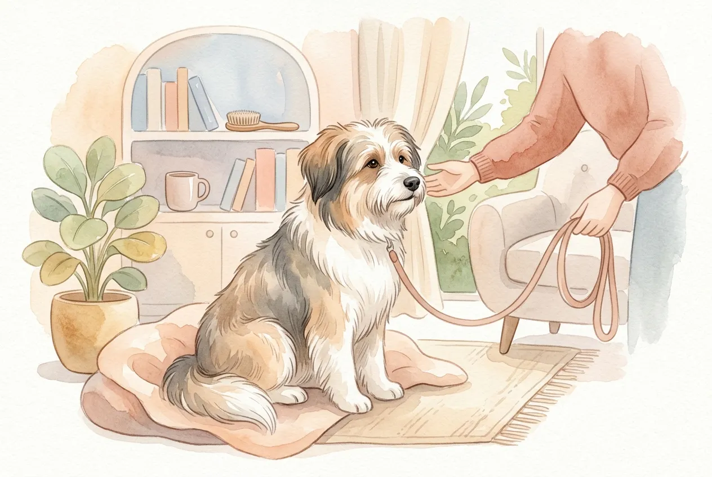
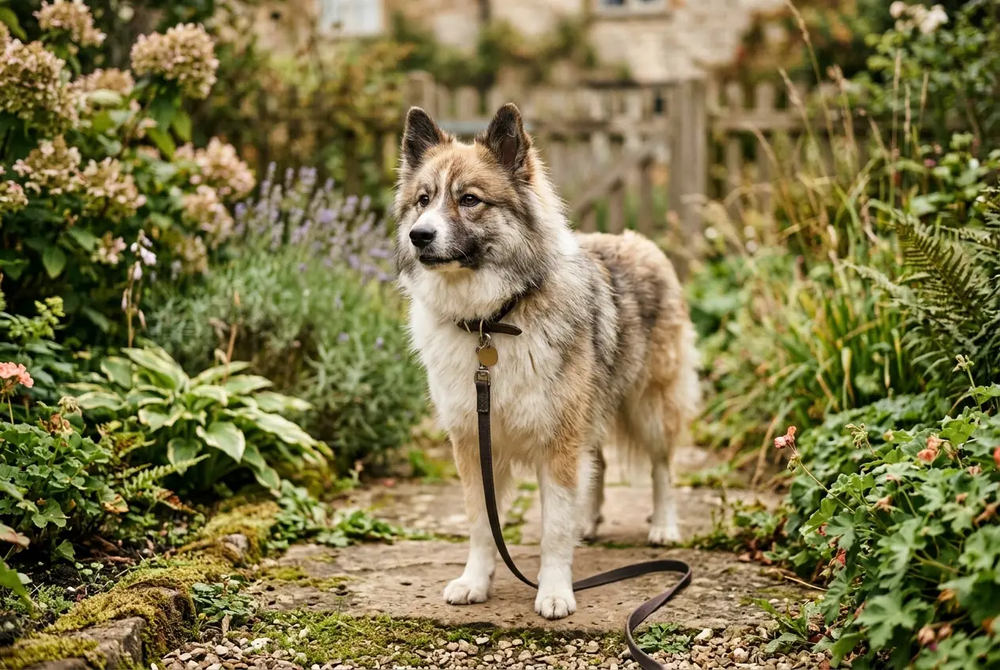
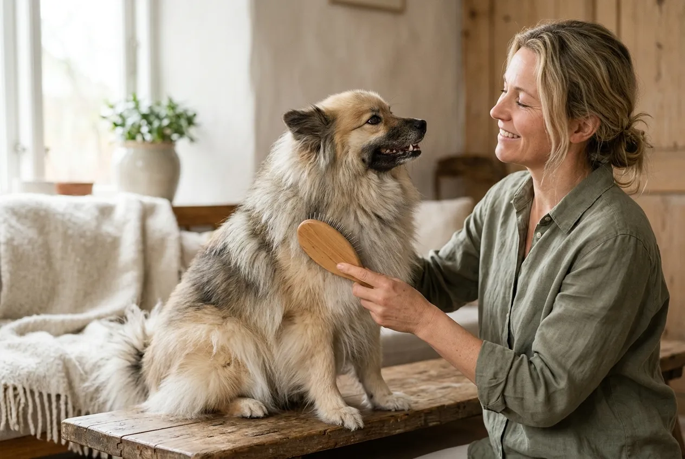

Die Hunderasse Elo ist ein in Deutschland gezüchteter Familienhund, der seit 1987 gezielt auf ein ruhiges, kinderfreundliches Wesen selektiert wird. Der Elo Hund vereint Eigenschaften von Eurasier, Bobtail und Chow Chow -- und wurde speziell dafür geschaffen, ein unkomplizierter Begleiter für Familien zu sein.

In diesem Ratgeber erfährst du alles über den Charakter, die Pflege, die Haltung und die Gesundheit des Elos. Du lernst, welche Größenvarianten es gibt, was ein Elo Welpe kostet und ob diese Hunderasse zu deinem Alltag passt.

Zusammenfassung: Hunderasse Elo

<ul>
<li><strong>Herkunft</strong> -- Deutsche Hunderasse seit 1987, gezüchtet aus Eurasier, Bobtail und Chow Chow</li>
<li><strong>Zwei Größenvarianten</strong> -- Groß-Elo (46-60 cm, 22-35 kg) und Klein-Elo (35-45 cm, 10-15 kg)</li>
<li><strong>Idealer Familienhund</strong> -- Ruhig, kinderfreundlich und anpassungsfähig, auch für Anfänger geeignet</li>
<li><strong>Keine FCI-Anerkennung</strong> -- Der Elo wird ausschließlich von der EZFG e.V. betreut und ist markenrechtlich geschützt</li>
<li><strong>Lebenserwartung</strong> -- 12 bis 16 Jahre bei gesundheitsorientierter Zucht</li>
</ul>

1987

Zuchtbeginn

2

Größenvarianten

12–16 J.

Lebenserwartung

6+

Ausgangsrassen

## Was ist ein Elo? Herkunft und Geschichte der Hunderasse

Der Elo ist eine vergleichsweise junge Hunderasse aus Deutschland. Marita und Heinz Szobries begannen 1987 in Niedersachsen mit der gezielten Zucht eines Familienhundes, der sich durch ein besonders ausgeglichenes Wesen auszeichnen sollte. Die Grundlage bildeten Kreuzungen aus Eurasier, Bobtail (Old English Sheepdog) und Chow Chow.

Im Laufe der Zuchtgeschichte wurden weitere Rassen eingekreuzt. Dazu gehören der Dalmatiner, der Samojede und der Japan Spitz. Jede Einkreuzung verfolgte ein konkretes Ziel: Der Dalmatiner brachte Robustheit, der Samojede ein freundliches Wesen und der Japan Spitz die Grundlage für die kleinere Variante des Elos.

### Warum ist der Elo nicht von der FCI anerkannt?

Der Elo ist keine von der FCI (Fédération Cynologique Internationale) anerkannte Hunderasse. Die Zucht wird ausschließlich von der EZFG e.V. (Elo Zucht- und Forschungsgemeinschaft) koordiniert. Der Grund: Die EZFG verfolgt ein eigenes Zuchtkonzept, das auf Wesensmerkmale statt auf äußere Schönheitsideale setzt.

Der Rassenname "Elo" ist zudem markenrechtlich geschützt. Nur Hunde aus EZFG-anerkannten Zuchtstätten dürfen offiziell als Elos bezeichnet werden. Dieser Schutz soll unkontrollierte Vermehrung verhindern und die Zuchtqualität sichern.

### Der Name Elo -- woher kommt er?

Der Name Elo leitet sich aus den Anfangsbuchstaben der ursprünglichen Ausgangsrassen ab: **E**urasier und Bobtai**l** bilden den Kern, das **O** wurde als klangvoller Abschluss ergänzt. Die Bezeichnung ist kurz, einprägsam und international verständlich.

## Aussehen des Elo Hundes: Größe, Gewicht und Felltypen

Der Elo Hund fällt durch sein freundliches Erscheinungsbild auf. Die Rasse gibt es in zwei Größenvarianten und zwei Felltypen, was eine beachtliche optische Vielfalt innerhalb der Hunderasse Elo ergibt.

### Groß-Elo und Klein-Elo im Vergleich

| Merkmal | Groß-Elo | Klein-Elo |
|---|---|---|
| Schulterhöhe | 46–60 cm | 35–45 cm |
| Gewicht | 22–35 kg | 10–15 kg |
| Ursprungsrassen | Eurasier, Bobtail, Chow Chow | Japan Spitz, Kleinspitz-Einkreuzungen |
| Lebenserwartung | 12–14 Jahre | 14–16 Jahre |
| Wohnungshaltung | Bedingt geeignet | Gut geeignet |

Der Klein-Elo entstand durch gezielte Einkreuzung des Japan Spitz. Er eignet sich besonders für kleinere Wohnungen und Haushalte, die einen kompakteren Hund bevorzugen. Der Groß-Elo ist kräftiger gebaut und benötigt etwas mehr Platz.

### Rauhaar und Glatthaar -- zwei Fellvarianten

Elos gibt es in zwei Felltypen: Rauhaar und Glatthaar. Beide Varianten besitzen eine dichte Unterwolle, die vor Kälte und Nässe schützt.

- **Rauhaar-Elo:** Längeres, leicht gewelltes Deckhaar mit üppiger Unterwolle. Optisch erinnert das Fell an den Eurasier oder Bobtail. Pflegeintensiver, aber haart etwas weniger.
- **Glatthaar-Elo:** Kürzeres, anliegendes Deckhaar mit dichter Unterwolle. Pflegeleichter im Alltag, haart jedoch stärker während des Fellwechsels.

Die Farbpalette ist vielfältig: Elos gibt es in Weiß, Braun, Schwarz, Rot und zahlreichen Mischungen -- insgesamt über 20 Farbvarianten. Auch gescheckte und gefleckte Zeichnungen kommen häufig vor.

ℹ️

<strong>Fellfarbe ist kein Zuchtkriterium</strong>

Bei der Elo-Zucht durch die EZFG spielt die Fellfarbe keine Rolle. Entscheidend sind Gesundheit, Wesen und Sozialverträglichkeit -- nicht das äußere Erscheinungsbild.

## Charakter und Wesen des Elo: Ruhig, freundlich und anpassungsfähig

Das Wesen des Elo Hundes ist das wichtigste Zuchtziel der EZFG. Der Elo wurde gezielt auf ein ruhiges, ausgeglichenes Temperament selektiert. Im Vergleich zu vielen anderen Hunderassen zeigt der Elo wenig bis keinen Jagdtrieb, geringe Aggressionsneigung und eine hohe Reizschwelle.

### Typische Charaktereigenschaften des Elo

Der Elo zeichnet sich durch folgende Wesensmerkmale aus:

- **Freundlich und sozialverträglich** -- versteht sich in der Regel gut mit anderen Hunden, Katzen und Kindern
- **Ruhig und gelassen** -- bellt wenig und reagiert entspannt auf Alltagsreize
- **Anpassungsfähig** -- fühlt sich in einer Stadtwohnung ebenso wohl wie im Haus mit Garten
- **Menschenbezogen** -- baut eine enge Bindung zu seiner Familie auf
- **Wachsam, aber nicht aggressiv** -- meldet Besucher, ohne übermäßig territorial zu reagieren

🧸

Kinderfreundlich

Hohe Toleranz gegenüber Kindern, geduldig und sanft im Umgang

🐕

Sozialverträglich

Versteht sich gut mit anderen Hunden und Haustieren

🏠

Anpassungsfähig

Eignet sich für Wohnung, Haus und verschiedene Lebensmodelle

🔇

Ruhiges Wesen

Bellt wenig, hohe Reizschwelle und ausgeglichenes Temperament

### Ist der Elo ein Familienhund?

Der Elo gilt als einer der besten Familienhunde unter den deutschen Hunderassen. Die gezielte Selektion auf Kinderfreundlichkeit und Sozialverträglichkeit macht ihn zu einem verlässlichen Begleiter für Familien mit Kindern. Laut EZFG werden Zuchthunde nur dann zugelassen, wenn sie einen Wesenstest bestehen, der unter anderem das Verhalten gegenüber Kindern und Fremden prüft.

Auch für Senioren und Einzelpersonen eignet sich der Elo Hund. Seine moderate Bewegungsfreude und sein ruhiges Temperament passen zu verschiedenen Lebensstilen. Wenn du einen [Hund für Anfänger](https://hundewissen-mit-kopf.de/hunderassen/hunderasse-fuer-anfaenger/) suchst, ist der Elo eine hervorragende Wahl.

## Erziehung des Elo: Einfach, aber nicht ohne Regeln

Die Erziehung eines Elo Hundes gilt als unkompliziert. Sein kooperatives Wesen und die Bereitschaft, sich an seine Familie anzupassen, erleichtern das Training erheblich. Dennoch braucht auch der Elo klare Regeln und eine konsequente Führung.

### Grundgehorsam und Alltagstraining

Der Elo lernt schnell und reagiert gut auf positive Verstärkung. Belohnung durch Leckerlis, Lob und Spiel motiviert ihn mehr als strenge Korrekturen. Wichtige [Grundkommandos](https://hundewissen-mit-kopf.de/erziehung-verhalten/kommandos-hund/) wie Sitz, Platz und Hier sollten bereits im Welpenalter trainiert werden.

Typische Trainingsschwerpunkte beim Elo:

1. **Grundkommandos** -- Sitz, Platz, Bleib, Hier ab der 8. Lebenswoche
2. **Stubenreinheit** -- Elos werden in der Regel schnell [stubenrein](https://hundewissen-mit-kopf.de/erziehung-verhalten/hund-stubenrein-bekommen/)
3. **Leinenführigkeit** -- Durch geringen Jagdtrieb vergleichsweise einfach
4. **Sozialisierung** -- Kontakt mit anderen Hunden, Menschen und Alltagssituationen

💡

<strong>Welpenspielstunde besuchen</strong>

Auch wenn der Elo von Natur aus sozialverträglich ist, profitiert er enorm von einer guten Welpenspielstunde. Der Kontakt mit verschiedenen Rassen und Altersgruppen festigt sein ausgeglichenes Wesen.

### Häufige Erziehungsfehler beim Elo

Gerade weil der Elo so unkompliziert wirkt, machen manche Halter den Fehler, die Erziehung zu vernachlässigen. Ein Elo ohne klare Regeln kann durchaus eigensinnig werden. Besonders der Rückruf sollte zuverlässig sitzen, bevor der Hund frei läuft -- auch wenn sein Jagdtrieb gering ist.

## Haltung und Bewegung: Was der Elo Hund braucht

Der Elo stellt moderate Anforderungen an Bewegung und Beschäftigung. Er ist kein Hochleistungssportler, braucht aber tägliche Spaziergänge und geistige Auslastung, um zufrieden zu sein.

### Bewegungsbedarf nach Größe

| Größenvariante | Tägliche Bewegung | Geeignete Aktivitäten |
|---|---|---|
| Groß-Elo | 60–90 Minuten | Spaziergänge, leichtes Joggen, Nasenarbeit |
| Klein-Elo | 45–60 Minuten | Spaziergänge, Suchspiele, Tricktraining |

Elos sind keine typischen Begleithunde für Marathonläufer oder Radfahrer. Sie bevorzugen gemütliche Spaziergänge mit Schnüffelpausen und moderate Spieleinheiten. Nasenarbeit und Intelligenzspielzeug eignen sich hervorragend, um den Elo geistig auszulasten.

### Wohnungshaltung oder Haus mit Garten?

Der Elo Hund passt sich an verschiedene Wohnsituationen an. Eine Stadtwohnung ist für den Klein-Elo kein Problem, solange er ausreichend Auslauf bekommt. Der Groß-Elo fühlt sich in einem Haus mit Garten wohler, kann aber ebenfalls in einer geräumigen Wohnung gehalten werden.

Vorteile der Elo-Haltung

<ul>
<li>Geringer Jagdtrieb -- entspanntes Spazierengehen</li>
<li>Wenig Bellfreude -- ideal für Mietwohnungen</li>
<li>Anpassungsfähig an verschiedene Tagesabläufe</li>
<li>Verträglich mit anderen Haustieren</li>
</ul>

Herausforderungen

<ul>
<li>Haart mäßig bis stark, besonders beim Fellwechsel</li>
<li>Braucht engen Familienanschluss -- kein Zwingerhund</li>
<li>Kann bei Langeweile unerwünschtes Verhalten zeigen</li>
<li>Eingeschränkte Verfügbarkeit seriöser Züchter</li>
</ul>

## Pflege des Elo: Fell, Ohren, Zähne und Krallen

Die Pflege eines Elo Hundes ist überschaubar, erfordert aber Regelmäßigkeit. Besonders die Fellpflege nimmt je nach Felltyp unterschiedlich viel Zeit in Anspruch.

### Fellpflege nach Felltyp

Rauhaar-Elos benötigen 2- bis 3-mal pro Woche eine gründliche Bürsteneinheit. Ihr längeres Fell neigt zu Verfilzungen, besonders hinter den Ohren, an den Beinen und am Bauch. Ein detaillierter [Ratgeber zum Hund bürsten](https://hundewissen-mit-kopf.de/hundepflege/hund-buersten/) hilft dir bei der richtigen Technik.

Glatthaar-Elos kommen mit 1- bis 2-maligem Bürsten pro Woche aus. Während des Fellwechsels im Frühjahr und Herbst sollte die Frequenz bei beiden Varianten auf tägliches Bürsten erhöht werden.

1

Unterwolle entwirren

Mit einem Unterwollkamm lose Haare und Verfilzungen sanft lösen

2

Deckhaar bürsten

Mit einer Naturhaarbürste das Deckhaar in Wuchsrichtung glätten

3

Problemzonen prüfen

Ohren, Achseln und Hinterbeine auf Knoten kontrollieren

✓

Belohnen

Nach jeder Pflegeeinheit ein Leckerli geben -- so wird Bürsten zum Ritual

### Weitere Pflegemaßnahmen

- **Ohren:** Wöchentlich auf Verschmutzung und Rötung kontrollieren. Elos mit Hängeohren neigen eher zu Ohrenentzündungen.
- **Zähne:** 2- bis 3-mal pro Woche mit einer Hundezahnbürste reinigen oder Kauartikel zur Zahnpflege anbieten.
- **Krallen:** Alle 4 bis 6 Wochen kürzen, falls sie sich nicht von selbst abnutzen.
- **Baden:** Nur bei starker Verschmutzung. Mehr dazu im [Ratgeber zum Hund baden](https://hundewissen-mit-kopf.de/hundepflege/hund-baden/).

## Ernährung des Elo: Futter, Menge und Besonderheiten

Der Elo Hund hat keine besonderen Ernährungsanforderungen, die über die allgemeinen Grundsätze einer artgerechten Hundeernährung hinausgehen. Hochwertiges Futter mit einem Fleischanteil von mindestens 60-70 % bildet die Basis.

### Fütterungsempfehlung nach Größe und Alter

| Lebensphase | Groß-Elo (Tagesration) | Klein-Elo (Tagesration) | Mahlzeiten/Tag |
|---|---|---|---|
| Welpe (8-16 Wochen) | 150–250 g | 80–120 g | 3–4 |
| Junghund (4-12 Monate) | 250–400 g | 120–200 g | 2–3 |
| Erwachsener Hund | 300–500 g | 150–250 g | 2 |
| Senior (ab 8 Jahre) | 250–400 g | 120–200 g | 2 |

Die genaue Futtermenge richtet sich nach dem Aktivitätslevel, dem Gewicht und dem individuellen Stoffwechsel deines Hundes. Als Faustregel gilt: 2-3 % des Körpergewichts bei Nassfutter oder BARF, deutlich weniger bei Trockenfutter aufgrund der höheren Energiedichte.

⚠️

<strong>Übergewicht vermeiden</strong>

Elos neigen bei zu wenig Bewegung und zu großen Futterportionen zu Übergewicht. Regelmäßiges Wiegen und eine Anpassung der Futtermenge beugen Gelenkproblemen vor -- besonders beim Groß-Elo.

### Welches Futter eignet sich für den Elo?

Ob Nassfutter, Trockenfutter oder BARF -- der Elo verträgt in der Regel alle gängigen Fütterungsmethoden. Wichtig ist ein hoher Fleischanteil, der Verzicht auf Zucker und künstliche Zusatzstoffe sowie eine ausgewogene Versorgung mit Vitaminen und Mineralstoffen.

Gesundes Obst und Gemüse wie [Äpfel](https://hundewissen-mit-kopf.de/hundeernaehrung/duerfen-hunde-aepfel-essen/) oder [Bananen](https://hundewissen-mit-kopf.de/hundeernaehrung/duerfen-hunde-bananen-essen/) eignen sich als gelegentliche Ergänzung zum Hauptfutter.

## Gesundheit des Elo: Erbkrankheiten und Vorsorge

Die EZFG legt großen Wert auf gesundheitsorientierte Zucht. Alle Zuchthunde durchlaufen umfangreiche Gesundheitsprüfungen, bevor sie zur Zucht zugelassen werden. Dennoch können auch beim Elo bestimmte Erkrankungen auftreten.

### Typische Gesundheitsrisiken beim Elo

- **Hüftgelenksdysplasie (HD):** Besonders beim Groß-Elo möglich. EZFG-Züchter lassen alle Zuchthunde röntgen.
- **Distichiasis:** Eine Fehlstellung der Wimpern, die zu Augenreizungen führen kann. Wird in der Zucht überwacht.
- **Patellaluxation:** Vor allem beim Klein-Elo relevant. Die Kniescheibe springt aus ihrer Führung.
- **Allergien:** Einige Elos reagieren empfindlich auf bestimmte Futterbestandteile oder Umweltreize.

🚫

<strong>Vorsicht vor unseriösen Züchtern</strong>

Elos von Züchtern ohne EZFG-Mitgliedschaft unterliegen keiner kontrollierten Gesundheitsprüfung. Das Risiko für Erbkrankheiten steigt erheblich. Kaufe Elo Welpen ausschließlich bei EZFG-zertifizierten Zuchtstätten.

### Vorsorge und Tierarztbesuche

Regelmäßige Vorsorgeuntersuchungen beim Tierarzt sind für den Elo ebenso wichtig wie für jede andere Hunderasse. Empfohlen werden:

- **Jährliche Gesundheitschecks** mit Blutbild und Zahnkontrolle
- **Impfungen** gemäß der Empfehlung der Ständigen Impfkommission Veterinärmedizin (StIKo Vet)
- **Entwurmung** alle 3 Monate oder nach Kotuntersuchung
- **HD-Röntgen** beim Groß-Elo ab dem 12. Lebensmonat

## Elo Hund kaufen: Züchter, Preise und Wartezeiten

Ein Elo Welpe von einem seriösen Züchter der EZFG kostet zwischen 1.200 und 1.800 Euro. Der Preis richtet sich nach Größenvariante, Felltyp und Region. Hinzu kommen einmalige Anschaffungskosten für Grundausstattung von etwa 200 bis 400 Euro.

### Laufende Kosten für einen Elo Hund

| Kostenfaktor | Monatlich (ca.) | Jährlich (ca.) |
|---|---|---|
| Futter (hochwertiges Nassfutter) | 50–100 € | 600–1.200 € |
| Tierarzt (Vorsorge, Impfungen) | 15–30 € | 180–360 € |
| Hundehaftpflicht | 5–10 € | 60–120 € |
| Hundesteuer | 5–15 € | 60–180 € |
| Zubehör und Pflege | 10–20 € | 120–240 € |
| **Gesamt** | **85–175 €** | **1.020–2.100 €** |

### Seriösen Elo-Züchter finden

Die EZFG e.V. führt eine offizielle Züchterliste auf ihrer Website. Seriöse Elo-Züchter erkennst du an folgenden Merkmalen:

✅ Checkliste: Seriöser Elo-Züchter

✓

Mitglied der EZFG e.V. mit gültiger Zuchtzulassung

✓

Gesundheitszeugnisse beider Elterntiere vorhanden (HD, Augen, Patella)

✓

Welpen wachsen im Haus mit Familienanschluss auf

✓

Züchter stellt Fragen zu deiner Lebenssituation

✓

Kaufvertrag und Ahnentafel werden mitgegeben

Welpen vor der 8. Woche abgeben (unseriös!)

Die Wartezeit auf einen Elo Welpen beträgt häufig 6 bis 12 Monate. Da die Zucht streng reguliert ist und die Nachfrage hoch, solltest du dich frühzeitig bei einem Züchter melden.

## Für wen eignet sich der Elo? Zielgruppen im Überblick

Der Elo Hund wurde als Familienhund konzipiert und eignet sich für eine breite Zielgruppe. Seine Anpassungsfähigkeit macht ihn zu einem der vielseitigsten Begleithunde unter den deutschen Hunderassen.

👨‍👩‍👧‍👦

Familien mit Kindern

Geduldig, sanft und kinderfreundlich -- der Elo wurde genau dafür gezüchtet

🐾

Ersthundehalter

Kooperatives Wesen und einfache Erziehung machen ihn zum idealen Anfängerhund

👴

Senioren

Moderater Bewegungsbedarf und ruhiges Temperament passen zu einem gemächlicheren Alltag

🏢

Wohnungshalter

Besonders der Klein-Elo eignet sich für die Stadtwohnung -- wenig Bellfreude inklusive

### Weniger geeignet ist der Elo für:

- **Sportlich ambitionierte Hundehalter** -- Der Elo ist kein Agility-Champion oder Langstreckenläufer
- **Menschen, die selten zu Hause sind** -- Elos brauchen engen Familienanschluss und leiden unter langer Einsamkeit
- **Halter, die einen Wachhund suchen** -- Der Elo meldet zwar Besucher, zeigt aber kein ausgeprägtes Schutzverhalten

## Elo im Vergleich zu ähnlichen Hunderassen

Wer sich für den Elo interessiert, zieht häufig auch andere familienfreundliche Hunderassen in Betracht. Die folgende Tabelle zeigt, wie sich der Elo von seinen Ausgangsrassen und beliebten Alternativen unterscheidet.

| Merkmal | Elo | Eurasier | Bobtail | Chow Chow |
|---|---|---|---|---|
| Gewicht | 10–35 kg | 18–32 kg | 27–45 kg | 20–32 kg |
| Charakter | Ruhig, anpassungsfähig | Ruhig, reserviert | Fröhlich, eigenwillig | Eigenständig, distanziert |
| Anfängertauglich | Sehr gut | Gut | Bedingt | Weniger geeignet |
| Jagdtrieb | Sehr gering | Gering | Gering | Gering |
| Pflegeaufwand | Mittel | Mittel bis hoch | Hoch | Mittel |
| FCI-Anerkennung | Nein | Ja | Ja | Ja |

Der Elo vereint die positiven Eigenschaften seiner Ausgangsrassen, während unerwünschte Merkmale wie die Sturheit des Chow Chow oder die Größe des Bobtails gezielt herausgezüchtet wurden.

📖

<strong>Zuchtphilosophie der EZFG</strong>

Die EZFG selektiert primär nach Wesen und Gesundheit. Äußere Merkmale wie Fellfarbe oder Ohrform sind sekundär. Dieses Konzept unterscheidet die Elo-Zucht grundlegend von den meisten FCI-Rassezuchten, die auf Rassestandards mit definierten äußeren Merkmalen setzen.

## Elo Welpe: Die ersten Wochen im neuen Zuhause

Ein Elo Welpe zieht in der Regel mit 8 bis 10 Wochen in sein neues Zuhause ein. Die ersten Wochen sind entscheidend für die Prägung und Sozialisierung des jungen Hundes.

### Vorbereitung und Grundausstattung

Bevor dein Elo Welpe einzieht, solltest du folgende Grundausstattung bereithalten:

- **Hundebett** in einer ruhigen Ecke
- **Futter- und Wassernapf** aus Edelstahl oder Keramik
- **Hochwertiges Welpenfutter** (Empfehlung des Züchters beachten)
- **[Geschirr oder Halsband](https://hundewissen-mit-kopf.de/hundeausstattung/hundegeschirr-oder-halsband/)** in der passenden Größe
- **Leine** (2 Meter Führleine für den Anfang)
- **Kauartikel und Spielzeug** für die Zahnentwicklung
- **Transportbox** für sichere Autofahrten

### Sozialisierungsphase nutzen

Die sensible Phase der Sozialisierung dauert beim Elo bis etwa zur 16. Lebenswoche. In dieser Zeit sollte dein Welpe möglichst viele positive Erfahrungen sammeln: verschiedene Menschen, Geräusche, Oberflächen, andere Tiere und Alltagssituationen. Der Elo bringt von Natur aus eine gute Grundlage mit -- die Sozialisierung festigt sein ausgeglichenes Wesen zusätzlich.

## Fazit: Die Hunderasse Elo -- der maßgeschneiderte Familienhund

Die Hunderasse Elo ist eine durchdachte Schöpfung für Menschen, die einen ruhigen, freundlichen und anpassungsfähigen Hund suchen. Mit seinem ausgeglichenen Wesen, dem geringen Jagdtrieb und der hohen Sozialverträglichkeit erfüllt der Elo Hund die Anforderungen an einen modernen Familienhund nahezu perfekt.

Ob Groß-Elo oder Klein-Elo, Rauhaar oder Glatthaar -- die Vielfalt innerhalb der Rasse ermöglicht es, den passenden Elo für die eigene Lebenssituation zu finden. Entscheidend ist, einen Welpen ausschließlich bei einem EZFG-zertifizierten Züchter zu erwerben. So stellst du sicher, dass dein Elo gesund ist und das typische, liebenswerte Wesen mitbringt, für das diese Hunderasse bekannt ist.

Wer bereit ist, seinem Elo tägliche Spaziergänge, regelmäßige Fellpflege und vor allem viel Familienanschluss zu bieten, wird mit einem treuen, unkomplizierten Begleiter für die nächsten 12 bis 16 Jahre belohnt.