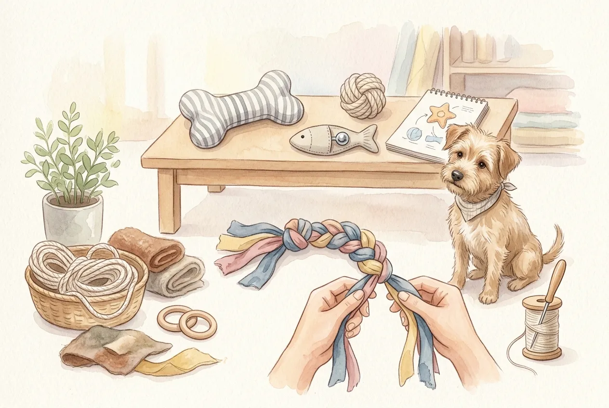
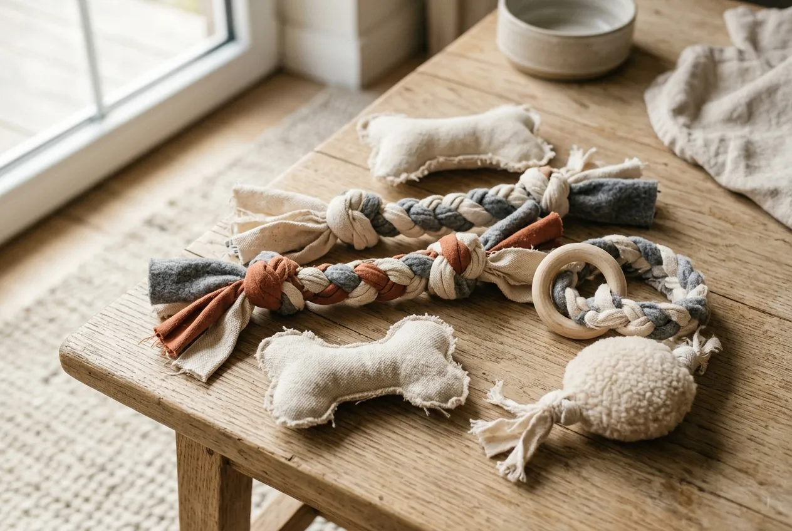
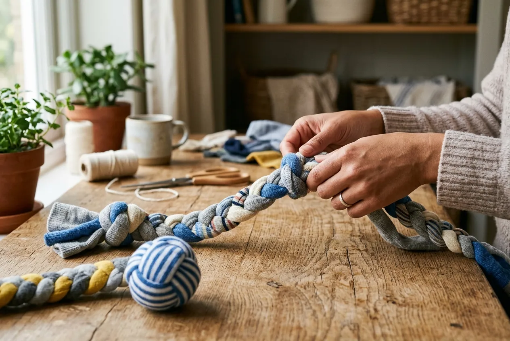
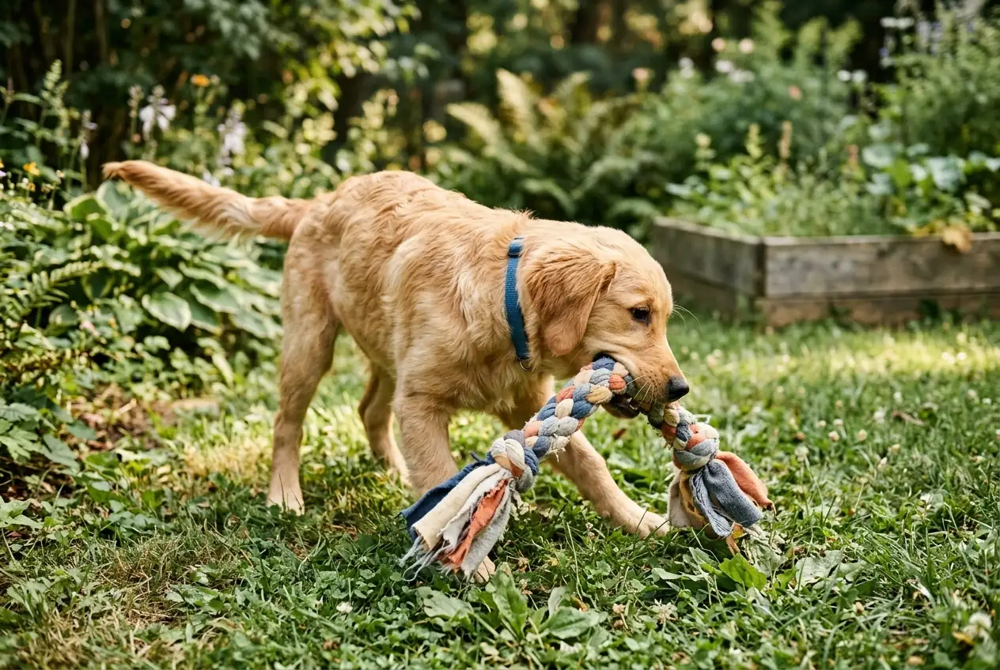

Hundespielzeug selber machen ist einfacher als viele denken und spart nicht nur Geld, sondern macht auch Spaß. Mit wenigen Materialien aus dem Haushalt entstehen Schnüffelteppiche, Zerrspielzeuge und Denkspiele, die deinen Hund genauso begeistern wie gekauftes Spielzeug. Voraussetzung ist, dass du die richtigen Materialien wählst und das DIY-Spielzeug regelmäßig auf Schäden prüfst.

In diesem Artikel findest du konkrete Anleitungen, Materialtipps und Sicherheitshinweise. Du erfährst, welche Ideen für Welpen, Senioren und starke Kauer geeignet sind und worauf du beim Basteln unbedingt achten solltest.

## Hundespielzeug selber machen: Warum DIY für Hunde sinnvoll ist

Selbstgemachtes Hundespielzeug hat einen klaren Vorteil: Du weißt genau, was drin ist. Gekauftes Spielzeug enthält manchmal Schadstoffe oder Füllungen, die für Hunde problematisch sein können. Wer selbst bastelt, hat die volle Kontrolle über Materialien und Verarbeitung.

Zusammenfassung: Hundespielzeug selber machen

<ul>
<li><strong>Günstig und individuell</strong> -- aus Haushaltsmaterialien wie Socken, T-Shirts oder Karton entsteht sicheres Spielzeug</li>
<li><strong>Sicherheit geht vor</strong> -- nur schadstoffarme Materialien ohne Kleinteile verwenden und regelmäßig auf Schäden prüfen</li>
<li><strong>Vielfalt ist möglich</strong> -- Schnüffelteppiche, Zerrspielzeuge, Denkspiele und Outdoor-Ideen lassen sich alle selbst herstellen</li>
<li><strong>Nicht für jeden Hund geeignet</strong> -- starke Kauer oder Hunde mit Neigung zum Verschlucken brauchen besondere Aufmerksamkeit</li>
</ul>

### Welche Vorteile selbstgemachtes Hundespielzeug bietet

DIY-Spielzeug für Hunde bietet mehrere handfeste Vorteile gegenüber Kaufprodukten. Du sparst Geld, kannst Materialien recyceln und das Spielzeug genau auf die Bedürfnisse deines Hundes abstimmen. Wer einen Hund in der [Welpenerziehung](https://hundewissen-mit-kopf.de/erziehung-verhalten/welpenerziehung/) hat, profitiert besonders davon, unkompliziert und schnell neues Spielzeug nachzubasteln, wenn ein Stück zerstört ist.

Außerdem lässt sich selbstgemachtes Spielzeug jederzeit an Größe, Spielverhalten und Vorlieben anpassen. Ein kleiner Hund braucht ein anderes Zerrspielzeug als ein Labrador. Das Basteln selbst kann außerdem eine entspannende Freizeitbeschäftigung sein.

### Für welche Hunde sich DIY-Spielzeug besonders eignet

DIY-Spielzeug eignet sich gut für Hunde mit mittlerer Kauintensität, die Spielzeug nicht sofort zerlegen. Besonders profitieren Welpen, ältere Hunde und Hunde mit viel Energie davon. Für sehr starke Kauer, die Spielzeug in Minuten zerstören, ist selbstgemachtes Spielzeug nur bedingt geeignet und sollte ausschließlich unter Aufsicht eingesetzt werden.

Hunde mit Langeweile oder leichtem Bewegungsmangel profitieren vor allem von Denkspielen und Schnüffelteppichen, weil diese geistige Auslastung bieten, ohne körperliche Höchstleistung zu fordern.

## Sichere Materialien und wichtige Regeln beim Hundespielzeug selber machen

Die Materialwahl entscheidet darüber, ob selbstgemachtes Spielzeug sicher ist oder ein Risiko darstellt. Nicht jeder Stoff, jedes Seil und jede Füllung ist für Hunde geeignet.

⚠️

<strong>Sicherheitshinweis: Spielzeug immer beaufsichtigt nutzen</strong>

Selbstgemachtes Spielzeug ist kein Ersatz für beaufsichtigtes Spiel. Lass deinen Hund damit nie unbeaufsichtigt, da Nähte aufreißen und Teile verschluckt werden können. Kontrolliere das Spielzeug nach jeder Nutzung auf Schäden.

### Geeignete Stoffe, Seile und Füllungen für selbstgemachtes Hundespielzeug

Für Hundespielzeug selber machen aus Stoff eignen sich vor allem Fleece, Baumwolle und alte T-Shirts aus reinen Naturfasern. Diese Materialien sind weich, reißfest genug für moderates Zerren und enthalten in der Regel keine problematischen Beschichtungen. Hanf- und Baumwollseile sind ebenfalls gut geeignet, solange sie keine Kunstfasern enthalten, die sich beim Kauen lösen können.

Bei Füllungen gilt: Weniger ist mehr. Ungefülltes Spielzeug ist am sichersten. Wenn du dennoch eine Füllung verwendest, achte auf fest vernähte Nähte und nutze das Spielzeug nur unter Aufsicht. Die [Stiftung Warentest](https://www.test.de/) hat wiederholt auf Schadstoffe in Heimtierbedarf und Textilien hingewiesen. Kaufe Stoffe daher möglichst aus dem Öko-Bereich oder verwende gewaschene Altkleider.

### Was du wegen Verschluckungsgefahr und Schadstoffen vermeiden solltest

Vermeide Materialien mit losen Kleinteilen wie Knöpfen, Augen aus Plastik oder Metallösen. Auch Gummibänder, Reißverschlüsse und Klettverschlüsse haben im Hundespielzeug nichts zu suchen. Synthetische Füllungen aus Styropor oder Schaumstoff sind gefährlich, wenn der Hund sie herausbeißt und verschluckt.

Besondere Vorsicht gilt bei bedruckten oder gefärbten Stoffen. Farben können beim Kauen abgelöst werden und im schlimmsten Fall giftige Substanzen freisetzen. Das Bundesinstitut für Risikobewertung (BfR) empfiehlt grundsätzlich, bei Tierspielzeug auf unbehandelte Materialien zu setzen.

## Schnüffelteppich selber machen: Das beliebte Denkspiel für Hunde

Ein Schnüffelteppich ist eines der beliebtesten und gleichzeitig einfachsten Denkspiele für Hunde. Er fördert die Nasenarbeit, verlangsamt das Fressen und macht Hunde auf natürliche Weise müde.

15 Min

Bastelzeit für einen einfachen Schnüffelteppich

30 Min

Entspricht mentalem Auslastungseffekt eines Spaziergangs

0 €

Kosten bei Verwendung von Altstoffen aus dem Haushalt

2

Materialien reichen für den Einstieg

### Materialliste für einen einfachen Schnüffelteppich

Für einen einfachen Schnüffelteppich brauchst du nur wenige Dinge:

- Eine Antirutschmatte mit Löchern (z.B. aus dem Küchenbereich)
- Fleece- oder Baumwollstreifen, ca. 2 cm breit und 20 cm lang
- Eine Schere

Die Antirutschmatte bildet das Grundgerüst. Die Stoffstreifen werden durch die Löcher gezogen und verknotet, sodass eine dichte, schnüffelfreundliche Oberfläche entsteht. Mehr Material brauchst du nicht.

### Schnüffelteppich in wenigen Schritten basteln

Das Basteln eines Schnüffelteppichs ist auch für Anfänger ohne Nähkenntnisse möglich.

1

Streifen schneiden

Schneide alte Fleece- oder T-Shirt-Stoffe in ca. 2 cm breite und 20 cm lange Streifen. Je mehr Streifen, desto dichter wird der Teppich.

2

Streifen einfädeln

Schiebe je einen Streifen durch ein Loch der Antirutschmatte, sodass beide Enden gleich lang aus der Matte herausragen.

3

Knoten setzen

Knote die beiden Enden des Streifens fest zusammen, damit er nicht herausrutscht. Wiederhole das für jedes Loch.

✓

Fertig

Verstecke ein paar Leckerlis zwischen den Streifen und lass deinen Hund schnüffeln. Fertig ist das erste Denkspiel!

Nach dem Basteln den Schnüffelteppich vor dem ersten Einsatz einmal schütteln, um zu prüfen, ob alle Knoten halten. Leckerlis immer erst kurz vor dem Einsatz einlegen, damit der Geruch frisch bleibt.

## Hundespielzeug selber machen aus Socken: Einfache Ideen für Anfänger

Alte Socken sind das vielleicht einfachste Material für selbstgemachtes Hundespielzeug. Sie sind weich, flexibel und in jedem Haushalt vorhanden. Das [Umweltbundesamt](https://www.umweltbundesamt.de/) empfiehlt generell die Wiederverwendung von Textilien vor der Entsorgung. Alte Socken zu Spielzeug zu machen ist eine sinnvolle Form des Upcyclings.

1

Socken auswählen

Wähle saubere, stabile Socken ohne Löcher, Knöpfe oder Applikationen. Baumwollsocken ohne synthetische Anteile sind am besten geeignet.

2

Socken zusammenlegen

Lege zwei bis drei Socken aufeinander oder ineinander, um mehr Stabilität zu erzeugen. Mehr Lagen bedeuten mehr Widerstand beim Zerren.

3

Knoten setzen

Knote die Socken in der Mitte fest zusammen. An beiden Enden entsteht so ein Griff. Fertig ist das einfachste Zerrspielzeug.

✓

Fertig

Das Socken-Spielzeug ist sofort einsatzbereit. Kontrolliere es nach dem Spiel auf aufgegangene Knoten oder ausgefranste Stellen.

### Hundespielzeug selber machen aus Socken: Zerrspielzeug mit Knoten

Das klassische Socken-Zerrspielzeug entsteht in wenigen Minuten. Du nimmst zwei bis drei alte Baumwollsocken, legst sie aufeinander und knotest sie in der Mitte fest zusammen. Die überstehenden Enden bilden die Griffflächen für das Zerren. Für mehr Stabilität kannst du mehrere Socken ineinanderstecken, bevor du den Knoten setzt.

Hundespielzeug selber machen aus Socken eignet sich besonders gut für Hunde, die gerne zerren, aber kein aggressives Kauverhalten zeigen. Das Spielzeug sollte immer unter Aufsicht genutzt und nach jeder Sitzung auf Schäden geprüft werden.

### Wann Socken-Spielzeug ungeeignet ist

Für Hunde, die Stoff schnell zerlegen oder dazu neigen, Teile zu verschlucken, ist Socken-Spielzeug keine gute Idee. Auch für sehr kleine Hunde, bei denen einzelne Sockenfasern ein Verschluckungsrisiko darstellen, solltest du auf andere Materialien ausweichen. Hunde mit bekanntem Fremdkörper-Problem in der Vorgeschichte sollten grundsätzlich kein Stoff-Spielzeug ohne direkte Aufsicht erhalten.

## Hunde Denkspiele selber machen: Intelligentes Hundespielzeug für drinnen

Hunde Denkspiele selber machen ist eine der effektivsten Methoden, um Hunde geistig auszulasten. Besonders an Regentagen oder bei eingeschränkter Bewegung sind selbstgemachte Intelligenzspiele eine wertvolle Ergänzung zum Alltag.

📦

Karton-Suchspiel

Leckerlis in mehreren Kartons verstecken. Hund muss durch Schnüffeln die richtigen Boxen finden.

🧦

Muffin-Suche

Muffinform mit Tennisbällen abdecken. Darunter Leckerlis verstecken. Hund muss Bälle wegschieben.

🪣

Eimer-Spiel

Mehrere Becher umgedreht aufstellen, nur unter einem liegt ein Leckerli. Hund muss den richtigen Becher finden.

🧶

Schnüffelteppich

Leckerlis tief in den Streifen verstecken. Steigert die Schnüffelintensität und Konzentration.

### Intelligentes Hundespielzeug selber machen mit Karton und Leckerli

Für intelligentes Hundespielzeug selber machen aus Karton brauchst du nur leere Kartons, Leckerlis und etwas Kreativität. Die einfachste Variante: Lege ein Leckerli in einen Karton, falte ihn zu und lass deinen Hund herausfinden, wie er ans Futter kommt. Steigere die Schwierigkeit, indem du mehrere Kartons ineinander stapelst oder Leckerlis in Papier einwickelst.

Eine weitere beliebte Idee ist die Muffin-Suche: Lege Leckerlis in eine Muffinform und decke alle Mulden mit Tennisbällen ab. Dein Hund muss die Bälle wegschieben, um ans Futter zu kommen. Das fördert Problemlösungsfähigkeiten und Nasenarbeit gleichzeitig.

### So steigerst du den Schwierigkeitsgrad sinnvoll

Starte immer mit sehr einfachen Aufgaben, damit dein Hund erste Erfolgserlebnisse hat. Wenn er die Grundidee verstanden hat, kannst du die Aufgaben schrittweise schwieriger machen. Wichtig ist, dass das Spiel kurz und positiv endet, bevor dein Hund frustriert wird.

Laut der [Tierärztlichen Vereinigung für Tierschutz e.V. (TVT)](https://www.tierschutz-tvt.de/) ist abwechslungsreiche geistige Beschäftigung ein wichtiger Bestandteil artgerechter Hundehaltung und kann Verhaltensproblemen durch Langeweile effektiv vorbeugen. Plane Denkspiel-Einheiten von maximal 10 bis 15 Minuten ein, da längere Sitzungen Hunde überfordern können.

## Robustes Hundespielzeug selber machen: Zerrspielzeug aus Stoff und Jeans

Robustes Hundespielzeug selber machen ist vor allem für mittelgroße und große Hunde mit viel Spieldrang relevant. Wer auf der Suche nach langlebigen Alternativen zu käuflichem [unkaputtbarem Hundespielzeug](https://hundewissen-mit-kopf.de/hundeausstattung/hundespielzeug-unkaputtbar/) ist, kann mit den richtigen Materialien auch selbst gute Ergebnisse erzielen.

Vorteile von selbstgemachtem Zerrspielzeug

<ul>
<li>Kostenlos aus Alttextilien herstellbar</li>
<li>Individuell an Hundegröße anpassbar</li>
<li>Schnell nachgebaut, wenn ein Stück zerstört ist</li>
<li>Kein Plastik, keine Schadstoffe bei Naturstoffen</li>
</ul>

Nachteile und Grenzen

<ul>
<li>Nicht für sehr starke Kauer geeignet</li>
<li>Regelmäßige Kontrolle auf Schäden notwendig</li>
<li>Hält selten so lange wie Qualitäts-Kaufprodukte</li>
<li>Verschluckungsgefahr bei ausgefransten Nähten</li>
</ul>

### Hundespielzeug selber machen knoten: Alte T-Shirts richtig nutzen

Alte T-Shirts lassen sich hervorragend zu Zerrspielzeug verarbeiten. Schneide das T-Shirt in etwa 3 cm breite und 40 cm lange Streifen. Nimm drei Streifen, knote sie an einem Ende zusammen und flechte sie dann wie einen Zopf. Am anderen Ende wieder festknoten. Fertig ist ein einfaches, mehrlagiges Zerrspielzeug.

Für mehr Robustheit kannst du sechs Streifen nehmen und zwei Zöpfe miteinander verflechten. Je mehr Lagen, desto länger hält das Spielzeug. Verwende nur Streifen ohne Bedruckung oder Beschichtung, da diese beim intensiven Kauen abblättern können.

### Upcycling mit alten Jeans: langlebig, aber nicht für jeden Hund

Alte Jeans sind ein besonders robustes Material für selbstgemachtes Hundespielzeug. Jeansstoff ist dichter und reißfester als normales T-Shirt-Material. Schneide Streifen aus dem Hosenbein und verarbeite sie wie die T-Shirt-Streifen zu einem geflochtenen Zerrspielzeug.

Wichtig: Entferne vorher alle Nieten, Knöpfe und Reißverschlüsse sorgfältig. Diese Metallteile sind ein ernstes Verletzungsrisiko. Für sehr kleine Hunde ist Jeansstoff oft zu hart und ungeeignet, da die raue Oberfläche Zahnfleisch reizen kann.

## Hundespielzeug für draußen selber machen: Ideen für Garten und Spaziergang

Hundespielzeug für draußen selber machen muss nicht aufwendig sein. Viele einfache Outdoor-Ideen lassen sich spontan und ohne Vorbereitung umsetzen.

💡

<strong>Tipp: Natur als Spielzeug nutzen</strong>

Stöcke, Tannenzapfen und Äste können spontane Spielzeuge sein. Achte darauf, dass Stöcke keine scharfen Splitter haben und nicht aus giftigen Holzarten stammen. Eichenholz und Robinie gelten als unbedenklich, während Eibe und Goldregen giftig sind.

### Einfache Outdoor-Ideen wie Reizangel oder Suchspiel

Eine selbstgemachte Reizangel entsteht aus einem stabilen Stock, einer Schnur und einem Stück Stoff oder einem alten Spielzeug am Ende. Bewege die Angel über den Boden und lass deinen Hund jagen. Das fördert Bewegung und Jagdinstinkt auf kontrollierte Weise.

Für Suchspiele im Garten versteckst du Leckerlis oder ein Lieblingsspielzeug an verschiedenen Stellen und gibst deinem Hund das Kommando zum Suchen. Wer möchte, kann dabei das [Hund das Kommando Platz beibringen](https://hundewissen-mit-kopf.de/erziehung-verhalten/hund-platz-beibringen/) als Startritual einbauen, damit der Hund wartet, bis du die Leckerlis versteckt hast. Suchspiele sind eine der besten Möglichkeiten, Nasenarbeit und Bewegung zu kombinieren, ohne teure Ausrüstung zu benötigen.

## Fazit: Hundespielzeug selber machen lohnt sich mit den richtigen Materialien

Hundespielzeug selber machen ist eine sinnvolle, günstige und nachhaltige Alternative zu Kaufprodukten, wenn du auf die Materialwahl achtest und das Spielzeug regelmäßig kontrollierst. Schnüffelteppiche, Zerrspielzeuge aus T-Shirts und einfache Denkspiele aus Karton lassen sich in wenigen Minuten herstellen und begeistern die meisten Hunde genauso wie teures Spielzeug aus dem Fachhandel.

Entscheidend ist, dass du das Spielverhalten deines Hundes kennst. Starke Kauer brauchen robustere Lösungen oder beaufsichtigte Nutzung. Für alle anderen ist DIY-Spielzeug eine kreative und artgerechte Bereicherung des Alltags.

✅ Checkliste: Sicheres DIY-Hundespielzeug

✓

Nur schadstoffarme Naturstoffe wie Baumwolle oder Fleece verwenden

✓

Keine Kleinteile, Knöpfe, Nieten oder Reißverschlüsse

✓

Spielzeug immer unter Aufsicht nutzen

✓

Nach jeder Nutzung auf Schäden prüfen

Beschädigtes Spielzeug sofort aussortieren

Schwierigkeitsgrad bei Denkspielen schrittweise steigern

