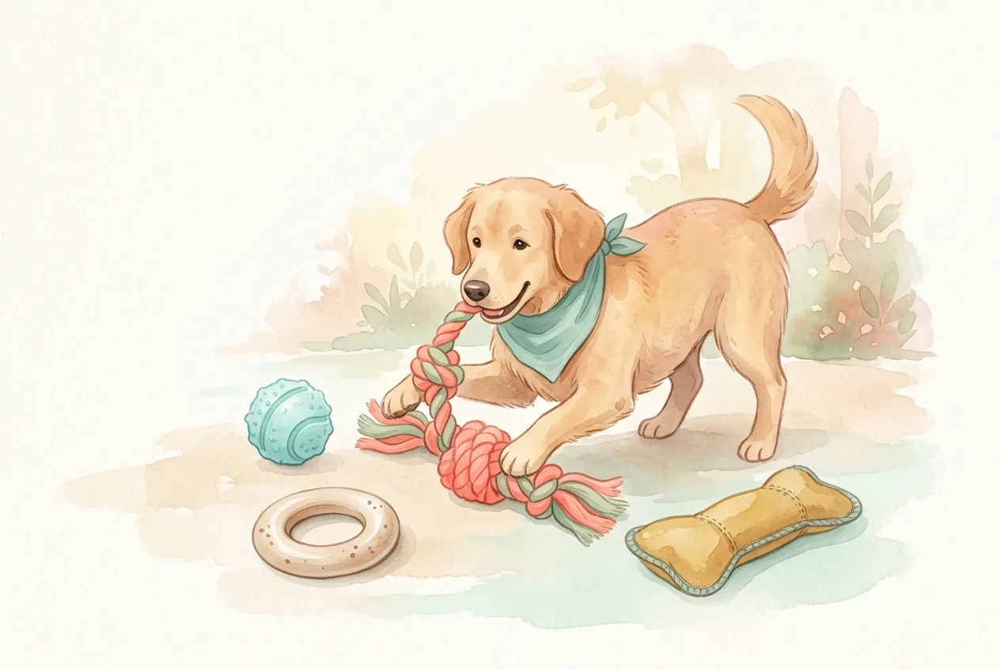
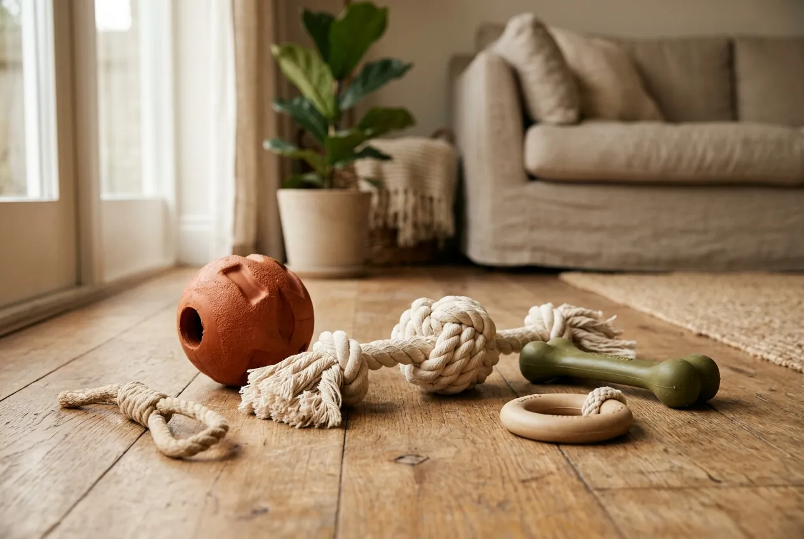
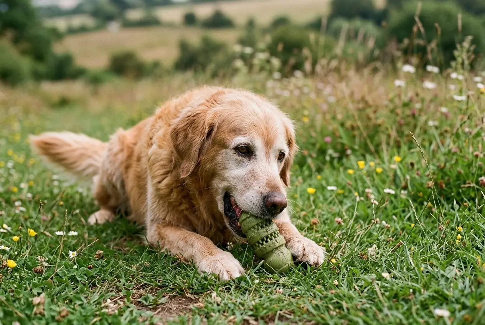

Hundespielzeug unkaputtbar -- diesen Wunsch kennt wohl jeder Hundehalter, dessen Vierbeiner ein neues Spielzeug innerhalb von Minuten zerlegt. Die Suche nach dem wirklich unzerstörbaren Spielzeug ist eine der häufigsten Fragen in der Hundewelt. Doch gibt es Hundespielzeug, das tatsächlich jedem Gebiss standhält?

Die Wahrheit: Kein Spielzeug ist zu 100 % unkaputtbar. Aber es gibt Materialien und Konstruktionen, die selbst den stärksten Kauern monatelang standhalten. In diesem Ratgeber erfährst du, welche Materialien wirklich robust sind, worauf du beim Kauf achten musst und welche Spielzeuge sich für verschiedene Hundetypen eignen.

Zusammenfassung: Unkaputtbares Hundespielzeug

<ul>
<li><strong>Naturkautschuk und Hartgummi</strong> -- die widerstandsfähigsten Materialien für Hundespielzeug, halten bei starken Kauern 6–12 Monate</li>
<li><strong>Kein Spielzeug ist 100 % unzerstörbar</strong> -- aber robuste Spielzeuge reduzieren Verschluckungsrisiken und sparen langfristig Geld</li>
<li><strong>Größe entscheidend</strong> -- das Spielzeug muss immer größer sein als das Maul des Hundes, um Erstickungsgefahr zu vermeiden</li>
<li><strong>Wöchentliche Kontrolle Pflicht</strong> -- auch robustes Spielzeug bei Rissen oder losen Teilen sofort austauschen</li>
<li><strong>Kauspielzeug für Hunde fördert die Zahngesundheit</strong> -- laut Veterinary Oral Health Council reduziert regelmäßiges Kauen Zahnbelag um bis zu 70 %</li>
</ul>

150 kg

Beißkraft großer Hunde

70 %

Weniger Zahnbelag durch Kauen

6–12

Monate Haltbarkeit (robust)

80 %

Der Hunde kauen täglich

## Warum zerstören Hunde ihr Spielzeug so schnell?

Hunde zerlegen Spielzeuge nicht aus Bosheit, sondern folgen einem tief verankerten Instinkt. Das Kauen und Zerreißen simuliert das natürliche Beutefangverhalten, das bei Wölfen -- den Vorfahren unserer Hunde -- überlebenswichtig war. Dieses Verhalten ist bei vielen Hunderassen genetisch besonders stark ausgeprägt.

### Natürlicher Kauinstinkt und Beutetrieb

Der Kauinstinkt gehört zu den grundlegenden Verhaltensweisen jedes Hundes. Welpen kauen ab der 16. Lebenswoche verstärkt, wenn der Zahnwechsel beginnt und die 28 Milchzähne durch 42 bleibende Zähne ersetzt werden. Erwachsene Hunde kauen täglich 30–60 Minuten, um Stress abzubauen und die Kiefermuskulatur zu trainieren.

Bestimmte Rassen wie Labrador Retriever, American Pit Bull Terrier oder Deutsche Schäferhunde haben einen überdurchschnittlich starken Kaudruck. Große Hunde erzeugen beim Kauen eine Beißkraft von bis zu 150 kg -- da hat günstiges Spielzeug aus dünnem Plastik oder Plüsch keine Chance.

### Langeweile und mangelnde Beschäftigung

Viele Hunde zerstören Spielzeuge aus Langeweile oder Unterforderung. Ein Hund, der täglich weniger als 1–2 Stunden körperliche und geistige Beschäftigung bekommt, sucht sich selbst eine Aufgabe -- und das ist oft das Zerlegen von Spielzeug, Schuhen oder Möbeln. Wenn dein Hund regelmäßig [unerwünschtes Verhalten zeigt](https://hundewissen-mit-kopf.de/erziehung-verhalten/hund-bellt-staendig/), kann mangelnde Auslastung eine Ursache sein.

ℹ️

<strong>Gut zu wissen: Kauen ist gesund</strong>

Regelmäßiges Kauen auf geeignetem Spielzeug fördert die Zahngesundheit deines Hundes. Laut dem Veterinary Oral Health Council reduziert tägliches Kauen auf strukturierten Oberflächen die Bildung von Zahnbelag um bis zu 70 %.

## Welche Materialien machen Hundespielzeug unkaputtbar?

Die Haltbarkeit von Hundespielzeug hängt primär vom verwendeten Material ab. Nicht jedes als "robust" beworbene Spielzeug hält, was es verspricht. Entscheidend sind Materialstärke, Elastizität und die Verarbeitung der Nähte.

### Naturkautschuk -- der Goldstandard

Naturkautschuk ist das widerstandsfähigste Material für Hundespielzeug. Es ist gleichzeitig elastisch und extrem reißfest, was es ideal für starke Kauer macht. Der KONG Classic besteht aus vulkanisiertem Naturkautschuk und gilt seit über 40 Jahren als Referenz für unkaputtbares Hundespielzeug. Naturkautschuk ist zudem frei von BPA und Phthalaten, also unbedenklich für deinen Hund.

### Thermoplastisches Elastomer (TPE)

TPE-Spielzeuge wie die Zogoflex-Serie von West Paw sind eine moderne Alternative zu Naturkautschuk. Das Material ist lebensmittelecht, recycelbar und hält starkem Kaudruck stand. TPE-Spielzeuge sind in der Regel spülmaschinenfest, was die Hygiene erleichtert. Die Haltbarkeit liegt bei 4–8 Monaten, abhängig von der Kauintensität des Hundes.

### Geflochtene Seile und Taue

Geflochtene Baumwoll- oder Hanfseile gehören zu den langlebigsten Spielzeugen für Hunde, die gerne zerren und apportieren. Die verflochtene Struktur verteilt die Kaukraft auf viele einzelne Fasern, sodass das Seil nicht an einer Stelle reißt. Zusätzlich reinigen die Fasern beim Kauen die Zahnzwischenräume.

### Materialvergleich im Überblick

| Material | Haltbarkeit | Für starke Kauer | Preisspanne | Pflege |
|---|---|---|---|---|
| Naturkautschuk | 6–12 Monate | ✅ Sehr gut | 10–25 € | Spülmaschinenfest |
| TPE (Zogoflex) | 4–8 Monate | ✅ Gut | 12–30 € | Spülmaschinenfest |
| Geflochtenes Seil | 3–6 Monate | ⚠️ Bedingt | 5–15 € | Waschmaschine 30 °C |
| Nylon-Kauknochen | 4–10 Monate | ✅ Gut | 8–20 € | Abwischen |
| Plüsch mit Kevlar | 2–4 Monate | ❌ Nein | 10–20 € | Waschmaschine 30 °C |
| Standard-Plüsch | 1–7 Tage | ❌ Nein | 3–10 € | Waschmaschine 30 °C |

⚠️

<strong>Vorsicht bei Tennisbällen</strong>

Viele Hundehalter nutzen Tennisbälle als Spielzeug. Die raue Filzoberfläche wirkt jedoch wie Schleifpapier auf den Zahnschmelz und kann bei regelmäßigem Kauen die Zähne dauerhaft beschädigen. Verwende stattdessen spezielle Hundebälle aus Naturkautschuk.

## Die besten Arten von unkaputtbarem Hundespielzeug

Hundespielzeug unkaputtbar gibt es in vielen Varianten -- vom Kauspielzeug über Zerrspielzeug bis zum Intelligenzspielzeug. Jede Kategorie erfüllt unterschiedliche Bedürfnisse deines Hundes.

🦴

Kauspielzeug

Befriedigt den Kauinstinkt und fördert die Zahngesundheit. Ideal für Hunde, die gerne alleine beschäftigt sind.

🎾

Apportierspielzeug

Bälle und Frisbees aus Hartgummi für gemeinsames Spiel. Fördert Bewegung und stärkt die Bindung.

🧠

Intelligenzspielzeug

Snack-Bälle und Futterspender fordern den Hund geistig. Reduziert Langeweile und destruktives Verhalten.

🪢

Zerrspielzeug

Geflochtene Taue und Ringe für interaktives Spiel. Trainiert die Kiefermuskulatur und fördert Impulskontrolle.

### Kauspielzeug für Hunde -- robust und sicher

Kauspielzeug für Hunde ist die beliebteste Kategorie bei der Suche nach unzerstörbarem Spielzeug. Der KONG Classic ist der bekannteste Vertreter: Er besteht aus massivem Naturkautschuk, lässt sich mit Leckerlis füllen und hält selbst bei starken Kauern mehrere Monate. Die KONG Extreme-Variante in Schwarz ist speziell für Hunde mit besonders starkem Kaudruck entwickelt.

Nylon-Kauknochen wie die von Nylabone sind eine weitere robuste Option. Sie sind in verschiedenen Härtegraden erhältlich und mit Geschmacksstoffen versetzt, die den Hund zum Kauen animieren. Wichtig: Nylon-Kauknochen sollten ausgetauscht werden, sobald scharfe Kanten oder Splitter entstehen.

### Apportier- und Wurfspielzeug

Robuste Wurfbälle aus Naturkautschuk wie der Chuckit Ultra Ball halten deutlich länger als herkömmliche Gummibälle. Sie sind in 5 Größen erhältlich (S bis XXL) und bestehen aus einem dicken Gummikern mit strukturierter Oberfläche. Für Hunde, die gerne im Wasser apportieren, eignen sich schwimmfähige Spielzeuge aus TPE oder geschlossenzelligem Schaumstoff.

### Intelligenz- und Futterspielzeug

Snack-Bälle und Futterspender aus Hartgummi kombinieren Beschäftigung mit Belohnung. Der Hund muss das Spielzeug rollen, drücken oder kippen, um an die Leckerlis zu gelangen. Diese Spielzeuge halten besonders gut, da der Hund sie nicht primär zerkaut, sondern manipuliert. Ein gefüllter KONG beschäftigt die meisten Hunde 20–45 Minuten.

💡

<strong>KONG-Füllung einfrieren</strong>

Fülle den KONG mit einer Mischung aus Hüttenkäse, Leberwurst und Bananenstücken und friere ihn über Nacht ein. Das gefrorene Spielzeug beschäftigt deinen Hund bis zu 60 Minuten und ist besonders an heißen Tagen eine willkommene Abkühlung.

## Hundespielzeug unkaputtbar: Darauf musst du beim Kauf achten

Die Auswahl an robustem Hundespielzeug ist groß, und nicht jedes Produkt hält sein Versprechen. Mit diesen 5 Kriterien findest du Spielzeuge, die wirklich lange halten und sicher für deinen Hund sind.

### Die richtige Größe wählen

Die Größe des Spielzeugs ist der wichtigste Sicherheitsfaktor. Ein zu kleines Spielzeug kann verschluckt werden und einen lebensbedrohlichen Darmverschluss verursachen. Als Faustregel gilt: Das Spielzeug sollte mindestens so groß sein, dass der Hund es nicht komplett ins Maul nehmen kann. Viele Hersteller geben Gewichtsklassen an -- halte dich an diese Empfehlungen.

| Hundegröße | Gewicht | Empfohlene Spielzeuggröße |
|---|---|---|
| Mini (Chihuahua, Yorkie) | Bis 5 kg | S -- Durchmesser 5–6 cm |
| Klein (Dackel, Beagle) | 5–15 kg | M -- Durchmesser 6–8 cm |
| Mittel (Border Collie, Cocker) | 15–30 kg | L -- Durchmesser 8–10 cm |
| Groß (Labrador, Schäferhund) | 30–45 kg | XL -- Durchmesser 10–12 cm |
| Sehr groß (Dogge, Bernhardiner) | Über 45 kg | XXL -- Durchmesser 12+ cm |

### Schadstoffe und Sicherheitszertifikate

Achte bei Hundespielzeug auf schadstofffreie Materialien. Spielzeuge aus der EU unterliegen strengeren Regulierungen als Importware. Seriöse Hersteller kennzeichnen ihre Produkte als BPA-frei, phthalatfrei und schwermetallfrei. Das CE-Kennzeichen allein reicht nicht aus -- es ist eine Selbsterklärung des Herstellers. Besser sind unabhängige Prüfsiegel wie das TÜV-Siegel oder Öko-Test-Bewertungen.

🚫

<strong>Achtung: Verschluckungsgefahr</strong>

Lass deinen Hund niemals unbeaufsichtigt mit Spielzeug spielen, das er bereits beschädigt hat. Verschluckte Gummi- oder Stoffteile können zu einem Darmverschluss führen, der ohne tierärztliche Notoperation tödlich enden kann. Kontrolliere Spielzeuge wöchentlich auf Risse und Bruchstellen.

### Preis-Leistungs-Verhältnis realistisch einschätzen

Unkaputtbares Hundespielzeug kostet in der Regel zwischen 10 und 30 Euro pro Stück. Das klingt zunächst teurer als ein 3-Euro-Plüschtier aus dem Discounter. Langfristig sparst du jedoch Geld: Ein KONG Classic für 12 Euro hält 6–12 Monate, während günstige Spielzeuge oft nach 1–3 Tagen zerstört sind. Bei einem Hund, der wöchentlich ein Billigspielzeug zerlegt, summieren sich die Kosten auf über 150 Euro pro Jahr.

## Kaufkriterien-Checkliste für robustes Hundespielzeug

✅ Checkliste: Unkaputtbares Hundespielzeug kaufen

✓

Material: Naturkautschuk, TPE oder Hartgummi

✓

Größe passend zur Hunderasse (nicht zu klein!)

✓

Schadstofffrei: BPA-frei, phthalatfrei

✓

Keine verschluckbaren Kleinteile oder Quietscher

✓

Herstellerangabe zur Hundegröße vorhanden

Optional: Spülmaschinenfest für einfache Reinigung

Optional: Befüllbar mit Leckerlis für längere Beschäftigung

## Hundespielzeug unzerstörbar: Die beliebtesten Marken im Vergleich

Einige Hersteller haben sich auf besonders robustes Hundespielzeug spezialisiert. Die folgenden Marken werden von Tierärzten und Hundetrainern am häufigsten empfohlen.

### KONG -- der Klassiker

KONG ist seit 1976 der Marktführer für robustes Hundespielzeug. Die Produktpalette umfasst drei Härtestufen: KONG Puppy (rosa/blau) für Welpen, KONG Classic (rot) für normale Kauer und KONG Extreme (schwarz) für Power-Kauer. Das hohle Innere lässt sich mit Futter füllen, was die Beschäftigungsdauer deutlich verlängert. Laut Herstellerangaben werden weltweit über 60 Millionen KONG-Spielzeuge pro Jahr verkauft.

### West Paw -- nachhaltig und robust

West Paw produziert in den USA Hundespielzeug aus dem patentierten Zogoflex-Material. Dieses TPE ist zu 100 % recycelbar, ungiftig und extrem strapazierfähig. Besonders beliebt sind der Hurley-Knochen und der Tux-Futterball. West Paw bietet als einer der wenigen Hersteller eine Zufriedenheitsgarantie: Wird das Spielzeug zerstört, erhältst du einen Ersatz.

### Weitere empfehlenswerte Marken

| Marke | Bestseller | Material | Besonderheit | Preisklasse |
|---|---|---|---|---|
| KONG | Classic / Extreme | Naturkautschuk | Befüllbar, 3 Härtestufen | 8–20 € |
| West Paw | Hurley / Tux | Zogoflex (TPE) | Recycelbar, Garantie | 12–25 € |
| GoughNuts | Maxx Ring | Vulkanisiertes Gummi | Sicherheitsindikator (rot = tauschen) | 20–35 € |
| Nylabone | DuraChew | Nylon | Geschmacksvarianten, zahnreinigend | 5–15 € |
| Chuckit | Ultra Ball | Naturkautschuk | Hohe Sprungkraft, 5 Größen | 5–12 € |

📖

<strong>Wusstest du? Die Erfindung des KONG</strong>

Der KONG wurde 1976 zufällig erfunden, als Gründer Joe Markham seinem Hund Fritz einen Stoßdämpfer aus einem VW-Bus zum Spielen gab. Fritz kaute stundenlang darauf herum, ohne ihn zu zerstören -- die Idee für das berühmteste Hundespielzeug der Welt war geboren.

## Welches Spielzeug passt zu welchem Hundetyp?

Nicht jeder Hund braucht das härteste Spielzeug. Die Wahl des richtigen unkaputtbaren Hundespielzeugs hängt vom Kauverhalten, der Größe und dem Alter deines Hundes ab.

### Spielzeug für Power-Kauer

Power-Kauer sind Hunde, die jedes Spielzeug systematisch zerlegen. Typische Vertreter sind Pit Bulls, Rottweiler, Labradore und Deutsche Schäferhunde. Für diese Hunde eignen sich ausschließlich Spielzeuge aus massivem Naturkautschuk (KONG Extreme), vulkanisiertem Gummi (GoughNuts) oder extra dickem Nylon (Nylabone DuraChew Souper). Plüschspielzeug, auch mit Kevlar-Verstärkung, hält bei echten Power-Kauern selten länger als wenige Stunden.

### Spielzeug für moderate Kauer

Die meisten Hunde fallen in die Kategorie der moderaten Kauer. Sie kauen gerne, zerstören Spielzeug aber nicht systematisch. Für diese Hunde reichen der KONG Classic, West Paw Zogoflex oder geflochtene Baumwollseile. Auch robustere Plüschspielzeuge mit doppelten Nähten und verstärktem Innenmaterial halten bei moderaten Kauern mehrere Wochen bis Monate.

### Spielzeug für Welpen und Senioren

Welpen und ältere Hunde benötigen weicheres Spielzeug, das die Zähne und das Zahnfleisch schont. Für Welpen im Zahnwechsel (16.–28. Lebenswoche) eignet sich der KONG Puppy, der weicher ist als die Classic-Variante. Seniorenhunde profitieren von Spielzeugen, die leicht nachgeben -- zu hartes Material kann bei älteren Hunden mit Zahnproblemen Schmerzen verursachen.

## Spielzeug unkaputtbar machen: 5 Tipps für längere Haltbarkeit

Selbst das robusteste Hundespielzeug hält länger, wenn du ein paar einfache Regeln beachtest. Mit diesen Tipps verlängerst du die Lebensdauer um Wochen oder sogar Monate.

1

Spielzeug rotieren

Biete deinem Hund 2–3 Spielzeuge im Wechsel an. Spielzeug, das nicht ständig verfügbar ist, bleibt aufs Neue interessant und wird weniger intensiv bearbeitet.

2

Richtige Größe wählen

Zu kleines Spielzeug wird schneller zerstört, weil der Hund es komplett ins Maul nehmen und mit den Backenzähnen bearbeiten kann.

3

Beaufsichtigt spielen lassen

Gib intensives Kauspielzeug nur unter Aufsicht. Nimm es nach 20–30 Minuten weg, bevor der Hund es systematisch zerlegt.

✓

Regelmäßig kontrollieren und reinigen

Prüfe Spielzeuge wöchentlich auf Beschädigungen. Sauberes Spielzeug wird weniger aggressiv bekaut als verschmutztes.

Ein weiterer wichtiger Tipp: Kombiniere Kauspielzeug mit ausreichend Bewegung und geistiger Beschäftigung. Hunde, die körperlich und mental ausgelastet sind, kauen weniger destruktiv. Das [Training grundlegender Kommandos](https://hundewissen-mit-kopf.de/erziehung-verhalten/kommandos-hund/) bietet zusätzliche geistige Auslastung und stärkt die Bindung zwischen dir und deinem Hund.

## Welches Spielzeug ist gefährlich für Hunde?

Nicht jedes Spielzeug, das als robust beworben wird, ist automatisch sicher. Einige Materialien und Konstruktionen bergen ernsthafte Gesundheitsrisiken für deinen Hund.

### Spielzeuge, die du vermeiden solltest

Billige Gummispielzeuge aus China enthalten häufig Weichmacher (Phthalate) und Schwermetalle, die beim Kauen freigesetzt werden. Laut Stiftung Warentest fielen in Tests rund 30 % der günstigen Hundespielzeuge durch erhöhte Schadstoffwerte auf. Achte auf europäische Herstellung oder unabhängige Schadstoffprüfungen.

Spielzeuge mit herausnehmbaren Quietschern sind eine häufige Ursache für Tierarztbesuche. Der Quietscher ist oft das erste Teil, das der Hund herausbeißt -- und verschluckt. Wähle Spielzeuge mit eingeschweißten oder integrierten Quietschelementen, oder verzichte ganz auf Quietschfunktionen.

Sicheres Spielzeug

<ul>
<li>Massiver Naturkautschuk ohne Hohlräume</li>
<li>Einteilige Konstruktion ohne Kleinteile</li>
<li>Schadstoffgeprüft (TÜV, Öko-Test)</li>
<li>Größe passend zur Hunderasse</li>
<li>Geflochtene Seile aus Naturfaser</li>
</ul>

Gefährliches Spielzeug

<ul>
<li>Dünnes Plastik, das in scharfe Splitter bricht</li>
<li>Herausnehmbare Quietscher (Verschluckungsgefahr)</li>
<li>Zu kleine Bälle (Erstickungsgefahr)</li>
<li>Spielzeug mit Füllwatte (Darmverschluss)</li>
<li>Importware ohne Schadstoffprüfung</li>
</ul>

### Wann zum Tierarzt?

Wenn dein Hund Teile eines Spielzeugs verschluckt hat, beobachte ihn in den nächsten 24–48 Stunden genau. Symptome wie Erbrechen, Appetitlosigkeit, Lethargie oder ausbleibender Kotabsatz können auf einen Darmverschluss hindeuten. In diesem Fall ist ein sofortiger Tierarztbesuch notwendig -- ein Darmverschluss ist ein tiermedizinischer Notfall.

## Hundespielzeug selbst machen: Robuste DIY-Alternativen

Neben gekauftem Spielzeug gibt es einfache Möglichkeiten, robustes Hundespielzeug selbst herzustellen. DIY-Spielzeug ist kostengünstig und lässt sich individuell an die Vorlieben deines Hundes anpassen.

### Geflochtenes Zerrspielzeug aus alten T-Shirts

Schneide 3 alte T-Shirts in jeweils 5 cm breite Streifen und flechte sie zu einem festen Zopf. Verknote die Enden doppelt. Dieses Zerrspielzeug ist überraschend robust und kostet nichts. Wasche die Stoffstreifen vorher bei 60 °C, um Bakterien abzutöten.

### Gefrorener Snack-KONG als Beschäftigungsgarant

🍳 Rezept: Sommer-KONG-Füllung

<ul>
<li>2 EL Naturjoghurt (laktosefrei)</li>
<li>1 reife Banane, zerdrückt</li>
<li>1 EL Erdnussbutter (ohne Xylit!)</li>
<li>Alles vermischen und in den KONG füllen</li>
<li>Mindestens 4 Stunden einfrieren</li>
<li>Unter Aufsicht verfüttern</li>
</ul>

Achte bei selbstgemachtem Spielzeug darauf, dass keine verschluckbaren Teile entstehen. Knöpfe, Reißverschlüsse oder Gummibänder müssen entfernt werden. Wenn dein Hund beim Spielen auch gerne [Gras frisst](https://hundewissen-mit-kopf.de/erziehung-verhalten/hunde-fressen-gras/), kann das ein Hinweis auf Langeweile oder Magenprobleme sein.

## Wie du das richtige Spielzeug für deinen Hund findest

Die Wahl des passenden Spielzeugs hängt nicht nur vom Material ab, sondern auch von den individuellen Vorlieben und Bedürfnissen deines Hundes. Ein systematischer Ansatz hilft dir, das optimale unkaputtbare Hundespielzeug zu finden.

### Kauverhalten beobachten und einschätzen

Beobachte deinen Hund 1–2 Wochen lang beim Spielen. Kaut er eher sanft und trägt das Spielzeug herum? Dann ist er ein moderater Kauer. Zerlegt er jedes Spielzeug innerhalb von Minuten systematisch? Dann gehört er zu den Power-Kauern und braucht die härtesten verfügbaren Materialien.

### Spielzeug-Rotation einführen

Biete deinem Hund nie alle Spielzeuge gleichzeitig an. Wechsle alle 2–3 Tage zwischen 3–4 verschiedenen Spielzeugen. Dieses Rotationsprinzip hält das Interesse aufrecht und reduziert den Verschleiß jedes einzelnen Spielzeugs. Hunde finden Spielzeug, das sie eine Weile nicht gesehen haben, aufs Neue spannend -- ähnlich wie Kinder mit altem Spielzeug.

### Spielzeug passend zur Aktivität wählen

| Aktivität | Empfohlenes Spielzeug | Material |
|---|---|---|
| Alleine kauen | KONG Classic/Extreme, Nylabone | Naturkautschuk, Nylon |
| Apportieren | Chuckit Ultra Ball, West Paw Jive | Naturkautschuk, TPE |
| Zerrspiele | Geflochtene Taue, Tug-Toys | Baumwolle, Hanf |
| Geistige Beschäftigung | Snack-Ball, Futterball | Hartgummi, TPE |
| Wasserspiel | Schwimmfähige Spielzeuge | Geschlossenzelliger Schaum |

Die richtige [Ausstattung für deinen Hund](https://hundewissen-mit-kopf.de/hundeausstattung/hundegeschirr-oder-halsband/) umfasst neben dem passenden Geschirr auch eine durchdachte Spielzeugauswahl.

## Häufige Fehler beim Kauf von Hundespielzeug

Viele Hundehalter machen beim Kauf von Spielzeug immer wieder die gleichen Fehler. Diese Fehlkäufe kosten nicht nur Geld, sondern können auch die Gesundheit des Hundes gefährden.

### Fehler 1: Nur nach dem Preis kaufen

Günstiges Spielzeug aus dem Discounter oder von Marktplätzen ist fast immer die teurere Wahl. Ein 3-Euro-Spielzeug, das nach 2 Tagen zerstört ist, kostet auf ein Jahr gerechnet über 50 Euro. Ein KONG Extreme für 15 Euro hält 6–12 Monate und ist dabei sicherer und schadstoffärmer.

### Fehler 2: Falsche Größe wählen

Der häufigste sicherheitsrelevante Fehler ist die Wahl einer zu kleinen Spielzeuggröße. Viele Hundehalter kaufen für ihren Labrador ein Spielzeug in Größe M, obwohl L oder XL nötig wäre. Im Zweifelsfall immer eine Größe größer wählen.

### Fehler 3: Beschädigtes Spielzeug weiter nutzen

Aus Sparsamkeit oder Bequemlichkeit lassen viele Halter ihre Hunde mit bereits beschädigtem Spielzeug weiterspielen. Abgebissene Stücke, scharfe Kanten oder freiliegende Füllung sind ernsthafte Gesundheitsrisiken. Tausche beschädigtes Spielzeug konsequent aus.

## Fazit: Hundespielzeug unkaputtbar -- die richtige Wahl lohnt sich

Hundespielzeug unkaputtbar im absoluten Sinne gibt es nicht -- aber die richtige Materialwahl und Größe machen den entscheidenden Unterschied. Naturkautschuk, TPE und geflochtene Naturfaserseile sind die robustesten Materialien für Hundespielzeug und halten bei den meisten Hunden mehrere Monate.

Investiere lieber 10–25 Euro in ein hochwertiges Spielzeug als wöchentlich 3–5 Euro in Billigprodukte. Dein Hund profitiert von sichererem Material, du sparst langfristig Geld und reduzierst das Risiko verschluckter Kleinteile. Kontrolliere Spielzeuge wöchentlich, rotiere zwischen 3–4 verschiedenen Spielzeugen und passe die Auswahl an das individuelle Kauverhalten deines Hundes an.

Wenn du neben dem richtigen Spielzeug auch die passende [Grundausstattung für deinen Hund](https://hundewissen-mit-kopf.de/hundeausstattung/braucht-hund-einen-mantel/) suchst, findest du bei uns weitere hilfreiche Ratgeber.