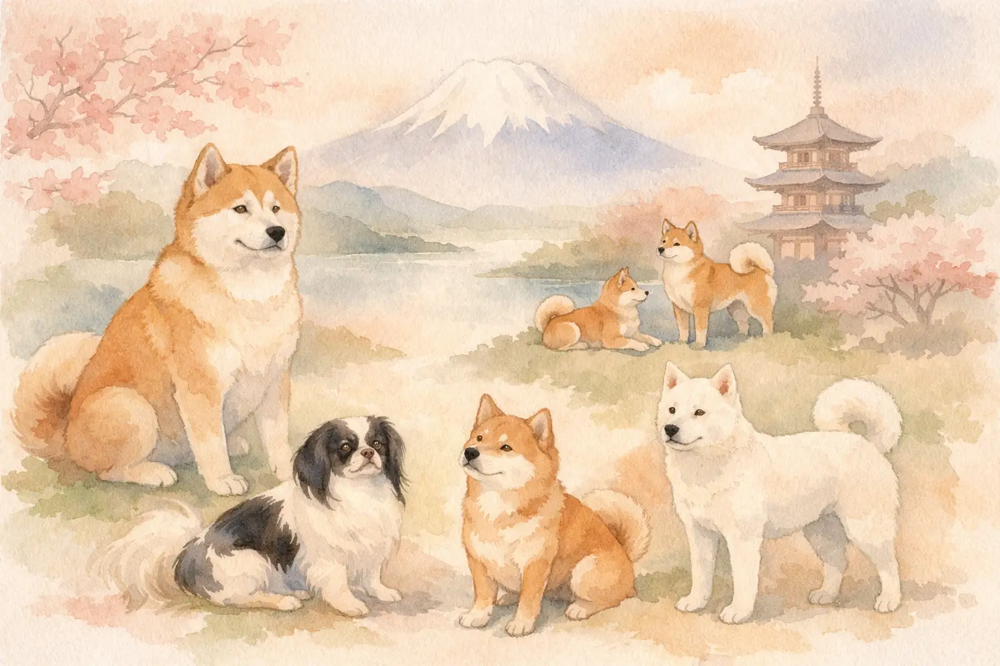
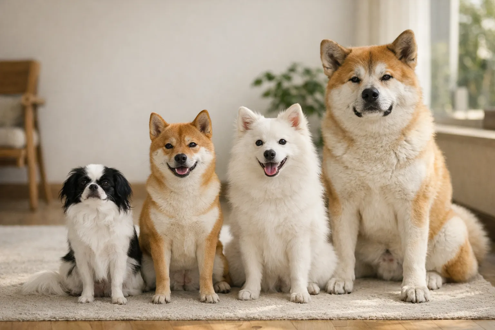
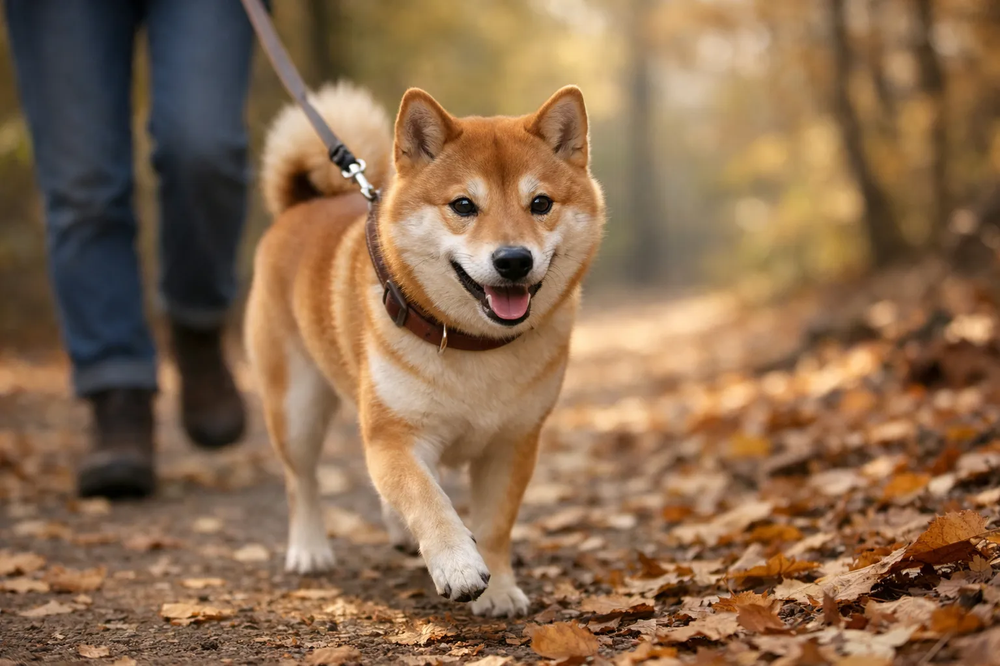

Japanische Hunderassen gehören zu den ältesten und faszinierendsten Hunderassen der Welt. Vom imposanten Akita Inu über den beliebten Shiba Inu bis zum seltenen Kai Ken -- diese Hunde verbindet eine jahrtausendealte Geschichte als Jagd-, Wach- und Begleithunde in Japan. Sechs von ihnen tragen den offiziellen Status als japanisches Naturdenkmal.

Ob du einen großen, loyalen Beschützer oder einen kleinen, eigenständigen Begleiter suchst: Japanische Hunderassen bieten für verschiedene Lebenssituationen die passende Wahl. In diesem Ratgeber erfährst du alles über Charakter, Größe, Haltungsanforderungen und Besonderheiten aller japanischen Hunderassen -- inklusive einer vollständigen Übersicht mit Vergleichstabelle.

Zusammenfassung: Japanische Hunderassen

<ul>
<li><strong>6 Nihon Ken</strong> -- Akita, Shiba, Kishu, Shikoku, Hokkaido und Kai Ken sind als japanisches Naturdenkmal geschützt</li>
<li><strong>Shiba Inu</strong> -- Die beliebteste japanische Hunderasse weltweit mit 35–41 cm Schulterhöhe</li>
<li><strong>Akita Inu</strong> -- Der größte japanische Spitz mit bis zu 70 cm und 45 kg Körpergewicht</li>
<li><strong>Eigenständiger Charakter</strong> -- Die meisten japanischen Hunderassen sind selbstbewusst und keine klassischen Anfängerhunde</li>
<li><strong>Spitz-Typ</strong> -- Fast alle japanischen Hunde gehören zur FCI-Gruppe 5 (Spitze und Hunde vom Urtyp)</li>
</ul>

11

Japanische Rassen (FCI)

6

Nihon Ken (Naturdenkmal)

3.000+

Jahre Zuchtgeschichte

2–70 cm

Größenspanne

## Geschichte der japanischen Hunderassen

Japanische Hunderassen zählen zu den ältesten domestizierten Hunden der Welt. Archäologische Funde belegen, dass bereits vor über 3.000 Jahren Hunde vom Spitz-Typ auf den japanischen Inseln lebten. Diese Ur-Hunde kamen vermutlich mit den Jōmon-Menschen über Landbrücken vom asiatischen Festland nach Japan.

### Die Nihon Ken -- Japans Naturdenkmal

Die sechs ursprünglichen japanischen Hunderassen werden als *Nihon Ken* (日本犬) bezeichnet. Die Organisation NIPPO (Nihon Ken Hozonkai) wurde 1928 gegründet, um diese Rassen vor dem Aussterben zu bewahren. Zwischen 1931 und 1937 erhielten alle sechs Rassen den Status als japanisches Naturdenkmal (*Tennen Kinenbutsu*).

| Rasse | Naturdenkmal seit | Ursprungsregion |
|---|---|---|
| Akita Inu | 1931 | Präfektur Akita (Norden) |
| Kishu Ken | 1934 | Präfektur Wakayama |
| Kai Ken | 1934 | Präfektur Yamanashi |
| Shikoku Ken | 1937 | Insel Shikoku |
| Hokkaido Inu | 1937 | Insel Hokkaido |
| Shiba Inu | 1936 | Gesamtjapan |

### Bedrohung und Wiederaufbau

Der Zweite Weltkrieg brachte die meisten japanischen Hunderassen an den Rand des Aussterbens. Nahrungsmittelknappheit, Fellbeschlagnahmungen für Militärkleidung und Kreuzungen mit westlichen Rassen dezimierten die Bestände dramatisch. Nach 1945 begannen engagierte Züchter mit systematischen Zuchtprogrammen, die auf den wenigen verbliebenen reinrassigen Hunden in abgelegenen Bergregionen aufbauten.

ℹ️

<strong>Hachikō -- Symbol japanischer Hundetreue</strong>

Der Akita Inu Hachikō wartete ab 1925 neun Jahre lang täglich am Bahnhof Shibuya auf sein verstorbenes Herrchen Professor Ueno. Seine Geschichte machte den Akita weltweit berühmt. Vor dem Bahnhof Shibuya steht bis heute eine Bronzestatue zu seinen Ehren.

## Alle japanischen Hunderassen im Überblick

Die folgende Tabelle zeigt alle von der FCI anerkannten japanischen Hunderassen mit ihren wichtigsten Merkmalen. Diese Übersicht hilft dir, die passende japanische Hunderasse für deine Lebenssituation zu finden.

| Rasse | Größe (cm) | Gewicht (kg) | FCI-Gruppe | Typ |
|---|---|---|---|---|
| Akita Inu | 58–70 | 23–45 | 5 | Groß |
| American Akita | 61–71 | 32–60 | 5 | Groß |
| Shiba Inu | 35–41 | 8–13 | 5 | Klein-Mittel |
| Tosa Inu | 55–60+ | 36–61 | 2 | Groß |
| Kishu Ken | 43–55 | 14–27 | 5 | Mittel |
| Shikoku Ken | 46–55 | 16–26 | 5 | Mittel |
| Hokkaido Inu | 46–53 | 20–30 | 5 | Mittel |
| Kai Ken | 45–53 | 14–18 | 5 | Mittel |
| Japan Chin | 20–27 | 2–5 | 9 | Klein |
| Japanischer Spitz | 28–38 | 5–10 | 5 | Klein |
| Japanischer Terrier | 30–33 | 5–6 | 3 | Klein |

## Akita Inu -- Der majestätische Wächter

Der Akita Inu ist die bekannteste große japanische Hunderasse und stammt aus der gleichnamigen Präfektur im Norden Japans. Mit einer Schulterhöhe von 64 bis 70 cm bei Rüden und einem Gewicht von bis zu 45 kg ist der Akita ein imposanter Hund mit würdevoller Ausstrahlung.

### Charakter und Wesen des Akita

Akita Inu sind ruhig, selbstbewusst und ihrem Besitzer treu ergeben. Sie zeigen eine ausgeprägte Eigenständigkeit und treffen gerne eigene Entscheidungen -- eine Eigenschaft, die sie mit den meisten japanischen Hunderassen teilen. Gegenüber Fremden verhalten sich Akitas reserviert bis distanziert.

Die Haltung eines Akita Inu erfordert Hundeerfahrung und konsequente, aber respektvolle Erziehung. Laut VDH ist diese Hunderasse nicht für Anfänger geeignet. Akitas neigen zu Dominanzverhalten gegenüber anderen Hunden, insbesondere gleichgeschlechtlichen Artgenossen.

⚠️

<strong>Akita und andere Hunde</strong>

Akita Inu zeigen häufig eine geringe Verträglichkeit mit anderen Hunden, besonders mit gleichgeschlechtlichen Artgenossen. Eine frühe und umfangreiche Sozialisierung ab dem Welpenalter ist entscheidend. Trotzdem bleibt die Einzelhaltung für viele Akitas die stressfreiere Option.

### Haltung und Pflege

Der Akita Inu benötigt täglich 1,5 bis 2 Stunden Bewegung, bevorzugt in Form ausgedehnter Spaziergänge. Sein dichtes, doppellagiges Fell sollte 2- bis 3-mal pro Woche gebürstet werden. Während des Fellwechsels im Frühjahr und Herbst ist tägliches Bürsten notwendig -- Tipps dazu findest du in unserem [Fellpflege-Ratgeber](https://hundewissen-mit-kopf.de/hundepflege/fellpflege-hund/).

Typische Gesundheitsprobleme beim Akita Inu umfassen Autoimmunerkrankungen (Sebadenitis, Pemphigus), Hüftgelenksdysplasie (HD) und Schilddrüsenunterfunktion. Die durchschnittliche Lebenserwartung liegt bei 10 bis 13 Jahren.

## Akita Inu vs. American Akita -- Die Unterschiede

Seit dem Jahr 2000 führt die FCI den japanischen Akita Inu und den American Akita als zwei getrennte Rassen. Viele Hundeinteressierte verwechseln die beiden Typen, obwohl sie sich in mehreren Punkten deutlich unterscheiden.

| Merkmal | Akita Inu (japanisch) | American Akita |
|---|---|---|
| Kopfform | Fuchsartig, schmal | Bärenartig, breit |
| Gewicht (Rüde) | 32–45 kg | 45–60 kg |
| Schulterhöhe | 64–70 cm | 66–71 cm |
| Fellfarben | Rot, sesam, weiß, brindle | Alle Farben erlaubt |
| Gesichtsmaske | Keine schwarze Maske | Schwarze Maske typisch |
| Körperbau | Eleganter, leichter | Massiger, schwerer |

Akita Inu (japanisch)

<ul>
<li>Eleganterer, leichterer Körperbau</li>
<li>Weniger Farbvarianten -- einheitlicheres Erscheinungsbild</li>
<li>Etwas weniger Gewicht erleichtert die Handhabung</li>
<li>Engere genetische Basis -- reinere Zuchtlinie</li>
</ul>

American Akita

<ul>
<li>Massiger und imposanter im Erscheinungsbild</li>
<li>Breitere Farbpalette -- mehr Auswahl</li>
<li>Oft ruhiger und gelassener im Wesen</li>
<li>Tendenziell etwas robustere Gesundheit</li>
</ul>

Der American Akita entstand nach dem Zweiten Weltkrieg, als US-Soldaten Akitas nach Amerika brachten und dort mit größeren Rassen kreuzten. Beide Varianten sind eigenständige, loyale Hunde, die erfahrene Halter benötigen.

## Shiba Inu -- Der beliebte japanische Begleithund

Der Shiba Inu ist die weltweit beliebteste japanische Hunderasse und gleichzeitig die älteste der sechs Nihon-Ken-Rassen. Mit einer Schulterhöhe von 35 bis 41 cm und einem Gewicht von 8 bis 13 kg gehört der Shiba zu den kleineren japanischen Hunden -- ist aber keineswegs ein typischer kleiner Hund.

### Charakter: Katze im Hundekörper

Der Shiba wird oft als "Katze unter den Hunden" bezeichnet. Dieses Bild trifft den Charakter erstaunlich gut: Shibas sind reinlich, unabhängig, eigensinnig und zeigen ihren Besitzern Zuneigung auf ihre eigene, subtile Art. Sie putzen sich ausgiebig, meiden Pfützen und halten ihr Fell penibel sauber.

Gleichzeitig besitzt der Shiba Inu einen ausgeprägten Jagdtrieb, der das Freilauftraining zur echten Herausforderung macht. Viele Shiba-Halter berichten, dass ein zuverlässiger Rückruf nur mit intensivem, langfristigem Training möglich ist. Wer einen [leicht erziehbaren Anfängerhund](https://hundewissen-mit-kopf.de/hunderassen/hunderasse-fuer-anfaenger/) sucht, sollte sich daher andere Rassen ansehen.

📖

Definition: Shiba-Schrei (Shiba Scream)

Der Shiba-Schrei ist ein charakteristisches, durchdringendes Kreischen, das Shiba Inu bei starker Aufregung, Freude oder Protest von sich geben. Dieses Lautäußerungsmuster ist rassetypisch und kein Zeichen von Schmerz oder Angst.

### Shiba Inu: Haltung im Alltag

Shibas benötigen täglich 1 bis 1,5 Stunden Bewegung und geistige Beschäftigung. Ihr dichtes Doppelfell erfordert wöchentliches Bürsten -- während des zweimal jährlichen Fellwechsels deutlich häufiger. Die Lebenserwartung liegt bei 12 bis 15 Jahren, was den Shiba zu einer langlebigen Hunderasse macht.

Häufige Gesundheitsprobleme beim Shiba Inu sind Patellaluxation (Kniescheibenverlagerung), Allergien und Augenkrankheiten wie Glaukom. Seriöse Züchter testen ihre Zuchttiere auf diese Erkrankungen. Ein Shiba-Welpe von einem VDH-Züchter kostet zwischen 1.500 und 2.500 Euro.

## Tosa Inu -- Der japanische Molosserhund

Der Tosa Inu ist die einzige japanische Hunderasse, die nicht zum Spitz-Typ gehört. Er wurde im 19. Jahrhundert in der Präfektur Tosa (heute Kōchi) als Kampfhund gezüchtet, indem einheimische Shikoku-Hunde mit westlichen Rassen wie Bulldogge, Mastiff und Deutscher Dogge gekreuzt wurden.

### Größe und Erscheinung

Tosa Inu erreichen eine Schulterhöhe von mindestens 55 cm (Hündinnen) bis über 60 cm (Rüden) und wiegen zwischen 36 und 61 kg. Einige Exemplare aus japanischen Zuchtlinien können sogar über 80 kg wiegen. Der Tosa hat ein kurzes, dichtes Fell in den Farben Rot, Fawn, Apricot, Schwarz oder Brindle.

🚫

<strong>Rasseliste beachten: Tosa Inu in Deutschland</strong>

Der Tosa Inu steht in mehreren deutschen Bundesländern auf der Rasseliste (Kategorie 1 oder 2). In Bayern, Hessen, Brandenburg, Hamburg und Nordrhein-Westfalen gelten besondere Auflagen wie Leinen- und Maulkorbpflicht, Sachkundenachweis und Wesenstest. Informiere dich vor der Anschaffung unbedingt bei deiner zuständigen Ordnungsbehörde.

### Charakter des Tosa

Trotz seiner Kampfhund-Geschichte ist der Tosa Inu im Familienumfeld ruhig, geduldig und sensibel. Er bindet sich stark an seine Bezugspersonen und zeigt eine hohe Reizschwelle. Die Erziehung erfordert jedoch absolute Konsequenz und Hundeerfahrung. Gegenüber anderen Hunden kann der Tosa dominant reagieren.

## Japanischer Spitz -- Der weiße Familienhund

Der Japanische Spitz (*Nihon Supittsu*) ist ein kompakter, fröhlicher Begleithund mit reinweißem, üppigem Fell. Mit einer Schulterhöhe von 28 bis 38 cm und einem Gewicht von 5 bis 10 kg gehört er zu den kleinen japanischen Hunderassen.

Im Gegensatz zu den meisten anderen japanischen Hunden ist der Japanische Spitz ausgesprochen menschenbezogen, lernfreudig und vergleichsweise einfach zu erziehen. Er eignet sich gut als Familienhund und kommt auch mit Kindern zurecht. Sein dichtes weißes Fell hat eine schmutzabweisende Textur und benötigt 2- bis 3-mal wöchentliches Bürsten.

💡

<strong>Japanischer Spitz für Allergiker?</strong>

Obwohl kein Hund komplett hypoallergen ist, produziert der Japanische Spitz vergleichsweise wenig Hautschuppen. Sein Fell hat zudem keinen typischen Hundegeruch. Für Allergiker empfiehlt sich dennoch ein Probekontakt vor der Anschaffung.

## Japan Chin -- Die kleinste japanische Hunderasse

Der Japan Chin (auch Japanischer Chin oder *Chin*) ist mit 20 bis 27 cm Schulterhöhe und 2 bis 5 kg Gewicht die kleinste japanische Hunderasse. Er ist die einzige japanische Rasse in der FCI-Gruppe 9 (Gesellschafts- und Begleithunde) und unterscheidet sich damit grundlegend von den Spitz-Typen.

Der Japan Chin war über Jahrhunderte der Lieblingshund des japanischen Kaiserhauses. Sein seidiges, langes Fell, die großen Augen und das flache Gesicht verleihen ihm ein elegantes Erscheinungsbild. Charakterlich ist der Chin anhänglich, ruhig und sensibel -- er reagiert stark auf die Stimmung seiner Bezugsperson.

Wer nach einer [kleinen Hunderasse](https://hundewissen-mit-kopf.de/hunderassen/kleine-hunderassen/) sucht, findet im Japan Chin einen charmanten, pflegeleichten Begleiter. Sein Bewegungsbedarf ist mit 30 bis 60 Minuten täglich moderat, was ihn auch für Senioren und Wohnungshaltung geeignet macht.

## Die mittleren Nihon Ken: Kishu, Shikoku, Hokkaido und Kai Ken

Neben Akita und Shiba gibt es vier weitere ursprüngliche japanische Hunderassen, die außerhalb Japans kaum bekannt sind. Diese mittleren Nihon Ken wiegen zwischen 14 und 30 kg und wurden als Jagdhunde in den bergigen Regionen Japans gezüchtet.

🏔️

Kishu Ken

43–55 cm, 14–27 kg. Ruhiger, treuer Jagdhund aus der Region Wakayama. Meist reinweiß. Sehr selten außerhalb Japans.

🐺

Shikoku Ken

46–55 cm, 16–26 kg. Wolfsähnliches Erscheinungsbild. Energiegeladener Jagdhund von der Insel Shikoku. Sesam- oder brindle-farben.

❄️

Hokkaido Inu

46–53 cm, 20–30 kg. Robuster, kälteresistenter Hund von der Nordinsel. Mutig genug für die Bärenjagd. Auch als Ainu-Hund bekannt.

🐯

Kai Ken

45–53 cm, 14–18 kg. Einzigartige gestromte Fellzeichnung (brindle). Gilt als die reinrassigste aller Nihon-Ken-Rassen.

### Verfügbarkeit in Deutschland

Diese vier mittleren japanischen Hunderassen sind in Deutschland extrem selten. Jährlich werden nur wenige Welpen von registrierten Züchtern abgegeben. Wartezeiten von 1 bis 3 Jahren sind üblich. Die meisten seriösen Züchter befinden sich in Japan, Finnland oder den USA. Ein Import ist möglich, erfordert aber Geduld und kostet inklusive Transport zwischen 3.000 und 5.000 Euro.

| Rasse | Geschätzte Anzahl in Deutschland | Wartezeit (Welpe) |
|---|---|---|
| Kishu Ken | Unter 20 | 2–3 Jahre |
| Shikoku Ken | Ca. 50–80 | 1–2 Jahre |
| Hokkaido Inu | Unter 30 | 2–3 Jahre |
| Kai Ken | Unter 10 | 2–4 Jahre |

## Japanische Hunderassen: Groß vs. Klein

Japanische Hunderassen decken ein breites Größenspektrum ab -- vom 2 kg leichten Japan Chin bis zum über 60 kg schweren Tosa Inu. Die Wahl der richtigen Größe hängt von Wohnsituation, Erfahrung und Lebensstil ab.

### Große japanische Hunderassen

Zu den großen japanischen Hunderassen zählen der Akita Inu, der American Akita und der Tosa Inu. Alle drei wiegen über 30 kg und benötigen viel Platz, Auslauf und einen erfahrenen Halter. Ein Haus mit Garten ist für diese Rassen empfehlenswert.

### Kleine japanische Hunderassen

Der Japan Chin, der Japanische Spitz und der Japanische Terrier eignen sich auch für die Wohnungshaltung. Sie benötigen weniger Auslauf und sind in der Regel einfacher zu handhaben. Der Shiba Inu liegt größenmäßig dazwischen, hat aber den Charakter eines großen Hundes in kompaktem Körper.

💡

<strong>Japanische Hunderasse für die Wohnung</strong>

Für die Wohnungshaltung eignen sich Japan Chin und Japanischer Spitz am besten. Beide Rassen haben einen moderaten Bewegungsbedarf von 30 bis 60 Minuten täglich und bellen weniger als viele andere kleine Hunderassen. Der Shiba Inu kann ebenfalls in einer Wohnung leben, braucht aber deutlich mehr Beschäftigung.

## Erziehung japanischer Hunderassen

Die Erziehung japanischer Hunderassen unterscheidet sich grundlegend von der Arbeit mit europäischen Gebrauchshunden wie Schäferhund oder Labrador. Japanische Hunde wurden über Jahrtausende als eigenständige Jagdhunde gezüchtet, die selbstständig Entscheidungen treffen mussten. Diese genetische Prägung zeigt sich bis heute im Verhalten.

### Typische Erziehungsherausforderungen

Die meisten japanischen Hunderassen zeigen folgende Charaktereigenschaften, die das Training beeinflussen:

- **Eigenständigkeit:** Japanische Hunde hinterfragen Kommandos und gehorchen nicht blind
- **Starker Jagdtrieb:** Besonders Shiba, Kishu und Shikoku haben einen ausgeprägten Beutetrieb
- **Geringe Unterwürfigkeit:** "Will to please" ist bei japanischen Rassen kaum vorhanden
- **Sensibilität:** Harte Korrekturen führen zu Vertrauensverlust und Verweigerung
- **Territorialverhalten:** Akita und Tosa zeigen ausgeprägtes Schutzverhalten

1

Frühe Sozialisierung

Ab der 8. Lebenswoche systematisch an Menschen, Hunde, Geräusche und Umgebungen gewöhnen. Besonders bei Akita und Tosa entscheidend.

2

Positive Verstärkung

Ausschließlich mit Belohnung arbeiten. Japanische Hunde reagieren auf Druck mit Sturheit oder Rückzug. Leckerlis und Spielzeug als Motivation nutzen.

3

Konsequenz ohne Härte

Regeln klar definieren und konsequent einhalten. Inkonsequenz wird von japanischen Hunden sofort erkannt und ausgenutzt.

✓

Geduld bewahren

Japanische Hunde lernen in ihrem eigenen Tempo. Fortschritte kommen oft in Schüben. Die Bindung zum Halter wächst über Monate und Jahre.

Grundlegende [Kommandos für Hunde](https://hundewissen-mit-kopf.de/erziehung-verhalten/kommandos-hund/) solltest du mit deinem japanischen Hund von Anfang an üben -- allerdings mit der Erwartung, dass der Lernprozess länger dauern kann als bei kooperativeren Rassen.

## Gesundheit und Lebenserwartung

Japanische Hunderassen gelten insgesamt als robust und langlebig. Die ursprünglichen Nihon Ken profitieren von einer vergleichsweise breiten genetischen Basis und jahrhundertelanger natürlicher Selektion in den rauen Bergregionen Japans.

| Rasse | Lebenserwartung | Häufige Gesundheitsprobleme |
|---|---|---|
| Akita Inu | 10–13 Jahre | Autoimmunerkrankungen, HD, Schilddrüse |
| American Akita | 10–13 Jahre | HD, Magendrehung, Augenkrankheiten |
| Shiba Inu | 12–15 Jahre | Patellaluxation, Allergien, Glaukom |
| Tosa Inu | 10–12 Jahre | HD, Magendrehung, Herzerkrankungen |
| Japan Chin | 12–14 Jahre | Patellaluxation, Herzfehler, Atemprobleme |
| Japanischer Spitz | 12–16 Jahre | Patellaluxation, Augenprobleme |
| Hokkaido Inu | 12–15 Jahre | HD, Collie-Eye-Anomalie |
| Shikoku Ken | 10–12 Jahre | HD, Allergien |

⚠️

<strong>Autoimmunerkrankungen beim Akita</strong>

Akita Inu sind überdurchschnittlich anfällig für Autoimmunerkrankungen wie Sebadenitis (Talgdrüsenentzündung) und VKH-Syndrom (Vogt-Koyanagi-Harada). Laut tierärztlichen Fachgesellschaften treten diese Erkrankungen bei bis zu 10% der Akita-Population auf. Regelmäßige Vorsorgeuntersuchungen beim Tierarzt sind daher besonders wichtig.

## Japanische Hunderassen kaufen: Darauf musst du achten

Die Anschaffung einer japanischen Hunderasse erfordert sorgfältige Planung. Seriöse Züchter sind bei den seltenen Rassen rar, und die Nachfrage übersteigt oft das Angebot. Besonders bei Shiba Inu und Akita Inu ist die Gefahr unseriöser Vermehrung in den letzten Jahren gestiegen.

### Preise für japanische Hunderassen (Stand 2025)

| Rasse | Preis (VDH-Züchter) | Wartezeit |
|---|---|---|
| Shiba Inu | 1.500–2.500 € | 3–12 Monate |
| Akita Inu | 1.500–2.500 € | 6–12 Monate |
| American Akita | 1.200–2.000 € | 3–9 Monate |
| Japan Chin | 1.200–1.800 € | 6–12 Monate |
| Japanischer Spitz | 1.000–1.800 € | 3–9 Monate |
| Tosa Inu | 1.500–3.000 € | 6–18 Monate |

✅ Checkliste: Seriösen Züchter erkennen

✓

VDH- oder FCI-Mitgliedschaft nachweisbar

✓

Gesundheitsuntersuchungen der Elterntiere (HD, Augen, Patella)

✓

Welpen wachsen im Haus mit Familienanschluss auf

✓

Züchter stellt Fragen zu deiner Lebenssituation

✓

Besichtigung der Zuchtstätte jederzeit möglich

Welpen ohne Papiere oder "zum Sonderpreis" -- Finger weg!

## Welche japanische Hunderasse passt zu mir?

Die Wahl der richtigen japanischen Hunderasse hängt von deiner Erfahrung, deinem Lebensstil und deinen Erwartungen ab. Nicht jede Rasse passt zu jedem Halter -- die folgende Entscheidungshilfe gibt dir eine Orientierung.

🏠

Für Familien

Japanischer Spitz oder Japan Chin. Beide sind menschenbezogen, geduldig mit Kindern und vergleichsweise einfach zu erziehen.

🏃

Für Aktive

Shiba Inu oder Hokkaido Inu. Ausdauernde Begleiter für Wanderungen und Outdoor-Aktivitäten mit eigenständigem Charakter.

🛡️

Für Erfahrene

Akita Inu oder American Akita. Loyale, imposante Hunde, die einen souveränen Halter mit Hundeerfahrung benötigen.

🏢

Für die Wohnung

Japan Chin oder Japanischer Spitz. Kompakte Größe, moderater Bewegungsbedarf und ruhiges Wesen machen sie wohnungstauglich.

## Japanische Hunderassen und die Fellpflege

Fast alle japanischen Hunderassen besitzen ein dichtes Doppelfell mit weicher Unterwolle und harschem Deckhaar. Dieses Fell schützt vor Kälte, Nässe und Hitze -- erfordert aber regelmäßige Pflege, besonders während des Fellwechsels.

Der Fellwechsel findet bei japanischen Spitz-Rassen zweimal jährlich statt und ist intensiv. Während dieser 2 bis 4 Wochen verlieren Akita, Shiba und Co. große Mengen Unterwolle. Tägliches Bürsten mit einer Unterwoollbürste ist in dieser Phase Pflicht. Außerhalb des Fellwechsels reicht 1- bis 2-maliges Bürsten pro Woche.

Japanische Hunde sollten nur selten gebadet werden -- ihr Fell hat eine natürliche Selbstreinigungsfunktion. Zu häufiges [Baden des Hundes](https://hundewissen-mit-kopf.de/hundepflege/hund-baden/) zerstört die schützende Fettschicht der Haut und kann zu Hautproblemen führen. Laut Tierärzten reichen 2 bis 4 Bäder pro Jahr bei den meisten japanischen Rassen aus.

✅

<strong>Selbstreinigendes Fell</strong>

Das Fell japanischer Spitz-Rassen hat eine besondere Textur, die Schmutz nach dem Trocknen leicht abfallen lässt. Shiba Inu sind bekannt dafür, sich wie Katzen selbst zu putzen. Oft reicht es, getrockneten Schmutz einfach auszubürsten, statt den Hund zu baden.

## Fazit: Japanische Hunderassen -- Faszinierende Begleiter mit Charakter

Japanische Hunderassen sind keine Hunde für jedermann -- aber für den richtigen Halter die perfekte Wahl. Von der majestätischen Ruhe des Akita Inu über die eigenwillige Cleverness des Shiba Inu bis zur zierlichen Eleganz des Japan Chin bieten japanische Hunderassen eine beeindruckende Vielfalt.

Alle japanischen Hunderassen verbindet ein eigenständiger, selbstbewusster Charakter, der Respekt und Geduld in der Erziehung erfordert. Wer bereit ist, sich auf diese besondere Mensch-Hund-Beziehung einzulassen, wird mit einer tiefen, loyalen Bindung belohnt.

Informiere dich gründlich über die spezifischen Anforderungen deiner Wunschrasse, suche einen seriösen Züchter und plane ausreichend Zeit für Sozialisierung und Training ein. Dann steht einem glücklichen Leben mit deinem japanischen Hund nichts im Weg. Passende [Hundenamen](https://hundewissen-mit-kopf.de/hunderassen/hundenamen/) für deinen neuen Begleiter findest du ebenfalls bei uns.