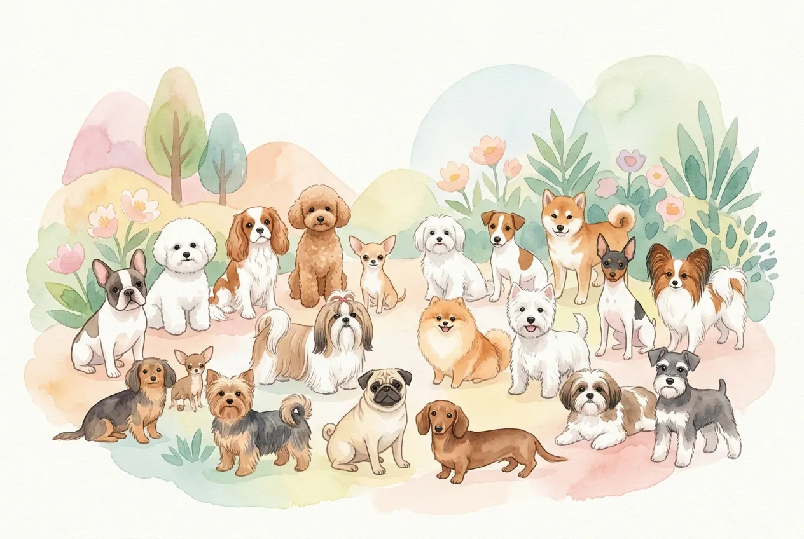
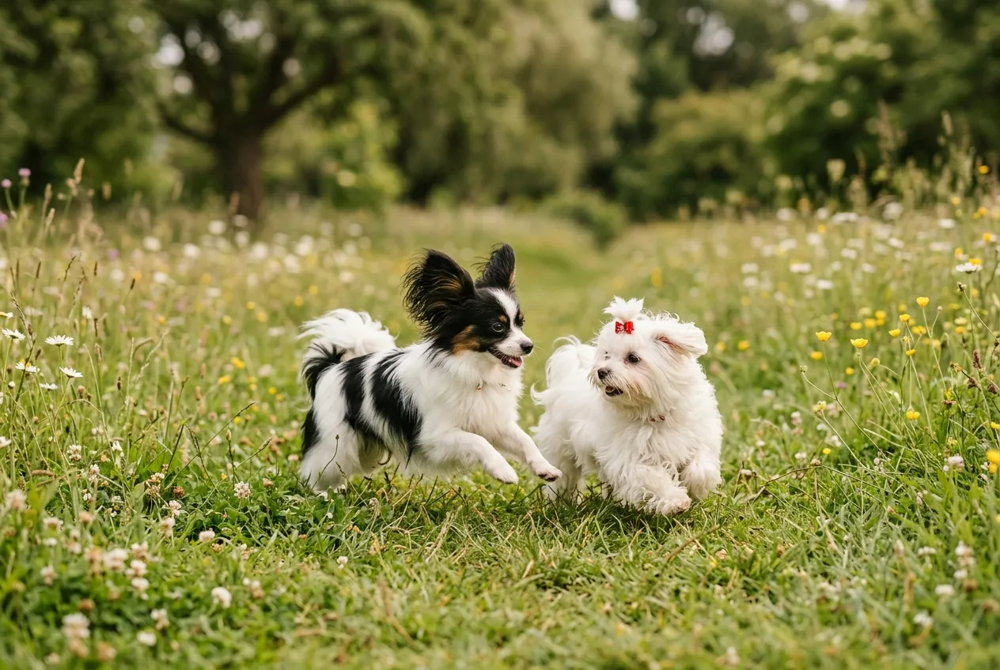
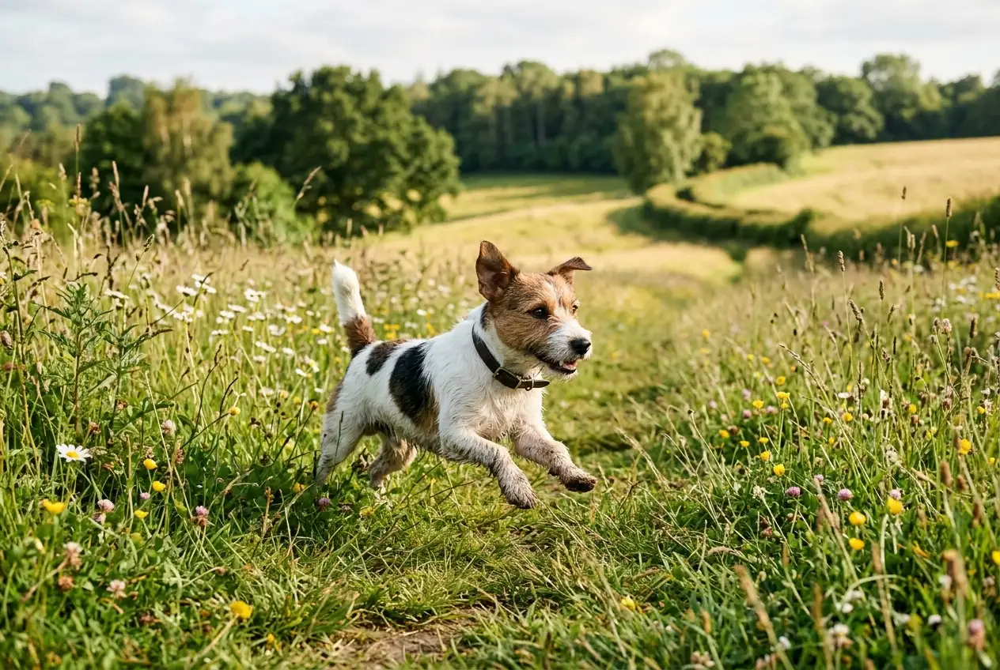

Kleine Hunderassen wiegen unter 10 kg, leben im Schnitt 12 bis 16 Jahre und passen mit ihrer kompakten Größe in nahezu jede Wohnung. Ob flauschiger Zwergspitz, sportlicher Jack Russell Terrier oder ruhiger Cavalier King Charles Spaniel -- unter den kleinen Hunderassen findet sich für jeden Lebensstil der passende Begleiter.

In diesem Ratgeber stellen wir dir die 20 beliebtesten kleinen Hunderassen im Detail vor. Du erfährst, welche Rassen sich für Anfänger eignen, welche nicht haaren und worauf du bei Gesundheit, Erziehung und Pflege achten solltest.

Zusammenfassung: Kleine Hunderassen bis 10 kg

<ul>
<li><strong>Lebenserwartung</strong> -- Kleine Hunderassen werden durchschnittlich 12–16 Jahre alt, einzelne Rassen wie der Chihuahua sogar bis zu 20 Jahre</li>
<li><strong>Ideal für Wohnungen</strong> -- Mit einer Schulterhöhe von 15–40 cm und unter 10 kg Gewicht eignen sich kleine Hunde besonders für Stadtwohnungen</li>
<li><strong>Wenig Haarverlust möglich</strong> -- Malteser, Havaneser, Zwergpudel und Yorkshire Terrier haaren kaum und sind für Allergiker interessant</li>
<li><strong>Anfängerfreundliche Rassen</strong> -- Cavalier King Charles Spaniel, Malteser und Bichon Frisé gelten als besonders leicht erziehbar</li>
<li><strong>Auslauf variiert stark</strong> -- Je nach Rasse benötigen kleine Hunde zwischen 30 und 90 Minuten Bewegung täglich</li>
</ul>

20

Beliebte Rassen bis 10 kg

12–16 J.

Ø Lebenserwartung

15–40 cm

Schulterhöhe

30–90 Min.

Auslauf pro Tag

## Was zählt als kleine Hunderasse?

Als kleine Hunderassen gelten laut FCI und VDH alle Rassen mit einem Erwachsenengewicht unter 10 kg und einer Schulterhöhe von maximal 40 cm. Innerhalb dieser Kategorie unterscheiden Züchter und Kynologen nochmals zwischen sehr kleinen Hunderassen bis 5 kg und Rassen im Bereich von 5 bis 10 kg.

Die Einteilung nach Gewicht ist praxisrelevant: Sie beeinflusst Futtermenge, Medikamentendosierung und die Wahl der passenden Ausstattung. Ein Chihuahua mit 2 kg hat völlig andere Bedürfnisse als ein Jack Russell Terrier mit 8 kg -- obwohl beide zu den kleinen Hunderassen zählen.

### Sehr kleine Hunderassen bis 5 kg

Hunde unter 5 kg werden häufig als Toy- oder Zwergrassen bezeichnet. Dazu gehören Chihuahua, Zwergspitz, Yorkshire Terrier und Papillon. Diese sehr kleinen Hunderassen sind besonders empfindlich gegenüber Kälte und Verletzungen. Ein [gut sitzender Hundemantel](https://hundewissen-mit-kopf.de/hundeausstattung/braucht-hund-einen-mantel/) ist im Winter für sie unverzichtbar.

### Kleine Hunderassen von 5 bis 10 kg

Rassen zwischen 5 und 10 kg sind robuster und vielseitiger einsetzbar. Cavalier King Charles Spaniel, Shih Tzu und Dackel fallen in diese Kategorie. Sie eignen sich sowohl für Familien als auch für aktive Singles und kommen mit moderatem Auslauf gut zurecht.

## Übersicht: Die 20 beliebtesten kleinen Hunderassen

Die folgende Tabelle zeigt alle 20 Rassen im Schnellüberblick. Detaillierte Steckbriefe findest du in den nachfolgenden Abschnitten.

| Rasse | Gewicht | Schulterhöhe | Lebenserwartung | Haarverlust |
|---|---|---|---|---|
| Chihuahua | 1,5–3 kg | 15–23 cm | 14–20 Jahre | Gering |
| Zwergspitz (Pomeranian) | 1,8–3,5 kg | 18–22 cm | 12–16 Jahre | Hoch |
| Yorkshire Terrier | 2–3,2 kg | 18–23 cm | 13–16 Jahre | Sehr gering |
| Malteser | 3–4 kg | 20–25 cm | 12–15 Jahre | Sehr gering |
| Papillon | 3–5 kg | 20–28 cm | 13–16 Jahre | Gering |
| Havaneser | 4–7 kg | 23–27 cm | 13–15 Jahre | Sehr gering |
| Zwergpudel | 4–6 kg | 24–28 cm | 12–15 Jahre | Sehr gering |
| Bichon Frisé | 3–5 kg | 23–30 cm | 12–15 Jahre | Sehr gering |
| Cavalier King Charles Spaniel | 5–8 kg | 30–33 cm | 9–14 Jahre | Mittel |
| Mops | 6–8 kg | 25–33 cm | 12–15 Jahre | Hoch |
| Shih Tzu | 4–7 kg | 20–28 cm | 10–16 Jahre | Sehr gering |
| Dackel (Zwerg) | 3–5 kg | 13–21 cm | 12–16 Jahre | Gering |
| Jack Russell Terrier | 5–8 kg | 25–30 cm | 13–16 Jahre | Mittel |
| Französische Bulldogge | 8–10 kg | 24–35 cm | 10–14 Jahre | Mittel |
| Bolonka Zwetna | 3–4 kg | 20–26 cm | 12–16 Jahre | Sehr gering |
| Prager Rattler | 2–3,5 kg | 20–23 cm | 12–14 Jahre | Gering |
| Miniatur Schnauzer | 5–8 kg | 30–35 cm | 12–15 Jahre | Sehr gering |
| Italienisches Windspiel | 3,5–5 kg | 32–38 cm | 12–15 Jahre | Sehr gering |
| Pekinese | 3–6 kg | 15–23 cm | 12–15 Jahre | Hoch |
| Cairn Terrier | 6–8 kg | 28–31 cm | 12–15 Jahre | Gering |

## Die 10 beliebtesten sehr kleinen Hunderassen bis 5 kg

### Chihuahua -- die kleinste Hunderasse der Welt

Der Chihuahua ist mit 1,5 bis 3 kg die kleinste anerkannte Hunderasse weltweit. Trotz seiner geringen Größe besitzt er ein ausgeprägtes Selbstbewusstsein und eine starke Bindung an seine Bezugsperson. Die Lebenserwartung liegt bei 14 bis 20 Jahren -- damit gehört der Chihuahua zu den langlebigsten Hunderassen überhaupt.

Chihuahuas gibt es in Lang- und Kurzhaar-Varianten. Die Kurzhaar-Variante ist pflegeleichter, friert aber im Winter schneller. Täglicher Auslauf von 30 bis 45 Minuten reicht für diese sehr kleine Hunderasse aus. Wichtig: Konsequente Erziehung ist trotz der Größe unverzichtbar, da Chihuahuas sonst zu übermäßigem Bellen neigen.

### Zwergspitz (Pomeranian) -- der flauschige Energieball

Der Zwergspitz wiegt 1,8 bis 3,5 kg und fällt durch sein dichtes, flauschiges Fell sofort auf. Diese süße kleine Hunderasse ist intelligent, verspielt und überraschend wachsam. Zwergspitze bellen gerne und brauchen deshalb von Anfang an ein konsequentes [Training der Grundkommandos](https://hundewissen-mit-kopf.de/erziehung-verhalten/kommandos-hund/).

Das üppige Fell des Pomeranian erfordert regelmäßige Pflege: Mindestens 3-mal pro Woche [gründliches Bürsten](https://hundewissen-mit-kopf.de/hundepflege/hund-buersten/) verhindert Verfilzungen. Der Haarverlust ist trotz des flauschigen Erscheinungsbilds relativ hoch, besonders während des Fellwechsels im Frühjahr und Herbst.

### Yorkshire Terrier -- klein, aber mutig

Der Yorkshire Terrier wiegt nur 2 bis 3,2 kg und zählt zu den kleinen Hunderassen, die nicht haaren. Sein seidiges Fell ähnelt menschlichem Haar und wächst kontinuierlich, ohne saisonal auszufallen. Damit eignet sich der Yorkie besonders für Menschen mit leichter Tierhaarallergie.

Ursprünglich wurde der Yorkshire Terrier im 19. Jahrhundert in England als Rattenfänger gezüchtet. Dieses Erbe zeigt sich in seinem mutigen, selbstbewussten Charakter. Yorkies brauchen trotz ihrer Größe 45 bis 60 Minuten Bewegung pro Tag und profitieren von geistiger Beschäftigung durch Suchspiele.

### Malteser -- der sanfte Familienhund

Der Malteser wiegt 3 bis 4 kg und gehört zu den ältesten Hunderassen der Welt -- seine Geschichte reicht über 2.000 Jahre zurück. Sein reinweißes, seidiges Fell haart kaum, muss aber täglich gebürstet werden, um Verfilzungen zu vermeiden.

Malteser gelten als eine der besten kleinen Hunderassen für Anfänger. Sie sind gutmütig, anhänglich und vertragen sich hervorragend mit Kindern und anderen Haustieren. Ihr Bewegungsbedarf ist mit 30 bis 45 Minuten pro Tag moderat. Laut VDH zählt der Malteser seit Jahren zu den beliebtesten kleinen Hunderassen in Deutschland.

### Papillon -- der elegante Athlet

Der Papillon wiegt 3 bis 5 kg und verdankt seinen Namen den schmetterlingsförmigen Ohren (französisch: papillon = Schmetterling). Diese elegante kleine Hunderasse ist überraschend sportlich und glänzt in Agility-Wettbewerben.

In Intelligenztests schneiden Papillons regelmäßig unter den Top 10 aller Hunderassen ab. Sie lernen neue Kommandos in nur 5 bis 15 Wiederholungen und eignen sich hervorragend für Tricktraining. Der Haarverlust ist gering, regelmäßiges Bürsten 2-mal pro Woche genügt.

### Bolonka Zwetna -- der farbenfrohe Begleiter

Der Bolonka Zwetna wiegt 3 bis 4 kg und stammt ursprünglich aus Russland. Sein Name bedeutet übersetzt "buntes Schoßhündchen". Diese süße kleine Hunderasse gibt es in nahezu allen Fellfarben -- von Schwarz über Braun bis Rot.

Bolonka Zwetna haaren nicht und gelten als besonders allergikerfreundlich. Ihr Wesen ist fröhlich, anhänglich und unkompliziert. Mit 30 bis 45 Minuten Auslauf pro Tag sind sie zufrieden. In Deutschland hat die Rasse in den letzten 10 Jahren stark an Beliebtheit gewonnen.

### Prager Rattler -- der leichteste Europäer

Der Prager Rattler wiegt nur 2 bis 3,5 kg und gilt als die kleinste europäische Hunderasse. Sein kurzes, glattes Fell ist extrem pflegeleicht -- einmal pro Woche Bürsten genügt. Diese sehr kleine Hunderasse ist lebhaft, intelligent und erstaunlich robust für ihre Größe.

Prager Rattler eignen sich gut für Wohnungshaltung, brauchen aber trotz ihrer Größe 45 bis 60 Minuten Bewegung und geistige Beschäftigung. Sie sind aufmerksam und wachsam, neigen bei mangelnder Erziehung jedoch zum Bellen.

### Bichon Frisé -- die weiße Wolke

Der Bichon Frisé wiegt 3 bis 5 kg und besticht durch sein lockiges, schneeweißes Fell. Wie der Malteser gehört er zu den kleinen Hunderassen, die nicht haaren. Abgestorbene Haare bleiben im Lockenfell hängen und müssen regelmäßig ausgebürstet werden.

Bichon Frisés sind fröhlich, gesellig und vertragen sich ausgezeichnet mit Kindern. Sie gelten als eine der besten kleinen Hunderassen für Anfänger, da sie leicht erziehbar und sehr anpassungsfähig sind. Professionelle Fellpflege alle 6 bis 8 Wochen ist empfehlenswert.

### Zwergpudel -- das Intelligenzwunder

Der Zwergpudel wiegt 4 bis 6 kg und gilt als eine der intelligentesten Hunderassen überhaupt. Sein lockiges Fell haart nicht und eignet sich daher besonders für Allergiker. Die Bezeichnung "Pudel" leitet sich vom altdeutschen "pudeln" (im Wasser planschen) ab -- Pudel waren ursprünglich Wasserhunde.

Zwergpudel lernen extrem schnell und brauchen geistige Herausforderungen, um ausgeglichen zu bleiben. Mindestens 60 Minuten Bewegung und Kopfarbeit pro Tag sind empfehlenswert. Das Fell muss alle 6 bis 8 Wochen geschoren oder [getrimmt](https://hundewissen-mit-kopf.de/hundepflege/hund-trimmen/) werden.

💡

<strong>Tipp für Allergiker</strong>

Keine Hunderasse ist zu 100 % hypoallergen. Rassen wie Malteser, Zwergpudel und Havaneser produzieren jedoch weniger Allergene und haaren kaum. Ein Probetreffen vor dem Kauf hilft, allergische Reaktionen vorab zu testen.

### Havaneser -- der kubanische Charmeur

Der Havaneser wiegt 4 bis 7 kg und ist die Nationalhunderasse Kubas. Sein langes, seidiges Fell haart kaum und macht ihn zu einer der beliebtesten süßen kleinen Hunderassen, die nicht haaren. Havaneser sind fröhlich, verspielt und extrem menschenbezogen.

Laut TASSO-Statistik gehört der Havaneser zu den am schnellsten wachsenden Rassen in Deutschland. Sein ausgeglichenes Wesen macht ihn zur idealen kleinen Hunderasse für Anfänger und Familien. Der Pflegeaufwand ist allerdings hoch: Tägliches Bürsten und regelmäßige [Fellpflege](https://hundewissen-mit-kopf.de/hundepflege/fellpflege-hund/) sind Pflicht.

## Die 10 beliebtesten kleinen Hunderassen von 5 bis 10 kg

### Cavalier King Charles Spaniel -- der Kuschel-Champion

Der Cavalier King Charles Spaniel wiegt 5 bis 8 kg und gilt als eine der ruhigsten kleinen Hunderassen. Sein sanftes, anhängliches Wesen macht ihn zum perfekten Begleithund für Familien, Senioren und Erstbesitzer. Cavaliere passen sich dem Aktivitätslevel ihrer Halter an -- ob Couchpotato oder Wanderbegleiter.

Die Lebenserwartung liegt bei 9 bis 14 Jahren. Rassetypisch sind leider Herzerkrankungen (Mitralklappeninsuffizienz), die bei bis zu 50 % aller Cavaliere im Alter auftreten. Regelmäßige tierärztliche Herzuntersuchungen ab dem 5. Lebensjahr sind daher empfehlenswert.

### Mops -- der gemütliche Komiker

Der Mops wiegt 6 bis 8 kg und ist für seinen freundlichen, humorvollen Charakter bekannt. Diese ruhige kleine Hunderasse ist genügsam, kinderlieb und kommt mit 30 bis 45 Minuten Auslauf pro Tag aus. Sein kurzes Fell ist pflegeleicht, haart allerdings überdurchschnittlich stark.

⚠️

<strong>Gesundheitshinweis: Brachyzephalie beim Mops</strong>

Viele Möpse leiden unter dem Brachyzephalen Syndrom -- Atemnot durch die verkürzte Schnauze. Achte beim Kauf unbedingt auf Züchter, die auf eine längere Nase züchten (sogenannte "Retromöpse"). Die Bundestierärztekammer warnt ausdrücklich vor Qualzuchtmerkmalen.

### Shih Tzu -- der kleine Löwe

Der Shih Tzu wiegt 4 bis 7 kg und stammt ursprünglich aus Tibet, wo er als "Löwenhund" in Klöstern gehalten wurde. Sein langes, dichtes Fell haart nicht, benötigt aber intensive tägliche Pflege. Viele Halter entscheiden sich für einen praktischen Kurzhaarschnitt ("Puppy Cut").

Shih Tzus sind ruhig, freundlich und eignen sich hervorragend als Wohnungshunde. Sie brauchen nur 30 bis 45 Minuten Bewegung pro Tag und sind damit eine ideale ruhige kleine Hunderasse. Hitze vertragen sie aufgrund ihrer kurzen Nase schlecht -- an heißen Tagen sollten Spaziergänge in die kühleren Morgen- und Abendstunden verlegt werden.

### Dackel (Zwergdackel) -- der deutsche Klassiker

Der Zwergdackel wiegt 3 bis 5 kg und gehört zu den bekanntesten deutschen Hunderassen. Trotz seiner kurzen Beine ist er ein ausdauernder Jäger mit starkem Selbstbewusstsein. Dackel gibt es in drei Fellvarianten: Kurzhaar, Rauhaar und Langhaar.

Der kurzhaarige Dackel ist die pflegeleichteste kleine Hunderasse in dieser Liste. Sein Charakter ist allerdings eigenwillig -- Dackel sind intelligent, aber stur. Konsequentes Training von Anfang an ist entscheidend. Rassetypisch sind Bandscheibenprobleme (Dackellähme), weshalb Treppensteigen und Springen vermieden werden sollten.

### Jack Russell Terrier -- der Energiebündel

Der Jack Russell Terrier wiegt 5 bis 8 kg und ist die aktivste kleine Hunderasse auf dieser Liste. Ursprünglich für die Fuchsjagd gezüchtet, braucht er mindestens 90 Minuten intensive Bewegung pro Tag. Ohne ausreichende Auslastung entwickeln Jack Russells häufig Verhaltensprobleme wie exzessives Bellen oder Zerstörungswut.

Jack Russells sind intelligent, mutig und extrem lernfähig. Sie eignen sich hervorragend für Hundesport wie Agility, Flyball oder Mantrailing. Für Erstbesitzer und ruhige Haushalte ist diese Rasse weniger geeignet -- erfahrene, aktive Halter finden im Jack Russell jedoch einen unvergleichlichen Partner.

Ruhige kleine Hunderassen

<ul>
<li>Cavalier King Charles Spaniel -- anpassungsfähig und sanft</li>
<li>Mops -- gemütlich und genügsam</li>
<li>Shih Tzu -- gelassen und freundlich</li>
<li>Malteser -- ruhig und anhänglich</li>
</ul>

Aktive kleine Hunderassen

<ul>
<li>Jack Russell Terrier -- braucht mind. 90 Min. Auslauf</li>
<li>Zwergspitz -- energiegeladen und bellfreudig</li>
<li>Papillon -- sportlich und agilitytauglich</li>
<li>Miniatur Schnauzer -- arbeitsfreudig und ausdauernd</li>
</ul>

### Französische Bulldogge -- der Stadtmensch

Die Französische Bulldogge wiegt 8 bis 10 kg und liegt damit am oberen Ende der kleinen Hunderassen bis 10 kg. Laut TASSO gehört sie seit Jahren zu den beliebtesten Hunderassen in Deutschland. Ihr kompakter Körperbau und das ruhige Wesen machen sie zum idealen Stadthund.

Wie beim Mops ist auch bei der Französischen Bulldogge die Brachyzephalie ein ernstes Gesundheitsthema. Seriöse Züchter achten auf freie Atemwege und einen längeren Nasenrücken. Die Lebenserwartung liegt bei 10 bis 14 Jahren. Bewegungsbedarf: 30 bis 45 Minuten pro Tag, bei Hitze deutlich weniger.

### Miniatur Schnauzer -- der wachsame Begleiter

Der Miniatur Schnauzer wiegt 5 bis 8 kg und vereint die Eigenschaften eines großen Hundes im kleinen Format. Er ist wachsam, intelligent und mutig -- ohne dabei aggressiv zu sein. Sein drahtiges Fell haart kaum und muss regelmäßig getrimmt werden.

Miniatur Schnauzer brauchen 60 bis 90 Minuten Bewegung und geistige Beschäftigung pro Tag. Sie eignen sich gut für aktive Familien und lernen schnell neue Kommandos. Die Rasse ist robust und hat wenige rassetypische Gesundheitsprobleme.

### Italienisches Windspiel -- der elegante Sprinter

Das Italienische Windspiel wiegt 3,5 bis 5 kg und ist die kleinste Windhundrasse. Mit einer Schulterhöhe von 32 bis 38 cm wirkt es zierlich, ist aber überraschend athletisch. Im Sprint erreicht es Geschwindigkeiten von bis zu 40 km/h.

Diese elegante kleine Hunderasse ist sensibel, anhänglich und bevorzugt warme, gemütliche Plätze. Das extrem kurze Fell bietet kaum Kälteschutz -- im Winter ist ein Hundemantel Pflicht. Italienische Windspiele sind sanft und ruhig, brauchen aber täglich die Möglichkeit zum freien Laufen.

### Pekinese -- der kaiserliche Palasthund

Der Pekinese wiegt 3 bis 6 kg und wurde jahrhundertelang am chinesischen Kaiserhof gehalten. Sein üppiges Fell und der selbstbewusste Gang verleihen ihm eine majestätische Ausstrahlung. Pekinesen sind eigenständig, würdevoll und weniger verspielt als andere kleine Hunderassen.

Das lange Fell des Pekinesen erfordert intensive Pflege: Tägliches Bürsten und regelmäßige professionelle Fellpflege sind unverzichtbar. Wie Mops und Französische Bulldogge gehört der Pekinese zu den brachyzephalen Rassen und verträgt Hitze schlecht.

### Cairn Terrier -- der robuste Schotte

Der Cairn Terrier wiegt 6 bis 8 kg und stammt aus den schottischen Highlands. Er ist robust, mutig und wetterfest -- ein echter Outdoor-Hund im kleinen Format. Sein drahtiges Fell schützt zuverlässig vor Regen und Kälte und haart nur wenig.

Cairn Terrier sind lebhaft und brauchen 60 bis 75 Minuten Bewegung pro Tag. Sie graben gerne und haben einen ausgeprägten Jagdtrieb. Für Gartenbesitzer bedeutet das: Der Zaun sollte mindestens 1,20 m hoch und am Boden gesichert sein. Mit konsequenter Erziehung ist der Cairn Terrier ein treuer, unkomplizierter Begleiter.

## Kleine Hunderassen, die nicht haaren -- Übersicht für Allergiker

Für Allergiker und Menschen, die wenig Hundehaare in der Wohnung möchten, sind kleine Hunderassen mit geringem Haarverlust besonders interessant. Rassen mit Haar statt Fell durchlaufen keinen saisonalen Fellwechsel und verteilen deutlich weniger Allergene.

| Rasse | Felltyp | Pflegeaufwand | Allergikereignung |
|---|---|---|---|
| Malteser | Seidig, lang | Hoch (tägliches Bürsten) | Sehr gut |
| Havaneser | Seidig, lang | Hoch (tägliches Bürsten) | Sehr gut |
| Zwergpudel | Lockig | Mittel (Schur alle 6–8 Wochen) | Sehr gut |
| Yorkshire Terrier | Seidig, lang | Mittel (3x/Woche Bürsten) | Gut |
| Bichon Frisé | Lockig | Hoch (tägliches Bürsten + Schur) | Sehr gut |
| Bolonka Zwetna | Wellig, lang | Mittel (3x/Woche Bürsten) | Gut |
| Miniatur Schnauzer | Drahtig | Mittel (regelmäßiges Trimmen) | Gut |
| Italienisches Windspiel | Kurz, glatt | Gering (1x/Woche Bürsten) | Mittel |

ℹ️

<strong>Hypoallergen bedeutet nicht allergenfrei</strong>

Hundeallergien werden nicht durch Haare, sondern durch das Protein Can f 1 in Speichel, Urin und Hautschuppen ausgelöst. Nicht-haarende Rassen verteilen weniger Allergene, sind aber nicht zu 100 % allergenfrei. Ein allergologischer Test vor der Anschaffung ist empfehlenswert.

## Kleine Hunderassen für Anfänger -- die besten Einsteigerrassen

Nicht jede kleine Hunderasse eignet sich gleich gut für Erstbesitzer. Anfängerfreundliche Rassen zeichnen sich durch ein gutmütiges Wesen, leichte Erziehbarkeit und eine hohe Fehlertoleranz aus. Die folgenden Rassen empfehlen Hundetrainer und der VDH besonders für [Hundeanfänger](https://hundewissen-mit-kopf.de/hunderassen/hunderasse-fuer-anfaenger/).

👑

Cavalier King Charles Spaniel

Sanft, anpassungsfähig, leicht erziehbar. Ideal für Familien und Senioren.

🤍

Malteser

Gutmütig, geduldig, wenig Auslaufbedarf. Perfekt für ruhige Haushalte.

🌺

Havaneser

Fröhlich, menschenbezogen, unkompliziert. Verzeiht typische Anfängerfehler.

☁️

Bichon Frisé

Gesellig, kinderlieb, anpassungsfähig. Kommt mit verschiedenen Lebenssituationen zurecht.

### Worauf Anfänger bei kleinen Hunden achten sollten

Kleine Hunderassen werden oft unterschätzt, was Erziehung und Konsequenz betrifft. Viele Erstbesitzer tolerieren bei kleinen Hunden Verhaltensweisen, die sie bei einem großen Hund sofort korrigieren würden -- etwa Hochspringen, Anknurren oder unkontrolliertes Bellen.

Drei Grundregeln für Anfänger mit kleinen Hunden:

1. **Konsequenz:** Regeln gelten vom ersten Tag an -- unabhängig von der Größe
2. **Sozialisation:** Kleine Hunde brauchen genauso viel Kontakt zu anderen Hunden und Menschen wie große
3. **Kein Vermenschlichen:** Ständiges Tragen und Hochheben verhindert, dass der Hund Selbstvertrauen entwickelt

## Gesundheit kleiner Hunderassen -- typische Risiken

Kleine Hunderassen leben zwar länger als große, haben aber rassetypische Gesundheitsrisiken. Laut einer Studie der Universität Göttingen (Kraus et al., 2013) altern große Hunde schneller, weil ihr beschleunigtes Wachstum die Zellalterung vorantreibt. Kleine Hunde profitieren von einem langsameren Stoffwechsel.

### Häufige Gesundheitsprobleme bei kleinen Hunden

| Gesundheitsproblem | Betroffene Rassen | Vorbeugung |
|---|---|---|
| Patellaluxation (Kniescheibe) | Chihuahua, Zwergspitz, Yorkshire Terrier | Gewicht kontrollieren, Sprünge vermeiden |
| Zahnprobleme | Fast alle kleinen Rassen | Tägliches Zähneputzen, Zahnpflege-Snacks |
| Trachealkollaps | Chihuahua, Zwergspitz, Yorkshire Terrier | Geschirr statt Halsband verwenden |
| Brachyzephales Syndrom | Mops, Franz. Bulldogge, Pekinese | Auf seriöse Zucht achten |
| Herzerkrankungen | Cavalier King Charles Spaniel | Jährliche Herzuntersuchung ab 5 Jahren |
| Bandscheibenvorfall | Dackel | Treppensteigen vermeiden, Rampen nutzen |

🚫

<strong>Achtung: Halsband-Risiko bei kleinen Hunden</strong>

Kleine Hunderassen sind besonders anfällig für Trachealkollaps (Luftröhrenverengung). Ein Halsband kann bei Zug auf die empfindliche Luftröhre drücken und das Risiko erhöhen. Tierärzte empfehlen für kleine Hunde grundsätzlich ein gut sitzendes Geschirr statt eines Halsbands.

Für die Wahl zwischen [Geschirr und Halsband](https://hundewissen-mit-kopf.de/hundeausstattung/hundegeschirr-oder-halsband/) gibt es bei kleinen Rassen eine klare Empfehlung: Das Geschirr verteilt den Druck gleichmäßig auf den Brustkorb und schont die empfindliche Halsregion.

## Ernährung kleiner Hunderassen -- das musst du wissen

Kleine Hunderassen haben einen bis zu 40 % höheren Grundumsatz pro Kilogramm Körpergewicht als große Hunde. Das bedeutet: Sie benötigen energiedichteres Futter in kleineren Portionen. Ein 3 kg schwerer Chihuahua braucht etwa 150 bis 200 kcal pro Tag, verteilt auf 2 bis 3 Mahlzeiten.

### Fütterungsempfehlung nach Gewicht

| Gewicht | Tagesbedarf (kcal) | Futtermenge (Nassfutter) | Mahlzeiten |
|---|---|---|---|
| 2–3 kg | 130–200 kcal | 100–160 g | 2–3x täglich |
| 4–5 kg | 200–300 kcal | 160–240 g | 2x täglich |
| 6–8 kg | 300–420 kcal | 240–340 g | 2x täglich |
| 8–10 kg | 400–520 kcal | 320–420 g | 2x täglich |

💡

<strong>Kleine Kroketten für kleine Mäuler</strong>

Achte bei Trockenfutter auf spezielle Small-Breed-Varianten mit kleineren Kroketten. Große Futterbrocken können für sehr kleine Hunderassen bis 5 kg zum Erstickungsrisiko werden. Die Krokettengröße sollte maximal 8 mm betragen.

Gesundes Obst und Gemüse als Snack ist auch für kleine Hunderassen eine gute Ergänzung. [Äpfel](https://hundewissen-mit-kopf.de/hundeernaehrung/duerfen-hunde-aepfel-essen/) und [Erdbeeren](https://hundewissen-mit-kopf.de/hundeernaehrung/duerfen-hunde-erdbeeren-essen/) eignen sich in kleinen Mengen als kalorienarme Belohnung.

## Pflege und Ausstattung für kleine Hunderassen

Die Pflege kleiner Hunderassen unterscheidet sich je nach Felltyp erheblich. Während ein kurzhaariger Chihuahua nur minimale Fellpflege braucht, benötigen langhaarige Rassen wie Malteser oder Shih Tzu tägliche Aufmerksamkeit.

1

Fellpflege anpassen

Kurzhaar: 1x/Woche bürsten. Langhaar: täglich bürsten. Drahthaar: alle 8–12 Wochen trimmen.

2

Zahnpflege nicht vergessen

Kleine Hunde sind besonders anfällig für Zahnstein. Tägliches Zähneputzen mit Hundezahnpasta ist ideal.

3

Krallen regelmäßig kürzen

Kleine Hunde nutzen ihre Krallen weniger ab. Alle 2–4 Wochen prüfen und bei Bedarf kürzen.

✓

Passende Ausstattung wählen

Geschirr statt Halsband, kleine Futternäpfe, angepasstes Spielzeug ohne verschluckbare Teile.

## Kleine Hunderassen im Vergleich: Kurzhaar vs. Langhaar

Die Fellstruktur beeinflusst nicht nur den Pflegeaufwand, sondern auch Allergieeignung, Kälteempfindlichkeit und das Erscheinungsbild. Kleine Hunderassen mit Kurzhaar sind pflegeleichter, haaren aber oft stärker als ihre langhaarigen Verwandten.

| Eigenschaft | Kurzhaar | Langhaar / Lockig |
|---|---|---|
| Pflegeaufwand | Gering (1x/Woche bürsten) | Hoch (täglich bürsten + Schur) |
| Haarverlust | Mittel bis hoch | Gering bis sehr gering |
| Allergikereignung | Weniger geeignet | Oft besser geeignet |
| Kälteschutz | Gering (Mantel nötig) | Besser (natürliche Isolation) |
| Beispielrassen | Chihuahua, Mops, Prager Rattler | Malteser, Havaneser, Zwergpudel |

Kleine Hunderassen mit Kurzhaar wie der Chihuahua, Mops oder das Italienische Windspiel benötigen im Winter zuverlässigen Kälteschutz. Ein gut sitzender Hundemantel schützt vor Unterkühlung, besonders bei Temperaturen unter 5 °C.

## Kleine Hunderassen und Kinder -- was du beachten musst

Viele kleine Hunderassen eignen sich hervorragend als Familienhunde. Cavalier King Charles Spaniel, Malteser und Bichon Frisé sind geduldig, sanft und tolerant gegenüber Kindern. Allerdings gibt es wichtige Regeln für das Zusammenleben von kleinen Hunden und Kindern.

Kinder müssen lernen, kleine Hunde nicht hochzuheben, zu drücken oder zu erschrecken. Ein 3 kg schwerer Hund kann sich bei einem Sturz aus Kinderhänden ernsthaft verletzen. Die Bundestierärztekammer empfiehlt, Kinder unter 6 Jahren nie unbeaufsichtigt mit einem Hund zu lassen -- unabhängig von der Größe.

✅ Checkliste: Kleine Hunde und Kinder

✓

Kindern beibringen: Hund nicht hochheben oder tragen

✓

Rückzugsort für den Hund einrichten (Körbchen = tabu für Kinder)

✓

Fütterung nur durch Erwachsene

✓

Kinder unter 6 Jahren nie allein mit dem Hund lassen

Optional: Gemeinsamen Hundeschul-Kurs für Kind und Hund besuchen

## Lebenserwartung kleiner Hunderassen im Vergleich

Kleine Hunderassen leben im Durchschnitt 12 bis 16 Jahre -- deutlich länger als große Rassen mit 8 bis 12 Jahren. Der Grund: Laut der Studie von Kraus et al. (2013, The American Naturalist) altern große Hunde schneller, weil ihr beschleunigtes Wachstum oxidativen Stress und Zellschäden fördert.

Die langlebigsten kleinen Hunderassen sind:

1. **Chihuahua:** 14–20 Jahre
2. **Dackel:** 12–16 Jahre
3. **Yorkshire Terrier:** 13–16 Jahre
4. **Jack Russell Terrier:** 13–16 Jahre
5. **Zwergspitz:** 12–16 Jahre

Die kürzeste Lebenserwartung unter den kleinen Rassen haben Cavalier King Charles Spaniel (9–14 Jahre) und Französische Bulldogge (10–14 Jahre) -- bedingt durch rassetypische Gesundheitsprobleme.

## Kosten für kleine Hunderassen -- was kommt auf dich zu?

Die Anschaffungskosten für kleine Hunderassen variieren stark. Ein Welpe vom seriösen VDH-Züchter kostet je nach Rasse zwischen 1.000 und 3.000 Euro. Besonders gefragte Rassen wie die Französische Bulldogge oder der Zwergspitz liegen am oberen Ende.

Die laufenden monatlichen Kosten für einen kleinen Hund betragen durchschnittlich 80 bis 150 Euro:

| Kostenpunkt | Monatliche Kosten |
|---|---|
| Futter (hochwertiges Nassfutter) | 30–60 € |
| Tierarzt (umgelegt auf Monat) | 20–40 € |
| Hundehaftpflicht | 5–10 € |
| Hundesteuer (je nach Kommune) | 5–15 € |
| Pflege, Spielzeug, Zubehör | 10–25 € |
| **Gesamt** | **70–150 €** |

📖

<strong>Lebenszeitkosten eines kleinen Hundes</strong>

Über eine durchschnittliche Lebensdauer von 14 Jahren summieren sich die Gesamtkosten für einen kleinen Hund auf 15.000 bis 25.000 Euro -- inklusive Anschaffung, Futter, Tierarzt, Versicherung und Ausstattung.

## Wo finde ich einen seriösen Züchter für kleine Hunderassen?

Seriöse Züchter kleiner Hunderassen sind über den VDH (Verband für das Deutsche Hundewesen) zu finden. VDH-Züchter unterliegen strengen Zuchtordnungen, lassen ihre Hunde auf rassetypische Erkrankungen untersuchen und sozialisieren die Welpen von Geburt an.

Alternativ bieten Tierheime und Rassehund-Nothilfen regelmäßig kleine Hunderassen zur Vermittlung an. Die Schutzgebühr liegt zwischen 200 und 400 Euro und beinhaltet Impfungen, Kastration und Chip.

⚠️

<strong>Vorsicht vor unseriösen Angeboten</strong>

Welpen aus dem Internet-Kleinanzeigenhandel, ohne Papiere oder aus dem Ausland stammen häufig aus Massenzuchten. Anzeichen für unseriöse Züchter: kein Besuch beim Muttertier möglich, Welpen unter 8 Wochen, fehlende Impfpapiere und auffällig niedrige Preise unter 500 Euro.

## Fazit: Die richtige kleine Hunderasse finden

Kleine Hunderassen bis 10 kg bieten für nahezu jeden Lebensstil den passenden Begleiter. Ob du eine ruhige kleine Hunderasse wie den Cavalier King Charles Spaniel suchst, eine nicht-haarende Rasse wie den Malteser bevorzugst oder einen aktiven Terrier wie den Jack Russell möchtest -- die Auswahl ist groß und vielfältig.

Entscheidend ist, dass du die Rasse nach deinem Alltag, deiner Wohnsituation und deiner Erfahrung auswählst -- nicht nach dem Aussehen. Ein Chihuahua braucht genauso konsequente Erziehung wie ein Schäferhund, und ein Jack Russell Terrier passt trotz seiner Größe nicht in einen gemütlichen Couch-Haushalt.

Nimm dir Zeit für die Recherche, besuche seriöse Züchter oder Tierheime und lerne die Rasse persönlich kennen, bevor du dich entscheidest. Dein kleiner Hund wird dich mit einer Lebenserwartung von 12 bis 16 Jahren lange begleiten -- diese Entscheidung verdient Sorgfalt.