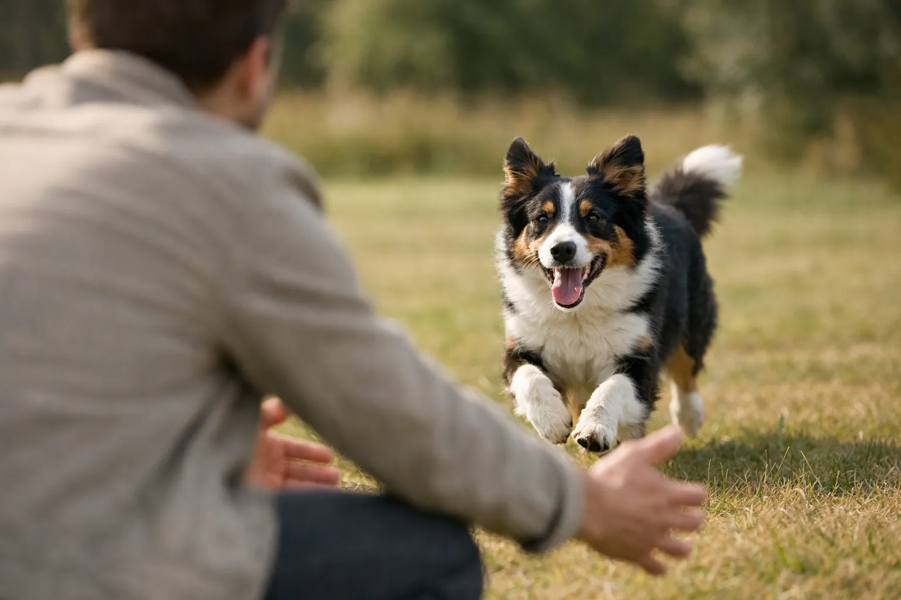
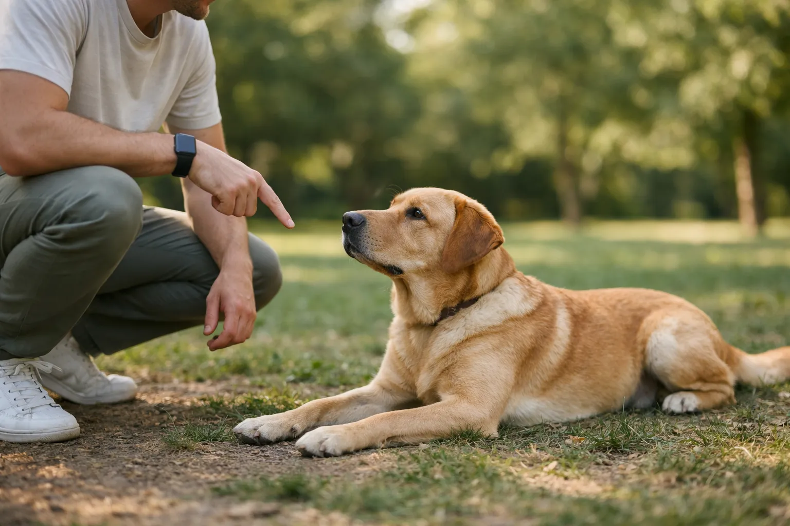

Die richtigen Kommandos für den Hund sind die Basis für ein sicheres und entspanntes Zusammenleben -- ob im Alltag, beim Spaziergang oder in unerwarteten Situationen. Mit den 7 wichtigsten Hundekommandos schützt du deinen Hund vor Gefahren, erleichterst die Kommunikation und stärkst eure Bindung nachhaltig.

In diesem Ratgeber erfährst du, welche Kommandos dein Hund können sollte, wie du sie Schritt für Schritt trainierst und welche typischen Fehler du vermeiden solltest. Die Übungen funktionieren für Welpen ab 8 Wochen genauso wie für erwachsene Hunde -- mit konkreten Trainingsanleitungen und Zeitangaben.

Zusammenfassung: Die wichtigsten Kommandos für den Hund

<ul>
<li><strong>7 Grundkommandos</strong> -- Sitz, Platz, Bleib, Hier, Fuß, Aus und Nein sind die wichtigsten Hundekommandos</li>
<li><strong>Kommandos beibringen ab 8 Wochen</strong> -- Welpen lernen erste Kommandos in kurzen Einheiten von 2–3 Minuten</li>
<li><strong>Positive Verstärkung</strong> -- Belohnung innerhalb von 1–2 Sekunden ist laut Studien 4x effektiver als Strafe</li>
<li><strong>2–3 Einheiten täglich</strong> -- Jeweils 5–10 Minuten reichen für sichtbare Fortschritte innerhalb von 4–8 Wochen</li>
<li><strong>Konsequenz ist entscheidend</strong> -- Einheitliche Signalwörter und Regeln für alle Familienmitglieder</li>
</ul>

7

Grundkommandos

5–10 Min

pro Trainingseinheit

4–8 Wochen

bis alle Kommandos sitzen

1–2 Sek

Belohnungs-Timing

## Warum sind die richtigen Kommandos beim Hund so wichtig?

Kommandos für den Hund bedeuten mehr als bloßer Gehorsam -- sie ermöglichen eine klare Kommunikation zwischen dir und deinem Vierbeiner. Laut der Bundestierärztekammer sind zuverlässig trainierte Hundekommandos die Voraussetzung für einen sicheren Freilauf und ein stressfreies Miteinander im Alltag.

Ein Hund ohne verlässliche Kommandos stellt ein Sicherheitsrisiko dar. Ohne zuverlässigen Rückruf kann ein Hund auf die Straße laufen, andere Hunde oder Menschen bedrängen oder Wild jagen. Rund 70 % aller Beißvorfälle lassen sich laut Tierärzteverband auf mangelnde Erziehung und fehlende Impulskontrolle zurückführen.

### Kommandos schützen deinen Hund

Der Rückruf kann im Ernstfall lebensrettend sein -- etwa wenn dein Hund auf eine befahrene Straße zuläuft. Das Kommando "Aus" verhindert, dass dein Hund giftige Substanzen aufnimmt. Gerade bei Vergiftungsgefahren zählt jede Sekunde, und ein zuverlässiges "Aus" kann den Tierarztbesuch ersparen.

### Hundekommandos stärken die Bindung

Training mit positiver Verstärkung fördert die Kommunikation zwischen dir und deinem Hund. Studien der Veterinärmedizinischen Universität Wien zeigen, dass Hunde, die über positive Methoden trainiert werden, eine stärkere Bindung zu ihrem Halter aufbauen als Hunde, die mit Strafe erzogen werden. Beim gemeinsamen Üben der Kommandos lernt dein Hund, auf dich zu achten, und du lernst, seine Körpersprache zu lesen.

ℹ️

<strong>Kommandos vs. Grundgehorsam</strong>

Einzelne Hundekommandos sind nur ein Teil des Grundgehorsams. Dieser umfasst auch allgemeine Verhaltensregeln wie Leinenführigkeit, Ruhe im Haus und sozialverträgliches Verhalten gegenüber Menschen und anderen Hunden.

## Die 7 wichtigsten Kommandos für den Hund im Überblick

Die folgende Kommandos-Hund-Liste zeigt die 7 Grundkommandos, die jeder Hund beherrschen sollte. Jedes Kommando erfüllt eine bestimmte Funktion im Alltag und baut auf dem vorherigen auf. Die Reihenfolge entspricht dem empfohlenen Trainingsaufbau.

| Kommando | Funktion | Schwierigkeit | Trainingsstart |
|---|---|---|---|
| Sitz | Impulskontrolle, Ruheposition | Leicht | Ab 8 Wochen |
| Platz | Längere Ruheposition | Leicht–Mittel | Ab 9 Wochen |
| Bleib | Verweilen auf Position | Mittel | Ab 12 Wochen |
| Hier (Rückruf) | Sicheres Abrufen | Mittel–Schwer | Ab 8 Wochen |
| Fuß | Kontrolliertes Gehen an der Leine | Schwer | Ab 14 Wochen |
| Aus | Gegenstand loslassen | Mittel | Ab 10 Wochen |
| Nein | Abbruchsignal | Mittel | Ab 12 Wochen |

🐕

Sitz & Platz

Die beiden Basiskommandos für Impulskontrolle und Ruhe. Der ideale Einstieg, um deinem Hund Kommandos beizubringen.

⏸️

Bleib

Dein Hund lernt, auf seiner Position zu verweilen -- auch wenn du dich entfernst.

📢

Hier & Fuß

Rückruf und Leinenführigkeit sorgen für Sicherheit im Freilauf und beim Spaziergang.

🚫

Aus & Nein

Diese Abbruch-Kommandos schützen deinen Hund vor Gefahren und unerwünschtem Verhalten.

## Kommando 1: Sitz -- Das Einstiegskommando für jeden Hund

"Sitz" ist das einfachste und gleichzeitig vielseitigste aller Hundekommandos. Hunde setzen sich von Natur aus häufig hin, weshalb dieses Verhalten leicht mit einem Signalwort verknüpft werden kann. Die meisten Welpen lernen dieses Kommando innerhalb von 5–10 Trainingseinheiten zuverlässig.

### Schritt-für-Schritt-Anleitung: Dem Hund "Sitz" beibringen

Halte ein Leckerli zwischen Daumen und Zeigefinger direkt vor die Nase deines Hundes. Führe das Leckerli langsam über seinen Kopf nach hinten. Dein Hund wird automatisch den Kopf heben und sich dabei hinsetzen. Sobald sein Hinterteil den Boden berührt, sagst du "Sitz" und gibst die Belohnung sofort -- innerhalb von 1–2 Sekunden.

1

Leckerli an die Nase

Halte das Leckerli direkt vor die Hundenase, damit dein Hund es riecht und fixiert.

2

Über den Kopf führen

Bewege das Leckerli langsam über den Kopf nach hinten. Der Hund folgt mit der Nase und setzt sich.

3

Signalwort + Belohnung

Sage "Sitz" genau im Moment des Hinsetzens und gib das Leckerli innerhalb von 1–2 Sekunden.

✓

Wiederholen & festigen

5–8 Wiederholungen pro Einheit. Nach 3–5 Tagen das Leckerli-Locken schrittweise abbauen.

### Typische Fehler beim "Sitz"-Kommando

Viele Hundehalter wiederholen das Kommando mehrfach, wenn der Hund nicht sofort reagiert. Das führt dazu, dass der Hund lernt, erst beim dritten "Sitz" zu reagieren. Sage das Signalwort immer nur einmal und warte 3–5 Sekunden. Reagiert dein Hund nicht, starte die Übung von vorn mit Leckerli-Hilfe.

## Kommando 2: Platz -- Die Ruheposition

"Platz" ist die natürliche Erweiterung von "Sitz" und bedeutet, dass dein Hund sich komplett hinlegt. Dieses Hundekommando eignet sich besonders für längere Wartezeiten -- etwa im Restaurant, beim Tierarzt oder wenn Besuch kommt. Ein Hund in der Platz-Position ist entspannter als im Sitz, da die Muskulatur weniger beansprucht wird.

### So trainierst du das Kommando "Platz"

Bringe deinen Hund zunächst ins "Sitz". Halte ein Leckerli vor seine Nase und führe es langsam senkrecht zum Boden zwischen seine Vorderpfoten. Sobald dein Hund dem Leckerli folgt und sich hinlegt, sagst du "Platz" und belohnst sofort. Manche Hunde strecken zunächst nur die Vorderbeine aus -- belohne auch diesen Zwischenschritt.

💡

<strong>Tipp: Unterlage nutzen</strong>

Trainiere "Platz" anfangs auf einer weichen Unterlage wie einer Decke oder Matte. Viele Hunde legen sich ungern auf kalten oder nassen Boden. Die Decke wird später zum portablen Ruheplatz -- ideal für Restaurantbesuche oder Bürotage.

Ein häufiger Fehler beim Platz-Training: Das Leckerli wird zu weit nach vorne geführt, sodass der Hund aufsteht und nach vorne läuft, statt sich hinzulegen. Führe das Leckerli immer senkrecht nach unten, direkt zwischen die Vorderpfoten deines Hundes.

## Kommando 3: Bleib -- Geduld trainieren

Das Kommando "Bleib" lehrt deinen Hund, auf seiner Position zu verweilen, bis du ihn auflöst. Es baut direkt auf "Sitz" und "Platz" auf und erfordert Impulskontrolle. Laut Hundetrainern zählt "Bleib" zu den schwierigsten Hundekommandos, weil der Hund seinem natürlichen Bewegungsdrang widerstehen muss.

### Die 3-D-Methode für das "Bleib"-Kommando

Professionelle Hundetrainer arbeiten beim Bleib-Training mit der 3-D-Methode: Duration (Dauer), Distance (Distanz) und Distraction (Ablenkung). Entscheidend ist, immer nur einen Parameter gleichzeitig zu steigern.

| Trainingsphase | Duration | Distance | Distraction |
|---|---|---|---|
| Woche 1–2 | 5–10 Sekunden | 1 Schritt | Keine |
| Woche 3–4 | 15–30 Sekunden | 3–5 Schritte | Gering (Geräusche) |
| Woche 5–6 | 1–2 Minuten | 5–10 Meter | Mittel (andere Hunde) |
| Woche 7–8 | 3–5 Minuten | 10–20 Meter | Hoch (Freilauf-Umgebung) |

Beginne im "Sitz" oder "Platz". Sage "Bleib", zeige die flache Handfläche als Sichtzeichen und mache einen Schritt zurück. Warte 3 Sekunden, gehe zurück zu deinem Hund und belohne ihn. Steigere die Dauer in kleinen Schritten von 2–3 Sekunden pro Trainingseinheit.

⚠️

<strong>Häufiger Fehler: Zu schnelle Steigerung</strong>

Wenn dein Hund bei "Bleib" regelmäßig aufsteht, steigerst du zu schnell. Gehe mindestens 2 Trainingsschritte zurück und arbeite dich langsamer vor. Erfolgsquote sollte bei mindestens 80 % liegen, bevor du den nächsten Schritt gehst.

## Kommando 4: Hier -- Der lebensrettende Rückruf

Ein zuverlässiger Rückruf ist das wichtigste Sicherheitskommando in der Hund-Kommandos-Liste. "Hier" bedeutet, dass dein Hund sofort alles stehen und liegen lässt und zu dir zurückkommt -- egal ob ein Reh im Wald steht, ein anderer Hund vorbeiläuft oder ein Radfahrer naht.

### Rückruf-Kommando aufbauen

Der Rückruf funktioniert am besten mit einem exklusiven Signalwort, das du ausschließlich für dieses Kommando verwendest. Viele Hundetrainer empfehlen ein spezielles Rückruf-Wort wie "Hier" oder einen Pfiff statt des Hundenamens, da der Name im Alltag zu häufig ohne Konsequenz genutzt wird.

Starte das Rückruf-Training in der Wohnung ohne Ablenkung. Sage "Hier" in einem fröhlichen, hohen Ton und belohne deinen Hund mit einem besonders hochwertigen Leckerli -- etwas, das er nur beim Rückruf bekommt. Käse, gekochtes Hühnchen oder Leberwurst eignen sich als Jackpot-Belohnung.

### Die goldene Rückruf-Regel

Rufe deinen Hund niemals zu dir, um etwas Unangenehmes zu tun -- etwa Anleinen, Baden oder Schimpfen. Jedes negative Rückruf-Erlebnis schwächt das Kommando. Wenn du deinen Hund anleinen musst, gehe stattdessen zu ihm hin. Der Rückruf muss immer zu 100 % positiv verknüpft sein.

🚫

<strong>Achtung: Rückruf bei Hunden mit Jagdtrieb</strong>

Hunde mit starkem Jagdtrieb (z. B. Beagle, Dackel, Weimaraner) benötigen ein spezielles Anti-Jagd-Training. Ein normales Rückruf-Kommando reicht bei Wildkontakt oft nicht aus, da der Jagdinstinkt stärker ist als die Belohnung. Lasse solche Hunde nur in sicherer Umgebung von der Leine.

## Kommando 5: Fuß -- Entspannt an der Leine gehen

"Fuß" bedeutet, dass dein Hund kontrolliert neben dir geht, ohne an der Leine zu ziehen. Dieses Kommando gehört zu den anspruchsvollsten Hundekommandos, da es dem natürlichen Erkundungsdrang des Hundes widerspricht. Laut einer Umfrage des VDH ist Leinenziehen das häufigste Verhaltensproblem bei Hunden.

### Fuß-Kommando trainieren: Methode "Richtungswechsel"

Gehe mit deinem Hund an lockerer Leine los. Sobald die Leine straff wird, bleibst du abrupt stehen oder wechselst die Richtung. Dein Hund lernt: Ziehen führt nicht zum Ziel. Läuft er neben dir mit lockerer Leine, belohnst du ihn alle 3–5 Schritte mit einem Leckerli auf Kniehöhe.

Für ein vertieftes Training der [Leinenführigkeit](https://hundewissen-mit-kopf.de/erziehung-verhalten/leinenfuehrigkeit-trainieren/) findest du weitere Übungen und Techniken in unserem ausführlichen Ratgeber. Die Wahl der richtigen Ausrüstung -- ob [Geschirr oder Halsband](https://hundewissen-mit-kopf.de/hundeausstattung/hundegeschirr-oder-halsband/) -- beeinflusst den Trainingserfolg ebenfalls.

| Trainingsphase | Belohnungsintervall | Strecke ohne Ziehen | Umgebung |
|---|---|---|---|
| Anfänger | Alle 2–3 Schritte | 5–10 Meter | Wohnung / Garten |
| Fortgeschritten | Alle 10–15 Schritte | 50–100 Meter | Ruhige Straße |
| Profi | Gelegentlich | 500+ Meter | Belebte Umgebung |

## Kommando 6: Aus -- Gegenstand loslassen

"Aus" ist ein Sicherheitskommando, das deinen Hund dazu bringt, einen Gegenstand aus dem Maul fallen zu lassen. Hunde nehmen beim Spaziergang regelmäßig Dinge vom Boden auf -- von Stöcken über Müll bis hin zu potenziell giftigen Substanzen. Dieses Kommando kann im Ernstfall für den Hund lebensrettend sein.

### Tauschgeschäft-Methode zum Kommando beibringen

Biete deinem Hund einen Gegenstand (z. B. Spielzeug) an. Sobald er es im Maul hat, zeigst du ihm ein besonders hochwertiges Leckerli und sagst "Aus". Dein Hund lässt den Gegenstand fallen, um das Leckerli zu nehmen. Wichtig: Gib ihm den Gegenstand anschließend zurück. So lernt er, dass "Aus" kein Verlust bedeutet, sondern ein Tausch.

✅

<strong>Tauschprinzip funktioniert</strong>

Hunde, die nach dem "Aus" ihren Gegenstand zurückbekommen, geben laut Studien der University of Lincoln 3x schneller ab als Hunde, denen der Gegenstand dauerhaft weggenommen wird. Das Tauschprinzip baut Vertrauen auf und macht das Kommando zuverlässiger.

Vermeide es, dem Hund Gegenstände gewaltsam aus dem Maul zu nehmen. Das erzeugt Ressourcenverteidigung und führt dazu, dass dein Hund beim nächsten Mal schneller schluckt, statt loszulassen.

## Kommando 7: Nein -- Das Abbruchsignal

"Nein" ist ein universelles Abbruchsignal und eines der wichtigsten Hundekommandos im Alltag. Es unterbricht unerwünschtes Verhalten -- etwa Anspringen, Betteln am Tisch oder das Schnüffeln an fremden Hunden. Im Gegensatz zum Kommando "Aus" (Gegenstand loslassen) bezieht sich "Nein" auf Handlungen und Verhaltensweisen.

### Dem Hund "Nein" richtig beibringen

Sage "Nein" in einem ruhigen, bestimmten Ton -- nicht laut oder aggressiv. Lenke deinen Hund sofort auf eine erwünschte Alternative um. Beispiel: Dein Hund springt einen Besucher an. Du sagst "Nein", leitest ihn ins "Sitz" und belohnst das Sitzen. So lernt dein Hund nicht nur, was er nicht tun soll, sondern auch, was er stattdessen tun soll.

Wenn dein Hund in bestimmten Situationen übermäßig [bellt](https://hundewissen-mit-kopf.de/erziehung-verhalten/hund-bellt-staendig/), kann das Abbruch-Kommando "Nein" in Kombination mit einer Alternativhandlung helfen, das unerwünschte Verhalten zu reduzieren.

📖

Definition: Abbruchsignal

Ein Abbruchsignal ist ein konditioniertes Kommando, das den Hund dazu bringt, eine laufende Handlung sofort zu unterbrechen. Es wird über positive Verstärkung aufgebaut und ersetzt veraltete Methoden wie Leinenruck oder Schreckreize.

## Die 7 Grundregeln: So bringst du deinem Hund Kommandos richtig bei

Neben den 7 Grundkommandos gibt es 7 Grundregeln, die den Trainingserfolg maßgeblich beeinflussen. Diese Prinzipien gelten für jedes Kommando und jede Übung, die du deinem Hund beibringen möchtest.

1

Timing ist alles

Belohnung innerhalb von 1–2 Sekunden nach dem richtigen Verhalten. Jede Verzögerung verwässert die Verknüpfung.

2

Kurze Einheiten

5–10 Minuten pro Einheit, 2–3x täglich. Hunde können sich maximal 10–15 Minuten konzentrieren.

3

Immer positiv enden

Beende jede Trainingseinheit mit einem Kommando, das dein Hund sicher beherrscht. Erfolg motiviert.

4

Einheitliche Signalwörter

Alle Familienmitglieder verwenden dieselben Kommandos. "Sitz", nicht mal "Sitz", mal "Hinsetzen".

5

Ablenkung langsam steigern

Neues Kommando zuerst in reizarmer Umgebung. Ablenkung erst erhöhen, wenn die Erfolgsquote bei 80 % liegt.

6

Konsequenz statt Strenge

Regeln gelten immer -- nicht nur manchmal. Inkonsequenz verwirrt den Hund mehr als fehlende Kommandos.

✓

Geduld bewahren

Jeder Hund lernt in seinem Tempo. Rückschritte sind normal und gehören zum Lernprozess.

## Hundekommandos im Alltag üben und festigen

Die besten Übungen für Hundekommandos finden nicht auf dem Trainingsplatz statt, sondern im Alltag. Jede Alltagssituation bietet Gelegenheiten, Kommandos zu festigen und zu generalisieren -- also auf verschiedene Umgebungen und Ablenkungsgrade zu übertragen.

### Übung vor dem Fressnapf

Lasse deinen Hund vor jeder Mahlzeit "Sitz" und "Bleib" ausführen. Stelle den Napf hin und warte 5–10 Sekunden, bevor du mit einem Auflösewort ("Okay" oder "Friss") die Freigabe gibst. Diese Übung trainiert Impulskontrolle und festigt zwei Kommandos gleichzeitig -- ohne zusätzlichen Zeitaufwand.

### Übung an der Haustür

Bevor die Haustür geöffnet wird, setzt sich dein Hund und wartet. Diese Übung verhindert, dass dein Hund aufgeregt aus der Tür stürmt, und trainiert gleichzeitig "Sitz", "Bleib" und Impulskontrolle. Besonders bei Hunden, die [aufgeregt bellen](https://hundewissen-mit-kopf.de/erziehung-verhalten/hund-bellt-staendig/), wenn es klingelt, wirkt diese Routine beruhigend.

### Übung beim Spaziergang

Baue während des Spaziergangs alle 5–10 Minuten ein kurzes Kommando ein. Ein spontanes "Sitz" an der Straßenecke, ein "Platz-Bleib" auf einer Parkbank oder ein Rückruf beim Freilauf. So werden die Hundekommandos unter verschiedenen Ablenkungsgraden gefestigt.

## Kommandos beim Jagdhund -- Besonderheiten

Jagdhunde wie Deutsch Drahthaar, Weimaraner oder Beagle bringen einen genetisch verankerten Jagdtrieb mit, der das Training der Kommandos vor besondere Herausforderungen stellt. Bei einem Jagdhund müssen die Hundekommandos deshalb noch zuverlässiger sitzen als bei anderen Rassen.

### Jagdtrieb und Kommandos für den Hund

Bei Jagdhunden steht der Rückruf an erster Stelle der Prioritäten. Laut dem Jagdgebrauchshundverband (JGHV) sollte der Rückruf bei Jagdhunden über eine Pfeife (Acme-Pfeife) konditioniert werden, da der Pfeifton auch über große Distanzen von 200–300 Metern hörbar ist und immer gleich klingt.

| Aspekt | Familienhund | Jagdhund |
|---|---|---|
| Rückruf-Priorität | Hoch | Höchste |
| Empfohlenes Signal | Stimme oder Pfeife | Pfeife (Acme 211.5) |
| Trainingsumgebung | Schrittweise steigern | Frühzeitig im Revier |
| Impulskontrolle | Standard-Training | Intensives Anti-Jagd-Training |
| Trainingsdauer bis zuverlässig | 3–6 Monate | 6–12 Monate |

💡

<strong>Tipp für Jagdhund-Besitzer</strong>

Nutze eine Schleppleine (5–10 Meter) für das Freilauf-Training, bis der Rückruf unter Ablenkung zu mindestens 95 % zuverlässig funktioniert. Eine Schleppleine gibt Sicherheit, ohne den Bewegungsradius zu stark einzuschränken.

## Positive Verstärkung vs. Strafe -- Was sagt die Wissenschaft?

Positive Verstärkung ist laut aktueller Forschung die effektivste Trainingsmethode, um einem Hund Kommandos beizubringen. Eine Studie der University of Porto (2020) mit 92 Hunden zeigte, dass Hunde, die mit positiver Verstärkung trainiert wurden, Kommandos 4x schneller lernten als Hunde, die mit aversiven Methoden (Leinenruck, Sprühhalsbänder) trainiert wurden.

Positive Verstärkung

<ul>
<li>Hund lernt Kommandos schneller und behält sie länger</li>
<li>Stärkere Bindung zwischen Hund und Halter</li>
<li>Weniger Stresshormone (Cortisol) beim Hund</li>
<li>Hund zeigt mehr Eigeninitiative und Kreativität</li>
<li>Von Tierärztekammern und VDH empfohlen</li>
</ul>

Strafbasiertes Training

<ul>
<li>Hund zeigt Angst- und Meideverhalten</li>
<li>Erhöhtes Aggressionsrisiko (um 2,9x laut Studie)</li>
<li>Hund gehorcht nur in Anwesenheit des Strafenden</li>
<li>Vertrauensverlust und geschwächte Bindung</li>
<li>Von Bundestierärztekammer abgelehnt</li>
</ul>

Die Bundestierärztekammer positioniert sich eindeutig gegen aversive Trainingsmethoden. Stachelhalsbänder, Stromhalsbänder und andere Schmerzreize sind in Deutschland gemäß Tierschutzgesetz § 3 Nr. 11 verboten. Positive Verstärkung durch Leckerlis, Lob und Spiel ist die tierschutzkonforme und wissenschaftlich überlegene Methode, um deinem Hund Kommandos beizubringen.

## Häufige Fehler beim Kommando-Training mit dem Hund

Selbst motivierte Hundehalter machen beim Training der Hundekommandos typische Fehler, die den Fortschritt bremsen oder sogar kontraproduktiv wirken. Die folgenden 5 Fehler treten laut Hundetrainern am häufigsten auf.

### Fehler 1: Zu lange Trainingseinheiten

Hunde können sich je nach Alter und Rasse maximal 10–15 Minuten am Stück konzentrieren. Welpen sogar nur 2–5 Minuten. Trainingseinheiten über 15 Minuten führen zu Frustration, Überforderung und sinkender Lernbereitschaft. Besser: 3 kurze Einheiten à 5 Minuten über den Tag verteilt.

### Fehler 2: Kommandos wiederholen

Wenn du "Sitz, Sitz, SITZ!" sagst, lernt dein Hund, dass er erst beim dritten Mal reagieren muss. Sage jedes Kommando nur einmal, warte 3–5 Sekunden und hilf dann mit einer Geste oder dem Leckerli nach.

### Fehler 3: Inkonsequenz in der Familie

Wenn ein Familienmitglied "Platz" sagt und ein anderes "Leg dich hin", ist der Hund verwirrt. Erstelle eine Kommandos-Liste für den Hund mit den vereinbarten Signalwörtern und hänge sie sichtbar auf.

### Fehler 4: Kommandos nur auf dem Hundeplatz üben

Ein Kommando, das nur auf dem Hundeplatz funktioniert, ist im Alltag wertlos. Hundekommandos müssen in mindestens 5–10 verschiedenen Umgebungen trainiert werden, damit der Hund das Kommando generalisiert.

### Fehler 5: Zu schnelle Steigerung der Ablenkung

Vom Wohnzimmer direkt in den belebten Park -- das überfordert jeden Hund. Steigere die Ablenkung schrittweise: Wohnung → Garten → ruhige Straße → Park ohne Hunde → Park mit Hunden → belebte Innenstadt.

✅ Checkliste: Kommandos beim Hund richtig trainieren

✓

Einheitliche Signalwörter für alle Familienmitglieder festgelegt

✓

Hochwertige Leckerlis in erbsengroßen Stücken vorbereitet

✓

Trainingseinheiten auf 5–10 Minuten begrenzt

✓

Reizarme Umgebung für den Trainingsstart gewählt

Trainingsprotokoll führen (Fortschritte dokumentieren)

Hundeschule oder Trainer für Gruppenstunden kontaktiert

## Trainingsplan: Alle 7 Hundekommandos in 8 Wochen

Ein strukturierter Trainingsplan hilft, die wichtigsten Kommandos für den Hund systematisch aufzubauen. Der folgende 8-Wochen-Plan eignet sich für Welpen ab 10 Wochen und erwachsene Hunde gleichermaßen. Bei erwachsenen Hunden mit Vorerfahrung können einzelne Phasen schneller durchlaufen werden.

| Woche | Kommandos | Übungsdauer | Umgebung | Ziel |
|---|---|---|---|---|
| 1–2 | Sitz, Hier (Name) | 3x 3 Min/Tag | Wohnung | Verknüpfung Signalwort + Verhalten |
| 3–4 | + Platz, Aus | 3x 5 Min/Tag | Wohnung + Garten | Zuverlässigkeit ohne Ablenkung |
| 5–6 | + Bleib, Nein | 3x 7 Min/Tag | Garten + ruhige Straße | Erste Ablenkung meistern |
| 7–8 | + Fuß, alle Kommandos | 3x 10 Min/Tag | Park, verschiedene Orte | Generalisierung beginnen |

ℹ️

<strong>Nach dem 8-Wochen-Plan</strong>

Der 8-Wochen-Plan legt das Fundament. Bis die Hundekommandos auch unter starker Ablenkung (andere Hunde, Wild, Radfahrer) zuverlässig funktionieren, vergehen weitere 2–4 Monate regelmäßiges Training. Das Festigen der Kommandos beim Hund ist kein Projekt mit Enddatum, sondern ein fortlaufender Prozess.

## Wann lohnt sich eine Hundeschule?

Eine professionelle Hundeschule bietet Vorteile, die Einzeltraining zu Hause nicht ersetzen kann. In der Gruppe lernt dein Hund, Kommandos auch in Anwesenheit anderer Hunde und Menschen auszuführen. Laut VDH besuchen rund 40 % aller Hundehalter in Deutschland mindestens einen Grundkurs in der Hundeschule.

Achte bei der Wahl der Hundeschule auf folgende Qualitätsmerkmale: Der Trainer arbeitet ausschließlich mit positiver Verstärkung, die Gruppengröße beträgt maximal 6–8 Hunde, und der Trainer besitzt eine anerkannte Zertifizierung (z. B. IHK, BHV oder Tierärztekammer). Kosten für einen 10-stündigen Grundkurs liegen zwischen 120 und 250 Euro -- eine Investition, die sich durch einen besser erzogenen Hund langfristig auszahlt.

Für [Anfänger-Hunderassen](https://hundewissen-mit-kopf.de/hunderassen/hunderasse-fuer-anfaenger/) ist der Besuch einer Hundeschule besonders empfehlenswert, da Ersthundehalter von der professionellen Anleitung und dem Austausch mit anderen Hundebesitzern profitieren.

## Fazit: Die richtigen Kommandos machen den Hund zum zuverlässigen Begleiter

Die 7 wichtigsten Kommandos für den Hund -- Sitz, Platz, Bleib, Hier, Fuß, Aus und Nein -- bilden die Grundlage für ein sicheres Zusammenleben. Mit positiver Verstärkung und 2–3 kurzen Trainingseinheiten von jeweils 5–10 Minuten pro Tag zeigen die meisten Hunde innerhalb von 4–8 Wochen zuverlässige Ergebnisse.

Der Schlüssel zum Erfolg liegt in Konsequenz, Geduld und dem richtigen Timing der Belohnung. Starte mit einfachen Hundekommandos in reizarmer Umgebung und steigere die Ablenkung schrittweise. Vermeide die typischen Fehler -- zu lange Einheiten, wiederholte Kommandos und inkonsequente Regeln.

Das Trainieren von Kommandos beim Hund ist keine einmalige Aufgabe, sondern ein fortlaufender Prozess, der die Bindung zwischen dir und deinem Vierbeiner stärkt. Beginne heute mit dem ersten Kommando -- dein Hund wird es dir mit Vertrauen und Zuverlässigkeit danken.