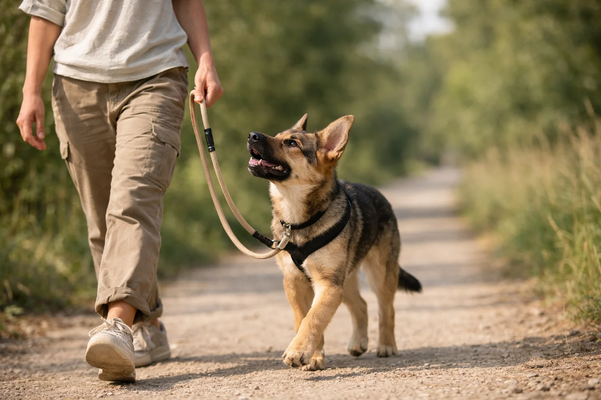

Leinenführigkeit trainieren gehört zu den wichtigsten Grundlagen in der Hundeerziehung -- und gleichzeitig zu den häufigsten Herausforderungen. Rund 60% aller Hundehalter berichten, dass ihr Hund regelmäßig an der Leine zieht. Das frustriert nicht nur dich, sondern belastet auch deinen Hund körperlich und emotional.

Die gute Nachricht: Mit der richtigen Methode, Geduld und Konsequenz lernt jeder Hund, entspannt an lockerer Leine zu laufen. In diesem Ratgeber findest du eine Schritt-für-Schritt-Anleitung, bewährte Übungen für Welpen, Junghunde und erwachsene Hunde sowie Lösungen für typische Probleme wie Leinenziehen und Leinenaggression.

Zusammenfassung: Leinenführigkeit trainieren

<ul>
<li><strong>Grundprinzip</strong> -- Leinenführigkeit basiert auf positiver Verstärkung: Lockere Leine wird belohnt, Zug führt zum Stehen bleiben</li>
<li><strong>Richtige Ausrüstung</strong> -- Eine 2-3 Meter lange Führleine und ein Brustgeschirr sind ideal für das Leinentraining</li>
<li><strong>Täglich üben</strong> -- Kurze Trainingseinheiten von 5-10 Minuten bei jedem Spaziergang sind wirksamer als seltene Intensiv-Sessions</li>
<li><strong>Erste Erfolge nach 2-4 Wochen</strong> -- Zuverlässige Leinenführigkeit ist bei konsequentem Training nach 6-12 Wochen möglich</li>
<li><strong>Alter spielt keine Rolle</strong> -- Sowohl Welpen ab 8 Wochen als auch erwachsene Hunde können Leinenführigkeit lernen</li>
</ul>

60%

der Hunde ziehen an der Leine

5-10 Min

Trainingseinheiten pro Spaziergang

2-4 Wochen

bis zu ersten Erfolgen

6-12 Wochen

bis zur zuverlässigen Leinenführigkeit

## Warum zieht dein Hund an der Leine?

Bevor du mit dem Leinenführigkeit-Training beginnst, hilft es, das Problem zu verstehen. Hunde ziehen an der Leine aus einem einfachen Grund: Es funktioniert. Jedes Mal, wenn dein Hund zieht und dadurch vorwärtskommt, wird das Verhalten belohnt und verstärkt sich.

### Das natürliche Lauftempo von Hunden

Das Lauftempo eines durchschnittlichen Hundes liegt bei 4-6 km/h im Trab -- Menschen gehen jedoch nur mit 3-4 km/h. Dein Hund muss sich also aktiv bremsen, um neben dir zu laufen. Das erfordert Impulskontrolle, die erst gelernt werden muss.

Hinzu kommt die Nase: Hunde nehmen ihre Umwelt primär über den Geruchssinn wahr. Ihre Nase registriert bis zu 300 Millionen Geruchsrezeptoren (zum Vergleich: Menschen haben nur 5-6 Millionen). Jeder Grashalm, jeder Laternenpfahl und jeder andere Hund sendet spannende Geruchsinformationen, die dein Hund erkunden möchte.

### Die häufigsten Ursachen für Leinenziehen

| Ursache | Beschreibung | Typisches Verhalten |
|---|---|---|
| Erregung/Vorfreude | Hund ist überstimuliert durch Reize | Zieht in alle Richtungen, springt |
| Fehlende Impulskontrolle | Hund hat nie gelernt, sich zu bremsen | Zieht konstant nach vorne |
| Unbeabsichtigte Verstärkung | Halter geht mit, wenn Hund zieht | Hund zieht immer stärker |
| Frustration | Hund möchte zu Artgenossen/Reizen | Zieht gezielt in Richtung des Reizes |
| Angst/Unsicherheit | Hund will Situation verlassen | Zieht weg von der Reizquelle |

ℹ️

<strong>Lerntheorie: Positive Verstärkung wirkt</strong>

Laut der American Veterinary Society of Animal Behavior (AVSAB) ist belohnungsbasiertes Training die effektivste und tierschutzgerechteste Methode. Hunde lernen schneller und nachhaltiger, wenn erwünschtes Verhalten belohnt wird, statt unerwünschtes Verhalten bestraft wird.

## Die richtige Ausrüstung für das Leinentraining

Die Wahl der richtigen Leine und des passenden Geschirrs beeinflusst den Trainingserfolg erheblich. Eine ungeeignete Ausrüstung kann das Leinenziehen sogar verstärken.

### Welche Leine für Leinenführigkeit?

Eine 2-3 Meter lange, leichte Führleine ist die beste Wahl für das Leinenführigkeit-Training. Sie bietet genug Spielraum, damit dein Hund nicht ständig in die Leine läuft, und gibt dir gleichzeitig ausreichend Kontrolle.

| Leinentyp | Geeignet? | Begründung |
|---|---|---|
| Führleine (2-3 m) | ✅ Ideal | Klare Grenze, gute Kontrolle, kein permanenter Zug |
| Schleppleine (5-10 m) | ⚠️ Bedingt | Gut für Freilauf-Ersatz, nicht für Leinentraining |
| Rollleine (Flexi) | ❌ Ungeeignet | Erzeugt permanenten Gegenzug, belohnt Ziehen |
| Kurzführer (1 m) | ⚠️ Bedingt | Zu wenig Spielraum, erhöhte Frustration |

### Geschirr oder Halsband beim Leinentraining?

Ein gut sitzendes Brustgeschirr ist für das Training der Leinenführigkeit die bessere Wahl als ein Halsband. Der Druck verteilt sich gleichmäßig auf den Brustkorb, statt auf Halswirbelsäule und Kehlkopf zu wirken. Besonders bei Hunden, die noch stark ziehen, schützt ein Geschirr vor Verletzungen an der empfindlichen Halsregion.

Tierärzte warnen: Dauerhafter Zug am Halsband kann zu Schilddrüsenproblemen, Kehlkopfschäden und erhöhtem Augeninnendruck führen. Einen ausführlichen Vergleich beider Optionen findest du in unserem Ratgeber [Hundegeschirr oder Halsband](/hundeausstattung/hundegeschirr-oder-halsband/).

⚠️

<strong>Stachelhalsbänder und Würgeketten sind tabu</strong>

Aversive Hilfsmittel wie Stachelhalsbänder, Würgeketten oder Sprühhalsbänder sind tierschutzwidrig und in vielen Ländern verboten. Sie verursachen Schmerz, Angst und können Aggressionen fördern. Die Bundestierärztekammer lehnt ihren Einsatz ausdrücklich ab.

### Leinenführigkeit mit Halti trainieren

Ein Kopfhalfter (Halti) kann als vorübergehendes Hilfsmittel beim Leinentraining eingesetzt werden. Es lenkt den Kopf des Hundes sanft in deine Richtung, wenn er zieht. Wichtig: Das Halti muss langsam und positiv aufgebaut werden -- viele Hunde empfinden es anfangs als unangenehm. Es ersetzt nicht das eigentliche Training, sondern unterstützt es lediglich.

## Leinenführigkeit trainieren: Die Grundmethode

Die effektivste Methode für das Leinenführigkeit-Training basiert auf einem einfachen Prinzip: Lockere Leine bedeutet Vorwärtskommen, gespannte Leine bedeutet Stillstand. Dein Hund lernt, dass Ziehen ihn nicht schneller ans Ziel bringt -- im Gegenteil.

### Die Stehen-bleiben-Methode (Schritt für Schritt)

1

Ausgangssituation schaffen

Starte in einer reizarmen Umgebung (Garten, ruhige Straße). Halte die Leine locker in der Hand -- sie sollte ein leichtes "U" bilden.

2

Lockere Leine belohnen

Solange die Leine locker hängt, gehst du weiter und lobst deinen Hund mit ruhiger Stimme. Alle 5-10 Schritte gibt es ein Leckerli auf deiner Seite.

3

Bei Zug sofort stehen bleiben

Sobald die Leine sich spannt, bleibst du wie eine Laterne stehen. Kein Zerren, kein Rufen -- einfach stehen und warten.

4

Blickkontakt abwarten

Warte, bis dein Hund sich zu dir umdreht oder die Leine lockert. Das kann anfangs 10-30 Sekunden dauern.

5

Sofort belohnen und weitergehen

Sobald die Leine locker wird, lobst du begeistert und gehst sofort weiter. Dein Hund lernt: Lockere Leine = es geht weiter.

✓

Konsequent wiederholen

Wiederhole diesen Ablauf bei jedem Spaziergang. In den ersten Tagen wirst du oft stehen bleiben -- das ist völlig normal und Teil des Lernprozesses.

### Die Richtungswechsel-Methode

Eine ergänzende Übung zur Leinenführigkeit ist der überraschende Richtungswechsel. Sobald dein Hund nach vorne zieht, drehst du dich um 180 Grad und gehst in die entgegengesetzte Richtung. Dein Hund muss dir folgen und lernt, auf deine Bewegungen zu achten.

Kombiniere beide Methoden: Stehen bleiben bei leichtem Zug, Richtungswechsel bei starkem Zug. So bleibt das Training abwechslungsreich und dein Hund lernt, ständig auf dich zu achten.

💡

<strong>Tipp: Das Markerwort nutzen</strong>

Führe ein Markerwort wie "Fein" oder "Ja" ein, das du immer im exakten Moment sagst, wenn die Leine locker wird. So versteht dein Hund präzise, welches Verhalten belohnt wird. Alternativ funktioniert auch ein Clicker als Markersignal.

## Übungen für die Leinenführigkeit im Alltag

Neben der Grundmethode gibt es gezielte Übungen, die die Leinenführigkeit deines Hundes verbessern. Diese Übungen trainieren Aufmerksamkeit, Impulskontrolle und die Orientierung an dir.

### Übung 1: Das Aufmerksamkeitssignal

Bringe deinem Hund ein Aufmerksamkeitssignal bei -- zum Beispiel seinen Namen oder das Wort "Schau". Sage das Signal und belohne Blickkontakt sofort mit einem Leckerli. Trainiere das zunächst zu Hause, dann im Garten und schließlich auf dem Spaziergang. Ziel: Dein Hund schaut dich an, wenn du sein Aufmerksamkeitssignal sagst -- auch bei Ablenkung.

### Übung 2: Die Fußarbeit im Stehen

Locke deinen Hund mit einem Leckerli an deine linke Seite. Sage "Fuß" und belohne ihn, wenn er neben dir steht. Halte die Position 3-5 Sekunden, dann belohne erneut. Steigere die Dauer langsam auf 10-15 Sekunden. Diese Übung bildet die Grundlage für das Laufen an lockerer Leine.

### Übung 3: Aufmerksamkeit beim Gehen

Gehe los und belohne deinen Hund alle 2-3 Schritte, solange er neben dir bleibt. Steigere den Abstand zwischen den Belohnungen langsam: erst alle 5 Schritte, dann alle 10, dann alle 20. Nach 2-3 Wochen reicht eine Belohnung pro Minute aus.

### Übung 4: Reize als Belohnung nutzen

Dein Hund möchte zum Baum schnüffeln? Nutze das als Belohnung für lockere Leine. Sage "Geh schnüffeln" und lass ihn zum Baum gehen -- aber nur, wenn die Leine locker ist. Diese Methode nutzt das Premack-Prinzip: Ein wahrscheinliches Verhalten (Schnüffeln) verstärkt ein unwahrscheinliches Verhalten (lockere Leine).

📖

Definition: Premack-Prinzip

Das Premack-Prinzip besagt, dass ein häufig gezeigtes Verhalten als Verstärker für ein seltener gezeigtes Verhalten dienen kann. Im Leinentraining bedeutet das: Schnüffeln und Erkunden (häufig) wird zur Belohnung für lockeres Laufen (selten).

## Leinenführigkeit trainieren beim Welpen

Welpen ab einem Alter von 8 Wochen können bereits an die Leine gewöhnt werden. Der große Vorteil: Sie haben noch keine schlechten Gewohnheiten entwickelt. Die Sozialisierungsphase zwischen der 8. und 16. Lebenswoche ist ideal, um die Leinenführigkeit spielerisch aufzubauen.

### Schritt-für-Schritt-Plan für Welpen

**Woche 1-2: Gewöhnung an Geschirr und Leine.** Lass deinen Welpen das Geschirr zu Hause tragen -- zunächst nur 5-10 Minuten. Belohne ihn, wenn er es akzeptiert. Befestige die Leine und lass sie schleifen, während du im Garten spielst.

**Woche 3-4: Erste Schritte an der Leine.** Nimm die Leine locker in die Hand und folge zunächst deinem Welpen. Belohne ihn, wenn er in deine Richtung schaut oder zu dir kommt. Beginne, sanft die Richtung vorzugeben.

**Woche 5-8: Strukturiertes Leinentraining.** Starte mit der Stehen-bleiben-Methode in kurzen Einheiten von 3-5 Minuten. Welpen haben eine kurze Aufmerksamkeitsspanne -- überfordere sie nicht. Beende jede Einheit mit einem Erfolg.

✅

<strong>Welpen lernen schnell</strong>

Welpen, die von Anfang an mit positiver Verstärkung an die Leine gewöhnt werden, zeigen laut VDH deutlich weniger Leinenprobleme im Erwachsenenalter. Investiere in den ersten Wochen täglich 5-10 Minuten -- es lohnt sich langfristig.

## Leinenführigkeit trainieren beim Junghund

Junghunde zwischen 6 und 18 Monaten befinden sich in der Pubertät -- einer Phase, in der bereits gelernte Verhaltensweisen scheinbar vergessen werden. Das Leinenführigkeit-Training beim Junghund erfordert besonders viel Geduld und Konsequenz.

### Typische Herausforderungen beim Junghund

Junghunde zeigen häufig verstärktes Ziehen an der Leine, weil Hormone und ein gesteigerter Erkundungsdrang das Verhalten beeinflussen. Der Testosteronspiegel bei Rüden erreicht zwischen dem 7. und 10. Monat seinen Höchststand -- das kann die Impulskontrolle deutlich verringern.

Bleibe in dieser Phase konsequent bei deinem Trainingsplan. Reduziere die Anforderungen vorübergehend: Kürzere Trainingsstrecken, höhere Belohnungsrate, reizärmere Umgebungen. Dein Junghund testet Grenzen -- das ist normal und kein Zeichen von Sturheit.

### Trainingsplan für Junghunde

| Woche | Übung | Dauer | Umgebung |
|---|---|---|---|
| 1-2 | Stehen-bleiben-Methode auffrischen | 5-10 Min | Garten/ruhige Straße |
| 3-4 | Richtungswechsel integrieren | 10 Min | Bekannte Spazierwege |
| 5-6 | Aufmerksamkeitssignal unter Ablenkung | 10-15 Min | Mäßig belebte Wege |
| 7-8 | Reize als Belohnung nutzen | 15 Min | Verschiedene Umgebungen |
| 9-12 | Belohnungsintervalle vergrößern | Ganzer Spaziergang | Alle Umgebungen |

## Leinenaggression: Wenn der Hund an der Leine ausrastet

Leinenaggression -- also Bellen, Knurren oder Ausfallen gegenüber anderen Hunden an der Leine -- ist ein häufiges Problem, das eng mit der Leinenführigkeit zusammenhängt. Etwa 30% aller Hunde zeigen laut Studien Leinenaggression in unterschiedlicher Ausprägung.

### Ursachen für Leinenaggression

Leinenaggression entsteht meist nicht aus echter Aggression, sondern aus Frustration oder Unsicherheit. Der Hund kann an der Leine nicht frei entscheiden, ob er sich annähernd oder entfernt -- diese eingeschränkte Handlungsfreiheit erzeugt Stress. Wiederholte negative Erfahrungen an der Leine können das Problem verstärken.

😤

Frustration

Der Hund möchte zum anderen Hund, wird aber durch die Leine daran gehindert. Die aufgestaute Erregung entlädt sich in Bellen und Zerren.

😰

Unsicherheit

Der Hund fühlt sich bedroht und kann nicht flüchten. Die Leine nimmt ihm die Möglichkeit, Abstand zu halten -- er geht in die Offensive.

📚

Fehlende Sozialisation

Der Hund hat in der Prägungs- und Sozialisierungsphase zu wenig positive Erfahrungen mit Artgenossen gemacht.

🔗

Leinenspannung

Permanenter Zug am Halsband oder Geschirr erhöhrt die körperliche Anspannung und senkt die Reizschwelle des Hundes.

### Leinenaggression abtrainieren: 3 Schritte

**Schritt 1: Abstand vergrößern.** Finde heraus, ab welcher Entfernung dein Hund noch ruhig bleibt (die sogenannte Individualdistanz). Trainiere unterhalb dieser Schwelle -- dort, wo dein Hund den anderen Hund wahrnimmt, aber noch ansprechbar ist.

**Schritt 2: Gegenkonditionierung.** Sobald dein Hund einen anderen Hund sieht, bekommt er ein hochwertiges Leckerli. Anderer Hund = etwas Tolles passiert. Wiederhole das über Wochen, bis dein Hund bei Hundebegegnungen erwartungsvoll zu dir schaut statt zu reagieren.

**Schritt 3: Abstand langsam verringern.** Reduziere den Abstand in kleinen Schritten -- nur so weit, wie dein Hund ruhig bleibt. Ein Rückschritt ist kein Versagen, sondern ein Zeichen, dass du zu schnell vorgegangen bist.

⚠️

<strong>Bei starker Leinenaggression professionelle Hilfe holen</strong>

Wenn dein Hund bei Hundebegegnungen extrem reagiert, andere Hunde oder Menschen gefährdet oder du dich unsicher fühlst, suche einen zertifizierten Hundetrainer oder Verhaltenstherapeuten auf. Leinenaggression kann sich ohne fachkundige Unterstützung verschlimmern.

## Häufige Fehler beim Leinenführigkeit-Training

Viele Hundehalter machen beim Leinentraining unbewusst Fehler, die den Fortschritt verzögern oder das Problem sogar verschärfen. Diese typischen Fehler solltest du vermeiden.

Richtig machen

<ul>
<li>Konsequent bei JEDEM Spaziergang trainieren</li>
<li>Sofort stehen bleiben, wenn die Leine sich spannt</li>
<li>Lockere Leine großzügig belohnen</li>
<li>In reizarmer Umgebung starten</li>
<li>Kurze Trainingseinheiten (5-10 Min)</li>
<li>Geduld zeigen -- Rückschritte sind normal</li>
</ul>

Fehler vermeiden

<ul>
<li>Nur manchmal trainieren, sonst mitziehen lassen</li>
<li>An der Leine zurückzerren oder rucken</li>
<li>Erwünschtes Verhalten ignorieren</li>
<li>In überreizter Umgebung starten (Hundeplatz, Innenstadt)</li>
<li>Zu lange Einheiten, die Hund überfordern</li>
<li>Hund bestrafen, wenn er zieht</li>
</ul>

### Der größte Fehler: Inkonsequenz

Der häufigste Grund für gescheitertes Leinentraining ist Inkonsequenz. Wenn du morgens trainierst, aber abends den Hund ziehen lässt, weil du müde bist, lernt dein Hund: Manchmal lohnt sich Ziehen. Dieses intermittierende Verstärkungsmuster macht das Verhalten besonders löschungsresistent -- ähnlich wie bei einem Spielautomaten.

Die Lösung: Trainiere nicht den gesamten Spaziergang, sondern definiere klare Trainingsphasen. Zum Beispiel die ersten 10 Minuten an kurzer Leine mit aktivem Training, dann 20 Minuten an längerer Leine zum entspannten Schnüffeln.

## Leinenführigkeit bei verschiedenen Hunderassen

Verschiedene Hunderassen bringen unterschiedliche Voraussetzungen für das Leinentraining mit. Jagdhunde haben einen stärkeren Beutetrieb, Herdenschutzhunde sind eigenständiger, und kleine Hunde werden häufig weniger konsequent trainiert.

| Rassegruppe | Typische Herausforderung | Trainingstipp |
|---|---|---|
| Jagdhunde (Beagle, Dackel) | Starker Nasentrieb, ziehen zu Gerüchen | Schnüffeln als Belohnung einsetzen |
| Herdenschutzhunde (Kangal, Maremmano) | Eigenständig, wenig Orientierung am Menschen | Beziehungsarbeit und hohe Belohnungsrate |
| Hütehunde (Border Collie, Aussie) | Reaktiv auf Bewegungsreize | Aufmerksamkeitsübungen, Impulskontrolle |
| Terrier (Jack Russell, Foxterrier) | Hohe Erregung, schnell ablenkbar | Kurze Einheiten, abwechslungsreiches Training |
| Molosser (Bulldogge, Rottweiler) | Körperliche Kraft beim Ziehen | Frühes Training, Geschirr statt Halsband |
| Kleine Hunde (Chihuahua, Malteser) | Werden oft getragen statt trainiert | Konsequent wie große Hunde behandeln |

Wenn du noch überlegst, welche Rasse zu dir passt, hilft dir unser Ratgeber [Hunderasse für Anfänger](/hunderassen/hunderasse-fuer-anfaenger/) bei der Entscheidung.

## Trainingsplan: Leinenführigkeit in 8 Wochen

Ein strukturierter Trainingsplan hilft dir, die Leinenführigkeit systematisch aufzubauen. Dieser Plan eignet sich für Junghunde und erwachsene Hunde, die das Leinenziehen abgewöhnen sollen.

### Woche 1-2: Grundlagen legen

Trainiere ausschließlich in reizarmer Umgebung (Garten, ruhige Seitenstraße). Belohne lockere Leine alle 3-5 Schritte. Bleibe bei jedem Zug konsequent stehen. Trainingszeit: 5-10 Minuten pro Spaziergang, danach Schnüffelrunde an längerer Leine.

### Woche 3-4: Ablenkung langsam steigern

Wechsle auf leicht belebtere Wege. Führe Richtungswechsel ein. Steigere den Abstand zwischen Belohnungen auf 8-10 Schritte. Integriere das Aufmerksamkeitssignal in den Spaziergang.

### Woche 5-6: Alltagssituationen üben

Trainiere an verschiedenen Orten: Park, Wohngebiet, Fußgängerzone. Übe Begegnungen mit anderen Hunden und Menschen. Nutze Umweltreize als Belohnung (Premack-Prinzip).

### Woche 7-8: Festigung und Generalisierung

Reduziere Leckerli-Belohnungen schrittweise. Ersetze sie durch verbales Lob und Umweltbelohnungen. Trainiere in möglichst vielen verschiedenen Situationen. Ziel: Dein Hund läuft 80% der Zeit an lockerer Leine.

💡

<strong>Tipp: Trainingstagebuch führen</strong>

Notiere nach jedem Spaziergang kurz, wie das Training gelaufen ist. Wie oft musstest du stehen bleiben? In welchen Situationen zieht dein Hund noch? So erkennst du Fortschritte und kannst gezielt an Schwachstellen arbeiten.

## Hilfsmittel und Zusatztraining

Neben dem reinen Leinentraining gibt es ergänzende Maßnahmen, die die Leinenführigkeit deines Hundes verbessern.

### Kopfarbeit und Auslastung

Ein geistig und körperlich ausgelasteter Hund ist auf dem Spaziergang deutlich ruhiger. Baue vor dem Leinentraining 10-15 Minuten Nasenarbeit, Suchspiele oder kurze Gehorsamkeitsübungen ein. Ein Hund, der bereits etwas Energie abgebaut hat, kann sich besser konzentrieren.

### Impulskontrolle im Alltag üben

Leinenführigkeit ist im Kern Impulskontrolle. Du kannst diese Fähigkeit auch abseits der Leine trainieren: Warten vor dem Futternapf, Sitzen bleiben bei offener Tür, Warten auf das Freigabesignal. Jede dieser Übungen stärkt die Fähigkeit deines Hundes, eigene Impulse zu kontrollieren.

### Wann professionelle Hilfe sinnvoll ist

Professionelle Unterstützung durch einen zertifizierten Hundetrainer ist empfehlenswert, wenn dein Hund nach 4-6 Wochen konsequentem Training keine Fortschritte zeigt, Leinenaggression zeigt oder du dich körperlich nicht mehr halten kannst. Achte bei der Trainerwahl auf eine Zertifizierung durch anerkannte Verbände (z.B. BHV, IBH) und gewaltfreie Trainingsmethoden.

Wenn dein Hund neben dem Leinenziehen auch andere Verhaltensauffälligkeiten zeigt, wie beispielsweise übermäßiges Bellen, findest du hilfreiche Tipps in unserem Artikel [Hund bellt ständig](/erziehung-verhalten/hund-bellt-staendig/).

## Checkliste: Ausrüstung und Vorbereitung

✅ Checkliste für das Leinentraining

✓

Führleine (2-3 m, leichtes Material)

✓

Gut sitzendes Brustgeschirr

✓

Hochwertige Leckerlis (klein, weich, schnell fressbar)

✓

Leckerli-Beutel für schnellen Zugriff

✓

Reizarme Trainingsstrecke ausgewählt

✓

Markerwort oder Clicker eingeführt

Optional: Kopfhalfter (Halti) als Übergangshilfe

Optional: Längere Schleppleine für Schnüffelpausen

## Fazit: Leinenführigkeit trainieren lohnt sich

Leinenführigkeit trainieren erfordert Geduld, Konsequenz und die richtige Methode -- aber der Aufwand lohnt sich für Mensch und Hund gleichermaßen. Ein Hund, der entspannt an lockerer Leine läuft, genießt seine Spaziergänge mehr, ist weniger gestresst und stärkt die Bindung zu seinem Halter.

Starte mit der Stehen-bleiben-Methode in reizarmer Umgebung, belohne lockere Leine großzügig und steigere die Anforderungen schrittweise. Plane 6-12 Wochen für eine zuverlässige Leinenführigkeit ein und akzeptiere Rückschritte als normalen Teil des Lernprozesses. Ob Welpe, Junghund oder erwachsener Hund -- mit täglichen Übungen von 5-10 Minuten wirst du bereits nach wenigen Wochen deutliche Fortschritte sehen.

Denke daran: Jeder Spaziergang ist eine Trainingsmöglichkeit. Nutze sie konsequent, und du wirst schon bald entspannte Runden mit deinem Hund genießen.