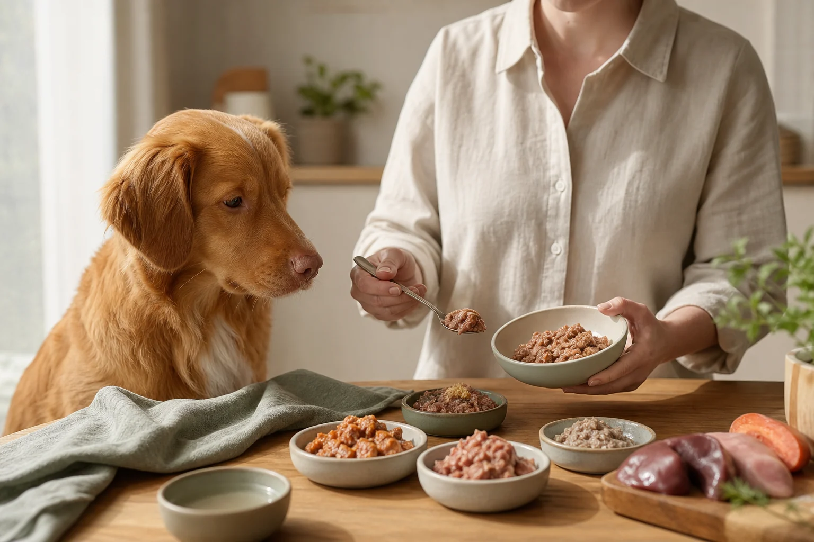
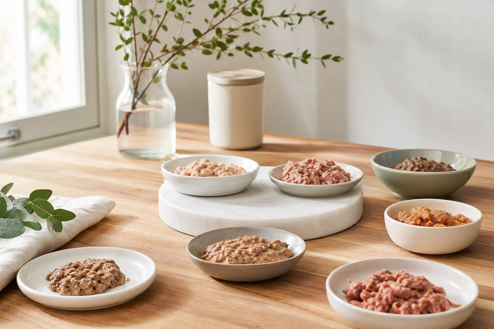

Gutes Nassfutter für Hunde erkennst du nicht am Preis, sondern an der Zutatenliste. Ob Testsieger, Discounter-Dose oder Premium-Marke: Die Qualität von Hundefutter entscheidet sich im Detail. Dieser Ratgeber zeigt dir, worauf es beim nassfutter hund test wirklich ankommt, wie du Etiketten richtig liest und welche Marken in puncto Fleischanteil, Transparenz und Preis-Leistung überzeugen.

Du erfährst, welche Kriterien seriöse Tests anlegen, was die [Stiftung Warentest](https://www.test.de/) bei Hundenassfutter prüft, und wie du selbst in wenigen Schritten gutes von schlechtem Futter unterscheidest. Außerdem findest du Empfehlungen für Senioren-Hunde, Allergiker und Welpen sowie einen ehrlichen Kostenvergleich zwischen Discounter und Premium.

## Was macht gutes Nassfutter für Hunde aus? – Nassfutter Hund Test Grundlagen

Zusammenfassung: Nassfutter Hund Test

<ul>
<li><strong>Fleischanteil entscheidet</strong> -- Mindestens 60–70 % Fleisch aus benannten Quellen ist das wichtigste Qualitätsmerkmal</li>
<li><strong>Einzelaufführung bevorzugen</strong> -- Konkrete Zutaten wie "Hühnerbrust" sind transparenter als "Fleisch und tierische Nebenerzeugnisse"</li>
<li><strong>Wassergehalt beachten</strong> -- 70–80 % Wasser im Nassfutter unterstützen die Nierengesundheit aktiv</li>
<li><strong>Zusatzstoffe meiden</strong> -- Zucker, Farbstoffe und Aromazusätze haben in hochwertigem Hundefutter nichts zu suchen</li>
</ul>

Hochwertiges Nassfutter für Hunde – das zeigt jeder seriöse nassfutter hund test – zeichnet sich durch einen hohen Fleischanteil aus benannten, nachvollziehbaren Quellen aus. Wer beim Kauf nur auf bunte Verpackungen und Werbeversprechen schaut, übersieht oft die entscheidenden Unterschiede im Kleinstgedruckten.

Laut den Ernährungsempfehlungen der [Tierärztlichen Vereinigung für Tierschutz (TVT)](https://www.tierschutz-tvt.de/) sollte Hundefutter den tatsächlichen Nährstoffbedarf des Tieres decken, ohne unnötige Füllstoffe oder Zusatzstoffe zu enthalten. Ein ausgewogenes Verhältnis von Proteinen, Fetten und Mikronährstoffen steht dabei im Vordergrund.

Wer sich auch für die Trockenfutter-Alternative interessiert, findet im [Trockenfutter für Hunde im Test](https://hundewissen-mit-kopf.de/hundeernaehrung/trockenfutter-hund-test/) eine ausführliche Gegenüberstellung.

### Nassfutter Hund Test vs. Trockenfutter: Die wichtigsten Unterschiede

Nassfutter und Trockenfutter unterscheiden sich grundlegend in ihrer Zusammensetzung. Nassfutter enthält in der Regel 70 bis 80 Prozent Wasser, während Trockenfutter auf etwa 8 bis 12 Prozent Feuchtigkeitsgehalt getrocknet wird. Das hat direkte Konsequenzen für die Fütterungsmenge, den Preis pro Tagesration und die Eignung für bestimmte Hunde.

Hunde mit geringer Trinkbereitschaft, Nierenerkrankungen oder Harnwegsproblemen profitieren besonders vom hohen Wassergehalt im Nassfutter. Trockenfutter ist dagegen länger haltbar, einfacher zu dosieren und in der Regel günstiger pro Kilogramm. Viele Hundehalter kombinieren beide Fütterungsformen, um die jeweiligen Vorteile zu nutzen.

Ein weiterer Unterschied liegt im Geruch und der Akzeptanz: Nassfutter wird von den meisten Hunden als schmackhafter empfunden, was bei wählerischen oder kranken Tieren ein wichtiger Vorteil sein kann.

### Warum Wassergehalt und Fleischanteil entscheidend sind

Der Wassergehalt von 70 bis 80 Prozent im Nassfutter bedeutet gleichzeitig, dass der Trockensubstanzanteil vergleichsweise gering ist. Deshalb ist es wichtig, den Fleischanteil immer auf die Trockensubstanz umzurechnen, um Produkte fair miteinander zu vergleichen.

Ein Produkt mit 70 Prozent Wassergehalt und 15 Prozent deklarierten Fleisch enthält in der Trockensubstanz tatsächlich 50 Prozent Fleisch. Bei hochwertigen Produkten liegt der Fleischanteil in der Frischware bei 60 bis 90 Prozent. Die DVG-Leitlinien zur Heimtierernährung (Stand 2023) empfehlen für ausgewachsene Hunde einen Rohproteingehalt von mindestens 18 bis 25 Prozent in der Trockensubstanz.

## Nassfutter Hund Test: So bewerten wir Qualität

Beim nassfutter hund test kommt es auf klare, nachvollziehbare Kriterien an. Werbebotschaften wie "naturbelassen" oder "mit echtem Fleisch" sind rechtlich kaum reguliert und deshalb wenig aussagekräftig. Entscheidend ist, was tatsächlich in der Dose steckt.

### Unsere Testkriterien im Überblick

Für eine fundierte Bewertung von Hundefutter werden folgende Kriterien herangezogen:

| Kriterium | Was geprüft wird | Gewichtung |
|---|---|---|
| Fleischanteil | Prozentanteil, Herkunft, Deklarationsart | Hoch |
| Zutatenqualität | Einzelaufführung vs. Sammelbezeichnung | Hoch |
| Nährstoffprofil | Protein, Fett, Rohfaser, Asche | Mittel |
| Schadstoffbelastung | Schwermetalle, Mykotoxine, PAK | Hoch |
| Zusatzstoffe | Zucker, Farbstoffe, Konservierungsmittel | Mittel |
| Preis-Leistung | Kosten pro Tagesration im Verhältnis zur Qualität | Mittel |
| Transparenz | Vollständige Deklaration, Rückverfolgbarkeit | Mittel |

Ein hundefutter test, der nur den Preis oder die Verpackungsoptik bewertet, greift zu kurz. Die Kombination aus Zutatenanalyse, Nährstoffprofil und Schadstoffprüfung ergibt ein realistisches Bild der tatsächlichen Qualität.

### Was prüft die Stiftung Warentest beim Nassfutter?

Die [Stiftung Warentest](https://www.test.de/) hat in mehreren Untersuchungen Hundenassfutter auf Schadstoffe wie Blei, Cadmium und polyzyklische aromatische Kohlenwasserstoffe (PAK) analysiert. Zusätzlich werden die Nährstoffzusammensetzung und die Korrektheit der Zutatenkennzeichnung bewertet.

Zentrale Erkenntnisse aus vergangenen Stiftung-Warentest-Prüfungen: Viele Produkte zeigten Mängel bei der Transparenz der Deklaration. Einige günstige Marken enthielten erhöhte Schadstoffwerte, während einzelne Premiumprodukte ebenfalls negativ auffielen. Die vollständigen Testergebnisse sind kostenpflichtig abrufbar, die Methodik ist aber öffentlich dokumentiert.

Öko-Test ergänzt diese Prüfungen regelmäßig mit eigenen Laboranalysen, die besonders auf Pestizide, Hormone und problematische Konservierungsstoffe abzielen.

70–80 %

Wassergehalt in Nassfutter

60–70 %

Empfohlener Mindest-Fleischanteil

2–3 %

Körpergewicht als Tagesration

18–25 %

Rohprotein in Trockensubstanz (DVG)

## Zutatenliste lesen: Qualität selbst erkennen

1

Erste Zutat prüfen

Die mengenmäßig größte Zutat steht immer an erster Stelle. Bei gutem Nassfutter steht dort eine konkrete Fleischsorte, niemals Getreide oder Wasser.

2

Deklarationsart erkennen

Einzelaufführung ("Hühnerbrust 65 %") ist transparenter als Sammelbezeichnungen ("Fleisch und tierische Nebenerzeugnisse"). Letztere erlauben wechselnde Zusammensetzungen.

3

Zusatzstoffe identifizieren

Zucker (auch als Saccharose, Dextrose oder Sirup deklariert), künstliche Farbstoffe und Aromazusätze sind Warnsignale für mindere Qualität.

4

Asche- und Kohlenhydratwerte prüfen

Ein Rohasche-Gehalt über 3 % deutet auf hohen Knochenanteil hin. Kohlenhydrate sollten unter 5 % liegen, da Hunde sie nur begrenzt verwerten können.

✓

Preis pro 100 g Fleischanteil berechnen

Teile den Dosenpreis durch den deklarierten Fleischanteil. So lassen sich Produkte fair miteinander vergleichen, unabhängig von Dosengröße und Wassergehalt.

Die Zutatenliste ist das wichtigste Werkzeug bei der Bewertung von Hundefutter. Das [Bundesamt für Verbraucherschutz und Lebensmittelsicherheit (BVL)](https://www.bvl.bund.de/) schreibt vor, dass alle Zutaten in absteigender Reihenfolge nach Gewicht angegeben werden müssen. Diese gesetzliche Kennzeichnungspflicht gilt für alle in Deutschland verkauften Heimtiernahrungsprodukte.

Interessant ist auch, was Hunde sonst noch fressen dürfen. Wer wissen möchte, welche Lebensmittel unbedenklich sind, findet im Artikel [Dürfen Hunde Äpfel essen](https://hundewissen-mit-kopf.de/hundeernaehrung/duerfen-hunde-aepfel-essen/) nützliche Informationen.

### Deklarationsarten: Einzelaufführung vs. Sammelbezeichnung

Bei der Kennzeichnung von Fleischzutaten gibt es zwei grundlegend unterschiedliche Ansätze. Die Einzelaufführung benennt jede Fleischsorte mit konkretem Namen und Prozentanteil, zum Beispiel "Hühnerbrust 45 %, Hühnerherz 20 %". Die Sammelbezeichnung fasst verschiedene Fleisch- und Nebenerzeugnisse unter dem Begriff "Fleisch und tierische Nebenerzeugnisse" zusammen.

Der Nachteil der Sammelbezeichnung: Hersteller können die genaue Zusammensetzung von Charge zu Charge ändern, ohne das Etikett anpassen zu müssen. Für Hunde mit Futtermittelunverträglichkeiten ist das problematisch, weil eine bestimmte Fleischsorte plötzlich im Futter auftauchen kann, ohne dass der Halter es bemerkt.

Hersteller, die auf Einzelaufführung setzen, signalisieren damit Transparenz und Qualitätsbewusstsein. Das ist ein verlässlicheres Qualitätsmerkmal als Marketingaussagen auf der Verpackungsvorderseite.

### Schadstoffe und Grenzwerte: Was du wissen musst

Schwermetalle wie Blei und Cadmium gelangen über Innereien, Knochen und bestimmte Fischarten ins Hundefutter. Die EU-Verordnung (EG) Nr. 767/2009 legt Höchstgehalte für verschiedene unerwünschte Stoffe in Heimtiernahrung fest. Cadmium darf in Heimtiernahrung maximal 2 mg/kg betragen, Blei maximal 5 mg/kg (jeweils bezogen auf die Trockensubstanz).

Besonders Innereien wie Nieren und Leber können höhere Schwermetallgehalte aufweisen, weshalb ihr Anteil im Futter begrenzt sein sollte. Produkte mit hohem Fischanteil können erhöhte Quecksilberwerte enthalten. Regelmäßige Laborkontrollen durch den Hersteller oder unabhängige Prüfinstitute sind ein Zeichen für verantwortungsvolles Qualitätsmanagement.

⚠️

<strong>Schadstoffe im Hundefutter: Auf Laborprüfungen achten</strong>

Hersteller sind gesetzlich nicht verpflichtet, ihre Produkte regelmäßig auf Schadstoffe testen zu lassen. Wähle Marken, die aktiv auf externe Laborprüfungen hinweisen oder deren Produkte von Stiftung Warentest oder Öko-Test untersucht wurden. Bei Unsicherheiten zur Fütterung deines Hundes wende dich an deine Tierärztin oder deinen Tierarzt.

## Nassfutter Hund Test: Die besten Marken im Vergleich

Der Markt für Hundenassfutter ist unübersichtlich – ein strukturierter nassfutter hund test hilft, die Spreu vom Weizen zu trennen. Zwischen Discounter-Dosen für 0,39 Euro und Premium-Produkten für über 3 Euro pro Portion liegen Welten. Die folgenden Marken stechen in Qualitätstests und bei der Zutatenanalyse regelmäßig positiv hervor.

### Anifit Hundefutter im Test: Premium-Qualität zum Preis-Check

Anifit hundefutter gehört zu den am häufigsten gesuchten Premium-Marken im deutschsprachigen Raum. Das Unternehmen setzt auf Einzelaufführung aller Zutaten, hohe Fleischanteile von 90 bis 99 Prozent und den Verzicht auf Getreide, Zucker und künstliche Zusatzstoffe. Die Produkte werden als "natürlich gegart" vermarktet, was die Nährstofferhaltung verbessern soll.

Der Preis liegt je nach Produkt bei 2,50 bis 4,00 Euro pro Tagesration für einen 10-Kilogramm-Hund. Wer auf maximale Transparenz und nachvollziehbare Zutaten Wert legt, findet bei Anifit eine verlässliche Wahl. Für Budgetbewusste ist die Marke jedoch eine Dauerbelastung.

### Rinti Nassfutter im Test: Klassiker unter der Lupe

Rinti nassfutter ist seit Jahrzehnten im deutschen Handel etabliert und wird von vielen Hundehaltern als verlässliche Mittelklasse-Marke geschätzt. Die Produktlinie umfasst klassische Sorten sowie die Sensible-Reihe für Hunde mit empfindlichem Verdauungssystem.

Im Vergleich zu Premium-Marken arbeitet Rinti häufiger mit Sammelbezeichnungen in der Zutatenliste, was die Transparenz einschränkt. Der Fleischanteil liegt je nach Sorte bei 40 bis 60 Prozent. Der Preis bewegt sich im mittleren Segment bei etwa 0,80 bis 1,20 Euro pro Tagesration. Rinti Sensible mit Einzelproteinquellen wie Lachs oder Geflügel ist für Hunde mit leichten Unverträglichkeiten eine solide Option.

### Animonda, GranataPet & ZooRoyal: Weitere Marken im Vergleich

Animonda nassfutter hund test zeigt ein differenziertes Bild: Die Marke bietet mehrere Produktlinien von der günstigen Carny-Reihe bis zu hochwertigen Sorten mit höherem Fleischanteil. Animonda Carny Senior ist eine der wenigen Marken mit speziell angepasster Rezeptur für ältere Hunde.

GranataPet nassfutter hund test fällt durch konsequente Getreidefreiheit und hohe Fleischanteile auf. Die Produkte eignen sich besonders für Hunde mit Getreidesensitivitäten. ZooRoyal nassfutter hund test bietet als Eigenmarke des Online-Händlers ein gutes Preis-Leistungs-Verhältnis im mittleren Segment.

| Marke | Fleischanteil | Deklaration | Preis/Tag (10 kg Hund) | Besonderheit |
|---|---|---|---|---|
| Anifit | 90–99 % | Einzelaufführung | 2,50–4,00 € | Kein Getreide, kein Zucker |
| GranataPet | 70–85 % | Einzelaufführung | 1,80–3,00 € | Getreidefrei, Monoprotein-Optionen |
| Animonda Carny | 55–70 % | Teilweise Einzel | 1,00–1,80 € | Senior-Linie verfügbar |
| Rinti | 40–60 % | Sammelbezeichnung | 0,80–1,20 € | Sensible-Reihe für Allergiker |
| ZooRoyal | 50–65 % | Gemischt | 0,70–1,20 € | Gutes Preis-Leistungs-Verhältnis |

Premium-Nassfutter: Vorteile

<ul>
<li>Hoher Fleischanteil aus benannten Quellen</li>
<li>Vollständige Einzelaufführung der Zutaten</li>
<li>Keine Zusatzstoffe, kein Zucker</li>
<li>Geeignet für Hunde mit Unverträglichkeiten</li>
<li>Regelmäßige Qualitätskontrollen durch Hersteller</li>
</ul>

Premium-Nassfutter: Nachteile

<ul>
<li>Deutlich höhere Kosten pro Tagesration</li>
<li>Nicht in allen Supermärkten erhältlich</li>
<li>Manche Hunde bevorzugen günstigere Sorten</li>
<li>Größere Verpackungseinheiten nötig für gute Preise</li>
</ul>

## Nassfutter für besondere Bedürfnisse im Test

🐕

Senioren-Hunde

Reduzierter Phosphor, leicht verdauliche Proteine, angepasste Kaloriendichte für ältere Hunde ab 6–10 Jahren

🌿

Allergiker-Hunde

Monoprotein-Futter mit einer einzigen Fleischquelle, getreidefrei, ohne häufige Allergene wie Milch oder Soja

🐶

Welpen & kleine Rassen

Höherer Energiegehalt, angepasstes Kalzium-Phosphor-Verhältnis, feine Textur für kleine Mäuler

⚕️

Kranke Hunde

Diätfutter bei Nierenerkrankungen, Diabetes oder Magen-Darm-Problemen – immer in Absprache mit dem Tierarzt

Nicht jedes Nassfutter passt zu jedem Hund – das zeigt auch der nassfutter hund test für besondere Bedürfnisse. Alter, Gesundheitszustand, Rasse und Aktivitätslevel bestimmen, welche Zusammensetzung optimal ist. Für Hunde mit besonderen Bedürfnissen gibt es spezialisierte Produkte, die gezielt auf diese Anforderungen abgestimmt sind.

### Nassfutter für Senioren-Hunde: Worauf es ankommt

Ältere Hunde haben veränderte Nährstoffbedürfnisse. Der Stoffwechsel verlangsamt sich, die Muskelmasse nimmt ab, und viele Senioren neigen zu Übergewicht. Gleichzeitig steigt das Risiko für Nierenerkrankungen, weshalb ein reduzierter Phosphorgehalt im Futter wichtig wird.

Nassfutter für Senioren sollte leicht verdauliche Proteine (z.B. aus Geflügel oder Fisch) enthalten, kalorienreduziert sein und dennoch alle essenziellen Nährstoffe liefern. Animonda Carny Senior und Anifit Senior sind Beispiele für Produkte, die diese Anforderungen erfüllen. Ab wann ein Hund als Senior gilt, hängt von der Rasse ab: Kleine Rassen ab etwa 10 Jahren, große Rassen bereits ab 6 bis 7 Jahren. Nassfutter für Senior Hunde wird auch von der Stiftung Warentest im Rahmen ihrer Heimtiernahrungstests berücksichtigt.

### Hypoallergenes Nassfutter für Hunde mit Allergien

Futtermittelallergien äußern sich bei Hunden häufig durch Juckreiz, Hautprobleme oder Magen-Darm-Beschwerden. Hypoallergenes Nassfutter hund test zeigt: Monoprotein-Produkte mit einer einzigen, klar benannten Fleischquelle sind die erste Wahl. Typische Proteinquellen sind Pferd, Känguru, Strauß oder Insekten, da diese von den meisten Hunden noch nicht als Allergene "kennengelernt" wurden.

Wichtig: Eine Futterallergie sollte vor dem Wechsel auf Diätfutter tierärztlich diagnostiziert werden. Die Symptome überschneiden sich mit anderen Erkrankungen. Granatapet und Rinti Sensible bieten bewährte Monoprotein-Optionen. Wer nach passenden Rassen für Allergiker sucht, findet im Artikel [Hunderassen für Allergiker](https://hundewissen-mit-kopf.de/hunderassen/allergiker-hunde/) weiterführende Informationen.

### Nassfutter für Welpen und kleine Rassen

Welpen benötigen deutlich mehr Energie pro Kilogramm Körpergewicht als ausgewachsene Hunde. Das Kalzium-Phosphor-Verhältnis im Futter ist entscheidend für die gesunde Knochenentwicklung. Ein Verhältnis von 1,2 zu 1 bis 1,5 zu 1 gilt als optimal. Zu viel Kalzium kann bei großen Rassen zu Skelettentwicklungsstörungen führen.

Kleine Rassen haben einen schnelleren Stoffwechsel und benötigen energiedichteres Futter. Spezielles Welpen- und Kleinhundenassfutter berücksichtigt diese Anforderungen. Produkte, die ausdrücklich für "alle Lebensabschnitte" ausgelobt werden, sind eine Alternative, sollten aber auf ihre tatsächliche Zusammensetzung geprüft werden.

## Nassfutter Hund Test: Kosten im Vergleich pro Tagesration

Die Kosten für Hundenassfutter variieren enorm. Entscheidend ist nicht der Preis pro Dose, sondern der Preis pro Tagesration bezogen auf das Körpergewicht des Hundes. Wer Hundefutter selber kochen möchte, findet im Artikel [Hundefutter selber kochen](https://hundewissen-mit-kopf.de/hundeernaehrung/hundefutter-selber-kochen/) eine gute Übersicht über Aufwand und Kosten.

### Discounter vs. Premium: Aldi-Nassfutter im Test

Aldi nassfutter hund test zeigt: Discounter-Produkte sind günstig, aber oft kompromissbehaftet. Aldi-Eigenmarken wie "Perfecto Dog" kosten pro Tagesration für einen 10-Kilogramm-Hund etwa 0,30 bis 0,50 Euro. Die Zutatenlisten zeigen häufig Sammelbezeichnungen, niedrigere Fleischanteile und gelegentlich Zuckeroder Getreidezusätze.

Das bedeutet nicht, dass Discounter-Nassfutter grundsätzlich ungeeignet ist. Für gesunde, ausgewachsene Hunde ohne besondere Bedürfnisse kann es eine akzeptable Basisernährung sein. Für Hunde mit Allergien, Nierenerkrankungen oder erhöhtem Nährstoffbedarf reicht die Qualität häufig nicht aus.

Laut Öko-Test-Untersuchungen zu Heimtiernahrung schnitten Discounterprodukte bei der Schadstoffbelastung teils schlechter ab als Markenprodukte im mittleren Preissegment.

### Real Nature und Handelsmarken: Günstig und gut?

Real Nature nassfutter hund test zeigt ein gemischtes Bild. Die Eigenmarke des Fachhandels (Fressnapf) positioniert sich zwischen Discounter und Premium. Die Wilderness-Linie von Real Nature setzt auf getreidefreie Rezepturen mit höheren Fleischanteilen und Einzelaufführung, während die Basislinien eher im Mittelfeld liegen.

Handelsmarken haben den Vorteil, dass sie oft von denselben Herstellern wie bekannte Markenprodukte produziert werden. Die Rezepturen können jedoch abweichen. Ein direkter Vergleich der Zutatenlisten ist daher immer sinnvoll.

💡

<strong>Kosten richtig vergleichen: Preis pro 100 g Fleischanteil</strong>

Teile den Dosenpreis durch den deklarierten Fleischanteil in Prozent. Beispiel: Eine 400-g-Dose für 1,20 Euro mit 60 % Fleischanteil kostet 1,20 Euro für 240 g Fleisch, also 0,50 Euro pro 100 g Fleisch. Eine 400-g-Dose für 0,60 Euro mit 30 % Fleischanteil kostet 0,60 Euro für 120 g Fleisch, also 0,50 Euro pro 100 g Fleisch. Beide Produkte kosten pro Fleischeinheit gleich viel, obwohl die teure Dose doppelt so viel kostet.

## Checkliste: So wählst du das richtige Nassfutter für deinen Hund

✅ Nassfutter Hund Test: Kaufcheckliste

✓

Fleischanteil mindestens 60–70 % aus benannten Quellen

✓

Einzelaufführung der Zutaten (kein "Fleisch und tierische Nebenerzeugnisse")

✓

Kein Zucker, keine künstlichen Farb- oder Aromastoffe

✓

Rohasche unter 3 %, Kohlenhydrate unter 5 %

✓

Produkt an Alter, Größe und Gesundheitszustand des Hundes angepasst

Bei Allergieverdacht: Monoprotein-Futter wählen und Tierarzt konsultieren

Preis pro 100 g Fleischanteil berechnen, nicht nur Dosenpreis vergleichen

Unabhängige Testergebnisse (Stiftung Warentest, Öko-Test) recherchieren

Die Wahl des richtigen Nassfutters ist keine einmalige Entscheidung. Hunde verändern sich mit dem Alter, ihr Nährstoffbedarf verschiebt sich, und neue Erkenntnisse aus der Tierernährungsforschung können bisherige Empfehlungen aktualisieren. Eine regelmäßige Überprüfung der Fütterung, idealerweise im Gespräch mit einer Tierärztin oder einem Tierarzt, ist empfehlenswert.

Auch die [Fellpflege beim Hund](https://hundewissen-mit-kopf.de/hundepflege/fellpflege-hund/) hängt eng mit der Ernährung zusammen: Hunde, die mit hochwertigen Proteinen und essenziellen Fettsäuren versorgt werden, zeigen oft ein glänzenderes, gesünderes Fell.

## Fazit: Nassfutter Hund Test – Qualität lohnt sich

Gutes Nassfutter für Hunde erkennst du zuverlässig an der Zutatenliste, nicht am Preis oder der Verpackung. Ein hoher Fleischanteil aus benannten Quellen, die Einzelaufführung aller Zutaten und der Verzicht auf Zucker und Farbstoffe sind die wichtigsten Qualitätsmerkmale im nassfutter hund test.

Premium-Marken wie Anifit oder GranataPet erfüllen diese Kriterien konsequent, sind aber kostspielig. Im mittleren Segment bieten Animonda und ZooRoyal solide Optionen. Discounter-Produkte können für gesunde Hunde ohne besondere Bedürfnisse ausreichen, haben aber bei Transparenz und Schadstoffbelastung häufiger Schwächen.

Für Senioren, Allergiker und Welpen lohnt sich die Investition in spezialisierte Produkte besonders. Wer die Zutatenliste lesen kann, ist bei der Wahl des besten Nassfutters schon einen entscheidenden Schritt weiter.

✅

<strong>Das Wichtigste auf einen Blick</strong>

Fleischanteil, Deklarationstransparenz und Schadstofffreiheit sind die drei entscheidenden Qualitätskriterien beim nassfutter hund testsieger. Nutze die Checkliste in diesem Artikel, vergleiche den Preis pro 100 g Fleischanteil und wähle ein Produkt, das zu den individuellen Bedürfnissen deines Hundes passt. Bei gesundheitlichen Fragen zur Fütterung ist immer eine Tierärztin oder ein Tierarzt die richtige Anlaufstelle.

