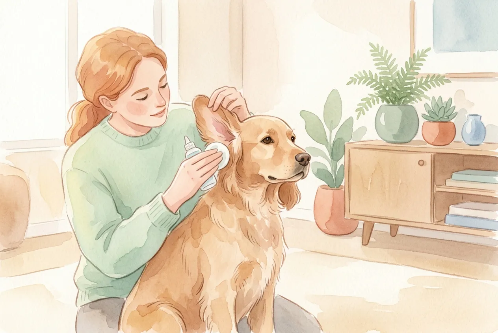
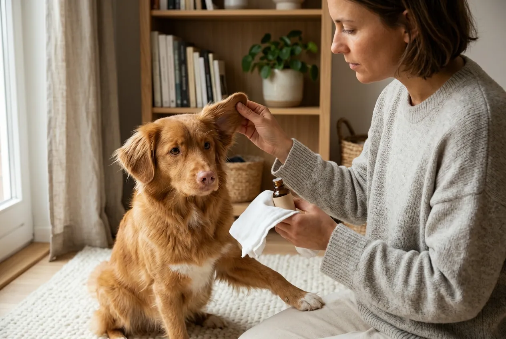
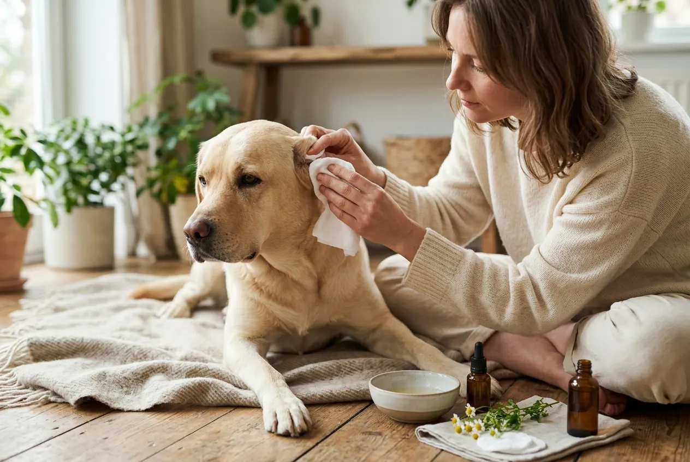
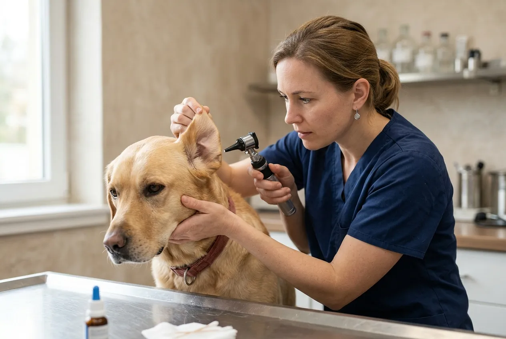

Hundeohren reinigen ist eine der wichtigsten Routinen in der Hundepflege und wird von vielen Haltern unterschätzt. Regelmäßige Ohrenpflege schützt deinen Hund vor schmerzhaften Entzündungen, erkennt Probleme früh und stärkt das Vertrauen zwischen Mensch und Tier. Besonders Rassen mit Hängeohren oder dichtem Ohrenhaar sind auf konsequente Pflege angewiesen.

In diesem Artikel erfährst du, wie oft und mit welchen Mitteln du die Ohren beim Hund reinigen solltest, welche Fehler du unbedingt vermeiden musst und wann ein Tierarztbesuch notwendig ist. Dazu gibt es eine klare Schritt-für-Schritt-Anleitung, einen ehrlichen Hausmittel-Check und rassenspezifische Tipps.

## Warum ist die Ohrenpflege beim Hund so wichtig?

Ohrenpflege beim Hund ist kein optionaler Luxus, sondern ein notwendiger Teil der Gesundheitsvorsorge. Der Gehörgang von Hunden ist anatomisch anders aufgebaut als beim Menschen, was ihn anfälliger für Schmutzansammlungen, Feuchtigkeit und Infektionen macht. Wer die Ohren regelmäßig kontrolliert und reinigt, kann Entzündungen oft verhindern, bevor sie überhaupt entstehen.

Laut [AniCura Deutschland](https://www.anicura.de/fuer-tierbesitzer/hund/wissensbank/hundeohren-reinigen/) zählt die Otitis externa, also die Entzündung des äußeren Gehörgangs, zu den häufigsten Erkrankungen beim Hund überhaupt. Frühzeitige Pflege ist die effektivste Vorbeugung.

Zur vollständigen Fellpflege gehört die Ohrenpflege unbedingt dazu. Mehr zur ganzheitlichen Körperpflege findest du im [Fellpflege beim Hund](https://hundewissen-mit-kopf.de/hundepflege/fellpflege-hund/) Ratgeber.

### Anatomie des Hundeohrs: Gehörgang und Besonderheiten

Der Gehörgang des Hundes verläuft im Gegensatz zum menschlichen Gehörgang L-förmig: erst senkrecht nach unten, dann waagerecht zum Trommelfell. Diese Form sorgt dafür, dass Schmutz, Cerumen (Ohrenschmalz), Wasser und abgestorbene Hautzellen sich leicht am Boden des vertikalen Kanals ansammeln und schlechter von alleine abfließen.

Erschwerend kommt hinzu, dass der Gehörgang von Hunden feucht und warm ist, also ideale Bedingungen für Bakterien und Hefepilze bietet. Bei Hunden mit Hängeohren ist die Belüftung zusätzlich eingeschränkt, weil die Ohrmuschel wie ein Deckel über der Öffnung liegt. Die Vetmeduni Wien betont, dass diese anatomische Besonderheit erklärt, warum Hunde so viel häufiger an Ohrproblemen leiden als Katzen oder Menschen.

### Häufige Ohrprobleme und wie Pflege sie verhindert

Zu den häufigsten Ohrproblemen beim Hund zählen Otitis externa (Außenohr-Entzündung), Hefepilzinfektionen, Ohrräude (durch Milben) und Fremdkörper wie Grassamen. Regelmäßiges Ohren reinigen beim Hund ermöglicht es, Veränderungen frühzeitig zu bemerken, bevor Schmerzen oder chronische Schäden entstehen.

Konsequente Ohrenpflege beim Hund reduziert nachweislich die Häufigkeit von Tierarztbesuchen wegen Ohrenerkrankungen. Wer seinen Hund einmal pro Woche kurz kontrolliert, erkennt Auffälligkeiten wie Rötung, ungewöhnlichen Geruch oder vermehrten Ausfluss sofort.

Zusammenfassung: Ohrenpflege beim Hund

<ul>
<li><strong>L-förmiger Gehörgang</strong> -- Hunde sind anatomisch anfälliger für Schmutz und Feuchtigkeit als Menschen</li>
<li><strong>Häufigste Erkrankung</strong> -- Otitis externa zählt zu den Top-Diagnosen in der Kleintierpraxis</li>
<li><strong>Regelmäßige Kontrolle</strong> -- Wöchentlicher Blick ins Ohr erkennt Probleme, bevor sie schmerzhaft werden</li>
<li><strong>Prävention wirkt</strong> -- Konsequente Pflege reduziert Entzündungen und Tierarztkosten spürbar</li>
</ul>

## Wie oft sollte man die Ohren beim Hund reinigen?

Wie oft du die Ohren beim Hund reinigen solltest, hängt vor allem von Rasse, Ohrform und individuellem Cerumen-Aufkommen ab. Eine pauschale Empfehlung gibt es nicht, aber es gibt klare Faustregeln, die für die meisten Hunde gut funktionieren.

Grundsätzlich gilt: Kontrolle öfter als Reinigung. Nicht jede Kontrolle muss in eine vollständige Reinigung münden. Wenn das Ohr sauber, geruchlos und nicht gerötet ist, reicht ein kurzer Blick. Wer seinen Hund regelmäßig [badet](https://hundewissen-mit-kopf.de/hundepflege/hund-baden/), sollte die Ohren direkt danach prüfen, da eingedrungenes Wasser das Entzündungsrisiko erhöht.

### Reinigungshäufigkeit je nach Rasse und Ohrtyp

Hunde mit Hängeohren wie Beagle, Basset Hound, Cocker Spaniel oder Labrador brauchen häufigere Pflege als Hunde mit aufrecht stehenden Ohren wie Husky oder Schäferhund. Bei Hängeohren empfehlen Tierärzte eine Kontrolle und ggf. Reinigung alle 1 bis 2 Wochen.

Hunde mit Stehohren und wenig Ohrenhaar kommen meist mit einer Reinigung alle 3 bis 4 Wochen gut aus. Hunde mit sehr viel Ohrenhaar, etwa Pudel oder Malteser, können häufiger Verstopfungen im Gehörgang entwickeln und brauchen zusätzlich regelmäßiges Trimmen des Ohrhaars.

| Ohrtyp | Rassen-Beispiele | Empfohlene Reinigungshäufigkeit |
|---|---|---|
| Hängeohren | Beagle, Basset, Cocker Spaniel | Alle 1 bis 2 Wochen |
| Stehohren | Husky, Schäferhund, Spitz | Alle 3 bis 4 Wochen |
| Viel Ohrenhaar | Pudel, Malteser, Bichon | Alle 1 bis 2 Wochen + Trimmen |
| Falzohren | Scottish Fold (selten beim Hund) | Nach tierärztlicher Empfehlung |

### Welpen Ohren reinigen: Was ist zu beachten?

Welpen Ohren reinigen ist ein wichtiger Bestandteil der frühen Sozialisation. Je früher ein Welpe lernt, dass die Berührung seiner Ohren normal und angenehm ist, desto einfacher wird die Pflege im Erwachsenenalter.

Welpen produzieren oft weniger Cerumen als ausgewachsene Hunde, daher ist eine intensive Reinigung selten nötig. Wichtig ist vor allem das regelmäßige Berühren und Inspizieren der Ohren, kombiniert mit positiver Verstärkung durch Leckerlis und Lob. Verwende bei Welpen nur milde, speziell für Hunde geeignete Reinigungsprodukte und konsultiere bei Unsicherheiten deinen Tierarzt.

1-2×

pro Woche bei Hängeohren

4×

pro Monat bei Stehohren

5×

häufiger Otitis bei Hängeohren vs. Stehohren

sofort

nach dem Baden kontrollieren

## Ohren beim Hund reinigen: Schritt-für-Schritt-Anleitung

Das Ohren beim Hund reinigen gelingt am besten mit der richtigen Vorbereitung, ruhiger Atmosphäre und dem passenden Material. Plane für die erste Reinigung mehr Zeit ein als du glaubst zu brauchen, besonders wenn dein Hund noch nicht daran gewöhnt ist.

1

Vorbereitung

Material bereitlegen: Ohrenreiniger, Wattebälle, weiches Tuch. Hund in ruhiger Umgebung platzieren und beruhigen.

2

Ohr inspizieren

Ohrmuschel vorsichtig aufklappen und in den sichtbaren Bereich des Gehörgangs schauen. Auf Rötung, Geruch oder Ausfluss achten.

3

Reiniger einträufeln

Den Ohrenreiniger gemäß Produktanweisung in den Gehörgang einträufeln, ohne die Applikatorspitze zu berühren.

4

Massieren

Ohrmuschel am Ansatz 20 bis 30 Sekunden sanft massieren, damit der Reiniger den Schmutz löst. Ein leises Gluckern ist normal.

5

Schütteln lassen

Hund kurz loslassen, damit er den Kopf schütteln kann. Das befördert gelösten Schmutz aus dem Gehörgang.

✓

Reinigen und belohnen

Sichtbaren Schmutz mit Watteball oder weichem Tuch entfernen. Nie tief einführen. Mit Leckerli belohnen.

### Das richtige Material: Ohrenreiniger, Tücher & Co.

Für das Ohren reinigen beim Hund brauchst du nur wenige, aber die richtigen Hilfsmittel. Das Wichtigste ist ein speziell für Hunde entwickelter Ohrenreiniger auf wässriger oder öliger Basis. Produkte mit Salicylsäure oder Chlorhexidin helfen dabei, Bakterien und Hefepilze zu reduzieren, ohne die empfindliche Schleimhaut zu reizen.

Zusätzlich brauchst du weiche Wattebälle oder spezielle Reinigungspads. Normale Kosmetik-Wattepads sind oft zu hart. Alternativ eignen sich weiche Mikrofasertücher. Halte außerdem Leckerlis bereit, um die Reinigung positiv zu verknüpfen.

**Das brauchst du:**

- Tierärztlich empfohlener Ohrenreiniger für Hunde
- Weiche Wattebälle oder Reinigungspads
- Weiches Mikrofasertuch
- Leckerlis zur Belohnung
- Gute Beleuchtung (Stirnlampe hilfreich)

### Die Reinigung Schritt für Schritt erklärt

Beginne immer mit einer Sichtkontrolle. Klappe die Ohrmuschel behutsam auf und schaue in den sichtbaren Teil des Gehörgangs. Riecht das Ohr unangenehm oder siehst du dunklen, krümeligen oder eitrigen Ausfluss, ist ein Tierarztbesuch vor der Reinigung sinnvoll.

Wenn das Ohr unauffällig ist, träufelst du den Ohrenreiniger in den Gehörgang. Halte die Ohrmuschel dabei leicht nach oben, damit die Flüssigkeit gut einläuft. Massiere anschließend den Gehörgang am Ansatz sanft, bis du ein leises Gluckern hörst. Das zeigt, dass der Reiniger wirkt. Lass deinen Hund dann schütteln und entferne den herausgelösten Schmutz mit einem Watteball. Führe nichts tiefer als 1 bis 2 Zentimeter in den Gehörgang ein.

### Was tun, wenn der Hund sich nicht die Ohren reinigen lässt?

Viele Hunde wehren sich anfangs gegen die Ohrenreinigung, besonders wenn sie schlechte Erfahrungen gemacht haben oder das Prozedere schlicht ungewohnt ist. Zwang ist hier kontraproduktiv und kann das Vertrauen dauerhaft beschädigen.

Der beste Ansatz ist schrittweise Desensibilisierung: Berühre zunächst nur die Ohrmuschel, belohne sofort mit einem Leckerli und höre auf. Steigere die Intensität über mehrere Tage, bis der Hund die Berührung toleriert. Erst dann beginne mit der eigentlichen Reinigung. Kurze Einheiten von 1 bis 2 Minuten sind effektiver als lange Kraftakte. Wenn der Hund dauerhaft Schmerzen zeigt oder aggressiv reagiert, sollte ein Tierarzt oder professioneller Hundefriseur einbezogen werden.

## Den richtigen Ohrenreiniger für den Hund wählen

Der Ohrenreiniger für den Hund ist das zentrale Hilfsmittel bei der Ohrenpflege. Das Angebot im Fachhandel ist groß, die Qualitätsunterschiede sind erheblich. Ein guter Ohrenreiniger löst Cerumen und Schmutz zuverlässig, ohne die empfindliche Schleimhaut zu reizen oder das natürliche Milieu des Gehörgangs zu stören.

Tierärzte empfehlen in der Regel Produkte, die speziell für den Einsatz im Hundegehörgang entwickelt wurden. Produkte für Menschen sind nicht geeignet, da sie einen anderen pH-Wert haben und reizen können. Die [Bundestieraerztekammer](https://www.bundestieraerztekammer.de/) empfiehlt, bei der Produktwahl immer auf die tierärztliche Zulassung und Verträglichkeitstests zu achten.

### Worauf beim Kauf eines Ohrenreinigers achten?

Achte beim Kauf auf folgende Kriterien:

**pH-Wert:** Der Ohrenreiniger sollte einen pH-Wert haben, der auf die Hundeschleimhaut abgestimmt ist (leicht sauer bis neutral, ca. pH 5,5 bis 7,0).

**Inhaltsstoffe:** Produkte mit Salicylsäure, Borsäure oder Chlorhexidin helfen gegen Bakterien und Pilze. Verzichte auf Produkte mit starken Duftstoffen oder Alkohol, da diese reizen.

**Applikatorform:** Eine lange, weiche Applikatorspitze erleichtert das Einträufeln ohne direkten Kontakt mit dem Gehörgang.

**Tierärztliche Empfehlung:** Lass dir im Zweifelsfall ein konkretes Produkt von deiner Tierärztin oder deinem Tierarzt empfehlen, besonders wenn dein Hund zu Entzündungen neigt.

Gute Ohrenreiniger: Merkmale

<ul>
<li>Speziell für Hunde entwickelt und getestet</li>
<li>Abgestimmter pH-Wert (5,5 bis 7,0)</li>
<li>Wirkstoffe gegen Bakterien und Pilze (z.B. Chlorhexidin)</li>
<li>Keine Duftstoffe oder Alkohol</li>
<li>Tierärztlich empfohlen oder zugelassen</li>
<li>Lange, weiche Applikatorspitze</li>
</ul>

Schlechte Ohrenreiniger: Warnsignale

<ul>
<li>Produkte für Menschen oder andere Tierarten</li>
<li>Starke Duftstoffe oder Alkohol als Hauptinhaltsstoff</li>
<li>Keine Angaben zu pH-Wert oder Wirkstoffen</li>
<li>Sehr kurze oder starre Applikatorspitze</li>
<li>Keine tierärztliche Empfehlung oder Zulassung</li>
<li>Unbekannte Herkunft oder fehlende Inhaltsstoffliste</li>
</ul>

## Ohren reinigen beim Hund mit Hausmitteln – was ist sicher?

Das Thema Hausmittel zum Ohren reinigen beim Hund ist weit verbreitet, aber mit Vorsicht zu genießen. Nicht alles, was im Internet empfohlen wird, ist tatsächlich sicher oder wirksam. Im Zweifelsfall gilt: Lieber ein bewährtes Fertigprodukt verwenden als zu experimentieren.

Zum Thema [Hund waschen mit Hausmitteln](https://hundewissen-mit-kopf.de/hundepflege/hund-waschen-hausmittel/) gibt es bereits einen ausführlichen Ratgeber, der zeigt, dass Hausmittel oft weniger harmlos sind als gedacht.

### Apfelessig, Kokosöl & Co.: Chancen und Risiken

**Apfelessig** wird häufig als natürlicher Ohrenreiniger empfohlen, weil er antimykotische Eigenschaften hat. Das Problem: Apfelessig ist sauer (pH ca. 3) und kann die ohnehin empfindliche Schleimhaut des Gehörgangs reizen oder sogar verätzen, besonders wenn bereits kleine Entzündungen oder Wunden vorhanden sind. Tierärzte raten in der Regel davon ab.

**Kokosöl** wirkt in Laborstudien antimikrobiell, ist aber ölig und kann im Gehörgang einen Film hinterlassen, der Schmutz eher bindet als löst. Für die Ohrenreinigung ist es nicht geeignet.

**Lauwarm abgekochtes Wasser** ist die einzige Hausmittel-Option, die Tierärzte in Ausnahmefällen für die oberflächliche Reinigung der Ohrmuschel akzeptieren, nicht aber für den Gehörgang selbst.

| Hausmittel | Wirkung | Risiko | Empfehlung |
|---|---|---|---|
| Apfelessig | Antimykotisch | Reizung, Verätzung | Nicht empfohlen |
| Kokosöl | Antimikrobiell | Schmutzfilm, verstopft Poren | Nicht empfohlen |
| Abgekochtes Wasser | Mechanische Reinigung | Feuchtigkeit im Gehörgang | Nur Ohrmuschel, mit Vorsicht |
| Olivenöl | Cerumen lösen | Keine ausreichende Reinigung | Nicht empfohlen |

### Darf man Wattestäbchen zum Ohren reinigen beim Hund verwenden?

Nein. Wattestäbchen sind beim Hundeohren reinigen tabu. Der L-förmige Gehörgang sorgt dafür, dass ein Wattestäbchen Schmutz nicht herausholt, sondern ihn tiefer in den Kanal schiebt. Im schlimmsten Fall kann das Trommelfell verletzt werden, was zu dauerhaften Hörschäden führen kann.

Verwende stattdessen weiche Wattebälle oder spezielle Reinigungspads, die nur in den sichtbaren, äußeren Bereich des Ohrs eingeführt werden.

⚠️

<strong>Vorsicht bei Hausmitteln</strong>

Apfelessig, Kokosöl und andere Hausmittel sind kein sicherer Ersatz für tierärztlich empfohlene Ohrenreiniger. Sie können die empfindliche Schleimhaut reizen und bestehende Probleme verschlimmern. Wende dich bei Unsicherheit immer an deine Tierärztin oder deinen Tierarzt.

## Rassenspezifische Besonderheiten bei der Ohrenpflege

Nicht alle Hunde haben dieselben Anforderungen an die Ohrenpflege. Rasse, Ohrform und Fellstruktur bestimmen maßgeblich, wie aufwendig die Pflege sein muss und worauf du besonders achten solltest.

🐕

Hängeohren

Beagle, Basset, Cocker Spaniel: Schlechte Belüftung, hohes Entzündungsrisiko. Wöchentliche Kontrolle nötig.

🦮

Stehohren

Schäferhund, Husky, Spitz: Gute Belüftung, geringeres Risiko. Monatliche Reinigung meist ausreichend.

🐩

Viel Ohrenhaar

Pudel, Malteser, Bichon: Ohrenhaar zusätzlich trimmen lassen, um Belüftung zu verbessern.

🏊

Wasserhunde

Labrador, Golden Retriever, Irish Water Spaniel: Nach jedem Schwimmen Ohren trocknen und kontrollieren.

### Hunde mit Hängeohren: Erhöhtes Risiko, mehr Pflege

Hunde mit Hängeohren tragen ihre Ohrmuscheln wie einen Deckel über dem Gehörgang. Das verhindert die natürliche Belüftung und schafft ein feucht-warmes Milieu, in dem Bakterien und Hefepilze ideal gedeihen. Laut der Tierärztlichen Fakultät der LMU München erkranken Hunde mit Hängeohren bis zu fünfmal häufiger an Otitis externa als Hunde mit Stehohren.

Für diese Hunde ist eine wöchentliche Kontrolle Pflicht. Wische nach jedem Spaziergang im Regen oder nach dem Baden die Ohrmuschel trocken und lüfte das Ohr kurz, indem du die Ohrmuschel vorsichtig nach oben hältst.

### Hunde mit viel Ohrenhaar: Reinigung und Trimmen

Bei Rassen wie Pudel oder Malteser wächst dichtes Haar im Gehörgang, das Schmutz und Feuchtigkeit binden kann. Regelmäßiges Ohren reinigen allein reicht hier oft nicht aus. Das Ohrenhaar sollte zusätzlich vom Hundefriseur oder Tierarzt regelmäßig getrimmt oder gezupft werden, um die Belüftung zu verbessern.

Mehr dazu, wie das Trimmen funktioniert und worauf du achten solltest, erklärt der Artikel [Hund trimmen](https://hundewissen-mit-kopf.de/hundepflege/hund-trimmen/).

## Wann muss der Hund wegen der Ohren zum Tierarzt?

Regelmäßiges Ohren reinigen beim Hund ersetzt keinen Tierarztbesuch bei akuten Symptomen. Bestimmte Zeichen weisen klar darauf hin, dass ein Problem vorliegt, das professionelle Behandlung erfordert.

### Warnsignale: Diese Symptome erfordern tierärztliche Hilfe

Folgende Symptome solltest du niemals ignorieren oder selbst behandeln:

**Rötung und Schwellung** im oder am Ohr deuten auf eine Entzündung hin. **Übler Geruch** ist fast immer ein Zeichen für Bakterien oder Hefepilze. **Dunkler, krümeliger Ausfluss** kann auf Ohrräude durch Milben hinweisen. **Eitriger Ausfluss** signalisiert eine fortgeschrittene Infektion. **Häufiges Kratzen am Ohr, Kopfschütteln oder Kopfschiefhalten** zeigen, dass dein Hund Schmerzen oder Juckreiz hat.

Bei all diesen Zeichen gilt: Sofort zum Tierarzt. Eine unbehandelte Otitis externa kann sich zu einer Mittelohrentzündung ausweiten und im schlimmsten Fall zu dauerhaften Hörschäden führen.

### Was kostet die Ohrenreinigung beim Tierarzt?

Die Kosten für eine Ohrenreinigung beim Tierarzt richten sich nach der Gebührenordnung für Tierärzte (GOT). Eine einfache Untersuchung und Reinigung kostet in der Regel zwischen 15 und 40 Euro. Wenn gleichzeitig eine Entzündung behandelt werden muss, kommen Kosten für Medikamente und ggf. weitere Untersuchungen hinzu, sodass die Gesamtrechnung auf 50 bis 150 Euro steigen kann.

Wer eine Tierkrankenversicherung hat, sollte prüfen, ob Ohrbehandlungen abgedeckt sind. Viele Tarife übernehmen zumindest einen Teil der Behandlungskosten.

✅ Wann zum Tierarzt? Checkliste Ohren

Rötung oder Schwellung im oder am Ohr

Unangenehmer oder fauliger Geruch aus dem Ohr

Dunkler, krümeliger oder eitriger Ausfluss

Häufiges Kratzen am Ohr oder Kopfschütteln

Kopfschiefhalten oder Gleichgewichtsprobleme

Schmerzen beim Berühren des Ohrs

✓

Ohr sauber, geruchlos, keine Rötung: Weiter selbst pflegen

## Häufige Fehler beim Ohren reinigen beim Hund

Selbst gut gemeinte Ohrenpflege kann Schaden anrichten, wenn sie falsch durchgeführt wird. Die häufigsten Fehler passieren aus Unwissenheit oder weil Tipps aus dem Internet unkritisch übernommen werden.

🚫

<strong>Diese Fehler können deinem Hund schaden</strong>

Wattestäbchen, Apfelessig im Gehörgang, zu häufige Reinigung mit aggressiven Mitteln und das Einführen von Gegenständen tief in den Gehörgang sind die häufigsten Ursachen für selbst verursachte Ohrprobleme beim Hund. Im Zweifel lieber einmal zu wenig als zu viel reinigen.

Zu den häufigsten Fehlern zählt auch das Reinigen zu oft oder mit zu viel Druck. Wer gesunde Ohren täglich reinigt, zerstört das natürliche Gleichgewicht der Ohrflora und kann Reizungen verursachen. Ebenso falsch ist es, die Reinigung bei Verdacht auf eine Entzündung fortzuführen, anstatt den Tierarzt aufzusuchen.

### Diese Mittel und Methoden solltest du unbedingt vermeiden

**Wattestäbchen:** Schiebt Schmutz tiefer in den Gehörgang, Verletzungsgefahr am Trommelfell.

**Apfelessig unverdünnt:** Zu sauer, reizt oder veräetzt die Schleimhaut, besonders bei vorhandenen Mikroverletzungen.

**Produkte für Menschen:** Falscher pH-Wert, falsche Zusammensetzung, Reizgefahr.

**Alkoholhaltige Mittel:** Trocknen die Schleimhaut aus und reizen den Gehörgang.

**Zu tiefes Einführen:** Alles, was tiefer als 1 bis 2 Zentimeter in den Gehörgang geführt wird, kann das Trommelfell beschädigen.

**Reinigung bei sichtbarer Entzündung:** Kann die Situation verschlimmern und eine bestehende Infektion tiefer treiben.

Zum Vergleich: Auch beim [Hund bürsten](https://hundewissen-mit-kopf.de/hundepflege/hund-buersten/) gilt, dass das richtige Werkzeug und die richtige Technik entscheidend sind. Was bei Fell und Ohren verbindet: Regelmäßigkeit schlägt Intensität.

## Fazit: Hundeohren reinigen leicht gemacht

Hundeohren reinigen ist keine Hexerei, aber es erfordert das richtige Wissen, die passenden Mittel und vor allem Konsequenz. Wer regelmäßig kontrolliert, frühzeitig eingreift und auf bewährte Produkte setzt, schützt seinen Hund zuverlässig vor schmerzhaften Ohrenproblemen.

Die wichtigsten Punkte zusammengefasst: Hängeohren brauchen häufigere Pflege als Stehohren. Wattestäbchen und Hausmittel wie Apfelessig gehören nicht in den Gehörgang. Ein guter Ohrenreiniger für Hunde ist die beste Investition in die Ohrgesundheit. Und bei Warnsignalen wie Geruch, Rötung oder Ausfluss gilt: sofort zum Tierarzt, nicht abwarten.

✅

<strong>Gut gepflegte Ohren, glücklicher Hund</strong>

Mit der richtigen Routine, dem passenden Ohrenreiniger und einem wachsamen Blick bei jeder Kontrolle ist die Ohrenpflege in wenigen Minuten erledigt. Dein Hund wird es dir danken, und du sparst langfristig Tierarztkosten und vermeidest unnötige Schmerzen für deinen Vierbeiner.

## Häufige Fragen: Ohren reinigen beim Hund (FAQ)

Die häufigsten Fragen rund um das Ohren reinigen beim Hund haben wir hier kurz und klar beantwortet. Ausführliche Antworten findest du in den jeweiligen Abschnitten des Artikels.