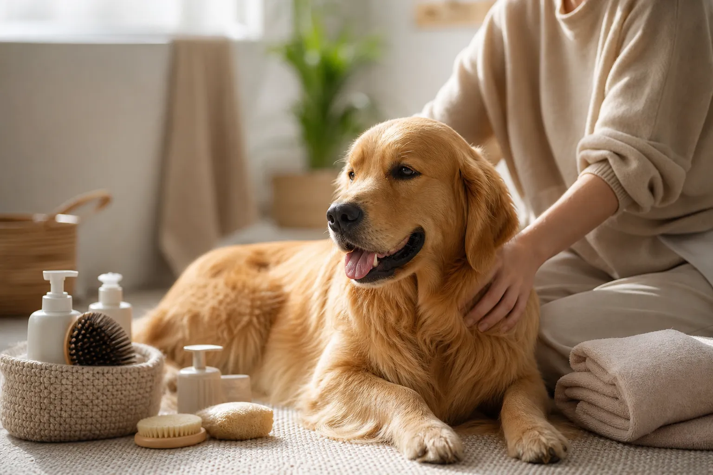

Der Serponado ist eine seltene, noch nicht offiziell anerkannte Hunderasse, die vor allem durch ihr freundliches Wesen, ihre Lernbereitschaft und ihre mittlere Größe Aufmerksamkeit gewinnt. Wer sich für diese Rasse interessiert, sollte sich gut informieren: Da der Serponado weder vom [VDH](https://www.vdh.de/) noch von der FCI als eigenständige Rasse geführt wird, variieren Aussehen, Charakter und Gesundheit je nach Zuchtlinie deutlich.

In diesem Rasseportrait erfährst du alles Wesentliche zum Serponado: Herkunft, Größe, Gewicht, Charakter, Haltung, Erziehung, Pflege, Gesundheit und Kosten. Du bekommst konkrete Empfehlungen, worauf du als künftiger Halter achten solltest, und erfährst, ob diese Rasse zu deinem Lebensstil passt. Ziel ist es, dir eine fundierte Grundlage für eine verantwortungsvolle Entscheidung an die Hand zu geben.

## Serponado: Die Hunderasse im Portrait

Zusammenfassung: Serponado auf einen Blick

<ul>
<li><strong>Mittelgroße Hybridrasse</strong> – Schulterhöhe etwa 40–55 cm, Gewicht 12–22 kg</li>
<li><strong>Freundlich und lernwillig</strong> – sozial verträglich, menschenbezogen, bei konsequenter Erziehung gut führbar</li>
<li><strong>Aktiver Familienhund</strong> – braucht täglich 1,5–2 Stunden Bewegung und mentale Auslastung</li>
<li><strong>Mäßiger Pflegeaufwand</strong> – regelmäßiges Bürsten, Ohren- und Zahnkontrolle, keine extreme Fellpflege</li>
</ul>

Der Serponado ist ein mittelgroßer Hund mit ausgewogenem Körperbau, dichtem Fell und einem typischerweise freundlichen Gesichtsausdruck. Die Rasse ist bisher weder vom Verband für das Deutsche Hundewesen noch von der FCI anerkannt, was bedeutet, dass es keinen offiziellen Standard für Größe, Farbe und Verhalten gibt. Züchter orientieren sich an den Eigenschaften der Elterntiere und definieren eigene Linien.

Wer einen Serponado in Erwägung zieht, sollte sich darüber im Klaren sein, dass viele Eigenschaften – von der genauen Endgröße bis zum Temperament – stark von der Herkunft des einzelnen Hundes abhängen. Wenn du dir nicht sicher bist, ob ein Serponado oder eine etabliertere Rasse besser passt, hilft ein Blick auf unsere Übersicht zur passenden [Hunderasse für Anfänger](https://hundewissen-mit-kopf.de/hunderassen/hunderasse-fuer-anfaenger/) bei der Orientierung.

### Herkunft und Geschichte des Serponado

Die genaue Entstehungsgeschichte des Serponado ist nicht eindeutig dokumentiert. Es handelt sich um eine relativ junge Hybridrasse, die aus der Verpaarung mittelgroßer Begleithunde entstanden ist. Im Gegensatz zu klassischen Rassen wie dem Labrador oder dem Border Collie gibt es keinen offiziellen Ursprungsverein und kein international gültiges Zuchtbuch.

In Deutschland wird die Bezeichnung Serponado bisher fast ausschließlich von Privatzüchtern genutzt. Eine Anerkennung durch den VDH ist Stand 2026 nicht erfolgt. Wer Interesse an dieser Rasse hat, ist deshalb auf die Seriosität einzelner Züchter angewiesen. Wichtig ist, dass die Elterntiere auf rassetypische Erkrankungen untersucht und nachweislich gesund sind. Eine offizielle Anerkennung könnte sich in den kommenden Jahren entwickeln, sobald sich eine stabile Population mit einheitlichen Merkmalen etabliert hat.

### Serponado Größe, Gewicht und Steckbrief

Beim Thema Serponado Größe und Gewicht zeigt sich die Vielfalt der Rasse besonders deutlich. Im Schnitt erreicht ein ausgewachsener Serponado eine Schulterhöhe von 40 bis 55 Zentimetern und ein Gewicht zwischen 12 und 22 Kilogramm. Rüden sind dabei meist etwas größer und schwerer als Hündinnen.

| Merkmal | Angabe |
|---|---|
| Schulterhöhe | 40–55 cm |
| Gewicht | 12–22 kg |
| Lebenserwartung | 12–15 Jahre |
| Felltyp | mittellang, dicht |
| Aktivitätslevel | hoch |
| FCI-Anerkennung | Nein |
| Geeignet für Anfänger | bedingt |
| Pflegeaufwand | moderat |

Die Lebenserwartung liegt mit 12 bis 15 Jahren im typischen Bereich für mittelgroße Hunde. Das Fell ist meist mittellang und dicht, was den Hund vor Witterung schützt, aber regelmäßige Pflege erfordert.

## Charakter und Wesen des Serponado

Der Serponado Charakter wird in der Regel als freundlich, aufmerksam und sehr menschenbezogen beschrieben. Hunde dieser Rasse zeigen eine ausgeprägte Bindungsbereitschaft zu ihren Bezugspersonen und reagieren in den meisten Fällen aufgeschlossen auf neue Situationen. Gleichzeitig sind sie wachsam, ohne dabei übermäßig zu bellen oder aggressiv zu wirken.

Typisch ist eine hohe Lernbereitschaft, die viele Halter von Anfang an positiv überrascht. Der Serponado möchte gefallen, arbeitet gern mit seinem Menschen zusammen und reagiert empfindlich auf harten Umgang. Lautes Schimpfen oder körperliche Strafen wirken bei dieser Rasse kontraproduktiv und können das Vertrauen nachhaltig stören. Laut [Bundestierärztekammer](https://www.bundestieraerztekammer.de/) ist eine konsequente, aber positive Erziehung der Schlüssel zu einem ausgeglichenen Hund.

### Serponado im Familienalltag: Sozialverhalten und Verträglichkeit

Im Familienalltag zeigt sich der Serponado in der Regel als geduldiger Begleiter. Mit Kindern geht er meist freundlich um, vorausgesetzt, die Kinder lernen den respektvollen Umgang mit dem Tier. Auch gegenüber anderen Hunden ist er häufig verträglich, sofern er von klein auf gut sozialisiert wurde.

Eine sorgfältige Prägung in den ersten Lebensmonaten ist entscheidend. Wer hier einmal versäumt, was möglich gewesen wäre, holt es später nur schwer auf. Eine strukturierte [Sozialisierung beim Welpen](https://hundewissen-mit-kopf.de/erziehung-verhalten/sozialisierung-welpe-checkliste/) hilft dabei, den Hund auf unterschiedliche Menschen, Umgebungen, Geräusche und Tiere positiv vorzubereiten. Gegenüber Katzen und kleineren Haustieren ist der Serponado meist tolerant, wenn er sie früh kennenlernt. Bei fremden Hunden zeigt er ein normales, ausgewogenes Verhalten, ohne übermäßige Dominanz oder Ängstlichkeit.

### Für wen ist der Serponado geeignet?

Der Serponado eignet sich für Menschen, die Zeit, Geduld und Freude an aktiver Hundehaltung mitbringen. Aktive Familien, Paare und sportliche Singles, die regelmäßig wandern, joggen oder Radfahren, finden in ihm einen idealen Partner. Auch berufstätige Halter können gut mit einem Serponado leben, wenn sie eine Betreuung oder feste Pausenzeiten organisieren.

Weniger geeignet ist die Rasse für Menschen, die einen rein ruhigen Sofahund suchen, oder für Halter mit sehr wenig Zeit. Auch reine Stadtbewohner ohne Möglichkeit zu Auslauf in der Natur sollten die Anschaffung gut überdenken.

1,5–2 h

Bewegung pro Tag

12–15

Jahre Lebenserwartung

5–10 min

tägliche Fellpflege

40–55 cm

Schulterhöhe

## Serponado Haltung: Platz, Auslastung und Alltag

Die Serponado Haltung erfordert vor allem eines: ein klar strukturierter Alltag mit ausreichend Bewegung und mentaler Beschäftigung. Da es sich um einen mittelgroßen, aktiven Hund handelt, reicht ein einfacher Spaziergang um den Block nicht aus. Der Serponado braucht abwechslungsreiche Reize, freies Laufen und regelmäßige Trainingseinheiten.

Wichtig ist außerdem, dass der Hund einen ruhigen Rückzugsort in der Wohnung oder im Haus hat. Ein eigener Schlafplatz, an dem er nicht ständig gestört wird, fördert die Entspannung und reduziert Stress. Laut Empfehlungen des [Deutschen Tierschutzbundes](https://www.tierschutzbund.de/) sollten Hunde nicht länger als vier bis sechs Stunden allein bleiben – das gilt auch für den Serponado.

### Wohnungshaltung oder Haus mit Garten – was passt zum Serponado?

Ein Haus mit Garten ist nicht zwingend nötig, aber durchaus von Vorteil. Der Garten ersetzt allerdings keinen Spaziergang, sondern dient lediglich als Ergänzung. Auch in einer ausreichend großen Wohnung kann der Serponado gut gehalten werden, sofern die tägliche Bewegung sichergestellt ist.

Wichtig sind kurze Wege ins Grüne, sichere Auslaufmöglichkeiten und eine ruhige Umgebung im Treppenhaus. Bei der Wohnungshaltung sollten ein bis zwei längere Spaziergänge am Tag fest eingeplant werden, zusätzlich zu kürzeren Gassirunden. In Mehrfamilienhäusern empfiehlt sich eine frühzeitige Absprache mit Vermieter und Nachbarn, da Hundehaltung in Mietwohnungen rechtlich nicht überall ohne Weiteres erlaubt ist.

### Beschäftigung und Auslastung: So bleibt der Serponado ausgeglichen

Der Serponado ist intelligent und lernfreudig, weshalb er nicht nur körperliche, sondern auch geistige Beschäftigung braucht. Suchspiele, Intelligenzspielzeug, Apportieraufgaben und kleine Trainingseinheiten zwischendurch sorgen für mentale Auslastung. Auch Hundesportarten wie Agility, Mantrailing oder Dogdance kommen für ihn in Frage.

🚶

Spaziergänge

Täglich mindestens 1,5 bis 2 Stunden, möglichst abwechslungsreich.

🧠

Kopfarbeit

Suchspiele, Schnüffelteppich und kleine Trainingseinheiten täglich.

🐕

Hundekontakt

Regelmäßige Treffen mit verträglichen Artgenossen fördern die Sozialkompetenz.

😴

Ruhephasen

17 bis 20 Stunden Schlaf und Ruhe pro Tag sind völlig normal.

## Serponado Erziehung: Tipps für einen gelungenen Start

Eine gute Serponado Erziehung beginnt direkt nach dem Einzug und basiert auf positiven Methoden, klaren Regeln und konsequenter Wiederholung. Wichtig ist, von Anfang an festzulegen, was erlaubt ist und was nicht. Wer als Welpe aufs Sofa darf, darf später nicht plötzlich heruntergeschickt werden – Konsequenz ist hier entscheidend.

1

Vorbereitung

Schlafplatz, Futter, Spielzeug und Tierarzttermin vorab organisieren.

2

Eingewöhnung

Erste Tage ruhig gestalten, feste Bezugsperson, klare Strukturen schaffen.

3

Grundkommandos

Sitz, Platz, Hier und Bleib spielerisch und kurz üben.

4

Sozialisierung

Verschiedene Menschen, Tiere, Geräusche und Untergründe kennenlernen.

5

Hundeschule

Welpengruppe oder Junghundekurs ab der 10. bis 12. Lebenswoche.

✓

Routine

Tagesablauf mit festen Zeiten für Futter, Gassi und Ruhe etablieren.

Belohnungen mit Futter, Stimme oder Spielzeug wirken bei dieser Rasse besser als Druck oder Bestrafung. Kurze, häufige Übungseinheiten von 5 bis 10 Minuten sind effektiver als lange Trainingsphasen, die den Hund überfordern.

### Serponado Welpe erziehen: Die ersten Wochen

Ein Serponado Welpe sollte frühestens mit 8 bis 10 Wochen vom Züchter abgeholt werden. In dieser Phase ist das Lernfenster für die Sozialisierung besonders offen. Was der Welpe in den ersten Lebensmonaten erlebt, prägt ihn ein Leben lang. Verschiedene Menschen, Untergründe, Verkehrslärm, Tierarztbesuche und Hundebegegnungen sollten in kleinen, positiven Dosen Teil des Alltags werden.

Stubenreinheit, Beißhemmung und Alleinbleiben sind weitere zentrale Themen der ersten Wochen. Hier helfen Geduld, regelmäßiges Lob und ein fester Tagesablauf. Eine fundierte Anleitung zur [Welpenerziehung](https://hundewissen-mit-kopf.de/erziehung-verhalten/welpenerziehung/) liefert dir Schritt-für-Schritt-Strategien für die wichtigsten Themen. Auch das Training der [Leinenführigkeit](https://hundewissen-mit-kopf.de/erziehung-verhalten/leinenfuehrigkeit-trainieren/) sollte früh beginnen, damit gemeinsame Spaziergänge entspannt verlaufen.

### Ist der Serponado für Anfänger geeignet?

Der Serponado ist bedingt für Anfänger geeignet. Er bringt zwar viele positive Eigenschaften wie Lernfreude und Menschenbezug mit, fordert aber auch klare Regeln, viel Bewegung und mentale Auslastung. Wer bisher noch nie einen Hund hatte, sollte sich bereits vor der Anschaffung intensiv in das Thema einarbeiten.

Praktische Tipps für Anfänger:
- Frühzeitig eine Hundeschule auswählen und anmelden
- Erziehungsgrundlagen in Büchern oder Online-Kursen erarbeiten
- Realistisch planen: täglich mindestens 2 Stunden für den Hund einplanen
- Bei Unsicherheiten frühzeitig einen Hundetrainer hinzuziehen
- Geduld mit sich selbst und dem Hund haben – Lernen braucht Zeit

## Serponado Pflege: Fell, Körper und Gesundheitsroutine

Die Serponado Pflege ist im Vergleich zu sehr langhaarigen Rassen überschaubar, aber dennoch regelmäßig nötig. Ein mittellanges, dichtes Fell, gesunde Ohren, gepflegte Krallen und saubere Zähne sind die wichtigsten Pflege-Bereiche. Tägliche kurze Kontrollen helfen, Probleme früh zu erkennen.

### Fellpflege und Körperpflege beim Serponado

Beim Thema Serponado Pflege Fell und Körper gilt: lieber regelmäßig kurz als selten gründlich. Ein- bis zweimal pro Woche sollte das Fell mit einer Bürste oder einem Striegel durchgekämmt werden, um lose Haare zu entfernen und Verfilzungen vorzubeugen. Während des Fellwechsels im Frühjahr und Herbst kann tägliches Bürsten nötig sein.

Gebadet wird der Hund nur bei starker Verschmutzung, idealerweise mit einem milden Hundeshampoo. Häufiges Baden trocknet die Haut aus und stört die natürliche Fettschicht. Eine ausführliche Anleitung zur [Fellpflege beim Hund](https://hundewissen-mit-kopf.de/hundepflege/fellpflege-hund/) zeigt dir, welche Bürsten und Techniken sich bei welchen Felltypen bewähren.

Ohren sollten wöchentlich kontrolliert und bei Bedarf vorsichtig gereinigt werden. Krallen werden je nach Abnutzung alle 4 bis 8 Wochen geschnitten. Zähne profitieren von regelmäßigem Bürsten oder speziellen Kausnacks.

### Ernährung und tägliche Pflegegewohnheiten

Eine ausgewogene Ernährung bildet die Basis für ein gesundes Hundeleben. Hochwertiges Futter mit hohem Fleischanteil, ohne unnötige Zuckerzusätze und mit klar deklarierten Zutaten ist die beste Wahl. Die Futtermenge richtet sich nach Gewicht, Alter und Aktivitätsniveau des Hundes.

✅ Tägliche und wöchentliche Pflegeroutine

✓

Täglich: Augen, Ohren und Pfoten kurz kontrollieren

✓

Täglich: frisches Wasser und ausgewogene Futtermenge

✓

2× pro Woche: Fell gründlich bürsten

2–3× pro Woche: Zähne putzen oder Zahnsnack geben

Alle 4–8 Wochen: Krallen kontrollieren und kürzen

Bei Bedarf: Baden mit mildem Hundeshampoo

## Gesundheit des Serponado: Typische Erkrankungen und Vorsorge

⚠️

<strong>Wichtiger Hinweis</strong>

Dieser Artikel ersetzt keinen Tierarztbesuch. Bei auffälligen Symptomen wie Lahmheit, Appetitlosigkeit, häufigem Kratzen oder Atemproblemen sollte immer eine tierärztliche Untersuchung erfolgen.

Die Serponado Gesundheit hängt stark von der Zuchtlinie und den Elterntieren ab. Da es sich um eine Hybridrasse handelt, profitiert der Serponado oft vom sogenannten Heterosis-Effekt, also einer gewissen genetischen Vielfalt. Gleichzeitig können aber auch Erkrankungen der Elternrassen weitergegeben werden.

### Rassetypische Krankheiten beim Serponado

Beim Thema Serponado Gesundheit typische Krankheiten lohnt ein Blick auf die häufigsten Erkrankungen mittelgroßer Rassen. Dazu zählen:

- **Hüftgelenksdysplasie (HD):** Fehlbildung des Hüftgelenks, häufig bei mittelgroßen und großen Rassen
- **Patellaluxation:** Verschiebung der Kniescheibe, oft genetisch bedingt
- **Ellenbogendysplasie (ED):** Fehlentwicklung des Ellenbogengelenks
- **Allergien:** Futtermittel- und Umweltallergien mit Juckreiz und Hautreaktionen
- **Augenerkrankungen:** etwa progressive Retinaatrophie (PRA) oder Katarakt
- **Ohrenentzündungen:** vor allem bei Hängeohren häufig

Ein seriöser Züchter lässt seine Elterntiere auf die wichtigsten Erkrankungen untersuchen und legt entsprechende Nachweise vor. Verzichte beim Welpenkauf nicht auf diese Unterlagen.

### Tierarztbesuche, Impfungen und Vorsorgeuntersuchungen

Regelmäßige Tierarztbesuche sind ein zentraler Baustein für ein langes Hundeleben. Der erste Termin nach dem Einzug dient der allgemeinen Untersuchung und der Klärung des Impfstatus. Welpen werden mehrfach grundimmunisiert, später erfolgt eine Auffrischung nach Empfehlung des Tierarztes.

| Vorsorge | Empfohlene Häufigkeit |
|---|---|
| Allgemeine Gesundheitsuntersuchung | 1× pro Jahr |
| Senioren-Check (ab 8 Jahren) | 2× pro Jahr |
| Impfauffrischung | nach Impfschema |
| Entwurmung | 2–4× jährlich |
| Zeckenschutz | saisonabhängig |
| Zahnkontrolle | 1× pro Jahr |

Ab dem 8. Lebensjahr empfehlen Tierärzte häufig halbjährliche Untersuchungen, da altersbedingte Erkrankungen früh erkannt werden können.

## Serponado Welpe kaufen: Kosten und worauf du achten solltest

Wer einen Serponado Welpe kaufen möchte, sollte sich Zeit für die Züchterauswahl nehmen. Da die Rasse nicht offiziell anerkannt ist, fehlt eine zentrale Kontrollinstanz. Umso wichtiger ist es, persönliche Eindrücke vor Ort zu sammeln, Elterntiere kennenzulernen und Gesundheitsnachweise zu prüfen.

Achte beim Züchter auf:
- Saubere, artgerechte Haltungsbedingungen
- Kontakt zu den Elterntieren (mindestens zur Mutterhündin)
- Gesundheitsnachweise (HD, ED, Augen, ggf. Gentests)
- Transparente Aufklärung über Stärken und Schwächen der Rasse
- Schriftlicher Kaufvertrag mit Garantien
- Abgabe frühestens mit 8 Wochen, idealerweise 10 Wochen
- Erste Impfungen, Entwurmungen und Mikrochip vorhanden

Finger weg von Angeboten ohne Papiere, mit ungewöhnlich niedrigen Preisen oder über zwielichtige Online-Plattformen. Solche Welpen stammen häufig aus dem illegalen Welpenhandel und sind oft krank.

### Anschaffungskosten und laufende Haltungskosten im Überblick

Die Anschaffungskosten für einen Serponado Welpe liegen meist zwischen 1.200 und 2.000 Euro. Hinzu kommen Kosten für Erstausstattung wie Hundebett, Leine, Geschirr, Näpfe, Spielzeug und Transportbox – realistisch etwa 300 bis 500 Euro.

| Kostenposten | Geschätzte Kosten |
|---|---|
| Welpe vom Züchter | 1.200–2.000 € |
| Erstausstattung | 300–500 € |
| Futter pro Monat | 40–70 € |
| Tierarzt (Routine) | 200–400 € pro Jahr |
| Hundesteuer | 30–180 € pro Jahr |
| Hundehaftpflicht | 60–100 € pro Jahr |
| Hundeschule | 100–300 € einmalig |

Die laufenden Kosten für Futter, Versicherung, Tierarzt und Pflege liegen bei rund 100 bis 150 Euro pro Monat. Über ein Hundeleben gerechnet kommen so schnell mehrere zehntausend Euro zusammen – ein Punkt, den viele Halter unterschätzen.

💡

<strong>Praxistipp: Versicherungen früh abschließen</strong>

Eine Hundehaftpflicht ist Pflicht oder dringend zu empfehlen. Eine OP-Versicherung oder Krankenversicherung lohnt sich besonders, wenn sie früh – idealerweise im Welpenalter – abgeschlossen wird, da Vorerkrankungen später häufig ausgeschlossen werden.

## Fazit: Ist der Serponado der richtige Hund für dich?

Spricht für den Serponado

<ul>
<li>Freundliches, menschenbezogenes Wesen</li>
<li>Hohe Lernbereitschaft und gute Trainierbarkeit</li>
<li>Familientauglich bei guter Sozialisierung</li>
<li>Mittlere Größe passt in viele Lebenslagen</li>
<li>Moderater Pflegeaufwand</li>
</ul>

Spricht eher dagegen

<ul>
<li>Nicht von VDH oder FCI anerkannt</li>
<li>Eigenschaften variieren je nach Zuchtlinie</li>
<li>Hoher Bewegungsbedarf von 1,5–2 Stunden täglich</li>
<li>Für absolute Anfänger nur bedingt geeignet</li>
<li>Anschaffung erfordert sorgfältige Züchterprüfung</li>
</ul>

Der Serponado kann ein wunderbarer Begleiter sein, wenn du bereit bist, Zeit, Geduld und Konsequenz in seine Erziehung und Pflege zu investieren. Er passt besonders gut zu aktiven Menschen, die einen anhänglichen, lernfreudigen Hund suchen und sich auf die Besonderheiten einer noch jungen Rasse einlassen möchten. Wer einen pflegeleichten, ruhigen Hund für die reine Sofa-Begleitung möchte, sollte sich nach einer anderen Rasse umsehen. Mit der richtigen Vorbereitung wird der Serponado zu einem loyalen Partner für viele schöne Jahre.