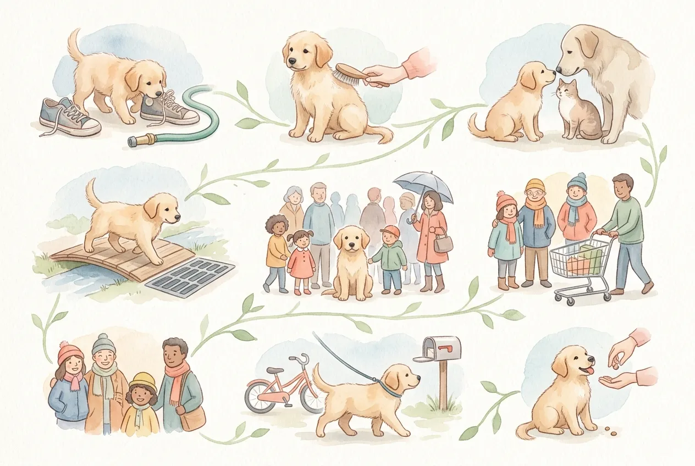

Eine strukturierte Sozialisierung Welpe Checkliste ist das wichtigste Werkzeug, das du in den ersten Wochen mit deinem Welpen haben kannst. Wer früh, gezielt und positiv sozialisiert, legt den Grundstein für einen ausgeglichenen, alltagstauglichen Hund. Wer zu viel auf einmal will, riskiert Überforderung und bleibende Unsicherheiten.

Dieser Artikel liefert dir eine praxisnahe Checkliste für Menschen, Hunde und Umweltreize, einen Wochenplan für die ersten acht Wochen nach dem Einzug und konkrete Tipps, wenn dein Welpe Angst zeigt oder du merkst, dass du zu viel auf einmal verlangst. Grundlage sind Empfehlungen der [Tierärztlichen Vereinigung für Tierschutz (TVT)](https://www.tierschutz-tvt.de/) sowie Erkenntnisse aus der Verhaltenswissenschaft.

Mehr zum großen Thema [Welpenerziehung](https://hundewissen-mit-kopf.de/erziehung-verhalten/welpenerziehung/) findest du in unserem ausführlichen Ratgeber.

## Sozialisierung Welpe Checkliste: Warum sie so wichtig ist

Zusammenfassung: Sozialisierung Welpe Checkliste

<ul>
<li><strong>Frühzeitig starten</strong> -- Die sensible Prägephase endet etwa mit Woche 16, danach werden neue Eindrücke schwerer verankert.</li>
<li><strong>Qualität vor Quantität</strong> -- Wenige positive Erfahrungen wirken nachhaltiger als viele überwältigende Begegnungen.</li>
<li><strong>Struktur hilft</strong> -- Eine abhakbare Checkliste mit Wochenplan verhindert blinde Flecken und Überforderung.</li>
<li><strong>Stresssignale beachten</strong> -- Gähnen, Lecken und Wegducken sind klare Zeichen, dass dein Welpe eine Pause braucht.</li>
</ul>

Sozialisierung ist mehr als ein nettes Extra in der Welpenzeit. Sie entscheidet mit, wie dein Hund als Erwachsener auf Menschen, andere Tiere und neue Situationen reagiert. Wer die ersten Wochen strukturiert nutzt, investiert in ein Leben mit einem entspannten, sicheren Hund.

### Was Sozialisierung beim Welpen wirklich bedeutet

Sozialisierung beim Welpen bedeutet, dass dein Hund lernt, die Welt als sicher zu erleben. Das umfasst Begegnungen mit Menschen verschiedener Altersgruppen, anderen Hunden, Tieren, Geräuschen, Untergründen und Alltagssituationen.

Dabei geht es nicht darum, möglichst viele Reize in kurzer Zeit abzuhaken. Es geht darum, dass dein Welpe jede neue Erfahrung als neutral oder angenehm abspeichert. Negative Erlebnisse in dieser Phase können sich tief einprägen und später zu Angst oder Aggression führen.

📖

Definition: Sozialisierung beim Hund

Sozialisierung bezeichnet den Lernprozess, in dem ein Welpe erlernt, mit artfremden und arteigenen Lebewesen sowie mit seiner Umwelt umzugehen. Die Grundlagen werden vor allem in der sensiblen Prägephase zwischen der 3. und 16. Lebenswoche gelegt.

### Warum gute Erfahrungen wichtiger sind als möglichst viele Reize

Ein häufiger Irrtum: Wer seinen Welpen überall hinmitnimmt und möglichst vielen Situationen aussetzt, sozialisiert besonders gut. Das Gegenteil kann der Fall sein.

Jede Begegnung, die Stress auslöst, hinterlässt eine Spur im Gedächtnis deines Welpen. Laut dem [Deutschen Tierschutzbund](https://www.tierschutzbund.de/) ist eine artgerechte, schrittweise Welpensozialisierung entscheidend für die spätere Verhaltensstabilität. Drei ruhige, positive Begegnungen pro Tag sind wertvoller als zehn überfordernde. Plane bewusst Pausen ein und beobachte, wie dein Welpe reagiert.

## Ab wann Welpen sozialisieren? Die Sozialisierungsphase beim Hund

Die Sozialisierung beginnt nicht erst bei dir zu Hause, sondern bereits beim Züchter. Seriöse Züchter sorgen dafür, dass Welpen schon in den ersten Lebenswochen verschiedene Menschen, Geräusche und Untergründe kennenlernen. Ab dem Einzug, meist in der 8. Lebenswoche, liegt die Verantwortung bei dir.

### Die sensible Prägezeit: Welche Wochen besonders wichtig sind

Die Sozialisierungsphase beim Hund lässt sich grob in zwei Abschnitte teilen: Die frühe Sozialisation beim Züchter (3. bis 8. Woche) und die Humansozialisierung beim neuen Halter (8. bis 16. Woche). In dieser Zeit ist das Gehirn des Welpen besonders aufnahmefähig für neue Eindrücke.

Forscher der Ludwig-Maximilians-Universität München bestätigen, dass Eindrücke aus dieser Prägephase besonders tief und dauerhaft abgespeichert werden. Was in dieser Zeit fehlt, lässt sich später nur mit erheblichem Aufwand nachholen.

8. Woche

Typischer Einzugstermin beim neuen Halter

16. Woche

Ende der besonders sensiblen Prägephase

8 Wochen

Aktive Sozialisierungszeit nach dem Einzug

3–5 min

Empfohlene Dauer pro Sozialisierungseinheit

### Was muss ein Welpe mit 16 Wochen können?

Mit 16 Wochen braucht dein Welpe kein perfektes Gehorsamsverhalten zu zeigen. Wichtiger sind erste stabile Alltagserfahrungen: Er sollte Menschen, Geräusche und andere Hunde kennen, ohne in Panik zu verfallen.

Konkret bedeutet das: ruhiges Verhalten beim Streicheln durch Fremde, entspannte Reaktion auf Verkehrslärm, erste positive Hundekontakte und die Fähigkeit, alleine zu ruhen. Wer das erreicht, hat eine sehr gute Grundlage geschaffen.

## Sozialisierung Welpe Checkliste für Menschen, Hunde und Umwelt

Eine vollständige Sozialisierung Hund Checkliste deckt drei Bereiche ab: Menschen, andere Tiere und Umweltreize. Geh die Liste Schritt für Schritt durch und hake ab, was dein Welpe bereits positiv erlebt hat.

### Menschen: Kinder, Erwachsene, Senioren und Personen mit Hilfsmitteln

Dein Welpe sollte möglichst viele verschiedene Menschen kennenlernen, bevor er 16 Wochen alt ist. Wichtig ist dabei die Vielfalt: Kinder, die sich schnell bewegen und laut sind, Senioren mit langsamem Gang, Personen mit Brillen, Hüten, Bärten oder Rollstühlen.

Jede Begegnung sollte ruhig und positiv verlaufen. Lass Fremde nicht einfach auf deinen Welpen zurennen, sondern bitte sie, sich langsam und seitlich zu nähern. Ein Leckerli als positive Verknüpfung hilft dabei enorm.

### Hunde und andere Tiere: Katzen, Pferde und Kleintiere sicher kennenlernen

Hundekontakte in der Welpenzeit sind unverzichtbar, aber nur mit geeigneten Partnern. Freundliche, gesunde und sozial kompetente Hunde sind ideal. Überfordernde Raufereien oder Jagdspiele mit deutlich größeren Hunden solltest du vermeiden.

Wenn du in einem Haushalt mit Katzen, Kleintieren oder in einer ländlichen Gegend mit Pferden lebst, gewöhne deinen Welpen frühzeitig und kontrolliert an diese Tiere. Kurze, ruhige Sichtkontakte mit positivem Abschluss reichen am Anfang völlig aus.

### Umweltreize: Geräusche, Untergründe, Verkehr und Alltag

Geräusche wie Staubsauger, Türklingel, Gewitter oder Feuerwerk können Hunde ein Leben lang belasten, wenn sie sie nie positiv kennen gelernt haben. Starte mit leisen Versionen und steigere langsam.

Verschiedene Untergründe sind ebenfalls wichtig: Rasen, Pflastersteine, Gitterroste, Sand und Parkett. Auch Fahrstühle, Rolltreppen, belebte Fußgängerzonen und öffentliche Verkehrsmittel gehören zur Sozialisierung Welpe Checkliste, sofern dein Alltag das erfordert.

✅ Sozialisierung Welpe Checkliste

✓

Kinder (verschiedene Altersgruppen, auch laute/schnelle Bewegungen)

Erwachsene mit Hüten, Brillen, Bärten, Regenschirmen

Senioren und Personen mit Rollator, Rollstuhl oder Krücken

Freundliche, gesunde Hunde verschiedener Größen

Katzen, Kleintiere oder Nutztiere (je nach Lebensumfeld)

Haushaltsgeräusche: Staubsauger, Föhn, Türklingel

Außengeräusche: Verkehr, Baustelle, Menschenmenge

Verschiedene Untergründe: Rasen, Pflaster, Gitterrost, Sand

Öffentliche Orte: Marktplatz, Bahnhof, Tierarztpraxis

Fahrzeuge: Auto, Bus, Fahrrad, Motorrad

## Trainingsplan: So sozialisierst du deinen Welpen Woche für Woche

Ein strukturierter Wochenplan hilft dir, die Sozialisierung gleichmäßig aufzubauen, ohne deinen Welpen zu überfordern. Die folgende Übersicht gilt für die ersten acht Wochen nach dem Einzug.

1

Woche 1 bis 2: Ankommen und Bindung aufbauen

Lass deinen Welpen zunächst ankommen. Zeige ihm das Zuhause, gewöhne ihn an Haushaltgeräusche und baue Vertrauen auf. Erste Reize kommen von innen: Staubsauger aus der Ferne, Klingel, verschiedene Familienmitglieder.

2

Woche 3 bis 4: Neue Orte und kurze Begegnungen

Jetzt kommen erste Ausflüge in ruhige Umgebungen. Kurze Spaziergänge auf Pflaster, ein Besuch beim Tierarzt ohne Behandlung, das Kennenlernen von zwei bis drei fremden Menschen pro Tag.

3

Woche 5 bis 6: Mehr Vielfalt, mehr Reize

Belebtere Orte wie Fußgängerzonen oder Wochenmärkte kommen hinzu. Erste Hundekontakte in der Welpengruppe oder mit bekannten, freundlichen Hunden. Auch Stubenreinheit und erste Grundkommandos werden jetzt geübt.

✓

Woche 7 bis 8: Alltag festigen

Die Sozialisierung Welpe Checkliste wird systematisch abgearbeitet. Lücken schließen, Erfahrungen wiederholen und erste Alltagsroutinen festigen. Leinenführigkeit und Rückruf werden jetzt regelmäßig trainiert.

### Woche 1 bis 2: Ankommen, Bindung und erste sichere Reize

Die ersten zwei Wochen nach dem Einzug gehören dem Ankommen. Dein Welpe lernt seine neue Familie, sein Zuhause und die grundlegenden Tagesabläufe kennen. Halte die Reize bewusst gering und lass ihn die Wohnung in seinem eigenen Tempo erkunden.

Erste Sozialisierungsreize kommen aus dem Alltag: das Geräusch des Staubsaugers aus einem anderen Zimmer, das Klingeln des Telefons, verschiedene Familienmitglieder, die ihn ruhig streicheln. Besuche draußen können kurz sein, aber noch ohne Trubel.

### Woche 3 bis 4: Neue Orte, kurze Begegnungen und Ruhepausen

Ab Woche drei kannst du die Umwelt deines Welpen behutsam erweitern. Kurze Ausflüge in ruhige Straßen, ein erster Besuch beim Tierarzt nur zum Kennenlernen ohne Behandlung, das Treffen mit zwei bis drei fremden Menschen pro Tag.

Plane nach jeder Sozialisierungseinheit eine ausgedehnte Ruhephase ein. Welpen schlafen bis zu 18 Stunden täglich, weil ihr Gehirn die neuen Eindrücke verarbeitet. Wer [Hund stubenrein bekommen](https://hundewissen-mit-kopf.de/erziehung-verhalten/hund-stubenrein-bekommen/) möchte, beginnt parallel dazu mit der Stubenreinheitserziehung.

### Woche 5 bis 8: Alltag festigen und den Hund kontrolliert sozialisieren

In den Wochen fünf bis acht wird die Sozialisierung systematischer. Belebtere Orte, erste Welpengruppen und gezielte Begegnungen mit anderen Hunden kommen hinzu. Auch [Leinenführigkeit trainieren](https://hundewissen-mit-kopf.de/erziehung-verhalten/leinenfuehrigkeit-trainieren/) wird jetzt zum festen Bestandteil des Alltags.

Arbeite die Sozialisierung Hund Checkliste gezielt ab und notiere, welche Erfahrungen noch fehlen. Wiederhole positive Begegnungen regelmäßig, damit sie sich festigen.

## Typische Fehler bei der Sozialisierung: Überforderung statt Lernerfolg

Sozialisierung kann scheitern, wenn sie zu intensiv, zu schnell oder ohne Rücksicht auf den Welpen durchgeführt wird. Die häufigsten Fehler lassen sich leicht vermeiden, wenn du die Signale deines Hundes kennst.

### Übersozialisierung erkennen: Zu viel, zu schnell, zu nah

Übersozialisierung entsteht, wenn ein Welpe täglich mehrere intensive Begegnungen ohne ausreichende Pausen erlebt. Das Ergebnis ist kein selbstbewusster Hund, sondern ein dauerhaft gestresster, der Reize nicht mehr verarbeiten kann.

Typische Zeichen: Der Welpe wirkt nach Ausflügen erschöpft und unruhig statt entspannt. Er schläft schlecht, frisst wenig oder zeigt vermehrt Stresssignale wie Lecken und Gähnen. Weniger Reize pro Tag und mehr Schlaf sind in diesem Fall die richtige Antwort.

So geht Sozialisierung richtig

<ul>
<li>2 bis 3 gezielte Reize pro Tag, bewusst geplant</li>
<li>Ausreichend Schlaf und Ruhepausen zwischen Einheiten</li>
<li>Welpe entscheidet selbst, wie nah er geht</li>
<li>Positive Verknüpfung durch Lob und Leckerlis</li>
<li>Abbruch bei ersten Stresssignalen</li>
</ul>

Das solltest du vermeiden

<ul>
<li>Tägliche Ausflüge zu belebten Orten ohne Pause</li>
<li>Fremde, die sofort auf den Welpen zurennen</li>
<li>Erzwungene Begegnungen trotz sichtbarer Angst</li>
<li>Keine Rückzugsmöglichkeit für den Welpen</li>
<li>Stresssignale ignorieren oder als "Trotz" deuten</li>
</ul>

### Warnsignale für Stress beim Welpen richtig deuten

Welpen kommunizieren Stress über Körpersprache. Wer diese Signale kennt, kann rechtzeitig eingreifen, bevor eine Situation zur negativen Erfahrung wird.

Häufige Stresssignale: Gähnen, Lecken über die Nase, Wegducken, Ohren anlegen, Schwanz zwischen die Beine ziehen, Zittern, Hecheln ohne körperliche Belastung. Auch übermäßiges Bellen kann ein Zeichen von Überforderung sein. Wenn du solche Signale siehst, beende die Situation ruhig und gib deinem Welpen Abstand und Zeit.

## Wenn der Welpe Angst hat: So reagierst du richtig

💡

<strong>Tipp: Nie Angst erzwingen</strong>

Wenn dein Welpe Angst zeigt, vergrößere den Abstand zur Angstquelle. Zwinge ihn niemals in eine Situation, aus der er nicht fliehen kann. Druck verstärkt Angst, Geduld baut sie ab.

Angst beim Welpen ist kein Charakterfehler und kein Erziehungsversagen. Sie ist ein Signal, dass eine Situation gerade zu viel ist. Deine Aufgabe ist es, die Situation so zu gestalten, dass dein Welpe sie als sicher erlebt.

### Angst vor anderen Hunden: Distanz, Management und positive Verknüpfung

Wenn dein Welpe Angst vor anderen Hunden hat, ist der erste Schritt immer Abstand. Geh auf eine Distanz, bei der dein Welpe den anderen Hund wahrnimmt, aber noch entspannt bleibt. Auf dieser Distanz arbeitest du mit positiver Verknüpfung: Leckerli, Lob, ruhige Stimme.

Steigere die Nähe sehr langsam über mehrere Tage oder Wochen. Erzwinge keinen Kontakt. Bei anhaltender Angst vor anderen Hunden hilft eine erfahrene Hundetrainerin, die den Aufbau begleitet. Mehr zum Thema übermäßiges Bellen als Stresssignal findest du im Artikel [Hund bellt ständig](https://hundewissen-mit-kopf.de/erziehung-verhalten/hund-bellt-staendig/).

### Angst vor Menschen und neuen Situationen behutsam abbauen

Angst vor Menschen entsteht oft durch schlechte Erfahrungen oder fehlende Begegnungen in der Prägephase. Der Abbau funktioniert nach demselben Prinzip: Abstand, Ruhe, positive Verknüpfung.

Bitte Fremde, deinen Welpen zunächst zu ignorieren und Leckerlis auf den Boden zu legen, statt direkt zu streicheln. Lass deinen Welpen selbst entscheiden, wann er Kontakt aufnimmt. Dieser Ansatz ist deutlich wirksamer als erzwungene Begegnungen und schont das Vertrauen deines Hundes in Menschen.

## Fazit: Mit Struktur wird Sozialisierung für Welpen alltagstauglich

Eine gute Sozialisierung ist keine Frage von Glück, sondern von Struktur und Geduld. Wer die Sozialisierung Welpe Checkliste konsequent und behutsam abarbeitet, legt den Grundstein für einen entspannten, sicheren Hund im Alltag.

Starte früh, beobachte deinen Welpen genau und nimm seine Signale ernst. Wenige, positive Erfahrungen pro Tag sind wertvoller als tägliche Reizüberflutung. Mit dem Wochenplan aus diesem Artikel hast du eine konkrete Vorlage, die du direkt nutzen kannst.

Welche Grundkommandos du parallel zur Sozialisierung aufbauen kannst, zeigt dir unser Ratgeber zu [Kommandos für Hunde](https://hundewissen-mit-kopf.de/erziehung-verhalten/kommandos-hund/).

✅

<strong>Dein Sozialisierungsplan auf einen Blick</strong>

Nutze die Checkliste aus diesem Artikel, um gezielt Lücken zu schließen. Plane zwei bis drei Reize pro Tag, achte auf Ruhepausen und beobachte die Körpersprache deines Welpen. Bei anhaltender Angst oder Unsicherheit empfiehlt sich der Gang zu einer zertifizierten Hundeschule oder Tierärztin.

