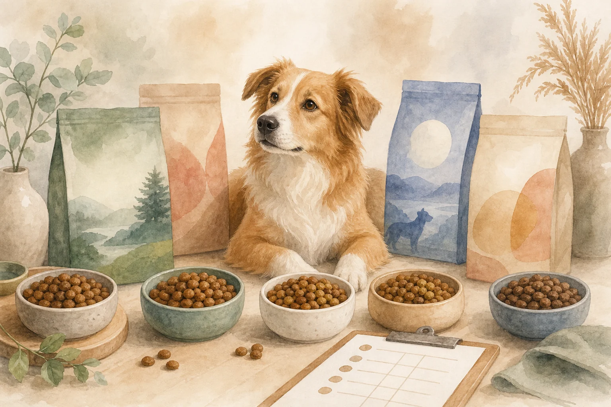
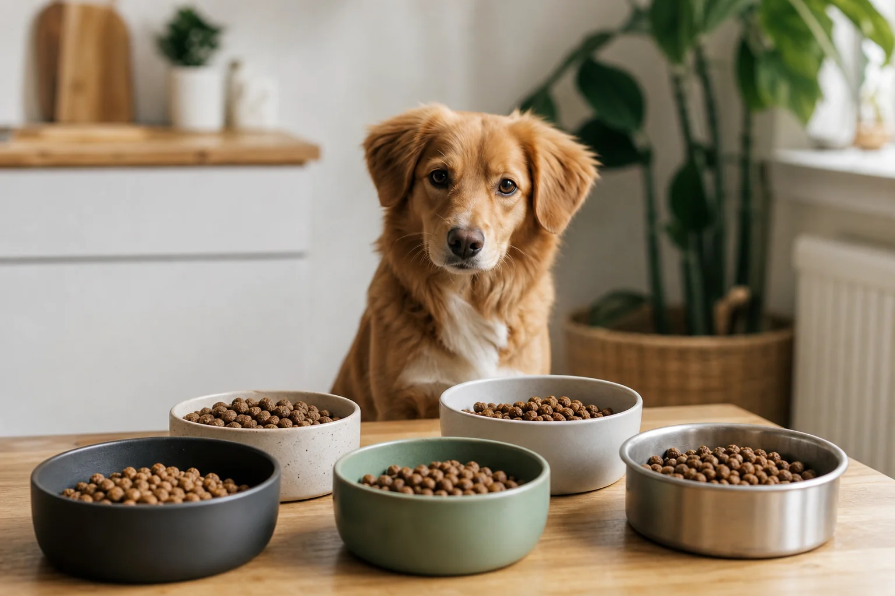
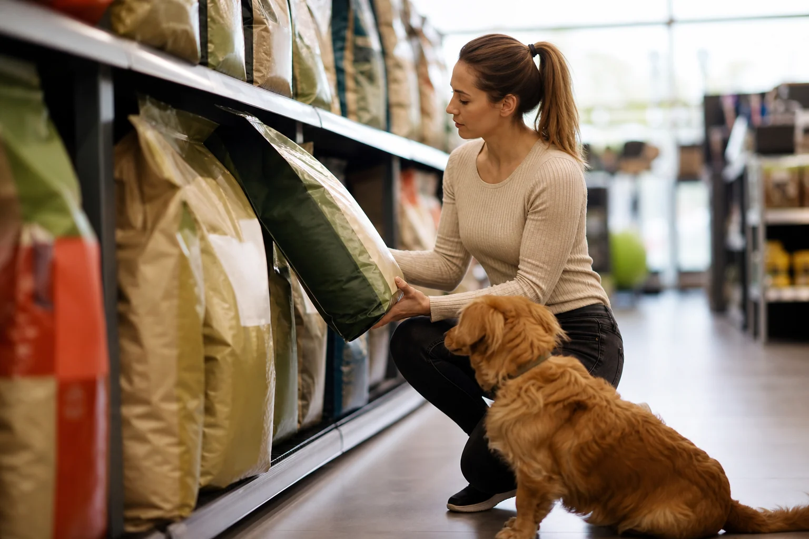

Hochwertiges Trockenfutter für Hunde zu finden ist schwieriger als es klingt: Der Markt bietet Hunderte Produkte, von der Discounter-Tüte für 2 Euro bis zum Premium-Futter für 8 Euro pro Kilogramm. Wer wissen möchte, [was Hunde essen dürfen](https://hundewissen-mit-kopf.de/hundeernaehrung/duerfen-hunde-tomaten-essen/) und welche Inhaltsstoffe wirklich wichtig sind, verliert schnell den Überblick. Dieser Artikel zeigt dir, worauf es beim trockenfutter hund test wirklich ankommt, welche Marken im Vergleich überzeugen und wie du das passende Futter für deinen Hund findest, egal ob Welpe, Adult oder Senior.

Du bekommst konkrete Bewertungskriterien, einen Markenvergleich mit bekannten Produkten wie Wildes Land, Josera, Royal Canin sowie einen ehrlichen Discounter-Check für Lidl und Aldi.

## Was macht gutes Trockenfutter für Hunde aus? – Trockenfutter Hund Test Grundlagen

Hochwertiges Trockenfutter für Hunde zeichnet sich durch eine klare Zutatenliste, einen hohen Fleischanteil und eine bedarfsgerechte Nährstoffzusammensetzung aus. Wer diese drei Punkte versteht, kann im Regal sofort zwischen gutem und schlechtem Hundefutter unterscheiden.

Zusammenfassung: Gutes Trockenfutter erkennen

<ul>
<li><strong>Fleisch an erster Stelle</strong> – Fleisch oder Fleischmehl muss die Hauptzutat sein, nicht Mais oder Weizen</li>
<li><strong>Transparente Deklaration</strong> – Einzelzutaten statt vage „Fleisch und tierische Nebenerzeugnisse"</li>
<li><strong>Kein Zuckerzusatz</strong> – Zucker, Karamell oder Melasse haben in Hundefutter nichts zu suchen</li>
<li><strong>Bedarfsgerechte Nährstoffe</strong> – Mindestens 18 % Rohprotein (Trockensubstanz) laut DVG-Leitlinie für ausgewachsene Hunde</li>
</ul>

### Zutatenliste lesen und bewerten – so geht's

Die Zutatenliste auf Hundefutter ist gesetzlich nach Gewicht vor der Verarbeitung sortiert. Das bedeutet: Die erste Zutat macht den größten Anteil im Produkt aus. Bei hochwertigem Trockenfutter steht dort Fleisch oder Fleischmehl, nicht Mais, Weizen oder Reis.

Ein häufiger Trick der Hersteller ist das sogenannte Ingredient Splitting. Dabei wird Getreide in mehrere Einzelzutaten aufgeteilt, zum Beispiel „Mais, Maismehl, Maisgluten", damit jede Teilmenge kleiner wirkt als das Fleisch. Addiert man alle Getreideanteile, liegt Getreide oft an erster Stelle. Wer das erkennt, trifft deutlich bessere Kaufentscheidungen.

Laut den Kennzeichnungspflichten des [Bundesministeriums für Ernährung und Landwirtschaft](https://www.bmel.de/) müssen alle Zutaten vollständig angegeben werden. Vage Sammelbezeichnungen wie „Fleisch und tierische Nebenerzeugnisse" ohne Prozentangaben sind legal, aber ein Qualitätsmerkmal sind sie nicht.

### Nährstoffe, Rohprotein und Getreide: Was wirklich zählt

Laut DVG-Leitlinie (Stand 2024) sollten ausgewachsene Hunde mindestens 18 bis 25 % Rohprotein in der Trockensubstanz erhalten. Bei aktiven Hunden oder Arbeitshunden liegt der Bedarf höher. Rohfett sollte bei mindestens 5 % liegen, bei energiereichen Sorten auch deutlich darüber.

Getreide ist für Hunde nicht grundsätzlich schädlich. Hunde können Stärke gut verdauen und nutzen Getreide als Energiequelle. Problematisch wird es, wenn Getreide die Hauptzutat ist und Fleisch verdrängt. Getreidefrei bedeutet nicht automatisch besser, denn manche getreidefreien Produkte setzen auf Hülsenfrüchte, die in großen Mengen ebenfalls diskutiert werden. Entscheidend ist die Gesamtzusammensetzung, nicht ein einzelnes Schlagwort auf der Verpackung.

## Trockenfutter Hund Test: Unsere Bewertungskriterien im Überblick

Ein seriöser hundefutter test bewertet Produkte nach mehreren Kriterien gleichzeitig. Einzelne Werte allein sagen wenig aus, erst das Gesamtbild ergibt eine belastbare Einschätzung.

Für diesen Vergleich wurden Produktdeklarationen, verfügbare Laboranalysen, Herstellerangaben sowie veröffentlichte Testergebnisse von Stiftung Warentest ausgewertet (Stand: Juni 2026). Bewertet wurden Fleischanteil und Fleischqualität, Rohprotein- und Rohfettgehalt, Transparenz der Deklaration, Schadstoffbelastung sowie Preis-Leistungs-Verhältnis.

### Was sagt Stiftung Warentest zum Trockenfutter für Hunde?

[Stiftung Warentest](https://www.test.de/Trockenfutter-Hund-Test-5020107-0/) hat in ihrem trockenfutter hund test stiftung warentest mehrere Marken auf Nährstoffgehalt, Schadstoffe und Deklarationsqualität geprüft. Die Ergebnisse zeigten deutliche Qualitätsunterschiede: Testsieger überzeugten durch hohen Fleischanteil, geringe Belastung mit Mykotoxinen und Schwermetallen sowie eine vollständige, nachvollziehbare Zutatenliste. Einige günstige Produkte schnitten überraschend solide ab, während einzelne teurere Marken in der Schadstoffbewertung schlechter abschnitten als erwartet.

Wichtig: Stiftung Warentest aktualisiert seine Tests regelmäßig. Aktuelle Noten und detaillierte Testergebnisse sind direkt auf test.de einsehbar. Ein Testergebnis von vor drei Jahren ist für die aktuelle Kaufentscheidung nur bedingt aussagekräftig, da Rezepturen sich ändern können.

18–25 %

Rohprotein (Trockensubstanz) für adulte Hunde laut DVG

8–10 %

Wasseranteil in Trockenfutter (daher immer Wasser bereitstellen)

2–3 %

Körpergewicht als tägliche Futtermenge (Richtwert)

#1

Fleisch oder Fleischmehl als erste Zutat ist das wichtigste Qualitätsmerkmal

## Testsieger Trockenfutter Hund 2025: Die besten Marken im Vergleich

Die Suche nach dem trockenfutter hund testsieger 2025 führt zu einigen Marken, die sich durch konsequent hohe Fleischanteile, transparente Rezepturen und gute Nährstoffprofile auszeichnen. Kein Produkt ist perfekt für jeden Hund, aber die folgenden Marken gehören zu den am häufigsten positiv bewerteten im trockenfutter hund test Vergleich 2025.

### Wildes Land Hundefutter im Test

Wildes Land gehört zu den bekanntesten deutschen Premium-Marken im Bereich Trockenfutter. Das wildes land hundefutter zeichnet sich durch hohe Fleischanteile von meist über 60 % aus, klare Einzelzutaten-Deklaration und getreidefreie Rezepturen. Als Proteinquellen kommen häufig Geflügel, Lachs oder Rind zum Einsatz, jeweils klar benannt und prozentual angegeben.

Kritisch zu betrachten: Getreidefreie Produkte mit hohem Hülsenfruchtanteil stehen in der Fachdiskussion. Die [Veterinärmedizinische Universität Wien](https://www.vetmeduni.ac.at/) weist darauf hin, dass ein Zusammenhang zwischen hülsenfruchtreichen, getreidefreien Diäten und bestimmten Herzerkrankungen bei Hunden noch nicht abschließend geklärt ist. Für die meisten gesunden Hunde ist Wildes Land eine solide Wahl, bei Vorerkrankungen lohnt tierärztliche Rücksprache.

### Josera und Anifit im Trockenfutter Hund Test

Josera ist ein deutsches Familienunternehmen mit langer Tradition in der Heimtierernährung. Der josera trockenfutter hund test zeigt: Die Produkte überzeugen durch gute Nährstoffprofile, klare Deklaration und ein breites Sortiment für verschiedene Lebensphasen und Bedürfnisse. Besonders die Speziallinien für Senioren und empfindliche Hunde sind gut aufgestellt.

Anifit setzt auf Nassnahrung als Hauptprodukt, bietet aber auch Ergänzungen für Trockenfutter-Fans. Im anifit trockenfutter hund test punktet die Marke mit hoher Transparenz und nachvollziehbaren Zutaten. Das Preisniveau liegt im oberen Mittelfeld, was sich durch die Qualität der Rohstoffe erklärt.

| Marke | Fleischanteil | Getreide | Preisklasse | Besonderheit |
|---|---|---|---|---|
| Wildes Land | >60 % | Getreidefrei | Premium | Viele Proteinquellen zur Wahl |
| Josera | 40–55 % | Je nach Sorte | Mittel–Premium | Breites Lebensphase-Sortiment |
| Anifit | >70 % | Getreidefrei | Premium | Sehr transparente Deklaration |
| Royal Canin | 25–40 % | Vorhanden | Mittel–Premium | Rassenspezifische Linien |

### Royal Canin Trockenfutter im Test

Royal Canin ist weltweit eine der bekanntesten Marken und wird häufig von Tierärzten empfohlen. Im royal canin trockenfutter hund test fällt auf: Die Fleischanteile sind im Vergleich zu reinen Premium-Marken niedriger, dafür sind die Produkte auf spezifische Rassen, Gesundheitszustände und Lebensphasen zugeschnitten. Die Rezepturen basieren auf wissenschaftlichen Studien, die Deklaration ist vollständig, aber die Zutaten klingen für Laien oft abstrakt.

Royal Canin ist keine schlechte Wahl, besonders für Hunde mit speziellen Bedürfnissen. Wer reinen Fleischanteil als Hauptkriterium setzt, findet bei anderen Marken bessere Werte für ähnlichen Preis.

Vorteile Premium-Trockenfutter

<ul>
<li>Hoher Fleischanteil als Hauptproteinquelle</li>
<li>Klare Einzelzutaten-Deklaration mit Prozentangaben</li>
<li>Geringere Füllstoffmenge, höhere Nährstoffdichte</li>
<li>Weniger Futter nötig für gleiche Nährstoffversorgung</li>
<li>Häufig bessere Ergebnisse bei Schadstoffprüfungen</li>
</ul>

Nachteile Premium-Trockenfutter

<ul>
<li>Deutlich höherer Anschaffungspreis pro Kilogramm</li>
<li>Nicht jeder Hund verträgt hohe Fleischanteile gleich gut</li>
<li>Umstellung muss langsam erfolgen (Verdauungsprobleme möglich)</li>
<li>Größeres Sortiment erschwert die Auswahl</li>
</ul>

## Trockenfutter Hund Test: Discounter-Produkte unter der Lupe

Günstiges Trockenfutter aus dem Discounter steht häufig in der Kritik, hält aber nicht immer, was Kritiker befürchten. Ein ehrlicher hundefutter test muss auch Aldi und Lidl unter die Lupe nehmen.

### Lidl Hundefutter im Test: Preis-Leistungs-Check

Das lidl hundefutter, vor allem die Marke Coshida, ist preislich sehr attraktiv. Im Preis-Leistungs-Check zeigt sich: Die Rohproteinwerte liegen oft im ausreichenden Bereich, die Hauptzutaten sind jedoch häufig Getreide wie Mais oder Gerste, ergänzt durch Geflügelmehl. Die Deklaration ist vollständig, aber weniger spezifisch als bei Premium-Marken.

Für gesunde Hunde ohne bekannte Unverträglichkeiten ist Lidl-Trockenfutter kurzfristig eine vertretbare Option. Wer dauerhaft auf Discounter-Futter setzt, sollte die Gesundheit des Hundes regelmäßig beim Tierarzt prüfen lassen, besonders Fellzustand, Gewicht und Verdauung sind zuverlässige Indikatoren für die Futterqualität.

### Aldi Trockenfutter Hund im Test

Im aldi trockenfutter hund test ergibt sich ein ähnliches Bild wie bei Lidl. Die Eigenmarken erfüllen die gesetzlichen Mindestanforderungen, liefern aber weniger Fleisch und mehr Getreideanteile als Premium-Produkte. Positiv: Der Preis erlaubt es auch Hundehaltern mit kleinerem Budget, ihren Hund satt und grundversorgt zu halten.

Wer auf Aldi- oder Lidl-Futter angewiesen ist, sollte zumindest auf die Rohproteinangabe achten und Produkte mit Geflügel oder Fleisch als erste Zutat bevorzugen, statt Produkte, bei denen Mais oder Weizen an erster Stelle stehen.

⚠️

<strong>Discounter-Futter: Worauf du unbedingt achten solltest</strong>

Günstiges Trockenfutter kann die Grundversorgung sichern, ist aber kein Ersatz für hochwertige Ernährung bei Hunden mit Allergien, Unverträglichkeiten, Erkrankungen oder besonderen Lebensphasen wie Trächtigkeit und Welpenaufzucht. Bei anhaltenden Verdauungsproblemen, schlechtem Fellzustand oder Gewichtsproblemen immer eine Tierärztin oder einen Tierarzt aufsuchen.

## Trockenfutter nach Lebensphase: Welpen, Erwachsene und Senioren

🐶

Welpe (0–12 Monate)

Höherer Protein- und Kalziumbedarf, speziell für Wachstum und Knochenentwicklung. Niemals Adult-Futter dauerhaft füttern.

🐕

Adult (1–6 Jahre)

Ausgewogene Nährstoffversorgung, Fleisch als Hauptproteinquelle, Energiebedarf je nach Aktivität anpassen.

🦮

Senior (ab 6–10 Jahren)

Weniger Kalorien, mehr Gelenkunterstützung, angepasster Phosphorgehalt für Nierenschonung.

🏃

Aktive und Arbeitshunde

Erhöhter Energiebedarf, höherer Fett- und Proteinanteil, oft spezielle Performance-Linien verfügbar.

Jede Lebensphase stellt andere Anforderungen an das Trockenfutter. Die richtige Wahl schützt vor Mangelerscheinungen und Überversorgung gleichermaßen.

### Trockenfutter für Welpen: Worauf Anfänger achten müssen

Welpen benötigen deutlich mehr Protein und Kalzium als ausgewachsene Hunde, da Muskeln, Knochen und Organe noch wachsen. Spezielles Welpen-Trockenfutter ist auf diesen erhöhten Bedarf abgestimmt. Wer eine [Hunderasse für Anfänger](https://hundewissen-mit-kopf.de/hunderassen/hunderasse-fuer-anfaenger/) hält, sollte von Beginn an auf artgerechte Ernährung achten.

Großrassen-Welpen haben dabei besondere Anforderungen: Zu viel Kalzium und Energie kann das Knochenwachstum stören und zu orthopädischen Problemen führen. Für Welpen großer Rassen gibt es spezielle „Large Breed Puppy"-Formeln, die das Wachstum verlangsamen und gleichmäßiger gestalten. Die [Sozialisierung des Welpen](https://hundewissen-mit-kopf.de/erziehung-verhalten/sozialisierung-welpe-checkliste/) beginnt früh, und auch die Ernährungsgewohnheiten prägen sich in dieser Phase.

### Senior Trockenfutter Hund im Test: Ab wann und welches?

Im senior trockenfutter hund test zeigt sich, dass die Umstellung auf Seniorenfutter vom Lebensalter und der Rassegröße abhängt. Kleine Rassen gelten ab etwa 8 bis 10 Jahren als Senioren, große Rassen bereits ab 6 bis 7 Jahren. Gutes trockenfutter senior hund test Ergebnis: Produkte mit reduziertem Kaloriengehalt, erhöhtem Anteil an Glucosamin und Chondroitin für die Gelenke sowie angepasstem Phosphorgehalt für die Nieren schneiden am besten ab.

Nicht jeder ältere Hund braucht sofort Seniorenfutter. Entscheidend sind Körperkondition, Aktivitätslevel und Gesundheitszustand. Eine Tierärztin oder ein Tierarzt kann den richtigen Umstellungszeitpunkt beurteilen.

## Sensitiv- und Spezialfutter im Trockenfutter Hund Test

💡

<strong>Sensitiv-Futter: Erst Tierarzt, dann Produkt</strong>

Bevor du auf Sensitiv- oder hypoallergenes Trockenfutter umsteigst, lohnt sich ein Tierarztbesuch. Echte Futtermittelallergien sind seltener als oft angenommen, und ein gezielter Ausschlussdiät-Test liefert zuverlässigere Ergebnisse als ein teures Sensitiv-Produkt ohne Diagnose.

Spezialfutter für empfindliche Hunde ist ein wachsendes Marktsegment. Nicht hinter jedem Produkt steckt echter Mehrwert.

### Trockenfutter Hund Sensitiv im Test: Sinnvoll oder Marketing?

Das trockenfutter hund sensitiv test Ergebnis ist ernüchternd: Der Begriff „Sensitiv" ist gesetzlich nicht geschützt. Hersteller können ihn frei verwenden, ohne spezifische Anforderungen erfüllen zu müssen. Viele als „sensitiv" vermarktete Produkte unterscheiden sich in der Zutatenliste kaum von regulärem Trockenfutter.

Sinnvoll ist Sensitiv-Futter dann, wenn es tatsächlich auf bekannte Unverträglichkeiten eingeht, zum Beispiel durch den Verzicht auf Weizen bei Getreideunverträglichkeit oder durch eine einzelne, klar benannte Proteinquelle. Wer einfach nur ein „schonenderes" Futter sucht, ohne konkrete Diagnose, zahlt oft drauf ohne echten Nutzen.

### Hypoallergenes Trockenfutter für Hunde im Test

Hypoallergenes Trockenfutter ist für Hunde mit bestätigten Futtermittelallergien konzipiert. Im hypoallergenes trockenfutter hund test punkten Produkte, die auf eine einzige Proteinquelle setzen, die der Hund noch nicht kennt, zum Beispiel Insektenprotein, Känguru oder Pferd. Dieses Prinzip nennt sich Monoprotein-Diät.

Laut der [Gesellschaft für Ernährungsberatung und Diätetik (GED)](https://www.ged-vet.de/) ist eine tierärztlich begleitete Ausschlussdiät über mindestens 8 Wochen der einzig zuverlässige Weg, eine echte Futtermittelallergie zu diagnostizieren. Hypoallergenes Futter ohne vorherige Diagnose ist teuer und nicht zielführend.

## Kaufberatung: Trockenfutter Hund Test – Das richtige Futter für jeden Hund finden

Das richtige hochwertiges trockenfutter hund zu finden bedeutet, individuelle Faktoren zu berücksichtigen: Rasse, Alter, Aktivitätslevel, Gesundheitszustand und Budget spielen alle eine Rolle. Ein Futter, das für einen Labrador ideal ist, passt nicht zwingend für einen Chihuahua.

Wer mehr Abwechslung in die Ernährung bringen möchte, kann auch [Hundefutter selber kochen](https://hundewissen-mit-kopf.de/hundeernaehrung/hundefutter-selber-kochen/) als Ergänzung zum Trockenfutter in Betracht ziehen, allerdings nur mit fundiertem Wissen über den Nährstoffbedarf von Hunden.

### Trockenfutter Hund Test: Budget-Empfehlungen für jede Preisklasse

Im trockenfutter hund test zeigt sich, dass das Budget nicht allein über die Futterqualität entscheidet. Entscheidend ist, was du für dein Geld bekommst.

| Preisklasse | Preis pro kg | Erwartete Qualität | Geeignet für |
|---|---|---|---|
| Günstig (Discounter) | 1–3 € | Grundversorgung, mehr Getreide | Gesunde Hunde ohne Unverträglichkeiten |
| Mittelklasse | 3–6 € | Guter Fleischanteil, klare Deklaration | Die meisten Hunde, guter Kompromiss |
| Premium | 6–12 € | Hoher Fleischanteil, Monoprotein, getreidefrei | Hunde mit besonderen Bedürfnissen, Allergiker |
| Tierärztliche Spezialdiät | >12 € | Medizinisch formuliert, verschreibungspflichtig | Hunde mit Erkrankungen auf Empfehlung |

Im trockenfutter hund test zeigt sich außerdem, dass die tatsächlichen Kosten pro Tag oft näher beieinanderliegen als der Kilopreis vermuten lässt: Premium-Trockenfutter mit hoher Nährstoffdichte wird in kleineren Mengen gefüttert, was den Preisunterschied zum Discounter-Produkt im Alltag deutlich relativiert.

Beim trockenfutter hund test gilt: Teureres Futter hat oft eine höhere Nährstoffdichte. Das bedeutet, der Hund braucht weniger davon, was den Preisunterschied im Alltag teilweise ausgleicht.

✅ Checkliste: Gutes Trockenfutter erkennen

✓

Fleisch oder Fleischmehl steht an erster Stelle der Zutatenliste

✓

Proteinquelle ist klar benannt (z. B. „Hühnerfleisch" statt „Fleisch und tierische Nebenerzeugnisse")

✓

Rohproteingehalt mindestens 18 % in der Trockensubstanz (Adult)

✓

Kein Zuckerzusatz, keine künstlichen Aromen oder Farbstoffe

✓

Futter ist auf die Lebensphase des Hundes abgestimmt (Welpe, Adult, Senior)

Bei Unverträglichkeiten: Tierarzt konsultieren vor Produktwechsel

Umstellung auf neues Futter immer schrittweise über 7–10 Tage

## Fazit: Unser Testurteil zum Trockenfutter für Hunde

Hochwertiges Trockenfutter für Hunde erkennst du zuverlässig an einer transparenten Zutatenliste mit Fleisch an erster Stelle, einem Rohproteingehalt von mindestens 18 % in der Trockensubstanz und dem Verzicht auf Zuckerzusätze und künstliche Zusätze. Im trockenfutter hund test überzeugen Marken wie Wildes Land, Josera und Anifit durch hohe Fleischanteile und klare Deklaration. Discounter-Produkte von Aldi und Lidl erfüllen die gesetzlichen Mindestanforderungen, liefern aber weniger Nährstoffdichte.

Kein Futter passt für jeden Hund gleich gut. Alter, Rasse, Aktivität und Gesundheitszustand bestimmen, welches Produkt wirklich sinnvoll ist. Bei Unsicherheiten, Unverträglichkeiten oder Erkrankungen ersetzt dieser Artikel keinen Tierarztbesuch.

✅

<strong>Das Wichtigste auf einen Blick</strong>

Fleisch als erste Zutat, klare Deklaration, bedarfsgerechte Nährstoffe und kein Zuckerzusatz sind die vier entscheidenden Qualitätsmerkmale beim Trockenfutter Kauf. Wer diese Punkte prüft, trifft für jeden Hund und jedes Budget eine fundierte Entscheidung.

