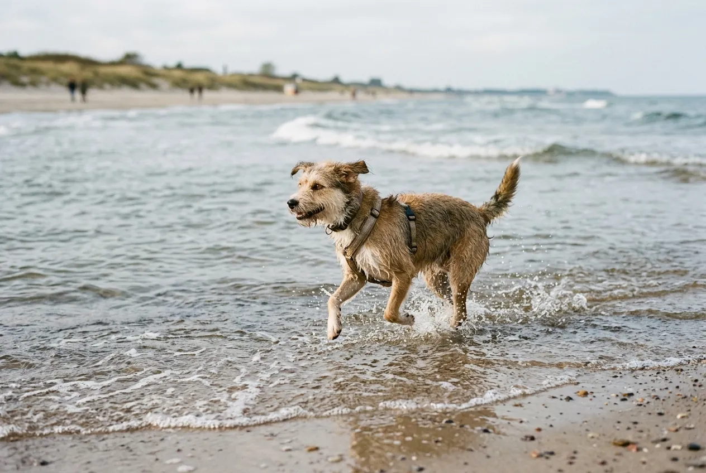
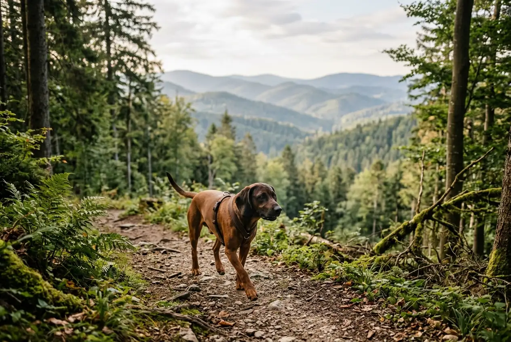

Deutschland gehört zu den hundefreundlichsten Reiseländern Europas -- und du brauchst weder Flugstress noch lange Autofahrten, um mit deinem Vierbeiner einen entspannten Urlaub zu verbringen. Urlaub mit Hund in Deutschland bietet dir Hundestrände an Ostsee und Nordsee, endlose Waldwege im Harz und Thüringer Wald, glasklare Seen in der Mecklenburgischen Seenplatte und alpine Panoramen in Bayern.

Rund 10,6 Millionen Hunde leben laut Industrieverband Heimtierbedarf in deutschen Haushalten (Stand 2025). Kein Wunder, dass sich die Tourismusbranche darauf eingestellt hat: Tausende Ferienhäuser mit Hund, hundefreundliche Restaurants und ausgewiesene Hundestrände machen den Hundeurlaub in Deutschland so unkompliziert wie nirgendwo sonst. In diesem Ratgeber findest du 12 hundefreundliche Regionen mit konkreten Tipps zu Unterkünften, Aktivitäten und Besonderheiten.

Zusammenfassung: Urlaub mit Hund in Deutschland

<ul>
<li><strong>12 Top-Regionen</strong> -- von Ostsee und Nordsee über Harz und Thüringer Wald bis zum Bayerischen Wald und Allgäu</li>
<li><strong>Über 50 Hundestrände</strong> -- allein an der Ostseeküste, viele davon ohne Leinenpflicht</li>
<li><strong>Ferienhaus mit Hund ab 50 €/Nacht</strong> -- rund 60 % der Ferienunterkünfte in Deutschland erlauben Hunde</li>
<li><strong>Kurzurlaub mit Hund lohnt sich</strong> -- viele Regionen sind in 2--4 Stunden Fahrt erreichbar</li>
<li><strong>Nebensaison nutzen</strong> -- weniger Einschränkungen am Strand, günstigere Preise und weniger Trubel</li>
</ul>

12

Hundefreundliche Regionen

50+

Hundestrände an der Ostsee

60 %

Ferienunterkünfte mit Hund

10,6 Mio.

Hunde in Deutschland

## Warum Urlaub mit Hund in Deutschland?

Deutschland ist für den Hundeurlaub ideal, weil kurze Anreisewege den Reisestress für Hunde minimieren. Die meisten der 12 vorgestellten Regionen erreichst du in maximal 4--6 Stunden Fahrt -- das ist für die meisten Hunde gut verträglich. Tierärzte empfehlen, Autofahrten mit Hund auf maximal 6--8 Stunden pro Tag zu begrenzen und alle 2 Stunden eine Pause von mindestens 15 Minuten einzulegen.

Ein weiterer Vorteil: Du benötigst keine aufwändigen Einreisedokumente. Der EU-Heimtierausweis mit gültiger Tollwutimpfung reicht innerhalb Deutschlands aus. Für den Hundeurlaub im Ausland gelten dagegen oft zusätzliche Bestimmungen wie Maulkorbpflicht oder Rasselisten.

Die Infrastruktur für Hunde ist in Deutschland hervorragend ausgebaut. Über 60 % der Ferienwohnungen und Ferienhäuser erlauben Hunde, viele Restaurants bieten Wassernäpfe an, und ausgeschilderte Wanderwege mit Hundetoiletten-Stationen gehören in Tourismusregionen zum Standard. Auch für einen spontanen [Kurzurlaub mit Hund](https://hundewissen-mit-kopf.de/reisen/urlaub-hund-ostsee/) eignet sich Deutschland perfekt -- viele Vermieter bieten Aufenthalte ab 2 Nächten an.

## Die 12 hundefreundlichsten Regionen im Überblick

Die folgende Tabelle gibt dir einen schnellen Überblick über alle 12 Regionen für den Urlaub mit Hund in Deutschland. Danach stellen wir jede Region im Detail vor.

| Region | Landschaft | Hundestrände | Ferienhaus ab | Beste Reisezeit |
|---|---|---|---|---|
| Ostsee | Küste & Strand | 50+ | 60 €/Nacht | Mai--Okt |
| Nordsee | Watt & Dünen | 30+ | 65 €/Nacht | Jun--Sep |
| Mecklenburgische Seenplatte | Seen & Wald | Badestellen | 50 €/Nacht | Mai--Sep |
| Harz | Mittelgebirge | Talsperren | 45 €/Nacht | Ganzjährig |
| Thüringer Wald | Wald & Berge | Badestellen | 40 €/Nacht | Apr--Okt |
| Bayerischer Wald | Nationalpark | Seen | 55 €/Nacht | Mai--Okt |
| Allgäu | Alpenvorland | Bergseen | 70 €/Nacht | Jun--Sep |
| Schwarzwald | Mittelgebirge | Seen | 60 €/Nacht | Ganzjährig |
| Eifel | Vulkanlandschaft | Maare | 45 €/Nacht | Apr--Okt |
| Lüneburger Heide | Heide & Moor | Seen | 50 €/Nacht | Aug--Sep |
| Sächsische Schweiz | Felslandschaft | Elbe-Badestellen | 50 €/Nacht | Mai--Okt |
| Bodensee | See & Berge | Strandbäder | 65 €/Nacht | Mai--Sep |

## 1. Ostsee -- Der Klassiker für den Hundeurlaub

Die Ostsee ist die beliebteste Region für Urlaub mit Hund in Deutschland. Über 50 ausgewiesene Hundestrände verteilen sich auf die Küsten von Schleswig-Holstein und Mecklenburg-Vorpommern. Beliebte Orte wie Zingst, Graal-Müritz, Kühlungsborn und die Insel Usedom bieten breite Sandstrände, an denen Hunde außerhalb der Hauptsaison sogar ohne Leine toben dürfen.

### Hundestrände und Regeln an der Ostsee

Von Oktober bis April haben Hunde an den meisten Ostseestränden freien Zugang -- auch an Hauptstränden. In der Hauptsaison (Mai bis September) sind Hunde auf die ausgewiesenen Hundestrände beschränkt. Die meisten Hundestrände bieten Kotbeutelspender, Mülleimer und Süßwasserduschen.

### Unterkünfte an der Ostsee

Ferienwohnungen mit Hund gibt es an der Ostsee ab etwa 60 Euro pro Nacht. Besonders gefragt sind Ferienhäuser mit eingezäuntem Garten -- diese kosten in der Hauptsaison zwischen 90 und 150 Euro pro Nacht. Frühzeitige Buchung (3--6 Monate vorher) ist für die Sommermonate empfehlenswert. Einen ausführlichen Ratgeber findest du in unserem Artikel [Urlaub mit Hund an der Ostsee](https://hundewissen-mit-kopf.de/reisen/urlaub-hund-ostsee/).

## 2. Nordsee -- Watt, Wind und Hundefreiheit

Die Nordseeküste bietet mit dem UNESCO-Weltnaturerbe Wattenmeer ein einzigartiges Erlebnis für Hunde. Rund 30 offizielle Hundestrände erstrecken sich von der ostfriesischen Küste bis nach Nordfriesland. Besonders hundefreundlich sind St. Peter-Ording, Büsum und die Inseln Föhr und Amrum.

### Wattwanderungen mit Hund

Geführte Wattwanderungen mit Hund werden an vielen Küstenorten angeboten. Hunde sollten dabei an der Leine geführt werden, da das Watt Naturschutzgebiet ist. Die Wanderungen dauern 1,5--3 Stunden und kosten 8--15 Euro pro Person. Hunde nehmen in der Regel kostenlos teil. Wichtig: Nach der Wattwanderung den Hund gründlich mit Süßwasser abspülen, da Salzwasser die Haut reizen kann.

💡

<strong>Tipp: Pfotenschutz im Watt</strong>

Muschelbänke im Watt können scharfkantig sein. Hundeschuhe oder Pfotenbalsam schützen empfindliche Pfoten. Kontrolliere nach jeder Wattwanderung die Pfotenballen auf kleine Schnitte.

### Unterkünfte an der Nordsee

Ferienhäuser mit Hund an der Nordsee starten bei etwa 65 Euro pro Nacht. Auf den Inseln liegen die Preise höher -- auf Sylt ab 120 Euro, auf Föhr ab 80 Euro. Viele Vermieter bieten Willkommenspakete für Hunde mit Napf, Leckerli und Strandspielzeug.

## 3. Mecklenburgische Seenplatte -- Geheimtipp für Wasserratten

Die Mecklenburgische Seenplatte ist ein echter Urlaub mit Hund Geheimtipp. Über 1.000 Seen auf einer Fläche von 5.000 km² bieten unzählige Bademöglichkeiten für Hunde. Die Region ist deutlich weniger touristisch als Ostsee und Nordsee, was mehr Ruhe und Freiraum für Vierbeiner bedeutet.

### Aktivitäten an der Mecklenburgischen Seenplatte

Kanufahrten mit Hund gehören zu den beliebtesten Aktivitäten. Mehrere Verleihstationen bieten Kanadier und Kajaks an, in denen Hunde mitfahren dürfen. Radwege entlang der Seen sind flach und gut ausgebaut -- ideal für Fahrradtouren mit Hund im Anhänger oder neben dem Rad. Wanderwege durch den Müritz-Nationalpark bieten auf über 300 km Naturerlebnis pur.

### Unterkünfte an der Mecklenburgischen Seenplatte

Ferienwohnungen mit Hund gibt es hier bereits ab 50 Euro pro Nacht -- und damit günstiger als an der Küste. Viele Ferienhäuser liegen direkt am See und haben einen eigenen Steg oder Badezugang. Die Region eignet sich besonders für einen ruhigen Kurzurlaub mit Hund.

## 4. Harz -- Wanderparadies für Hunde ganzjährig

Der Harz ist die vielseitigste Mittelgebirgsregion für den Hundeurlaub in Deutschland. Über 8.000 km markierte Wanderwege führen durch dichte Wälder, vorbei an Talsperren und hinauf zum 1.141 Meter hohen Brocken. Hunde dürfen sogar mit der historischen Brockenbahn fahren -- ein gültiges Ticket vorausgesetzt.

### Wanderrouten mit Hund im Harz

Der Harzer Hexenstieg (97 km) lässt sich in Etappen mit Hund erwandern. Kürzere Rundwege von 5--15 km gibt es rund um Braunlage, Wernigerode und Bad Harzburg. Die Luchstour bei Bad Harzburg (8 km) führt an einem Wildgehege vorbei -- hier ist Leinenpflicht besonders wichtig.

⚠️

<strong>Leinenpflicht in Naturschutzgebieten</strong>

Im Nationalpark Harz gilt ganzjährige Leinenpflicht. Verstöße können mit Bußgeldern von 50--5.000 Euro geahndet werden. Halte deinen Hund auf allen ausgeschilderten Naturschutzwegen an der Leine.

### Unterkünfte im Harz

Der Harz bietet Ferienhäuser mit Hund ab 45 Euro pro Nacht. Besonders beliebt sind Blockhütten und Fachwerkhäuser in Braunlage, Schierke und Wernigerode. Viele Unterkünfte haben eingezäunte Grundstücke -- ideal für Hunde, die gerne im Garten entspannen.

## 5. Thüringer Wald -- Natur pur zum kleinen Preis

Der Thüringer Wald gehört zu den günstigsten Urlaubsregionen für den Hundeurlaub in Deutschland. Ab 40 Euro pro Nacht findest du gemütliche Ferienwohnungen inmitten dichter Wälder. Der berühmte Rennsteig-Wanderweg erstreckt sich über 170 km und bietet zahlreiche hundefreundliche Etappen.

### Wandern auf dem Rennsteig mit Hund

Der Rennsteig lässt sich in 6--8 Tagesetappen mit Hund erwandern. Die einzelnen Etappen sind zwischen 15 und 25 km lang. Entlang des Weges gibt es hundefreundliche Gasthäuser und Pensionen, die auch kurzfristig Übernachtungen mit Hund anbieten. Die Höhenlage von 700--900 Metern sorgt selbst im Sommer für angenehme Temperaturen beim Wandern.

### Besonderheiten im Thüringer Wald

Abseits des Rennsteigs bieten die Drachenschlucht bei Eisenach und der Trusetaler Wasserfall beeindruckende Naturerlebnisse. Hunde sind an beiden Orten an der Leine erlaubt. Die Region ist auch im Winter attraktiv: Verschneite Waldwege eignen sich hervorragend für Spaziergänge mit dem Hund.

## 6. Bayerischer Wald -- Nationalpark und Hundefreiheit

Der Bayerische Wald beherbergt den ältesten Nationalpark Deutschlands und ist eine der waldreichsten Regionen Europas. Für Hunde bedeutet das: endlose Waldwege, frische Bergluft und kristallklare Bäche zum Abkühlen. Urlaub mit Hund in Bayern ist hier besonders naturverbunden.

### Wandern im Bayerischen Wald

Über 7.000 km Wanderwege durchziehen die Region. Der Goldsteig (660 km) ist einer der längsten Fernwanderwege Deutschlands und führt durch den gesamten Bayerischen Wald. Kürzere Rundwege von 3--12 km gibt es rund um den Großen Arber (1.456 m) und den Rachel (1.453 m). Im Nationalpark gilt Leinenpflicht, außerhalb dürfen gut abrufbare Hunde in vielen Gemeinden frei laufen.

### Unterkünfte im Bayerischen Wald

Ferienhäuser mit Hund starten bei 55 Euro pro Nacht. Bauernhofurlaub mit Hund ist im Bayerischen Wald besonders beliebt -- Kinder und Hunde profitieren gleichermaßen von der ländlichen Umgebung. Viele Höfe bieten eingezäunte Grundstücke und hundefreundliche Ausstattung.

## 7. Allgäu -- Alpenpanorama für aktive Hunde

Das Allgäu bietet spektakuläre Berglandschaften und ist für sportliche Hunde ein Paradies. Wanderungen auf Almwiesen, Bergseen zum Baden und urige Hütten mit Hundeerlaubnis machen die Region zu einem Highlight für den Hundeurlaub in Deutschland.

### Bergwandern mit Hund im Allgäu

Nicht jede Bergtour eignet sich für Hunde. Klettersteige und stark exponierte Wege sind tabu. Gut geeignet sind Almwanderungen wie die Breitachklamm-Runde (6 km), der Weg zur Alpe Dornach (8 km) oder die Wanderung um den Freibergsee (3 km). Hunde sollten trittsicher sein und an steilen Passagen an der Leine geführt werden.

ℹ️

<strong>Bergbahnen mit Hund</strong>

Viele Bergbahnen im Allgäu erlauben Hunde gegen eine Gebühr von 5--10 Euro. Die Nebelhornbahn, die Fellhornbahn und die Tegelbergbahn transportieren Hunde. Kleine Hunde fahren oft kostenlos, große Hunde benötigen ein ermäßigtes Ticket.

## 8. Schwarzwald -- Vielfalt auf kurzen Wegen

Der Schwarzwald vereint dichte Nadelwälder, tiefe Schluchten und idyllische Seen auf engem Raum. Für den Hundeurlaub bietet die Region über 24.000 km Wanderwege -- mehr als jede andere Region in Deutschland. Der Schluchsee und der Titisee erlauben Hunden den Zugang zu bestimmten Uferbereichen.

### Highlights für Hunde im Schwarzwald

Die Wutachschlucht (13 km) gehört zu den beeindruckendsten Wanderungen mit Hund. Der Weg führt entlang eines Wildbachs durch eine enge Schlucht -- Leinenpflicht ist hier Pflicht. Kürzere Alternativen sind der Feldbergsteig (12 km) und die Gertelbach-Wasserfälle (6 km). Im Schwarzwald gibt es zudem mehrere eingezäunte Hundewiesen in Freiburg, Baden-Baden und Offenburg.

## 9. Eifel -- Vulkanseen und weite Hochflächen

Die Eifel ist ein unterschätzter Geheimtipp für den Urlaub mit Hund in Deutschland. Die Vulkaneifel mit ihren Maaren (Kraterseen) bietet einzigartige Bademöglichkeiten. Am Schalkenmehrener Maar und am Gemündener Maar dürfen Hunde an ausgewiesenen Stellen ins Wasser.

### Wandern in der Eifel mit Hund

Der Eifelsteig (313 km) führt von Aachen bis nach Trier und bietet abwechslungsreiche Etappen. Kürzere Traumschleifen von 5--18 km sind ideal für Tagesausflüge mit Hund. Der Nationalpark Eifel erfordert Leinenpflicht, belohnt aber mit Buchenwäldern und Wildtierbeobachtungen.

🏖️

Küstenregionen

Ostsee und Nordsee: Hundestrände, Wattwanderungen, Meerluft

🏔️

Bergregionen

Allgäu, Bayerischer Wald, Schwarzwald: Almwanderungen, Bergseen

🌲

Waldregionen

Harz, Thüringer Wald, Eifel: Endlose Wanderwege, günstige Unterkünfte

🏞️

Seenregionen

Mecklenburgische Seenplatte, Bodensee: Wassersport, Radwege

## 10. Lüneburger Heide -- Lila Traumlandschaft im Spätsommer

Die Lüneburger Heide ist von Mitte August bis Mitte September am schönsten, wenn die Heide in voller Blüte steht. Für Hunde bietet die flache Landschaft entspannte Spaziergänge ohne anstrengende Steigungen. Im Naturschutzgebiet gilt Leinenpflicht, aber die weiten Heideflächen sind auch an der Leine ein Erlebnis.

### Besonderheiten für Hunde in der Lüneburger Heide

Der Heidschnuckenweg (223 km) lässt sich in Etappen mit Hund erwandern. Rund um den Wilseder Berg (169 m) gibt es kürzere Rundwege von 5--10 km. Mehrere Badeseen wie der Lopausee und der Heidesee erlauben Hunden den Zugang. Ferienhäuser mit Hund gibt es ab 50 Euro pro Nacht.

## 11. Sächsische Schweiz -- Felsenwelt für abenteuerlustige Hunde

Die Sächsische Schweiz beeindruckt mit bizarren Sandsteinfelsen und tiefen Schluchten. Nicht alle Wege eignen sich für Hunde -- Steigleitern und enge Felsspalten sind für Vierbeiner unpassierbar. Gut geeignet sind der Malerweg (Etappe 1--3), die Schwedenlöcher und die Wanderung zur Bastei.

### Praktische Tipps für die Sächsische Schweiz

Hunde müssen im Nationalpark Sächsische Schweiz ganzjährig an der Leine geführt werden. Die maximale Leinenlänge beträgt 2 Meter. An der Elbe gibt es mehrere Badestellen, an denen Hunde ins Wasser dürfen. Ferienwohnungen mit Hund sind in Bad Schandau und Königstein ab 50 Euro pro Nacht verfügbar.

## 12. Bodensee -- Drei Länder, ein See, viele Hundeerlebnisse

Der Bodensee liegt im Dreiländereck Deutschland-Österreich-Schweiz und bietet mildes Klima, Obstwiesen und Seepanorama. Für Hunde gibt es an mehreren Orten ausgewiesene Hundebadestellen -- etwa in Konstanz, Überlingen und Meersburg.

### Aktivitäten am Bodensee mit Hund

Schifffahrten auf dem Bodensee erlauben Hunde gegen eine Gebühr von 3--5 Euro. Radtouren entlang des Bodensee-Radwegs (260 km) sind flach und familienfreundlich. Die Insel Mainau erlaubt allerdings keine Hunde -- eine der wenigen Einschränkungen in der Region.

## Ferienhaus oder Ferienwohnung mit Hund finden

Die Wahl der richtigen Unterkunft entscheidet maßgeblich über den Erfolg des Hundeurlaubs. Ferienhäuser bieten mehr Platz und Privatsphäre als Hotels, und ein eingezäunter Garten ermöglicht dem Hund freien Auslauf ohne Leine.

Ferienhaus mit Hund

<ul>
<li>Eigener Garten (oft eingezäunt) für freien Auslauf</li>
<li>Keine Rücksicht auf andere Hotelgäste</li>
<li>Eigene Küche für frisches Hundefutter</li>
<li>Mehr Platz für Hundebett, Spielzeug und Ausrüstung</li>
<li>Flexible Fütterungszeiten</li>
</ul>

Hotel mit Hund

<ul>
<li>Oft Größenbeschränkungen für Hunde (max. 15--20 kg)</li>
<li>Hund darf selten ins Restaurant oder Wellnessbereich</li>
<li>Weniger Platz im Zimmer</li>
<li>Aufpreis von 10--25 Euro pro Nacht üblich</li>
<li>Leinenpflicht im gesamten Hotelbereich</li>
</ul>

### Buchungsportale für Hundeurlaub

Spezialisierte Portale wie hundeurlaub.de und hunde-urlaub.net listen ausschließlich hundefreundliche Unterkünfte. Allgemeine Plattformen wie Booking.com und Airbnb bieten Filteroptionen für Haustiere. Achte bei der Buchung auf folgende Punkte: maximale Anzahl erlaubter Hunde, Aufpreis pro Hund und Nacht, eingezäunter Garten vorhanden und Stornierungsbedingungen.

| Kriterium | Empfehlung |
|---|---|
| Buchungszeitpunkt | 3--6 Monate vorher (Hauptsaison) |
| Aufpreis pro Hund | 5--15 €/Nacht (Durchschnitt) |
| Eingezäunter Garten | Besonders wichtig bei Welpen und jagdlich motivierten Hunden |
| Endreinigung | 30--80 € pauschal (oft höher mit Hund) |
| Stornierung | Flexible Stornierung bis 14 Tage vorher empfohlen |

## Packliste für den Urlaub mit Hund in Deutschland

Eine gute Vorbereitung erspart dir Stress und sorgt dafür, dass dein Hund sich im Urlaub wohlfühlt. Die folgende Checkliste deckt alle wichtigen Punkte ab.

✅ Packliste für den Hundeurlaub

✓

EU-Heimtierausweis mit gültiger Tollwutimpfung

✓

Hundehaftpflicht-Versicherungsnachweis

✓

Leine (Standardleine + Schleppleine 5--10 m)

✓

Maulkorb (in manchen Regionen Pflicht)

✓

Futter für die gesamte Reisedauer + 2 Tage Reserve

✓

Wasser- und Futternapf (faltbar für unterwegs)

✓

Kotbeutel (ausreichend für die gesamte Reise)

✓

Vertraute Decke oder Hundebett

✓

Zeckenschutz und Erste-Hilfe-Set für Hunde

Hundeschuhe (für Wattwanderungen oder Bergtouren)

Schwimmweste (für Bootsausflüge oder unsichere Schwimmer)

## Tipps für die Anreise mit Hund

Die Anreise ist oft der stressigste Teil des Hundeurlaubs. Mit der richtigen Vorbereitung wird die Fahrt für deinen Hund entspannt und sicher.

1

Auto vorbereiten

Transportbox oder Sicherheitsgurt für Hunde installieren. Laut StVO müssen Hunde im Auto gesichert werden.

2

Pausen einplanen

Alle 2 Stunden 15 Minuten Pause mit Wasser und kurzem Spaziergang. Hund nie im geparkten Auto lassen.

3

Fütterung anpassen

Letzte Mahlzeit 3--4 Stunden vor Abfahrt. Leichtes Futter wählen, um Übelkeit zu vermeiden.

✓

Ankunft gestalten

Am Zielort zuerst einen Spaziergang machen, bevor der Hund die Unterkunft erkundet.

🚫

<strong>Hund nie im Auto lassen!</strong>

Bereits ab 20 °C Außentemperatur kann sich ein Auto innerhalb von 30 Minuten auf über 45 °C aufheizen. Hunde können keinen Hitzschlag durch Schwitzen ausgleichen. Selbst bei geöffnetem Fenster besteht akute Lebensgefahr.

## Leinenpflicht und Hundegesetze nach Bundesland

Die Regeln für Hunde unterscheiden sich in Deutschland je nach Bundesland erheblich. Informiere dich vor der Abreise über die geltenden Bestimmungen an deinem Urlaubsort.

| Bundesland | Leinenpflicht | Brut-/Setzzeit | Maulkorbpflicht |
|---|---|---|---|
| Schleswig-Holstein | Im Wald ganzjährig | 01.04.--15.07. | Nur für Listenhunde |
| Mecklenburg-Vorpommern | In Ortschaften | 01.03.--15.07. | Nur für Listenhunde |
| Niedersachsen | Im Wald ganzjährig | 01.04.--15.07. | Nur für Listenhunde |
| Bayern | Gemeindebezogen | 01.03.--15.07. | Nur für Listenhunde |
| Thüringen | In Ortschaften | 01.03.--15.07. | Nur für Listenhunde |
| Sachsen | In Ortschaften | 01.03.--15.07. | Nur für Listenhunde |
| Baden-Württemberg | Gemeindebezogen | 01.03.--15.07. | Nur für Listenhunde |
| Nordrhein-Westfalen | In Ortschaften | 01.04.--15.07. | Für große Hunde (>40 cm / >20 kg) |

📖

<strong>Definition: Brut- und Setzzeit</strong>

Die Brut- und Setzzeit bezeichnet den Zeitraum, in dem Wildtiere ihre Jungen aufziehen. In dieser Phase (meist März bis Juli) gilt in vielen Bundesländern erweiterte Leinenpflicht, um Wildtiere vor Störungen durch freilaufende Hunde zu schützen.

Eine gute [Leinenführigkeit](https://hundewissen-mit-kopf.de/erziehung-verhalten/leinenfuehrigkeit-trainieren/) erleichtert den gesamten Hundeurlaub -- besonders in Regionen mit strenger Leinenpflicht lohnt sich vorheriges Training.

## Kurzurlaub mit Hund: Die besten Regionen für 3--5 Tage

Nicht immer muss es ein zweiwöchiger Urlaub sein. Ein Kurzurlaub mit Hund von 3--5 Tagen bietet Erholung ohne lange Planungsphase. Ideal sind Regionen mit kurzer Anreise und vielfältigen Aktivitäten auf engem Raum.

Die besten Regionen für einen Kurzurlaub mit Hund sind der Harz (zentrale Lage, ab 2 Stunden Fahrt aus dem Ruhrgebiet), die Lüneburger Heide (ideal für Norddeutsche, ab 1 Stunde aus Hamburg) und die Sächsische Schweiz (ab 2 Stunden aus Berlin). Auch die Eifel eignet sich hervorragend -- von Köln aus erreichst du die schönsten Wanderwege in unter 1 Stunde.

Viele Vermieter bieten spezielle Kurzurlaub-Angebote ab 2 Nächten an. In der Nebensaison sind die Preise 30--40 % niedriger als im Sommer, und die meisten Strände und Wanderwege sind deutlich leerer.

## Urlaub mit Hund Geheimtipps abseits der Touristenmassen

Neben den bekannten Regionen gibt es in Deutschland versteckte Juwelen für den Hundeurlaub. Diese Geheimtipps bieten Ruhe, günstige Preise und unberührte Natur.

Die **Uckermark** nördlich von Berlin zählt zu den am dünnsten besiedelten Regionen Deutschlands -- perfekt für Hunde, die viel Freiraum brauchen. Das **Weserbergland** in Niedersachsen bietet sanfte Hügel, Fachwerkstädte und kaum Touristenandrang. Die **Rhön** an der Grenze von Bayern, Hessen und Thüringen ist als UNESCO-Biosphärenreservat besonders naturbelassen und bietet weite Hochflächen für ausgedehnte Wanderungen mit Hund.

✅

<strong>Nebensaison = Hundesaison</strong>

Die Monate September bis November und März bis Mai sind ideal für den Hundeurlaub in Deutschland. Die Temperaturen sind angenehm für Hunde, Strände sind weniger überfüllt und viele Einschränkungen der Hauptsaison entfallen. Ferienhäuser sind zudem 30--40 % günstiger.

## Gesundheit und Sicherheit im Hundeurlaub

Die Gesundheit deines Hundes hat im Urlaub oberste Priorität. Neue Umgebungen, ungewohntes Wasser und vermehrte Aktivität können Risiken bergen.

### Zeckenschutz und Parasiten

In Waldregionen wie Harz, Thüringer Wald und Bayerischem Wald ist das Zeckenrisiko von März bis Oktober erhöht. Ein wirksamer Zeckenschutz (Spot-on, Tablette oder Zeckenhalsband) sollte mindestens 2 Wochen vor Reiseantritt aufgetragen werden. Kontrolliere deinen Hund nach jedem Spaziergang gründlich auf Zecken -- besonders an Ohren, Achseln und Leistengegend.

### Salzwasser und Blaualgen

An Ostsee und Nordsee sollten Hunde kein Salzwasser in großen Mengen trinken -- es kann zu Durchfall und Erbrechen führen. Bringe immer ausreichend Süßwasser mit. An Seen kann es im Hochsommer (Juli/August) zu Blaualgenblüten kommen. Blaualgen sind für Hunde hochgiftig. Meide trübes, grünlich verfärbtes Wasser und informiere dich vor Ort über aktuelle Warnungen.

### Tierarzt vor Ort

Notiere dir vor der Abreise die Adresse und Telefonnummer des nächsten Tierarztes am Urlaubsort. In ländlichen Regionen kann der nächste Tierarzt 20--30 km entfernt sein. Viele Tierärzte bieten einen Notdienst außerhalb der Sprechzeiten an -- die Nummer findest du auf der Website der jeweiligen Tierärztekammer.

Falls dein Hund im Urlaub nach dem Schwimmen ein Bad braucht, findest du hilfreiche Tipps in unserem [Ratgeber zum Hund baden](https://hundewissen-mit-kopf.de/hundepflege/hund-baden/).

## Fazit: Deutschland ist das ideale Reiseland für den Hundeurlaub

Urlaub mit Hund in Deutschland bietet dir 12 vielfältige Regionen -- von Sandstränden an der Ostsee über mystische Wälder im Harz bis zu Alpenpanoramen im Allgäu. Die kurzen Anreisewege, die hervorragende Infrastruktur mit tausenden hundefreundlichen Ferienhäusern und die klaren Regelungen machen Deutschland zum stressfreiesten Reiseziel für den Hundeurlaub.

Starte am besten mit einer Region, die zu deinem Hund passt: Wasserratten lieben Ostsee und Mecklenburgische Seenplatte, Wanderhunde fühlen sich im Harz und Thüringer Wald wohl, und sportliche Vierbeiner kommen im Allgäu und Bayerischen Wald auf ihre Kosten. Buche dein Ferienhaus mit Hund 3--6 Monate im Voraus, packe die Checkliste ab -- und genieße entspannte Urlaubstage mit deinem besten Freund.

Wenn du auch über die Landesgrenze hinaus verreisen möchtest, findest du in unserem Ratgeber [Urlaub mit Hund in Holland](https://hundewissen-mit-kopf.de/reisen/urlaub-hund-holland/) weitere hundefreundliche Reiseziele.