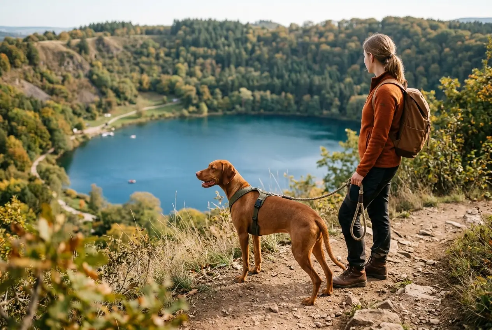
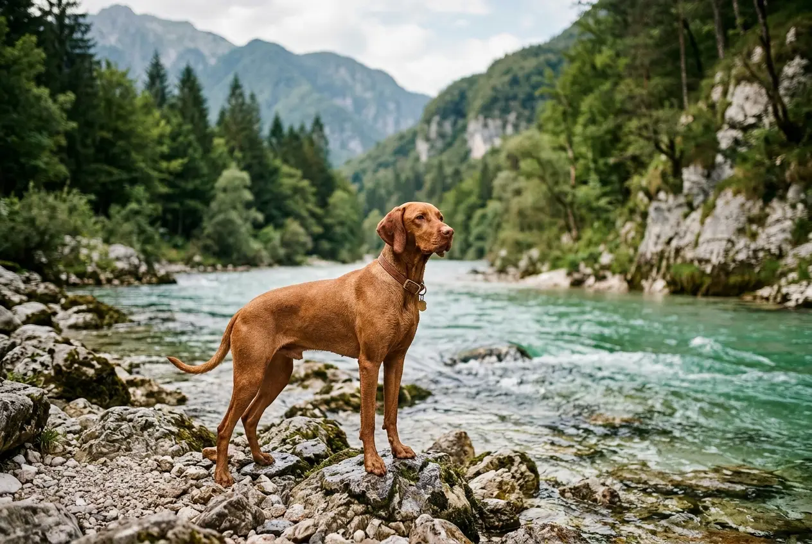

Der perfekte Urlaub mit Hund beginnt mit dem richtigen Reiseziel -- und die besten Orte sind oft keine überlaufenen Touristenmagneten. Wer einen echten Geheimtipp für den Hundeurlaub sucht, findet in Deutschland und Europa traumhafte Regionen, in denen Vierbeiner herzlich willkommen sind und Mensch und Hund ungestört die Natur genießen können.

Ob einsame Strände an der Ostsee, kristallklare Bergseen in Österreich oder weitläufige Dünenlandschaften in Holland -- dieser Ratgeber stellt dir 10 erprobte Geheimtipps für den Urlaub mit Hund vor. Dazu bekommst du praktische Packlisten, Einreisebestimmungen und Insiderwissen, damit deine nächste Reise mit Hund stressfrei und unvergesslich wird.

Zusammenfassung: Urlaub mit Hund Geheimtipp

<ul>
<li><strong>10 Geheimtipps</strong> -- 6 Reiseziele in Deutschland und 4 in Europa, abseits der Touristenmassen</li>
<li><strong>Nebensaison nutzen</strong> -- September bis Oktober und April bis Juni bieten angenehme Temperaturen, leere Strände und bis zu 50 % günstigere Unterkünfte</li>
<li><strong>EU-Heimtierausweis Pflicht</strong> -- Für Auslandsreisen braucht dein Hund Mikrochip, Tollwutimpfung (mind. 21 Tage vorher) und den EU-Pass</li>
<li><strong>Ferienhaus statt Hotel</strong> -- Unterkünfte mit eingezäuntem Grundstück bieten den meisten Komfort für Hunde</li>
<li><strong>Mecklenburgische Seenplatte</strong> -- Über 1.000 Seen, kaum Leinenpflicht in der Natur und ideale Bedingungen für den Hundeurlaub in Deutschland</li>
</ul>

10

Geheimtipps

6

Ziele in Deutschland

4

Ziele in Europa

30–50 %

Ersparnis in der Nebensaison

## Warum Geheimtipps für den Urlaub mit Hund so wertvoll sind

Überfüllte Strände, strenge Leinenpflicht und hundefeindliche Hotels -- das sind die typischen Probleme bei beliebten Reisezielen. Ein Geheimtipp für den Urlaub mit Hund zeichnet sich durch weniger Touristen, hundefreundliche Infrastruktur und viel unberührte Natur aus.

Abseits der Massen profitieren Hunde von mehr Bewegungsfreiheit und weniger Stress. Gerade ängstliche oder reaktive Hunde fühlen sich an ruhigeren Orten deutlich wohler. Gleichzeitig sind Unterkünfte in weniger bekannten Regionen oft 20–40 % günstiger als an populären Hotspots wie Sylt oder Sankt Peter-Ording.

### Vorteile versteckter Reiseziele für Hundehalter

Weniger bekannte Regionen haben häufig lockerere Regelungen für Hunde. Während an touristischen Stränden oft ganzjährige Leinenpflicht herrscht, dürfen Hunde an vielen Geheimtipp-Stränden außerhalb der Hauptsaison frei laufen. Auch die Akzeptanz in Restaurants und Cafés ist in ländlichen Regionen erfahrungsgemäß höher.

Geheimtipp-Reiseziele

<ul>
<li>Weniger Touristen, mehr Ruhe für den Hund</li>
<li>Oft keine oder lockere Leinenpflicht</li>
<li>Günstigere Unterkünfte und Nebenkosten</li>
<li>Mehr Natur und Auslaufmöglichkeiten</li>
</ul>

Populäre Reiseziele

<ul>
<li>Strenge Hundeverbote an vielen Stränden</li>
<li>Überfüllte Wege und Restaurants</li>
<li>Höhere Preise in der Hauptsaison</li>
<li>Mehr Stress für ängstliche Hunde</li>
</ul>

## 6 Geheimtipps für den Urlaub mit Hund in Deutschland

Deutschland bietet eine erstaunliche Vielfalt an hundefreundlichen Regionen. Die folgenden 6 Geheimtipps sind bei Hundehaltern noch wenig bekannt, bieten aber ideale Bedingungen für einen entspannten Hundeurlaub.

### Geheimtipp 1: Mecklenburgische Seenplatte -- das Hundeparadies im Nordosten

Die Mecklenburgische Seenplatte in Mecklenburg-Vorpommern ist einer der besten Geheimtipps für den Urlaub mit Hund in Deutschland. Mit über 1.000 Seen, ausgedehnten Wäldern und kaum Massentourismus bietet die Region alles, was Hunde und ihre Halter brauchen.

Viele Seen haben naturbelassene Ufer, an denen Hunde ungestört ins Wasser können. Der Müritz-Nationalpark erlaubt Hunde an der Leine auf allen Wanderwegen. Ferienhäuser mit eigenem Seezugang und eingezäuntem Grundstück sind hier ab 50 Euro pro Nacht buchbar.

| Kriterium | Details |
|---|---|
| **Region** | Mecklenburg-Vorpommern |
| **Beste Reisezeit** | Mai bis Oktober |
| **Hundefreundlichkeit** | Sehr hoch -- viele Seen mit Hundezugang |
| **Unterkunft ab** | 50 €/Nacht (Ferienhaus) |
| **Besonderheit** | Über 1.000 Seen, Müritz-Nationalpark |

### Geheimtipp 2: Das Wendland in Niedersachsen

Das Wendland im östlichen Niedersachsen ist ein unterschätztes Juwel für den Hundeurlaub. Die Region entlang der Elbe bietet kilometerlange Deichspaziergänge, naturbelassene Flusslandschaften und charmante Rundlingsdörfer. Touristen verirren sich hierher selten -- perfekt für Hunde, die Ruhe brauchen.

Die Elbtalaue ist ein Biosphärenreservat mit ausgedehnten Wiesen und Auwäldern. Hunde dürfen auf den meisten Wegen angeleint mitgeführt werden. Besonders im Frühling und Herbst ist das Wendland ein Traum für ausgedehnte Wanderungen mit Hund.

### Geheimtipp 3: Die Eifel -- Vulkanseen und endlose Wanderwege

Die Eifel erstreckt sich über Nordrhein-Westfalen und Rheinland-Pfalz und ist ein echtes Wanderparadies für Hunde. Die vulkanischen Maare bieten kristallklare Badeseen, und der Eifelsteig führt über 313 Kilometer durch dichte Wälder und offene Hochebenen.

Viele der Maarseen erlauben Hunde am Ufer und im Wasser. Das Gemündener Maar und das Schalkenmehrener Maar gelten als besonders hundefreundlich. Ferienhäuser in der Eifel sind ganzjährig verfügbar und deutlich günstiger als an der Küste.

### Geheimtipp 4: Die Sächsische Schweiz -- Felsenwelt für aktive Hunde

Die Sächsische Schweiz in Sachsen bietet spektakuläre Felsformationen, tiefe Schluchten und den Nationalpark Sächsische Schweiz. Hunde sind auf den meisten Wanderwegen angeleint erlaubt. Die Region ist bei Kletterern bekannt, als Hundeurlaubsziel aber noch ein echter Geheimtipp.

Der Malerweg -- einer der schönsten Wanderwege Deutschlands -- ist mit Hund gut machbar. Die 112 Kilometer lange Route lässt sich in Etappen aufteilen. Hundefreundliche Pensionen entlang des Weges kosten ab 40 Euro pro Nacht inklusive Hund.

### Geheimtipp 5: Ostsee-Geheimtipp Darß-Zingst

Während Sankt Peter-Ording und Usedom in der Hauptsaison überlaufen sind, ist die Halbinsel Darß-Zingst an der Ostsee noch vergleichsweise ruhig. Der Nationalpark Vorpommersche Boddenlandschaft bietet unberührte Strände und Salzwiesen, die ideal für ausgedehnte Spaziergänge mit Hund sind.

In Zingst gibt es einen ausgewiesenen Hundestrand, der ganzjährig geöffnet ist. Außerhalb der Hauptsaison (Oktober bis April) dürfen Hunde an fast allen Strandabschnitten frei laufen. Dieser Ostsee-Urlaub mit Hund ist ein Geheimtipp, der unter erfahrenen Hundehaltern langsam bekannter wird.

💡

<strong>Insider-Tipp: Nebensaison an der Ostsee</strong>

Von Oktober bis März gelten an den meisten Ostseestränden keine Hundeverbote. Die Strände sind leer, die Luft ist klar und dein Hund kann nach Herzenslust toben. Ferienwohnungen kosten in dieser Zeit oft nur die Hälfte des Hauptsaisonpreises.

### Geheimtipp 6: Bayerischer Wald -- Urlaub mit Hund in Baden-Württembergs Nachbarschaft

Der Bayerische Wald im Südosten Deutschlands ist der älteste Nationalpark des Landes und ein Paradies für naturverbundene Hundehalter. Über 300 Kilometer markierte Wanderwege führen durch urige Bergwälder und vorbei an glasklaren Bächen. Hunde sind im Nationalpark angeleint willkommen.

Anders als in den Alpen ist der Bayerische Wald weniger touristisch erschlossen. Hundefreundliche Bauernhöfe und Ferienwohnungen bieten ländlichen Charme ab 45 Euro pro Nacht. Die Region eignet sich auch hervorragend als Zwischenstopp auf dem Weg nach Österreich.

🏖️

Küste & Strand

Darß-Zingst an der Ostsee mit ganzjährigem Hundestrand und Nationalpark

🏞️

Seen & Wasser

Mecklenburgische Seenplatte mit über 1.000 Seen und freiem Hundezugang

🥾

Wandern & Berge

Sächsische Schweiz und Bayerischer Wald mit spektakulären Wanderwegen

🌿

Natur & Ruhe

Wendland und Eifel für entspannte Spaziergänge abseits der Massen

## 4 Geheimtipps für den Urlaub mit Hund in Europa

Auch außerhalb Deutschlands gibt es traumhafte Reiseziele, die Hunde willkommen heißen. Die folgenden 4 europäischen Geheimtipps bieten hervorragende Bedingungen für den Hundeurlaub -- bei oft besserem Wetter und niedrigeren Preisen.

### Geheimtipp 7: Polnische Ostsee -- Strand ohne Grenzen

Die polnische Ostseeküste ist einer der am meisten unterschätzten Geheimtipps für den Urlaub mit Hund in Europa. Kilometerlange, breite Sandstrände, deutlich weniger Touristen als an der deutschen Ostsee und hundefreundliche Regelungen machen die Region zum Traumziel.

Orte wie Rewal, Mielno oder Łeba bieten weitläufige Strände, an denen Hunde außerhalb der Hauptsaison fast überall frei laufen dürfen. Die Preise liegen rund 40 % unter dem deutschen Niveau. Ein Ferienhaus direkt am Strand kostet in der Nebensaison ab 35 Euro pro Nacht.

| Kriterium | Polnische Ostsee | Deutsche Ostsee |
|---|---|---|
| **Preisniveau** | ~40 % günstiger | Referenzpreis |
| **Strandbreite** | Oft 50–100 m | Meist 20–40 m |
| **Hundefreundlichkeit** | Sehr hoch (Nebensaison) | Eingeschränkt (Hauptsaison) |
| **Tourismus-Dichte** | Gering bis mittel | Hoch |
| **Anreise ab Berlin** | 3–4 Stunden | 2–3 Stunden |

### Geheimtipp 8: Österreich -- Salzkammergut und Kärnten

Österreich ist ein hervorragender Geheimtipp für den Urlaub mit Hund in den Bergen. Das Salzkammergut mit seinen über 70 Seen und die Region Kärnten bieten kristallklares Wasser, hundefreundliche Wanderwege und eine ausgeprägte Willkommenskultur für Vierbeiner.

Laut Österreich Werbung gibt es landesweit über 300 zertifizierte hundefreundliche Wanderwege. Viele Berghütten bieten Wassernäpfe und Hundedecken an. Die Anreise aus Süddeutschland -- etwa aus Baden-Württemberg oder Bayern -- dauert nur 3–5 Stunden.

ℹ️

<strong>Einreise nach Österreich mit Hund</strong>

Für die Einreise nach Österreich benötigt dein Hund einen EU-Heimtierausweis, einen Mikrochip und eine gültige Tollwutimpfung. In Wien und einigen Gemeinden gilt eine generelle Leinen- und Maulkorbpflicht. Informiere dich vorab über die lokalen Bestimmungen deines Reiseziels.

### Geheimtipp 9: Holland -- Provinz Zeeland statt Nordholland

Während die nordholländischen Küstenorte wie Bergen aan Zee oder Egmond in der Hauptsaison überlaufen sind, ist die Provinz Zeeland im Südwesten der Niederlande ein echter Geheimtipp für den [Urlaub mit Hund in Holland](https://hundewissen-mit-kopf.de/reisen/urlaub-hund-holland/). Breite Sandstrände, weniger Touristen und eine hundefreundliche Mentalität zeichnen die Region aus.

In Zeeland dürfen Hunde von Oktober bis April an fast allen Stränden frei laufen. Auch in der Hauptsaison gibt es in jedem Badeort ausgewiesene Hundestrände. Ferienhäuser mit eingezäuntem Garten sind in Zeeland ab 55 Euro pro Nacht verfügbar.

### Geheimtipp 10: Slowenien -- Soča-Tal für Abenteurer

Slowenien ist der vielleicht überraschendste Geheimtipp für den Hundeurlaub in Europa. Das Soča-Tal im Nordwesten des Landes bietet smaragdgrüne Flüsse, alpine Wanderwege und eine fast unberührte Natur. Hunde sind in Slowenien generell willkommen und dürfen in den meisten Restaurants und Cafés mit hinein.

Die Anreise aus Süddeutschland dauert etwa 5–6 Stunden. Die Preise liegen rund 30 % unter dem deutschen Niveau. Besonders das Triglav-Nationalpark-Gebiet bietet spektakuläre Wanderungen mit Hund -- von einfachen Talwanderungen bis zu anspruchsvollen Bergtouren.

## Übersicht: Alle 10 Geheimtipps im Vergleich

Die folgende Tabelle zeigt alle Geheimtipps für den Urlaub mit Hund auf einen Blick. So findest du schnell das passende Reiseziel für dich und deinen Vierbeiner.

| Nr. | Reiseziel | Land | Typ | Beste Reisezeit | Preis ab/Nacht |
|---|---|---|---|---|---|
| 1 | Mecklenburgische Seenplatte | Deutschland | Seen & Natur | Mai–Okt | 50 € |
| 2 | Wendland | Deutschland | Fluss & Wiesen | Apr–Okt | 45 € |
| 3 | Eifel | Deutschland | Wandern & Seen | Ganzjährig | 48 € |
| 4 | Sächsische Schweiz | Deutschland | Wandern & Felsen | Apr–Okt | 40 € |
| 5 | Darß-Zingst | Deutschland | Strand & Küste | Ganzjährig | 55 € |
| 6 | Bayerischer Wald | Deutschland | Wald & Berge | Mai–Okt | 45 € |
| 7 | Polnische Ostsee | Polen | Strand & Küste | Mai–Okt | 35 € |
| 8 | Salzkammergut/Kärnten | Österreich | Berge & Seen | Jun–Okt | 60 € |
| 9 | Zeeland | Niederlande | Strand & Dünen | Ganzjährig | 55 € |
| 10 | Soča-Tal | Slowenien | Berge & Flüsse | Mai–Sep | 40 € |

## Einreisebestimmungen für den Hundeurlaub in Europa

Für jeden Urlaub mit Hund im europäischen Ausland gelten einheitliche EU-Regelungen. Laut EU-Verordnung 2013/576 benötigt dein Hund für Reisen innerhalb der EU drei Dinge: einen Mikrochip, eine gültige Tollwutimpfung und einen EU-Heimtierausweis.

Die Tollwutimpfung muss mindestens 21 Tage vor dem Grenzübertritt erfolgt sein. Der EU-Heimtierausweis wird vom Tierarzt ausgestellt und enthält alle Impfungen sowie die Chipnummer. Ohne diese Dokumente kann die Einreise verweigert werden.

### Länderspezifische Besonderheiten

Einige europäische Länder haben zusätzliche Vorschriften, die über die EU-Basisregelung hinausgehen. Die folgende Tabelle zeigt die wichtigsten Unterschiede für die beliebtesten Hundeurlaub-Länder.

| Land | Zusätzliche Anforderungen | Rasselisten |
|---|---|---|
| **Deutschland** | Keine zusätzlichen | Ja, je nach Bundesland |
| **Österreich** | Maulkorbpflicht in einigen Städten | Ja, je nach Bundesland |
| **Niederlande** | Keine zusätzlichen | Nein (seit 2008 abgeschafft) |
| **Polen** | Keine zusätzlichen | Nein |
| **Slowenien** | Keine zusätzlichen | Nein |
| **Dänemark** | 13 verbotene Rassen | Ja, streng |
| **Frankreich** | Kategorie-System für Kampfhunde | Ja, 2 Kategorien |

⚠️

<strong>Achtung bei Reisen nach Dänemark</strong>

Dänemark hat eine strenge Rasseliste mit 13 verbotenen Hunderassen. Dazu gehören unter anderem Pitbull Terrier, Tosa Inu und Amerikanische Bulldoggen. Die Einreise mit diesen Rassen ist verboten und kann zur Beschlagnahmung des Hundes führen. Informiere dich vor der Reise unbedingt beim dänischen Konsulat.

## Die richtige Unterkunft für den Hundeurlaub finden

Die Wahl der Unterkunft entscheidet maßgeblich über den Erfolg des Urlaubs mit Hund. Ferienhäuser mit eingezäuntem Grundstück bieten den größten Komfort, da dein Hund sich frei bewegen kann, ohne wegzulaufen.

Spezialisierte Buchungsportale wie hundeurlaub.de listen ausschließlich Unterkünfte, die Hunde explizit willkommen heißen. Dort findest du Filtermöglichkeiten für eingezäunten Garten, Anzahl erlaubter Hunde und hundefreundliche Ausstattung. Auch Plattformen wie Novasol und FeWo-direkt bieten gute Filterfunktionen für den Hundeurlaub.

### Ferienhaus vs. Hotel vs. Camping mit Hund

Jede Unterkunftsart hat spezifische Vor- und Nachteile für den Hundeurlaub. Die Entscheidung hängt von deinem Hund, deinem Budget und deinen persönlichen Vorlieben ab.

Ferienhäuser bieten die meiste Privatsphäre und Flexibilität. Hotels mit Hund sind komfortabel, aber oft mit Einschränkungen verbunden -- viele erlauben Hunde nur in bestimmten Zimmerkategorien. Camping mit Hund ist die naturnaheste Variante: Rund 70 % der deutschen Campingplätze erlauben Hunde, und viele bieten spezielle Hundebereiche.

💡

<strong>Tipp: Urlaub mit Hund im Geheimtipp-Hotel</strong>

Einige kleinere Hotels und Pensionen in ländlichen Regionen haben sich auf Hundegäste spezialisiert. Sie bieten Hundemenüs, Hundesitting und Wanderungen mit Hundetrainer an. Diese Geheimtipp-Hotels findest du oft nicht auf den großen Buchungsportalen, sondern über lokale Tourismusverbände.

## Packliste für den Urlaub mit Hund

Eine gute Vorbereitung ist die halbe Miete beim Hundeurlaub. Die folgende Packliste deckt alles ab, was du und dein Hund für eine entspannte Reise brauchen. Laut ADAC vergessen Hundehalter am häufigsten die Reiseapotheke und ausreichend gewohntes Futter.

✅ Packliste für den Hundeurlaub

✓

EU-Heimtierausweis und Impfpass

✓

Gewohntes Futter für die gesamte Reisedauer + 2 Tage Reserve

✓

Wasser- und Futternapf (faltbar für unterwegs)

✓

Leine (kurz + Schleppleine) und Geschirr

✓

Kotbeutel (mind. 50 Stück für 1 Woche)

✓

Transportbox oder Sicherheitsgurt fürs Auto

✓

Reiseapotheke: Zeckenzange, Verbandsmaterial, Durchfallmittel

✓

Hundebett oder Decke (gewohnter Geruch beruhigt)

✓

Lieblingsspielzeug und Kauartikel

Optional: Schwimmweste für Wasseraktivitäten

Optional: Maulkorb (Pflicht in einigen Ländern/Städten)

Ein gut trainierter Rückruf ist auf Reisen besonders wichtig. Falls du noch an den [Grundkommandos für deinen Hund](https://hundewissen-mit-kopf.de/erziehung-verhalten/kommandos-hund/) arbeiten möchtest, lohnt es sich, dies vor dem Urlaub zu intensivieren.

## Tipps für die Anreise mit Hund

Die Anreise ist oft der stressigste Teil des Hundeurlaubs. Mit der richtigen Vorbereitung wird die Fahrt für Mensch und Hund entspannt. Der ADAC empfiehlt, alle 2–3 Stunden eine Pause von mindestens 15 Minuten einzulegen, damit dein Hund sich lösen und bewegen kann.

### Autofahrt mit Hund -- so klappt es stressfrei

Das Auto ist das beliebteste Transportmittel für den Hundeurlaub in Deutschland und Europa. Dein Hund muss laut Straßenverkehrsordnung während der Fahrt gesichert sein -- entweder in einer Transportbox, mit einem speziellen Sicherheitsgurt oder hinter einem Trenngitter.

1

Vorbereitung

Letzte Mahlzeit 3–4 Stunden vor Abfahrt. Kurzer Spaziergang direkt vor dem Einsteigen.

2

Während der Fahrt

Alle 2–3 Stunden Pause einlegen. Frisches Wasser anbieten, aber nicht zu viel füttern.

3

Temperatur beachten

Hund niemals im Auto lassen. Ab 20 °C Außentemperatur kann es im Auto in 30 Minuten über 45 °C heiß werden.

✓

Ankunft

Am Ziel angekommen: Erst ausgiebiger Spaziergang, dann die Unterkunft erkunden lassen.

🚫

<strong>Lebensgefahr: Hund im Auto bei Hitze</strong>

Bereits ab 20 °C Außentemperatur kann die Temperatur im geschlossenen Auto innerhalb von 30 Minuten auf über 45 °C steigen. Das ist für Hunde lebensbedrohlich. Lasse deinen Hund niemals allein im Auto -- auch nicht "nur kurz" und auch nicht bei geöffnetem Fenster.

## Hundefreundliche Aktivitäten im Urlaub

Ein gelungener Urlaub mit Hund lebt von gemeinsamen Erlebnissen. Je nach Reiseziel bieten sich unterschiedliche Aktivitäten an, die Mensch und Hund gleichermaßen Freude bereiten.

### Wandern mit Hund

Wandern ist die beliebteste Aktivität im Hundeurlaub. Achte auf die Kondition deines Hundes und plane die Touren entsprechend. Als Faustregel gilt: Hunde schaffen problemlos die doppelte Strecke eines durchschnittlichen Wanderers, benötigen aber regelmäßige Trinkpausen.

Für Wanderungen in den Bergen -- etwa in Österreich oder der Sächsischen Schweiz -- solltest du an ein gutes [Hundegeschirr statt Halsband](https://hundewissen-mit-kopf.de/hundeausstattung/hundegeschirr-oder-halsband/) denken. Es verteilt die Zugkraft gleichmäßig und schont die Halswirbelsäule deines Hundes bei steilen Passagen.

### Baden und Schwimmen mit Hund

Viele Hunde lieben Wasser. An der Mecklenburgischen Seenplatte, der polnischen Ostsee und den österreichischen Bergseen gibt es zahlreiche Badestellen, die Hunde erlauben. Achte darauf, dass dein Hund nach dem Schwimmen im Salzwasser mit Süßwasser abgespült wird, um Hautreizungen zu vermeiden. Tipps zur richtigen Pflege nach dem Baden findest du in unserem [Ratgeber zum Hund baden](https://hundewissen-mit-kopf.de/hundepflege/hund-baden/).

### Radtouren und Spaziergänge

Flache Regionen wie das Wendland, die Mecklenburgische Seenplatte oder Zeeland eignen sich hervorragend für Radtouren mit Hund. Ein Fahrrad-Abstandhalter sorgt für Sicherheit. Hunde sollten dabei mindestens 12 Monate alt sein und keine Gelenkprobleme haben.

📖

<strong>Fakt: Maximale Laufstrecke für Hunde</strong>

Die maximale Tagesstrecke hängt von Rasse, Alter und Kondition ab. Gesunde, ausgewachsene Hunde mittlerer Größe schaffen 15–25 Kilometer am Tag. Welpen unter 12 Monaten sollten pro Lebensmonat maximal 5 Minuten am Stück laufen. Senioren ab 8 Jahren benötigen häufigere Pausen.

## Die beste Reisezeit für den Hundeurlaub

Die Wahl der Reisezeit beeinflusst Preis, Wetter und Hundefreundlichkeit des Urlaubsziels erheblich. Die Nebensaison bietet für Hundehalter fast immer die besseren Bedingungen.

Von September bis Oktober herrschen an den meisten Reisezielen angenehme Temperaturen zwischen 15 und 22 °C -- ideal für aktive Hunde. Die Strände sind leerer, Hundeverbote an Stränden enden oft am 30. September, und die Unterkünfte kosten 30–50 % weniger als im Sommer.

Auch das Frühjahr von April bis Juni eignet sich hervorragend. Die Natur erwacht, die Zeckensaison beginnt jedoch ebenfalls -- ein wirksamer Zeckenschutz ist in dieser Zeit besonders wichtig. Tierärzte empfehlen, den Zeckenschutz mindestens 2 Wochen vor Reiseantritt zu aktivieren.

| Reisezeit | Vorteile | Nachteile |
|---|---|---|
| **April–Juni** | Blühende Natur, moderate Preise, wenig Touristen | Zeckensaison beginnt, Wetter wechselhaft |
| **Juli–August** | Warmes Wetter, lange Tage | Überfüllt, teuer, Hundeverbote an Stränden |
| **September–Oktober** | Ideale Temperaturen, leere Strände, günstig | Kürzere Tage, kühle Abende |
| **November–März** | Sehr günstig, kaum Touristen | Kaltes Wetter, eingeschränkte Aktivitäten |

## Leinenpflicht und Hundegesetze im Urlaub

Die Regelungen zur Leinenpflicht variieren in Deutschland stark je nach Bundesland und Gemeinde. Informiere dich vor Reiseantritt über die lokalen Bestimmungen deines Urlaubsziels. Eine gute [Leinenführigkeit](https://hundewissen-mit-kopf.de/erziehung-verhalten/leinenfuehrigkeit-trainieren/) erleichtert den Urlaub mit Hund erheblich -- besonders in Regionen mit strenger Leinenpflicht.

In Mecklenburg-Vorpommern gilt beispielsweise keine generelle Leinenpflicht im Wald, während in Schleswig-Holstein Hunde in der freien Landschaft angeleint sein müssen. In Naturschutzgebieten und Nationalparks besteht fast überall Leinenpflicht zum Schutz der Wildtiere.

⚠️

<strong>Bußgelder bei Verstößen gegen die Leinenpflicht</strong>

Verstöße gegen die Leinenpflicht können je nach Bundesland mit Bußgeldern von 50 bis 5.000 Euro geahndet werden. In Naturschutzgebieten und bei Wilderei-Vorwürfen drohen besonders hohe Strafen. Informiere dich vorab bei der Gemeindeverwaltung deines Reiseziels.

## Urlaub mit Hund: Geheimtipps für ein entspanntes Erlebnis

Neben der Wahl des richtigen Reiseziels gibt es einige Praxistipps, die den Hundeurlaub deutlich entspannter machen. Erfahrene Hundehalter schwören auf diese Strategien.

**Gewohntes Futter mitnehmen:** Futterwechsel im Urlaub führt häufig zu Durchfall. Nimm ausreichend gewohntes Futter für die gesamte Reisedauer plus 2 Tage Reserve mit. Wenn du wissen möchtest, welche Snacks dein Hund unterwegs verträgt, findest du hilfreiche Informationen in unserem Ratgeber zu [Obst für Hunde](https://hundewissen-mit-kopf.de/hundeernaehrung/duerfen-hunde-aepfel-essen/).

**Vertraute Gegenstände einpacken:** Das eigene Hundebett oder eine Decke mit gewohntem Geruch gibt deinem Hund Sicherheit in der fremden Umgebung. Besonders ängstliche Hunde profitieren davon enorm.

**Erste Erkundung in Ruhe:** Lass deinen Hund am Ankunftstag die neue Umgebung in Ruhe erkunden. Ein ausgedehnter Spaziergang in der Nähe der Unterkunft hilft ihm, sich zu orientieren und zu entspannen.

**Tierarzt-Adressen notieren:** Recherchiere vorab die nächste Tierklinik am Urlaubsort. Im Notfall zählt jede Minute. Speichere die Adresse und Telefonnummer im Handy.

✅

<strong>Geheimtipp: Hundeurlaub in der Nebensaison buchen</strong>

Die meisten Geheimtipps für den Urlaub mit Hund entfalten ihr volles Potenzial in der Nebensaison. Weniger Touristen, günstigere Preise und weniger Hundeverbote machen September bis Oktober zur idealen Reisezeit für Hundehalter.

## Fazit: Dein perfekter Urlaub mit Hund beginnt mit dem richtigen Geheimtipp

Der ideale Urlaub mit Hund führt abseits der ausgetretenen Pfade zu Orten, an denen Vierbeiner wirklich herzlich willkommen sind. Von der Mecklenburgischen Seenplatte über die polnische Ostsee bis zum slowenischen Soča-Tal -- die 10 Geheimtipps in diesem Ratgeber bieten für jeden Hundetyp das passende Reiseziel.

Nutze die Nebensaison für günstigere Preise und mehr Hundefreiheit. Packe den EU-Heimtierausweis ein, nimm ausreichend gewohntes Futter mit und informiere dich vorab über lokale Leinenregelungen. Mit dieser Vorbereitung steht einem unvergesslichen Hundeurlaub in Deutschland und Europa nichts mehr im Weg.

Weitere Inspiration für deinen nächsten [Urlaub mit Hund in Deutschland](https://hundewissen-mit-kopf.de/reisen/urlaub-hund-deutschland/) findest du in unserem ausführlichen Länder-Ratgeber.