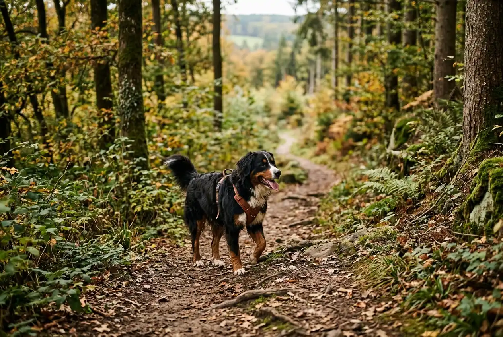
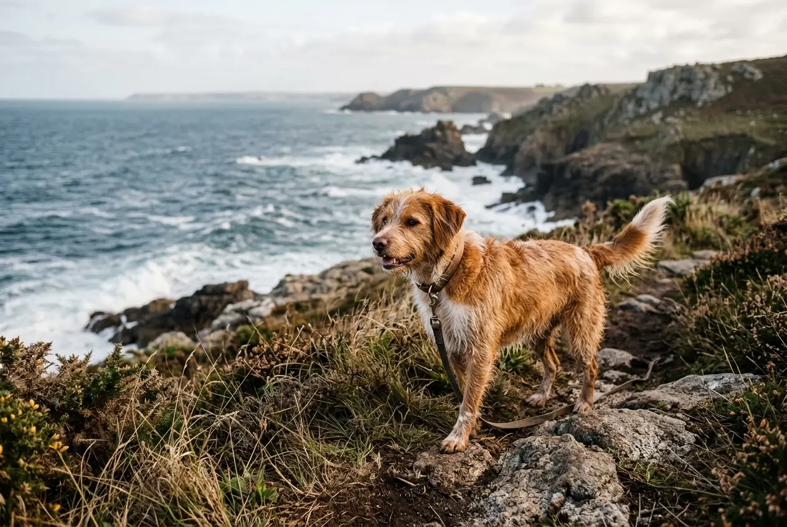

Urlaub mit Hund Geheimtipp gesucht? Abseits überfüllter Touristenhochburgen gibt es in Deutschland und Europa traumhafte Reiseziele, die Hunde herzlich willkommen heißen. Ob weitläufige Seenlandschaften, menschenleere Strände oder alpine Wanderparadiese -- die besten Hundeurlaub-Destinationen liegen oft dort, wo man sie nicht erwartet.

In diesem Ratgeber findest du 10 erprobte Geheimtipps für den Urlaub mit Hund in Deutschland, Österreich, Holland und weiteren europäischen Ländern. Dazu bekommst du praktische Checklisten, Einreisebestimmungen und Tipps für hundefreundliche Unterkünfte -- damit dein nächster Hundeurlaub stressfrei und unvergesslich wird.

Zusammenfassung: Urlaub mit Hund Geheimtipps

<ul>
<li><strong>Deutschland</strong> -- Mecklenburgische Seenplatte, Eifel und Bayerischer Wald bieten Natur pur mit wenig Massentourismus</li>
<li><strong>Ostsee-Geheimtipp</strong> -- Die Halbinsel Fischland-Darß-Zingst hat kilometerlange Hundestrände abseits der Hotspots</li>
<li><strong>Europa-Highlights</strong> -- Österreichs Salzkammergut, Hollands Zeeland und Kroatiens Istrien sind besonders hundefreundlich</li>
<li><strong>Beste Reisezeit</strong> -- Frühling und Herbst (April–Juni, September–Oktober) mit Temperaturen unter 25 °C</li>
<li><strong>Pflichtdokument</strong> -- EU-Heimtierausweis, Mikrochip und gültige Tollwutimpfung für alle Auslandsreisen</li>
</ul>

10

Geheimtipps

5–15 €

Aufpreis pro Nacht

1.000+

Seen in der Seenplatte

27

EU-Länder mit Heimtierausweis

## Warum Geheimtipps für den Urlaub mit Hund so wertvoll sind

Beliebte Reiseziele wie Sylt, Rügen oder die Toskana sind im Sommer oft überlaufen. Für Hunde bedeutet das Stress durch Menschenmassen, strenge Leinenpflicht und eingeschränkte Strandzugänge. Geheimtipps bieten das Gegenteil: weitläufige Natur, entspannte Atmosphäre und hundefreundliche Infrastruktur.

Ein guter Geheimtipp für den Hundeurlaub zeichnet sich durch drei Kriterien aus: wenig Massentourismus, ausreichend Auslaufmöglichkeiten und hundefreundliche Unterkünfte vor Ort. Die folgenden 10 Reiseziele erfüllen alle drei Anforderungen -- fünf davon liegen in Deutschland, fünf in europäischen Nachbarländern.

💡

<strong>Nebensaison nutzen</strong>

Reise zwischen April und Juni oder September und Oktober. In der Nebensaison sind viele Strände ohne Leinenpflicht zugänglich, Unterkünfte kosten 20–40 % weniger und die Temperaturen sind für Hunde angenehmer.

## 5 Geheimtipps für Urlaub mit Hund in Deutschland

Deutschland bietet eine überraschende Vielfalt an hundefreundlichen Reisezielen. Von der Küste bis zu den Alpen findest du Regionen, die Hunde nicht nur tolerieren, sondern aktiv willkommen heißen. Diese fünf Geheimtipps sind bei Hundehaltern noch wenig bekannt.

### 1. Mecklenburgische Seenplatte -- Das Hundeparadies im Nordosten

Die Mecklenburgische Seenplatte in Mecklenburg-Vorpommern ist einer der am dünnsten besiedelten Landstriche Deutschlands. Mit über 1.000 Seen, endlosen Wäldern und kaum Autoverkehr bietet die Region ideale Bedingungen für einen entspannten Hundeurlaub.

Viele Seen haben natürliche Zugänge ohne Badeverbote für Hunde. Der Müritz-Nationalpark erlaubt Hunde an der Leine auf allen Wanderwegen. Ferienhäuser mit eingezäuntem Grundstück sind in der Region ab 50 € pro Nacht buchbar.

| Merkmal | Details |
|---|---|
| Lage | Mecklenburg-Vorpommern, zwischen Schwerin und Neubrandenburg |
| Besonderheit | Über 1.000 Seen, dünn besiedelt |
| Hundestrände | Zahlreiche natürliche Badestellen |
| Beste Reisezeit | Mai–Oktober |
| Unterkunft ab | 50 € pro Nacht (Ferienhaus) |

### 2. Fischland-Darß-Zingst -- Ostsee-Geheimtipp abseits von Rügen

Während Rügen und Usedom im Sommer aus allen Nähten platzen, ist die Halbinsel Fischland-Darß-Zingst ein echter Ostsee-Geheimtipp für den Urlaub mit Hund. Kilometerlange Sandstrände, Boddengewässer und der Nationalpark Vorpommersche Boddenlandschaft bieten Abwechslung für aktive Hunde.

An ausgewiesenen Hundestränden in Ahrenshoop, Prerow und Zingst dürfen Hunde ganzjährig frei laufen. Außerhalb der Hauptsaison (Oktober bis April) sind nahezu alle Strandabschnitte für Hunde zugänglich. Die Region ist damit ein erstklassiger Ostsee Urlaub mit Hund Geheimtipp.

### 3. Eifel -- Vulkanlandschaft mit Hundewald

Die Eifel zwischen Nordrhein-Westfalen und Rheinland-Pfalz ist ein unterschätztes Wanderparadies für Hunde. Vulkanseen (Maare), dichte Buchenwälder und der Eifelsteig bieten abwechslungsreiche Routen auf über 300 km markierten Wanderwegen.

Besonders hundefreundlich: In der Vulkaneifel gibt es mehrere ausgewiesene Hundefreilaufflächen und Hundewälder. Viele Gasthöfe und Ferienhäuser heißen Hunde ohne Aufpreis willkommen. Die Eifel ist zudem ganzjährig bereisbar -- im Winter bietet sie sogar Schneewanderungen auf bis zu 700 m Höhe.

### 4. Bayerischer Wald -- Wildnis für aktive Hunde

Der Bayerische Wald an der Grenze zu Tschechien ist Deutschlands ältester Nationalpark und ein Paradies für naturbegeisterte Hundehalter. Mit 320 km markierten Wanderwegen, Berggipfeln bis 1.456 m und unberührten Bachläufen bietet die Region alles, was aktive Hunde brauchen.

Im Nationalpark Bayerischer Wald gilt Leinenpflicht, dafür sind Hunde auf allen Wegen erlaubt. Außerhalb des Parks gibt es zahlreiche Freilaufflächen. Die Region ist ein Geheimtipp für den Urlaub mit Hund in Deutschland, weil sie deutlich weniger besucht ist als die bayerischen Alpen.

### 5. Lüneburger Heide -- Weite Flächen ohne Gedränge

Die Lüneburger Heide zwischen Hamburg und Hannover bietet besonders im August und September ein spektakuläres Naturerlebnis, wenn die Heide lila blüht. Für Hunde sind die weitläufigen Heideflächen, Wälder und Seen ideal.

Im Naturschutzgebiet gilt Leinenpflicht, doch die Wege sind breit und wenig frequentiert. Rund um Schneverdingen und Bispingen gibt es viele hundefreundliche Ferienhäuser mit Garten. Die Region ist flach und damit auch für ältere Hunde oder Hunde mit Gelenkproblemen gut geeignet.

🏞️

Seenplatte

Über 1.000 Seen, kaum Tourismus, viele Badestellen für Hunde

🏖️

Darß

Kilometerlange Hundestrände an der Ostsee, ganzjährig zugänglich

🌋

Eifel

Vulkanseen, Hundewälder und 300 km Wanderwege

🌲

Bayerischer Wald

Wildnis, Berggipfel und unberührte Natur

## 5 Geheimtipps für Urlaub mit Hund in Europa

Auch außerhalb Deutschlands gibt es traumhafte Reiseziele, die Hunde herzlich willkommen heißen. Von den österreichischen Alpen bis zur kroatischen Küste -- diese fünf europäischen Geheimtipps bieten hundefreundliche Infrastruktur auf hohem Niveau.

### 6. Salzkammergut, Österreich -- Alpenidylle am See

Das Salzkammergut östlich von Salzburg ist ein erstklassiger Urlaub mit Hund Geheimtipp in Österreich. Kristallklare Bergseen, sanfte Almwiesen und gut markierte Wanderwege machen die Region zum Paradies für Mensch und Hund.

Am Wolfgangsee und Attersee gibt es ausgewiesene Hundebadestellen. Viele Almhütten erlauben Hunde und servieren sogar Wassernäpfe. Die Temperaturen bleiben selbst im Hochsommer unter 28 °C -- deutlich angenehmer für Hunde als mediterrane Ziele.

| Reiseziel | Land | Besonderheit | Hunde am Strand/See |
|---|---|---|---|
| Salzkammergut | Österreich | Bergseen, Almwanderungen | Ja, ausgewiesene Stellen |
| Zeeland | Niederlande | Breite Sandstrände | Okt–Apr: alle Strände frei |
| Istrien | Kroatien | Küste + Hinterland | Hundestrände vorhanden |
| Bretagne | Frankreich | Raue Atlantikküste | Nebensaison: fast überall |
| Südtirol | Italien | Dolomiten-Wanderungen | Bergseen, keine Strände |

### 7. Zeeland, Niederlande -- Hollands hundefreundlichste Provinz

Holland ist generell ein hundefreundliches Reiseland, doch Zeeland im Südwesten ist ein besonderer Geheimtipp für den Urlaub mit Hund. Die Provinz bietet breite Sandstrände, Dünenlandschaften und deutlich weniger Tourismus als Nordholland oder die Watteninseln.

Von Oktober bis April dürfen Hunde an fast allen Stränden Zeelands frei laufen -- ohne Leine. Auch in der Sommersaison gibt es an jedem Küstenort ausgewiesene Hundestrände. Die Anreise aus Westdeutschland dauert nur 3–4 Stunden, was Zeeland zum idealen Kurzurlaub mit Hund macht.

ℹ️

<strong>Einreise Niederlande mit Hund</strong>

Für die Einreise in die Niederlande benötigst du den EU-Heimtierausweis, einen Mikrochip und eine gültige Tollwutimpfung (mindestens 21 Tage alt). Listenhunde bestimmter Rassen unterliegen keinen Einschränkungen -- Holland hat kein Rasseverbote für Touristen.

### 8. Istrien, Kroatien -- Mittelmeer-Geheimtipp für Hunde

Kroatiens Halbinsel Istrien entwickelt sich zunehmend zum hundefreundlichen Reiseziel am Mittelmeer. Im Gegensatz zu vielen südeuropäischen Ländern gibt es in Istrien offizielle Hundestrände mit guter Infrastruktur -- etwa in Medulin, Pula und Crikvenica.

Die Nebensaison (Mai, Juni, September) ist ideal: Temperaturen zwischen 20 und 27 °C, leere Strände und günstige Unterkünfte ab 40 € pro Nacht. Das Hinterland Istriens bietet zudem Olivenhaine, Trüffelwälder und ruhige Wanderwege -- perfekt für Hunde, die keine Strandfans sind.

### 9. Bretagne, Frankreich -- Raue Küste für abenteuerlustige Hunde

Die Bretagne im Nordwesten Frankreichs ist ein Geheimtipp für alle, die mit ihrem Hund raue Atlantikküste, dramatische Klippen und einsame Buchten erleben möchten. Außerhalb der Hochsaison (Juli/August) sind die meisten Strände für Hunde zugänglich.

Der Küstenwanderweg GR34 erstreckt sich über 2.000 km und ist größtenteils hundefreundlich. Die Bretagne ist zudem kulinarisch ein Highlight -- viele Restaurants erlauben Hunde auf der Terrasse. Die Anreise mit dem Auto dauert von Westdeutschland etwa 8–10 Stunden.

### 10. Südtirol, Italien -- Dolomiten-Wanderungen mit Hund

Südtirol verbindet italienisches Flair mit alpiner Natur und ist überraschend hundefreundlich. Viele Berghütten und Gasthöfe heißen Hunde willkommen, und die gut markierten Wanderwege bieten Routen für jedes Fitness-Level.

Der Pragser Wildsee, die Seiser Alm und das Pustertal sind besonders lohnende Ziele. Hunde dürfen auf den meisten Wanderwegen ohne Leine laufen, sofern sie abrufbar sind. In Naturschutzgebieten gilt Leinenpflicht. Die beste Reisezeit ist Juni bis Oktober, wenn die Almwiesen blühen und die Bergbahnen Hunde transportieren (meist kostenlos).

💡

<strong>Bergbahnen mit Hund</strong>

In Südtirol und Österreich transportieren die meisten Seilbahnen und Sessellifte Hunde kostenlos oder für 2–5 € pro Fahrt. Kleine Hunde reisen in einer Transportbox, größere Hunde benötigen einen Maulkorb. Informiere dich vorab auf der Website des Betreibers.

## Vergleich: Deutschland vs. Europa -- Wo lohnt sich der Hundeurlaub?

Die Wahl zwischen einem Hundeurlaub in Deutschland und einer Reise ins europäische Ausland hängt von mehreren Faktoren ab. Beide Optionen haben klare Vor- und Nachteile.

Vorteile Deutschland

<ul>
<li>Keine Einreisedokumente nötig -- einfach losfahren</li>
<li>Kurze Anreise, ideal für Kurzurlaube (2–4 Tage)</li>
<li>Bekannte Tierarzt-Infrastruktur im Notfall</li>
<li>Kein Sprachproblem bei Unterkünften</li>
</ul>

Vorteile Europa

<ul>
<li>Milderes Klima im Frühling und Herbst</li>
<li>Oft günstigere Unterkünfte (Kroatien, Frankreich)</li>
<li>Lockerere Leinenpflicht in vielen Ländern</li>
<li>Größere landschaftliche Vielfalt (Meer + Berge)</li>
</ul>

Für einen ersten Urlaub mit Hund empfiehlt sich ein Ziel in Deutschland -- die kurze Anreise und die vertraute Umgebung reduzieren Stress für den Hund. Erfahrene Reisehunde profitieren von der Abwechslung europäischer Ziele. Wichtig ist in jedem Fall eine gute [Leinenführigkeit](https://hundewissen-mit-kopf.de/erziehung-verhalten/leinenfuehrigkeit-trainieren/), die den Urlaub für alle entspannter macht.

## Einreisebestimmungen für Hunde in Europa

Für Reisen mit Hund innerhalb der EU gelten einheitliche Grundregeln. Laut EU-Verordnung 2013/576 benötigt jeder Hund drei Dokumente: einen EU-Heimtierausweis, einen ISO-Mikrochip (15-stellig) und eine gültige Tollwutimpfung, die mindestens 21 Tage vor Reiseantritt erfolgt sein muss.

Einige Länder haben zusätzliche Anforderungen. Der ADAC empfiehlt, sich mindestens 4 Wochen vor Reisebeginn beim Tierarzt über länderspezifische Bestimmungen zu informieren.

| Land | Zusätzliche Anforderungen | Rasseverbote |
|---|---|---|
| Niederlande | Keine | Nein |
| Österreich | Maulkorbpflicht in öffentlichen Verkehrsmitteln | Ja, je nach Bundesland |
| Kroatien | Keine | Nein |
| Frankreich | Kategorie-1-Hunde verboten | Ja (Pitbull-Typ) |
| Italien | Leine + Maulkorb in öffentlichen Bereichen | Nein |
| Dänemark | Keine | Ja (13 Rassen) |

⚠️

<strong>Achtung: Dänemark und Frankreich haben Rasseverbote</strong>

In Dänemark sind 13 Hunderassen verboten, darunter Pitbull Terrier, Tosa Inu und Amerikanische Bulldoggen. In Frankreich dürfen Kategorie-1-Hunde (Kampfhunde ohne Stammbaum) nicht einreisen. Prüfe vor der Reise, ob dein Hund betroffen ist.

Wenn du deinen [Urlaub mit Hund in Holland](https://hundewissen-mit-kopf.de/reisen/urlaub-hund-holland/) planst, profitierst du von besonders unkomplizierten Einreiseregeln -- es gibt weder Rasseverbote noch zusätzliche Impfanforderungen.

## Hundefreundliche Unterkünfte finden: So gehst du vor

Die Wahl der richtigen Unterkunft entscheidet maßgeblich über den Erfolg deines Hundeurlaubs. Nicht jede als "hundefreundlich" beworbene Unterkunft bietet tatsächlich gute Bedingungen für Vierbeiner.

### Ferienhäuser und Ferienwohnungen

Ferienhäuser sind die beliebteste Unterkunftsart für den Hundeurlaub. Sie bieten Platz, Privatsphäre und oft einen eingezäunten Garten. Achte bei der Buchung auf folgende Kriterien: eingezäuntes Grundstück, Holz- oder Fliesenboden (statt Teppich), Nähe zu Auslaufgebieten und keine Begrenzung der Hundegröße.

### Hotels mit Hund

Spezielle Hundehotels bieten Extras wie Hundemenüs, Hundesitter-Service und eingezäunte Spielwiesen. Ein Urlaub mit Hund Geheimtipp für Hotels: Suche nach Unterkünften mit dem Label "Hundehotel" auf Bewertungsportalen -- diese investieren gezielt in hundefreundliche Infrastruktur und berechnen oft nur 5–10 € Aufpreis pro Nacht.

### Camping mit Hund

Campingplätze bieten Hunden viel Freiraum und Naturkontakt. In Deutschland erlauben über 80 % der Campingplätze Hunde. Besonders empfehlenswert sind Plätze mit direktem Seezugang, Hundedusche und ausgewiesenen Hundewiesen.

✅ Checkliste: Hundefreundliche Unterkunft erkennen

✓

Eingezäunter Garten oder Grundstück

✓

Keine Begrenzung bei Hundegröße oder -anzahl

✓

Auslaufgebiet in max. 10 Minuten Fußweg

✓

Pflegeleichter Bodenbelag (kein Teppich)

Optional: Hundemenü, Hundedusche, Hundesitter

## Packliste: Das braucht dein Hund im Urlaub

Eine gute Vorbereitung verhindert Stress unterwegs. Die folgende Packliste deckt alles ab, was dein Hund für einen Urlaub von 1–2 Wochen benötigt. Passe die Liste an die Reisedauer und das Reiseziel an.

### Dokumente und Gesundheit

- EU-Heimtierausweis (bei Auslandsreisen)
- Impfpass mit aktueller Tollwutimpfung
- Hundehaftpflichtversicherung (Nachweis)
- Kontaktdaten eines Tierarztes am Urlaubsort
- Medikamente (falls nötig) + Zeckenschutz
- Erste-Hilfe-Set für Hunde

### Ausstattung und Futter

- Gewohntes Futter für die gesamte Reisedauer + 2 Tage Reserve
- Falt-Wassernapf und Futternapf
- [Hundegeschirr oder Halsband](https://hundewissen-mit-kopf.de/hundeausstattung/hundegeschirr-oder-halsband/) mit Adressanhänger
- Schleppleine (5–10 m) für Gebiete mit Leinenpflicht
- Kotbeutel (mindestens 50 Stück)
- Vertraute Decke oder Hundebett
- [Robustes Hundespielzeug](https://hundewissen-mit-kopf.de/hundeausstattung/hundespielzeug-unkaputtbar/) für Regentage

📖

<strong>Futter im Urlaub: Umstellung vermeiden</strong>

Laut Tierärzten verursacht ein plötzlicher Futterwechsel bei 30–40 % der Hunde Magen-Darm-Probleme. Nimm daher immer das gewohnte Futter in ausreichender Menge mit. Berechne pro Tag die übliche Futtermenge plus 10 % Puffer für erhöhte Aktivität.

## Schritt für Schritt: So planst du deinen Hundeurlaub

Ein gut geplanter Hundeurlaub beginnt 6–8 Wochen vor der Abreise. Die folgenden Schritte helfen dir, nichts zu vergessen und stressfrei in den Urlaub mit Hund zu starten.

1

Reiseziel wählen (6–8 Wochen vorher)

Prüfe Einreisebestimmungen, Klima und Hundefreundlichkeit des Reiseziels. Nutze die Geheimtipps aus diesem Artikel als Inspiration.

2

Unterkunft buchen (4–6 Wochen vorher)

Suche gezielt nach hundefreundlichen Unterkünften mit eingezäuntem Garten. Kläre Aufpreis und Regeln vorab per E-Mail.

3

Tierarztbesuch (4 Wochen vorher)

EU-Heimtierausweis ausstellen lassen, Impfungen auffrischen, Zeckenschutz und Reiseapotheke besprechen.

✓

Packen und losfahren

Packliste abhaken, Futter einpacken, Autobox oder Sicherheitsgurt vorbereiten. Plane alle 2–3 Stunden eine Pause ein.

## Tipps für die Anreise mit Hund

Die Anreise ist für viele Hunde der stressigste Teil des Urlaubs. Mit der richtigen Vorbereitung wird die Fahrt deutlich entspannter -- egal ob mit Auto, Bahn oder Fähre.

### Autofahrt mit Hund

Das Auto ist das beliebteste Transportmittel für den Hundeurlaub. Laut StVO müssen Hunde im Auto gesichert sein -- entweder in einer Transportbox, mit einem Sicherheitsgurt für Hunde oder hinter einem Trenngitter. Plane alle 2–3 Stunden eine Pause von 15–20 Minuten ein, damit dein Hund trinken, sich lösen und sich bewegen kann.

### Bahnfahrt mit Hund

Bei der Deutschen Bahn fahren kleine Hunde (bis Hauskatzen-Größe) in einer Transportbox kostenlos mit. Größere Hunde benötigen eine Fahrkarte zum halben Preis und müssen einen Maulkorb tragen. In vielen europäischen Bahnen gelten ähnliche Regeln.

⚠️

<strong>Hitzegefahr im Auto</strong>

Bereits ab 20 °C Außentemperatur kann sich ein geschlossenes Auto innerhalb von 30 Minuten auf über 46 °C aufheizen. Lasse deinen Hund niemals allein im Auto -- auch nicht für kurze Erledigungen. Parke im Schatten und nutze Sonnenschutzfolien.

## Hundefreundliche Aktivitäten im Urlaub

Ein gelungener Hundeurlaub lebt von gemeinsamen Erlebnissen. Diese Aktivitäten eignen sich besonders gut für Reisen mit Hund und sind an den meisten Geheimtipp-Zielen verfügbar.

### Wandern und Trekking

Wandern ist die beliebteste Aktivität im Hundeurlaub. Achte auf hundefreundliche Wege ohne Kletterpassagen, ausreichend Wasserstellen und angemessene Distanzen. Als Faustregel gilt: Gesunde erwachsene Hunde schaffen 15–20 km pro Tag, Welpen und Senioren maximal 5–8 km.

### Schwimmen und Wassersport

Viele Hunde lieben Wasser. An Seen, Flüssen und Hundestränden können wasserbegeisterte Hunde ausgiebig baden. Achte auf Strömungen, Wasserqualität und Blaualgen-Warnungen. Nach dem Schwimmen im Salzwasser solltest du deinen Hund mit Süßwasser abspülen -- Tipps dazu findest du in unserem Ratgeber zum [Hund baden](https://hundewissen-mit-kopf.de/hundepflege/hund-baden/).

### Hundeparks und Freilaufflächen

Viele Urlaubsregionen bieten eingezäunte Hundeparks oder Freilaufflächen. Diese sind ideal, um deinen Hund sicher toben zu lassen und Kontakt zu anderen Hunden zu ermöglichen. Lokale Tourismusbüros informieren über Standorte.

| Aktivität | Geeignet für | Besonderheiten |
|---|---|---|
| Wandern | Alle Hunde | Distanz an Alter und Fitness anpassen |
| Schwimmen | Wasserfreudige Rassen | Strömung und Wasserqualität prüfen |
| Hundestrand | Alle Hunde | Leinenpflicht je nach Saison |
| Hundeparks | Soziale Hunde | Eingezäunt, ideal für Freilauf |
| Radtouren | Ausdauernde Hunde | Max. 15 km, nicht bei Hitze |

## Kosten im Überblick: Was kostet Hundeurlaub wirklich?

Urlaub mit Hund muss nicht teuer sein. Die Mehrkosten halten sich in Grenzen, wenn du vorausschauend planst. Die größten Kostenfaktoren sind Unterkunft, Anreise und Vorbereitung.

5–15 €

Aufpreis/Nacht (Hotel)

0 €

Aufpreis Ferienhaus (oft)

~15 €

EU-Heimtierausweis

50–150 €

Mehrkosten pro Woche

Die Gesamtkosten für einen einwöchigen Hundeurlaub in Deutschland liegen bei 50–100 € Mehrkosten gegenüber einem Urlaub ohne Hund. Bei Auslandsreisen kommen Kosten für den EU-Heimtierausweis, eventuelle Impfungen und Fährtickets hinzu -- insgesamt 100–150 € zusätzlich. Ferienhäuser sind oft die günstigste Option, da viele Vermieter keinen Hundeaufpreis berechnen.

## Häufige Fehler beim Urlaub mit Hund vermeiden

Selbst erfahrene Hundehalter machen im Urlaub typische Fehler, die den Trip für Mensch und Hund belasten. Diese fünf Fehler solltest du kennen und vermeiden.

1. **Kein Probelauf vor der Reise** -- Teste vor dem ersten großen Urlaub, wie dein Hund auf Autofahrten, neue Umgebungen und fremde Geräusche reagiert. Ein Wochenendtrip in die Nähe ist der beste Test.

2. **Futter umstellen im Urlaub** -- Nimm immer das gewohnte Futter mit. Ein Futterwechsel im Urlaub führt häufig zu Durchfall und Erbrechen.

3. **Einreisebestimmungen ignorieren** -- Fehlende Dokumente können an der Grenze zur Einreiseverweigerung führen. Prüfe die Bestimmungen mindestens 4 Wochen vorher.

4. **Zu lange Wanderungen am ersten Tag** -- Steigere die Aktivität langsam. Am Anreisetag reicht ein kurzer Spaziergang zur Eingewöhnung.

5. **Hund bei Hitze im Auto lassen** -- Selbst bei 20 °C Außentemperatur wird das Auto zur tödlichen Falle. Nimm deinen Hund immer mit oder lasse jemanden im Auto bei geöffneten Fenstern.

🚫

<strong>Lebensgefahr: Hund im heißen Auto</strong>

Jedes Jahr sterben Hunde an Hitzschlag in parkenden Autos. Bereits ab 20 °C Außentemperatur steigt die Innentemperatur in 10 Minuten auf über 35 °C. Lass deinen Hund niemals im geschlossenen Auto -- auch nicht "nur kurz". Im Notfall die 112 rufen.

## Fazit: Dein perfekter Urlaub mit Hund beginnt mit dem richtigen Ziel

Der beste Urlaub mit Hund Geheimtipp ist das Reiseziel, das zu dir und deinem Hund passt. Deutschland bietet mit der Mecklenburgischen Seenplatte, dem Darß, der Eifel, dem Bayerischen Wald und der Lüneburger Heide fünf herausragende Optionen für naturnahen Hundeurlaub ohne Massentourismus. In Europa überzeugen das Salzkammergut, Zeeland, Istrien, die Bretagne und Südtirol mit hundefreundlicher Infrastruktur und landschaftlicher Vielfalt.

Plane deinen Hundeurlaub 6–8 Wochen im Voraus, kümmere dich rechtzeitig um Dokumente und Impfungen, und wähle eine Unterkunft mit eingezäuntem Grundstück. Weitere Inspiration für deinen nächsten [Urlaub mit Hund in Deutschland](https://hundewissen-mit-kopf.de/reisen/urlaub-hund-deutschland/) findest du in unserem ausführlichen Länder-Ratgeber. Dein Hund wird es dir mit wedelndem Schwanz danken.