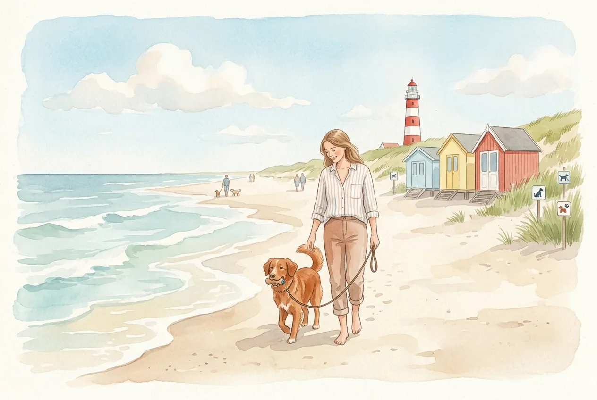
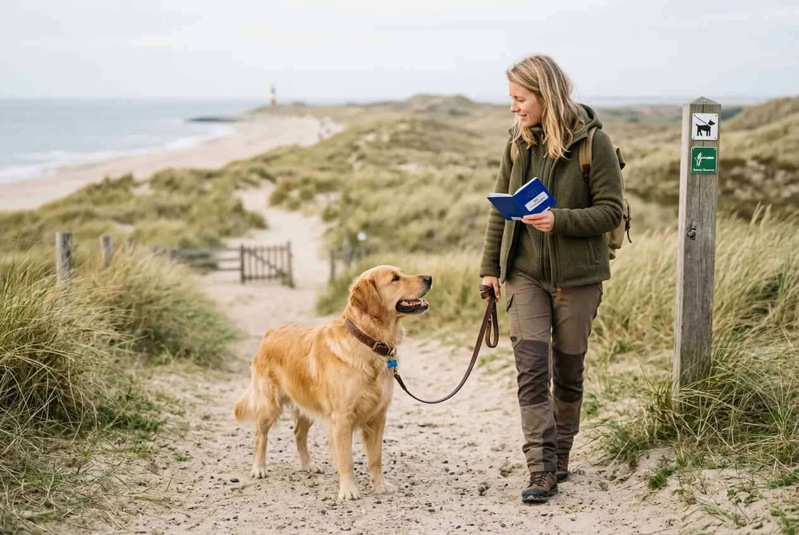
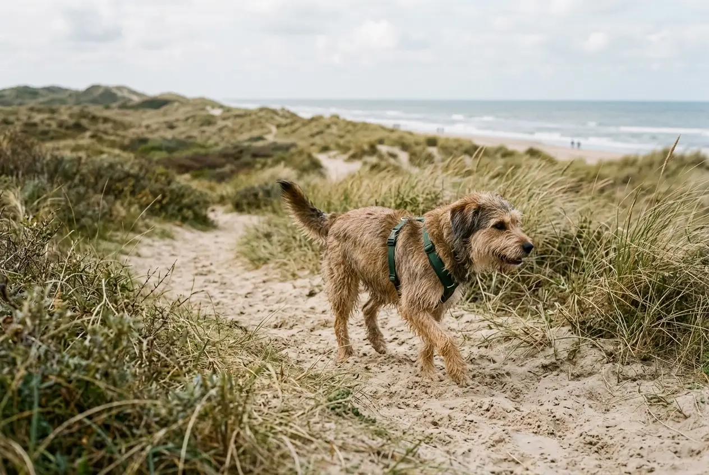

Die Niederlande zählen zu den hundefreundlichsten Reisezielen Europas -- und ein Urlaub mit Hund in Holland lässt sich dank kurzer Anreise, hunderten Kilometern Sandstrand und entspannter Einreisebestimmungen unkompliziert planen. Ob Zeeland, Nordholland oder die friesischen Inseln: Dein Vierbeiner ist an der holländischen Nordseeküste willkommen.

In diesem Ratgeber findest du alles, was du für deinen Holland-Urlaub mit Hund wissen musst: aktuelle Einreiseregeln, die besten hundefreundlichen Strände, Tipps für Ferienhaus und Ferienwohnung sowie eine praktische Packliste. So wird euer gemeinsamer Urlaub mit Hund am Meer entspannt und sicher.

Zusammenfassung: Urlaub mit Hund in Holland

<ul>
<li><strong>Einreise unkompliziert</strong> -- EU-Heimtierausweis, Mikrochip und gültige Tollwutimpfung (mind. 21 Tage alt) reichen aus</li>
<li><strong>Keine Rasseverbote</strong> -- Alle Hunderassen dürfen seit 2009 ohne Einschränkungen in die Niederlande einreisen</li>
<li><strong>Strände saisonal geregelt</strong> -- Oktober bis Mai: Hunde an fast allen Stränden erlaubt; Mai bis September: nur an ausgewiesenen Hundestränden</li>
<li><strong>Beste Regionen</strong> -- Zeeland, Nordholland (Texel, Bergen aan Zee) und die Westfriesischen Inseln sind besonders hundefreundlich</li>
<li><strong>Ferienhaus ab 60 €/Nacht</strong> -- Hundezuschlag meist 5-15 € pro Nacht; eingezäunte Gärten in vielen Unterkünften verfügbar</li>
</ul>

450+ km

Küstenlinie

0

Rasseverbote

7 Monate

Freier Strandzugang (Okt-Apr)

2-4 Std.

Anreise aus Deutschland

## Einreisebestimmungen für Hunde in die Niederlande

Die Einreise mit Hund nach Holland ist innerhalb der EU einheitlich geregelt und erfordert nur wenige Dokumente. Da die Niederlande ein EU-Mitgliedsstaat sind, gelten die EU-Verordnung Nr. 576/2013 und die dazugehörigen Durchführungsbestimmungen.

### EU-Heimtierausweis und Mikrochip

Jeder Hund benötigt für die Einreise in die Niederlande einen gültigen EU-Heimtierausweis. Dieses blaue Dokument wird vom Tierarzt ausgestellt und enthält alle Impfungen, die Mikrochip-Nummer und die Daten des Halters. Der Ausweis kostet in Deutschland zwischen 10 und 15 Euro.

Seit 2011 ist die Kennzeichnung per Mikrochip (ISO-Norm 11784/11785) für alle Hunde in der EU Pflicht. Eine ältere Tätowierung wird nur anerkannt, wenn sie vor dem 3. Juli 2011 angebracht wurde und noch gut lesbar ist. Der Mikrochip muss vor der Tollwutimpfung implantiert worden sein.

### Tollwutimpfung -- Fristen und Gültigkeit

Die Tollwutimpfung ist die wichtigste Voraussetzung für die Einreise mit Hund in die Niederlande. Die Impfung muss mindestens 21 Tage vor Reiseantritt erfolgt sein und darf nicht abgelaufen sein. Bei Erstimpfung beginnt die Gültigkeit 21 Tage nach der Impfung. Bei Auffrischungsimpfungen innerhalb der Gültigkeitsdauer gilt der Schutz sofort weiter.

⚠️

<strong>Impfung rechtzeitig planen</strong>

Plane den Tierarztbesuch mindestens 4 Wochen vor der Abreise. Ist die Tollwutimpfung abgelaufen, beginnt die 21-Tage-Frist erneut -- und dein Holland-Urlaub mit Hund muss verschoben werden.

### Welpen und Junghunde mitnehmen

Hundewelpen dürfen ab einem Alter von 15 Wochen in die Niederlande einreisen. Der Grund: Die Tollwutimpfung ist frühestens ab der 12. Lebenswoche möglich, und danach müssen 21 Tage Wartezeit vergehen (12 Wochen + 21 Tage = 15 Wochen). Jüngere Welpen ohne Tollwutimpfung dürfen nicht einreisen.

### Keine Rasseverbote in Holland

Die Niederlande haben im Jahr 2009 die rassenspezifische Gesetzgebung (Regeling Agressieve Dieren) abgeschafft. Seitdem dürfen alle Hunderassen ohne Einschränkungen einreisen -- auch Pitbull Terrier, Staffordshire Terrier oder Rottweiler. Es gibt weder Maulkorbpflicht noch Leinenzwang aufgrund der Rasse. Diese liberale Regelung macht Holland besonders attraktiv für Halter von sogenannten Listenhunden.

✅

<strong>Alle Rassen willkommen</strong>

Anders als in Deutschland mit den unterschiedlichen Landeshundeverordnungen gibt es in den Niederlanden keine Rasselisten. Dein Hund ist unabhängig von seiner Rasse willkommen.

### Checkliste: Einreise-Dokumente auf einen Blick

| Dokument / Anforderung | Details |
|---|---|
| EU-Heimtierausweis | Gültig, vom Tierarzt ausgestellt |
| Mikrochip | ISO 11784/11785, vor der Impfung implantiert |
| Tollwutimpfung | Mind. 21 Tage alt, nicht abgelaufen |
| Maximale Anzahl Hunde | 5 Tiere pro Person |
| Mindestalter Welpen | 15 Wochen |
| Rasseverbote | Keine |

## Die besten Regionen für Urlaub mit Hund in Holland

Die Niederlande bieten auf kompaktem Raum sehr unterschiedliche Küstenlandschaften. Von den breiten Sandstränden Zeelands bis zu den windgeschützten Buchten der Westfriesischen Inseln -- jede Region hat ihren eigenen Charme für einen Urlaub mit Hund am Meer.

🏖️

Zeeland

Breiteste Strände Hollands, viele Hundestrände, familienfreundlich. Ideal für Urlaub mit Hund am Meer.

🌊

Nordholland

Bergen aan Zee, Egmond, Julianadorp. Endlose Dünenlandschaften und hundefreundliche Strandbars.

🏝️

Westfriesische Inseln

Texel, Ameland, Schiermonnikoog. Naturparadies mit Freilaufgebieten und wenig Verkehr.

⛵

Südholland

Scheveningen, Katwijk, Noordwijk. Stadtnah mit guter Infrastruktur und Hundestrand-Abschnitten.

### Zeeland -- die hundefreundlichste Provinz

Zeeland gilt als das beliebteste Reiseziel für Urlaub mit Hund in Holland. Die Provinz im Südwesten der Niederlande bietet über 650 km Küstenlinie mit breiten Sandstränden, die zu den saubersten Europas zählen. Besonders hundefreundliche Orte sind Cadzand-Bad, Renesse, Domburg und Kamperland.

In Cadzand-Bad gibt es einen ausgewiesenen Hundestrand, der ganzjährig zugänglich ist. Der Strand ist breit genug, dass sich Hunde frei bewegen können, ohne andere Badegäste zu stören. Auch in Renesse und Domburg sind Hundestrandabschnitte klar beschildert.

Die Anreise nach Zeeland aus dem Ruhrgebiet dauert etwa 3 Stunden, aus Süddeutschland rund 5-6 Stunden. Die Region bietet zahlreiche hundefreundliche Ferienhäuser mit eingezäuntem Garten -- ideal, wenn dein Hund gerne draußen liegt.

### Nordholland -- Dünen und endlose Strände

Nordholland erstreckt sich von Amsterdam bis zur Spitze bei Den Helder und bietet einige der schönsten Strände der Niederlande. Bergen aan Zee, Egmond aan Zee und Julianadorp sind besonders bei Hundebesitzern beliebt. Die Dünenlandschaft Schoorlse Duinen ist mit 22 km² das breiteste Dünengebiet der Niederlande und bietet ausgedehnte Wanderwege für Hunde.

In Bergen aan Zee dürfen Hunde von Oktober bis Mai den gesamten Strand nutzen. In der Sommersaison gibt es einen separaten Hundestrandabschnitt nördlich des Hauptstrandes. Nordholland ist von der deutschen Grenze aus in etwa 3-4 Stunden erreichbar.

### Westfriesische Inseln mit Hund

Die Westfriesischen Inseln Texel, Vlieland, Terschelling, Ameland und Schiermonnikoog sind ein Naturparadies für Hunde. Texel ist die größte und bekannteste Insel und bietet 30 km Sandstrand, von denen große Abschnitte ganzjährig für Hunde freigegeben sind. Die Insel erreicht man per Fähre ab Den Helder -- die Überfahrt dauert etwa 20 Minuten und kostet für einen Hund rund 5 Euro.

Auf Texel gibt es ausgewiesene Freilaufgebiete in den Dünen, wo Hunde ohne Leine toben dürfen. In den Naturschutzgebieten De Slufter und De Muy gilt allerdings Leinenpflicht zum Schutz brütender Vögel. Auch auf Ameland und Schiermonnikoog sind Hunde willkommen -- beide Inseln sind autofrei oder autoarm, was das Spazierengehen besonders entspannt macht.

💡

<strong>Fähre frühzeitig buchen</strong>

Die Fähren zu den Westfriesischen Inseln sind in der Hauptsaison schnell ausgebucht. Buche mindestens 4-6 Wochen im Voraus, besonders wenn du mit Auto und Hund reist. In der Nebensaison ist eine spontane Überfahrt meist problemlos möglich.

## Hundestrände in Holland -- Regeln und Saisonzeiten

Die Strandregeln für Hunde in den Niederlanden variieren je nach Gemeinde und Jahreszeit. Grundsätzlich gilt eine klare saisonale Einteilung, die du unbedingt kennen solltest, bevor du deinen Urlaub mit Hund in Holland planst.

### Nebensaison: Oktober bis April

In der Nebensaison vom 1. Oktober bis zum 1. Mai dürfen Hunde an nahezu allen Stränden in Holland frei laufen. Viele Gemeinden erlauben in dieser Zeit auch das Freilaufen ohne Leine am Strand. Die Nebensaison ist daher die ideale Reisezeit für einen Urlaub mit Hund am Meer -- die Strände sind leer, die Preise für Ferienhäuser niedriger und dein Hund hat maximale Freiheit.

### Hauptsaison: Mai bis September

Während der Sommermonate von Mai bis September gelten an den meisten holländischen Stränden Einschränkungen für Hunde. An vielen Hauptstränden sind Hunde in dieser Zeit komplett verboten. Allerdings gibt es in fast jedem Badeort ausgewiesene Hundestrand-Abschnitte, die auch im Sommer zugänglich sind.

| Region | Hundestrand-Regelung Sommer | Hundestrand-Regelung Winter |
|---|---|---|
| Zeeland (Cadzand, Renesse) | Ausgewiesene Hundestrand-Abschnitte | Alle Strände frei zugänglich |
| Nordholland (Bergen, Egmond) | Separate Hundestrand-Zonen | Alle Strände frei zugänglich |
| Texel | Große Abschnitte ganzjährig frei | Alle Strände frei zugänglich |
| Südholland (Scheveningen) | Kleine Hundestrand-Bereiche | Alle Strände frei zugänglich |
| Zandvoort | Hundestrand nördlich und südlich | Alle Strände frei zugänglich |

### Leinenpflicht am Strand und in Dünen

Eine generelle Leinenpflicht am Strand gibt es in Holland nicht. In der Nebensaison dürfen Hunde an den meisten Stränden frei laufen. In der Hauptsaison verlangen einige Gemeinden an den Hundestrand-Abschnitten eine Leinenpflicht -- andere erlauben Freilauf. Die genauen Regeln sind an den Strandzugängen auf Schildern angegeben.

In Dünengebieten und Naturschutzgebieten gilt fast überall Leinenpflicht. Grund ist der Schutz brütender Vögel und seltener Pflanzenarten. Verstöße können mit Bußgeldern von 95 bis 390 Euro geahndet werden. Wenn dein Hund noch an der [Leinenführigkeit](https://hundewissen-mit-kopf.de/erziehung-verhalten/leinenfuehrigkeit-trainieren/) arbeitet, übe das am besten schon vor dem Urlaub.

🚫

<strong>Bußgelder bei Verstößen</strong>

In den Niederlanden werden Verstöße gegen die Leinenpflicht und das Hundeverbot am Strand konsequent kontrolliert. Bußgelder liegen zwischen 95 und 390 Euro. Hundekot nicht aufzusammeln kostet ebenfalls mindestens 95 Euro.

## Ferienhaus in Holland mit Hund finden

Ein Ferienhaus ist die beliebteste Unterkunftsart für Urlaub mit Hund in Holland. Im Vergleich zu Hotels bieten Ferienhäuser mehr Platz, einen eigenen Garten und die Freiheit, den Tagesablauf flexibel zu gestalten. Das Angebot an hundefreundlichen Ferienhäusern und Ferienwohnungen in den Niederlanden ist groß.

### Worauf du bei der Buchung achten solltest

Nicht jedes Ferienhaus in Holland erlaubt Hunde. Bei der Suche nach einer passenden Unterkunft solltest du gezielt nach hundefreundlichen Angeboten filtern. Die meisten Buchungsportale bieten einen Filter "Haustiere erlaubt" an.

Besonders gefragt sind Ferienhäuser mit eingezäuntem Garten. Ein eingezäunter Garten gibt dir die Sicherheit, dass dein Hund sich frei bewegen kann, ohne wegzulaufen. Achte bei der Buchung auf folgende Punkte:

- **Anzahl erlaubter Hunde:** Manche Unterkünfte erlauben nur 1 Hund, andere bis zu 3
- **Eingezäunter Garten:** Zaun-Höhe prüfen -- für große Hunde mindestens 1,20 m
- **Hundezuschlag:** Meist 5-15 Euro pro Nacht und Hund
- **Endreinigung:** Bei Hundehaar-Verschmutzung kann eine höhere Reinigungsgebühr anfallen
- **Lage:** Nähe zum Strand, zu Waldgebieten oder Freilaufzonen

### Ferienhaus-Preise nach Region und Saison

Die Kosten für ein hundefreundliches Ferienhaus in Holland variieren stark je nach Region, Saison und Ausstattung. Die folgende Tabelle gibt dir eine Orientierung:

| Region | Nebensaison (Okt-Apr) | Hauptsaison (Mai-Sep) | Hundezuschlag/Nacht |
|---|---|---|---|
| Zeeland | 60-120 €/Nacht | 100-250 €/Nacht | 5-15 € |
| Nordholland | 70-130 €/Nacht | 110-220 €/Nacht | 5-12 € |
| Texel | 80-150 €/Nacht | 130-280 €/Nacht | 5-10 € |
| Südholland | 65-110 €/Nacht | 90-200 €/Nacht | 5-15 € |

💡

<strong>Frühbucher-Rabatte nutzen</strong>

Viele Ferienhaus-Anbieter in Holland gewähren 10-20 % Frühbucher-Rabatt, wenn du 3-6 Monate im Voraus buchst. Besonders für die Sommerferien lohnt sich eine frühe Buchung, da hundefreundliche Ferienhäuser mit eingezäuntem Garten schnell vergriffen sind.

### Ferienparks und Campingplätze als Alternative

Neben klassischen Ferienhäusern bieten auch Ferienparks in Holland hundefreundliche Unterkünfte. Anbieter wie Landal GreenParks, Center Parcs und EuroParcs haben in vielen Parks spezielle Hundebungalows mit eingezäuntem Grundstück, Hundedusche und Freilaufwiese. Die Preise liegen je nach Park zwischen 80 und 180 Euro pro Nacht.

Campingplätze sind eine günstigere Alternative für den Holland-Urlaub mit Hund. Viele Campingplätze in Küstennähe erlauben Hunde und bieten Stellplätze ab 20-35 Euro pro Nacht. Besonders hundefreundliche Campingplätze findest du in Zeeland und auf Texel.

## Aktivitäten mit Hund in Holland

Holland bietet weit mehr als nur Strand für deinen Urlaub mit Hund. Die Niederlande sind durchzogen von Wander- und Radwegen, und viele Sehenswürdigkeiten sind hundefreundlich.

### Strandspaziergänge und Dünen-Wanderungen

Die holländische Küste bietet über 450 km Sandstrand und zahlreiche Dünengebiete für ausgedehnte Wanderungen. Besonders empfehlenswert sind der Nationalpark Zuid-Kennemerland bei Haarlem (1.100 Hektar Dünenlandschaft), die Schoorlse Duinen in Nordholland und die Dünen von Texel.

Für Dünen-Wanderungen mit Hund solltest du festes Schuhwerk tragen und ausreichend Wasser für dich und deinen Vierbeiner mitnehmen. An heißen Tagen kann der Sand Temperaturen über 50 °C erreichen -- teste die Temperatur mit deinem Handrücken, bevor du deinen Hund auf den Sand lässt.

### Waldgebiete und Heide

Abseits der Küste bieten die Niederlande überraschend viel Natur. Der Nationalpark De Hoge Veluwe in Gelderland umfasst 5.400 Hektar Wald, Heide und Sanddünen. Hunde sind dort an der Leine willkommen. Auch die Wälder bei Nunspeet und die Heidegebiete auf der Veluwe sind beliebte Ausflugsziele für Hundebesitzer.

### Hundeparks und Freilaufgebiete

In vielen holländischen Gemeinden gibt es ausgewiesene Freilaufgebiete (losloopgebieden), in denen Hunde ohne Leine laufen dürfen. Diese Gebiete sind auf den Websites der jeweiligen Gemeinden verzeichnet und vor Ort mit grünen Schildern markiert. Größere Städte wie Amsterdam, Den Haag und Rotterdam haben mehrere solcher Freilaufzonen.

## Anreise nach Holland mit Hund

Die Niederlande sind von Deutschland aus schnell und unkompliziert erreichbar. Je nach Wohnort und Reiseziel stehen dir verschiedene Anreisemöglichkeiten zur Verfügung.

### Mit dem Auto -- die beliebteste Option

Die Anreise mit dem Auto ist für den Urlaub mit Hund in Holland die flexibelste und beliebteste Variante. Von der deutschen Grenze bis zur Küste sind es je nach Region nur 1-3 Stunden Fahrtzeit.

| Startort | Ziel | Fahrzeit | Entfernung |
|---|---|---|---|
| Köln | Zeeland (Renesse) | ca. 3 Std. | 280 km |
| Düsseldorf | Nordholland (Bergen) | ca. 3,5 Std. | 310 km |
| Hamburg | Texel (Den Helder) | ca. 4 Std. | 400 km |
| München | Zeeland (Cadzand) | ca. 8 Std. | 800 km |
| Berlin | Nordholland | ca. 6,5 Std. | 650 km |

In den Niederlanden gibt es keine Mautgebühren auf Autobahnen. Die Höchstgeschwindigkeit beträgt tagsüber (6-19 Uhr) 100 km/h auf Autobahnen und nachts 130 km/h. Plane regelmäßige Pausen alle 2 Stunden ein, damit dein Hund sich bewegen und Wasser trinken kann.

ℹ️

<strong>Hund im Auto sichern</strong>

In den Niederlanden muss der Hund im Auto gesichert transportiert werden. Erlaubt sind Transportboxen, Sicherheitsgeschirre mit Gurtadapter oder ein Trenngitter. Ungesicherte Hunde im Auto können ein Bußgeld von 130 Euro nach sich ziehen.

### Mit dem Zug

Die Anreise mit dem Zug ist eine umweltfreundliche Alternative. Deutsche Bahn und NS (Nederlandse Spoorwegen) bieten Direktverbindungen von vielen deutschen Städten in die Niederlande. Hunde fahren bei der Deutschen Bahn zum halben Preis (Fernverkehr) und bei der NS für 3,40 Euro Tageskarte. Kleine Hunde in einer Transporttasche fahren in beiden Ländern kostenlos mit.

Wenn du die Zuganreise planst, beachte: Dein Hund muss im niederländischen Nahverkehr angeleint sein und bei größeren Hunden einen Maulkorb tragen. Im Fernverkehr (Intercity) genügt die Leine.

## Gesundheit und Sicherheit für Hunde in Holland

Ein paar gesundheitliche Aspekte solltest du beim Urlaub mit Hund in Holland beachten. Die Nordseeküste bringt spezifische Herausforderungen mit sich, auf die du vorbereitet sein solltest.

### Salzwasser und Hundepflege

Nach einem Tag am Strand solltest du deinen Hund mit Süßwasser abspülen. Salzwasser trocknet die Haut aus und kann bei empfindlichen Hunden zu Juckreiz führen. Viele Strandaufgänge in Holland haben Hundeduschen installiert -- ein praktischer Service, den du nutzen solltest.

Wenn dein Hund Salzwasser getrunken hat, stelle sicher, dass er ausreichend Süßwasser bekommt. Größere Mengen Salzwasser können zu Durchfall und Erbrechen führen. Nimm daher immer eine Faltschüssel und frisches Wasser mit an den Strand. Tipps zur richtigen Pflege nach dem Baden findest du in unserem [Ratgeber zum Hund baden](https://hundewissen-mit-kopf.de/hundepflege/hund-baden/).

### Zecken und Parasiten

In den Dünengebieten und Wäldern der Niederlande sind Zecken aktiv -- besonders von März bis Oktober. Schütze deinen Hund mit einem wirksamen Zeckenmittel (Spot-on, Tablette oder Zeckenhalsband) und untersuche ihn nach jedem Spaziergang gründlich. In Holland kommen die gleichen Zeckenarten vor wie in Deutschland, darunter der Gemeine Holzbock (*Ixodes ricinus*).

### Blaualgen-Warnung im Sommer

In den Sommermonaten kann es an stehenden Gewässern und gelegentlich auch an Küstenabschnitten zu Blaualgen-Blüten kommen. Blaualgen (Cyanobakterien) sind für Hunde hochgiftig -- bereits geringe Mengen können zu schweren Vergiftungen führen. Achte auf Warnschilder an Gewässern und lasse deinen Hund nicht in grünlich-trübem Wasser schwimmen.

🚫

<strong>Blaualgen: Lebensgefahr für Hunde</strong>

Wenn dein Hund Wasser mit Blaualgen aufgenommen hat und Symptome wie Erbrechen, Durchfall, Speicheln oder Krämpfe zeigt, fahre sofort zum nächsten Tierarzt. Eine Blaualgen-Vergiftung kann innerhalb weniger Stunden tödlich verlaufen.

### Tierärztliche Versorgung vor Ort

Die tierärztliche Versorgung in den Niederlanden ist auf einem hohen Niveau. In jeder größeren Stadt und in den meisten Küstenorten gibt es Tierarztpraxen (dierenarts). Notdienste sind rund um die Uhr verfügbar. Die Kosten für eine Behandlung liegen auf ähnlichem Niveau wie in Deutschland. Eine Auslandskrankenversicherung für den Hund ist empfehlenswert, aber nicht verpflichtend.

## Packliste für den Holland-Urlaub mit Hund

Eine gute Vorbereitung macht den Urlaub mit Hund in Holland entspannt. Die folgende Packliste hilft dir, nichts Wichtiges zu vergessen.

✅ Packliste: Urlaub mit Hund in Holland

✓

EU-Heimtierausweis mit gültiger Tollwutimpfung

✓

Leine (mind. 2 m) und Schleppleine für Strandspaziergänge

✓

Kotbeutel (in Holland streng kontrolliert!)

✓

Faltbarer Wassernapf und ausreichend Süßwasser

✓

Gewohntes Hundefutter für die gesamte Reisedauer

✓

Zeckenschutz (Spot-on oder Tablette)

✓

Hundebett oder Decke (gewohnter Geruch beruhigt)

✓

Handtuch zum Abtrocknen nach dem Schwimmen

✓

Transportbox oder Sicherheitsgeschirr fürs Auto

Hundemantel für windige Herbst-/Wintertage (optional)

Maulkorb für Zugfahrten im niederländischen Nahverkehr (optional)

Ob dein Hund bei kühlem Wetter an der Nordsee einen Mantel braucht, hängt von Rasse und Felltyp ab. Kurzhaarige und kleine Hunde profitieren bei Wind und Regen von einem [Hundemantel](https://hundewissen-mit-kopf.de/hundeausstattung/braucht-hund-einen-mantel/).

## Verhaltensregeln für Hunde in den Niederlanden

Die Niederländer sind grundsätzlich hundefreundlich, erwarten aber auch, dass Hundehalter sich an Regeln halten. Ein paar Verhaltensregeln sorgen dafür, dass dein Urlaub mit Hund in Holland reibungslos verläuft.

### Hundekot aufsammeln -- Pflicht

In den gesamten Niederlanden gilt die Pflicht, Hundekot aufzusammeln (opruimplicht). Verstöße werden mit Bußgeldern zwischen 95 und 140 Euro bestraft. In touristischen Gebieten und an Stränden wird aktiv kontrolliert. Nimm immer ausreichend Kotbeutel mit -- an vielen Strandaufgängen stehen auch Beutelspender zur Verfügung.

### Leinenregelung in Städten und Gemeinden

In bebauten Gebieten gilt in den meisten niederländischen Gemeinden eine Anleinpflicht. Die maximale Leinenlänge ist oft auf 1,50-2 Meter begrenzt. In Geschäften, Restaurants und öffentlichen Gebäuden sind Hunde nicht automatisch erlaubt -- frage vorher nach. Viele Strandpavillons und Terrassencafés heißen Hunde jedoch willkommen.

### Hunde in Restaurants und Geschäften

Die Niederlande sind im Vergleich zu vielen anderen Ländern recht hundefreundlich, was Gastronomie betrifft. Auf Terrassen und in Strandpavillons sind Hunde fast immer willkommen. In Innenräumen von Restaurants entscheidet der Betreiber. Ein Schild mit "Honden welkom" oder einem Hundepiktogramm zeigt dir, ob dein Vierbeiner mit hinein darf.

## Die beste Reisezeit für Holland mit Hund

Die Wahl der richtigen Reisezeit beeinflusst maßgeblich, wie entspannt dein Urlaub mit Hund in Holland wird. Jede Jahreszeit hat ihre Vor- und Nachteile.

Nebensaison (Okt-Apr)

<ul>
<li>Hunde an fast allen Stränden erlaubt</li>
<li>Ferienhäuser 30-50 % günstiger</li>
<li>Weniger Touristen, ruhigere Strände</li>
<li>Ideal für ausgedehnte Strandspaziergänge</li>
<li>Herbst bietet mildes Wetter (12-18 °C)</li>
</ul>

Hauptsaison (Mai-Sep)

<ul>
<li>Hunde nur an Hundestrand-Abschnitten</li>
<li>Höhere Preise für Unterkünfte</li>
<li>Volle Strände, weniger Platz für Hunde</li>
<li>Wärmeres Wetter zum Baden (18-25 °C)</li>
<li>Mehr geöffnete Gastronomie und Aktivitäten</li>
</ul>

Tierärzte empfehlen, Hunde nicht bei Temperaturen über 25 °C am Strand laufen zu lassen. Der heiße Sand kann die Pfoten verbrennen, und die Gefahr eines Hitzschlags steigt. In der Nebensaison sind die Temperaturen an der holländischen Küste angenehm für Hunde -- zwischen 5 und 18 °C, je nach Monat.

Wenn du in der Hauptsaison reisen möchtest, plane deine Strandbesuche auf die frühen Morgen- oder späten Abendstunden. Viele Hundestrand-Regelungen erlauben den Zugang vor 10 Uhr und nach 19 Uhr auch an regulären Strandabschnitten.

Planst du alternativ einen Urlaub an der deutschen Küste, findest du in unserem Ratgeber [Urlaub mit Hund an der Ostsee](https://hundewissen-mit-kopf.de/reisen/urlaub-hund-ostsee/) weitere hundefreundliche Reiseziele.

## Top 5 hundefreundliche Strände in Holland

Basierend auf Strandfläche, Hundefreundlichkeit und Infrastruktur sind diese fünf Strände besonders empfehlenswert für den Urlaub mit Hund in Holland:

1

Cadzand-Bad (Zeeland)

Ganzjähriger Hundestrand, breiter Sandstrand, Hundedusche am Aufgang. Ideal für Familien mit Hund.

2

Texel -- Paal 9

Weitläufiger Strand mit Freilaufzone, wenig bebaut, naturbelassen. Perfekt für aktive Hunde.

3

Bergen aan Zee (Nordholland)

Hundestrand nördlich des Hauptstrandes, umgeben von Dünen. Ganzjährig hundefreundliche Strandbar.

4

Scheveningen -- Südstrand

Hundestrand südlich des Piers, gute Anbindung an Den Haag. Ideal für Städtetrip mit Hund.

✓

Ameland -- Hollum

Naturstrand auf der autofreien Insel, riesige Freilaufzone. Paradies für wasserliebende Hunde.

## Praktische Tipps für den Holland-Urlaub mit Hund

Damit dein Urlaub mit Hund in Holland rundum gelingt, hier noch einige bewährte Praxis-Tipps erfahrener Hundehalter:

### Wasser und Futter unterwegs

Nimm immer ausreichend Süßwasser und einen Faltnapf mit an den Strand. Salzwasser ist kein Trinkwasser-Ersatz und kann bei Hunden schnell zu Durchfall führen. Plane Futterpausen nicht direkt vor oder nach dem Toben am Strand ein -- ein voller Magen und wildes Spielen erhöhen das Risiko einer Magendrehung, besonders bei großen Hunden.

### Sonnenschutz für Hunde

Hunde mit heller Haut, dünnem Fell oder rosa Nasen können einen Sonnenbrand bekommen. Besonders gefährdet sind die Ohrenspitzen, der Nasenrücken und der Bauch. Spezielle Hunde-Sonnencreme (ohne Zinkoxid) schützt empfindliche Stellen. Stelle immer einen Schattenplatz am Strand sicher -- ein Strandmuschel oder Sonnenschirm reicht aus.

### Grundkommandos auffrischen

Am Strand und in den Dünen gibt es viele Ablenkungen: andere Hunde, Möwen, Jogger und Reiter. Stelle sicher, dass dein Hund zuverlässig auf Rückruf reagiert, bevor du ihn am Strand von der Leine lässt. Ein sicherer Rückruf ist besonders wichtig in der Nähe von Naturschutzgebieten mit brütenden Vögeln. Grundlegende [Kommandos für Hunde](https://hundewissen-mit-kopf.de/erziehung-verhalten/kommandos-hund/) sollten vor dem Urlaub sitzen.

💡

<strong>Schleppleine als Kompromiss</strong>

Wenn du dir beim Rückruf deines Hundes nicht 100 % sicher bist, nutze eine 10-15 m Schleppleine am Strand. So hat dein Hund Bewegungsfreiheit, und du behältst die Kontrolle -- besonders in der Nähe von Naturschutzgebieten oder anderen Strandbesuchern.

## Fazit: Holland ist ein Traumziel für Urlaub mit Hund

Die Niederlande sind eines der hundefreundlichsten Reiseziele in Europa und ideal für einen entspannten Urlaub mit Hund am Meer. Die unkomplizierte Einreise ohne Rasseverbote, hunderte Kilometer Sandstrand und ein großes Angebot an hundefreundlichen Ferienhäusern machen Holland zum perfekten Reiseziel für Hundebesitzer.

Plane deinen Urlaub mit Hund in Holland am besten in der Nebensaison von Oktober bis April -- dann hat dein Vierbeiner an fast allen Stränden freien Auslauf, und die Unterkünfte sind deutlich günstiger. Egal ob Zeeland, Nordholland oder die Westfriesischen Inseln: Mit EU-Heimtierausweis, Tollwutimpfung und einer Packung Kotbeutel steht eurem gemeinsamen Strandabenteuer nichts im Weg.