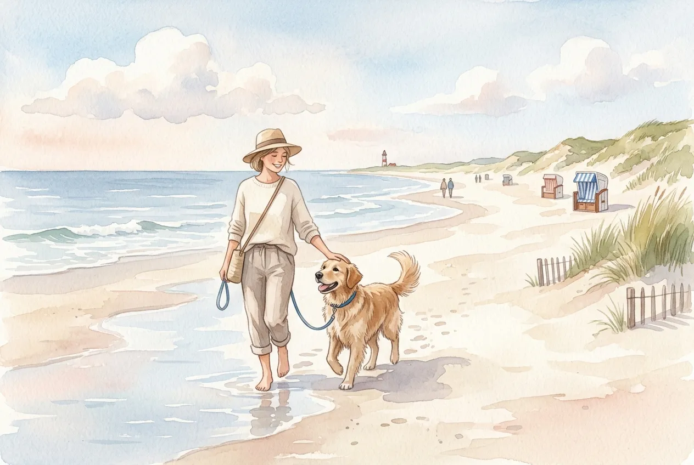
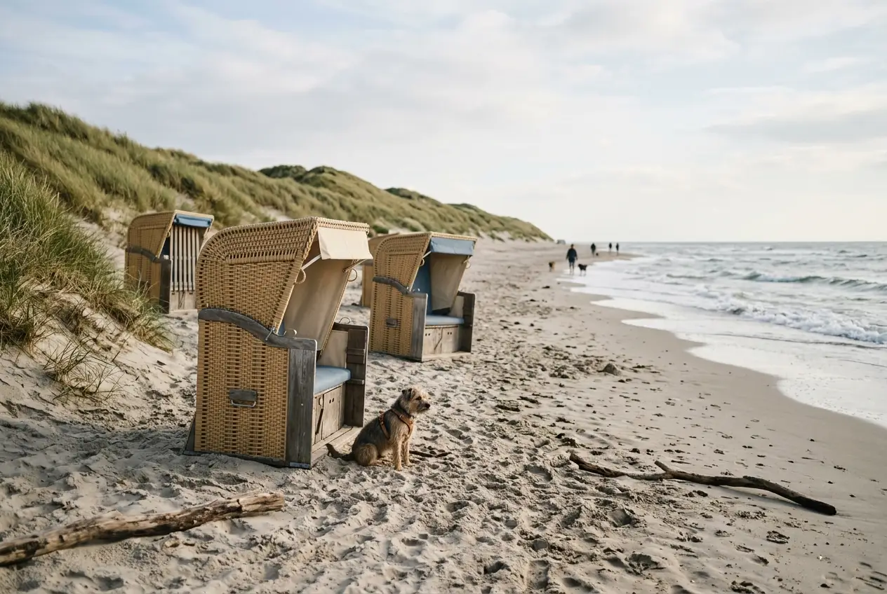
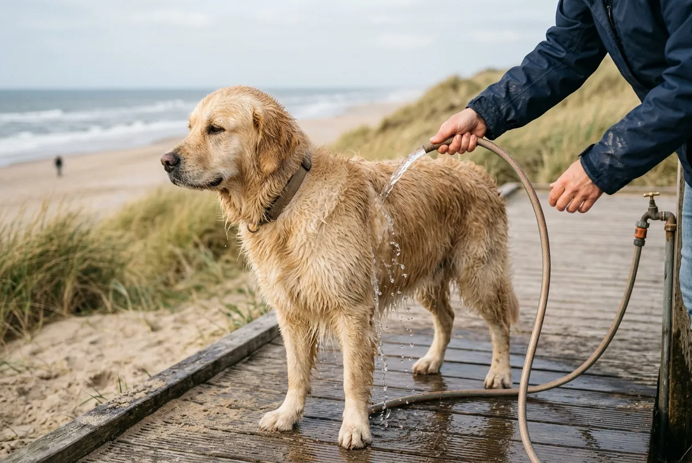

Urlaub mit Hund an der Nordsee gehört zu den beliebtesten Reisezielen für Hundebesitzer in Deutschland -- und das aus gutem Grund. Kilometerlange Hundestrände, hundefreundliche Ferienhäuser mit eingezäuntem Garten und die frische Seeluft machen die Nordseeküste zum idealen Ziel für Mensch und Tier. Ob Ostfriesland, Norddeich oder die Nordseeinseln: Hier finden Zwei- und Vierbeiner gleichermaßen Erholung.

In diesem Ratgeber erfährst du alles, was du für deinen Nordsee-Urlaub mit Hund wissen musst: die besten Hundestrände, hundefreundliche Unterkünfte, regionale Leinenpflicht-Regeln, eine vollständige Packliste und praktische Tipps für einen stressfreien Aufenthalt an der Küste.

Zusammenfassung: Urlaub mit Hund an der Nordsee

<ul>
<li><strong>Beste Reisezeit</strong> -- Die Nebensaison (September bis November, April bis Juni) bietet leere Strände und angenehme Temperaturen zwischen 10 und 20 °C für Hunde</li>
<li><strong>Hundestrände überall</strong> -- Über 50 ausgewiesene Hundestrände entlang der Nordseeküste, viele mit Freilaufflächen</li>
<li><strong>Eingezäunte Ferienhäuser</strong> -- Besonders in Ostfriesland rund um Norddeich und Hage bieten viele Vermieter Ferienhäuser mit eingezäuntem Garten und freiem WLAN</li>
<li><strong>Leinenpflicht beachten</strong> -- Im Nationalpark Wattenmeer ganzjährig Leinenpflicht, an Hundestränden oft Freilauf möglich</li>
<li><strong>Kosten ab 50 Euro/Nacht</strong> -- Hundefreundliche Nordsee-Ferienhäuser sind ab etwa 50 Euro pro Nacht in der Nebensaison verfügbar</li>
</ul>

50+

Hundestrände an der Nordsee

ab 50 €

Ferienhaus pro Nacht

1.300 km

Deutsche Nordseeküste

12

Hundefreundliche Inseln

## Warum die Nordsee ideal für Urlaub mit Hund ist

Die Nordsee bietet Hunden etwas, das kaum ein anderes Reiseziel in Deutschland kann: endlose Weite, frische Seeluft und natürliche Auslaufgebiete ohne Straßenverkehr. Kilometerlange Sandstrände bei Ebbe, das faszinierende Watt und weitläufige Dünenlandschaften machen jeden Spaziergang zum Erlebnis für Mensch und Tier.

Hundefreundlichkeit hat an der Nordseeküste Tradition. Viele Gemeinden in Ostfriesland, Nordfriesland und auf den Inseln haben sich gezielt auf Urlauber mit Hund eingestellt. Das zeigt sich an ausgewiesenen Hundestränden, speziellen Hundeduschen am Strandaufgang und einem breiten Angebot an Unterkünften, die Hunde willkommen heißen.

Ein weiterer Vorteil: Die Nordsee ist mit dem Auto gut erreichbar. Ab den meisten deutschen Großstädten beträgt die Fahrzeit maximal 4 bis 6 Stunden -- deutlich kürzer als die Anreise ans Mittelmeer. Das reduziert den Reisestress für deinen Hund erheblich. Wer seinen [Urlaub mit Hund in Deutschland](https://hundewissen-mit-kopf.de/reisen/urlaub-hund-deutschland/) plant, findet an der Nordsee eines der hundefreundlichsten Ziele überhaupt.

## Die besten Regionen für Urlaub mit Hund an der Nordsee

Die Nordseeküste erstreckt sich von der niederländischen Grenze bis nach Dänemark. Nicht jede Region ist gleich gut für einen Hundeurlaub geeignet. Die folgenden Gebiete bieten die beste Infrastruktur für Mensch und Tier.

### Ostfriesland: Norddeich, Hage und Umgebung

Ostfriesland gilt als eine der hundefreundlichsten Regionen an der gesamten Nordsee. Besonders Norden-Norddeich hat sich als Top-Destination für Urlaub mit Hund etabliert. Der Ort bietet über 2 km ausgewiesenen Hundestrand, zahlreiche hundefreundliche Ferienhäuser und eine gute Infrastruktur mit Tierärzten und Zoofachgeschäften.

Die Gemeinde Hage in Ostfriesland liegt nur wenige Kilometer von der Küste entfernt und bietet ruhige, ländliche Ferienhäuser mit großen eingezäunten Gärten -- ideal für Hunde, die viel Auslauf brauchen. Ab Hage erreichst du die Strände von Norddeich in etwa 15 Minuten mit dem Auto.

| Region | Entfernung zum Strand | Hundestrände | Besonderheiten |
|---|---|---|---|
| Norden-Norddeich | Direkt am Meer | 2 ausgewiesene Abschnitte | Fähranleger zu Norderney und Juist |
| Hage (Ostfriesland) | ca. 15 km | Über Norddeich erreichbar | Ruhige Lage, große Grundstücke |
| Greetsiel | ca. 5 km | 1 Hundestrand | Historischer Fischerhafen |
| Neuharlingersiel | Direkt am Meer | 1 Hundestrand | Fähre nach Spiekeroog |

### Nordfriesland: St. Peter-Ording und Husum

St. Peter-Ording bietet den breitesten Sandstrand Deutschlands -- bis zu 2 km bei Ebbe. Für Hunde gibt es zwei große Freilauf-Strandabschnitte. Die Region ist allerdings etwas teurer als Ostfriesland: Ferienhäuser kosten hier ab etwa 80 Euro pro Nacht.

### Nordseeinseln mit Hund

Auf den ostfriesischen Inseln wie Norderney, Langeoog und Borkum sind Hunde grundsätzlich willkommen. Jede Insel hat mindestens einen ausgewiesenen Hundestrand. Besonders Langeoog ist als autofreie Insel ein Paradies für Hunde -- kein Straßenverkehr bedeutet weniger Stress und mehr Sicherheit.

ℹ️

<strong>Fähren und Hunde</strong>

Auf den Fähren zu den Nordseeinseln sind Hunde in der Regel erlaubt. Die Kosten liegen zwischen 5 und 15 Euro pro Überfahrt. Auf den meisten Fähren müssen Hunde an der Leine bleiben und dürfen nicht in die Innenbereiche. Bringe eine Decke für das Außendeck mit.

## Hundestrände an der Nordsee: Regeln und Übersicht

Hundestrände sind an der Nordsee weit verbreitet, aber nicht überall gelten die gleichen Regeln. Die wichtigste Unterscheidung: In der Hauptsaison (April bis Oktober) gelten strengere Vorschriften als in der Nebensaison.

### Leinenpflicht an Nordseestränden

An den meisten ausgewiesenen Hundestränden dürfen Hunde in der Nebensaison frei laufen. In der Hauptsaison variiert die Regelung je nach Gemeinde. Grundsätzlich gilt: Im Nationalpark Niedersächsisches Wattenmeer besteht ganzjährig Leinenpflicht -- auch am Strand, wenn dieser an Schutzgebiete grenzt.

Laut der Nationalparkverwaltung Niedersächsisches Wattenmeer dienen diese Regeln dem Schutz von über 10 Millionen Zugvögeln, die das Wattenmeer als Rastplatz nutzen. Verstöße gegen die Leinenpflicht können mit Bußgeldern von bis zu 50.000 Euro geahndet werden.

### Die besten Hundestrände im Überblick

| Strand | Ort | Freilauf erlaubt | Saison | Besonderheiten |
|---|---|---|---|---|
| Hundestrand Norddeich | Norden-Norddeich | Ja (Nebensaison) | Ganzjährig | Hundedusche vorhanden |
| Hundestrand Ording Nord | St. Peter-Ording | Ja | Ganzjährig | Sehr weitläufig |
| Hundestrand Borkum | Borkum | Ja (Nebensaison) | Ganzjährig | Naturbelassen |
| Hundestrand Langeoog | Langeoog | Ja | Ganzjährig | Autofrei, ruhig |
| Hundestrand Schillig | Wangerland | Ja | Ganzjährig | Flacher Einstieg |
| Hundestrand Dornumersiel | Dornum | Ja (Nebensaison) | April bis Oktober | Familienfreundlich |

⚠️

<strong>Kurtaxe nicht vergessen</strong>

An vielen Nordseestränden wird eine Kurtaxe erhoben -- auch für Hunde. Die Kosten liegen zwischen 1 und 3 Euro pro Tag. In Norddeich ist die Hundekurtaxe in der Gästekarte enthalten. Informiere dich vor Ort beim Vermieter oder der Touristeninformation.

### Wattführungen mit Hund

Geführte Wattwanderungen mit Hund sind an der Nordsee an ausgewählten Terminen möglich. Nicht alle Wattführer erlauben Hunde, da die Tiere Vögel und Wattwürmer aufschrecken können. In Norddeich und Cuxhaven bieten einzelne Anbieter spezielle Hunde-Wattwanderungen an -- eine einzigartige Erfahrung für Mensch und Tier.

Wichtig: Gehe niemals ohne ortskundigen Führer ins Watt. Die Gezeiten an der Nordsee sind tückisch, und Priele können sich innerhalb von Minuten mit Wasser füllen. Für Hunde besteht dabei Lebensgefahr.

## Hundefreundliche Unterkünfte an der Nordsee

Die Wahl der richtigen Unterkunft entscheidet maßgeblich über den Erfolg deines Urlaubs mit Hund an der Nordsee. Ein Nordsee-Ferienhaus mit eingezäuntem Garten bietet die meiste Flexibilität -- dein Hund kann jederzeit nach draußen, ohne dass du dir Sorgen machen musst.

### Ferienhaus mit eingezäuntem Garten

Eingezäunte Ferienhäuser sind die beliebteste Unterkunftsart für Hundeurlaub an der Nordsee. Besonders in Ostfriesland rund um Norddeich, Hage und Norden gibt es ein großes Angebot. Die meisten Häuser bieten Platz für zwei bis sechs Personen und erlauben ein bis zwei Hunde.

🏡

Ferienhaus

Eigener eingezäunter Garten, volle Privatsphäre, Küche zur Futterzubereitung. Ab 60 €/Nacht.

🏢

Ferienwohnung

Günstiger, oft mit Terrasse. Eingezäunter Bereich seltener. Ab 45 €/Nacht.

🏕️

Campingplatz

Naturnahes Erlebnis, viel Auslauf. Hunde auf den meisten Plätzen erlaubt. Ab 20 €/Nacht.

🏨

Hotel / Pension

Komfortabel, aber eingeschränkte Hundefreiheit. Hundeaufpreis 10–20 €/Nacht.

### Worauf du bei der Buchung achten solltest

Bei der Buchung eines hundefreundlichen Nordsee-Ferienhauses gibt es einige Punkte, die den Unterschied zwischen einem entspannten und einem stressigen Urlaub ausmachen:

- **Zaunhöhe:** Mindestens 1,20 m für mittelgroße Hunde, ab 1,50 m für große Rassen
- **Gartengröße:** Mindestens 50 m² für ausreichend Bewegung
- **Bodenbelag innen:** Fliesen oder Laminat sind pflegeleichter als Teppich
- **Entfernung zum Strand:** Ideal sind maximal 2 km -- kurze Wege reduzieren Stress
- **Anzahl erlaubter Hunde:** Manche Vermieter erlauben nur einen Hund, andere zwei oder mehr
- **Freies WLAN:** Praktisch für die Recherche von Tierärzten, Hundestränden und Ausflügen vor Ort

💡

<strong>Frühzeitig buchen</strong>

Hundefreundliche Ferienhäuser mit eingezäuntem Garten an der Nordsee sind besonders in der Hauptsaison schnell ausgebucht. Buche mindestens 3 bis 6 Monate im Voraus -- für die Sommermonate sogar bis zu 9 Monate. In der Nebensaison findest du auch kurzfristig noch gute Angebote.

### Kosten für Urlaub mit Hund an der Nordsee

Die Kosten für einen Hundeurlaub an der Nordsee variieren je nach Saison, Region und Unterkunftstyp erheblich. Die folgende Tabelle gibt eine realistische Übersicht:

| Kostenfaktor | Nebensaison | Hauptsaison |
|---|---|---|
| Ferienhaus/Nacht (2 Pers.) | 50–90 € | 80–150 € |
| Hundeaufpreis/Nacht | 0–10 € | 5–15 € |
| Kurtaxe/Tag (Hund) | 1–2 € | 2–3 € |
| Fähre Insel (Hund, einfach) | 5–10 € | 8–15 € |
| Hundestrand-Gebühr/Tag | Oft kostenlos | 0–3 € |
| **Gesamtkosten 7 Tage (geschätzt)** | **400–700 €** | **650–1.200 €** |

## Nordsee oder Ostsee: Welches Meer ist besser für Hunde?

Viele Hundebesitzer stehen vor der Frage, ob die Nordsee oder die Ostsee das bessere Reiseziel ist. Beide Küsten haben Vor- und Nachteile für einen Urlaub mit Hund.

Nordsee -- Vorteile

<ul>
<li>Breitere Strände mit mehr Auslauf bei Ebbe</li>
<li>Einzigartiges Watt-Erlebnis für Hunde</li>
<li>Mehr ausgewiesene Hundestrände</li>
<li>Stärkerer Wind hält Temperaturen hundefreundlich</li>
<li>Traditionell hundefreundlichere Infrastruktur</li>
</ul>

Nordsee -- Nachteile

<ul>
<li>Gezeiten erfordern Planung (kein Strand bei Flut)</li>
<li>Stärkere Strömungen -- Vorsicht beim Schwimmen</li>
<li>Salzgehalt höher als an der Ostsee (3,5 % vs. 1,5 %)</li>
<li>Wind kann für kleine Hunde unangenehm sein</li>
<li>Leinenpflicht im Nationalpark strenger</li>
</ul>

Wer sich für die Ostsee interessiert, findet in unserem Ratgeber zum [Urlaub mit Hund an der Ostsee](https://hundewissen-mit-kopf.de/reisen/urlaub-hund-ostsee/) alle wichtigen Informationen. Beide Küsten bieten hervorragende Bedingungen -- die Nordsee punktet vor allem mit dem Watt und den breiteren Stränden, die Ostsee mit ruhigerem Wasser und weniger Gezeiten.

## Gesundheit und Sicherheit am Nordseestrand

Ein Tag am Nordseestrand macht Hunden großen Spaß, birgt aber auch einige Risiken. Mit der richtigen Vorbereitung vermeidest du gesundheitliche Probleme.

### Salzwasser und Trinkverhalten

Salzwasser der Nordsee enthält etwa 3,5 % Salz -- deutlich mehr als die Ostsee. Wenn Hunde beim Spielen in den Wellen größere Mengen Salzwasser schlucken, kann das zu Durchfall, Erbrechen und im schlimmsten Fall zu einer Salzvergiftung führen. Laut Bundestierärztekammer liegt die kritische Menge bei etwa 4 g Salz pro Kilogramm Körpergewicht.

🚫

<strong>Achtung: Salzvergiftung erkennen</strong>

Symptome einer Salzvergiftung sind starkes Speicheln, Erbrechen, Durchfall, Zittern und Apathie. Biete deinem Hund alle 20 bis 30 Minuten frisches Trinkwasser an. Bei Verdacht auf Salzvergiftung sofort zum nächsten Tierarzt -- unbehandelt kann der Zustand lebensbedrohlich werden.

### Sonnenschutz und Hitze

Auch an der Nordsee kann es im Sommer heiß werden. Temperaturen über 25 °C sind für viele Hunde bereits belastend. Sand heizt sich bei direkter Sonneneinstrahlung auf bis zu 60 °C auf -- das kann die Pfoten deines Hundes verbrennen.

Praktische Schutzmaßnahmen am Strand:

- **Strandmuschel oder Strandkorb** als Schattenplatz mitbringen
- **Kühlmatte** für die Pause zwischen den Spaziergängen
- **Strandbesuche** auf die Morgen- und Abendstunden legen (vor 10 Uhr, nach 17 Uhr)
- **Pfotenschutz:** Vor dem Betreten des Sandes die Temperatur mit dem Handrücken testen

### Sand und Fell: Pflege nach dem Strandbesuch

Sand setzt sich hartnäckig im Hundefell fest, besonders bei langhaarigen Rassen. Lasse das Fell nach dem Strandbesuch trocknen und bürste den Sand dann gründlich aus. Wer seinen Hund nach dem Salzwasser abspülen möchte, findet hilfreiche Tipps in unserem Ratgeber zum [Hund baden](https://hundewissen-mit-kopf.de/hundepflege/hund-baden/). Wichtig: Nicht nach jedem Strandbesuch mit Shampoo waschen -- klares Wasser reicht in der Regel aus.

## Packliste für den Nordsee-Urlaub mit Hund

Eine gute Vorbereitung spart Stress vor Ort. Die folgende Checkliste deckt alles ab, was du für deinen Urlaub mit Hund an der Nordsee brauchst.

✅ Packliste: Nordsee-Urlaub mit Hund

✓

EU-Heimtierausweis mit gültiger Tollwutimpfung

✓

Leine (mindestens 2 -- eine kurze, eine Schleppleine)

✓

Hundegeschirr oder Halsband mit Adressanhänger

✓

Futter für die gesamte Urlaubsdauer + 2 Tage Reserve

✓

Faltbarer Reisenapf für Wasser und Futter

✓

Trinkflasche mit frischem Wasser für den Strand

✓

Handtücher zum Abtrocknen (mindestens 2)

✓

Hundebett oder Decke für die Unterkunft

✓

Kotbeutel (ausreichend für den gesamten Urlaub)

✓

Zeckenschutz und Erste-Hilfe-Set für Hunde

✓

Bürste oder Kamm gegen Sand im Fell

Optional: Schwimmweste für unsichere Schwimmer

Optional: Kühlmatte für heiße Tage

Optional: Hunderegenmantel für Schlechtwettertage

Ob dein Hund bei Wind und Wetter einen [Hundemantel braucht](https://hundewissen-mit-kopf.de/hundeausstattung/braucht-hund-einen-mantel/), hängt von Rasse, Felltyp und individueller Kälteempfindlichkeit ab. An der Nordsee kann es selbst im Sommer windig und kühl werden -- besonders für kleine oder kurzhaarige Hunde ist ein Windschutz sinnvoll.

## Ausflugsziele und Aktivitäten mit Hund an der Nordsee

Die Nordsee bietet weit mehr als nur Strand. Zahlreiche Ausflugsziele in Ostfriesland und Nordfriesland sind hundefreundlich und sorgen für Abwechslung im Urlaub.

### Wanderungen und Spaziergänge

Die Nordseeküste bietet ein gut ausgebautes Netz an Wander- und Spazierwegen. Besonders beliebt sind:

- **Deichspaziergänge:** Flach, windgeschützt auf der Landseite, mit Blick aufs Meer. Hunde an der Leine.
- **Dünenlandschaften:** Naturerlebnis pur, aber oft Leinenpflicht wegen Naturschutz.
- **Pilsumer Leuchtturm (Ostfriesland):** Der berühmte gelb-rote Leuchtturm ist ein beliebtes Ausflugsziel -- Hunde dürfen auf dem Gelände angeleint dabei sein.
- **Seehundstation Norddeich:** Hunde dürfen nicht ins Gebäude, aber der Außenbereich mit Blick auf die Seehundbecken ist zugänglich.

### Hundewälder und Freilaufflächen

Abseits der Strände bieten einige Gemeinden an der Nordsee spezielle Hundefreilaufflächen und Hundewälder. In der Region um Norden-Norddeich und Hage gibt es weitläufige Wald- und Wiesengebiete, in denen Hunde abseits der Brut- und Setzzeit frei laufen dürfen.

✅

<strong>Restaurants und Cafés mit Hund</strong>

Die Nordseeküste ist bekannt für ihre hundefreundliche Gastronomie. In den meisten Restaurants und Cafés in Ostfriesland sind Hunde im Außenbereich willkommen. Viele Lokale stellen sogar Wassernäpfe bereit. Die ostfriesische Teekultur lässt sich so entspannt mit dem Vierbeiner genießen.

## Urlaub mit Hund in Holland und Dänemark an der Nordsee

Wer die deutsche Nordseeküste bereits kennt, findet in den Nachbarländern Holland und Dänemark ebenfalls hervorragende Bedingungen für Urlaub mit Hund an der Nordsee.

### Holland: Nordseeküste mit Hund

Die niederländische Nordseeküste bietet breite Sandstrände und eine liberale Hundepolitik. In der Nebensaison (Oktober bis April) dürfen Hunde an fast allen Stränden frei laufen. Besonders hundefreundliche Orte sind Callantsoog, Bergen aan Zee und Texel. Wer mehr über [Urlaub mit Hund in Holland](https://hundewissen-mit-kopf.de/reisen/urlaub-hund-holland/) erfahren möchte, findet in unserem ausführlichen Ratgeber alle Details.

### Dänemark: Nordseeküste mit Hund

Dänemark gilt als eines der hundefreundlichsten Länder Europas. An der dänischen Nordseeküste dürfen Hunde vom 1. Oktober bis 31. März an allen Stränden frei laufen. In der Hauptsaison besteht Leinenpflicht. Ferienhäuser mit eingezäuntem Garten sind in Dänemark besonders verbreitet und oft günstiger als in Deutschland.

| Kriterium | Deutschland | Holland | Dänemark |
|---|---|---|---|
| Freilauf Nebensaison | An Hundestränden | Fast überall | Überall |
| Ferienhaus ab (Nebensaison) | 50 €/Nacht | 55 €/Nacht | 45 €/Nacht |
| Eingezäunte Gärten | Häufig | Selten | Sehr häufig |
| Einreise-Dokument | Personalausweis | EU-Heimtierausweis | EU-Heimtierausweis |
| Anreise ab Hamburg | 1,5–4 Std. | 3–5 Std. | 2–5 Std. |

## Schritt für Schritt: So planst du deinen Nordsee-Urlaub mit Hund

Die Planung eines Hundeurlaubs an der Nordsee ist unkompliziert, wenn du systematisch vorgehst. Die folgenden Schritte helfen dir, nichts zu vergessen.

1

Region und Reisezeit wählen

Entscheide dich für eine Region (Ostfriesland, Nordfriesland, Insel) und den Reisezeitraum. Nebensaison bietet mehr Hundefreiheit und günstigere Preise.

2

Unterkunft buchen

Suche gezielt nach Ferienhäusern mit eingezäuntem Garten und der Angabe "Hunde willkommen". Prüfe Zaunhöhe, Gartengroesse und erlaubte Hundeanzahl.

3

Tierarzt-Check und Impfungen

Lasse deinen Hund 2 bis 4 Wochen vor der Reise vom Tierarzt untersuchen. Stelle sicher, dass Impfungen und Zeckenschutz aktuell sind.

4

Packliste abarbeiten

Packe alle wichtigen Dinge für deinen Hund ein -- von Futter über Leine bis zur Reiseapotheke. Nutze unsere Checkliste oben.

✓

Entspannt ankommen und genießen

Plane Pausen auf der Anfahrt ein (alle 2 Stunden) und erkunde am ersten Tag die nähere Umgebung mit deinem Hund.

## Häufige Fehler beim Nordsee-Urlaub mit Hund vermeiden

Selbst erfahrene Hundebesitzer machen bei ihrem ersten Nordsee-Urlaub mit Hund typische Fehler. Die folgenden Punkte helfen dir, häufige Probleme zu vermeiden:

**Gezeiten unterschätzen:** Die Nordsee hat einen Tidenhub von 2 bis 4 Metern. Bei auflaufender Flut kann der Rückweg über das Watt abgeschnitten werden. Informiere dich täglich über die Gezeitenzeiten -- Tidenkalender gibt es kostenlos in jeder Touristeninformation.

**Zu wenig Trinkwasser mitnehmen:** Am Strand gibt es selten Süßwasserstellen. Nimm mindestens 1 Liter frisches Wasser pro Stunde Strandaufenthalt für deinen Hund mit. Bei Hitze entsprechend mehr.

**Muscheln und Strandgut ignorieren:** Scharfkantige Muschelschalen können die Pfoten deines Hundes verletzen. Prüfe die Pfoten nach jedem Strandbesuch auf Schnitte und Fremdkörper.

**Nationalpark-Regeln missachten:** Das Wattenmeer ist UNESCO-Weltnaturerbe. Hunde dürfen dort nur angeleint laufen. Wer seinen Hund im Schutzgebiet frei laufen lässt, riskiert empfindliche Bußgelder und gefährdet geschützte Tierarten.

⚠️

<strong>Blaualgen-Warnung im Sommer</strong>

In warmen Sommern können sich an der Nordseeküste Blaualgen (Cyanobakterien) bilden. Diese sind für Hunde hochgiftig. Achte auf Warnhinweise an den Stränden und lasse deinen Hund bei grünlicher Wasserverfärbung oder Algenteppichen nicht ins Wasser. Bei Verdacht auf Kontakt sofort zum Tierarzt.

## Fazit: Urlaub mit Hund an der Nordsee lohnt sich

Ein Urlaub mit Hund an der Nordsee bietet die perfekte Kombination aus Naturerlebnis, Erholung und Hundefreundlichkeit. Über 50 ausgewiesene Hundestrände, zahlreiche Ferienhäuser mit eingezäuntem Garten und die einzigartige Wattlandschaft machen die Nordseeküste zu einem der besten Reiseziele für Hundebesitzer in Europa.

Ob Ostfriesland mit Norddeich und Hage, die Nordfriesischen Inseln oder die Nachbarländer Holland und Dänemark -- die Nordsee bietet für jeden Hund und jeden Geldbeutel das passende Angebot. Plane deinen Urlaub mit Hund an der Nordsee frühzeitig, beachte die Leinenpflicht-Regeln im Nationalpark und packe ausreichend frisches Trinkwasser ein. Dann steht einem unvergesslichen Urlaub für Mensch und Tier nichts mehr im Weg.