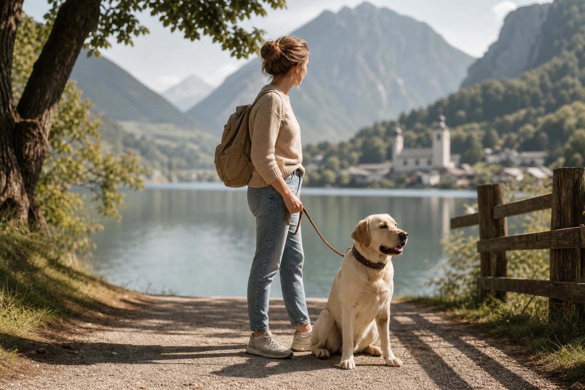
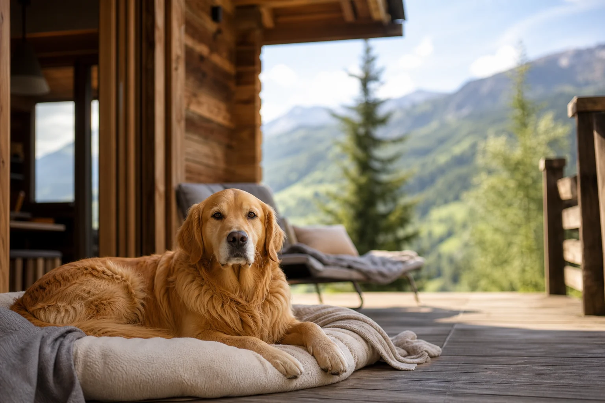

Urlaub mit Hund in Österreich ist für viele Hundehalter die perfekte Kombination aus alpiner Natur, hundefreundlicher Infrastruktur und unkomplizierter Einreise. Das Nachbarland bietet Bergwiesen, klare Seen und gut ausgebaute Wanderwege, auf denen Hunde herzlich willkommen sind. Wer seinen Vierbeiner nicht zu Hause lassen möchte, findet in Österreich eine der besten Destinationen Europas für einen gemeinsamen österreich urlaub.

Dieser Artikel zeigt dir, welche Dokumente du für die Einreise brauchst, welche Leinenpflicht-Regeln in den einzelnen Bundesländern gelten, welche Regionen besonders hundefreundlich sind und wie du die passende Unterkunft findest. Außerdem bekommst du eine praktische Packliste für die Reise.

Wer vorher noch einen Vergleich sucht, findet im Artikel [Urlaub mit Hund in Deutschland](https://hundewissen-mit-kopf.de/reisen/urlaub-hund-deutschland/) weitere Alternativen für den Heimaturlaub mit Hund.

## Warum Österreich urlaub mit Hund so beliebt ist

Österreich zählt zu den beliebtesten Reisezielen für Hundehalter in Deutschland. Der Grund liegt auf der Hand: Das Land verbindet eine spektakuläre Naturlandschaft mit einer ausgeprägten Willkommenskultur für Vierbeiner. Laut [Österreich Werbung](https://www.austria.info/de) bezeichnen sich zahlreiche Betriebe ausdrücklich als hundefreundlich und bieten spezielle Ausstattung wie Hundekörbchen, Leckerli-Begrüßung oder eingezäunte Gärten an.

Die Einreise ist für EU-Bürger mit dem richtigen Dokument unkompliziert. Sprache, Währung und Verkehrsregeln sind vertraut. Gleichzeitig ist das Angebot an Wanderwegen, Bergseen und naturnahen Unterkünften enorm. Ob Tiroler Alpen, steirische Bergwelt oder das Salzkammergut: Für jeden Hundetyp, ob aktiver Wanderbegleiter oder gemütlicher Spaziergänger, findet sich die passende Region.

Hinzu kommt, dass viele österreichische Gemeinden aktiv in hundefreundliche Infrastruktur investieren: Hundebeutelspender auf Wanderwegen, ausgewiesene Hundestrände an Seen und Hunde-Willkommenspakete in Hotels sind keine Seltenheit mehr.

Zusammenfassung: Urlaub mit Hund in Österreich

<ul>
<li><strong>Einreise unkompliziert</strong> – EU-Heimtierausweis mit Chip und gültiger Tollwutimpfung reicht für EU-Bürger vollständig aus.</li>
<li><strong>Leinenpflicht variiert</strong> – Regeln unterscheiden sich je nach Bundesland und Gemeinde; lokale Vorschriften immer vorab prüfen.</li>
<li><strong>Top-Regionen</strong> – Tirol (Seefeld), Steiermark (Ramsau am Dachstein) und Salzkammergut sind besonders hundefreundlich.</li>
<li><strong>Unterkunftsvielfalt</strong> – Ferienhaus mit eingezäuntem Garten, Hundehotel oder romantische Hütte am See: Für jeden Geschmack ist etwas dabei.</li>
</ul>

## Einreise und Dokumente: EU-Heimtierausweis & Co.

Für den urlaub mit hund in österreich brauchen deutsche Hundehalter keine aufwändige Bürokratie zu fürchten. Als EU-Bürger reist du mit deinem Hund auf Basis der EU-Heimtierreiseregelung ein. Das zentrale Dokument ist der EU-Heimtierausweis, der alle relevanten Gesundheitsinformationen deines Hundes enthält.

Die [Europäische Kommission](https://europa.eu/youreurope/citizens/travel/carry/pets/index_de.htm) regelt einheitlich, welche Voraussetzungen beim Reisen mit Haustieren innerhalb der EU erfüllt sein müssen. Österreich als EU-Mitglied folgt diesen Vorgaben vollständig, sodass kein zusätzliches nationales Dokument erforderlich ist.

### Was muss im EU-Heimtierausweis stehen?

Der EU-Heimtierausweis ist ein standardisiertes, mehrsprachiges Dokument im Scheckkartenformat, das dein Tierarzt ausstellt. Er enthält die vollständigen Angaben zum Tier (Rasse, Farbe, Geburtsdatum, Geschlecht), die Mikrochip-Nummer sowie alle Impfeinträge mit Datum und Gültigkeitszeitraum.

Besonders wichtig: Der Ausweis muss leserlich ausgefüllt und mit dem Stempel und der Unterschrift des ausstellenden Tierarztes versehen sein. Fehlerhafte oder unvollständige Einträge können bei Kontrollen zu Problemen führen. Lass den Ausweis vor jeder Reise von deinem Tierarzt auf Aktualität prüfen.

### Chip, Tollwutimpfung und weitere Pflichtvoraussetzungen

Dein Hund muss vor der Einreise nach Österreich mit einem ISO-konformen Mikrochip (ISO 11784/11785) gekennzeichnet sein. Der Chip muss vor der ersten Tollwutimpfung gesetzt worden sein, sonst ist die Impfung für Reisezwecke nicht anerkannt.

Die Tollwutimpfung muss zum Zeitpunkt der Einreise gültig sein. Laut dem [Bundesministerium für Soziales, Gesundheit, Pflege und Konsumentenschutz](https://www.sozialministerium.at/) gelten die vom Hersteller angegebenen Impfintervalle. Ist die Impfung abgelaufen, muss eine Auffrischung erfolgen und die Wartezeit von 21 Tagen nach der Erstimpfung eingehalten werden. Weitere Impfungen (z. B. gegen Staupe oder Parvovirus) sind für die Einreise nicht vorgeschrieben, aber aus tiergesundheitlichen Gründen empfehlenswert.

⚠️

<strong>Wichtig vor der Abreise</strong>

Prüfe mindestens vier Wochen vor Reiseantritt, ob die Tollwutimpfung deines Hundes noch gültig ist. Eine abgelaufene Impfung bedeutet nach der Auffrischung eine Wartezeit von 21 Tagen, bevor du einreisen darfst. Plane außerdem genug Zeit ein, um den EU-Heimtierausweis beim Tierarzt aktualisieren zu lassen.

## Leinenpflicht und Regeln in Österreich nach Bundesland

9

Bundesländer mit eigenen Hundegesetzen

3.000+

km Wanderwege in Tirol

500+

zertifizierte hundefreundliche Unterkünfte

5–20 €

typischer Hundeaufpreis pro Nacht

Österreich hat kein einheitliches Bundeshundegesetz. Jedes der neun Bundesländer regelt Leinenpflicht, Maulkorbpflicht und weitere Vorschriften eigenständig. Zusätzlich können Gemeinden eigene Verordnungen erlassen, die über die Landesgesetze hinausgehen. Das bedeutet: Die Regeln in einem Tiroler Bergdorf können sich von denen in einer steirischen Kleinstadt deutlich unterscheiden.

Als Faustregel gilt: In Ortschaften, auf belebten Wanderwegen, in öffentlichen Parks und in der Nähe von Wildgehegen oder Naturschutzgebieten ist Leinenpflicht häufig vorgeschrieben oder zumindest empfohlen. Auf freiem Gelände und in weniger frequentierten Waldgebieten ist die Lage oft großzügiger, aber nie pauschal leinenpflichtfrei.

### Leinenpflicht in Tirol Österreich: Was gilt wo?

In Tirol besteht Leinenpflicht in geschlossenen Ortschaften, auf öffentlichen Plätzen, in Parkanlagen und auf ausgewiesenen Wanderwegen, auf denen entsprechende Hinweisschilder aufgestellt sind. Besonders in Wildschutzgebieten und während der Brut- und Setzzeit (März bis Juli) ist das Freilaufen von Hunden streng reglementiert, um Wild nicht zu stören.

[Tirol Werbung](https://www.tirol.at/) weist ausdrücklich darauf hin, dass viele Wanderwege hundefreundlich sind, aber Leinenpflicht besteht. Wer mit dem Hund auf die Alm möchte, sollte sich vorab bei der jeweiligen Almwirtschaft erkundigen, ob Hunde willkommen sind und ob besondere Regeln gelten.

### Regeln in der Steiermark Österreich und anderen Bundesländern

In der Steiermark gilt Leinenpflicht in öffentlichen Parkanlagen, auf Spielplätzen und in Fußgängerzonen. In Naturschutzgebieten ist das Mitführen von Hunden teilweise gänzlich untersagt oder nur an der Leine erlaubt. Auch am Ufer von Badeseen gelten häufig besondere Regeln, die von Gemeinde zu Gemeinde variieren.

In Salzburg und im Salzkammergut sind die Regeln ähnlich strukturiert: Leinenpflicht in Ortschaften, freies Laufen auf geeigneten Wanderwegen außerhalb von Schutzgebieten oft möglich. Wien als Bundesland hat eigene, teils strengere Vorschriften, die für Städteurlauber relevant sind. Grundsätzlich gilt für alle Bundesländer: Im Zweifel die Leine anlegen und vor Ort bei der Gemeinde oder dem Tourismusbüro nachfragen.

## Top-Regionen für den Urlaub mit Hund in Österreich

Österreich bietet von den Tiroler Alpen bis zum Burgenland eine beeindruckende Vielfalt an Landschaften. Für den österreich urlaub mit hund haben sich einige Regionen als besonders geeignet herausgestellt, weil sie ein dichtes Netz an Wanderwegen, hundefreundliche Unterkünfte und eine tolerante Haltung gegenüber Vierbeinern kombinieren. Wer abseits der bekannten Destinationen sucht, findet in unserem Überblick zu [Geheimtipps für den Urlaub mit Hund](https://hundewissen-mit-kopf.de/reisen/urlaub-hund-geheimtipp/) weitere Inspiration.

### Seefeld Tirol: Wandern und Bergluft für Hund und Mensch

Seefeld in Tirol ist eines der bekanntesten Reiseziele für den urlaub mit hund österreich tirol. Das Hochplateau auf 1.200 Metern bietet ein weitläufiges Wanderwegenetz mit über 200 km ausgeschilderten Routen, von denen viele ausdrücklich für Hunde geeignet sind. Die Luft ist klar, die Wege sind gut gepflegt und die Aussichten auf das Karwendelgebirge sind schlicht atemberaubend.

Viele Hotels und Pensionen in Seefeld haben sich auf Hundehalter eingestellt und bieten Hundekörbchen, Napf-Sets und eigene Hundeduschplätze an. Im Ort selbst gibt es mehrere Hundewiesen, auf denen Hunde ohne Leine toben dürfen. Im Winter ist Seefeld als Skiort bekannt, im Sommer gehört es zu den attraktivsten Wanderzielen Tirols.

### Ramsau Dachstein: Geheimtipp in der Steiermark

Ramsau am Dachstein ist ein urlaub mit hund geheimtipp österreich, der sich zunehmend herumspricht. Das steirische Bergdorf liegt auf rund 1.000 Metern Höhe am Fuß des Dachsteinmassivs und bietet eine beeindruckende Kulisse für ausgedehnte Wanderungen mit dem Hund. Die Region ist deutlich ruhiger als Tirol und ideal für Hundehalter, die abseits des Trubels Natur pur erleben möchten.

Die Wanderwege rund um Ramsau führen durch Wälder, über Almwiesen und an Bergseen entlang. Viele Almhütten heißen Hunde willkommen. Die Unterkünfte in der Region sind häufig kleinere Familienbetriebe, die einen persönlicheren Service bieten als große Hotelketten.

### Urlaub mit Hund in den Bergen Österreich: Weitere Highlights

Wer urlaub mit hund in den bergen österreich sucht, findet neben Tirol und der Steiermark weitere attraktive Regionen. Das Montafon in Vorarlberg bietet spektakuläre Berglandschaften mit gut ausgebauten Wanderwegen. Das Gasteinertal in Salzburg kombiniert Bergwandern mit Thermalquellen in der Nähe. Das Ötztal in Tirol ist bekannt für seine Gletscherwelt und eignet sich für erfahrene Wanderer mit fittem Hund.

Auch das Lungau, das höchstgelegene Tal Österreichs, ist ein ruhiger Geheimtipp mit wenig Tourismus und viel Natur. Für Hunde, die ausgedehnte Freiläufe lieben, bieten diese alpinen Regionen ideale Bedingungen.

🏔️

Seefeld, Tirol

200+ km Wanderwege, Hundewiesen im Ort, viele hundefreundliche Hotels auf dem Hochplateau.

🌿

Ramsau am Dachstein

Ruhiger Geheimtipp in der Steiermark mit Almwiesen, Bergseen und persönlichen Familienbetrieben.

🏞️

Salzkammergut

Malerische Seen, ausgewiesene Hundebadestellen und eine entspannte Atmosphäre für Hund und Familie.

⛰️

Montafon, Vorarlberg

Spektakuläre Berglandschaft im Westen Österreichs, ruhig und mit gut markierten Wanderrouten.

## Urlaub mit Hund am See in Österreich

Österreich ist ein Seenland. Wolfgangsee, Attersee, Wörthersee, Millstätter See oder Weißensee: Die Liste der malerischen Gewässer ist lang. Für den urlaub mit hund am see österreich bieten viele dieser Seen ausgewiesene Bereiche, in denen Hunde ins Wasser dürfen. Das macht sie zu einer attraktiven Alternative zum Strand am Meer. Wer den Vergleich sucht, findet im Artikel [Urlaub mit Hund am Meer](https://hundewissen-mit-kopf.de/reisen/urlaub-hund-meer/) weitere Informationen.

### Hundefreundliche Badestellen und Hundestrände in Österreich

An vielen österreichischen Seen gibt es ausgewiesene Hundebadestellen, die von den Gemeinden oder Badeanstalten eingerichtet wurden. Der Wolfgangsee im Salzkammergut hat beispielsweise eine eigene Hundebadestelle, die bei Hundehaltern sehr beliebt ist. Am Weißensee in Kärnten, einem der saubersten Badeseen Europas, sind Hunde an bestimmten Abschnitten willkommen.

Wichtig: An öffentlichen Badestränden mit Liegewiesen und Umkleidekabinen ist Hunden der Zugang in der Regel verboten. Wer mit dem Hund schwimmen möchte, sollte vorab beim Betreiber der Badeanlage oder der Gemeindeverwaltung nachfragen, ob und wo Hunde erlaubt sind. Viele Gemeinden veröffentlichen diese Informationen auf ihren Tourismus-Websites.

### Urlaub mit Hund und Kind am See: Familientipps

Der urlaub mit hund und kind in österreich am see erfordert etwas mehr Planung, ist aber absolut machbar und macht für alle Beteiligten großen Spaß. Kinder und Hunde genießen gemeinsam den Seeuferpfad, das Plantschen im seichten Wasser und die Erkundung der Umgebung.

Achte bei der Unterkunftssuche auf Ferienhäuser oder Ferienwohnungen mit eingezäuntem Garten direkt am See, damit weder Kind noch Hund unbeaufsichtigt ans Wasser gelangen können. Wähle Seen mit flachem Ufer und ruhigem Wasser, die für Kinder und Hunde gleichermaßen sicher sind. Der Weißensee, der Erlaufsee und der Grundlsee gelten als besonders familienfreundlich.

💡

<strong>Tipp für Seeurlaub mit Hund</strong>

Buche eine Unterkunft direkt am Seeufer mit eigenem Bootssteg oder Gartenzugang zum Wasser. So kann dein Hund jederzeit ins Wasser, ohne dass ihr einen öffentlichen Badestrand aufsuchen müsst. Viele Ferienhäuser am See in Österreich bieten genau diese Kombination aus Privatsphäre und Wasserznähe.

## Unterkunft: Ferienhaus, Hütte oder Hundehotel in Österreich?

Die Wahl der richtigen Unterkunft entscheidet maßgeblich darüber, wie entspannt der urlaub mit hund österreich wird. Grundsätzlich stehen drei Unterkunftstypen zur Wahl: das Ferienhaus mit eigenem Garten, das spezialisierte Hundehotel und die rustikale Hütte am See oder in den Bergen. Alle drei haben ihre Vorzüge und Nachteile. Mehr allgemeine Tipps zum Thema Übernachten mit dem Hund findest du im Artikel [Hund im Hotel: Was du wissen musst](https://hundewissen-mit-kopf.de/reisen/hotel-hund/).

### Ferienhaus Österreich mit Hund: Eingezäuntes Grundstück und freier Auslauf

Das ferienhaus österreich mit hund ist die beliebteste Unterkunftsform für Hundehalter. Der größte Vorteil: Hund und Mensch haben maximale Freiheit. Kein Frühstücksraum mit anderen Gästen, kein Aufzug, keine Einschränkungen beim Tagesablauf. Ein eingezäuntes Grundstück ermöglicht es dem Hund, frei im Garten zu toben, ohne dass du ihn ständig beaufsichtigen musst.

Ferienhäuser mit eingezäuntem Garten findest du in Österreich über Plattformen wie Belvilla, Atraveo oder FeWo-direkt. Nutze den Suchfilter "eingezäuntes Grundstück" oder "hundefreundlich" gezielt, um passende Objekte zu finden. Viele österreich ferienhaus-Angebote in ländlichen Lagen bieten zusätzlich Hundezubehör wie Napf, Körbchen und Leckerlies vor Ort.

### Hundehotel Österreich: Worauf du bei der Auswahl achten solltest

Ein hundehotel österreich richtet sich gezielt an Hundehalter und bietet weit mehr als nur die Erlaubnis, den Hund mitzubringen. Gute Hundehotels haben eingezäunte Auslaufbereiche, Hundeduschplätze, Begrüßungspakete für den Hund und oft sogar Hunde-Sitting-Service für Ausflüge, bei denen Hunde nicht erlaubt sind.

Beim urlaub mit hund hotel österreich solltest du auf folgende Punkte achten: Gibt es einen eigenen Eingang ohne Treppe für den Hund? Sind die Zimmer hundegerecht ausgestattet (Schutzbezüge auf dem Sofa, kein empfindlicher Teppich)? Gibt es Wanderkarten mit hundefreundlichen Routen? Ist ein Tierarzt in der Nähe? Hundehotels in Österreich kosten je nach Ausstattung und Region zwischen 80 und 180 Euro pro Nacht für zwei Personen, zuzüglich eines Hundeaufpreises von 5 bis 20 Euro.

### Hütte am See in Österreich: Romantisch und hundefreundlich

Der urlaub mit hund hütte am see österreich ist für viele Hundehalter der Inbegriff eines perfekten Urlaubs. Rustikale Holzhütten direkt am Seeufer, oft mit eigenem Bootssteg und Kaminofen, bieten eine Atmosphäre, die Ferienhäuser und Hotels selten erreichen. Besonders in Kärnten und der Steiermark gibt es solche Hütten zu mieten.

Ferienhaus / Hütte

<ul>
<li>Maximale Freiheit für Hund und Mensch</li>
<li>Eingezäunter Garten möglich</li>
<li>Kein Rücksicht auf andere Hotelgäste nötig</li>
<li>Oft günstiger bei längeren Aufenthalten</li>
<li>Eigene Küche für selbst gekochtes Hundefutter</li>
</ul>

Hundehotel

<ul>
<li>Speziell auf Hundehalter ausgerichtet</li>
<li>Frühstück und Service inklusive</li>
<li>Hundesitting für hundefreie Ausflüge</li>
<li>Wandertipps und lokales Know-how vom Personal</li>
<li>Höhere Kosten, besonders bei Hundeaufpreis</li>
</ul>

## Sicher mit dem Hund nach Österreich reisen: Auto und Anreise

1

Dokumente prüfen

EU-Heimtierausweis, Chip und Tollwutimpfung mindestens vier Wochen vor Abreise beim Tierarzt kontrollieren lassen.

2

Auto vorbereiten

Sicherungssystem für den Hund (Gurt, Box oder Trenngitter) einbauen und testen. Österreich-Vignette besorgen.

3

Pausen einplanen

Alle zwei Stunden anhalten, damit der Hund trinken, die Beine vertreten und sich lösen kann.

✓

Sicher ankommen

Hund erst nach vollständigem Abstellen des Autos aus dem Fahrzeug lassen. Leine griffbereit halten.

Die Anreise nach Österreich erfolgt für die meisten deutschen Hundehalter mit dem Auto. Das hat den großen Vorteil, dass du das gesamte Gepäck für Hund und Mensch bequem mitnehmen kannst und unterwegs flexibel bist.

Auf österreichischen Autobahnen und Schnellstraßen gilt Vignettenpflicht. Die Jahresvignette kostet rund 96 Euro (Stand 2026), Kurzzeit-Vignetten für 10 Tage sind für ca. 9,90 Euro erhältlich. Wer ohne Vignette erwischt wird, zahlt empfindliche Strafen.

### Hund sicher im Auto transportieren: Tipps für die Fahrt

Laut [ÖAMTC](https://www.oeamtc.at/thema/techniktipps/tiere-im-strassenverkehr-62257419) müssen Hunde im Auto so gesichert sein, dass sie bei einem Unfall oder einer Vollbremsung weder den Fahrer gefährden noch selbst verletzt werden. Zulässige Sicherungsmethoden sind ein geprüfter Hundegurt mit Sicherheitsgurt-Adapter, eine stabile Transportbox, die im Kofferraum befestigt ist, oder ein Trenngitter zwischen Laderaum und Fahrgastzelle.

Plane alle zwei Stunden eine Pause ein. Biete deinem Hund Wasser an und lass ihn kurz laufen und sich lösen. Halte die Temperatur im Auto moderat, da Hunde in überhitzten Fahrzeugen schnell in Lebensgefahr geraten. Parke im Sommer nie mit dem Hund im Auto in der prallen Sonne.

## Packliste für den Urlaub mit Hund in Österreich

Eine gute Vorbereitung macht den urlaub mit hund in österreich für alle entspannter. Diese Packliste deckt die wichtigsten Punkte ab. Wer ein [Hundegeschirr oder Halsband](https://hundewissen-mit-kopf.de/hundeausstattung/hundegeschirr-oder-halsband/) für die Wanderungen sucht, findet dort einen detaillierten Vergleich.

✅ Packliste: Urlaub mit Hund in Österreich

✓

EU-Heimtierausweis mit gültiger Tollwutimpfung

✓

Österreich-Vignette fürs Auto

✓

Sicherungssystem fürs Auto (Gurt, Box oder Trenngitter)

✓

Ausreichend Hundefutter und Snacks für die Fahrt

✓

Wassernapf und Trinkflasche für unterwegs

✓

Leine und Schleppleine für Wanderungen

✓

Hundekörbchen oder Reisedecke für die Unterkunft

Zeckenmittel und Erste-Hilfe-Set für den Hund

Pfotenschutz für heiße Straßen oder scharfe Steine

Hundebeutel in ausreichender Menge

Handtuch oder Mikrofaser-Tuch zum Abtrocknen nach dem Baden

Kontaktdaten eines Tierarztes am Urlaubsort

## Fazit: Österreich Urlaub mit Hund – ein Erlebnis für alle

Urlaub mit Hund in Österreich lohnt sich: Das Land bietet eine der besten Kombinationen aus hundefreundlicher Infrastruktur, atemberaubender Natur und unkomplizierter Einreise für EU-Bürger. Mit dem EU-Heimtierausweis, einem gültigen Impfschutz und einem gesicherten Auto ist die Anreise entspannt. Vor Ort warten Wanderwege, Bergseen und Unterkünfte, die Hunde als vollwertige Urlaubsgäste behandeln.

Wähle die Region nach dem Charakter deines Hundes: Tirol für aktive Wanderer, die Steiermark für Ruhesuchende, das Salzkammergut für Seeliebhaber. Kläre vor Ort immer die lokalen Leinenpflicht-Regeln und frage bei Badestellen nach, ob Hunde willkommen sind. Mit der richtigen Vorbereitung wird der österreich urlaub für Hund und Mensch zu einem unvergesslichen Erlebnis.