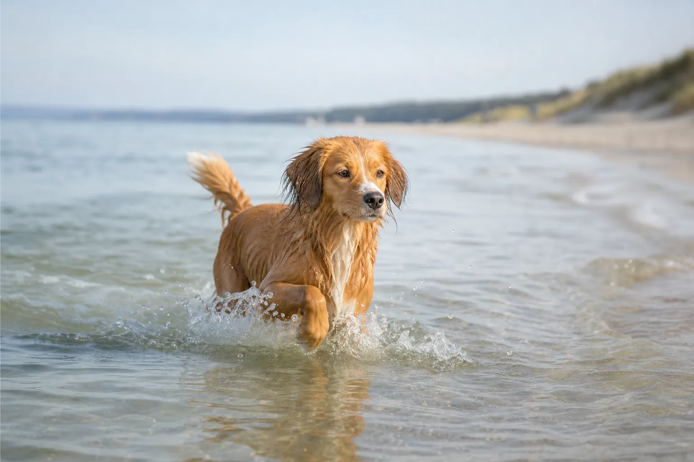
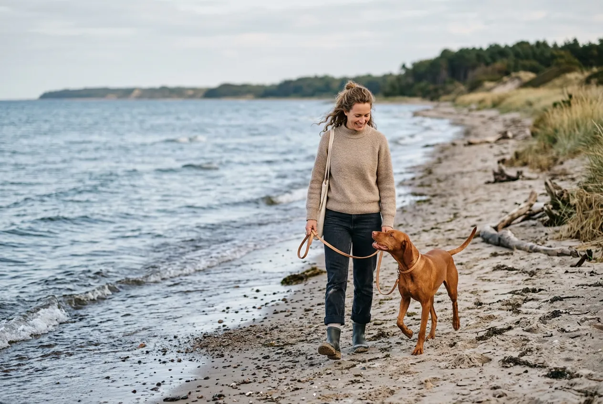
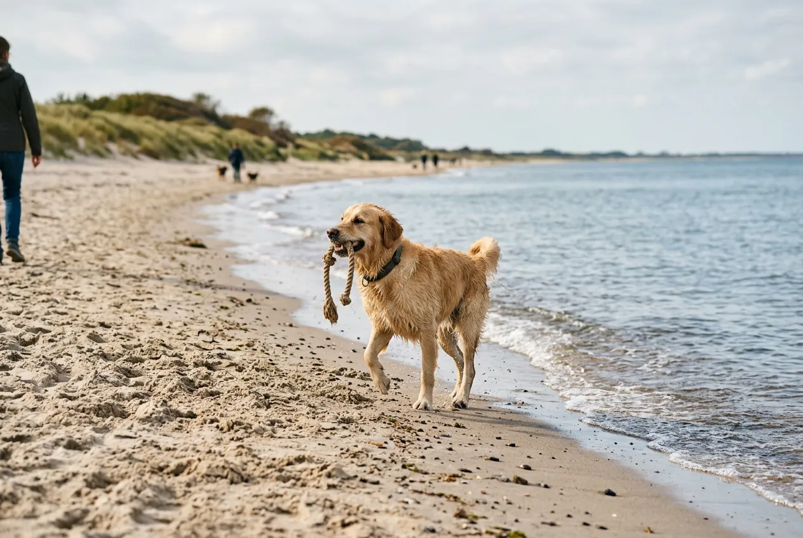
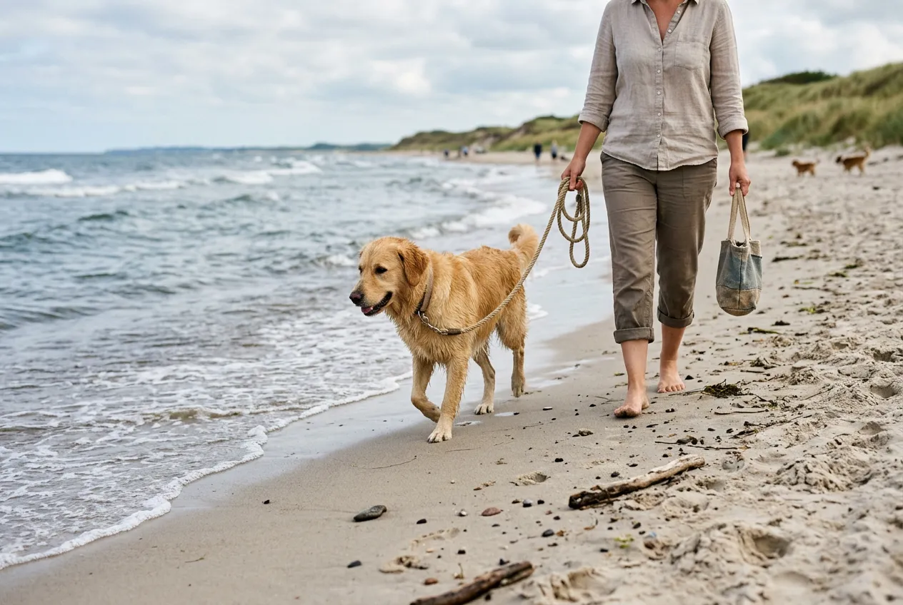

Urlaub mit Hund an der Ostsee zählt zu den beliebtesten Reisezielen für Hundebesitzer in Deutschland -- und das aus gutem Grund. Über 50 ausgewiesene Hundestrände, mildes Klima und flache Küstenabschnitte machen die deutsche Ostseeküste zum idealen Urlaubsziel für Zwei- und Vierbeiner. Von der Lübecker Bucht über Fischland-Darß-Zingst bis nach Usedom warten endlose Sandstrände, hundefreundliche Unterkünfte und abwechslungsreiche Wanderwege.

Damit dein Urlaub an der Ostsee mit Hund von der Planung bis zur Rückreise entspannt verläuft, findest du hier alles Wichtige: die schönsten Hundestrände, die besten Regionen, Tipps zur Unterkunft und eine Packliste für den perfekten Strandtag mit deinem Vierbeiner.

Zusammenfassung: Urlaub mit Hund an der Ostsee

<ul>
<li><strong>Über 50 Hundestrände</strong> -- von Flensburg bis Usedom bietet die Ostseeküste ausgewiesene Strandabschnitte für Hunde</li>
<li><strong>Beste Reisezeit: Nebensaison</strong> -- September/Oktober und April/Mai bieten freieren Strandzugang und bis zu 40 % günstigere Unterkünfte</li>
<li><strong>Ferienhaus mit eingezäuntem Grundstück</strong> -- die beliebteste Unterkunftsart für den Urlaub mit Hund an der Ostsee ab ca. 50 €/Nacht</li>
<li><strong>Leinenpflicht beachten</strong> -- an regulären Stränden und in Naturschutzgebieten gilt generell Anleinpflicht</li>
<li><strong>Geringer Salzgehalt</strong> -- mit 0,8–1,8 % ist die Ostsee deutlich hundefreundlicher als die Nordsee (3,5 %)</li>
</ul>

50+

Hundestrände an der Ostsee

2.247 km

Deutsche Ostseeküste

0,8–1,8 %

Salzgehalt (vs. 3,5 % Nordsee)

ab 50 €

Ferienhaus/Nacht (Nebensaison)

## Warum die Ostsee ideal für Urlaub mit Hund ist

Die Ostsee vereint mehrere Vorteile, die sie zum perfekten Reiseziel für Hundebesitzer machen. Der geringe Salzgehalt von 0,8 bis 1,8 Prozent reizt Hundepfoten und -fell deutlich weniger als das Nordseewasser mit 3,5 Prozent. Flach abfallende Sandstrände ermöglichen auch unsicheren Hunden einen sanften Einstieg ins Wasser.

Die Ostseeküste bietet zudem kaum Gezeiten -- der Tidenhub beträgt nur wenige Zentimeter. Dein Hund kann also den ganzen Tag am Strand spielen, ohne dass sich die Wasserlinie dramatisch verschiebt. Dazu kommen weitläufige Dünenlandschaften, Küstenwälder und Steilküsten, die für abwechslungsreiche Spaziergänge sorgen.

### Ostsee vs. Nordsee: Was ist besser für Hunde?

| Kriterium | Ostsee | Nordsee |
|---|---|---|
| Salzgehalt | 0,8–1,8 % | 3,5 % |
| Gezeiten | Kaum spürbar | Bis zu 3,5 m Tidenhub |
| Wellengang | Gering bis mäßig | Teils kräftig |
| Wassertemperatur (Sommer) | 18–22 °C | 16–19 °C |
| Hundestrände | Über 50 | Ca. 40 |
| Strandtyp | Überwiegend Sand | Sand, Schlick, Watt |

Die Ostsee punktet besonders bei Hunden, die empfindliche Haut haben oder zum ersten Mal am Meer sind. Der sanfte Wellengang und das weniger salzige Wasser machen den Strandbesuch stressfreier.

### Anreise mit Hund an die Ostsee

Die Ostseeküste ist von den meisten deutschen Städten innerhalb von 3 bis 6 Autostunden erreichbar. Für die Anreise mit Hund empfiehlt der ADAC regelmäßige Pausen alle 2 Stunden. Hunde sollten im Auto mit einem Sicherheitsgeschirr oder in einer Transportbox gesichert sein -- das ist in Deutschland gesetzlich vorgeschrieben (StVO § 22).

💡

<strong>Tipp für die Anreise</strong>

Plane die Fahrt in die kühleren Morgen- oder Abendstunden. Bei Außentemperaturen über 25 °C kann es im Auto schnell gefährlich warm werden. Frisches Wasser und ein Kühlpad für die Transportbox sorgen für angenehme Temperaturen.

## Die schönsten Hundestrände an der Ostsee

Entlang der deutschen Ostseeküste gibt es über 50 ausgewiesene Hundestrände. Die Qualität variiert -- manche bieten Freilauf, Hundeduschen und Kotbeutelspender, andere sind einfache Strandabschnitte mit Hundezulassung.

### Hundestrände in Schleswig-Holstein

Schleswig-Holstein bietet mit der Lübecker Bucht und der Kieler Förde einige der beliebtesten Hundestrände an der deutschen Ostsee.

**Timmendorfer Strand** ist nicht nur einer der bekanntesten Badeorte an der Ostsee, sondern bietet auch einen eigenen Hundestrand am Brodtener Steilufer. Der Abschnitt ist naturbelassen und bietet Freilauf für Hunde. In der Nebensaison (Oktober bis März) dürfen Hunde zudem an weiteren Strandabschnitten laufen.

**Grömitz** gilt als einer der hundefreundlichsten Orte an der gesamten Ostseeküste. Der Ort bietet gleich 3 ausgewiesene Hundestrände mit insgesamt über 800 Metern Länge. Besonders praktisch: An den Hundestränden stehen Kotbeutelspender, Mülleimer und sogar Hundeduschen bereit.

**Scharbeutz** in der Lübecker Bucht verfügt über einen breiten Hundestrand zwischen den Strandabschnitten 13 und 14. Der feine Sand und das flache Wasser machen ihn besonders für kleinere Hunde attraktiv.

| Ort | Anzahl Hundestrände | Freilauf | Besonderheiten |
|---|---|---|---|
| Timmendorfer Strand | 1 (+ Nebensaison) | Ja | Steilküste, naturbelassen |
| Grömitz | 3 | Ja | Hundeduschen, Beutelspender |
| Scharbeutz | 1 | Ja | Flaches Wasser, feiner Sand |
| Laboe | 1 | Ja | Nähe Kieler Förde |
| Heiligenhafen | 2 | Ja | Seebrücke, breiter Strand |

### Hundestrände in Mecklenburg-Vorpommern

Mecklenburg-Vorpommern bietet mit der Halbinsel Fischland-Darß-Zingst und den Inseln Rügen und Usedom einige der weitläufigsten Hundestrände Deutschlands.

**Fischland-Darß-Zingst** ist ein Paradies für naturverbundene Hundebesitzer. Die Halbinsel bietet kilometerlange, oft menschenleere Strände. In Prerow, Zingst und Ahrenshoop gibt es jeweils ausgewiesene Hundestrandabschnitte. Der Darßer Weststrand -- einer der schönsten Naturstrände Deutschlands -- erlaubt Hunde außerhalb der Hauptsaison.

**Rügen** bietet als größte deutsche Insel allein 12 offizielle Hundestrandabschnitte. Besonders beliebt sind die Hundestrände in Binz, Sellin und am Kap Arkona. Die Kombination aus Kreidefelsen, Buchenwäldern und Sandstränden macht Rügen zu einem abwechslungsreichen Reiseziel für Hunde.

**Usedom** lockt mit feinem, weißem Sand und bis zu 42 Sonnenstunden pro Woche im Sommer. Hundestrände gibt es in Ahlbeck, Heringsdorf, Bansin und Trassenheide. Wer die polnische Ostsee erleben möchte, kann von Usedom aus direkt nach Świnoujście (Swinemünde) spazieren -- Hunde sind dort ebenfalls am Strand willkommen.

ℹ️

<strong>Polnische Ostsee mit Hund</strong>

Die polnische Ostseeküste bietet oft günstigere Unterkünfte und weniger überlaufene Strände. Für die Einreise nach Polen benötigt dein Hund einen EU-Heimtierausweis, eine gültige Tollwutimpfung und einen Mikrochip. Die Impfung muss mindestens 21 Tage vor der Einreise erfolgt sein.

### Hundestrände auf Fehmarn

Fehmarn ist die drittgrößte deutsche Insel und über eine Brücke mit dem Festland verbunden -- ideal für die Anreise mit Hund ohne Fährfahrt. Die Insel bietet 5 ausgewiesene Hundestrände, darunter den beliebten Abschnitt am Grünen Brink mit feinem Sand und ruhigem Wasser.

## Strandregeln für Hunde an der Ostsee

Die Regeln für Hunde am Strand unterscheiden sich je nach Bundesland, Gemeinde und Saison. Wer die Vorschriften kennt, vermeidet Bußgelder von bis zu 5.000 Euro.

### Leinenpflicht und Freilauf

An ausgewiesenen Hundestränden dürfen Hunde in der Regel frei laufen. An allen anderen Strandabschnitten gilt Leinenpflicht. In Naturschutzgebieten -- etwa am Darßer Ort oder an den Boddenküsten -- besteht ganzjährig Anleinpflicht, auch in der Nebensaison.

Gute [Leinenführigkeit](https://hundewissen-mit-kopf.de/erziehung-verhalten/leinenfuehrigkeit-trainieren/) ist für den Strandurlaub unverzichtbar. Selbst an Hundestränden sollte dein Hund zuverlässig auf Rückruf reagieren, besonders wenn andere Hunde oder Strandbesucher in der Nähe sind.

### Haupt- und Nebensaison

| Zeitraum | Regelung | Hundestrände |
|---|---|---|
| Mai – September (Hauptsaison) | Hunde nur an ausgewiesenen Hundestränden | Vollständig nutzbar |
| Oktober – April (Nebensaison) | Hunde an den meisten Stränden erlaubt | Erweiterte Bereiche |
| Ganzjährig | Naturschutzgebiete: Leinenpflicht | Eingeschränkt |

⚠️

<strong>Hundekot am Strand aufsammeln</strong>

An allen Stränden der Ostsee besteht die Pflicht, Hundekot sofort zu entfernen. Verstöße können mit Bußgeldern von 20 bis 150 Euro geahndet werden. Nimm immer ausreichend Kotbeutel mit -- an vielen Hundestränden stehen Spender bereit.

### Strandkorbnutzung mit Hund

Strandkörbe können an vielen Ostsee-Orten tageweise gemietet werden. Ob Hunde im Strandkorb erlaubt sind, regelt der jeweilige Vermieter. Erfahrungsgemäß sind Hunde in Strandkörben an Hundestrandabschnitten fast immer willkommen. Eine Decke oder ein Handtuch schützt den Strandkorb vor Sand und Haaren.

## Hundefreundliche Unterkünfte an der Ostsee

Die Wahl der richtigen Unterkunft entscheidet maßgeblich über den Erholungsfaktor deines Urlaubs mit Hund an der Ostsee. Ferienhäuser mit eingezäuntem Grundstück sind die mit Abstand beliebteste Option.

### Ferienhaus mit eingezäuntem Grundstück

Ein Ferienhaus an der Ostsee mit Hund bietet maximale Flexibilität. Dein Hund kann im eingezäunten Garten frei laufen, du bist an keine Fütterungs- oder Ruhezeiten eines Hotels gebunden und hast genug Platz für Hundebett, Näpfe und Spielzeug.

🏡

Ferienhaus eingezäunt

Ab 50 €/Nacht (Nebensaison). Maximale Freiheit, eigener Garten, keine Nachbarn. Ideal für Hunde mit Freilaufbedürfnis.

🏢

Ferienwohnung

Ab 40 €/Nacht. Günstiger, aber weniger Platz. Auf Hundezulassung und Größenbeschränkung achten.

🏨

Hotel mit Hund

Ab 70 €/Nacht. Komfort und Service, aber oft Aufpreis (10–25 €/Nacht) und Einschränkungen bei Größe/Rasse.

🏕️

Campingplatz

Ab 20 €/Nacht. Naturerlebnis pur. Viele Ostsee-Campingplätze erlauben Hunde, teils mit eigenen Hundeduschen.

### Worauf du bei der Buchung achten solltest

Nicht jede als "hundefreundlich" beworbene Unterkunft ist wirklich auf Hunde eingestellt. Prüfe vor der Buchung folgende Punkte:

- **Anzahl erlaubter Hunde:** Manche Unterkünfte erlauben nur einen Hund, andere bis zu drei
- **Größen- und Rassenbeschränkungen:** Einige Vermieter schließen große Rassen oder bestimmte Listenhunde aus
- **Eingezäuntes Grundstück:** "Eingezäunt" kann einen 1,80 m hohen Zaun oder einen 50 cm hohen Jägerzaun bedeuten -- nachfragen lohnt sich
- **Entfernung zum Hundestrand:** Ideal sind maximal 10 Gehminuten
- **Aufpreis für Hunde:** Üblich sind 5 bis 15 Euro pro Nacht und Hund
- **Endreinigung:** Manche Vermieter berechnen bei Hundehaar-Verschmutzung eine höhere Endreinigungspauschale

### Die besten Regionen für Ferienhäuser mit Hund

| Region | Preisniveau | Hundestrand-Nähe | Besonderheiten |
|---|---|---|---|
| Lübecker Bucht | Mittel bis hoch | Sehr gut | Timmendorfer Strand, Scharbeutz, Grömitz |
| Fischland-Darß-Zingst | Mittel | Gut | Naturbelassene Strände, Nationalpark |
| Rügen | Mittel bis hoch | Sehr gut | 12 Hundestrände, Kreidefelsen |
| Usedom | Mittel | Gut | Sonnenschein-Rekord, polnische Grenze |
| Fehmarn | Günstig bis mittel | Gut | Brückenanbindung, 5 Hundestrände |

## Packliste für den Strandtag mit Hund

Ein gut vorbereiteter Strandtag macht den Urlaub mit Hund an der Ostsee erst richtig entspannt. Diese Packliste hilft dir, nichts Wichtiges zu vergessen.

✅ Packliste Strandtag mit Hund

✓

Frisches Trinkwasser (mind. 0,5 l pro Stunde) und Reisenapf

✓

Kotbeutel (mindestens 5 Stück pro Strandbesuch)

✓

Leine (Schleppleine für Strand, kurze Leine für Promenade)

✓

Sonnenschutz: Strandmuschel oder Sonnenschirm als Schattenplatz

✓

Handtuch zum Abtrocknen nach dem Baden

✓

Hundespielzeug (schwimmfähiger Ball, Dummy)

✓

Kühlmatte oder nasses Tuch für heiße Tage

Hundeschuhe (optional bei heißem Sand oder Muschelstrand)

Schwimmweste (optional für unsichere Schwimmer oder Welpen)

## Gesundheit und Sicherheit am Strand

Ein Strandtag birgt für Hunde einige Risiken, die du mit einfachen Maßnahmen vermeiden kannst.

### Hitzeschutz am Strand

Hunde können nicht schwitzen und regulieren ihre Körpertemperatur hauptsächlich über Hecheln. Ab einer Außentemperatur von 25 °C steigt das Risiko für einen Hitzschlag deutlich. Besonders gefährdet sind brachyzephale Rassen (Mops, Bulldogge), ältere Hunde und Welpen.

🚫

<strong>Hitzschlag beim Hund erkennen</strong>

Starkes Hecheln, Taumeln, glasige Augen und dunkelrote Zunge sind Anzeichen eines Hitzschlags. Bringe deinen Hund sofort in den Schatten, biete Wasser an und kühle ihn mit feuchten Tüchern. Bei Bewusstlosigkeit sofort zum Tierarzt -- ein Hitzschlag kann innerhalb von Minuten tödlich enden.

Meide die Mittagshitze zwischen 11 und 15 Uhr. Heißer Sand kann Hundepfoten verbrennen -- teste die Temperatur mit deinem Handrücken. Hält deine Hand den Sand 5 Sekunden lang nicht aus, ist er auch für Hundepfoten zu heiß.

### Salzwasser und Süßwasserspülung

Obwohl der Salzgehalt der Ostsee mit 0,8 bis 1,8 Prozent vergleichsweise gering ist, solltest du deinen Hund nach dem Baden mit Süßwasser abspülen. Salzreste und Sand können die Haut reizen und zu Juckreiz führen. Besonders Hunde mit langem Fell neigen zu Verfilzungen, wenn Sand im nassen Fell trocknet.

Ausführliche Tipps zum [Baden deines Hundes](https://hundewissen-mit-kopf.de/hundepflege/hund-baden/) findest du in unserem Pflege-Ratgeber. Nach einem Strandtag reicht in der Regel eine kurze Süßwasserdusche -- ein vollständiges Bad mit Shampoo ist nicht nötig.

### Gefahren am Strand

| Gefahr | Risiko | Vorbeugung |
|---|---|---|
| Blaualgen (Cyanobakterien) | Vergiftung, Leberversagen | Trübes, grünlich verfärbtes Wasser meiden |
| Quallen (Feuerqualle) | Hautreizung, Schmerzen | Gestrandete Quallen meiden, Pfoten kontrollieren |
| Angelhaken/Fischreste | Verletzung, Vergiftung | Hund von Angelplätzen fernhalten |
| Muschelsplitter | Schnittwunden an Pfoten | Pfoten nach dem Spaziergang kontrollieren |
| Salzwasser trinken | Durchfall, Erbrechen | Frisches Trinkwasser immer bereithalten |

⚠️

<strong>Blaualgen-Warnung beachten</strong>

Zwischen Juni und September kommt es an der Ostsee regelmäßig zu Blaualgenblüten. Die Toxine können bei Hunden innerhalb weniger Stunden zu Leberversagen führen. Wenn das Wasser trüb-grünlich aussieht oder schaumig ist, lass deinen Hund auf keinen Fall hinein. Aktuelle Warnungen findest du auf den Websites der Landesgesundheitsämter.

## Ausflugsziele und Aktivitäten mit Hund an der Ostsee

Die Ostsee bietet weit mehr als nur Strand. Abwechslungsreiche Ausflüge machen den Urlaub mit Hund besonders erlebnisreich.

### Wanderungen an der Ostseeküste

Die Ostseeküste bietet hervorragende Wanderwege direkt am Meer. Der Europäische Fernwanderweg E9 führt entlang der gesamten deutschen Ostseeküste und ist größtenteils mit Hund begehbar.

- **Brodtener Steilufer** (Timmendorfer Strand): 4 km Klippenwanderung mit Meerblick
- **Darßer Weststrand**: 6 km durch urwüchsigen Küstenwald -- einer der schönsten Wanderwege Deutschlands
- **Jasmund-Nationalpark** (Rügen): 8 km Rundweg an den Kreidefelsen -- Hunde an der Leine erlaubt
- **Küstenwanderweg Usedom**: 14 km von Bansin nach Ahlbeck mit mehreren Hundestrand-Stopps

### Hundefreundliche Ausflugsziele

Viele Sehenswürdigkeiten an der Ostsee heißen Hunde willkommen. In Freilichtmuseen, Tierparks und auf Ausflugsbooten sind angeleinte Hunde oft erlaubt. Erkundige dich vorab telefonisch oder auf der Website des jeweiligen Ausflugsziels.

Wenn dein Hund in aufregenden Situationen zum [Bellen neigt](https://hundewissen-mit-kopf.de/erziehung-verhalten/hund-bellt-staendig/), übe vor dem Urlaub das ruhige Verhalten in belebten Umgebungen. Ein gut trainierter [Grundgehorsam](https://hundewissen-mit-kopf.de/erziehung-verhalten/kommandos-hund/) macht Ausflüge für alle Beteiligten entspannter.

## Urlaub mit Hund an der Ostsee planen: Schritt für Schritt

Die richtige Planung ist der Schlüssel zu einem entspannten Urlaub mit Hund an der Ostsee. Mit dieser Schritt-für-Schritt-Anleitung vergisst du nichts Wichtiges.

1

Region und Reisezeit wählen

Nebensaison (September/Oktober oder April/Mai) bietet mehr Freiheit am Strand und günstigere Preise. Wähle eine Region mit mehreren Hundestränden in der Nähe.

2

Unterkunft frühzeitig buchen

Hundefreundliche Ferienhäuser mit eingezäuntem Grundstück sind begehrt. Buche 3 bis 6 Monate im Voraus, besonders für die Sommermonate.

3

Tierarzt-Check und Reiseapotheke

Impfungen auffrischen, Zeckenschutz erneuern und eine Reiseapotheke zusammenstellen (Verbandsmaterial, Zeckenzange, Durchfallmittel). EU-Heimtierausweis bei Auslandsreisen mitnehmen.

✓

Packliste abarbeiten und losfahren

Packliste prüfen, Hundestrände der Region recherchieren und die Fahrt in die kühlen Tagesstunden legen. Alle 2 Stunden eine Pause einplanen.

### Reiseapotheke für den Hund

Eine kleine Reiseapotheke gehört in jedes Urlaubsgepäck. Laut Bundestierärztekammer sollte sie mindestens enthalten:

- Verbandsmaterial (Mullbinden, Pflaster, elastische Binde)
- Zeckenzange und Pinzette
- Desinfektionsmittel für Wunden
- Mittel gegen Durchfall (vom Tierarzt empfohlen)
- Augentropfen (Kochsalzlösung) gegen Sand in den Augen
- Telefonnummer des nächsten Tierarztes am Urlaubsort

## Hundestrände an der Ostsee: Dänemark als Alternative

Wer bereit ist, etwas weiter zu fahren, findet an der dänischen Ostseeküste paradiesische Bedingungen für den Urlaub mit Hund. Dänemark erlaubt Hunde von Oktober bis März an fast allen Stränden ohne Leine. In der Hauptsaison (April bis September) gilt Leinenpflicht, aber Hunde sind an den meisten Stränden willkommen.

Die dänische Ostseeküste bietet zudem Tausende hundefreundliche Ferienhäuser -- viele davon mit eingezäuntem Grundstück in Alleinlage. Die Preise liegen in der Nebensaison bei 60 bis 100 Euro pro Nacht.

ℹ️

<strong>Einreise nach Dänemark mit Hund</strong>

Für die Einreise benötigst du einen EU-Heimtierausweis, einen Mikrochip und eine gültige Tollwutimpfung (mind. 21 Tage alt). Achtung: Dänemark hat ein Rasseverbotgesetz -- 13 Hunderassen und deren Kreuzungen sind verboten. Informiere dich vor der Reise, ob deine Rasse betroffen ist.

## Fellpflege nach dem Strandurlaub

Sand, Salzwasser und Wind beanspruchen das Hundefell stark. Nach einem Tag am Strand solltest du das Fell deines Hundes gründlich ausbürsten, um Sandkörner zu entfernen. Verfilzungen entstehen besonders bei langhaarigen Rassen schnell, wenn nasses, sandiges Fell trocknet.

Regelmäßige [Fellpflege](https://hundewissen-mit-kopf.de/hundepflege/fellpflege-hund/) ist im Urlaub besonders wichtig. Bürste deinen Hund idealerweise jeden Abend nach dem Strandbesuch. Ein grobzinkiger Kamm entfernt Sand effektiv, eine Bürste mit Naturborsten glättet das Fell anschließend.

Vorteile: Urlaub mit Hund an der Ostsee

<ul>
<li>Über 50 ausgewiesene Hundestrände</li>
<li>Geringer Salzgehalt schont Haut und Fell</li>
<li>Flache Strände -- ideal für unsichere Schwimmer</li>
<li>Viele hundefreundliche Ferienhäuser</li>
<li>Kurze Anreise aus ganz Deutschland</li>
<li>Nebensaison: Hunde an fast allen Stränden erlaubt</li>
</ul>

Nachteile: Urlaub mit Hund an der Ostsee

<ul>
<li>Hauptsaison: Hundestrände oft überfüllt</li>
<li>Blaualgen-Risiko im Hochsommer</li>
<li>Strandgebühren (Kurtaxe) von 1–4 € pro Tag</li>
<li>Leinenpflicht an regulären Stränden</li>
<li>Hundefreundliche Unterkünfte schnell ausgebucht</li>
</ul>

## Kosten für den Urlaub mit Hund an der Ostsee

Die Kosten für einen einwöchigen Urlaub mit Hund an der Ostsee variieren je nach Saison, Region und Unterkunftstyp erheblich. Eine realistische Kalkulation hilft bei der Budgetplanung.

| Kostenfaktor | Nebensaison (pro Woche) | Hauptsaison (pro Woche) |
|---|---|---|
| Ferienhaus (2 Personen + Hund) | 350–600 € | 600–1.200 € |
| Hundeaufpreis Unterkunft | 35–105 € | 35–105 € |
| Kurtaxe (2 Personen) | 14–42 € | 14–56 € |
| Anreise (Benzin, 500 km) | ca. 80 € | ca. 80 € |
| Verpflegung (Selbstversorger) | 150–250 € | 150–250 € |
| Hundefutter (7 Tage) | 20–50 € | 20–50 € |
| **Gesamtbudget** | **650–1.130 €** | **900–1.740 €** |

💡

<strong>Spartipp: Frühbucher-Rabatte nutzen</strong>

Viele Ferienhausportale bieten Frühbucher-Rabatte von 10 bis 20 Prozent, wenn du 4 bis 6 Monate vor Reiseantritt buchst. Last-Minute-Angebote gibt es ebenfalls, allerdings ist die Auswahl bei hundefreundlichen Unterkünften dann oft eingeschränkt.

## Fazit: Urlaub mit Hund an der Ostsee richtig planen

Urlaub mit Hund an der Ostsee ist eine der besten Möglichkeiten, gemeinsam mit deinem Vierbeiner Erholung am Meer zu genießen. Über 50 Hundestrände, flaches Wasser mit geringem Salzgehalt und Tausende hundefreundliche Unterkünfte machen die deutsche Ostseeküste zum Top-Reiseziel für Hundebesitzer.

Die wichtigsten Punkte für einen gelungenen Urlaub: Buche frühzeitig ein Ferienhaus mit eingezäuntem Grundstück, reise idealerweise in der Nebensaison und informiere dich vorab über die Strandregeln deiner Urlaubsregion. Mit der richtigen Vorbereitung -- von der Reiseapotheke bis zur Packliste -- steht einem entspannten Strandurlaub nichts im Weg.

Ob Lübecker Bucht, Fischland-Darß-Zingst, Rügen oder Usedom -- jede Region hat ihren eigenen Charme. Probiere verschiedene Abschnitte aus und entdecke gemeinsam mit deinem Hund die schönsten Ecken der Ostseeküste.