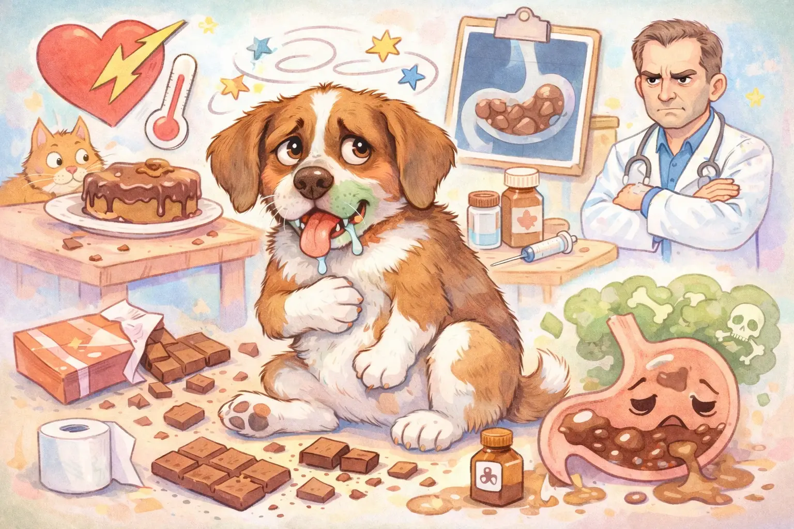
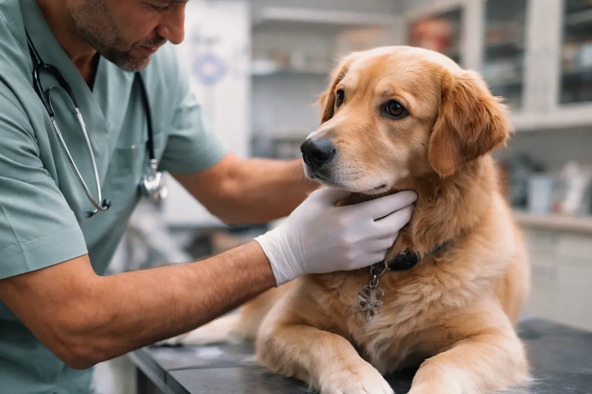

Warum dürfen Hunde keine Schokolade essen? Der Grund ist der Inhaltsstoff Theobromin, den Hunde im Gegensatz zum Menschen nur extrem langsam abbauen können. Laut der Justus-Liebig-Universität Gießen beträgt die Halbwertszeit von Theobromin beim Hund rund 17,5 Stunden, während der menschliche Körper den Stoff in 6–10 Stunden verstoffwechselt. Wenn ein Hund Schokolade gefressen hat, können bereits ab 20 mg Theobromin pro Kilogramm Körpergewicht erste Vergiftungssymptome auftreten. Besonders gefährlich ist dunkle Schokolade mit hohem Kakaoanteil. Die Antwort auf die Frage „Dürfen Hunde Schokolade essen?" lautet daher eindeutig: Nein – Schokolade gehört nicht in den Hundenapf und muss außerhalb der Reichweite von Hunden aufbewahrt werden.

⚡ Zusammenfassung

<ul>
<li>Warum dürfen Hunde keine Schokolade? Weil sie Theobromin enthält – ein Giftstoff, der erst nach <strong>17,5 Stunden</strong> zur Hälfte abgebaut wird</li>
<li>Vergiftungssymptome beginnen ab <strong>20 mg Theobromin pro kg</strong> Körpergewicht – die tödliche Dosis liegt bei 100–200 mg/kg</li>
<li>Je dunkler die Schokolade, desto gefährlicher: Zartbitterschokolade enthält bis zu <strong>8 mg Theobromin pro Gramm</strong></li>
<li>Wenn ein Hund Schokolade gefressen hat: <strong>Sofort den Tierarzt kontaktieren</strong>, auch ohne sichtbare Symptome</li>
<li>Erste Symptome treten <strong>2–4 Stunden</strong> nach Aufnahme auf – den Hund mindestens 24 Stunden beobachten</li>
</ul>

17,5 h

Halbwertszeit Theobromin beim Hund

20 mg/kg

Erste Symptome ab

2–4 h

Bis Symptome auftreten

100 mg/kg

Letale Dosis

## Warum dürfen Hunde keine Schokolade? Die Rolle von Theobromin

Schokolade enthält den Wirkstoff Theobromin, ein Methylxanthin aus der Kakaobohne, das chemisch mit Koffein verwandt ist. Beim Menschen wird Theobromin durch spezifische Leberenzyme schnell abgebaut. Hunden fehlt dieses Enzym weitgehend, weshalb der Stoff sich im Körper anreichert und toxisch wirkt.

Theobromin beim Hund hat eine Halbwertszeit von etwa 17,5 Stunden – das bedeutet, nach dieser Zeit ist erst die Hälfte des aufgenommenen Giftstoffs abgebaut. Beim Menschen beträgt die Halbwertszeit lediglich 6–10 Stunden. Dieser drastische Unterschied im Stoffwechsel erklärt, warum Schokolade für Hunde gefährlich ist, während Menschen sie problemlos genießen können.

Neben Theobromin enthält Schokolade auch geringe Mengen Koffein. Laut der Tierklinik Zweibrücken verstärkt die Kombination beider Methylxanthine die toxische Wirkung. Koffein wird beim Hund innerhalb von 1–2 Stunden resorbiert, Theobromin in 3–4 Stunden. Die Giftstoffe verteilen sich anschließend im gesamten Körper und werden in der Leber abgebaut – ein Prozess, der beim Hund deutlich langsamer abläuft als beim Menschen.

📖

<strong>Definition: Theobromin</strong>

Theobromin ist ein natürlich vorkommendes Alkaloid aus der Gruppe der Methylxanthine. Es ist in Kakaobohnen enthalten und gelangt über die Verarbeitung in Schokolade, Kakao und andere Kakaoprodukte. Für Hunde ist Theobromin toxisch, da ihr Stoffwechsel den Stoff nur langsam abbauen kann. Die chemische Bezeichnung lautet 3,7-Dimethylxanthin.

### Hunde und Schokolade: Was passiert im Körper?

Theobromin wirkt auf mehrere Organsysteme gleichzeitig. Es stimuliert das zentrale Nervensystem, erhöht die Herzfrequenz, erweitert die Blutgefäße und wirkt harntreibend. Beim Hund führt die langsame Verstoffwechselung dazu, dass sich Theobromin auf toxische Konzentrationen anreichert.

Laut AniCura werden die Giftstoffe im Magen-Darm-Trakt fast vollständig resorbiert. Dieser Prozess kann bis zu 10 Stunden dauern. Die Ausscheidung erfolgt über die Nieren, was bei hohen Dosen zu einer zusätzlichen Belastung der Nierenfunktion führen kann.

Studien zeigen zudem, dass regelmäßiger Schokoladenkonsum chronische Herzschäden bei Hunden verursachen kann. Der Herzmuskel verliert dabei die Fähigkeit, sich vollständig zu entspannen, wodurch weniger Blut ins Herz fließt. Bereits kleine, aber wiederholt gefütterte Mengen Schokolade können diese Langzeitschäden auslösen.

## Wie viel Schokolade ist giftig für Hunde?

Die Giftigkeit von Schokolade für Hunde hängt von drei Faktoren ab: der Art der Schokolade, der gefressenen Menge und dem Körpergewicht des Hundes. Je dunkler die Schokolade, desto höher der Theobromingehalt – und desto gefährlicher ist sie für den Hund.

### Theobromingehalt verschiedener Schokoladensorten

Die Universität Zürich hat in ihrer Vetpharm-Giftdatenbank folgende Theobrominwerte für gängige Kakaoprodukte veröffentlicht. Diese Werte bilden die Grundlage für die Berechnung der aufgenommenen Giftmenge.

| Schokoladensorte | Theobromin (mg/g) | Gefahr für 10-kg-Hund | Kritische Menge (10 kg) |
|---|---|---|---|
| Weiße Schokolade | 0,01–0,1 | Sehr gering | Keine Theobromin-Gefahr |
| Milchschokolade | 1,5–2,0 | Mittel | Ab ca. 100 g (1 Tafel) |
| Zartbitterschokolade | 5–8 | Hoch | Ab ca. 25–40 g |
| Schokolade 70 % Kakao | 20 | Sehr hoch | Ab ca. 10 g |
| Schokolade 90 % Kakao | 26 | Extrem hoch | Ab ca. 8 g |
| Kochschokolade | 14–16 | Sehr hoch | Ab ca. 12–14 g |
| Kakaopulver (Backen) | 14–26 | Extrem hoch | Ab ca. 8–14 g |

*Quelle: Vetpharm Giftdatenbank der Universität Zürich; Justus-Liebig-Universität Gießen, Klinik für Kleintiere*

### Vergiftungsschwellen nach Körpergewicht

Die toxischen Schwellenwerte für Theobromin beim Hund sind in der veterinärmedizinischen Fachliteratur gut dokumentiert. Laut Tierarzt Dr. Hölter gelten folgende Richtwerte für die Schokoladenvergiftung beim Hund:

| Dosis (mg Theobromin/kg KGW) | Wirkung beim Hund |
|---|---|
| **Ab 20 mg/kg** | Erste Symptome: Unruhe, Erbrechen, Durchfall, erhöhter Durst |
| **Ab 40 mg/kg** | Deutliche Vergiftung: Herzrasen, Hecheln, Hyperaktivität, Muskelzittern |
| **Ab 60 mg/kg** | Schwere Vergiftung: Krämpfe, Bewusstseinsstörungen, Herzrhythmusstörungen |
| **100–200 mg/kg** | Potenziell tödlich: Letale Dosis – 50 % der Hunde sterben bei dieser Konzentration |

🚫

<strong>Achtung: Kleine Hunde besonders gefährdet!</strong>

Ein Hund mit 5 kg Körpergewicht kann bereits durch ein Drittel einer Tafel Zartbitterschokolade (ca. 30 g) lebensbedrohliche Vergiftungssymptome entwickeln. Für einen Chihuahua mit 2 kg reichen unter Umständen schon 10–15 g dunkle Schokolade für eine tödliche Dosis. Laut Gothaer Versicherung sind zwei ganze Tafeln Vollmilchschokolade für einen 5-kg-Hund bereits potenziell tödlich.

## Hund hat Schokolade gefressen: Symptome erkennen

Die Symptome einer Schokoladenvergiftung beim Hund treten in der Regel 2–4 Stunden nach dem Verzehr auf. In manchen Fällen dauert es bis zu 12 Stunden, bis erste Anzeichen sichtbar werden. Die Symptome lassen sich in drei Phasen einteilen, die je nach aufgenommener Dosis unterschiedlich stark ausgeprägt sind.

### Frühe Symptome (2–4 Stunden)

Erbrechen und Durchfall gehören zu den ersten Anzeichen einer Theobrominvergiftung. Hunde zeigen typischerweise Unruhe, vermehrten Speichelfluss und einen auffällig gesteigerten Durst. Auch häufiges Urinieren ist ein frühes Warnsignal. Laut AniCura beginnen die Magen-Darm-Symptome noch bevor sich das Theobromin vollständig im Blut angereichert hat.

### Mittelschwere Symptome (4–8 Stunden)

Bei mittelschweren Vergiftungen treten Herzrasen (Tachykardie), Hecheln und Hyperaktivität auf. Muskelzittern, übersteigerte Reflexe und Koordinationsstörungen sind typisch für dieses Stadium. Die Körpertemperatur kann ansteigen (Hyperthermie). In dieser Phase wirkt Theobromin bereits auf das zentrale Nervensystem und das Herz-Kreislauf-System des Hundes.

### Schwere Vergiftungssymptome (ab 8–12 Stunden)

Schwere Vergiftungen äußern sich durch Krampfanfälle, Herzrhythmusstörungen und Bewusstseinsstörungen bis hin zum Koma. Laut der Kleintierpraxis Beate Loch können in schwerwiegenden Fällen innere Blutungen und Atemstillstand auftreten. Ohne tierärztliche Behandlung kann eine schwere Schokoladenvergiftung innerhalb von 12–24 Stunden zum Tod führen.

⚠️ Leichte bis mittlere Symptome

<ul>
<li>Erbrechen und Durchfall</li>
<li>Unruhe und Hecheln</li>
<li>Vermehrter Durst und Urinabsatz</li>
<li>Erhöhte Herzfrequenz</li>
</ul>

🚨 Schwere Symptome (Notfall!)

<ul>
<li>Krampfanfälle</li>
<li>Herzrhythmusstörungen</li>
<li>Bewusstlosigkeit / Koma</li>
<li>Innere Blutungen / Atemstillstand</li>
</ul>

## Hund hat Schokolade gefressen: Was tun?

Sofort den Tierarzt oder die nächste Tierklinik kontaktieren – das ist die wichtigste Maßnahme, wenn ein Hund Schokolade gefressen hat. Je schneller die Behandlung beginnt, desto besser sind die Heilungschancen. Auch wenn der Hund zunächst keine Symptome zeigt, ist ärztlicher Rat unverzichtbar.

1

Situation erfassen

Art und Menge der Schokolade feststellen. Verpackung sichern. Gewicht des Hundes notieren.

2

Tierarzt anrufen

Sofort Tierarzt oder Tierklinik kontaktieren. Schokoladenart, Menge und Hundegewicht angeben.

3

Hund beobachten

Auf Unruhe, Erbrechen, Durchfall oder Zittern achten. Zeitpunkt der Aufnahme notieren.

4

Zum Tierarzt fahren

Innerhalb von 1–2 Stunden kann der Tierarzt ein Brechmittel geben oder den Magen spülen.

### Hund hat Schokolade gefressen: Wie lange beobachten?

Ein Hund sollte nach dem Verzehr von Schokolade mindestens 24 Stunden engmaschig beobachtet werden. Die ersten Symptome treten typischerweise 2–4 Stunden nach der Aufnahme auf. Aufgrund der langen Halbwertszeit von Theobromin (17,5 Stunden) können Beschwerden jedoch auch noch deutlich später einsetzen.

Besonders in den ersten 6 Stunden nach dem Fressen der Schokolade ist eine enge Überwachung wichtig. Hunde, die nach dem Schokoladenverzehr keine Symptome zeigen, sind nicht automatisch außer Gefahr. Die Resorption von Theobromin im Magen-Darm-Trakt kann bis zu 10 Stunden dauern, sodass sich eine Vergiftung zeitverzögert manifestieren kann.

### Hund hat Schokolade gefressen – Hausmittel: Warum davon abzuraten ist

Tierärzte warnen ausdrücklich vor dem Einsatz von Hausmitteln bei einer Schokoladenvergiftung. Das früher verbreitete Salzwasser zum Auslösen von Erbrechen kann eine gefährliche Natriumvergiftung verursachen, die die Situation verschlimmert statt verbessert. Auch Milch bindet Theobromin nicht und verzögert im schlimmsten Fall die professionelle Behandlung.

Laut der Justus-Liebig-Universität Gießen sollte das Auslösen von Erbrechen ausschließlich durch einen Tierarzt mit geeigneten Medikamenten erfolgen. Der Tierarzt kann zudem Aktivkohle verabreichen, die noch nicht resorbiertes Theobromin im Darm bindet. Die Behandlungsdauer bei einer Schokoladenvergiftung beträgt laut AniCura je nach Schweregrad etwa 12–48 Stunden.

⚠️

<strong>Kein Erbrechen selbst auslösen!</strong>

Tierhalter sollten niemals versuchen, den Hund selbstständig zum Erbrechen zu bringen. Salzwasser kann eine lebensgefährliche Natriumvergiftung auslösen. Zudem besteht bei bereits eingetretener Bewusstseinstrübung die Gefahr des Erstickens an Erbrochenem. Die einzig sichere Maßnahme ist der sofortige Besuch beim Tierarzt.

## Welche Schokolade ist besonders gefährlich für Hunde?

Die Gefährlichkeit von Schokolade für Hunde steigt mit dem Kakaoanteil. Zartbitterschokolade, Kochschokolade und reines Kakaopulver stellen die größte Gefahr dar. Milchschokolade enthält weniger Theobromin, kann aber in größeren Mengen ebenfalls toxisch wirken.

### Zartbitterschokolade und dunkle Schokolade

Zartbitterschokolade enthält 5–8 mg Theobromin pro Gramm – das ist das 3- bis 5-Fache von Milchschokolade. Eine halbe Tafel Zartbitterschokolade (50 g) liefert 250–400 mg Theobromin. Für einen 10-kg-Hund entspricht das 25–40 mg/kg Körpergewicht und liegt damit bereits im Bereich deutlicher Vergiftungssymptome.

### Milchschokolade und weiße Schokolade

Milchschokolade enthält 1,5–2 mg Theobromin pro Gramm und ist damit weniger giftig als dunkle Sorten. Dennoch kann eine volle Tafel (100 g) bei einem kleinen Hund Vergiftungssymptome auslösen. Weiße Schokolade enthält praktisch kein Theobromin, da bei der Herstellung das Kakaopulver entfernt wird. Der hohe Fett- und Zuckergehalt kann jedoch Magen-Darm-Beschwerden und im Extremfall eine Bauchspeicheldrüsenentzündung (Pankreatitis) verursachen.

### Versteckte Schokolade in Lebensmitteln

Theobromin ist nicht nur in Schokoladentafeln enthalten. Schokoladenkuchen, Muffins, Kekse, Plätzchen, Dominosteine, Trinkschokolade und Kakaopulver zum Backen enthalten ebenfalls relevante Mengen des Giftstoffs. Besonders gefährlich sind Backzutaten wie reines Kakaopulver mit 14–26 mg Theobromin pro Gramm – die höchste Konzentration aller Kakaoprodukte.

Zusätzlich zur Schokolade können andere in Süßwaren enthaltene Zutaten für Hunde giftig sein. Laut der Kleintierpraxis Beate Loch sind Rosinen, Macadamia-Nüsse und Bittermandeln (in Marzipan) ebenfalls toxisch. Ein Schokokuchen mit Rosinen stellt daher eine doppelte Gefahr dar. Weitere Informationen zu giftigen Lebensmitteln bietet der Artikel über Vergiftungen beim Hund.

## Warum Hunde keine Schokolade dürfen: Behandlung und Kosten

Für eine Schokoladenvergiftung existiert kein spezifisches Gegenmittel. Die tierärztliche Behandlung konzentriert sich auf die schnelle Entfernung des Giftstoffs aus dem Körper (Dekontamination) und die Stabilisierung des Kreislaufs.

### Behandlungsmethoden beim Tierarzt

Innerhalb der ersten 1–2 Stunden nach der Aufnahme kann der Tierarzt durch ein Brechmittel (Emetikum) oder eine Magenspülung einen Großteil der Schokolade entfernen. Anschließend wird häufig Aktivkohle verabreicht, die noch nicht resorbiertes Theobromin im Darm bindet und die weitere Aufnahme in den Blutkreislauf reduziert.

Bei schweren Vergiftungen ist eine stationäre intensivmedizinische Therapie notwendig. Diese umfasst Infusionen zur Stabilisierung des Kreislaufs, Medikamente gegen Herzrhythmusstörungen und Krämpfe sowie eine kontinuierliche Überwachung der Vitalfunktionen. Laut AniCura dauert die stationäre Behandlung einer Schokoladenvergiftung je nach Schweregrad 12–48 Stunden.

### Kosten einer Schokoladenvergiftung beim Hund

Die Behandlungskosten variieren stark je nach Schweregrad der Vergiftung. Eine ambulante Behandlung bei leichter Vergiftung kostet etwa 150–300 Euro. Stationäre Aufenthalte mit Intensivbetreuung können Kosten von 800–1.500 Euro verursachen. In Notdienstkliniken fallen zusätzlich Notdienstzuschläge an.

💶 Leichte Vergiftung

<ul>
<li><strong>150–300 Euro</strong> (ambulant)</li>
<li>Brechmittel + Aktivkohle</li>
<li>Überwachung für wenige Stunden</li>
</ul>

💶 Schwere Vergiftung

<ul>
<li><strong>800–1.500 Euro</strong> (stationär)</li>
<li>Intensivbetreuung über 12–48 Stunden</li>
<li>Infusionen, Medikamente, Monitoring</li>
</ul>

## Schokoladenvergiftung beim Hund vorbeugen

Prävention ist der zuverlässigste Schutz vor einer Schokoladenvergiftung. Schokolade und Kakaoprodukte sollten grundsätzlich an einem für Hunde unzugänglichen Ort aufbewahrt werden. Besonders in Haushalten mit Kindern ist Aufklärung wichtig, da Hunde häufig Schokolade erhalten, die gut gemeint, aber gefährlich ist.

💡

<strong>Präventionstipp: Notfallnummern bereithalten</strong>

Die Telefonnummer des Haustierarztes und der nächsten Tierklinik mit 24-Stunden-Notdienst sollte griffbereit aufbewahrt werden – am besten als Kontakt im Smartphone gespeichert. Im Notfall zählt jede Minute. Zusätzlich empfiehlt es sich, das aktuelle Körpergewicht des Hundes zu kennen, um die aufgenommene Theobrominmenge schnell berechnen zu können.

### Sichere Aufbewahrung und Alternativen

Schokolade, Kekse, Kuchen und Backzutaten wie Kakaopulver gehören in verschlossene Schränke oder Behälter. Besondere Vorsicht gilt an Feiertagen wie Weihnachten und Ostern, wenn Schokoladenprodukte vermehrt im Haushalt zu finden sind. Ein 200 g schwerer Schoko-Weihnachtsmann aus Milchschokolade enthält bereits 300–400 mg Theobromin – genug, um bei einem kleinen Hund schwere Symptome auszulösen.

Im Tierhandel gibt es spezielle Hundesnacks, die als sichere Alternative dienen. Von Hunde-Adventskalendern bis zu Hundekeksen stehen Optionen zur Verfügung, die den Vierbeiner belohnen, ohne gesundheitliche Risiken zu bergen. Informationen zur richtigen Hundeernährung bietet auch der Artikel über [erlaubte Lebensmittel wie Erdbeeren für Hunde](/hundeernaehrung/duerfen-hunde-erdbeeren-essen/).

### Familienmitglieder und Besucher informieren

Alle Personen im Haushalt sollten über die Gefahr von Schokolade für Hunde aufgeklärt sein. Kinder neigen dazu, ihre Süßigkeiten mit dem Familienhund zu teilen, ohne die Konsequenzen zu kennen. Auch Besucher sollten darauf hingewiesen werden, dem Hund keine Schokolade oder schokoladenhaltige Lebensmittel zu geben.

## Schokoladenrechner für Hunde: Dosis berechnen

Online-Schokoladenrechner helfen bei der schnellen Einschätzung, ob die aufgenommene Menge Schokolade für den Hund gefährlich ist. Tools wie der Vetklinikum-Schokoladenrechner berechnen anhand von Schokoladenart, Menge und Körpergewicht die aufgenommene Theobrominmenge und geben eine Risikoeinschätzung.

Solche Rechner ersetzen jedoch keinesfalls den Gang zum Tierarzt. Das Vetklinikum Wien weist ausdrücklich darauf hin, dass Kakaobohnen ein Naturprodukt sind und die Theobrominkonzentration selbst bei gleichen Produkten variieren kann. Im Zweifelsfall ist es immer sicherer, den Tierarzt aufzusuchen, wenn der Hund Schokolade gefressen hat.

🔢

<strong>Schnelle Faustformel zur Berechnung</strong>

<strong>Aufgenommene Theobrominmenge</strong> = Menge Schokolade (in g) × Theobromingehalt (mg/g)

<strong>Gefahr</strong> = Theobrominmenge ÷ Körpergewicht des Hundes (in kg)

<strong>Beispiel:</strong> 50 g Zartbitterschokolade × 6 mg/g = 300 mg Theobromin. Bei einem 10-kg-Hund: 300 ÷ 10 = <strong>30 mg/kg</strong> → deutliche Vergiftungsgefahr!

## Besondere Risikofaktoren bei Hund und Schokolade

Kleine Hunderassen erreichen toxische Theobromin-Konzentrationen deutlich schneller als große Rassen. Ein Yorkshire Terrier mit 3 kg Körpergewicht benötigt nur etwa 6 g Zartbitterschokolade, um die Schwelle von 20 mg/kg zu überschreiten. Ein Labrador mit 30 kg hingegen müsste dafür mindestens 100 g der gleichen Sorte fressen.

Hunde mit Vorerkrankungen am Herzen sind laut Tierarzt Dr. Hölter besonders gefährdet. Theobromin verstärkt bestehende Herzrhythmusstörungen und kann bei herzkranken Hunden schon in niedrigeren Dosen lebensbedrohlich wirken. Auch ältere Hunde und Welpen, deren Leber die Giftstoffe langsamer verarbeitet, tragen ein erhöhtes Risiko.

Labradore und Golden Retriever gelten als besonders häufig betroffen – nicht wegen einer erhöhten Empfindlichkeit, sondern weil diese Rassen als besonders verfressen gelten und größere Mengen auf einmal verzehren. Die Tierklinik Zweibrücken berichtet, dass Labrador-Mischlinge überproportional häufig wegen Schokoladenvergiftungen vorgestellt werden. Wer mehr über rassespezifische Eigenheiten erfahren möchte, findet Informationen im Bereich [Hunderassen](/hunderassen/).

## Ist Schokolade giftig für Hunde – oder nur ein Mythos?

Die Giftigkeit von Schokolade für Hunde ist wissenschaftlich eindeutig belegt und kein Mythos. Die Justus-Liebig-Universität Gießen, die Universität Zürich und zahlreiche veterinärmedizinische Fachkliniken bestätigen die toxische Wirkung von Theobromin auf Hunde. Die letale Dosis ist mit 100–200 mg/kg Körpergewicht gut dokumentiert.

Dass manche Hunde nach dem Verzehr von Schokolade keine sichtbaren Symptome zeigen, liegt an der Dosisabhängigkeit der Vergiftung. Ein großer Hund, der ein einzelnes Stück Milchschokolade frisst, nimmt möglicherweise nur eine subklinische Dosis auf. Das bedeutet nicht, dass Schokolade harmlos ist – es bedeutet lediglich, dass die Schwelle für sichtbare Symptome nicht erreicht wurde. Regelmäßiger Konsum kleiner Mengen kann dennoch chronische Herzschäden verursachen.

## Fazit: Warum dürfen Hunde keine Schokolade?

Warum dürfen Hunde keine Schokolade? Weil die enthaltene Substanz Theobromin bereits in geringen Dosen schwere Vergiftungserscheinungen auslösen kann. Die wichtigsten Erkenntnisse: Je dunkler die Schokolade und je kleiner der Hund, desto größer die Gefahr. Erste Symptome wie Erbrechen, Durchfall und Unruhe treten 2–4 Stunden nach dem Verzehr auf, schwere Vergiftungen mit Krämpfen und Herzrhythmusstörungen sind ab 60 mg Theobromin pro kg Körpergewicht zu erwarten.

Die beste Prävention ist, Schokolade und alle kakaohaltigen Produkte konsequent außerhalb der Reichweite von Hunden aufzubewahren. Wenn ein Hund Schokolade gefressen hat, gilt: Sofort den Tierarzt kontaktieren, auch wenn noch keine Symptome sichtbar sind. Jede Minute zählt. Mit schnellem Handeln und professioneller Behandlung stehen die Heilungschancen gut.

Grundlegende Informationen zur sicheren Hundeernährung helfen dabei, weitere Gefahrenquellen im Haushalt zu erkennen und den Vierbeiner vor versehentlichen Vergiftungen zu schützen. Auch ein Blick in den Ratgeber zur Vergiftung beim Hund ist für jeden Hundehalter empfehlenswert.
