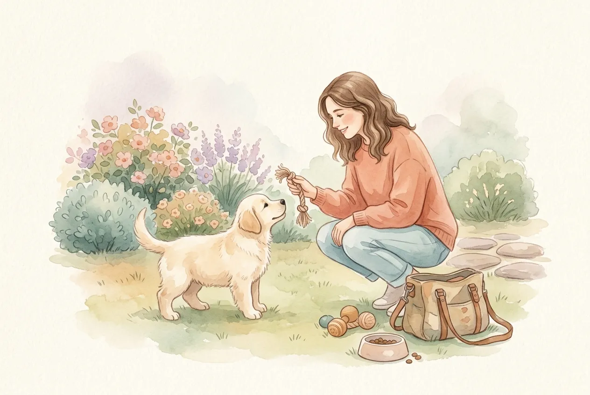
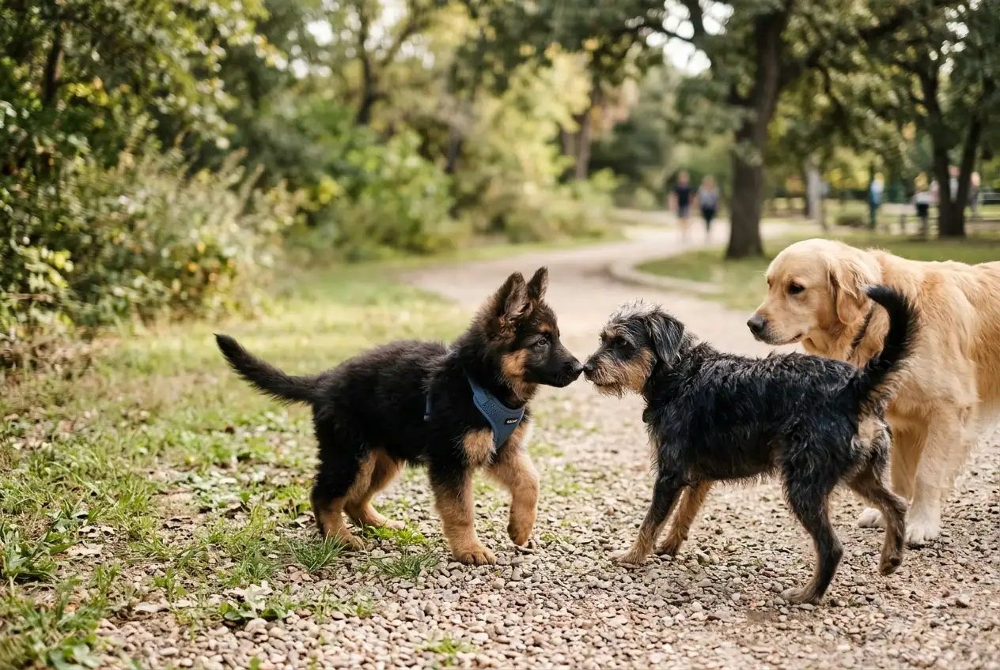
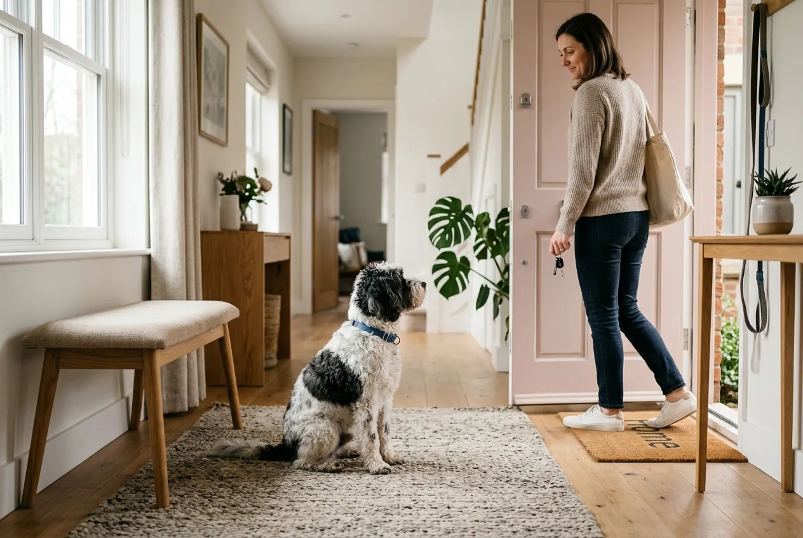

Welpenerziehung entscheidet in den ersten 16 Lebenswochen über das spätere Verhalten deines Hundes. Diese Phase, von Verhaltensforschern als Prägephase bezeichnet, formt Vertrauen, Stressresistenz und Sozialverhalten fürs ganze Leben. Wer jetzt die richtigen Weichen stellt, erspart sich später viele Probleme.

Dieser Guide führt dich durch alle wichtigen Bereiche der Welpenerziehung: Stubenreinheit, Grundkommandos, Sozialisierung, Alleinbleiben und das Setzen klarer Grenzen. Du erfährst konkrete Zeitpläne, vermeidbare Fehler und tierärztlich geprüfte Methoden für einen gelassenen, gut erzogenen Hund.

Zusammenfassung: Welpenerziehung auf einen Blick

<ul>
<li><strong>Start sofort</strong>, die Welpenerziehung beginnt am ersten Tag im neuen Zuhause, meist ab der 8. Lebenswoche.</li>
<li><strong>Prägephase bis Woche 16</strong>, in diesem Zeitraum lernen Welpen nachweislich am schnellsten und nachhaltigsten.</li>
<li><strong>Kurze Einheiten</strong>, 3 bis 5 Minuten Training mehrmals täglich sind effektiver als lange Sessions.</li>
<li><strong>Positive Verstärkung</strong>, Belohnung mit Leckerli oder Lob ist wissenschaftlich belegt wirksamer als Bestrafung.</li>
<li><strong>Konsequenz</strong>, alle Familienmitglieder müssen die gleichen Regeln und Kommandos verwenden.</li>
</ul>

16

Wochen Prägephase

3-5 Min

Trainingsdauer

20 Std

Schlafbedarf täglich

165

Wörter verstehbar

## Wann beginnt die Welpenerziehung?

Die Welpenerziehung beginnt am ersten Tag im neuen Zuhause, in der Regel mit 8 Wochen. Bereits beim Züchter durchläuft der Welpe zwischen der 3. und 8. Lebenswoche die erste Sozialisierungsphase. In dieser Zeit lernt er den Umgang mit Artgenossen, Menschen und Alltagsgeräuschen.

Die entscheidende Prägephase endet laut Verhaltensforschung der Tierärztlichen Hochschule Hannover mit der 16. Lebenswoche. Alles, was der Welpe bis dahin positiv kennenlernt, akzeptiert er sein Leben lang problemlos. Versäumte Sozialisierung lässt sich später nur mit erheblichem Aufwand nachholen.

### Die 3-3-3-Regel für den Einzug

Die 3-3-3-Regel beschreibt die typische Eingewöhnungsphase eines Welpen oder Hundes im neuen Zuhause. Sie hilft Haltern, realistische Erwartungen an das Verhalten in den ersten Wochen zu entwickeln.

📖

<strong>Definition: 3-3-3-Regel</strong>

In den ersten 3 Tagen ist der Welpe überfordert und zeigt sich zurückhaltend. Nach 3 Wochen hat er sich an die Routine gewöhnt und zeigt seinen wahren Charakter. Nach 3 Monaten ist er vollständig eingelebt und vertraut seiner Familie.

## Die wichtigsten Grundlagen der Welpenerziehung

Erfolgreiche Welpenerziehung basiert auf vier Säulen: Konsequenz, positive Verstärkung, Geduld und klare Kommunikation. Diese Prinzipien gelten unabhängig von Rasse oder Größe des Hundes und sind durch zahlreiche verhaltensbiologische Studien belegt.

Positive Verstärkung bedeutet, erwünschtes Verhalten mit Leckerli, Lob oder Spiel zu belohnen. Laut einer Studie der Universität Bristol lernen Hunde durch Belohnung 30 Prozent schneller als durch Korrektur. Bestrafung hingegen führt nachweislich zu Stress und Misstrauen.

### So lernen Welpen wirklich

Welpen lernen durch Wiederholung, Verknüpfung und Erfolgserlebnisse. Das Gehirn eines Welpen bildet in der Prägephase besonders viele neuronale Verbindungen, was schnelles Lernen ermöglicht. Gleichzeitig ist die Konzentrationsspanne mit 3 bis 5 Minuten sehr begrenzt.

🎯

Klares Signal

Immer dasselbe Wort für dasselbe Kommando verwenden, von allen Familienmitgliedern.

🏆

Sofortige Belohnung

Innerhalb von 2 Sekunden nach dem erwünschten Verhalten loben oder belohnen.

🔁

Viele Wiederholungen

5 bis 10 Wiederholungen pro Session, mehrmals täglich, in verschiedenen Umgebungen.

⏳

Geduld

Fortschritte brauchen Zeit, Frustration überträgt sich sofort auf den Welpen.

### Die Konzentrationsspanne verstehen

Ein Welpe kann sich nur wenige Minuten am Stück konzentrieren. Laut dem Berufsverband der Hundeerzieher sind 3 bis 5 Minuten Training pro Einheit optimal. Drei bis fünf kurze Sessions über den Tag verteilt bringen mehr als eine 30-minütige Einheit.

## Stubenreinheit trainieren

Stubenreinheit ist meist die erste große Herausforderung in der Welpenerziehung. Welpen können ihre Blase altersbedingt nur begrenzt kontrollieren. Die Faustregel lautet: Lebensalter in Monaten plus 1 ergibt die maximale Haltezeit in Stunden.

Ein 2 Monate alter Welpe muss also alle 3 Stunden nach draußen, tagsüber sogar häufiger. Die meisten Welpen sind mit 4 bis 6 Monaten zuverlässig stubenrein, wenn das Training konsequent erfolgt.

1

Feste Zeiten

Nach dem Aufwachen, Fressen, Spielen und Trinken sofort nach draußen.

2

Signalwort

Während des Lösens ein Kommando wie Mach Pipi einführen.

3

Sofort belohnen

Direkt nach dem Lösen im Freien ausgiebig loben und ein Leckerli geben.

✓

Unfälle ignorieren

Malheure geräuschlos entfernen, niemals schimpfen oder mit der Nase reindrücken.

⚠️

<strong>Niemals bestrafen bei Pinkelunfällen</strong>

Schimpfen oder gar die Nase in die Pfütze drücken führt laut Tierärztlicher Vereinigung für Tierschutz zu Angst, heimlichem Lösen und Vertrauensverlust. Der Welpe versteht den Zusammenhang nicht.

### Nachts durchhalten lernen

In den ersten Wochen muss der Welpe nachts ein- bis zweimal raus. Stelle seine Box oder sein Körbchen in dein Schlafzimmer, damit du sein Winseln hörst. Nach etwa 4 bis 5 Monaten schläft er meist durch.

## Die wichtigsten Grundkommandos

Grundkommandos bilden das Fundament der Kommunikation zwischen Mensch und Hund. Sie sorgen für Sicherheit im Alltag und schaffen Struktur. In den ersten 4 Monaten sollte ein Welpe 4 bis 6 Kommandos beherrschen.

Der [komplette Überblick aller wichtigen Kommandos für Hunde](https://hundewissen-mit-kopf.de/erziehung-verhalten/kommandos-hund/) zeigt, welche Signale im Welpenalter besonders wichtig sind und wie sie aufgebaut werden.

| Kommando | Trainingsbeginn | Zweck |
|---|---|---|
| Name | Tag 1 | Aufmerksamkeit des Welpen |
| Sitz | Woche 8-9 | Grundposition, Impulskontrolle |
| Komm | Woche 9-10 | Rückruf, Sicherheit |
| Platz | Woche 10-11 | Ruhe, Entspannung |
| Nein / Aus | Woche 10-12 | Abbruchsignal |
| Bleib | Woche 12-14 | Selbstkontrolle |

### Sitz: Das erste Kommando

Sitz ist das einfachste Kommando und funktioniert meist schon nach wenigen Versuchen. Halte ein Leckerli knapp über die Nase des Welpen und bewege es langsam nach hinten. Der Hund folgt mit dem Blick und setzt sich automatisch.

Sobald der Hintern den Boden berührt, sagst du klar Sitz und gibst sofort das Leckerli. Nach 10 bis 20 Wiederholungen verknüpft der Welpe das Wort mit der Aktion.

### Rückruf: Das wichtigste Kommando

Der Rückruf kann Leben retten. Er muss von Anfang an mit etwas Positivem verknüpft werden, sonst ignoriert der Hund ihn später. Rufe deinen Welpen immer nur dann mit dem Komm-Kommando, wenn du ihn auch belohnen kannst.

💡

<strong>Goldene Rückruf-Regel</strong>

Nutze das Kommando Komm niemals für etwas Unangenehmes wie Leine anlegen zum Nachhausegehen oder Baden. Sonst lernt der Welpe, dass Komm etwas Negatives bedeutet.

## Sozialisierung: Das Fenster schließt sich mit Woche 16

Sozialisierung ist die wichtigste Aufgabe der Welpenerziehung und entscheidet über die spätere Stressresistenz. In der Prägephase bis zur 16. Lebenswoche speichert der Welpe alle neuen Reize als normal ab. Was er in dieser Zeit nicht kennenlernt, kann später Angst auslösen.

Soziale Interaktion umfasst dabei nicht nur andere Hunde, sondern auch Menschen aller Altersgruppen, Umgebungen und Geräusche. Eine umfassende Sozialisierung senkt laut Studien das Risiko für spätere Verhaltensprobleme um bis zu 50 Prozent.

✅ Sozialisierungs-Checkliste bis Woche 16

Verschiedene Menschen: Kinder, Senioren, Männer mit Bart, Brillenträger

Andere Hunde unterschiedlicher Größen und Rassen

Verkehrsmittel: Auto, Bus, Bahn, Aufzug

Geräuschkulissen: Staubsauger, Feuerwerk-Aufnahme, Baustelle

Untergründe: Gitter, Holz, Sand, Wasser, Treppen

Tierarztbesuche ohne Behandlung für positive Assoziation

Alleinbleiben in kleinen Schritten üben

### Welpenspielstunden besuchen

Kontrollierte Welpenspielstunden bei seriösen Hundeschulen bieten ideale Sozialisierungsmöglichkeiten. Der Welpe lernt Beißhemmung, Körpersprache anderer Hunde und angemessenes Spielverhalten. Achte darauf, dass Gruppen nach Größe und Temperament sortiert sind.

## Alleinbleiben trainieren

Alleinbleiben gehört zu den schwierigsten Lektionen der Welpenerziehung. Hunde sind Rudeltiere und empfinden Einsamkeit als existenzielle Bedrohung. Wird das Alleinbleiben nicht systematisch geübt, entwickeln sich häufig Trennungsängste.

Das Training beginnt mit wenigen Sekunden und wird schrittweise gesteigert. Starte damit, den Raum kurz zu verlassen, während der Welpe entspannt in seinem Körbchen liegt. Steigere die Dauer in kleinen Schritten.

1

Woche 1

10 Sekunden bis 2 Minuten in einem anderen Raum verbringen.

2

Woche 2-3

2 bis 10 Minuten, Wohnung kurz verlassen (Müll rausbringen).

3

Woche 4-6

15 bis 30 Minuten außer Haus, zum Einkaufen gehen.

✓

Nach 2-3 Monaten

Maximal 4 bis 5 Stunden am Stück bei erwachsenen Hunden.

ℹ️

<strong>Kein Abschiedsdrama</strong>

Gehe ruhig und wortlos aus dem Haus. Übertriebene Verabschiedungen signalisieren dem Welpen, dass etwas Außergewöhnliches passiert und erhöhen den Stresslevel.

## Grenzen setzen in der Welpenerziehung

Grenzen setzen bedeutet nicht Strenge, sondern klare Regeln, die dem Welpen Orientierung geben. Hunde fühlen sich in einer strukturierten Umgebung mit verlässlichen Regeln sicherer. Alle Familienmitglieder müssen die gleichen Grenzen durchsetzen.

Entscheidet gemeinsam: Darf der Welpe aufs Sofa? Ins Schlafzimmer? Vom Tisch fressen? Ist eine Regel einmal festgelegt, gilt sie immer. Inkonsequenz verwirrt den Welpen und führt zu Verhaltensproblemen.

### Unerwünschtes Verhalten richtig stoppen

Beißen in Hände, Anspringen oder das [ständige Bellen](https://hundewissen-mit-kopf.de/erziehung-verhalten/hund-bellt-staendig/) gehören zu typischem Welpenverhalten. Reagiere ruhig, aber konsequent: Unterbrich das Verhalten mit einem neutralen Nein oder Aus und biete eine Alternative an.

Richtig: Grenzen setzen

<ul>
<li>Ruhiges Abbruchsignal wie Nein oder Aus</li>
<li>Alternative anbieten (Kauspielzeug statt Hand)</li>
<li>Erwünschtes Verhalten sofort belohnen</li>
<li>Körpersprache deutlich, aber nicht bedrohlich</li>
<li>Konsequenz durch alle Familienmitglieder</li>
</ul>

Falsch: Schaden statt Erziehung

<ul>
<li>Anschreien oder körperliche Gewalt</li>
<li>Nase in den Pinkelfleck drücken</li>
<li>Welpe an der Nackenhaut schütteln</li>
<li>Bestrafung lange nach der Tat</li>
<li>Inkonsequente Regeln im Haushalt</li>
</ul>

🚫

<strong>Absolute Tabus in der Welpenerziehung</strong>

Alpha-Wurf, Nackengriff und körperliche Strafen sind laut Bundestierärztekammer verboten und kontraproduktiv. Diese Methoden verursachen nachweislich Trauma, Angstbeißen und zerstören das Vertrauen dauerhaft.

## Leinenführigkeit trainieren

Das Laufen an lockerer Leine ist eine der wichtigsten Alltagsfähigkeiten. Beginne das Training im Haus und Garten, bevor du in die Außenwelt gehst. Ein Welpe soll die Leine als angenehm empfinden, nicht als Zwang.

Der ausführliche Guide zur [Leinenführigkeit trainieren](https://hundewissen-mit-kopf.de/erziehung-verhalten/leinenfuehrigkeit-trainieren/) zeigt Schritt für Schritt, wie du das Ziehen verhinderst und entspanntes Gehen etablierst.

Für Welpen ist ein gut sitzendes Geschirr meist besser als ein Halsband, da es die empfindliche Halswirbelsäule schont. Welches System für deinen Hund passt, erfährst du im Vergleich [Hundegeschirr oder Halsband](https://hundewissen-mit-kopf.de/hundeausstattung/hundegeschirr-oder-halsband/).

## Wochenplan für die Welpenerziehung

Ein strukturierter Wochenplan hilft, alle Erziehungsbereiche abzudecken ohne den Welpen zu überfordern. Die folgende Übersicht zeigt eine ausgewogene Verteilung der Trainingseinheiten.

| Wochentag | Fokus-Training | Dauer | Zusätzlich |
|---|---|---|---|
| Montag | Grundkommandos (Sitz, Platz) | 3 x 5 Min | Stubenreinheit |
| Dienstag | Rückruf im Garten | 3 x 5 Min | Alleinbleiben |
| Mittwoch | Sozialisierung (Spaziergang) | 20 Min | Handling |
| Donnerstag | Leinenführigkeit | 3 x 5 Min | Beißhemmung |
| Freitag | Welpenspielstunde | 45 Min | Ruhe danach |
| Samstag | Neue Umgebung erkunden | 30 Min | Fremde Menschen |
| Sonntag | Ruhetag mit kurzen Übungen | 2 x 3 Min | Kuscheln |

## Häufige Fehler in der Welpenerziehung

Viele Fehler entstehen aus guter Absicht, schaden dem Welpen aber langfristig. Die Kenntnis dieser Stolperfallen hilft, sie von Anfang an zu vermeiden.

⚠️

<strong>Top 5 Fehler in der Welpenerziehung</strong>

1. Überforderung durch zu lange Einheiten. 2. Inkonsequenz bei Regeln. 3. Vermenschlichung statt hundgerechter Kommunikation. 4. Vernachlässigte Sozialisierung vor Woche 16. 5. Bestrafung statt Alternativen anbieten.

### Überforderung vermeiden

Welpen schlafen bis zu 20 Stunden pro Tag, das ist biologisch notwendig für ihre Entwicklung. Zu viel Training, zu lange Spaziergänge oder ständiger Trubel führen zu Überreizung. Ein überreizter Welpe wird unruhig, beißt stärker und lernt schlechter.

Die Faustregel für Spaziergänge lautet: 5 Minuten pro Lebensmonat, zwei- bis dreimal täglich. Ein 3 Monate alter Welpe sollte also maximal 15 Minuten am Stück laufen.

## Stubenreinheit und Problemlösung

Auch bei guter Welpenerziehung gibt es Rückschläge. Stress, Krankheit oder Entwicklungsphasen können Stubenreinheit vorübergehend verschlechtern. Reagiere gelassen und kehre zu kürzeren Intervallen zurück.

Bei anhaltenden Problemen mit der Sauberkeit hilft der ausführliche Ratgeber [Hund stubenrein bekommen](https://hundewissen-mit-kopf.de/erziehung-verhalten/hund-stubenrein-bekommen/) mit konkreten Lösungsansätzen für verschiedene Altersstufen.

✅

<strong>Welpe ist erfolgreich erzogen, wenn:</strong>

Er zuverlässig stubenrein ist, 4 bis 6 Grundkommandos beherrscht, 2 bis 3 Stunden entspannt allein bleibt, freundlich auf Menschen und Hunde reagiert und mit verschiedenen Alltagssituationen gelassen umgeht.

## Hundeschule oder Eigenregie?

Eine gute Hundeschule ergänzt die tägliche Welpenerziehung zu Hause optimal. Der Berufsverband der Hundeerzieher empfiehlt den Besuch einer Welpengruppe ab der 10. Lebenswoche. Professionelle Trainer erkennen Probleme früh und geben individuelles Feedback.

Achte bei der Auswahl auf zertifizierte Trainer, die ausschließlich mit positiver Verstärkung arbeiten. Hundeschulen mit Kettenrucken, Stachelhalsbändern oder Alpha-Methoden sind zu meiden.

| Kriterium | Gute Hundeschule | Warnsignal |
|---|---|---|
| Methode | Positive Verstärkung | Dominanztheorie |
| Hilfsmittel | Leckerli, Spielzeug | Würgehalsband, Stachelband |
| Gruppengröße | Max. 6 Welpen | Über 10 Welpen |
| Qualifikation | BHV oder vergleichbar | Keine Zertifizierung |
| Trainer-Verhalten | Ruhig, erklärend | Laut, autoritär |

## Fazit: Erfolgreiche Welpenerziehung in den ersten Monaten

Welpenerziehung ist ein Marathon, kein Sprint. Die ersten 16 Wochen legen das Fundament für den Rest des Hundelebens und verdienen daher volle Aufmerksamkeit. Mit Konsequenz, Geduld und positiver Verstärkung entwickelt sich aus jedem Welpen ein ausgeglichener Familienhund.

Die wichtigsten Säulen bleiben: frühe Sozialisierung vor Woche 16, kurze Trainingseinheiten von 3 bis 5 Minuten, klare Regeln für die ganze Familie und der absolute Verzicht auf Gewalt. Wer diese Grundlagen in der Welpenerziehung berücksichtigt, spart sich später unzählige Probleme. Investiere die Zeit jetzt, dein Hund dankt es dir ein Leben lang.