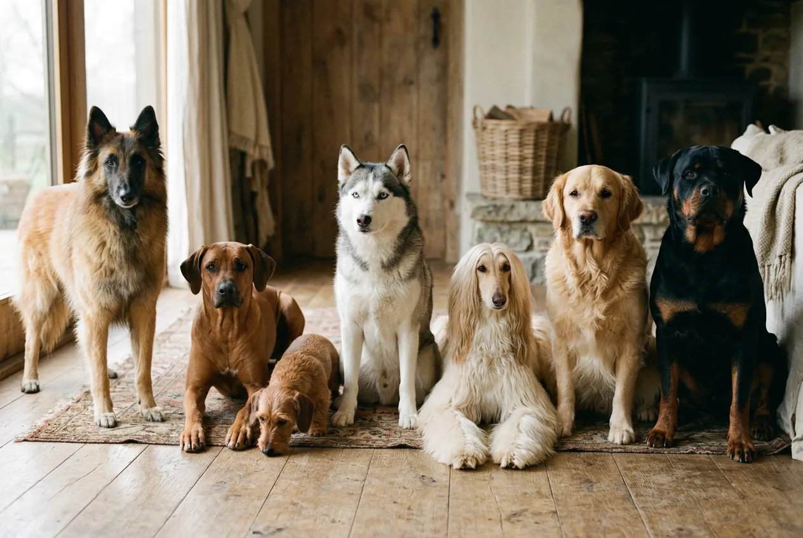
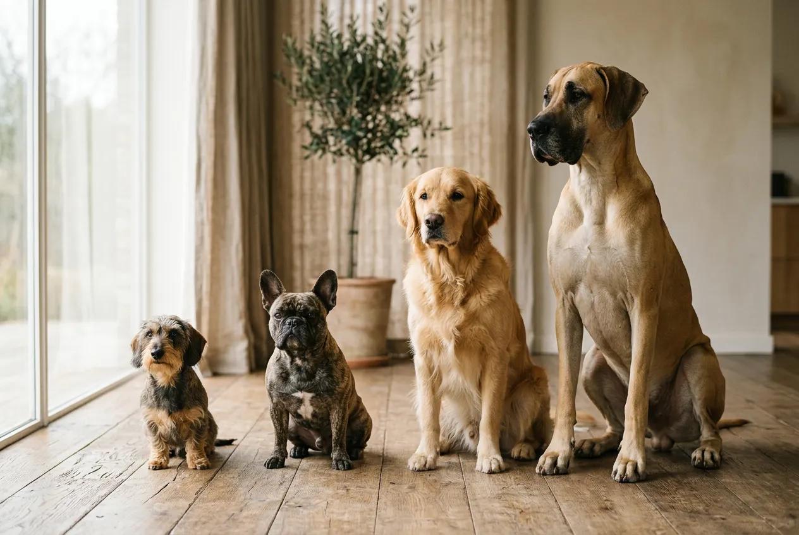

Wie viele Hunderassen gibt es eigentlich? Die Fédération Cynologique Internationale (FCI) erkennt aktuell 365 Hunderassen offiziell an -- doch weltweit existieren über 500 verschiedene Rassen, wenn man alle Zuchtverbände zusammenzählt. Die Vielfalt reicht vom 1,5 kg leichten Chihuahua bis zur 90 kg schweren Deutschen Dogge.

Ob du einen Hund suchst, der zu deinem Alltag passt, oder einfach mehr über die Rassenvielfalt erfahren möchtest -- in diesem Ratgeber findest du alle Zahlen, die vollständige FCI-Gruppeneinteilung, die beliebtesten Hunderassen in Deutschland und wichtige Unterschiede zwischen Rassehunden und Mischlingen.

Zusammenfassung: Wie viele Hunderassen gibt es?

<ul>
<li><strong>365 FCI-anerkannte Hunderassen</strong> -- die weltweit offizielle Zahl (Stand 2025)</li>
<li><strong>Über 500 Rassen weltweit</strong> -- wenn AKC, KC und weitere Verbände einbezogen werden</li>
<li><strong>10 FCI-Gruppen</strong> -- von Hütehunden bis Windhunden, nach Verwendungszweck sortiert</li>
<li><strong>Rund 250 Rassen in Deutschland</strong> -- über den VDH mit eigenen Zuchtvereinen vertreten</li>
<li><strong>Mischlinge machen ca. 50 %</strong> aller Hunde in Deutschland aus und zählen zu keiner Rasse</li>
</ul>

365

FCI-anerkannte Rassen

500+

Rassen weltweit gesamt

10

FCI-Gruppen

~250

Rassen in Deutschland (VDH)

## Wie viele Hunderassen gibt es weltweit?

Die Antwort auf die Frage, wie viele Hunderassen es gibt, hängt vom jeweiligen Zuchtverband ab. Die FCI als größter internationaler Dachverband erkennt 365 Rassen endgültig an. Rechnet man vorläufig anerkannte Rassen hinzu, steigt die Zahl auf etwa 380.

Andere Zuchtverbände führen eigene Listen mit teilweise abweichenden Zahlen. Der American Kennel Club (AKC) erkennt rund 200 Rassen an, der britische Kennel Club (KC) etwa 220. Einige Rassen sind nur in einem Verband registriert, andere in mehreren gleichzeitig.

### Warum unterscheiden sich die Zahlen je nach Verband?

Jeder Zuchtverband definiert eigene Kriterien für die Anerkennung einer Hunderasse. Die FCI verlangt unter anderem eine Mindestanzahl an Zuchttieren, eine dokumentierte Zuchtgeschichte über mehrere Generationen und einen detaillierten Rassestandard. Der AKC und der KC haben ähnliche, aber nicht identische Anforderungen.

Manche Rassen gelten bei einem Verband als eigenständig, werden bei einem anderen jedoch als Varietät einer bestehenden Rasse geführt. Der Australian Shepherd etwa ist sowohl bei der FCI als auch beim AKC anerkannt -- doch bei seiner Zuordnung zu Gruppen gibt es Unterschiede.

### Übersicht: Anerkannte Hunderassen nach Zuchtverband

| Zuchtverband | Sitz | Anerkannte Rassen | Besonderheit |
|---|---|---|---|
| FCI | Thuin, Belgien | 365 (endgültig) | Größter internationaler Dachverband mit 98 Mitgliedsländern |
| AKC | New York, USA | ca. 200 | Nur in den USA gültig, eigene Gruppeneinteilung |
| KC | London, UK | ca. 220 | Ältester Zuchtverband der Welt (gegründet 1873) |
| VDH | Dortmund, Deutschland | ca. 250 | FCI-Mitglied, vertritt Deutschland |
| CKC | Ontario, Kanada | ca. 175 | Eigenständige Anerkennung für Kanada |

ℹ️

<strong>Gut zu wissen</strong>

Die Gesamtzahl aller Hunderassen weltweit lässt sich nicht exakt beziffern, da viele regionale Landrassen und nicht registrierte Rassen existieren. Schätzungen gehen von insgesamt 800 bis 1.000 verschiedenen Hundetypen aus -- die meisten davon ohne offizielle Anerkennung.

## Was ist eine Hunderasse? Definition und Abgrenzung

Eine Hunderasse ist eine Gruppe von Hunden, die in Aussehen, Größe, Fellbeschaffenheit und Wesen weitgehend übereinstimmen. Diese Merkmale werden über Generationen hinweg durch kontrollierte Zucht stabil weitergegeben. Voraussetzung für die Anerkennung als Rasse ist ein schriftlich festgelegter Rassestandard.

📖

Definition: Hunderasse

Eine Hunderasse ist laut FCI eine Population von Hunden, die gemeinsame äußere Merkmale (Phänotyp) und Verhaltenseigenschaften aufweisen, die durch einen Rassestandard definiert und durch kontrollierte Zucht über mindestens 8 Generationen stabil vererbt werden.

### Rassehund vs. Mischling -- der Unterschied

Ein Rassehund besitzt eine Ahnentafel, die seine Abstammung über mehrere Generationen dokumentiert. Beide Elternteile gehören derselben anerkannten Rasse an. Ein Mischling (auch Mischlingshund) entsteht dagegen durch die Kreuzung zweier oder mehrerer Rassen -- oder seine Abstammung ist nicht dokumentiert.

In Deutschland leben laut Schätzungen des Industrieverbands Heimtierbedarf rund 10,5 Millionen Hunde. Etwa die Hälfte davon sind Mischlinge. Mischlinge sind keine Hunderasse im eigentlichen Sinne und werden von keinem Zuchtverband geführt.

### Designerhunde und Hybridrassen

Sogenannte Designerhunde wie der Labradoodle (Labrador Retriever x Pudel) oder der Goldendoodle (Golden Retriever x Pudel) sind gezielte Kreuzungen zweier Rassehunde. Sie gelten bei keinem großen Zuchtverband als eigenständige Rasse. Der Grund: Ihre Merkmale werden nicht zuverlässig über Generationen vererbt.

⚠️

<strong>Vorsicht bei Designerhunden</strong>

Seriöse Zuchtverbände erkennen Hybridrassen wie Labradoodle oder Maltipoo nicht an. Ohne Rassestandard und kontrollierte Zucht fehlen gesundheitliche Mindestanforderungen. Achte bei der Anschaffung auf gesundheitlich getestete Elterntiere -- unabhängig von der Bezeichnung.

## Die 10 FCI-Gruppen: So werden Hunderassen eingeteilt

Die FCI teilt alle 365 anerkannten Hunderassen in 10 Gruppen ein. Die Einteilung richtet sich nach dem ursprünglichen Verwendungszweck und der Herkunft der Rassen. Jede Gruppe ist zusätzlich in Sektionen untergliedert.

### Übersicht aller 10 FCI-Gruppen

| FCI-Gruppe | Bezeichnung | Anzahl Rassen (ca.) | Bekannte Beispiele |
|---|---|---|---|
| 1 | Hüte- und Treibhunde | 45 | Border Collie, Australian Shepherd, Deutscher Schäferhund |
| 2 | Pinscher, Schnauzer, Molosser, Schweizer Sennenhunde | 50 | Berner Sennenhund, Rottweiler, Dobermann |
| 3 | Terrier | 35 | Jack Russell Terrier, Yorkshire Terrier, Airedale Terrier |
| 4 | Dachshunde | 1 (3 Varietäten) | Dackel (Kurz-, Rauh-, Langhaar) |
| 5 | Spitze und Hunde vom Urtyp | 45 | Shiba Inu, Akita, Siberian Husky |
| 6 | Laufhunde, Schweißhunde, verwandte Rassen | 75 | Beagle, Dalmatiner, Rhodesian Ridgeback |
| 7 | Vorstehhunde | 40 | Deutsch Drahthaar, Weimaraner, Irish Setter |
| 8 | Apportierhunde, Stöberhunde, Wasserhunde | 25 | Labrador Retriever, Golden Retriever, Cocker Spaniel |
| 9 | Gesellschafts- und Begleithunde | 30 | Französische Bulldogge, Malteser, Chihuahua |
| 10 | Windhunde | 15 | Greyhound, Whippet, Afghanischer Windhund |

### FCI-Gruppe 1: Hüte- und Treibhunde

Diese Gruppe umfasst rund 45 Hunderassen, die ursprünglich für das Hüten und Treiben von Vieh gezüchtet wurden. Der Border Collie gilt als einer der intelligentesten Hunde überhaupt und wird weltweit als Arbeitshund auf Schaffarmen eingesetzt. Der Australian Shepherd -- trotz seines Namens in den USA entwickelt -- gehört ebenfalls zu den beliebtesten Rassen dieser Gruppe.

Hüte- und Treibhunde benötigen viel Bewegung und geistige Auslastung. Für Ersthundehalter sind sie nur bedingt geeignet -- wer sich für eine [anfängerfreundliche Hunderasse](https://hundewissen-mit-kopf.de/hunderassen/hunderasse-fuer-anfaenger/) interessiert, sollte die Anforderungen genau prüfen.

### FCI-Gruppe 2: Pinscher, Schnauzer, Molosser, Schweizer Sennenhunde

Mit rund 50 Rassen ist Gruppe 2 eine der vielfältigsten. Sie reicht vom kompakten Zwergpinscher bis zum mächtigen Berner Sennenhund. Molosser wie die Deutsche Dogge oder der Mastiff gehören zu den größten Hunderassen der Welt.

Der Berner Sennenhund wiegt ausgewachsen 40-50 kg und ist bekannt für sein ruhiges, familienfreundliches Wesen. Allerdings neigt er rassebedingt zu Gelenkproblemen und hat mit 7-8 Jahren eine vergleichsweise kurze Lebenserwartung.

### FCI-Gruppen 3-6: Terrier, Dachshunde, Spitze und Jagdhunde

Die Gruppen 3 bis 6 vereinen überwiegend Jagdhundrassen. Der Jack Russell Terrier (Gruppe 3) wurde im 19. Jahrhundert in England für die Fuchsjagd gezüchtet und ist trotz seiner geringen Größe von nur 25-30 cm Schulterhöhe ein äußerst energiegeladener Hund.

Gruppe 4 ist die kleinste FCI-Gruppe und umfasst ausschließlich den Dackel in seinen drei Haarvarianten. Der Dackel ist eine der ältesten deutschen Hunderassen und war ursprünglich ein spezialisierter Dachsjäger.

In Gruppe 5 finden sich [japanische Hunderassen](https://hundewissen-mit-kopf.de/hunderassen/japanische-hunderassen-akita-bis-shiba-inu/) wie der Shiba Inu und der Akita -- beides Hunde vom Urtyp mit eigenständigem Charakter. Gruppe 6 ist mit rund 75 Rassen die zahlenmäßig größte FCI-Gruppe.

### FCI-Gruppen 7-10: Vorstehhunde, Retriever, Gesellschaftshunde, Windhunde

Der Deutsch Drahthaar (Gruppe 7) ist der meistgeführte Jagdhund in Deutschland. Er wurde als vielseitiger Vorstehhund für Feld, Wald und Wasser gezüchtet.

Gruppe 8 enthält einige der weltweit beliebtesten Hunderassen: Der Labrador Retriever und der Golden Retriever führen in vielen Ländern die Beliebtheitsskalen an. Der Cocker Spaniel gehört ebenfalls zu dieser Gruppe und ist für sein fröhliches Wesen bekannt.

Die Französische Bulldogge (Gruppe 9) hat in den letzten 10 Jahren einen enormen Popularitätsanstieg erlebt. Gruppe 10 umfasst die Windhunde -- die schnellsten aller Hunde, mit dem Greyhound als Spitzenreiter bei bis zu 70 km/h.

🐑

Hüte- & Treibhunde

Gruppe 1: Intelligent, arbeitsfreudig, viel Bewegungsdrang. Beispiele: Border Collie, Australian Shepherd.

🦮

Retriever & Stöberhunde

Gruppe 8: Familienfreundlich, lernwillig, wasserliebend. Beispiele: Labrador Retriever, Golden Retriever.

🏠

Gesellschaftshunde

Gruppe 9: Kompakt, menschenbezogen, ideal für die Wohnung. Beispiele: Französische Bulldogge, Malteser.

🏃

Windhunde

Gruppe 10: Schnell, elegant, ruhig im Haus. Beispiele: Greyhound (bis 70 km/h), Whippet.

## Wie viele Hunderassen gibt es in Deutschland?

In Deutschland sind über den VDH (Verband für das Deutsche Hundewesen) rund 250 Hunderassen mit eigenen Rassehunde-Zuchtvereinen vertreten. Der VDH ist das deutsche Mitglied der FCI und übernimmt deren Rassestandards.

Nicht alle 365 FCI-Rassen werden in Deutschland aktiv gezüchtet. Einige Rassen haben hierzulande nur wenige Züchter oder gar keine. Umgekehrt gibt es in Deutschland beliebte Hunde, die nicht über den VDH gezüchtet werden -- etwa Mischlinge oder Rassen aus dem Tierschutz.

### Die beliebtesten Hunderassen in Deutschland

Die VDH-Welpenstatistik zeigt jährlich, welche Rassen am häufigsten gezüchtet werden. Die folgende Tabelle zeigt die Top 10 (basierend auf VDH-Welpenzahlen 2024):

| Rang | Hunderasse | FCI-Gruppe | Typische Größe | Charakter |
|---|---|---|---|---|
| 1 | Deutscher Schäferhund | 1 | 55-65 cm | Treu, lernfähig, vielseitig |
| 2 | Labrador Retriever | 8 | 54-57 cm | Freundlich, ausgeglichen, familientauglich |
| 3 | Golden Retriever | 8 | 51-61 cm | Geduldig, intelligent, kinderlieb |
| 4 | Französische Bulldogge | 9 | 24-35 cm | Verspielt, anhänglich, stadttauglich |
| 5 | Australian Shepherd | 1 | 46-58 cm | Energiegeladen, klug, arbeitswillig |
| 6 | Pudel (alle Größen) | 9 | 24-60 cm | Intelligent, allergikerfreundlich, vielseitig |
| 7 | Dackel | 4 | 17-25 cm | Mutig, eigensinnig, jagdfreudig |
| 8 | Berner Sennenhund | 2 | 58-70 cm | Gutmütig, ruhig, familienfreundlich |
| 9 | Jack Russell Terrier | 3 | 25-30 cm | Energisch, clever, selbstbewusst |
| 10 | Cocker Spaniel | 8 | 38-41 cm | Fröhlich, aktiv, menschenbezogen |

💡

<strong>Tipp zur Rassewahl</strong>

Die Beliebtheit einer Rasse sagt nichts über ihre Eignung für deine Lebenssituation aus. Ein Australian Shepherd braucht täglich 2-3 Stunden Auslastung, während eine Französische Bulldogge mit 1-2 kürzeren Spaziergängen zufrieden ist. Informiere dich vor der Anschaffung gründlich über die rassespezifischen Bedürfnisse.

## Geschichte der Hundezucht: Vom Wolf zu 365 Rassen

Alle Hunderassen stammen vom Wolf (*Canis lupus*) ab. Die Domestizierung begann vor etwa 15.000-40.000 Jahren -- die genaue Zeitspanne ist in der Wissenschaft umstritten. DNA-Analysen zeigen, dass die Aufspaltung in verschiedene Hundetypen bereits vor mehreren Tausend Jahren begann.

### Gezielte Rassezucht ab dem 19. Jahrhundert

Die systematische Rassezucht, wie wir sie heute kennen, begann erst im 19. Jahrhundert. Der britische Kennel Club wurde 1873 als erster Zuchtverband gegründet und legte erstmals schriftliche Rassestandards fest. Die FCI folgte 1911 mit der Gründung durch fünf europäische Länder: Deutschland, Frankreich, Belgien, die Niederlande und Österreich.

Vor der organisierten Zucht existierten Hunde als regionale Landschläge -- Hundetypen, die sich durch natürliche Selektion und grobe menschliche Auswahl an ihre Aufgaben anpassten. Aus diesen Landschlägen entstanden durch gezielte Selektion die heutigen Rassehunde.

### Wie entsteht eine neue Hunderasse?

Die Anerkennung einer neuen Hunderasse durch die FCI ist ein langer Prozess. Er dauert in der Regel 10-15 Jahre und umfasst mehrere Stufen:

1

Zuchtbuch anlegen

Ein nationaler Zuchtverband dokumentiert mindestens 8 Zuchtlinien über mehrere Generationen.

2

Rassestandard verfassen

Ein detaillierter Standard beschreibt Aussehen, Größe, Fell, Farbe und Wesen der Rasse.

3

Vorläufige Anerkennung

Die FCI prüft den Antrag und gewährt eine vorläufige Anerkennung für 5-10 Jahre.

✓

Endgültige Anerkennung

Nach Nachweis stabiler Vererbung und ausreichender Population wird die Rasse endgültig anerkannt.

## Hunderassen nach Größe: Klein, mittel, groß

Hunderassen unterscheiden sich enorm in ihrer Körpergröße. Die Schulterhöhe reicht von 15 cm beim Chihuahua bis über 80 cm bei der Irischen Wolfshund. Diese Größenunterschiede beeinflussen Lebenserwartung, Futterbedarf, Platzbedarf und Gesundheitsrisiken.

### Kleine Hunderassen (bis 35 cm Schulterhöhe)

[Kleine Hunderassen](https://hundewissen-mit-kopf.de/hunderassen/kleine-hunderassen/) wiegen typischerweise unter 10 kg und haben eine Lebenserwartung von 12-16 Jahren. Sie eignen sich gut für Wohnungen und benötigen weniger Futter als große Rassen. Beliebte Vertreter sind der Jack Russell Terrier, der Malteser und der Chihuahua.

### Mittelgroße Hunderassen (35-55 cm Schulterhöhe)

Mittelgroße Hunde wiegen zwischen 10 und 30 kg. Der Cocker Spaniel, der Beagle und der Australian Shepherd gehören in diese Kategorie. Ihre Lebenserwartung liegt bei 10-14 Jahren. Mittelgroße Rassen gelten oft als guter Kompromiss zwischen Handlichkeit und Robustheit.

### Große Hunderassen (über 55 cm Schulterhöhe)

Große Hunderassen wie der Labrador Retriever, der Golden Retriever, der Berner Sennenhund und die Deutsche Dogge wiegen 30-90 kg. Ihre Lebenserwartung ist mit 7-12 Jahren kürzer als bei kleinen Rassen. Sie benötigen mehr Platz, mehr Futter und sind anfälliger für Gelenkerkrankungen wie Hüftdysplasie.

| Größenkategorie | Schulterhöhe | Gewicht | Lebenserwartung | Beispiele |
|---|---|---|---|---|
| Klein | bis 35 cm | unter 10 kg | 12-16 Jahre | Chihuahua, Dackel, Jack Russell Terrier |
| Mittel | 35-55 cm | 10-30 kg | 10-14 Jahre | Cocker Spaniel, Beagle, Australian Shepherd |
| Groß | über 55 cm | 30-90 kg | 7-12 Jahre | Labrador Retriever, Berner Sennenhund, Deutsche Dogge |

## Wie viele verschiedene Hunderassen gibt es -- und warum so viele?

Die enorme Vielfalt von über 365 anerkannten Hunderassen ist das Ergebnis Tausender Jahre gezielter Selektion. Kein anderes Haustier zeigt eine so große Bandbreite an Körperformen, Felltypen und Verhaltensweisen wie der Hund.

### Zucht nach Verwendungszweck

Der Hauptgrund für die Rassenvielfalt ist die Zucht nach spezifischen Aufgaben. Jäger brauchten schnelle Hunde (Windhunde), Hirten brauchten intelligente Hütehunde (Border Collie), Fischer brauchten wasserliebende Arbeitshunde (Labrador Retriever). Jede Aufgabe erforderte andere körperliche und charakterliche Eigenschaften.

### Anpassung an Klima und Lebensraum

Hunderassen entwickelten sich auch als Anpassung an unterschiedliche Klimazonen. Der Siberian Husky besitzt ein dichtes Doppelfell für arktische Temperaturen. Der Rhodesian Ridgeback aus Südafrika hat ein kurzes, hitzebeständiges Fell. Der Tibet-Terrier entwickelte breite, flache Pfoten als natürliche Schneeschuhe.

### Moderne Zucht und neue Trends

In den letzten 150 Jahren hat sich die Hundezucht stark verändert. Während früher Arbeitseigenschaften im Vordergrund standen, dominieren heute Aussehen und Charakter als Auswahlkriterien. Dieser Wandel hat zu Gesundheitsproblemen bei einigen Rassen geführt -- etwa Atemnot bei der Französischen Bulldogge durch die extrem verkürzte Nase.

🚫

<strong>Qualzucht erkennen und vermeiden</strong>

Einige beliebte Hunderassen leiden unter zuchtbedingten Gesundheitsproblemen. Extreme Kurzköpfigkeit (Brachyzephalie), überlange Rücken oder faltige Haut können zu chronischen Leiden führen. Die Bundestierärztekammer warnt ausdrücklich vor dem Kauf von Hunden mit Qualzuchtmerkmalen. Informiere dich vor der Anschaffung über rassetypische Erkrankungen.

## Wie finde ich die passende Hunderasse?

Die Wahl der richtigen Hunderasse ist eine Entscheidung für 10-15 Jahre. Entscheidend sind nicht Aussehen oder Trends, sondern die Übereinstimmung zwischen den Rasseeigenschaften und deiner Lebenssituation.

### Wichtige Kriterien bei der Rassewahl

Die folgenden Faktoren solltest du vor der Entscheidung für eine bestimmte Hunderasse ehrlich bewerten:

✅ Checkliste: Passende Hunderasse finden

✓

Wohnsituation: Haus mit Garten oder Stadtwohnung?

✓

Zeitbudget: Wie viele Stunden täglich für Auslauf und Beschäftigung?

✓

Erfahrung: Erst- oder erfahrener Hundehalter?

✓

Familie: Kinder im Haushalt? Andere Haustiere?

Allergien: Allergikerfreundliche Rasse nötig?

Budget: Futterkosten, Tierarzt, Versicherung einkalkuliert?

Ein Border Collie braucht täglich 2-3 Stunden körperliche und geistige Auslastung. Ein Berner Sennenhund ist zwar ruhiger, benötigt aber viel Platz und verursacht höhere Futterkosten. Die Französische Bulldogge kommt mit weniger Bewegung aus, hat jedoch rassebedingt häufig Atemprobleme.

Wer zum ersten Mal einen Hund hält, sollte sich über [geeignete Hunderassen für Anfänger](https://hundewissen-mit-kopf.de/hunderassen/hunderasse-fuer-anfaenger/) informieren. Rassen wie der Labrador Retriever oder der Golden Retriever gelten als besonders unkompliziert und lernwillig.

### Rassehund oder Mischling?

Beide Optionen haben Vor- und Nachteile. Die Entscheidung hängt von deinen persönlichen Prioritäten ab.

Rassehund

<ul>
<li>Vorhersehbare Größe, Felltyp und Charakter</li>
<li>Gesundheitstests der Elterntiere bei seriösen Züchtern</li>
<li>Rassestandard als Orientierung für Haltungsanforderungen</li>
<li>Teilnahme an Rassehunde-Ausstellungen möglich</li>
</ul>

Mischling

<ul>
<li>Oft robuster durch größere genetische Vielfalt</li>
<li>Geringere Anschaffungskosten (Tierschutz: 200-350 €)</li>
<li>Einzigartiges Aussehen und individueller Charakter</li>
<li>Größe und Wesen im Welpenalter schwerer einzuschätzen</li>
</ul>

## Hunderassen und Gesundheit: Was du wissen solltest

Jede Hunderasse hat genetische Veranlagungen für bestimmte Erkrankungen. Diese rassetypischen Gesundheitsrisiken entstehen durch den begrenzten Genpool innerhalb einer Rasse. Je kleiner die Zuchtpopulation, desto höher das Risiko für Erbkrankheiten.

Der Deutsche Schäferhund neigt zu Hüftdysplasie, der Dackel zu Bandscheibenvorfällen, der Cavalier King Charles Spaniel zu Herzerkrankungen. Seriöse Züchter lassen ihre Zuchttiere auf rassetypische Erkrankungen testen und schließen belastete Tiere von der Zucht aus.

Wenn dein Hund gesundheitliche Auffälligkeiten zeigt -- etwa [vermehrtes Trinken](https://hundewissen-mit-kopf.de/hundegesundheit/hund-trinkt-viel/) oder [starken Fellverlust](https://hundewissen-mit-kopf.de/hundegesundheit/hund-verliert-viel-fell-fellwechsel-krankheit/) -- kann das rassebedingte Ursachen haben. Ein Tierarzt mit Rassekenntnissen kann gezielt nach typischen Erkrankungen suchen.

📖

<strong>Fakt: Lebenserwartung und Rassegröße</strong>

Wissenschaftliche Studien zeigen einen klaren Zusammenhang zwischen Körpergröße und Lebensdauer bei Hunden. Kleine Rassen wie der Jack Russell Terrier leben durchschnittlich 13-16 Jahre, während große Rassen wie die Deutsche Dogge nur 6-8 Jahre alt werden. Mittelgroße Hunde liegen mit 10-14 Jahren dazwischen.

## Fazit: 365 Hunderassen -- und jede ist einzigartig

Wie viele Hunderassen es gibt, hängt von der Quelle ab: Die FCI erkennt 365 Rassen offiziell an, weltweit existieren über 500 verschiedene Rassen. In Deutschland sind rund 250 Rassen über den VDH vertreten, dazu kommen Millionen von Mischlingen.

Die Vielfalt der Hunderassen ist das Ergebnis Tausender Jahre Zuchtgeschichte -- vom Arbeitshund auf dem Feld bis zum Begleithund in der Stadtwohnung. Jede Rasse bringt eigene Stärken, Bedürfnisse und gesundheitliche Besonderheiten mit.

Entscheidend ist nicht, wie viele Hunderassen es gibt, sondern welche Rasse zu deinem Leben passt. Nimm dir Zeit für die Recherche, besuche Züchter oder Tierheime und triff eine informierte Entscheidung. Dein zukünftiger Hund wird es dir mit vielen gemeinsamen Jahren danken.